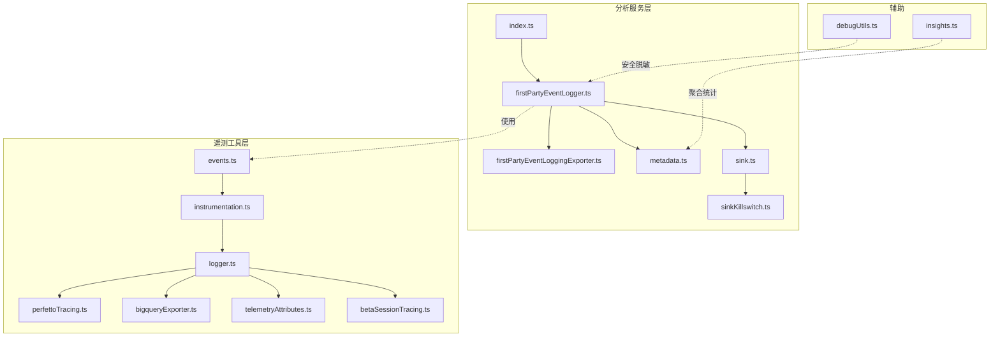
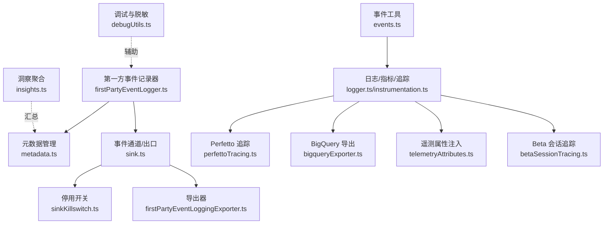
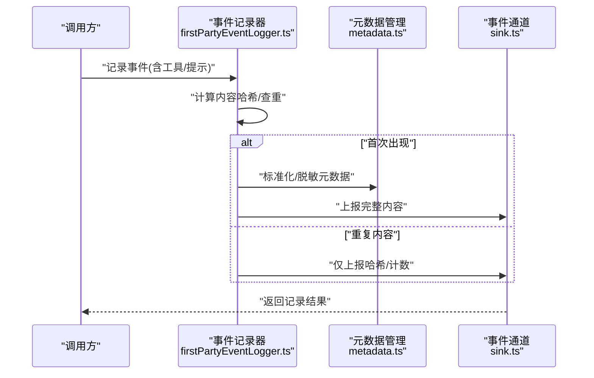
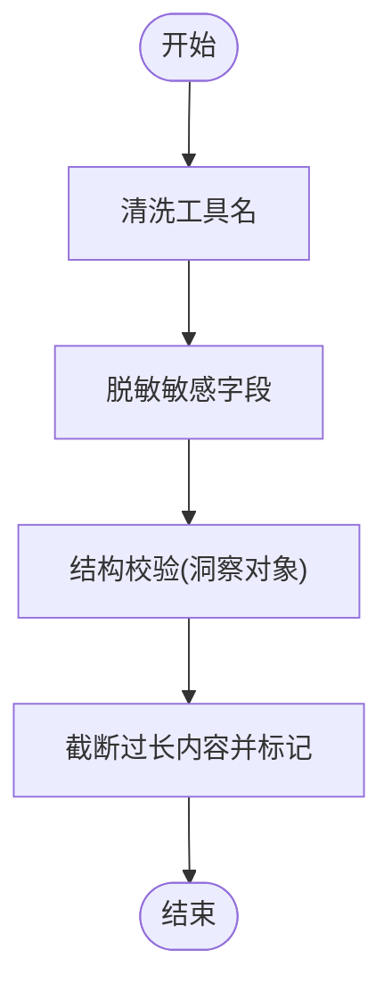
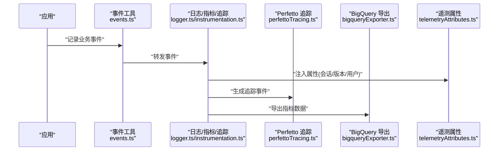
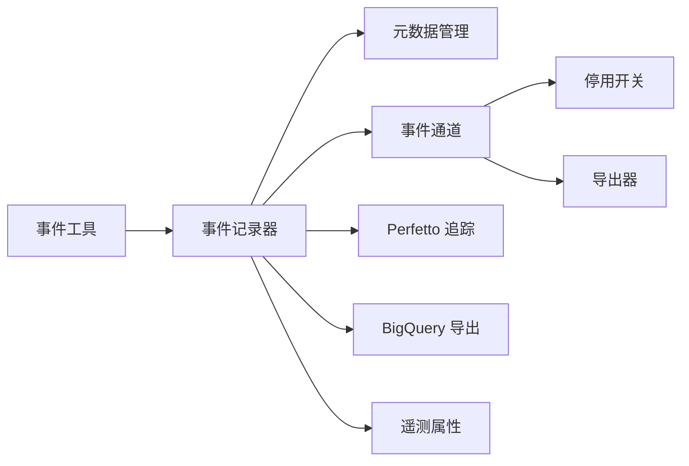

# 数据分析与收集

<cite>
**本文引用的文件**   
- [src/services/analytics/index.ts](file://src/services/analytics/index.ts)
- [src/services/analytics/firstPartyEventLogger.ts](file://src/services/analytics/firstPartyEventLogger.ts)
- [src/services/analytics/firstPartyEventLoggingExporter.ts](file://src/services/analytics/firstPartyEventLoggingExporter.ts)
- [src/services/analytics/metadata.ts](file://src/services/analytics/metadata.ts)
- [src/services/analytics/sink.ts](file://src/services/analytics/sink.ts)
- [src/services/analytics/sinkKillswitch.ts](file://src/services/analytics/sinkKillswitch.ts)
- [src/utils/telemetry/events.ts](file://src/utils/telemetry/events.ts)
- [src/utils/telemetry/instrumentation.ts](file://src/utils/telemetry/instrumentation.ts)
- [src/utils/telemetry/logger.ts](file://src/utils/telemetry/logger.ts)
- [src/utils/telemetry/perfettoTracing.ts](file://src/utils/telemetry/perfettoTracing.ts)
- [src/utils/telemetry/bigqueryExporter.ts](file://src/utils/telemetry/bigqueryExporter.ts)
- [src/utils/telemetryAttributes.ts](file://src/utils/telemetryAttributes.ts)
- [src/utils/telemetry/betaSessionTracing.ts](file://src/utils/telemetry/betaSessionTracing.ts)
- [src/bridge/debugUtils.ts](file://src/bridge/debugUtils.ts)
- [src/commands/insights.ts](file://src/commands/insights.ts)
</cite>

## 目录
1. [引言](#引言)
2. [项目结构](#项目结构)
3. [核心组件](#核心组件)
4. [架构总览](#架构总览)
5. [详细组件分析](#详细组件分析)
6. [依赖关系分析](#依赖关系分析)
7. [性能考量](#性能考量)
8. [故障排除指南](#故障排除指南)
9. [结论](#结论)
10. [附录](#附录)

## 引言
本文件面向“数据分析与收集系统”的设计与实现，聚焦以下目标：
- 数据收集的配置选项与触发条件
- 元数据管理机制与事件日志记录
- 第一方事件记录器的实现原理与使用方法
- 数据格式标准化与数据质量保证措施
- 最佳实践与故障排除指南

该系统在应用内部通过“分析服务层”（analytics）与“遥测工具层”（telemetry utilities）协同工作：前者负责事件采集、元数据处理与导出；后者提供事件记录、指标导出、会话追踪与调试能力。

## 项目结构
围绕数据分析与收集的关键目录与文件如下：
- 分析服务层：src/services/analytics/*
- 遥测工具层：src/utils/telemetry/*
- 调试与安全：src/bridge/debugUtils.ts
- 洞察报告与聚合：src/commands/insights.ts

图表来源
- [src/services/analytics/index.ts](file://src/services/analytics/index.ts)
- [src/services/analytics/firstPartyEventLogger.ts](file://src/services/analytics/firstPartyEventLogger.ts)
- [src/services/analytics/firstPartyEventLoggingExporter.ts](file://src/services/analytics/firstPartyEventLoggingExporter.ts)
- [src/services/analytics/metadata.ts](file://src/services/analytics/metadata.ts)
- [src/services/analytics/sink.ts](file://src/services/analytics/sink.ts)
- [src/services/analytics/sinkKillswitch.ts](file://src/services/analytics/sinkKillswitch.ts)
- [src/utils/telemetry/events.ts](file://src/utils/telemetry/events.ts)
- [src/utils/telemetry/instrumentation.ts](file://src/utils/telemetry/instrumentation.ts)
- [src/utils/telemetry/logger.ts](file://src/utils/telemetry/logger.ts)
- [src/utils/telemetry/perfettoTracing.ts](file://src/utils/telemetry/perfettoTracing.ts)
- [src/utils/telemetry/bigqueryExporter.ts](file://src/utils/telemetry/bigqueryExporter.ts)
- [src/utils/telemetryAttributes.ts](file://src/utils/telemetryAttributes.ts)
- [src/utils/telemetry/betaSessionTracing.ts](file://src/utils/telemetry/betaSessionTracing.ts)
- [src/bridge/debugUtils.ts](file://src/bridge/debugUtils.ts)
- [src/commands/insights.ts](file://src/commands/insights.ts)

章节来源
- [src/services/analytics/index.ts](file://src/services/analytics/index.ts)
- [src/utils/telemetry/events.ts](file://src/utils/telemetry/events.ts)
- [src/utils/telemetry/logger.ts](file://src/utils/telemetry/logger.ts)
- [src/utils/telemetry/perfettoTracing.ts](file://src/utils/telemetry/perfettoTracing.ts)
- [src/utils/telemetry/bigqueryExporter.ts](file://src/utils/telemetry/bigqueryExporter.ts)
- [src/utils/telemetryAttributes.ts](file://src/utils/telemetryAttributes.ts)
- [src/utils/telemetry/betaSessionTracing.ts](file://src/utils/telemetry/betaSessionTracing.ts)
- [src/bridge/debugUtils.ts](file://src/bridge/debugUtils.ts)
- [src/commands/insights.ts](file://src/commands/insights.ts)

## 核心组件
- 分析入口与导出
  - 分析服务入口负责统一暴露事件记录接口，并协调导出器与元数据处理。
  - 关键文件：[src/services/analytics/index.ts](file://src/services/analytics/index.ts)
- 第一方事件记录器
  - 提供事件采集、去重、哈希缓存与一次性完整内容上报等机制，降低重复数据传输。
  - 关键文件：[src/services/analytics/firstPartyEventLogger.ts](file://src/services/analytics/firstPartyEventLogger.ts)
- 导出器与通道
  - 将事件或指标导出到外部系统（如 BigQuery），支持属性转换、时间戳处理与聚合临时性策略。
  - 关键文件：[src/services/analytics/firstPartyEventLoggingExporter.ts](file://src/services/analytics/firstPartyEventLoggingExporter.ts)
- 元数据管理
  - 管理事件元数据（如工具描述、系统提示等）的标准化与脱敏，避免敏感信息泄露。
  - 关键文件：[src/services/analytics/metadata.ts](file://src/services/analytics/metadata.ts)
- 事件日志与指标
  - 事件记录工具、指标记录与导出、会话追踪与性能追踪。
  - 关键文件：[src/utils/telemetry/events.ts](file://src/utils/telemetry/events.ts)、[src/utils/telemetry/logger.ts](file://src/utils/telemetry/logger.ts)、[src/utils/telemetry/instrumentation.ts](file://src/utils/telemetry/instrumentation.ts)
- 追踪与导出
  - Perfetto 追踪（Chrome Trace JSON）、BigQuery 指标导出、会话级追踪与属性注入。
  - 关键文件：[src/utils/telemetry/perfettoTracing.ts](file://src/utils/telemetry/perfettoTracing.ts)、[src/utils/telemetry/bigqueryExporter.ts](file://src/utils/telemetry/bigqueryExporter.ts)、[src/utils/telemetryAttributes.ts](file://src/utils/telemetryAttributes.ts)、[src/utils/telemetry/betaSessionTracing.ts](file://src/utils/telemetry/betaSessionTracing.ts)
- 安全与调试
  - 敏感字段脱敏、消息长度截断与调试输出控制。
  - 关键文件：[src/bridge/debugUtils.ts](file://src/bridge/debugUtils.ts)
- 统计与洞察
  - 会话洞察聚合（目标类别、结果、满意度、摩擦度统计）。
  - 关键文件：[src/commands/insights.ts](file://src/commands/insights.ts)

章节来源
- [src/services/analytics/index.ts](file://src/services/analytics/index.ts)
- [src/services/analytics/firstPartyEventLogger.ts](file://src/services/analytics/firstPartyEventLogger.ts)
- [src/services/analytics/firstPartyEventLoggingExporter.ts](file://src/services/analytics/firstPartyEventLoggingExporter.ts)
- [src/services/analytics/metadata.ts](file://src/services/analytics/metadata.ts)
- [src/utils/telemetry/events.ts](file://src/utils/telemetry/events.ts)
- [src/utils/telemetry/logger.ts](file://src/utils/telemetry/logger.ts)
- [src/utils/telemetry/instrumentation.ts](file://src/utils/telemetry/instrumentation.ts)
- [src/utils/telemetry/perfettoTracing.ts](file://src/utils/telemetry/perfettoTracing.ts)
- [src/utils/telemetry/bigqueryExporter.ts](file://src/utils/telemetry/bigqueryExporter.ts)
- [src/utils/telemetryAttributes.ts](file://src/utils/telemetryAttributes.ts)
- [src/utils/telemetry/betaSessionTracing.ts](file://src/utils/telemetry/betaSessionTracing.ts)
- [src/bridge/debugUtils.ts](file://src/bridge/debugUtils.ts)
- [src/commands/insights.ts](file://src/commands/insights.ts)

## 架构总览
整体架构由“事件采集—元数据—导出—可视化/存储”构成，支持多维度追踪与指标导出。

图表来源
- [src/services/analytics/firstPartyEventLogger.ts](file://src/services/analytics/firstPartyEventLogger.ts)
- [src/services/analytics/metadata.ts](file://src/services/analytics/metadata.ts)
- [src/services/analytics/sink.ts](file://src/services/analytics/sink.ts)
- [src/services/analytics/sinkKillswitch.ts](file://src/services/analytics/sinkKillswitch.ts)
- [src/services/analytics/firstPartyEventLoggingExporter.ts](file://src/services/analytics/firstPartyEventLoggingExporter.ts)
- [src/utils/telemetry/events.ts](file://src/utils/telemetry/events.ts)
- [src/utils/telemetry/logger.ts](file://src/utils/telemetry/logger.ts)
- [src/utils/telemetry/instrumentation.ts](file://src/utils/telemetry/instrumentation.ts)
- [src/utils/telemetry/perfettoTracing.ts](file://src/utils/telemetry/perfettoTracing.ts)
- [src/utils/telemetry/bigqueryExporter.ts](file://src/utils/telemetry/bigqueryExporter.ts)
- [src/utils/telemetryAttributes.ts](file://src/utils/telemetryAttributes.ts)
- [src/utils/telemetry/betaSessionTracing.ts](file://src/utils/telemetry/betaSessionTracing.ts)
- [src/bridge/debugUtils.ts](file://src/bridge/debugUtils.ts)
- [src/commands/insights.ts](file://src/commands/insights.ts)

## 详细组件分析

### 第一方事件记录器（First-Party Event Logger）
- 设计目标
  - 降低重复数据传输：对系统提示、工具描述等大体量且低频变更内容采用哈希去重，仅首次上报完整内容。
  - 事件标准化：统一事件结构，便于后续导出与聚合。
  - 可观测性增强：在会话内记录工具清单、消息上下文哈希等，提升问题定位效率。
- 实现要点
  - 哈希缓存：维护已上报的哈希集合，避免重复上报。
  - 工具描述上报：解析工具列表，计算哈希，按需一次性上报完整描述，其余请求仅携带名称与哈希。
  - 内容截断：对超长内容进行截断并标记，确保事件大小可控。
  - 错误兜底：解析失败时记录解析错误属性，保证可观测性不中断。
- 触发条件与过滤规则
  - 会话内首次出现新的工具或系统提示时触发完整内容上报。
  - 对于重复内容，仅上报哈希与计数类属性。
- 使用方法
  - 在需要记录工具使用、系统提示变更等场景调用事件记录接口，内部自动完成去重与哈希管理。

图表来源
- [src/services/analytics/firstPartyEventLogger.ts](file://src/services/analytics/firstPartyEventLogger.ts)
- [src/services/analytics/metadata.ts](file://src/services/analytics/metadata.ts)
- [src/services/analytics/sink.ts](file://src/services/analytics/sink.ts)

章节来源
- [src/services/analytics/firstPartyEventLogger.ts](file://src/services/analytics/firstPartyEventLogger.ts)
- [src/services/analytics/metadata.ts](file://src/services/analytics/metadata.ts)
- [src/utils/telemetry/betaSessionTracing.ts](file://src/utils/telemetry/betaSessionTracing.ts)

### 元数据管理机制
- 标准化流程
  - 工具名清洗：去除不可信字符，确保事件字段一致性。
  - 敏感信息脱敏：对令牌、密钥等字段进行脱敏处理，避免泄露。
- 质量保证
  - 结构校验：对聚合后的洞察对象进行类型校验，确保后续统计可靠。
  - 截断与标记：对过长内容进行截断并标注，兼顾可读性与完整性。

图表来源
- [src/services/analytics/metadata.ts](file://src/services/analytics/metadata.ts)
- [src/bridge/debugUtils.ts](file://src/bridge/debugUtils.ts)
- [src/commands/insights.ts](file://src/commands/insights.ts)

章节来源
- [src/services/analytics/metadata.ts](file://src/services/analytics/metadata.ts)
- [src/bridge/debugUtils.ts](file://src/bridge/debugUtils.ts)
- [src/commands/insights.ts](file://src/commands/insights.ts)

### 事件日志记录与导出
- 事件记录
  - 事件工具提供统一的事件记录入口，结合日志/指标/追踪模块，形成完整的可观测体系。
- 指标导出
  - BigQuery 导出器负责将指标转换为资源属性与数据点，支持时间戳转换与聚合临时性策略。
- 追踪与属性
  - Perfetto 追踪生成 Chrome Trace JSON，支持事件容量控制与周期写入。
  - 遥测属性注入根据环境变量决定是否包含会话 ID、版本号等属性，控制指标卡迪纳尔性。

图表来源
- [src/utils/telemetry/events.ts](file://src/utils/telemetry/events.ts)
- [src/utils/telemetry/logger.ts](file://src/utils/telemetry/logger.ts)
- [src/utils/telemetry/instrumentation.ts](file://src/utils/telemetry/instrumentation.ts)
- [src/utils/telemetry/perfettoTracing.ts](file://src/utils/telemetry/perfettoTracing.ts)
- [src/utils/telemetry/bigqueryExporter.ts](file://src/utils/telemetry/bigqueryExporter.ts)
- [src/utils/telemetryAttributes.ts](file://src/utils/telemetryAttributes.ts)

章节来源
- [src/utils/telemetry/events.ts](file://src/utils/telemetry/events.ts)
- [src/utils/telemetry/logger.ts](file://src/utils/telemetry/logger.ts)
- [src/utils/telemetry/instrumentation.ts](file://src/utils/telemetry/instrumentation.ts)
- [src/utils/telemetry/perfettoTracing.ts](file://src/utils/telemetry/perfettoTracing.ts)
- [src/utils/telemetry/bigqueryExporter.ts](file://src/utils/telemetry/bigqueryExporter.ts)
- [src/utils/telemetryAttributes.ts](file://src/utils/telemetryAttributes.ts)

### 数据格式标准化与质量保证
- 标准化
  - 事件字段命名与结构统一，工具名清洗与脱敏。
  - 指标导出时将属性转换为字符串，确保下游兼容性。
- 质量保证
  - 结构校验：对聚合后的洞察对象进行严格类型检查。
  - 截断与脱敏：对超长内容与敏感字段进行处理，避免性能与安全风险。
  - 卡迪纳尔性控制：通过环境变量控制属性包含范围，降低指标基数。

章节来源
- [src/services/analytics/metadata.ts](file://src/services/analytics/metadata.ts)
- [src/utils/telemetry/bigqueryExporter.ts](file://src/utils/telemetry/bigqueryExporter.ts)
- [src/utils/telemetryAttributes.ts](file://src/utils/telemetryAttributes.ts)
- [src/bridge/debugUtils.ts](file://src/bridge/debugUtils.ts)
- [src/commands/insights.ts](file://src/commands/insights.ts)

### 触发条件与过滤规则
- 触发条件
  - 工具首次出现：计算哈希并上报完整描述。
  - 系统提示/上下文变更：基于哈希判断是否需要上报。
- 过滤规则
  - 解析失败时记录解析错误属性，保证可观测性。
  - 对短长度的敏感字段直接脱敏，长字段保留首尾片段。

章节来源
- [src/services/analytics/firstPartyEventLogger.ts](file://src/services/analytics/firstPartyEventLogger.ts)
- [src/utils/telemetry/betaSessionTracing.ts](file://src/utils/telemetry/betaSessionTracing.ts)

## 依赖关系分析
- 组件耦合
  - 事件记录器依赖元数据管理与事件通道，导出器依赖事件通道与停用开关。
  - 日志/指标/追踪模块相互协作，分别负责事件记录、指标导出与会话追踪。
- 外部依赖
  - BigQuery 导出器依赖 OpenTelemetry 的指标数据结构与时间戳转换。
  - Perfetto 追踪依赖会话 ID 与进程/线程信息，用于生成 Chrome Trace JSON。
- 循环依赖
  - 当前结构未见循环依赖迹象，各模块职责清晰。

图表来源
- [src/services/analytics/firstPartyEventLogger.ts](file://src/services/analytics/firstPartyEventLogger.ts)
- [src/services/analytics/metadata.ts](file://src/services/analytics/metadata.ts)
- [src/services/analytics/sink.ts](file://src/services/analytics/sink.ts)
- [src/services/analytics/sinkKillswitch.ts](file://src/services/analytics/sinkKillswitch.ts)
- [src/services/analytics/firstPartyEventLoggingExporter.ts](file://src/services/analytics/firstPartyEventLoggingExporter.ts)
- [src/utils/telemetry/events.ts](file://src/utils/telemetry/events.ts)
- [src/utils/telemetry/logger.ts](file://src/utils/telemetry/logger.ts)
- [src/utils/telemetry/perfettoTracing.ts](file://src/utils/telemetry/perfettoTracing.ts)
- [src/utils/telemetry/bigqueryExporter.ts](file://src/utils/telemetry/bigqueryExporter.ts)
- [src/utils/telemetryAttributes.ts](file://src/utils/telemetryAttributes.ts)

章节来源
- [src/services/analytics/firstPartyEventLogger.ts](file://src/services/analytics/firstPartyEventLogger.ts)
- [src/services/analytics/firstPartyEventLoggingExporter.ts](file://src/services/analytics/firstPartyEventLoggingExporter.ts)
- [src/utils/telemetry/logger.ts](file://src/utils/telemetry/logger.ts)
- [src/utils/telemetry/perfettoTracing.ts](file://src/utils/telemetry/perfettoTracing.ts)
- [src/utils/telemetry/bigqueryExporter.ts](file://src/utils/telemetry/bigqueryExporter.ts)

## 性能考量
- 指标卡迪纳尔性控制
  - 通过环境变量控制是否包含会话 ID、版本号等高基数属性，避免指标风暴。
- 事件容量与截断
  - Perfetto 追踪设置最大事件数量，超过阈值时丢弃最旧一半并插入截断标记，保持内存占用稳定。
- 导出与刷新
  - BigQuery 导出器在关闭与强制刷新时等待所有待处理导出完成，确保数据一致性。
- 内容哈希与去重
  - 事件记录器对重复内容仅上报哈希，显著减少网络与存储开销。

章节来源
- [src/utils/telemetryAttributes.ts](file://src/utils/telemetryAttributes.ts)
- [src/utils/telemetry/perfettoTracing.ts](file://src/utils/telemetry/perfettoTracing.ts)
- [src/utils/telemetry/bigqueryExporter.ts](file://src/utils/telemetry/bigqueryExporter.ts)
- [src/services/analytics/firstPartyEventLogger.ts](file://src/services/analytics/firstPartyEventLogger.ts)

## 故障排除指南
- 事件未上报
  - 检查事件通道是否被停用开关屏蔽。
  - 确认事件记录器是否正确计算哈希并命中去重逻辑。
- 指标导出异常
  - 检查资源属性转换与时间戳转换逻辑，确认属性非空。
  - 查看导出器关闭/刷新日志，确保已完成强制刷新。
- 追踪文件过大
  - 检查事件上限与周期清理逻辑，确认已触发截断与丢弃策略。
- 敏感信息泄露
  - 确认调试输出已启用脱敏与截断，避免将完整令牌等信息打印到日志中。
- 洞察统计异常
  - 校验聚合对象的结构校验函数，确保输入数据符合预期类型。

章节来源
- [src/services/analytics/sinkKillswitch.ts](file://src/services/analytics/sinkKillswitch.ts)
- [src/services/analytics/sink.ts](file://src/services/analytics/sink.ts)
- [src/utils/telemetry/bigqueryExporter.ts](file://src/utils/telemetry/bigqueryExporter.ts)
- [src/utils/telemetry/perfettoTracing.ts](file://src/utils/telemetry/perfettoTracing.ts)
- [src/bridge/debugUtils.ts](file://src/bridge/debugUtils.ts)
- [src/commands/insights.ts](file://src/commands/insights.ts)

## 结论
该数据分析与收集系统通过“事件记录器—元数据—导出器—追踪/指标”的分层设计，实现了高效、可扩展且安全的数据采集与分析能力。其核心优势包括：
- 哈希去重与一次性完整上报，显著降低带宽与存储压力
- 元数据标准化与脱敏，保障数据质量与隐私安全
- 多维度追踪与指标导出，满足不同场景下的可观测性需求
- 环境变量驱动的卡迪纳尔性控制与容量管理，确保系统稳定性

## 附录
- 最佳实践
  - 启用卡迪纳尔性控制：根据部署环境调整属性包含范围，避免高基数指标。
  - 启用调试脱敏：生产环境开启敏感字段脱敏与消息截断，防止信息泄露。
  - 合理设置追踪容量：监控事件上限与周期清理，必要时调整阈值以平衡性能与可观测性。
  - 结构化校验：在数据进入聚合阶段前进行类型校验，确保统计准确性。
- 常见问题
  - 事件未上报：检查停用开关与哈希去重逻辑。
  - 指标缺失：检查属性转换与导出器刷新流程。
  - 追踪文件异常：检查容量上限与截断标记。