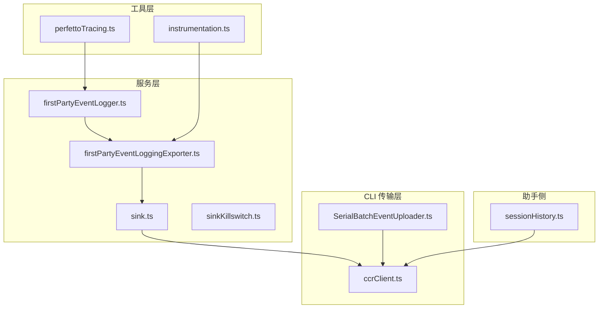
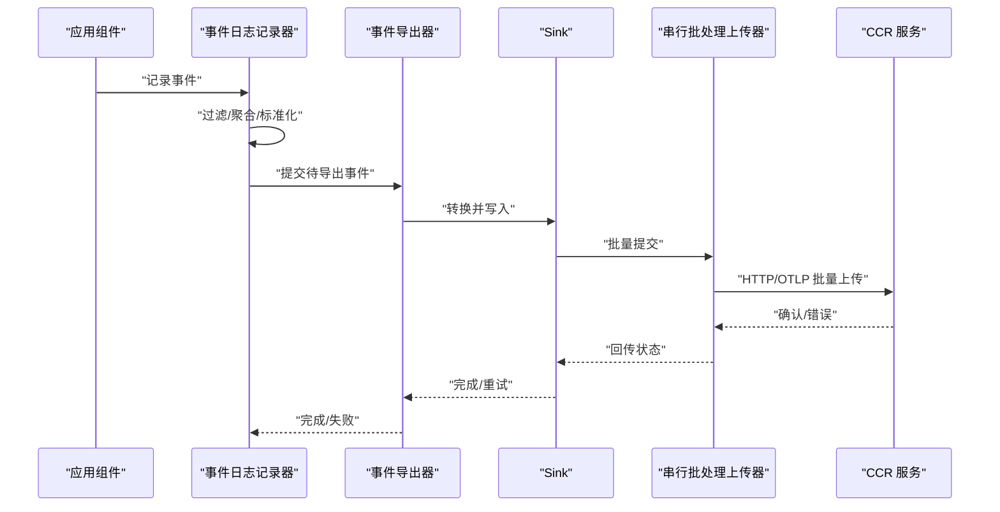
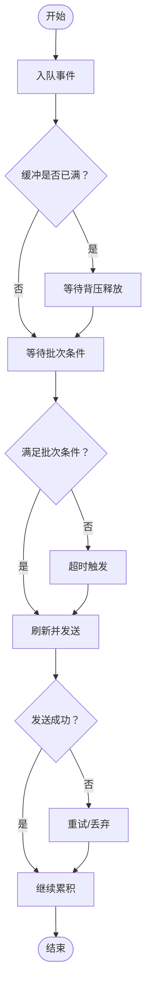
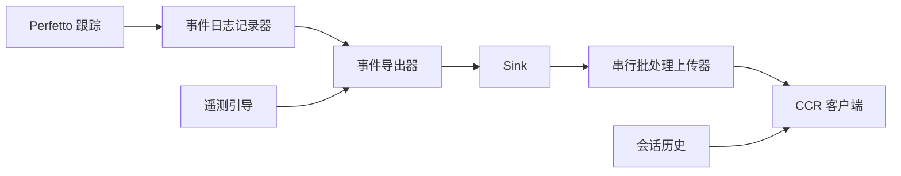

# 第一方分析

<cite>
**本文引用的文件**   
- [src/services/analytics/firstPartyEventLogger.ts](file://src/services/analytics/firstPartyEventLogger.ts)
- [src/services/analytics/firstPartyEventLoggingExporter.ts](file://src/services/analytics/firstPartyEventLoggingExporter.ts)
- [src/services/analytics/sink.ts](file://src/services/analytics/sink.ts)
- [src/services/analytics/sinkKillswitch.ts](file://src/services/analytics/sinkKillswitch.ts)
- [src/cli/transports/SerialBatchEventUploader.ts](file://src/cli/transports/SerialBatchEventUploader.ts)
- [src/cli/transports/ccrClient.ts](file://src/cli/transports/ccrClient.ts)
- [src/utils/telemetry/instrumentation.ts](file://src/utils/telemetry/instrumentation.ts)
- [src/utils/telemetry/perfettoTracing.ts](file://src/utils/telemetry/perfettoTracing.ts)
- [src/assistant/sessionHistory.ts](file://src/assistant/sessionHistory.ts)
</cite>

## 目录
1. [引言](#引言)
2. [项目结构](#项目结构)
3. [核心组件](#核心组件)
4. [架构总览](#架构总览)
5. [详细组件分析](#详细组件分析)
6. [依赖关系分析](#依赖关系分析)
7. [性能考量](#性能考量)
8. [故障排查指南](#故障排查指南)
9. [结论](#结论)
10. [附录](#附录)

## 引言
本文件面向“第一方分析”子系统，系统性阐述事件日志记录器的实现原理、事件类型定义、事件导出器的数据传输机制与格式转换、事件数据的批处理与实时处理策略、事件过滤与聚合算法、事件数据的存储与查询优化、以及事件数据的生命周期管理与清理策略。目标是帮助开发者与运维人员快速理解并高效维护该分析体系。

## 项目结构
第一方分析相关代码主要分布在以下位置：
- 服务层：事件日志记录器与导出器、事件接收与落库的 Sink 组件、禁用开关
- CLI 传输层：串行批处理上传器、与 CCR（会话事件）服务交互的客户端
- 工具层：遥测引导与 OTel 导出器配置、Perfetto 跟踪与事件生命周期管理
- 助手侧：会话历史拉取接口，用于查询与回放事件

**图示来源**
- [src/services/analytics/firstPartyEventLogger.ts](file://src/services/analytics/firstPartyEventLogger.ts)
- [src/services/analytics/firstPartyEventLoggingExporter.ts](file://src/services/analytics/firstPartyEventLoggingExporter.ts)
- [src/services/analytics/sink.ts](file://src/services/analytics/sink.ts)
- [src/services/analytics/sinkKillswitch.ts](file://src/services/analytics/sinkKillswitch.ts)
- [src/cli/transports/SerialBatchEventUploader.ts](file://src/cli/transports/SerialBatchEventUploader.ts)
- [src/cli/transports/ccrClient.ts](file://src/cli/transports/ccrClient.ts)
- [src/utils/telemetry/instrumentation.ts](file://src/utils/telemetry/instrumentation.ts)
- [src/utils/telemetry/perfettoTracing.ts](file://src/utils/telemetry/perfettoTracing.ts)
- [src/assistant/sessionHistory.ts](file://src/assistant/sessionHistory.ts)

**章节来源**
- [src/services/analytics/firstPartyEventLogger.ts](file://src/services/analytics/firstPartyEventLogger.ts)
- [src/services/analytics/firstPartyEventLoggingExporter.ts](file://src/services/analytics/firstPartyEventLoggingExporter.ts)
- [src/services/analytics/sink.ts](file://src/services/analytics/sink.ts)
- [src/services/analytics/sinkKillswitch.ts](file://src/services/analytics/sinkKillswitch.ts)
- [src/cli/transports/SerialBatchEventUploader.ts](file://src/cli/transports/SerialBatchEventUploader.ts)
- [src/cli/transports/ccrClient.ts](file://src/cli/transports/ccrClient.ts)
- [src/utils/telemetry/instrumentation.ts](file://src/utils/telemetry/instrumentation.ts)
- [src/utils/telemetry/perfettoTracing.ts](file://src/utils/telemetry/perfettoTracing.ts)
- [src/assistant/sessionHistory.ts](file://src/assistant/sessionHistory.ts)

## 核心组件
- 事件日志记录器：负责收集、标准化与缓冲事件，支持过滤与聚合策略，并通过导出器发送到下游。
- 事件导出器：封装 OTLP/HTTP 等导出协议，配置导出间隔与超时，统一事件格式转换。
- Sink 组件：将事件写入内部或外部存储，提供失败重试与降级能力。
- 串行批处理上传器：在内存中累积事件，按批次与背压策略进行异步发送，保证吞吐与稳定性。
- CCR 客户端：与会话事件服务交互，支持分页获取与流式事件缓冲合并。
- 遥测引导与 Perfetto：初始化 OTel 导出器、设置默认时间序偏好、管理事件生命周期与测试触发。

**章节来源**
- [src/services/analytics/firstPartyEventLogger.ts](file://src/services/analytics/firstPartyEventLogger.ts)
- [src/services/analytics/firstPartyEventLoggingExporter.ts](file://src/services/analytics/firstPartyEventLoggingExporter.ts)
- [src/services/analytics/sink.ts](file://src/services/analytics/sink.ts)
- [src/cli/transports/SerialBatchEventUploader.ts](file://src/cli/transports/SerialBatchEventUploader.ts)
- [src/cli/transports/ccrClient.ts](file://src/cli/transports/ccrClient.ts)
- [src/utils/telemetry/instrumentation.ts](file://src/utils/telemetry/instrumentation.ts)
- [src/utils/telemetry/perfettoTracing.ts](file://src/utils/telemetry/perfettoTracing.ts)

## 架构总览
下图展示了从事件产生到持久化/导出的关键路径，包括实时与批处理两条主线：

**图示来源**
- [src/services/analytics/firstPartyEventLogger.ts](file://src/services/analytics/firstPartyEventLogger.ts)
- [src/services/analytics/firstPartyEventLoggingExporter.ts](file://src/services/analytics/firstPartyEventLoggingExporter.ts)
- [src/services/analytics/sink.ts](file://src/services/analytics/sink.ts)
- [src/cli/transports/SerialBatchEventUploader.ts](file://src/cli/transports/SerialBatchEventUploader.ts)
- [src/cli/transports/ccrClient.ts](file://src/cli/transports/ccrClient.ts)

## 详细组件分析

### 事件日志记录器
- 职责
  - 接收事件输入，执行过滤与聚合，生成标准化事件。
  - 维护事件缓冲区，结合背压策略控制内存占用。
  - 触发导出流程，处理异常与重试。
- 关键行为
  - 过滤：基于事件类型、上下文标签或黑名单规则剔除不必要事件。
  - 聚合：对高频事件进行去抖/合并，减少冗余。
  - 标准化：统一字段命名、时间戳格式、序列化方式。
  - 缓冲：在内存中累积，达到阈值或超时后触发导出。
- 与导出器协作
  - 将标准化后的事件交由导出器进行协议转换与发送。

**章节来源**
- [src/services/analytics/firstPartyEventLogger.ts](file://src/services/analytics/firstPartyEventLogger.ts)

### 事件导出器（OTLP/HTTP）
- 职责
  - 基于环境变量配置 OTLP 协议、端点与头部信息。
  - 设置指标/日志/追踪的默认导出间隔与时间序偏好。
  - 将事件转换为 OTel 日志记录格式，按周期或手动触发导出。
- 关键行为
  - 解析导出器类型列表（如 console/otlp），动态构建导出器实例。
  - 支持超时控制与错误传播，避免阻塞主流程。
  - 与遥测引导配合，确保默认参数一致。
- 数据格式
  - 输出为 OTel 日志记录对象，包含属性、时间戳、级别等字段。

**章节来源**
- [src/utils/telemetry/instrumentation.ts](file://src/utils/telemetry/instrumentation.ts)

### Sink 组件与禁用开关
- 职责
  - 将事件写入目标存储（本地或远端），支持失败重试与降级。
  - 提供禁用开关以快速关闭事件上报，保障系统稳定性。
- 关键行为
  - 写入成功/失败的幂等处理与幂等键设计。
  - 在禁用状态下直接丢弃事件，避免额外开销。
  - 记录丢弃计数与队列深度，便于诊断。

**章节来源**
- [src/services/analytics/sink.ts](file://src/services/analytics/sink.ts)
- [src/services/analytics/sinkKillswitch.ts](file://src/services/analytics/sinkKillswitch.ts)

### 串行批处理上传器
- 职责
  - 在内存中累积事件，按批次大小与超时策略进行异步发送。
  - 实现背压与暂停/恢复机制，防止内存峰值过高。
- 关键行为
  - 入队：当缓冲满时阻塞调用者，直到有空间。
  - 拖尾：定时器或显式 flush 合并流式事件，减少碎片化。
  - 丢弃统计：记录因连续失败而丢弃的批次数量。
  - 关闭：记录关闭时的挂起队列长度，便于停机诊断。

**图示来源**
- [src/cli/transports/SerialBatchEventUploader.ts](file://src/cli/transports/SerialBatchEventUploader.ts)

**章节来源**
- [src/cli/transports/SerialBatchEventUploader.ts](file://src/cli/transports/SerialBatchEventUploader.ts)

### CCR 客户端与流式事件缓冲
- 职责
  - 与会话事件服务交互，支持分页拉取与重试。
  - 对流式事件（如文本增量）进行缓冲与合并，再统一入队发送。
- 关键行为
  - 分页 GET：自动携带游标，指数退避重试。
  - 流事件合并：将同一消息的增量片段聚合成完整事件。
  - 临时标记：对流事件设置短暂生命周期标记，便于后续处理。

**章节来源**
- [src/cli/transports/ccrClient.ts](file://src/cli/transports/ccrClient.ts)

### Perfetto 跟踪与事件生命周期
- 职责
  - 管理事件缓存上限、定期写盘与过期清理。
  - 提供测试触发接口，支持立即写盘与驱逐最旧事件。
- 关键行为
  - 最大事件数限制：超过阈值时驱逐最旧事件。
  - 定期写盘：降低内存压力，提升可靠性。
  - 测试辅助：在单测中可强制触发写盘与清理。

**章节来源**
- [src/utils/telemetry/perfettoTracing.ts](file://src/utils/telemetry/perfettoTracing.ts)

### 会话历史查询接口
- 职责
  - 从服务端拉取最新或更早的历史事件，支持分页与校验。
- 关键行为
  - 最新页面：按锚点获取最近若干事件。
  - 更早页面：基于游标向前翻页。
  - 错误处理：网络异常或状态码非 200 时返回空结果并记录调试日志。

**章节来源**
- [src/assistant/sessionHistory.ts](file://src/assistant/sessionHistory.ts)

## 依赖关系分析
- 组件耦合
  - 日志记录器依赖导出器；导出器依赖遥测引导配置；Sink 依赖上传器；CCR 客户端独立但被 Sink 使用。
- 外部依赖
  - OTLP/HTTP 协议栈、网络请求库、事件存储后端。
- 循环依赖
  - 当前模块间无明显循环导入；若扩展需避免双向依赖。

**图示来源**
- [src/services/analytics/firstPartyEventLogger.ts](file://src/services/analytics/firstPartyEventLogger.ts)
- [src/services/analytics/firstPartyEventLoggingExporter.ts](file://src/services/analytics/firstPartyEventLoggingExporter.ts)
- [src/services/analytics/sink.ts](file://src/services/analytics/sink.ts)
- [src/cli/transports/SerialBatchEventUploader.ts](file://src/cli/transports/SerialBatchEventUploader.ts)
- [src/cli/transports/ccrClient.ts](file://src/cli/transports/ccrClient.ts)
- [src/utils/telemetry/instrumentation.ts](file://src/utils/telemetry/instrumentation.ts)
- [src/utils/telemetry/perfettoTracing.ts](file://src/utils/telemetry/perfettoTracing.ts)
- [src/assistant/sessionHistory.ts](file://src/assistant/sessionHistory.ts)

## 性能考量
- 批处理策略
  - 通过缓冲与定时器合并小事件，降低网络往返与存储写放大。
  - 合理设置批次大小与超时，平衡延迟与吞吐。
- 背压与内存
  - 入队阻塞与暂停恢复机制避免内存暴涨；关闭时记录挂起队列长度，便于排障。
- 导出间隔
  - 日志默认导出间隔较短，适合实时观测；指标与追踪间隔较长，降低开销。
- 序列化与格式
  - OTel 日志记录格式统一且紧凑，减少带宽与存储成本。
- 清理与写盘
  - Perfetto 定期写盘与驱逐最旧事件，维持稳定内存占用。

[本节为通用性能建议，无需特定文件来源]

## 故障排查指南
- 导出失败
  - 检查 OTLP 端点、协议与头部配置；查看遥测引导日志与超时错误。
  - 关注导出器的超时错误类型，定位网络或服务端问题。
- 事件丢失
  - 查看串行批处理上传器的丢弃计数与挂起队列；确认关闭时机。
  - 检查 Sink 的禁用开关状态与重试策略。
- 流式事件未完整
  - 确认流事件缓冲与定时器是否正确触发合并；检查临时标记与后续处理逻辑。
- 历史查询异常
  - 检查 HTTP 状态码与响应体；关注分页游标与重试逻辑。

**章节来源**
- [src/utils/telemetry/instrumentation.ts](file://src/utils/telemetry/instrumentation.ts)
- [src/cli/transports/SerialBatchEventUploader.ts](file://src/cli/transports/SerialBatchEventUploader.ts)
- [src/services/analytics/sink.ts](file://src/services/analytics/sink.ts)
- [src/cli/transports/ccrClient.ts](file://src/cli/transports/ccrClient.ts)
- [src/assistant/sessionHistory.ts](file://src/assistant/sessionHistory.ts)

## 结论
第一方分析系统通过“日志记录器 + 导出器 + Sink + 上传器”的分层设计，实现了事件的标准化、批处理与实时传输。借助 OTLP 协议与 Perfetto 生命周期管理，系统在保证可观测性的同时兼顾了性能与稳定性。建议在生产环境中结合业务特征调整批处理阈值与导出间隔，并持续监控丢弃计数与导出延迟，以获得最佳体验。

[本节为总结性内容，无需特定文件来源]

## 附录

### 事件类型定义（概要）
- 事件分类
  - 用户交互事件：会话消息、工具调用、键盘/鼠标行为等。
  - 系统运行事件：启动、崩溃、性能指标、资源使用等。
  - 业务事件：功能使用次数、转化路径、留存等。
- 字段规范
  - 必填：事件 ID、时间戳、会话 ID、用户标识。
  - 可选：来源、标签、元数据、上下文快照。
- 标准化
  - 统一时间格式与时区；属性键名小写+下划线；枚举值集中化。

[本节为概念性说明，无需特定文件来源]

### 数据传输机制与格式转换
- 协议
  - OTLP/HTTP：适用于日志与指标导出；支持自定义头部与端点。
- 转换
  - 将内部事件映射为 OTel 日志记录对象；设置属性与级别。
- 超时与重试
  - 导出器内置超时控制；网络错误与服务端错误区分处理。

**章节来源**
- [src/utils/telemetry/instrumentation.ts](file://src/utils/telemetry/instrumentation.ts)

### 批处理与实时处理策略
- 批处理
  - 串行批处理上传器按批次与超时触发；支持拖尾合并与背压。
- 实时处理
  - 流式事件缓冲与定时器合并；关闭前显式 flush。
- 调度
  - 日志默认导出间隔较短，追踪与指标间隔较长。

**章节来源**
- [src/cli/transports/SerialBatchEventUploader.ts](file://src/cli/transports/SerialBatchEventUploader.ts)
- [src/cli/transports/ccrClient.ts](file://src/cli/transports/ccrClient.ts)
- [src/utils/telemetry/instrumentation.ts](file://src/utils/telemetry/instrumentation.ts)

### 过滤与聚合算法
- 过滤
  - 类型白名单/黑名单、上下文标签匹配、采样率控制。
- 聚合
  - 时间窗口内的去抖与合并；高频事件降采样。
- 聚合粒度
  - 会话级、用户级、功能级多维聚合，支持可配置阈值。

[本节为通用算法说明，无需特定文件来源]

### 存储方案与查询优化
- 存储
  - 本地磁盘（日志文件）、远端数据库（结构化/时序）。
- 查询
  - 基于时间范围、会话 ID、标签的索引；分页游标与缓存。
- 优化
  - 列式存储与压缩；热点数据冷热分离；只读副本分担查询压力。

[本节为通用技术建议，无需特定文件来源]

### 生命周期管理与清理策略
- 生命周期
  - 事件从产生到落库/导出再到清理的全链路管理。
- 清理
  - Perfetto 驱逐最旧事件；导出成功后删除临时标记。
- 测试
  - 提供立即写盘与驱逐最旧事件的测试入口。

**章节来源**
- [src/utils/telemetry/perfettoTracing.ts](file://src/utils/telemetry/perfettoTracing.ts)