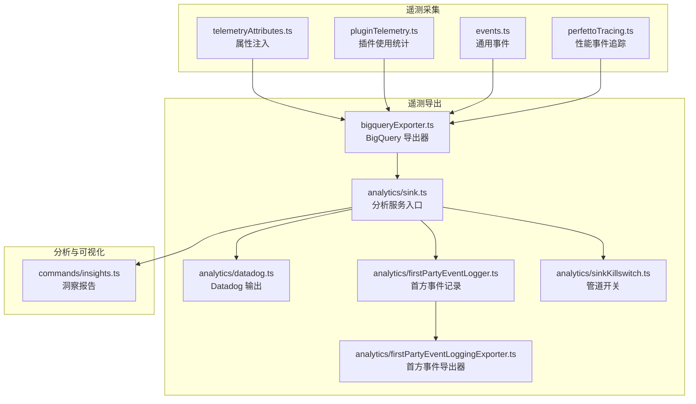
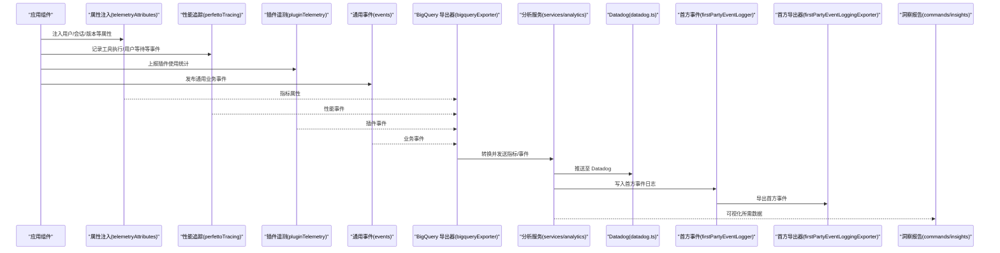
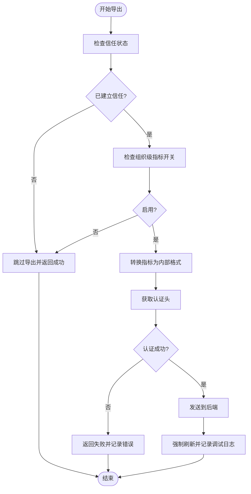
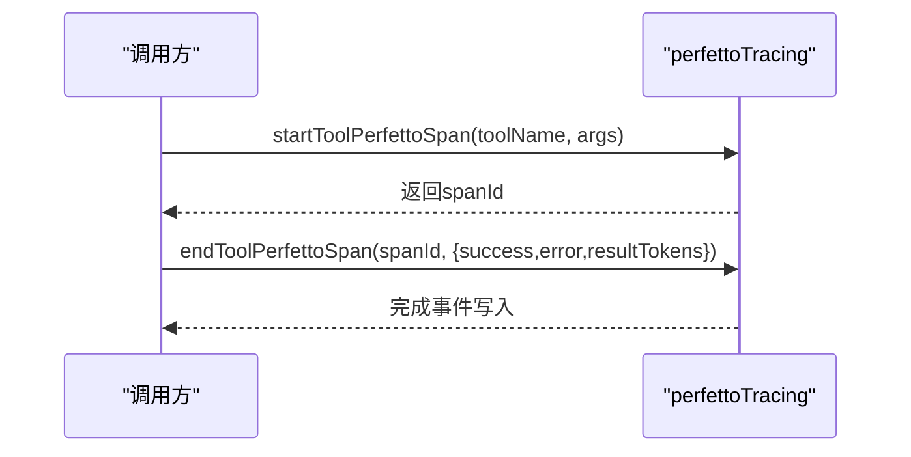
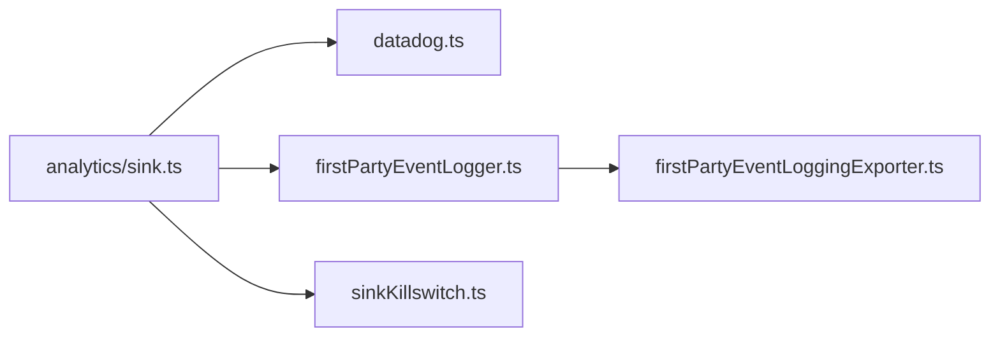
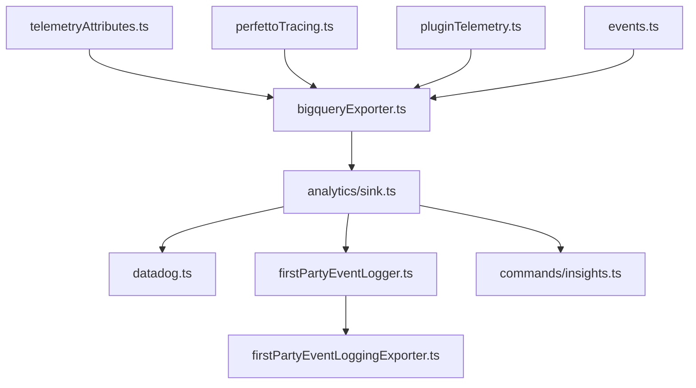

# 遥测与分析

<cite>
**本文引用的文件**
- [bigqueryExporter.ts](file://src/utils/telemetry/bigqueryExporter.ts)
- [telemetryAttributes.ts](file://src/utils/telemetryAttributes.ts)
- [perfettoTracing.ts](file://src/utils/telemetry/perfettoTracing.ts)
- [events.ts](file://src/utils/telemetry/events.ts)
- [pluginTelemetry.ts](file://src/utils/telemetry/pluginTelemetry.ts)
- [analytics/index.ts](file://src/services/analytics/index.ts)
- [analytics/sink.ts](file://src/services/analytics/sink.ts)
- [analytics/sinkKillswitch.ts](file://src/services/analytics/sinkKillswitch.ts)
- [analytics/datadog.ts](file://src/services/analytics/datadog.ts)
- [analytics/firstPartyEventLogger.ts](file://src/services/analytics/firstPartyEventLogger.ts)
- [analytics/firstPartyEventLoggingExporter.ts](file://src/services/analytics/firstPartyEventLoggingExporter.ts)
- [commands/insights.ts](file://src/commands/insights.ts)
</cite>

## 目录
1. [简介](#简介)
2. [项目结构](#项目结构)
3. [核心组件](#核心组件)
4. [架构总览](#架构总览)
5. [详细组件分析](#详细组件分析)
6. [依赖关系分析](#依赖关系分析)
7. [性能考量](#性能考量)
8. [故障排查指南](#故障排查指南)
9. [结论](#结论)
10. [附录](#附录)

## 简介
本文件面向 Claude Code 的遥测与分析系统，系统性阐述遥测数据的采集、处理与分析机制，覆盖用户行为追踪、系统性能监控以及插件使用统计；解释数据分析管道与数据导出能力；介绍隐私保护与数据安全策略；提供数据分析报告的解读方法与趋势分析技巧；并给出自定义遥测事件的开发指南。

## 项目结构
遥测与分析相关代码主要分布在以下位置：
- 工具层（采集与导出）：src/utils/telemetry 下的 BigQuery 导出器、属性注入、性能事件追踪、插件遥测等
- 分析服务层（聚合与导出）：src/services/analytics 下的多路输出（Datadog、本地日志导出器、首方事件记录器、管道开关）
- 命令与可视化：src/commands/insights.ts 提供洞察报告生成与可视化

图表来源
- [bigqueryExporter.ts:87-128](file://src/utils/telemetry/bigqueryExporter.ts#L87-L128)
- [telemetryAttributes.ts:29-42](file://src/utils/telemetryAttributes.ts#L29-L42)
- [perfettoTracing.ts:696-835](file://src/utils/telemetry/perfettoTracing.ts#L696-L835)
- [pluginTelemetry.ts](file://src/utils/telemetry/pluginTelemetry.ts)
- [events.ts](file://src/utils/telemetry/events.ts)
- [analytics/index.ts](file://src/services/analytics/index.ts)
- [analytics/sink.ts](file://src/services/analytics/sink.ts)
- [analytics/datadog.ts](file://src/services/analytics/datadog.ts)
- [analytics/firstPartyEventLogger.ts](file://src/services/analytics/firstPartyEventLogger.ts)
- [analytics/firstPartyEventLoggingExporter.ts](file://src/services/analytics/firstPartyEventLoggingExporter.ts)
- [analytics/sinkKillswitch.ts](file://src/services/analytics/sinkKillswitch.ts)
- [commands/insights.ts:2542-2719](file://src/commands/insights.ts#L2542-L2719)

章节来源
- [bigqueryExporter.ts:87-128](file://src/utils/telemetry/bigqueryExporter.ts#L87-L128)
- [telemetryAttributes.ts:29-42](file://src/utils/telemetryAttributes.ts#L29-L42)
- [perfettoTracing.ts:696-835](file://src/utils/telemetry/perfettoTracing.ts#L696-L835)
- [pluginTelemetry.ts](file://src/utils/telemetry/pluginTelemetry.ts)
- [events.ts](file://src/utils/telemetry/events.ts)
- [analytics/index.ts](file://src/services/analytics/index.ts)
- [analytics/sink.ts](file://src/services/analytics/sink.ts)
- [analytics/datadog.ts](file://src/services/analytics/datadog.ts)
- [analytics/firstPartyEventLogger.ts](file://src/services/analytics/firstPartyEventLogger.ts)
- [analytics/firstPartyEventLoggingExporter.ts](file://src/services/analytics/firstPartyEventLoggingExporter.ts)
- [analytics/sinkKillswitch.ts](file://src/services/analytics/sinkKillswitch.ts)
- [commands/insights.ts:2542-2719](file://src/commands/insights.ts#L2542-L2719)

## 核心组件
- 属性注入与基数控制：在指标中注入用户、会话、版本等维度，并通过环境变量控制是否包含高基数属性，降低存储与查询成本。
- 性能事件追踪（Perfetto）：围绕工具执行、用户输入等待等关键路径进行事件埋点，支持时长、结果、错误等元数据记录。
- 插件使用统计：对插件加载、调用、失败等事件进行统计，便于评估插件生态健康度与使用率。
- 通用事件：为业务事件提供统一的事件模型与上报接口。
- BigQuery 导出器：将 OpenTelemetry 指标转换为内部格式并发送到后端，包含信任状态检查与组织级开关。
- 分析服务：统一汇聚遥测数据，支持 Datadog、首方事件日志等多种下游输出，具备管道开关以快速禁用或降级。
- 洞察报告：基于历史数据生成可视化报告，包含响应时间分布、目标类别、满意度、摩擦点等汇总视图。

章节来源
- [telemetryAttributes.ts:29-42](file://src/utils/telemetryAttributes.ts#L29-L42)
- [perfettoTracing.ts:696-835](file://src/utils/telemetry/perfettoTracing.ts#L696-L835)
- [pluginTelemetry.ts](file://src/utils/telemetry/pluginTelemetry.ts)
- [events.ts](file://src/utils/telemetry/events.ts)
- [bigqueryExporter.ts:87-128](file://src/utils/telemetry/bigqueryExporter.ts#L87-L128)
- [analytics/index.ts](file://src/services/analytics/index.ts)
- [analytics/sink.ts](file://src/services/analytics/sink.ts)
- [analytics/datadog.ts](file://src/services/analytics/datadog.ts)
- [analytics/firstPartyEventLogger.ts](file://src/services/analytics/firstPartyEventLogger.ts)
- [analytics/firstPartyEventLoggingExporter.ts](file://src/services/analytics/firstPartyEventLoggingExporter.ts)
- [analytics/sinkKillswitch.ts](file://src/services/analytics/sinkKillswitch.ts)
- [commands/insights.ts:2542-2719](file://src/commands/insights.ts#L2542-L2719)

## 架构总览
下图展示从采集到导出再到可视化的完整链路：

图表来源
- [bigqueryExporter.ts:87-128](file://src/utils/telemetry/bigqueryExporter.ts#L87-L128)
- [telemetryAttributes.ts:29-42](file://src/utils/telemetryAttributes.ts#L29-L42)
- [perfettoTracing.ts:696-835](file://src/utils/telemetry/perfettoTracing.ts#L696-L835)
- [pluginTelemetry.ts](file://src/utils/telemetry/pluginTelemetry.ts)
- [events.ts](file://src/utils/telemetry/events.ts)
- [analytics/index.ts](file://src/services/analytics/index.ts)
- [analytics/sink.ts](file://src/services/analytics/sink.ts)
- [analytics/datadog.ts](file://src/services/analytics/datadog.ts)
- [analytics/firstPartyEventLogger.ts](file://src/services/analytics/firstPartyEventLogger.ts)
- [analytics/firstPartyEventLoggingExporter.ts](file://src/services/analytics/firstPartyEventLoggingExporter.ts)
- [commands/insights.ts:2542-2719](file://src/commands/insights.ts#L2542-L2719)

## 详细组件分析

### BigQuery 导出器（指标与事件导出）
- 功能要点
  - 在非交互模式下检查信任状态，未建立信任则跳过导出，避免在引导流程中触发鉴权前置逻辑
  - 组织级指标开关：若关闭，则直接返回成功，不产生网络请求
  - 指标转换：将 OpenTelemetry 指标转换为内部结构，包含资源属性、指标名、单位与数据点
  - 数据点提取：过滤数值型数据点，转换时间戳与属性
  - 认证与头信息：动态获取认证头，失败时返回失败结果并记录日志
  - 关闭流程：强制刷新并记录调试日志
- 复杂度与性能
  - 指标转换与过滤为线性复杂度，受指标数量与数据点数量影响
  - 通过组织级开关与信任状态检查可显著减少无效请求
- 错误处理
  - 认证失败、信任未建立、组织禁用均以日志提示并优雅返回

图表来源
- [bigqueryExporter.ts:87-128](file://src/utils/telemetry/bigqueryExporter.ts#L87-L128)
- [bigqueryExporter.ts:172-219](file://src/utils/telemetry/bigqueryExporter.ts#L172-L219)

章节来源
- [bigqueryExporter.ts:87-128](file://src/utils/telemetry/bigqueryExporter.ts#L87-L128)
- [bigqueryExporter.ts:172-219](file://src/utils/telemetry/bigqueryExporter.ts#L172-L219)

### 属性注入与基数控制（telemetryAttributes）
- 功能要点
  - 注入用户 ID、会话 ID、应用版本等基础属性
  - 通过环境变量控制是否包含高基数属性（如会话 ID、版本），默认开启会话 ID，关闭版本
  - 支持动态判断与布尔值解析，确保配置灵活可控
- 复杂度与性能
  - 常量时间属性构造，开销极低
- 隐私与成本
  - 通过基数控制降低唯一键数量，减少存储与查询成本，同时避免无意泄露高敏感信息

章节来源
- [telemetryAttributes.ts:29-42](file://src/utils/telemetryAttributes.ts#L29-L42)

### 性能事件追踪（perfettoTracing）
- 功能要点
  - 工具执行跨度：记录开始与结束事件，附带工具名、参数、耗时、结果令牌数、成功/错误标记
  - 用户输入等待跨度：记录等待开始与结束事件，附带上下文、决策来源、耗时
  - 跨度管理：使用内存映射保存待完成跨度，结束时移除，防止泄漏
- 复杂度与性能
  - 开销主要来自事件写入与时间戳计算，通常为常量级
- 使用建议
  - 在关键路径（工具调用、用户交互）成对调用开始/结束函数
  - 结束时传入必要的元数据（如错误、结果令牌数）

图表来源
- [perfettoTracing.ts:696-835](file://src/utils/telemetry/perfettoTracing.ts#L696-L835)

章节来源
- [perfettoTracing.ts:696-835](file://src/utils/telemetry/perfettoTracing.ts#L696-L835)

### 插件使用统计（pluginTelemetry）
- 功能要点
  - 对插件生命周期与使用情况进行统计，便于评估生态健康度与使用趋势
  - 与 BigQuery 导出器协同工作，作为事件源之一参与统一导出
- 复杂度与性能
  - 统计逻辑通常为常量级，对运行时影响微小
- 数据价值
  - 用于识别热门插件、异常失败率、使用频率变化等

章节来源
- [pluginTelemetry.ts](file://src/utils/telemetry/pluginTelemetry.ts)

### 通用事件（events）
- 功能要点
  - 提供统一的事件发布接口，便于业务模块按需上报
  - 与 BigQuery 导出器集成，成为指标/事件数据源之一
- 复杂度与性能
  - 事件发布为轻量操作，对性能影响可忽略

章节来源
- [events.ts](file://src/utils/telemetry/events.ts)

### 分析服务与导出（services/analytics）
- 功能要点
  - 统一汇聚指标与事件，支持多路输出（Datadog、首方事件日志等）
  - 提供管道开关（sinkKillswitch）以快速禁用或降级
  - 首方事件记录器与导出器分离，便于审计与合规
- 复杂度与性能
  - 聚合与分发为线性复杂度，受事件速率影响
- 安全与合规
  - 管道开关可在紧急情况下阻断外部传输
  - 首方事件日志便于内部审计与溯源

图表来源
- [analytics/sink.ts](file://src/services/analytics/sink.ts)
- [analytics/datadog.ts](file://src/services/analytics/datadog.ts)
- [analytics/firstPartyEventLogger.ts](file://src/services/analytics/firstPartyEventLogger.ts)
- [analytics/firstPartyEventLoggingExporter.ts](file://src/services/analytics/firstPartyEventLoggingExporter.ts)
- [analytics/sinkKillswitch.ts](file://src/services/analytics/sinkKillswitch.ts)

章节来源
- [analytics/index.ts](file://src/services/analytics/index.ts)
- [analytics/sink.ts](file://src/services/analytics/sink.ts)
- [analytics/datadog.ts](file://src/services/analytics/datadog.ts)
- [analytics/firstPartyEventLogger.ts](file://src/services/analytics/firstPartyEventLogger.ts)
- [analytics/firstPartyEventLoggingExporter.ts](file://src/services/analytics/firstPartyEventLoggingExporter.ts)
- [analytics/sinkKillswitch.ts](file://src/services/analytics/sinkKillswitch.ts)

### 洞察报告（commands/insights）
- 功能要点
  - 基于历史数据生成可视化报告，包含响应时间分布、目标类别、满意度、摩擦点等汇总
  - 提供 HTML 报告模板与图表卡片，便于团队审阅与趋势分析
- 复杂度与性能
  - 报告生成为一次性批处理，复杂度取决于数据规模
- 使用建议
  - 将报告作为周报/双周报的一部分，结合趋势观察改进产品体验

章节来源
- [commands/insights.ts:2542-2719](file://src/commands/insights.ts#L2542-L2719)

## 依赖关系分析
- 采集层依赖
  - 属性注入为所有指标提供统一的资源属性
  - Perfetto 追踪与插件遥测作为事件源，补充性能与生态使用数据
  - 通用事件作为业务事件的统一出口
- 导出层依赖
  - BigQuery 导出器负责最终的网络传输与认证
  - 分析服务作为中枢，连接多个下游（Datadog、首方事件）
- 可视化依赖
  - 洞察报告消费分析服务提供的数据，生成可视化内容

图表来源
- [telemetryAttributes.ts:29-42](file://src/utils/telemetryAttributes.ts#L29-L42)
- [perfettoTracing.ts:696-835](file://src/utils/telemetry/perfettoTracing.ts#L696-L835)
- [pluginTelemetry.ts](file://src/utils/telemetry/pluginTelemetry.ts)
- [events.ts](file://src/utils/telemetry/events.ts)
- [bigqueryExporter.ts:87-128](file://src/utils/telemetry/bigqueryExporter.ts#L87-L128)
- [analytics/sink.ts](file://src/services/analytics/sink.ts)
- [analytics/datadog.ts](file://src/services/analytics/datadog.ts)
- [analytics/firstPartyEventLogger.ts](file://src/services/analytics/firstPartyEventLogger.ts)
- [analytics/firstPartyEventLoggingExporter.ts](file://src/services/analytics/firstPartyEventLoggingExporter.ts)
- [commands/insights.ts:2542-2719](file://src/commands/insights.ts#L2542-L2719)

章节来源
- [bigqueryExporter.ts:87-128](file://src/utils/telemetry/bigqueryExporter.ts#L87-L128)
- [telemetryAttributes.ts:29-42](file://src/utils/telemetryAttributes.ts#L29-L42)
- [perfettoTracing.ts:696-835](file://src/utils/telemetry/perfettoTracing.ts#L696-L835)
- [pluginTelemetry.ts](file://src/utils/telemetry/pluginTelemetry.ts)
- [events.ts](file://src/utils/telemetry/events.ts)
- [analytics/sink.ts](file://src/services/analytics/sink.ts)
- [analytics/datadog.ts](file://src/services/analytics/datadog.ts)
- [analytics/firstPartyEventLogger.ts](file://src/services/analytics/firstPartyEventLogger.ts)
- [analytics/firstPartyEventLoggingExporter.ts](file://src/services/analytics/firstPartyEventLoggingExporter.ts)
- [commands/insights.ts:2542-2719](file://src/commands/insights.ts#L2542-L2719)

## 性能考量
- 指标基数控制：通过环境变量限制高基数属性（如版本）可显著降低存储与查询成本
- 导出前过滤：BigQuery 导出器仅保留数值型数据点，减少无效数据传输
- 组织级与信任态开关：在未建立信任或组织禁用时跳过导出，避免不必要的网络开销
- 追踪跨度管理：及时清理待完成跨度，防止内存占用持续增长
- 报告生成批处理：洞察报告为一次性生成，避免对在线性能造成影响

## 故障排查指南
- 认证失败
  - 现象：导出返回失败并记录错误
  - 排查：检查认证头生成逻辑与网络连通性
  - 参考路径：[bigqueryExporter.ts:114-122](file://src/utils/telemetry/bigqueryExporter.ts#L114-L122)
- 未建立信任
  - 现象：导出被跳过并记录调试日志
  - 排查：确认信任对话已完成或处于非交互会话
  - 参考路径：[bigqueryExporter.ts:94-102](file://src/utils/telemetry/bigqueryExporter.ts#L94-L102)
- 组织禁用指标
  - 现象：导出直接返回成功且无网络请求
  - 排查：检查组织级指标开关状态
  - 参考路径：[bigqueryExporter.ts:104-110](file://src/utils/telemetry/bigqueryExporter.ts#L104-L110)
- 追踪跨度缺失
  - 现象：结束跨度时无对应开始跨度
  - 排查：确认开始/结束配对调用，检查 spanId 是否正确传递
  - 参考路径：[perfettoTracing.ts:737-738](file://src/utils/telemetry/perfettoTracing.ts#L737-L738)
- 管道降级
  - 现象：外部传输被阻断
  - 排查：检查管道开关状态并按需恢复
  - 参考路径：[analytics/sinkKillswitch.ts](file://src/services/analytics/sinkKillswitch.ts)

章节来源
- [bigqueryExporter.ts:94-122](file://src/utils/telemetry/bigqueryExporter.ts#L94-L122)
- [perfettoTracing.ts:737-738](file://src/utils/telemetry/perfettoTracing.ts#L737-L738)
- [analytics/sinkKillswitch.ts](file://src/services/analytics/sinkKillswitch.ts)

## 结论
该遥测与分析系统通过“采集—转换—导出—聚合—可视化”的闭环，实现了对用户行为、系统性能与插件生态的全链路观测。其设计兼顾性能与隐私，通过基数控制、组织级开关与管道开关有效降低了成本与风险；同时提供丰富的可视化与报告能力，支撑持续优化与趋势分析。

## 附录

### 隐私保护与数据安全
- 基数控制：默认关闭版本字段，避免引入高基数属性
- 组织级开关：支持在组织层面禁用指标收集
- 信任态检查：在非交互场景下避免前置鉴权触发
- 管道开关：紧急情况下可快速阻断外部传输
- 首方事件日志：便于内部审计与合规追溯

章节来源
- [telemetryAttributes.ts:29-42](file://src/utils/telemetryAttributes.ts#L29-L42)
- [bigqueryExporter.ts:94-110](file://src/utils/telemetry/bigqueryExporter.ts#L94-L110)
- [analytics/sinkKillswitch.ts](file://src/services/analytics/sinkKillswitch.ts)
- [analytics/firstPartyEventLogger.ts](file://src/services/analytics/firstPartyEventLogger.ts)

### 数据分析报告解读与趋势分析技巧
- 响应时间分布：关注中位数与平均值变化，识别交互延迟趋势
- 目标类别与结果：衡量用户目标达成情况，定位体验瓶颈
- 满意度与摩擦点：结合满意度与摩擦类型，制定针对性优化策略
- 插件使用趋势：跟踪插件安装、调用与失败率，指导生态治理

章节来源
- [commands/insights.ts:2542-2719](file://src/commands/insights.ts#L2542-L2719)

### 自定义遥测事件开发指南
- 事件定义
  - 在 events.ts 中定义事件结构与字段
  - 明确事件分类（性能、行为、生态等）
- 采集接入
  - 在业务路径中调用事件发布接口
  - 附加必要上下文（如工具名、会话 ID、用户 ID）
- 导出与聚合
  - 确保事件被 BigQuery 导出器接收
  - 在分析服务中进行聚合与分发
- 可视化
  - 在洞察报告中添加相应图表与摘要
- 质量保障
  - 使用管道开关进行灰度与降级
  - 关注基数与性能影响，避免引入高基数属性

章节来源
- [events.ts](file://src/utils/telemetry/events.ts)
- [bigqueryExporter.ts:87-128](file://src/utils/telemetry/bigqueryExporter.ts#L87-L128)
- [analytics/sink.ts](file://src/services/analytics/sink.ts)
- [commands/insights.ts:2542-2719](file://src/commands/insights.ts#L2542-L2719)