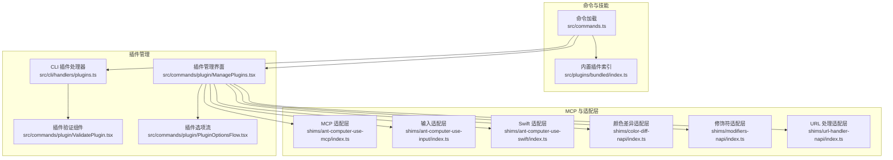
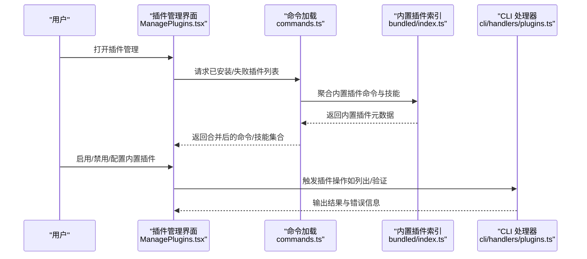
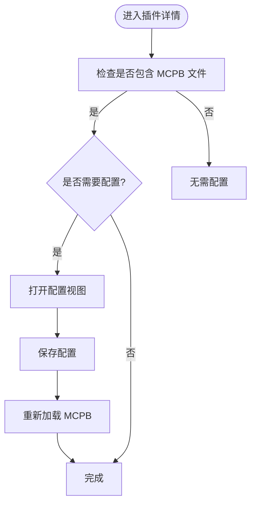
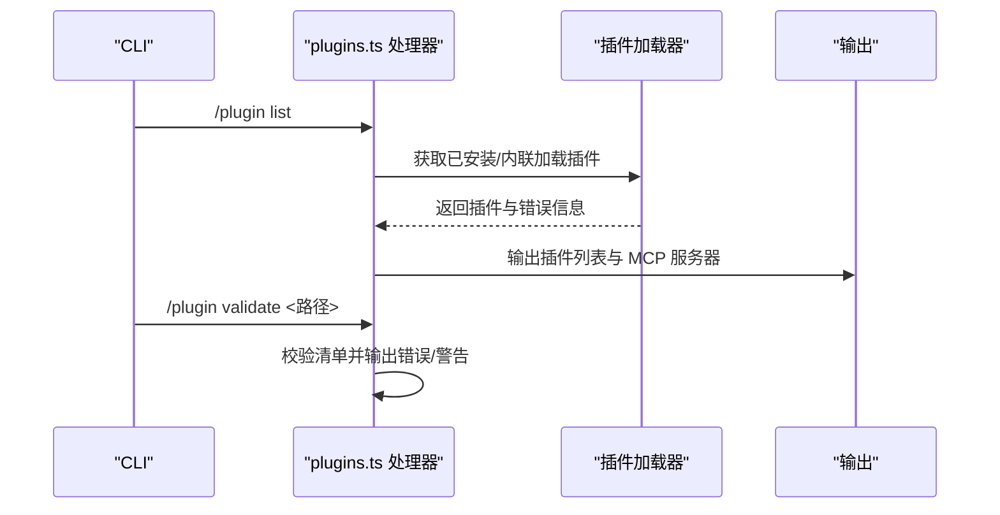
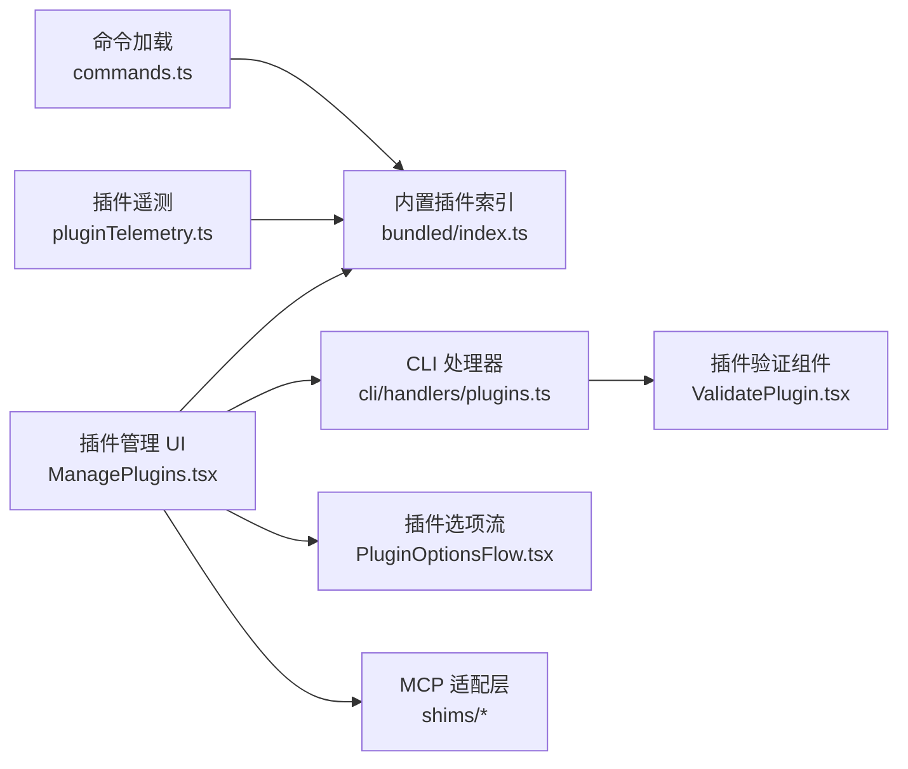

# 内置插件

<cite>
**本文引用的文件**
- [src/commands/plugin/ManagePlugins.tsx](file://src/commands/plugin/ManagePlugins.tsx)
- [src/cli/handlers/plugins.ts](file://src/cli/handlers/plugins.ts)
- [src/commands/plugin/ValidatePlugin.tsx](file://src/commands/plugin/ValidatePlugin.tsx)
- [src/commands/plugin/PluginOptionsFlow.tsx](file://src/commands/plugin/PluginOptionsFlow.tsx)
- [src/utils/telemetry/pluginTelemetry.ts](file://src/utils/telemetry/pluginTelemetry.ts)
- [src/commands.ts](file://src/commands.ts)
- [src/plugins/bundled/index.ts](file://src/plugins/bundled/index.ts)
- [shims/ant-claude-for-chrome-mcp/index.ts](file://shims/ant-claude-for-chrome-mcp/index.ts)
- [shims/ant-computer-use-mcp/index.ts](file://shims/ant-computer-use-mcp/index.ts)
- [shims/ant-computer-use-input/index.ts](file://shims/ant-computer-use-input/index.ts)
- [shims/ant-computer-use-swift/index.ts](file://shims/ant-computer-use-swift/index.ts)
- [shims/color-diff-napi/index.ts](file://shims/color-diff-napi/index.ts)
- [shims/modifiers-napi/index.ts](file://shims/modifiers-napi/index.ts)
- [shims/url-handler-napi/index.ts](file://shims/url-handler-napi/index.ts)
</cite>

## 目录
1. [简介](#简介)
2. [项目结构](#项目结构)
3. [核心组件](#核心组件)
4. [架构总览](#架构总览)
5. [详细组件分析](#详细组件分析)
6. [依赖关系分析](#依赖关系分析)
7. [性能考量](#性能考量)
8. [故障排除指南](#故障排除指南)
9. [结论](#结论)
10. [附录](#附录)

## 简介
本文件面向 Claude Code 的内置插件体系，系统性阐述其功能特性、配置选项与使用方法，并结合代码实现解析内置插件与第三方插件的差异与优势。文档覆盖从命令加载、技能聚合、插件管理到 MCP 配置与验证的完整流程，提供可操作的配置示例与使用案例，帮助开发者在不同开发环境中高效选择与组合插件。

## 项目结构
内置插件相关能力由多处模块协同实现：
- 命令与技能加载：从内置插件中聚合命令与技能，参与全局命令集构建。
- 插件管理界面与 CLI：支持内置插件的启用/禁用、更新、卸载、配置等操作。
- 插件验证：对插件清单进行校验，输出错误与警告信息。
- MCP 配置与用户配置：内置插件可通过 MCPB 文件定义 MCP 服务器，支持用户配置项的引导与保存。
- 遥测：内置插件在遥测中以“builtin”市场名标识，便于区分来源。

图表来源
- [src/commands.ts](file://src/commands.ts)
- [src/plugins/bundled/index.ts](file://src/plugins/bundled/index.ts)
- [src/commands/plugin/ManagePlugins.tsx](file://src/commands/plugin/ManagePlugins.tsx)
- [src/cli/handlers/plugins.ts](file://src/cli/handlers/plugins.ts)
- [src/commands/plugin/ValidatePlugin.tsx](file://src/commands/plugin/ValidatePlugin.tsx)
- [src/commands/plugin/PluginOptionsFlow.tsx](file://src/commands/plugin/PluginOptionsFlow.tsx)
- [shims/ant-computer-use-mcp/index.ts](file://shims/ant-computer-use-mcp/index.ts)
- [shims/ant-computer-use-input/index.ts](file://shims/ant-computer-use-input/index.ts)
- [shims/ant-computer-use-swift/index.ts](file://shims/ant-computer-use-swift/index.ts)
- [shims/color-diff-napi/index.ts](file://shims/color-diff-napi/index.ts)
- [shims/modifiers-napi/index.ts](file://shims/modifiers-napi/index.ts)
- [shims/url-handler-napi/index.ts](file://shims/url-handler-napi/index.ts)

章节来源
- [src/commands.ts](file://src/commands.ts)
- [src/plugins/bundled/index.ts](file://src/plugins/bundled/index.ts)
- [src/commands/plugin/ManagePlugins.tsx](file://src/commands/plugin/ManagePlugins.tsx)
- [src/cli/handlers/plugins.ts](file://src/cli/handlers/plugins.ts)
- [src/commands/plugin/ValidatePlugin.tsx](file://src/commands/plugin/ValidatePlugin.tsx)
- [src/commands/plugin/PluginOptionsFlow.tsx](file://src/commands/plugin/PluginOptionsFlow.tsx)

## 核心组件
- 内置插件索引与注册
  - 内置插件通过统一入口进行索引与注册，参与命令与技能的聚合。
- 插件管理界面（UI）
  - 支持内置插件的启用/禁用、更新、卸载、配置等操作；内置插件以“builtin”市场名显示，且不支持更新。
- CLI 插件处理器
  - 提供插件列表、安装路径、版本、启用状态、MCP 服务器与错误信息的输出；支持会话级内联加载与错误归因。
- 插件验证
  - 对插件或市场清单进行校验，输出错误与警告，便于快速定位问题。
- 插件选项流
  - 在安装/启用后引导用户填写未配置的选项，支持通道级与插件级用户配置存储。
- MCP 适配层
  - 通过 NAPI/TS 适配器桥接底层能力，如计算机使用、颜色差异、修饰符、URL 处理等，作为内置插件生态的一部分。

章节来源
- [src/plugins/bundled/index.ts](file://src/plugins/bundled/index.ts)
- [src/commands/plugin/ManagePlugins.tsx](file://src/commands/plugin/ManagePlugins.tsx)
- [src/cli/handlers/plugins.ts](file://src/cli/handlers/plugins.ts)
- [src/commands/plugin/ValidatePlugin.tsx](file://src/commands/plugin/ValidatePlugin.tsx)
- [src/commands/plugin/PluginOptionsFlow.tsx](file://src/commands/plugin/PluginOptionsFlow.tsx)
- [shims/ant-computer-use-mcp/index.ts](file://shims/ant-computer-use-mcp/index.ts)
- [shims/ant-computer-use-input/index.ts](file://shims/ant-computer-use-input/index.ts)
- [shims/ant-computer-use-swift/index.ts](file://shims/ant-computer-use-swift/index.ts)
- [shims/color-diff-napi/index.ts](file://shims/color-diff-napi/index.ts)
- [shims/modifiers-napi/index.ts](file://shims/modifiers-napi/index.ts)
- [shims/url-handler-napi/index.ts](file://shims/url-handler-napi/index.ts)

## 架构总览
内置插件在系统中的作用机制：
- 命令与技能聚合：内置插件提供的命令与技能参与全局命令集构建，确保模型可用的工具集完整。
- 插件生命周期：从加载、启用、配置到运行时错误监控，贯穿 UI 与 CLI 两端。
- MCP 集成：内置插件可声明 MCP 服务器并通过 MCPB 文件进行配置，支持用户交互式配置。
- 遥测与隐私：内置插件以“builtin”市场名记录遥测，采用匿名化聚合键与红名单策略保护隐私。

图表来源
- [src/commands.ts](file://src/commands.ts)
- [src/plugins/bundled/index.ts](file://src/plugins/bundled/index.ts)
- [src/commands/plugin/ManagePlugins.tsx](file://src/commands/plugin/ManagePlugins.tsx)
- [src/cli/handlers/plugins.ts](file://src/cli/handlers/plugins.ts)

## 详细组件分析

### 组件一：内置插件索引与注册
- 作用机制
  - 内置插件通过统一入口进行索引，参与命令与技能的聚合，确保启动阶段即可提供可用能力。
- 关键点
  - 注册时机：在应用初始化阶段同步完成，保证后续命令加载的完整性。
  - 与其他来源的关系：与技能目录、插件目录、工作流共同构成最终命令集。
- 最佳实践
  - 将常用能力内置，减少外部依赖；对可选能力保留为可插拔插件，避免启动时长增加。

章节来源
- [src/plugins/bundled/index.ts](file://src/plugins/bundled/index.ts)
- [src/commands.ts](file://src/commands.ts)

### 组件二：插件管理界面（UI）
- 功能特性
  - 列出内置插件及其子 MCP 客户端，内置插件以“builtin”市场名显示。
  - 支持启用/禁用、更新、卸载、配置等操作；内置插件不支持更新。
  - 支持查看失败插件详情与错误计数。
- 使用方法
  - 在插件详情页点击“配置”，若插件包含 MCPB 文件且需要配置，则进入配置视图。
  - 保存配置后重新加载 MCPB 并刷新状态。
- 适用场景
  - 快速启用/禁用内置能力；为需要用户输入的 MCP 服务设置参数。
- 最佳实践
  - 对于内置插件，优先通过 UI 进行启停；避免直接修改底层配置文件。

图表来源
- [src/commands/plugin/ManagePlugins.tsx](file://src/commands/plugin/ManagePlugins.tsx)

章节来源
- [src/commands/plugin/ManagePlugins.tsx](file://src/commands/plugin/ManagePlugins.tsx)

### 组件三：CLI 插件处理器
- 功能特性
  - 输出插件 ID、版本、作用域、启用状态、安装路径、安装时间、最后更新时间、项目路径、MCP 服务器与错误信息。
  - 支持会话级内联加载与失败路径的错误展示。
- 使用方法
  - 使用“/plugin list”查看已安装插件与错误；使用“/plugin validate <路径>”验证清单。
- 适用场景
  - CI/自动化脚本中批量检查插件状态与清单有效性。
- 最佳实践
  - 在脚本中先执行验证，再进行安装/更新操作，减少失败重试成本。

图表来源
- [src/cli/handlers/plugins.ts](file://src/cli/handlers/plugins.ts)

章节来源
- [src/cli/handlers/plugins.ts](file://src/cli/handlers/plugins.ts)

### 组件四：插件验证
- 功能特性
  - 对单个插件或市场清单进行校验，输出错误与警告；支持从目录自动识别 marketplace 或 plugin 清单。
- 使用方法
  - 传入清单路径或目录，查看校验结果；根据提示修复错误。
- 适用场景
  - 开发者在本地调试插件清单时快速定位问题。
- 最佳实践
  - 在提交前执行验证，确保清单字段完整且格式正确。

章节来源
- [src/commands/plugin/ValidatePlugin.tsx](file://src/commands/plugin/ValidatePlugin.tsx)

### 组件五：插件选项流（用户配置）
- 功能特性
  - 在安装/启用后，遍历未配置的选项，引导用户填写；支持插件级与通道级用户配置存储。
- 使用方法
  - 安装完成后触发选项流，按提示填写必要配置项。
- 适用场景
  - 需要用户输入密钥、端点、偏好等参数的插件。
- 最佳实践
  - 在插件清单中明确未配置项，提供默认值与提示文案，提升用户体验。

章节来源
- [src/commands/plugin/PluginOptionsFlow.tsx](file://src/commands/plugin/PluginOptionsFlow.tsx)

### 组件六：MCP 适配层（内置能力）
- 功能特性
  - 通过 NAPI/TS 适配器桥接底层能力，如计算机使用、颜色差异、修饰符、URL 处理等。
- 适用场景
  - 作为内置插件生态的一部分，提供系统级能力支撑。
- 最佳实践
  - 优先使用内置适配器，减少第三方依赖；对自定义能力考虑封装为插件以便复用。

章节来源
- [shims/ant-computer-use-mcp/index.ts](file://shims/ant-computer-use-mcp/index.ts)
- [shims/ant-computer-use-input/index.ts](file://shims/ant-computer-use-input/index.ts)
- [shims/ant-computer-use-swift/index.ts](file://shims/ant-computer-use-swift/index.ts)
- [shims/color-diff-napi/index.ts](file://shims/color-diff-napi/index.ts)
- [shims/modifiers-napi/index.ts](file://shims/modifiers-napi/index.ts)
- [shims/url-handler-napi/index.ts](file://shims/url-handler-napi/index.ts)

## 依赖关系分析
- 命令与技能加载依赖内置插件索引，内置插件在启动阶段即被注册，参与命令集构建。
- 插件管理 UI 与 CLI 处理器共享同一套插件状态与错误信息来源。
- MCP 配置依赖 MCPB 文件与用户配置存储；内置插件通过 MCP 适配层提供系统级能力。
- 遥测模块对内置插件采用“builtin”市场名标识，确保来源可追溯且符合隐私策略。

图表来源
- [src/commands.ts](file://src/commands.ts)
- [src/plugins/bundled/index.ts](file://src/plugins/bundled/index.ts)
- [src/commands/plugin/ManagePlugins.tsx](file://src/commands/plugin/ManagePlugins.tsx)
- [src/cli/handlers/plugins.ts](file://src/cli/handlers/plugins.ts)
- [src/commands/plugin/ValidatePlugin.tsx](file://src/commands/plugin/ValidatePlugin.tsx)
- [src/commands/plugin/PluginOptionsFlow.tsx](file://src/commands/plugin/PluginOptionsFlow.tsx)
- [src/utils/telemetry/pluginTelemetry.ts](file://src/utils/telemetry/pluginTelemetry.ts)
- [shims/ant-computer-use-mcp/index.ts](file://shims/ant-computer-use-mcp/index.ts)

章节来源
- [src/commands.ts](file://src/commands.ts)
- [src/plugins/bundled/index.ts](file://src/plugins/bundled/index.ts)
- [src/commands/plugin/ManagePlugins.tsx](file://src/commands/plugin/ManagePlugins.tsx)
- [src/cli/handlers/plugins.ts](file://src/cli/handlers/plugins.ts)
- [src/commands/plugin/ValidatePlugin.tsx](file://src/commands/plugin/ValidatePlugin.tsx)
- [src/commands/plugin/PluginOptionsFlow.tsx](file://src/commands/plugin/PluginOptionsFlow.tsx)
- [src/utils/telemetry/pluginTelemetry.ts](file://src/utils/telemetry/pluginTelemetry.ts)

## 性能考量
- 启动时长控制
  - 内置插件在启动阶段同步注册，避免运行时动态导入带来的延迟。
- 命令加载缓存
  - 命令加载采用记忆化策略，减少重复 I/O 与动态导入成本。
- 错误快速反馈
  - CLI 验证与插件管理界面均提供即时错误输出，降低调试成本。
- 遥测开销最小化
  - 内置插件遥测采用匿名化聚合键与红名单策略，兼顾统计需求与隐私保护。

## 故障排除指南
- 插件未出现在列表
  - 检查插件是否成功加载，查看失败插件详情与错误计数；确认市场名与作用域。
- 更新按钮不可用
  - 内置插件不支持更新，请确认插件来源为“builtin”。
- MCP 配置失败
  - 确认 MCPB 文件存在且需要配置；在配置视图中保存后重新加载。
- 清单校验失败
  - 使用“/plugin validate”查看具体错误与警告，逐项修正清单字段。
- 会话级内联加载失败
  - 查看内联加载错误列表，确认路径与权限；必要时清理无效路径。

章节来源
- [src/commands/plugin/ManagePlugins.tsx](file://src/commands/plugin/ManagePlugins.tsx)
- [src/cli/handlers/plugins.ts](file://src/cli/handlers/plugins.ts)
- [src/commands/plugin/ValidatePlugin.tsx](file://src/commands/plugin/ValidatePlugin.tsx)

## 结论
内置插件通过统一索引、UI/CLI 双通道管理、MCP 配置与验证机制，形成稳定高效的扩展基座。相比第三方插件，内置插件具备更强的一致性、更低的集成成本与更好的性能表现。建议在通用能力上优先使用内置插件，在特定场景下再引入第三方插件以满足差异化需求。

## 附录
- 配置示例与使用案例
  - 启用内置插件：在插件管理界面中选择“启用”，观察命令与技能是否出现在可用列表。
  - 配置 MCP 服务：在插件详情页点击“配置”，填写必要参数后保存并重新加载。
  - 验证清单：使用“/plugin validate <路径>”对插件或市场清单进行校验，修复错误后再安装。
- 选择建议
  - 通用能力：优先内置插件，确保稳定性与性能。
  - 特定领域：根据需求引入第三方插件，注意版本与兼容性。
  - 团队协作：通过 CLI 批量检查插件状态，配合验证流程保障质量。