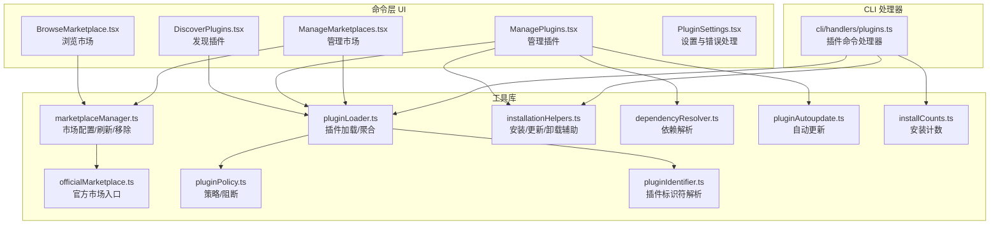
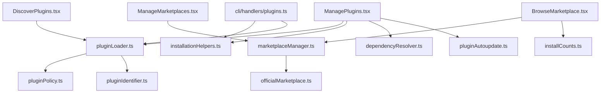
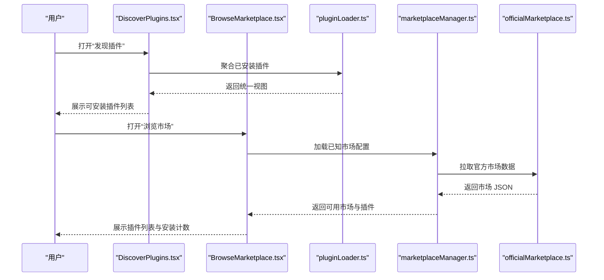
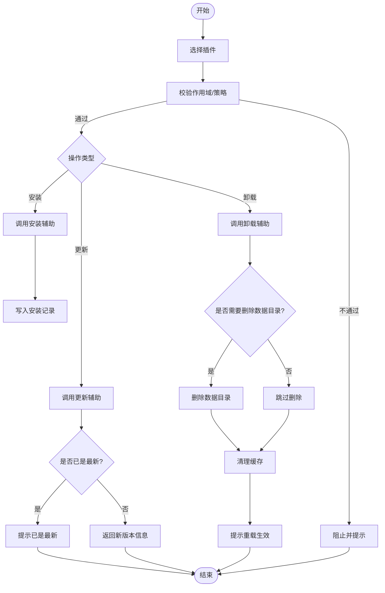
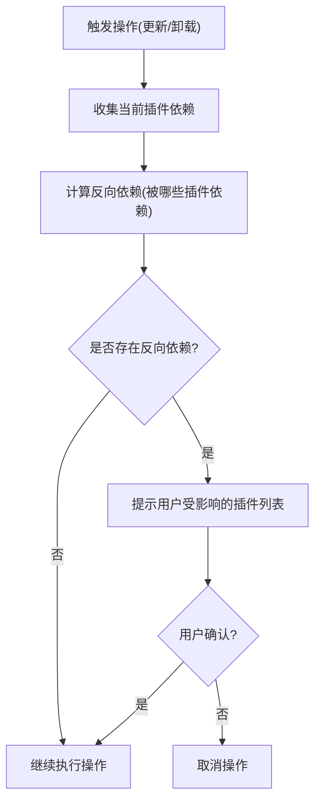
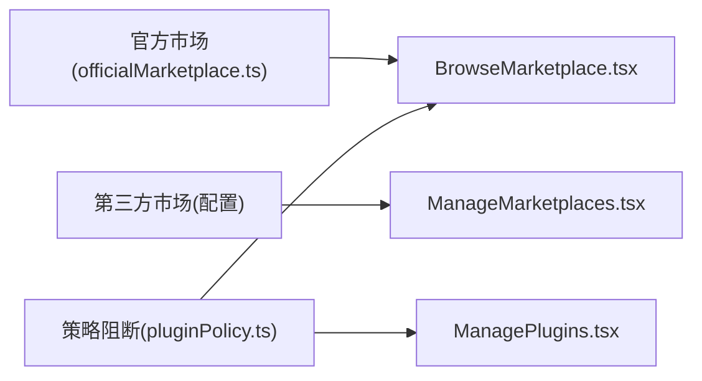
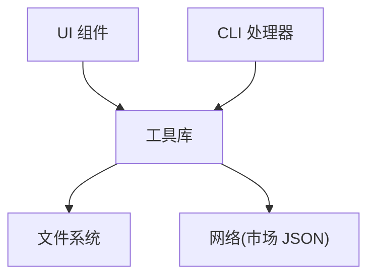

# 插件市场与集成

<cite>
**本文引用的文件**
- [src/commands/plugin/ManagePlugins.tsx](file://src/commands/plugin/ManagePlugins.tsx)
- [src/commands/plugin/ManageMarketplaces.tsx](file://src/commands/plugin/ManageMarketplaces.tsx)
- [src/commands/plugin/BrowseMarketplace.tsx](file://src/commands/plugin/BrowseMarketplace.tsx)
- [src/commands/plugin/DiscoverPlugins.tsx](file://src/commands/plugin/DiscoverPlugins.tsx)
- [src/commands/plugin/PluginSettings.tsx](file://src/commands/plugin/PluginSettings.tsx)
- [src/commands/plugin/unifiedTypes.ts](file://src/commands/plugin/unifiedTypes.ts)
- [src/cli/handlers/plugins.ts](file://src/cli/handlers/plugins.ts)
- [src/utils/plugins/marketplaceManager.ts](file://src/utils/plugins/marketplaceManager.ts)
- [src/utils/plugins/pluginLoader.ts](file://src/utils/plugins/pluginLoader.ts)
- [src/utils/plugins/installationHelpers.ts](file://src/utils/plugins/installationHelpers.ts)
- [src/utils/plugins/dependencyResolver.ts](file://src/utils/plugins/dependencyResolver.ts)
- [src/utils/plugins/pluginAutoupdate.ts](file://src/utils/plugins/pluginAutoupdate.ts)
- [src/utils/plugins/officialMarketplace.ts](file://src/utils/plugins/officialMarketplace.ts)
- [src/utils/plugins/pluginPolicy.ts](file://src/utils/plugins/pluginPolicy.ts)
- [src/utils/plugins/pluginIdentifier.ts](file://src/utils/plugins/pluginIdentifier.ts)
- [src/utils/plugins/installCounts.ts](file://src/utils/plugins/installCounts.ts)
- [src/services/plugins/index.ts](file://src/services/plugins/index.ts)
</cite>

## 目录
1. [引言](#引言)
2. [项目结构](#项目结构)
3. [核心组件](#核心组件)
4. [架构总览](#架构总览)
5. [详细组件分析](#详细组件分析)
6. [依赖分析](#依赖分析)
7. [性能考虑](#性能考虑)
8. [故障排查指南](#故障排查指南)
9. [结论](#结论)
10. [附录](#附录)

## 引言
本文件面向 Claude Code 插件生态，系统化梳理插件市场的架构设计、插件发现与搜索、安装/更新/卸载流程、依赖关系管理、官方与第三方市场差异、审核与安全策略、发布指南、API 与集成方式、以及推荐与评价体系。内容基于仓库中实际实现进行归纳总结，并通过图示展示关键流程与组件交互。

## 项目结构
插件市场能力由“命令层 UI 组件 + CLI 处理器 + 工具库（加载/安装/依赖/自动更新/策略）”构成，核心分布如下：
- 命令层 UI：负责浏览市场、发现插件、管理插件与市场、展示安装计数等
- CLI 处理器：提供命令行安装/卸载/查询可用插件等能力
- 工具库：负责市场配置加载、插件加载、安装辅助、依赖解析、自动更新、策略与标识符解析、安装计数统计等

图表来源
- [src/commands/plugin/DiscoverPlugins.tsx:37-60](file://src/commands/plugin/DiscoverPlugins.tsx#L37-L60)
- [src/commands/plugin/BrowseMarketplace.tsx:50-159](file://src/commands/plugin/BrowseMarketplace.tsx#L50-L159)
- [src/commands/plugin/ManagePlugins.tsx:397-421](file://src/commands/plugin/ManagePlugins.tsx#L397-L421)
- [src/commands/plugin/ManageMarketplaces.tsx:18-388](file://src/commands/plugin/ManageMarketplaces.tsx#L18-L388)
- [src/cli/handlers/plugins.ts:297-341](file://src/cli/handlers/plugins.ts#L297-L341)
- [src/utils/plugins/marketplaceManager.ts](file://src/utils/plugins/marketplaceManager.ts)
- [src/utils/plugins/pluginLoader.ts](file://src/utils/plugins/pluginLoader.ts)
- [src/utils/plugins/installationHelpers.ts](file://src/utils/plugins/installationHelpers.ts)
- [src/utils/plugins/dependencyResolver.ts](file://src/utils/plugins/dependencyResolver.ts)
- [src/utils/plugins/pluginAutoupdate.ts](file://src/utils/plugins/pluginAutoupdate.ts)
- [src/utils/plugins/officialMarketplace.ts](file://src/utils/plugins/officialMarketplace.ts)
- [src/utils/plugins/pluginPolicy.ts](file://src/utils/plugins/pluginPolicy.ts)
- [src/utils/plugins/pluginIdentifier.ts](file://src/utils/plugins/pluginIdentifier.ts)
- [src/utils/plugins/installCounts.ts](file://src/utils/plugins/installCounts.ts)

章节来源
- [src/commands/plugin/DiscoverPlugins.tsx:37-60](file://src/commands/plugin/DiscoverPlugins.tsx#L37-L60)
- [src/commands/plugin/BrowseMarketplace.tsx:50-159](file://src/commands/plugin/BrowseMarketplace.tsx#L50-L159)
- [src/commands/plugin/ManagePlugins.tsx:397-421](file://src/commands/plugin/ManagePlugins.tsx#L397-L421)
- [src/commands/plugin/ManageMarketplaces.tsx:18-388](file://src/commands/plugin/ManageMarketplaces.tsx#L18-L388)
- [src/cli/handlers/plugins.ts:297-341](file://src/cli/handlers/plugins.ts#L297-L341)

## 核心组件
- 发现与浏览
  - DiscoverPlugins：统一发现入口，支持按目标插件过滤、分页展示、安装计数显示
  - BrowseMarketplace：按市场维度浏览插件，支持筛选已安装、社区标记、分类标签等
- 管理
  - ManagePlugins：管理已安装插件，支持启用/禁用/更新/卸载、依赖反向提示、MCPB 配置、组织策略过滤
  - ManageMarketplaces：管理市场源，支持更新、自动更新开关、移除并批量卸载该市场下插件
- CLI
  - plugins.ts：提供列出可用插件、安装/卸载、作用域控制等命令
- 工具库
  - marketplaceManager：加载/刷新/移除市场源，读取/写入市场配置
  - pluginLoader：聚合本地/用户/项目/受管插件，构建统一视图
  - installationHelpers：封装安装/更新/卸载操作与错误处理
  - dependencyResolver：解析插件间依赖与反向依赖
  - pluginAutoupdate：按市场维度执行自动更新
  - officialMarketplace：官方市场入口与数据访问
  - pluginPolicy：组织策略阻断与合规检查
  - pluginIdentifier：解析插件名与市场标识符
  - installCounts：安装计数统计与展示

章节来源
- [src/commands/plugin/DiscoverPlugins.tsx:37-60](file://src/commands/plugin/DiscoverPlugins.tsx#L37-L60)
- [src/commands/plugin/BrowseMarketplace.tsx:50-159](file://src/commands/plugin/BrowseMarketplace.tsx#L50-L159)
- [src/commands/plugin/ManagePlugins.tsx:397-421](file://src/commands/plugin/ManagePlugins.tsx#L397-L421)
- [src/commands/plugin/ManageMarketplaces.tsx:18-388](file://src/commands/plugin/ManageMarketplaces.tsx#L18-L388)
- [src/cli/handlers/plugins.ts:297-341](file://src/cli/handlers/plugins.ts#L297-L341)
- [src/utils/plugins/marketplaceManager.ts](file://src/utils/plugins/marketplaceManager.ts)
- [src/utils/plugins/pluginLoader.ts](file://src/utils/plugins/pluginLoader.ts)
- [src/utils/plugins/installationHelpers.ts](file://src/utils/plugins/installationHelpers.ts)
- [src/utils/plugins/dependencyResolver.ts](file://src/utils/plugins/dependencyResolver.ts)
- [src/utils/plugins/pluginAutoupdate.ts](file://src/utils/plugins/pluginAutoupdate.ts)
- [src/utils/plugins/officialMarketplace.ts](file://src/utils/plugins/officialMarketplace.ts)
- [src/utils/plugins/pluginPolicy.ts](file://src/utils/plugins/pluginPolicy.ts)
- [src/utils/plugins/pluginIdentifier.ts](file://src/utils/plugins/pluginIdentifier.ts)
- [src/utils/plugins/installCounts.ts](file://src/utils/plugins/installCounts.ts)

## 架构总览
插件市场采用“多市场源 + 统一加载 + 分层管理”的架构：
- 多市场源：官方市场与其他第三方市场并存，通过配置管理与优雅降级加载
- 统一加载：聚合本地/用户/项目/受管插件，形成统一的已安装视图
- 分层管理：UI 层负责交互与展示；CLI 层提供命令行能力；工具库层提供安装、依赖、自动更新、策略等支撑

图表来源
- [src/commands/plugin/DiscoverPlugins.tsx:37-60](file://src/commands/plugin/DiscoverPlugins.tsx#L37-L60)
- [src/commands/plugin/BrowseMarketplace.tsx:50-159](file://src/commands/plugin/BrowseMarketplace.tsx#L50-L159)
- [src/commands/plugin/ManagePlugins.tsx:397-421](file://src/commands/plugin/ManagePlugins.tsx#L397-L421)
- [src/commands/plugin/ManageMarketplaces.tsx:18-388](file://src/commands/plugin/ManageMarketplaces.tsx#L18-L388)
- [src/cli/handlers/plugins.ts:297-341](file://src/cli/handlers/plugins.ts#L297-L341)
- [src/utils/plugins/pluginLoader.ts](file://src/utils/plugins/pluginLoader.ts)
- [src/utils/plugins/marketplaceManager.ts](file://src/utils/plugins/marketplaceManager.ts)
- [src/utils/plugins/installationHelpers.ts](file://src/utils/plugins/installationHelpers.ts)
- [src/utils/plugins/dependencyResolver.ts](file://src/utils/plugins/dependencyResolver.ts)
- [src/utils/plugins/pluginAutoupdate.ts](file://src/utils/plugins/pluginAutoupdate.ts)
- [src/utils/plugins/officialMarketplace.ts](file://src/utils/plugins/officialMarketplace.ts)
- [src/utils/plugins/pluginPolicy.ts](file://src/utils/plugins/pluginPolicy.ts)
- [src/utils/plugins/pluginIdentifier.ts](file://src/utils/plugins/pluginIdentifier.ts)
- [src/utils/plugins/installCounts.ts](file://src/utils/plugins/installCounts.ts)

## 详细组件分析

### 插件发现与搜索
- DiscoverPlugins 提供统一的插件列表视图，支持目标插件过滤、分页与安装计数展示
- BrowseMarketplace 支持按市场筛选插件，过滤已安装与策略阻断项，展示描述、版本、分类与社区标记
- 安装计数：在官方市场场景下，展示每个插件的安装次数，辅助用户决策

图表来源
- [src/commands/plugin/DiscoverPlugins.tsx:37-60](file://src/commands/plugin/DiscoverPlugins.tsx#L37-L60)
- [src/commands/plugin/BrowseMarketplace.tsx:50-159](file://src/commands/plugin/BrowseMarketplace.tsx#L50-L159)
- [src/utils/plugins/pluginLoader.ts](file://src/utils/plugins/pluginLoader.ts)
- [src/utils/plugins/marketplaceManager.ts](file://src/utils/plugins/marketplaceManager.ts)
- [src/utils/plugins/officialMarketplace.ts](file://src/utils/plugins/officialMarketplace.ts)

章节来源
- [src/commands/plugin/DiscoverPlugins.tsx:37-60](file://src/commands/plugin/DiscoverPlugins.tsx#L37-L60)
- [src/commands/plugin/BrowseMarketplace.tsx:232-272](file://src/commands/plugin/BrowseMarketplace.tsx#L232-L272)
- [src/utils/plugins/installCounts.ts](file://src/utils/plugins/installCounts.ts)

### 插件安装/更新/卸载流程
- 安装：UI 选择插件后调用安装辅助，结合策略检查与作用域校验，最终写入安装记录
- 更新：对非内置插件执行更新，若已是最新则提示；否则返回新版本信息
- 卸载：支持保留数据与删除数据两种模式；若存在项目/本地作用域安装，会提示确认；卸载后清理缓存并提示重载生效

图表来源
- [src/commands/plugin/ManagePlugins.tsx:1003-1562](file://src/commands/plugin/ManagePlugins.tsx#L1003-L1562)
- [src/utils/plugins/installationHelpers.ts](file://src/utils/plugins/installationHelpers.ts)
- [src/utils/plugins/pluginPolicy.ts](file://src/utils/plugins/pluginPolicy.ts)

章节来源
- [src/commands/plugin/ManagePlugins.tsx:1003-1562](file://src/commands/plugin/ManagePlugins.tsx#L1003-L1562)
- [src/utils/plugins/installationHelpers.ts](file://src/utils/plugins/installationHelpers.ts)
- [src/utils/plugins/pluginPolicy.ts](file://src/utils/plugins/pluginPolicy.ts)

### 依赖关系管理
- 反向依赖提示：在卸载或更新前，计算受影响的依赖方并提示用户
- 依赖解析：在安装/更新时进行依赖一致性检查，避免破坏性变更
- 内置插件限制：内置插件仅允许启用/禁用，不允许更新/卸载

图表来源
- [src/commands/plugin/ManagePlugins.tsx:1074-1140](file://src/commands/plugin/ManagePlugins.tsx#L1074-L1140)
- [src/utils/plugins/dependencyResolver.ts](file://src/utils/plugins/dependencyResolver.ts)

章节来源
- [src/commands/plugin/ManagePlugins.tsx:1074-1140](file://src/commands/plugin/ManagePlugins.tsx#L1074-L1140)
- [src/utils/plugins/dependencyResolver.ts](file://src/utils/plugins/dependencyResolver.ts)

### 官方市场与第三方市场
- 官方市场：优先展示，支持安装计数、分类与社区标记；通过官方入口拉取数据
- 第三方市场：通过配置加载，支持自动更新开关与移除；移除时会先卸载该市场下的所有插件
- 策略与阻断：组织策略可阻断特定插件，且不可由用户自行启用

图表来源
- [src/utils/plugins/officialMarketplace.ts](file://src/utils/plugins/officialMarketplace.ts)
- [src/commands/plugin/BrowseMarketplace.tsx:124-159](file://src/commands/plugin/BrowseMarketplace.tsx#L124-L159)
- [src/commands/plugin/ManageMarketplaces.tsx:71-105](file://src/commands/plugin/ManageMarketplaces.tsx#L71-L105)
- [src/utils/plugins/pluginPolicy.ts](file://src/utils/plugins/pluginPolicy.ts)
- [src/commands/plugin/ManagePlugins.tsx:391-396](file://src/commands/plugin/ManagePlugins.tsx#L391-L396)

章节来源
- [src/commands/plugin/BrowseMarketplace.tsx:124-159](file://src/commands/plugin/BrowseMarketplace.tsx#L124-L159)
- [src/commands/plugin/ManageMarketplaces.tsx:71-105](file://src/commands/plugin/ManageMarketplaces.tsx#L71-L105)
- [src/utils/plugins/pluginPolicy.ts](file://src/utils/plugins/pluginPolicy.ts)

### 插件发布与元数据规范
- 元数据字段：名称、描述、版本、类别、标签（如社区托管）、来源等
- 版本管理：遵循 semver，更新时需确保兼容性
- 发布流程：将插件清单与资源发布到市场源，官方市场优先审核与展示
- 自定义市场：通过配置添加第三方市场源，支持自动更新与移除

章节来源
- [src/commands/plugin/BrowseMarketplace.tsx:258-272](file://src/commands/plugin/BrowseMarketplace.tsx#L258-L272)
- [src/utils/plugins/marketplaceManager.ts](file://src/utils/plugins/marketplaceManager.ts)
- [src/utils/plugins/officialMarketplace.ts](file://src/utils/plugins/officialMarketplace.ts)

### API 接口与集成方式
- CLI 接口：提供列出可用插件、安装/卸载、作用域参数等命令
- UI 集成：通过 React 组件与状态管理，提供交互式浏览与管理体验
- 市场 API：通过市场管理器加载市场 JSON，支持官方与第三方市场

章节来源
- [src/cli/handlers/plugins.ts:297-341](file://src/cli/handlers/plugins.ts#L297-L341)
- [src/commands/plugin/BrowseMarketplace.tsx:124-159](file://src/commands/plugin/BrowseMarketplace.tsx#L124-L159)
- [src/utils/plugins/marketplaceManager.ts](file://src/utils/plugins/marketplaceManager.ts)

### 推荐算法与评价系统
- 安装计数：官方市场展示安装次数，作为推荐权重之一
- 用户评价：未在代码中直接体现评分/评论字段，推荐以安装量与社区标记作为替代指标
- LSP/技能推荐：存在独立的 LSP 与技能推荐模块，可用于扩展推荐场景

章节来源
- [src/utils/plugins/installCounts.ts](file://src/utils/plugins/installCounts.ts)
- [src/utils/lspRecommendation.ts](file://src/utils/lspRecommendation.ts)

## 依赖分析
- 组件耦合
  - UI 组件依赖工具库（加载、安装、策略、标识符、自动更新）
  - CLI 依赖安装与加载逻辑，同时输出可用插件列表
- 外部依赖
  - 市场 JSON 数据源（官方与第三方）
  - 文件系统（插件目录、数据目录、缓存）
- 循环依赖
  - 未见明显循环依赖；各模块职责清晰

图表来源
- [src/commands/plugin/ManagePlugins.tsx:397-421](file://src/commands/plugin/ManagePlugins.tsx#L397-L421)
- [src/cli/handlers/plugins.ts:297-341](file://src/cli/handlers/plugins.ts#L297-L341)
- [src/utils/plugins/pluginLoader.ts](file://src/utils/plugins/pluginLoader.ts)
- [src/utils/plugins/marketplaceManager.ts](file://src/utils/plugins/marketplaceManager.ts)

章节来源
- [src/commands/plugin/ManagePlugins.tsx:397-421](file://src/commands/plugin/ManagePlugins.tsx#L397-L421)
- [src/cli/handlers/plugins.ts:297-341](file://src/cli/handlers/plugins.ts#L297-L341)
- [src/utils/plugins/pluginLoader.ts](file://src/utils/plugins/pluginLoader.ts)
- [src/utils/plugins/marketplaceManager.ts](file://src/utils/plugins/marketplaceManager.ts)

## 性能考虑
- 分页与虚拟滚动：插件列表使用分页与连续滚动，减少一次性渲染压力
- 优雅降级：加载多个市场时，单个市场失败不影响整体展示
- 缓存与重载：卸载/更新后提示重载生效，避免重复加载成本
- 安装计数：仅在官方市场场景展示，降低额外请求

章节来源
- [src/commands/plugin/BrowseMarketplace.tsx:75-80](file://src/commands/plugin/BrowseMarketplace.tsx#L75-L80)
- [src/commands/plugin/DiscoverPlugins.tsx:604-646](file://src/commands/plugin/DiscoverPlugins.tsx#L604-L646)
- [src/commands/plugin/ManagePlugins.tsx:1124-1140](file://src/commands/plugin/ManagePlugins.tsx#L1124-L1140)

## 故障排查指南
- 市场加载失败
  - 现象：无法加载市场或部分市场失败
  - 处理：查看 UI 中警告信息；检查网络与市场源配置；必要时移除问题源
- 插件安装失败
  - 现象：安装报错或无响应
  - 处理：检查策略阻断、权限与作用域；查看错误详情并重试
- 卸载后仍被依赖
  - 现象：卸载提示被其他插件依赖
  - 处理：根据反向依赖提示调整上游插件或更新版本
- CLI 参数错误
  - 现象：scope 参数无效或 cowork 与 scope 不匹配
  - 处理：参考 CLI 输出的合法值列表修正命令

章节来源
- [src/commands/plugin/PluginSettings.tsx:618-623](file://src/commands/plugin/PluginSettings.tsx#L618-L623)
- [src/commands/plugin/ManagePlugins.tsx:1003-1140](file://src/commands/plugin/ManagePlugins.tsx#L1003-L1140)
- [src/cli/handlers/plugins.ts:704-737](file://src/cli/handlers/plugins.ts#L704-L737)

## 结论
本插件市场体系以多市场源为核心，结合统一加载与分层管理，提供了从发现、安装、更新到卸载的全链路能力。通过策略阻断、依赖解析与自动更新，保障了安全性与稳定性。官方市场与第三方市场并存，既满足标准化审核与质量保证，又保留了生态开放性。建议在发布插件时严格遵循元数据规范与版本管理策略，并充分利用安装计数与社区标记提升可见性。

## 附录
- 关键类型定义
  - 统一市场项与已安装插件类型占位，便于后续扩展

章节来源
- [src/commands/plugin/unifiedTypes.ts:1-2](file://src/commands/plugin/unifiedTypes.ts#L1-L2)