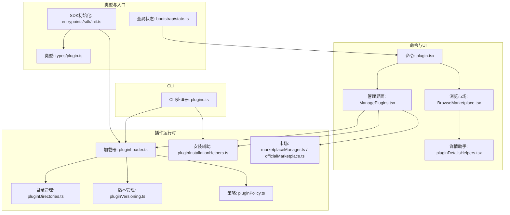
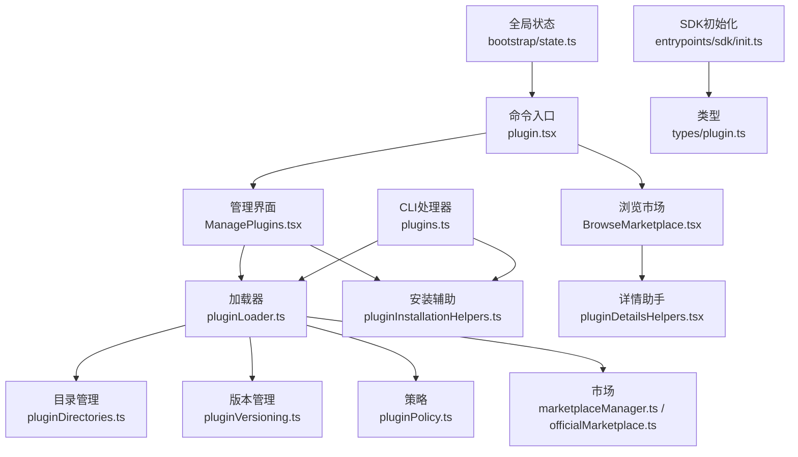
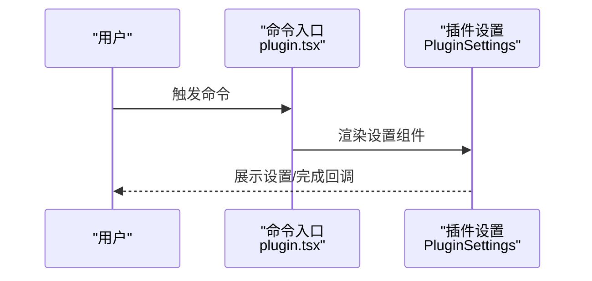
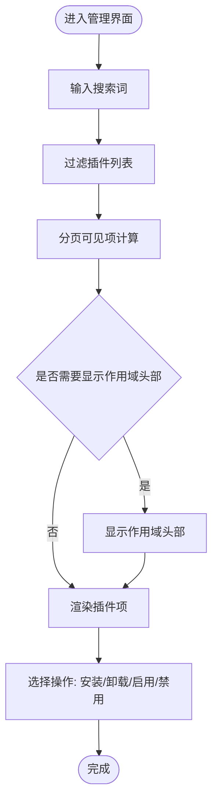
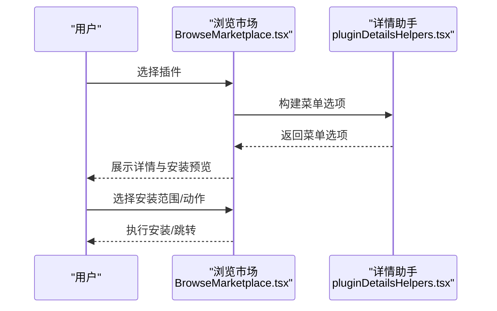
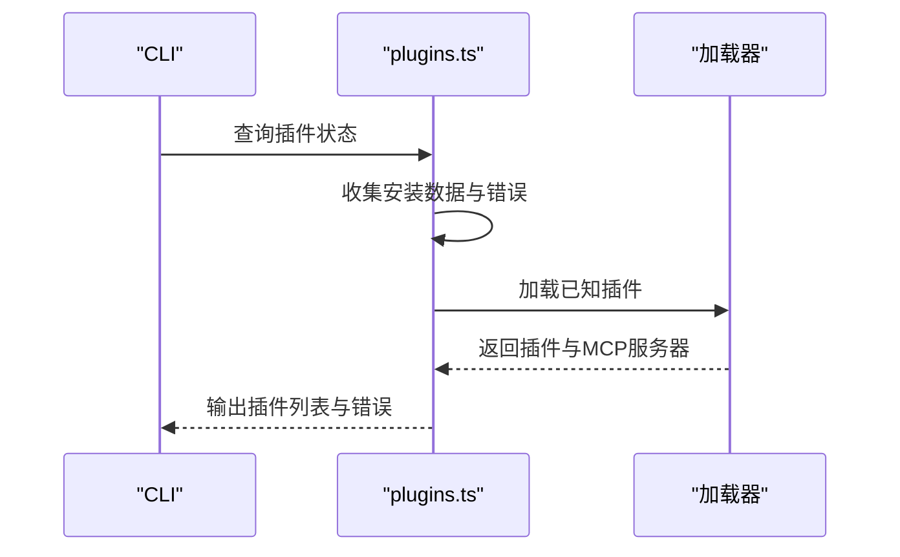
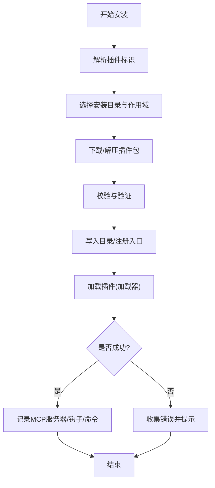
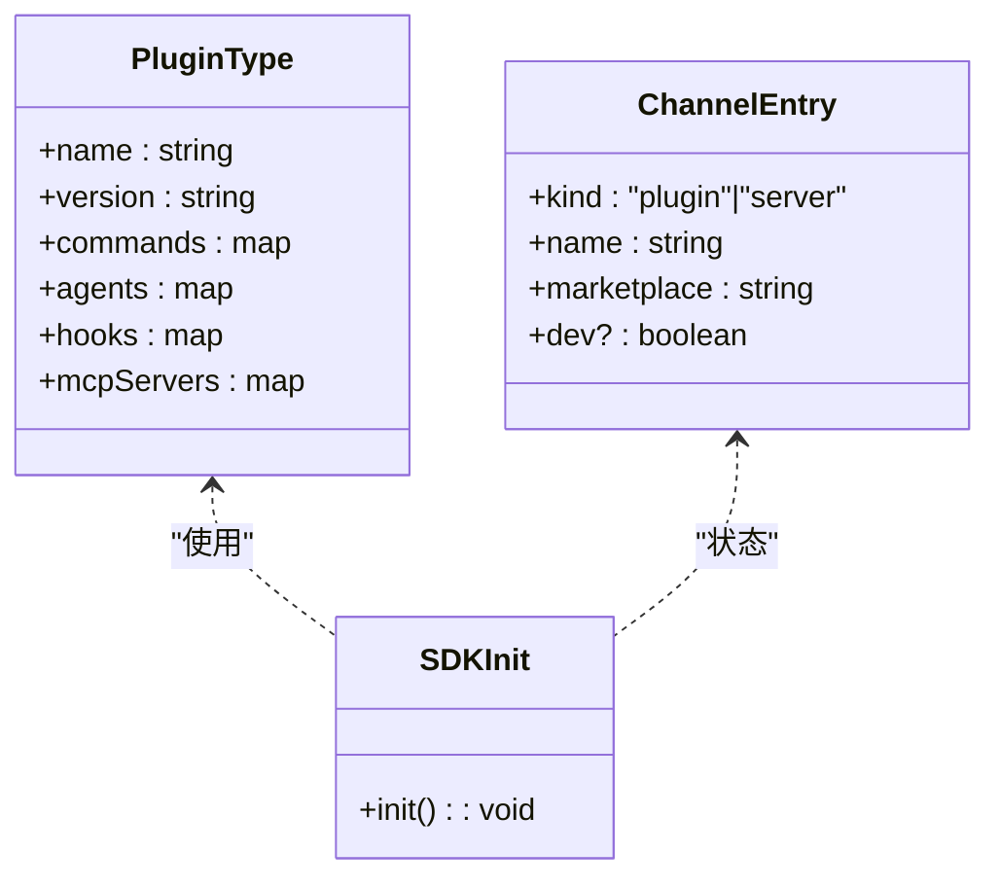
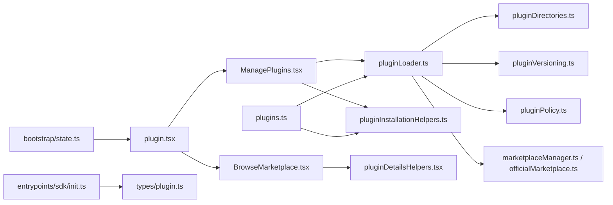

# 插件开发指南

<cite>
**本文引用的文件**
- [package.json](file://package.json)
- [tsconfig.json](file://tsconfig.json)
- [src/commands/plugin/plugin.tsx](file://src/commands/plugin/plugin.tsx)
- [src/commands/plugin/ManagePlugins.tsx](file://src/commands/plugin/ManagePlugins.tsx)
- [src/commands/plugin/BrowseMarketplace.tsx](file://src/commands/plugin/BrowseMarketplace.tsx)
- [src/commands/plugin/pluginDetailsHelpers.tsx](file://src/commands/plugin/pluginDetailsHelpers.tsx)
- [src/cli/handlers/plugins.ts](file://src/cli/handlers/plugins.ts)
- [src/utils/plugins/pluginLoader.ts](file://src/utils/plugins/pluginLoader.ts)
- [src/utils/plugins/pluginInstallationHelpers.ts](file://src/utils/plugins/pluginInstallationHelpers.ts)
- [src/utils/plugins/pluginDirectories.ts](file://src/utils/plugins/pluginDirectories.ts)
- [src/utils/plugins/pluginVersioning.ts](file://src/utils/plugins/pluginVersioning.ts)
- [src/utils/plugins/pluginPolicy.ts](file://src/utils/plugins/pluginPolicy.ts)
- [src/utils/plugins/marketplaceManager.ts](file://src/utils/plugins/marketplaceManager.ts)
- [src/utils/plugins/officialMarketplace.ts](file://src/utils/plugins/officialMarketplace.ts)
- [src/utils/telemetry/pluginTelemetry.ts](file://src/utils/telemetry/pluginTelemetry.ts)
- [src/bootstrap/state.ts](file://src/bootstrap/state.ts)
- [src/types/plugin.ts](file://src/types/plugin.ts)
- [src/entrypoints/sdk/init.ts](file://src/entrypoints/sdk/init.ts)
- [shims/ant-computer-use-mcp/package.json](file://shims/ant-computer-use-mcp/package.json)
- [shims/ant-computer-use-mcp/index.ts](file://shims/ant-computer-use-mcp/index.ts)
- [shims/ant-claude-for-chrome-mcp/package.json](file://shims/ant-claude-for-chrome-mcp/package.json)
- [shims/ant-claude-for-chrome-mcp/index.ts](file://shims/ant-claude-for-chrome-mcp/index.ts)
</cite>

## 目录
1. [简介](#简介)
2. [项目结构](#项目结构)
3. [核心组件](#核心组件)
4. [架构总览](#架构总览)
5. [详细组件分析](#详细组件分析)
6. [依赖关系分析](#依赖关系分析)
7. [性能考量](#性能考量)
8. [故障排查指南](#故障排查指南)
9. [结论](#结论)
10. [附录](#附录)

## 简介
本指南面向希望在 Claude Code 生态中开发插件的开发者，覆盖从开发环境搭建、工具与配置、调试到插件模板使用、标准接口实现、生命周期与事件处理、错误处理策略，再到打包、测试、发布与版本管理及向后兼容性的完整流程。文档以仓库中的现有实现为依据，结合可复用的模板与最佳实践，帮助你快速构建工具插件、命令插件与 UI 插件。

## 项目结构
该仓库采用按功能域分层的组织方式：命令层（CLI 与交互式 UI）、服务层（插件加载、安装、市场、策略等）、类型与入口点（SDK 初始化、类型定义）等。与插件开发直接相关的关键目录如下：
- 命令与 UI：src/commands/plugin 及其子组件，负责插件管理、浏览市场、详情展示与设置
- CLI 插件操作：src/cli/handlers/plugins.ts 提供插件列表、状态查询等命令
- 插件运行时与加载：src/utils/plugins/* 提供加载器、安装辅助、目录与版本管理、策略与市场集成
- 类型与入口：src/types/plugin.ts、src/entrypoints/sdk/init.ts
- 全局状态与通道：src/bootstrap/state.ts 定义插件/服务器通道条目类型
- 示例 shim：shims 下包含 MCP 相关的示例插件包，便于理解插件结构与打包

图表来源
- [src/commands/plugin/plugin.tsx:1-7](file://src/commands/plugin/plugin.tsx#L1-L7)
- [src/commands/plugin/ManagePlugins.tsx:2130-2155](file://src/commands/plugin/ManagePlugins.tsx#L2130-L2155)
- [src/commands/plugin/BrowseMarketplace.tsx:635-678](file://src/commands/plugin/BrowseMarketplace.tsx#L635-L678)
- [src/commands/plugin/pluginDetailsHelpers.tsx:43-74](file://src/commands/plugin/pluginDetailsHelpers.tsx#L43-L74)
- [src/cli/handlers/plugins.ts:199-238](file://src/cli/handlers/plugins.ts#L199-L238)
- [src/utils/plugins/pluginLoader.ts](file://src/utils/plugins/pluginLoader.ts)
- [src/utils/plugins/pluginInstallationHelpers.ts](file://src/utils/plugins/pluginInstallationHelpers.ts)
- [src/utils/plugins/pluginDirectories.ts](file://src/utils/plugins/pluginDirectories.ts)
- [src/utils/plugins/pluginVersioning.ts](file://src/utils/plugins/pluginVersioning.ts)
- [src/utils/plugins/pluginPolicy.ts](file://src/utils/plugins/pluginPolicy.ts)
- [src/utils/plugins/marketplaceManager.ts](file://src/utils/plugins/marketplaceManager.ts)
- [src/utils/plugins/officialMarketplace.ts](file://src/utils/plugins/officialMarketplace.ts)
- [src/types/plugin.ts](file://src/types/plugin.ts)
- [src/entrypoints/sdk/init.ts](file://src/entrypoints/sdk/init.ts)
- [src/bootstrap/state.ts:26-43](file://src/bootstrap/state.ts#L26-L43)

章节来源
- [src/commands/plugin/plugin.tsx:1-7](file://src/commands/plugin/plugin.tsx#L1-L7)
- [src/commands/plugin/ManagePlugins.tsx:2130-2155](file://src/commands/plugin/ManagePlugins.tsx#L2130-L2155)
- [src/commands/plugin/BrowseMarketplace.tsx:635-678](file://src/commands/plugin/BrowseMarketplace.tsx#L635-L678)
- [src/commands/plugin/pluginDetailsHelpers.tsx:43-74](file://src/commands/plugin/pluginDetailsHelpers.tsx#L43-L74)
- [src/cli/handlers/plugins.ts:199-238](file://src/cli/handlers/plugins.ts#L199-L238)
- [src/utils/plugins/pluginLoader.ts](file://src/utils/plugins/pluginLoader.ts)
- [src/utils/plugins/pluginInstallationHelpers.ts](file://src/utils/plugins/pluginInstallationHelpers.ts)
- [src/utils/plugins/pluginDirectories.ts](file://src/utils/plugins/pluginDirectories.ts)
- [src/utils/plugins/pluginVersioning.ts](file://src/utils/plugins/pluginVersioning.ts)
- [src/utils/plugins/pluginPolicy.ts](file://src/utils/plugins/pluginPolicy.ts)
- [src/utils/plugins/marketplaceManager.ts](file://src/utils/plugins/marketplaceManager.ts)
- [src/utils/plugins/officialMarketplace.ts](file://src/utils/plugins/officialMarketplace.ts)
- [src/types/plugin.ts](file://src/types/plugin.ts)
- [src/entrypoints/sdk/init.ts](file://src/entrypoints/sdk/init.ts)
- [src/bootstrap/state.ts:26-43](file://src/bootstrap/state.ts#L26-L43)

## 核心组件
- 插件命令入口：通过命令入口调用插件设置 UI，作为插件管理的统一入口
- 插件管理界面：支持搜索、分页、按作用域显示、安装/卸载/启用/禁用等
- 浏览市场界面：展示插件元数据、安装预览、多级菜单选项（用户/项目/本地作用域）
- CLI 插件处理器：提供插件列表、错误诊断、MCP 服务器信息等
- 插件加载与安装：加载器、安装辅助、目录与版本管理、策略与市场集成
- 类型与入口：定义插件类型、SDK 初始化、全局状态中的通道条目类型

章节来源
- [src/commands/plugin/plugin.tsx:1-7](file://src/commands/plugin/plugin.tsx#L1-L7)
- [src/commands/plugin/ManagePlugins.tsx:2130-2155](file://src/commands/plugin/ManagePlugins.tsx#L2130-L2155)
- [src/commands/plugin/BrowseMarketplace.tsx:635-678](file://src/commands/plugin/BrowseMarketplace.tsx#L635-L678)
- [src/cli/handlers/plugins.ts:199-238](file://src/cli/handlers/plugins.ts#L199-L238)
- [src/utils/plugins/pluginLoader.ts](file://src/utils/plugins/pluginLoader.ts)
- [src/utils/plugins/pluginInstallationHelpers.ts](file://src/utils/plugins/pluginInstallationHelpers.ts)
- [src/utils/plugins/pluginDirectories.ts](file://src/utils/plugins/pluginDirectories.ts)
- [src/utils/plugins/pluginVersioning.ts](file://src/utils/plugins/pluginVersioning.ts)
- [src/utils/plugins/pluginPolicy.ts](file://src/utils/plugins/pluginPolicy.ts)
- [src/utils/plugins/marketplaceManager.ts](file://src/utils/plugins/marketplaceManager.ts)
- [src/utils/plugins/officialMarketplace.ts](file://src/utils/plugins/officialMarketplace.ts)
- [src/types/plugin.ts](file://src/types/plugin.ts)
- [src/entrypoints/sdk/init.ts](file://src/entrypoints/sdk/init.ts)
- [src/bootstrap/state.ts:26-43](file://src/bootstrap/state.ts#L26-L43)

## 架构总览
下图展示了插件系统的高层交互：命令入口触发 UI，UI 调用加载器与安装辅助；CLI 处理器与市场/策略模块协同工作；SDK 初始化与类型定义贯穿始终。

图表来源
- [src/commands/plugin/plugin.tsx:1-7](file://src/commands/plugin/plugin.tsx#L1-L7)
- [src/commands/plugin/ManagePlugins.tsx:2130-2155](file://src/commands/plugin/ManagePlugins.tsx#L2130-L2155)
- [src/commands/plugin/BrowseMarketplace.tsx:635-678](file://src/commands/plugin/BrowseMarketplace.tsx#L635-L678)
- [src/commands/plugin/pluginDetailsHelpers.tsx:43-74](file://src/commands/plugin/pluginDetailsHelpers.tsx#L43-L74)
- [src/cli/handlers/plugins.ts:199-238](file://src/cli/handlers/plugins.ts#L199-L238)
- [src/utils/plugins/pluginLoader.ts](file://src/utils/plugins/pluginLoader.ts)
- [src/utils/plugins/pluginInstallationHelpers.ts](file://src/utils/plugins/pluginInstallationHelpers.ts)
- [src/utils/plugins/pluginDirectories.ts](file://src/utils/plugins/pluginDirectories.ts)
- [src/utils/plugins/pluginVersioning.ts](file://src/utils/plugins/pluginVersioning.ts)
- [src/utils/plugins/pluginPolicy.ts](file://src/utils/plugins/pluginPolicy.ts)
- [src/utils/plugins/marketplaceManager.ts](file://src/utils/plugins/marketplaceManager.ts)
- [src/utils/plugins/officialMarketplace.ts](file://src/utils/plugins/officialMarketplace.ts)
- [src/entrypoints/sdk/init.ts](file://src/entrypoints/sdk/init.ts)
- [src/types/plugin.ts](file://src/types/plugin.ts)
- [src/bootstrap/state.ts:26-43](file://src/bootstrap/state.ts#L26-L43)

## 详细组件分析

### 组件一：插件命令入口与设置
- 功能：作为插件管理的统一入口，渲染插件设置组件
- 关键点：命令调用返回 React 节点，完成回调用于 UI 生命周期控制

图表来源
- [src/commands/plugin/plugin.tsx:1-7](file://src/commands/plugin/plugin.tsx#L1-L7)

章节来源
- [src/commands/plugin/plugin.tsx:1-7](file://src/commands/plugin/plugin.tsx#L1-L7)

### 组件二：插件管理界面（搜索、分页、作用域）
- 功能：支持搜索过滤、分页滚动、按作用域（用户/项目/本地）分组展示，提供安装/卸载/启用/禁用等操作
- 关键点：分页可见项计算、作用域头部显示、选中项高亮与键盘导航

图表来源
- [src/commands/plugin/ManagePlugins.tsx:2130-2155](file://src/commands/plugin/ManagePlugins.tsx#L2130-L2155)

章节来源
- [src/commands/plugin/ManagePlugins.tsx:2130-2155](file://src/commands/plugin/ManagePlugins.tsx#L2130-L2155)

### 组件三：浏览市场与详情展示
- 功能：展示插件元数据、安装预览（命令/代理/钩子/MCP 服务器），提供多级菜单选项（用户/项目/本地安装、主页/GitHub、返回）
- 关键点：详情菜单选项构建函数、安装预览内容拼接、键盘快捷键绑定

图表来源
- [src/commands/plugin/BrowseMarketplace.tsx:635-678](file://src/commands/plugin/BrowseMarketplace.tsx#L635-L678)
- [src/commands/plugin/pluginDetailsHelpers.tsx:43-74](file://src/commands/plugin/pluginDetailsHelpers.tsx#L43-L74)

章节来源
- [src/commands/plugin/BrowseMarketplace.tsx:635-678](file://src/commands/plugin/BrowseMarketplace.tsx#L635-L678)
- [src/commands/plugin/pluginDetailsHelpers.tsx:43-74](file://src/commands/plugin/pluginDetailsHelpers.tsx#L43-L74)

### 组件四：CLI 插件处理器
- 功能：列出已安装插件、聚合加载错误、查询已加载插件的 MCP 服务器信息
- 关键点：按插件 ID 排序、错误筛选与消息提取、MCP 服务器缓存与加载

图表来源
- [src/cli/handlers/plugins.ts:199-238](file://src/cli/handlers/plugins.ts#L199-L238)

章节来源
- [src/cli/handlers/plugins.ts:199-238](file://src/cli/handlers/plugins.ts#L199-L238)

### 组件五：插件加载与安装
- 功能：加载器负责解析插件入口、合并钩子与配置；安装辅助负责安装流程与错误处理；目录与版本管理确保路径与版本一致性；策略与市场集成保障合规与可用性
- 关键点：加载器与安装辅助的协作、目录前缀匹配、版本比较、策略检查、市场拉取与缓存

图表来源
- [src/utils/plugins/pluginLoader.ts](file://src/utils/plugins/pluginLoader.ts)
- [src/utils/plugins/pluginInstallationHelpers.ts](file://src/utils/plugins/pluginInstallationHelpers.ts)
- [src/utils/plugins/pluginDirectories.ts](file://src/utils/plugins/pluginDirectories.ts)
- [src/utils/plugins/pluginVersioning.ts](file://src/utils/plugins/pluginVersioning.ts)
- [src/utils/plugins/pluginPolicy.ts](file://src/utils/plugins/pluginPolicy.ts)
- [src/utils/plugins/marketplaceManager.ts](file://src/utils/plugins/marketplaceManager.ts)
- [src/utils/plugins/officialMarketplace.ts](file://src/utils/plugins/officialMarketplace.ts)

章节来源
- [src/utils/plugins/pluginLoader.ts](file://src/utils/plugins/pluginLoader.ts)
- [src/utils/plugins/pluginInstallationHelpers.ts](file://src/utils/plugins/pluginInstallationHelpers.ts)
- [src/utils/plugins/pluginDirectories.ts](file://src/utils/plugins/pluginDirectories.ts)
- [src/utils/plugins/pluginVersioning.ts](file://src/utils/plugins/pluginVersioning.ts)
- [src/utils/plugins/pluginPolicy.ts](file://src/utils/plugins/pluginPolicy.ts)
- [src/utils/plugins/marketplaceManager.ts](file://src/utils/plugins/marketplaceManager.ts)
- [src/utils/plugins/officialMarketplace.ts](file://src/utils/plugins/officialMarketplace.ts)

### 组件六：类型与入口
- 功能：定义插件类型、SDK 初始化、全局状态中的通道条目类型，确保插件生态的一致性与可扩展性
- 关键点：类型约束、SDK 初始化流程、通道条目（插件/服务器）定义

图表来源
- [src/types/plugin.ts](file://src/types/plugin.ts)
- [src/bootstrap/state.ts:26-43](file://src/bootstrap/state.ts#L26-L43)
- [src/entrypoints/sdk/init.ts](file://src/entrypoints/sdk/init.ts)

章节来源
- [src/types/plugin.ts](file://src/types/plugin.ts)
- [src/bootstrap/state.ts:26-43](file://src/bootstrap/state.ts#L26-L43)
- [src/entrypoints/sdk/init.ts](file://src/entrypoints/sdk/init.ts)

### 组件七：示例 shim 插件
- 功能：提供 MCP 相关的示例插件包，展示插件结构、入口与打包方式
- 关键点：package.json 配置、index.ts 入口导出

章节来源
- [shims/ant-computer-use-mcp/package.json](file://shims/ant-computer-use-mcp/package.json)
- [shims/ant-computer-use-mcp/index.ts](file://shims/ant-computer-use-mcp/index.ts)
- [shims/ant-claude-for-chrome-mcp/package.json](file://shims/ant-claude-for-chrome-mcp/package.json)
- [shims/ant-claude-for-chrome-mcp/index.ts](file://shims/ant-claude-for-chrome-mcp/index.ts)

## 依赖关系分析
- 命令层依赖 UI 组件与类型定义，UI 组件进一步依赖加载器与安装辅助
- CLI 处理器与加载器/安装辅助协作，同时与市场/策略模块交互
- 全局状态定义通道条目类型，影响命令与 UI 的行为
- SDK 初始化贯穿类型与加载流程，确保插件生态一致

图表来源
- [src/commands/plugin/plugin.tsx:1-7](file://src/commands/plugin/plugin.tsx#L1-L7)
- [src/commands/plugin/ManagePlugins.tsx:2130-2155](file://src/commands/plugin/ManagePlugins.tsx#L2130-L2155)
- [src/commands/plugin/BrowseMarketplace.tsx:635-678](file://src/commands/plugin/BrowseMarketplace.tsx#L635-L678)
- [src/commands/plugin/pluginDetailsHelpers.tsx:43-74](file://src/commands/plugin/pluginDetailsHelpers.tsx#L43-L74)
- [src/cli/handlers/plugins.ts:199-238](file://src/cli/handlers/plugins.ts#L199-L238)
- [src/utils/plugins/pluginLoader.ts](file://src/utils/plugins/pluginLoader.ts)
- [src/utils/plugins/pluginInstallationHelpers.ts](file://src/utils/plugins/pluginInstallationHelpers.ts)
- [src/utils/plugins/pluginDirectories.ts](file://src/utils/plugins/pluginDirectories.ts)
- [src/utils/plugins/pluginVersioning.ts](file://src/utils/plugins/pluginVersioning.ts)
- [src/utils/plugins/pluginPolicy.ts](file://src/utils/plugins/pluginPolicy.ts)
- [src/utils/plugins/marketplaceManager.ts](file://src/utils/plugins/marketplaceManager.ts)
- [src/utils/plugins/officialMarketplace.ts](file://src/utils/plugins/officialMarketplace.ts)
- [src/entrypoints/sdk/init.ts](file://src/entrypoints/sdk/init.ts)
- [src/types/plugin.ts](file://src/types/plugin.ts)
- [src/bootstrap/state.ts:26-43](file://src/bootstrap/state.ts#L26-L43)

章节来源
- [src/commands/plugin/plugin.tsx:1-7](file://src/commands/plugin/plugin.tsx#L1-L7)
- [src/commands/plugin/ManagePlugins.tsx:2130-2155](file://src/commands/plugin/ManagePlugins.tsx#L2130-L2155)
- [src/commands/plugin/BrowseMarketplace.tsx:635-678](file://src/commands/plugin/BrowseMarketplace.tsx#L635-L678)
- [src/commands/plugin/pluginDetailsHelpers.tsx:43-74](file://src/commands/plugin/pluginDetailsHelpers.tsx#L43-L74)
- [src/cli/handlers/plugins.ts:199-238](file://src/cli/handlers/plugins.ts#L199-L238)
- [src/utils/plugins/pluginLoader.ts](file://src/utils/plugins/pluginLoader.ts)
- [src/utils/plugins/pluginInstallationHelpers.ts](file://src/utils/plugins/pluginInstallationHelpers.ts)
- [src/utils/plugins/pluginDirectories.ts](file://src/utils/plugins/pluginDirectories.ts)
- [src/utils/plugins/pluginVersioning.ts](file://src/utils/plugins/pluginVersioning.ts)
- [src/utils/plugins/pluginPolicy.ts](file://src/utils/plugins/pluginPolicy.ts)
- [src/utils/plugins/marketplaceManager.ts](file://src/utils/plugins/marketplaceManager.ts)
- [src/utils/plugins/officialMarketplace.ts](file://src/utils/plugins/officialMarketplace.ts)
- [src/entrypoints/sdk/init.ts](file://src/entrypoints/sdk/init.ts)
- [src/types/plugin.ts](file://src/types/plugin.ts)
- [src/bootstrap/state.ts:26-43](file://src/bootstrap/state.ts#L26-L43)

## 性能考量
- 列表渲染优化：使用分页与可见项计算减少一次性渲染压力
- 缓存与懒加载：对 MCP 服务器信息进行缓存，避免重复加载
- 目录扫描与版本比较：限制扫描深度与范围，避免阻塞主线程
- 错误聚合：在 CLI 中批量收集与展示错误，提升可观测性

## 故障排查指南
- CLI 插件状态异常：通过 CLI 处理器查看插件列表与错误，定位加载失败原因
- 安装失败：检查安装辅助的日志与错误码，确认目录权限与网络连通性
- 市场访问问题：检查市场管理器与官方市场的配置与缓存状态
- 版本冲突：使用版本管理模块比对当前版本与目标版本，执行升级或降级

章节来源
- [src/cli/handlers/plugins.ts:199-238](file://src/cli/handlers/plugins.ts#L199-L238)
- [src/utils/plugins/pluginInstallationHelpers.ts](file://src/utils/plugins/pluginInstallationHelpers.ts)
- [src/utils/plugins/marketplaceManager.ts](file://src/utils/plugins/marketplaceManager.ts)
- [src/utils/plugins/officialMarketplace.ts](file://src/utils/plugins/officialMarketplace.ts)
- [src/utils/plugins/pluginVersioning.ts](file://src/utils/plugins/pluginVersioning.ts)

## 结论
本指南基于仓库现有实现，梳理了插件开发的全链路流程：从命令入口与 UI、CLI 操作、加载与安装，到类型与入口、示例 shim，再到性能与故障排查。遵循本文档的步骤与最佳实践，你可以高效地开发工具插件、命令插件与 UI 插件，并将其安全、稳定地集成到 Claude Code 生态中。

## 附录

### 开发环境搭建与工具配置
- 语言与编译：使用 TypeScript，参考项目 tsconfig.json 进行编译配置
- 包管理：使用 package.json 管理依赖与脚本
- 示例 shim：可参考 shims 下的 MCP 插件包了解插件结构与打包方式

章节来源
- [tsconfig.json](file://tsconfig.json)
- [package.json](file://package.json)
- [shims/ant-computer-use-mcp/package.json](file://shims/ant-computer-use-mcp/package.json)
- [shims/ant-claude-for-chrome-mcp/package.json](file://shims/ant-claude-for-chrome-mcp/package.json)

### 插件模板使用与标准接口
- 命令插件：通过命令入口渲染 UI，使用插件设置组件作为统一入口
- 工具插件：利用加载器与安装辅助，实现命令/钩子/MCP 服务器的注册
- UI 插件：基于管理界面与浏览市场组件，提供搜索、分页与作用域展示

章节来源
- [src/commands/plugin/plugin.tsx:1-7](file://src/commands/plugin/plugin.tsx#L1-L7)
- [src/commands/plugin/ManagePlugins.tsx:2130-2155](file://src/commands/plugin/ManagePlugins.tsx#L2130-L2155)
- [src/commands/plugin/BrowseMarketplace.tsx:635-678](file://src/commands/plugin/BrowseMarketplace.tsx#L635-L678)
- [src/utils/plugins/pluginLoader.ts](file://src/utils/plugins/pluginLoader.ts)
- [src/utils/plugins/pluginInstallationHelpers.ts](file://src/utils/plugins/pluginInstallationHelpers.ts)

### 生命周期钩子与事件处理
- 生命周期：命令入口 -> UI 渲染 -> 加载器/安装辅助 -> CLI 处理器 -> 市场/策略
- 事件处理：详情菜单选项构建、键盘快捷键绑定、分页滚动与作用域头部显示

章节来源
- [src/commands/plugin/pluginDetailsHelpers.tsx:43-74](file://src/commands/plugin/pluginDetailsHelpers.tsx#L43-L74)
- [src/commands/plugin/ManagePlugins.tsx:2130-2155](file://src/commands/plugin/ManagePlugins.tsx#L2130-L2155)
- [src/commands/plugin/BrowseMarketplace.tsx:635-678](file://src/commands/plugin/BrowseMarketplace.tsx#L635-L678)

### 错误处理策略
- CLI 错误聚合：按插件 ID 过滤加载错误，输出可读错误消息
- 安装错误：安装辅助记录失败原因，引导修复（权限、网络、版本）
- 市场错误：检查市场配置与缓存，必要时重试或回退

章节来源
- [src/cli/handlers/plugins.ts:199-238](file://src/cli/handlers/plugins.ts#L199-L238)
- [src/utils/plugins/pluginInstallationHelpers.ts](file://src/utils/plugins/pluginInstallationHelpers.ts)
- [src/utils/plugins/marketplaceManager.ts](file://src/utils/plugins/marketplaceManager.ts)

### 打包、测试与发布
- 打包：参考示例 shim 的 package.json 与入口文件，确保导出与依赖正确
- 测试：在 CLI 中验证插件列表、错误与 MCP 服务器信息
- 发布：遵循版本管理与策略，确保向后兼容与安全更新

章节来源
- [shims/ant-computer-use-mcp/package.json](file://shims/ant-computer-use-mcp/package.json)
- [shims/ant-computer-use-mcp/index.ts](file://shims/ant-computer-use-mcp/index.ts)
- [src/utils/plugins/pluginVersioning.ts](file://src/utils/plugins/pluginVersioning.ts)
- [src/utils/plugins/pluginPolicy.ts](file://src/utils/plugins/pluginPolicy.ts)

### 版本管理与向后兼容
- 版本比较：使用版本管理模块进行比较与升级
- 启动检查：通过启动检查模块确保插件在新版本下的兼容性
- 安装来源追踪：通过遥测记录安装来源，便于回溯与审计

章节来源
- [src/utils/plugins/pluginVersioning.ts](file://src/utils/plugins/pluginVersioning.ts)
- [src/utils/plugins/pluginStartupCheck.ts](file://src/utils/plugins/pluginStartupCheck.ts)
- [src/utils/telemetry/pluginTelemetry.ts:100-126](file://src/utils/telemetry/pluginTelemetry.ts#L100-L126)