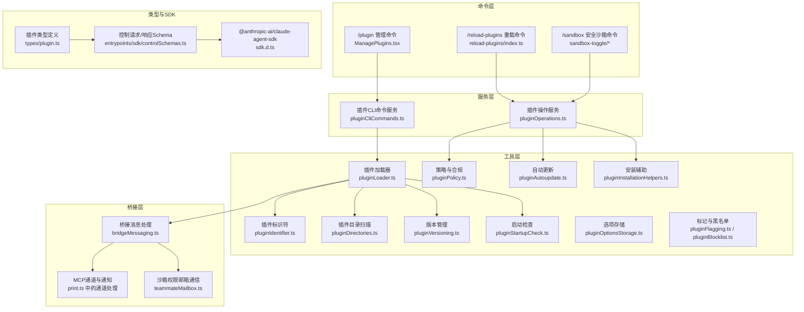
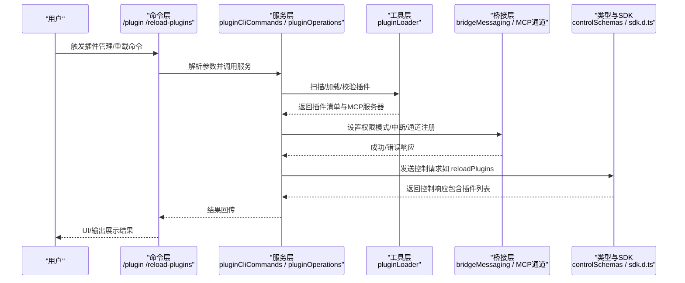
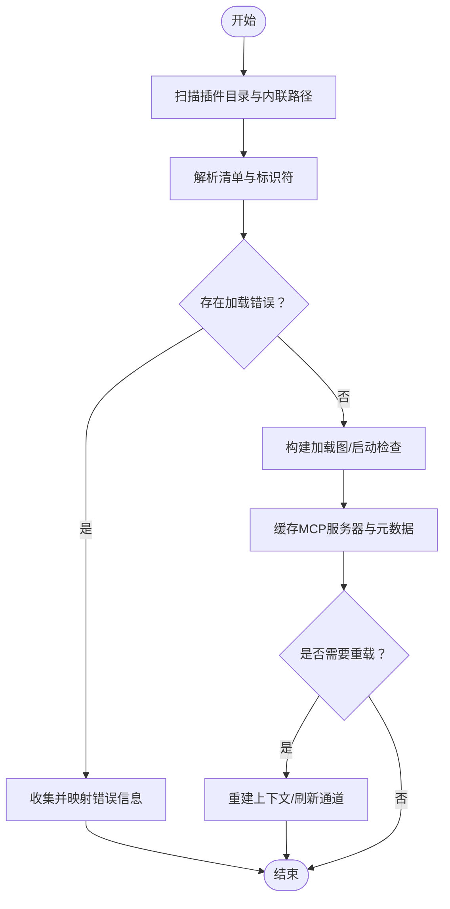
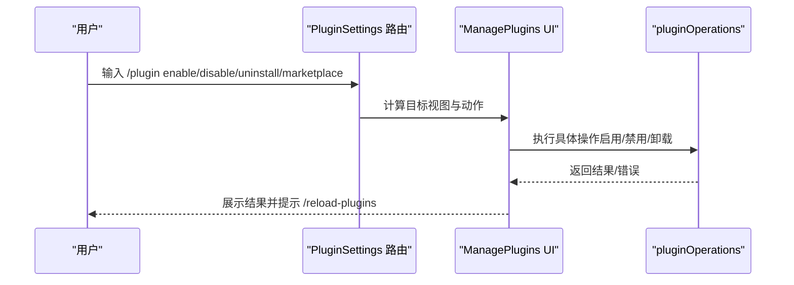
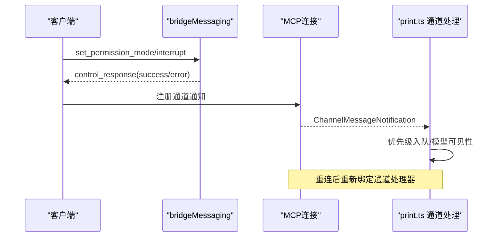
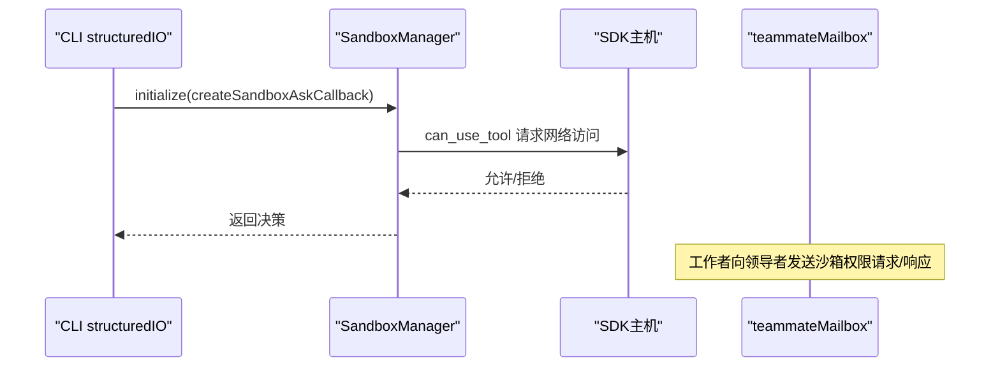

# 插件架构设计

<cite>
**本文引用的文件**
- [src/cli/handlers/plugins.ts](file://src/cli/handlers/plugins.ts)
- [src/commands/plugin/ManagePlugins.tsx](file://src/commands/plugin/ManagePlugins.tsx)
- [src/commands/plugin/PluginSettings.tsx](file://src/commands/plugin/PluginSettings.tsx)
- [src/cli/print.ts](file://src/cli/print.ts)
- [src/cli/structuredIO.ts](file://src/cli/structuredIO.ts)
- [src/bridge/bridgeMessaging.ts](file://src/bridge/bridgeMessaging.ts)
- [src/utils/teammateMailbox.ts](file://src/utils/teammateMailbox.ts)
- [src/commands/sandbox-toggle/sandbox-toggle.tsx](file://src/commands/sandbox-toggle/sandbox-toggle.tsx)
- [src/commands/sandbox-toggle/index.ts](file://src/commands/sandbox-toggle/index.ts)
- [src/setup.ts](file://src/setup.ts)
- [src/types/plugin.ts](file://src/types/plugin.ts)
- [src/utils/plugins/pluginLoader.ts](file://src/utils/plugins/pluginLoader.ts)
- [src/utils/plugins/pluginIdentifier.ts](file://src/utils/plugins/pluginIdentifier.ts)
- [src/utils/plugins/pluginDirectories.ts](file://src/utils/plugins/pluginDirectories.ts)
- [src/utils/plugins/pluginVersioning.ts](file://src/utils/plugins/pluginVersioning.ts)
- [src/utils/plugins/pluginPolicy.ts](file://src/utils/plugins/pluginPolicy.ts)
- [src/utils/plugins/pluginAutoupdate.ts](file://src/utils/plugins/pluginAutoupdate.ts)
- [src/utils/plugins/pluginStartupCheck.ts](file://src/utils/plugins/pluginStartupCheck.ts)
- [src/utils/plugins/pluginOptionsStorage.ts](file://src/utils/plugins/pluginOptionsStorage.ts)
- [src/utils/plugins/pluginFlagging.ts](file://src/utils/plugins/pluginFlagging.ts)
- [src/utils/plugins/pluginBlocklist.ts](file://src/utils/plugins/pluginBlocklist.ts)
- [src/utils/plugins/pluginInstallationHelpers.ts](file://src/utils/plugins/pluginInstallationHelpers.ts)
- [src/services/plugins/pluginCliCommands.ts](file://src/services/plugins/pluginCliCommands.ts)
- [src/services/plugins/pluginOperations.ts](file://src/services/plugins/pluginOperations.ts)
- [src/entrypoints/sdk/controlSchemas.ts](file://src/entrypoints/sdk/controlSchemas.ts)
- [node_modules/@anthropic-ai/claude-agent-sdk/sdk.d.ts](file://node_modules/@anthropic-ai/claude-agent-sdk/sdk.d.ts)
</cite>

## 目录
1. [引言](#引言)
2. [项目结构](#项目结构)
3. [核心组件](#核心组件)
4. [架构总览](#架构总览)
5. [详细组件分析](#详细组件分析)
6. [依赖分析](#依赖分析)
7. [性能考虑](#性能考虑)
8. [故障排查指南](#故障排查指南)
9. [结论](#结论)
10. [附录](#附录)

## 引言
本文件面向 Claude Code 插件系统的架构设计与实现，聚焦于动态加载机制、标准化接口定义、模块化设计原则、生命周期管理、依赖注入与版本兼容策略、插件与主应用的通信协议与事件系统、状态同步机制、安全边界与沙箱隔离、权限控制等主题。通过多维度的架构图与组件关系图，帮助开发者快速理解插件系统的内部工作原理，并提供可操作的优化建议与排障指引。

## 项目结构
插件系统围绕“命令层（CLI/命令）—服务层（插件服务）—工具层（加载器/策略/版本/安装辅助）—桥接层（桥接消息/通道）—类型与SDK”组织，形成清晰的分层与职责边界：

- 命令层：负责用户交互入口与插件管理命令（启用/禁用/卸载/重载/市场等）
- 服务层：封装插件生命周期、安装、更新、策略与合规检查
- 工具层：提供加载器、标识符解析、目录扫描、版本管理、自动更新、启动检查、选项存储、标记与黑名单、安装辅助
- 桥接层：处理桥接消息、权限模式设置、中断、MCP 通道注册与通知
- 类型与SDK：统一插件类型定义与控制请求/响应的SDK契约



**图表来源**
- [src/commands/plugin/ManagePlugins.tsx](file://src/commands/plugin/ManagePlugins.tsx)
- [src/commands/reload-plugins/index.ts](file://src/commands/reload-plugins/index.ts)
- [src/commands/sandbox-toggle/sandbox-toggle.tsx](file://src/commands/sandbox-toggle/sandbox-toggle.tsx)
- [src/services/plugins/pluginCliCommands.ts](file://src/services/plugins/pluginCliCommands.ts)
- [src/services/plugins/pluginOperations.ts](file://src/services/plugins/pluginOperations.ts)
- [src/utils/plugins/pluginLoader.ts](file://src/utils/plugins/pluginLoader.ts)
- [src/utils/plugins/pluginIdentifier.ts](file://src/utils/plugins/pluginIdentifier.ts)
- [src/utils/plugins/pluginDirectories.ts](file://src/utils/plugins/pluginDirectories.ts)
- [src/utils/plugins/pluginVersioning.ts](file://src/utils/plugins/pluginVersioning.ts)
- [src/utils/plugins/pluginPolicy.ts](file://src/utils/plugins/pluginPolicy.ts)
- [src/utils/plugins/pluginAutoupdate.ts](file://src/utils/plugins/pluginAutoupdate.ts)
- [src/utils/plugins/pluginStartupCheck.ts](file://src/utils/plugins/pluginStartupCheck.ts)
- [src/utils/plugins/pluginOptionsStorage.ts](file://src/utils/plugins/pluginOptionsStorage.ts)
- [src/utils/plugins/pluginFlagging.ts](file://src/utils/plugins/pluginFlagging.ts)
- [src/utils/plugins/pluginBlocklist.ts](file://src/utils/plugins/pluginBlocklist.ts)
- [src/utils/plugins/pluginInstallationHelpers.ts](file://src/utils/plugins/pluginInstallationHelpers.ts)
- [src/bridge/bridgeMessaging.ts](file://src/bridge/bridgeMessaging.ts)
- [src/cli/print.ts](file://src/cli/print.ts)
- [src/utils/teammateMailbox.ts](file://src/utils/teammateMailbox.ts)
- [src/types/plugin.ts](file://src/types/plugin.ts)
- [src/entrypoints/sdk/controlSchemas.ts](file://src/entrypoints/sdk/controlSchemas.ts)
- [node_modules/@anthropic-ai/claude-agent-sdk/sdk.d.ts](file://node_modules/@anthropic-ai/claude-agent-sdk/sdk.d.ts)

**章节来源**
- [src/commands/plugin/ManagePlugins.tsx](file://src/commands/plugin/ManagePlugins.tsx)
- [src/commands/reload-plugins/index.ts](file://src/commands/reload-plugins/index.ts)
- [src/commands/sandbox-toggle/sandbox-toggle.tsx](file://src/commands/sandbox-toggle/sandbox-toggle.tsx)
- [src/services/plugins/pluginCliCommands.ts](file://src/services/plugins/pluginCliCommands.ts)
- [src/services/plugins/pluginOperations.ts](file://src/services/plugins/pluginOperations.ts)
- [src/utils/plugins/pluginLoader.ts](file://src/utils/plugins/pluginLoader.ts)
- [src/utils/plugins/pluginIdentifier.ts](file://src/utils/plugins/pluginIdentifier.ts)
- [src/utils/plugins/pluginDirectories.ts](file://src/utils/plugins/pluginDirectories.ts)
- [src/utils/plugins/pluginVersioning.ts](file://src/utils/plugins/pluginVersioning.ts)
- [src/utils/plugins/pluginPolicy.ts](file://src/utils/plugins/pluginPolicy.ts)
- [src/utils/plugins/pluginAutoupdate.ts](file://src/utils/plugins/pluginAutoupdate.ts)
- [src/utils/plugins/pluginStartupCheck.ts](file://src/utils/plugins/pluginStartupCheck.ts)
- [src/utils/plugins/pluginOptionsStorage.ts](file://src/utils/plugins/pluginOptionsStorage.ts)
- [src/utils/plugins/pluginFlagging.ts](file://src/utils/plugins/pluginFlagging.ts)
- [src/utils/plugins/pluginBlocklist.ts](file://src/utils/plugins/pluginBlocklist.ts)
- [src/utils/plugins/pluginInstallationHelpers.ts](file://src/utils/plugins/pluginInstallationHelpers.ts)
- [src/bridge/bridgeMessaging.ts](file://src/bridge/bridgeMessaging.ts)
- [src/cli/print.ts](file://src/cli/print.ts)
- [src/utils/teammateMailbox.ts](file://src/utils/teammateMailbox.ts)
- [src/types/plugin.ts](file://src/types/plugin.ts)
- [src/entrypoints/sdk/controlSchemas.ts](file://src/entrypoints/sdk/controlSchemas.ts)
- [node_modules/@anthropic-ai/claude-agent-sdk/sdk.d.ts](file://node_modules/@anthropic-ai/claude-agent-sdk/sdk.d.ts)

## 核心组件
- 插件加载器与生命周期：负责从磁盘扫描、解析清单、构建加载图、执行启动检查、缓存元数据与MCP服务器信息，并在重载时重建上下文
- 插件管理命令与UI：提供启用/禁用/卸载/重载/市场浏览/添加/移除等能力，并在变更后提示用户执行重载以生效
- 权限与沙箱：通过桥接消息设置权限模式、中断会话；通过沙箱适配器与邮箱通信实现网络访问的许可请求与响应
- MCP 通道与通知：支持插件侧通道消息的注册、再绑定、优先级入队与模型可见性
- 控制请求/响应与SDK契约：统一的控制请求（如重载插件）与响应Schema，以及SDK中的类型定义

**章节来源**
- [src/utils/plugins/pluginLoader.ts](file://src/utils/plugins/pluginLoader.ts)
- [src/commands/plugin/ManagePlugins.tsx](file://src/commands/plugin/ManagePlugins.tsx)
- [src/bridge/bridgeMessaging.ts](file://src/bridge/bridgeMessaging.ts)
- [src/cli/print.ts](file://src/cli/print.ts)
- [src/entrypoints/sdk/controlSchemas.ts](file://src/entrypoints/sdk/controlSchemas.ts)
- [node_modules/@anthropic-ai/claude-agent-sdk/sdk.d.ts](file://node_modules/@anthropic-ai/claude-agent-sdk/sdk.d.ts)

## 架构总览
下图展示了插件系统的关键交互路径：命令触发 → 服务编排 → 加载器执行 → 桥接与MCP通道 → SDK控制请求/响应。



**图表来源**
- [src/commands/plugin/ManagePlugins.tsx](file://src/commands/plugin/ManagePlugins.tsx)
- [src/services/plugins/pluginCliCommands.ts](file://src/services/plugins/pluginCliCommands.ts)
- [src/services/plugins/pluginOperations.ts](file://src/services/plugins/pluginOperations.ts)
- [src/utils/plugins/pluginLoader.ts](file://src/utils/plugins/pluginLoader.ts)
- [src/bridge/bridgeMessaging.ts](file://src/bridge/bridgeMessaging.ts)
- [src/cli/print.ts](file://src/cli/print.ts)
- [src/entrypoints/sdk/controlSchemas.ts](file://src/entrypoints/sdk/controlSchemas.ts)
- [node_modules/@anthropic-ai/claude-agent-sdk/sdk.d.ts](file://node_modules/@anthropic-ai/claude-agent-sdk/sdk.d.ts)

## 详细组件分析

### 组件A：插件加载与生命周期管理
- 动态加载：扫描已安装与内联插件，解析错误来源，聚合MCP服务器信息，支持会话作用域插件与安装元数据
- 生命周期：初始化阶段注册背景任务与技能/插件；重载时重建上下文并刷新MCP通道
- 错误处理：区分安装错误与内联加载错误，确保JSON消费者可见失败项



**图表来源**
- [src/cli/handlers/plugins.ts](file://src/cli/handlers/plugins.ts)
- [src/utils/plugins/pluginLoader.ts](file://src/utils/plugins/pluginLoader.ts)
- [src/utils/plugins/pluginIdentifier.ts](file://src/utils/plugins/pluginIdentifier.ts)
- [src/utils/plugins/pluginStartupCheck.ts](file://src/utils/plugins/pluginStartupCheck.ts)

**章节来源**
- [src/cli/handlers/plugins.ts](file://src/cli/handlers/plugins.ts)
- [src/setup.ts](file://src/setup.ts)
- [src/utils/plugins/pluginLoader.ts](file://src/utils/plugins/pluginLoader.ts)
- [src/utils/plugins/pluginIdentifier.ts](file://src/utils/plugins/pluginIdentifier.ts)
- [src/utils/plugins/pluginStartupCheck.ts](file://src/utils/plugins/pluginStartupCheck.ts)

### 组件B：插件管理命令与UI
- 命令路由：根据子命令（enable/disable/uninstall/marketplace/menu）进入不同视图或执行操作
- 自动执行：在详情页加载完成后自动执行挂起的操作，减少用户步骤
- 变更提示：操作成功后提示用户执行重载以应用变更



**图表来源**
- [src/commands/plugin/PluginSettings.tsx](file://src/commands/plugin/PluginSettings.tsx)
- [src/commands/plugin/ManagePlugins.tsx](file://src/commands/plugin/ManagePlugins.tsx)
- [src/services/plugins/pluginOperations.ts](file://src/services/plugins/pluginOperations.ts)

**章节来源**
- [src/commands/plugin/PluginSettings.tsx](file://src/commands/plugin/PluginSettings.tsx)
- [src/commands/plugin/ManagePlugins.tsx](file://src/commands/plugin/ManagePlugins.tsx)
- [src/services/plugins/pluginOperations.ts](file://src/services/plugins/pluginOperations.ts)

### 组件C：桥接消息与MCP通道
- 权限模式设置：通过桥接消息设置权限模式，若回调未注册则返回错误
- 中断控制：接收中断请求并返回成功响应
- MCP 通道：注册通道通知处理器，对通道消息进行优先级入队与模型可见性处理，并在重连后重新绑定



**图表来源**
- [src/bridge/bridgeMessaging.ts](file://src/bridge/bridgeMessaging.ts)
- [src/cli/print.ts](file://src/cli/print.ts)

**章节来源**
- [src/bridge/bridgeMessaging.ts](file://src/bridge/bridgeMessaging.ts)
- [src/cli/print.ts](file://src/cli/print.ts)

### 组件D：沙箱隔离与权限控制
- 沙箱初始化：在命令执行前检查依赖与平台限制，必要时通过回调将网络访问请求转发至SDK主机
- 邮箱通信：通过团队邮箱在工作者与领导者之间传递沙箱权限请求/响应，支持唯一ID与时间戳
- 命令集成：/sandbox 命令提供交互式菜单与排除规则配置



**图表来源**
- [src/cli/structuredIO.ts](file://src/cli/structuredIO.ts)
- [src/cli/print.ts](file://src/cli/print.ts)
- [src/utils/teammateMailbox.ts](file://src/utils/teammateMailbox.ts)
- [src/commands/sandbox-toggle/sandbox-toggle.tsx](file://src/commands/sandbox-toggle/sandbox-toggle.tsx)
- [src/commands/sandbox-toggle/index.ts](file://src/commands/sandbox-toggle/index.ts)

**章节来源**
- [src/cli/structuredIO.ts](file://src/cli/structuredIO.ts)
- [src/cli/print.ts](file://src/cli/print.ts)
- [src/utils/teammateMailbox.ts](file://src/utils/teammateMailbox.ts)
- [src/commands/sandbox-toggle/sandbox-toggle.tsx](file://src/commands/sandbox-toggle/sandbox-toggle.tsx)
- [src/commands/sandbox-toggle/index.ts](file://src/commands/sandbox-toggle/index.ts)

### 组件E：控制请求/响应与SDK契约
- 控制请求：统一的重载插件请求与响应Schema，用于跨进程/跨端口的控制通信
- SDK类型：在SDK中定义了重载插件的请求/响应类型，保证客户端与服务端契约一致

```mermaid
classDiagram
class SDKControlReloadPluginsRequest {
+type : "control_request"
+subtype : "reload_plugins"
}
class SDKControlReloadPluginsResponse {
+type : "control_response"
+response : { plugins : PluginInfo[] }
}
class ControlSchemas {
+SDKControlReloadPluginsRequestSchema()
+SDKControlReloadPluginsResponseSchema()
}
SDKControlReloadPluginsRequest --> ControlSchemas : "使用Schema"
SDKControlReloadPluginsResponse --> ControlSchemas : "使用Schema"
```

**图表来源**
- [src/entrypoints/sdk/controlSchemas.ts](file://src/entrypoints/sdk/controlSchemas.ts)
- [node_modules/@anthropic-ai/claude-agent-sdk/sdk.d.ts](file://node_modules/@anthropic-ai/claude-agent-sdk/sdk.d.ts)

**章节来源**
- [src/entrypoints/sdk/controlSchemas.ts](file://src/entrypoints/sdk/controlSchemas.ts)
- [node_modules/@anthropic-ai/claude-agent-sdk/sdk.d.ts](file://node_modules/@anthropic-ai/claude-agent-sdk/sdk.d.ts)

## 依赖分析
- 组件耦合与内聚：命令层与服务层松耦合，通过工具层提供高内聚的功能模块；桥接层与MCP通道独立于业务逻辑，便于扩展
- 外部依赖：SDK契约与Schema定义作为外部接口约束，确保客户端与服务端一致性
- 循环依赖：未见明显循环依赖迹象；各层职责清晰，导入方向单向


**图表来源**
- [src/commands/plugin/ManagePlugins.tsx](file://src/commands/plugin/ManagePlugins.tsx)
- [src/services/plugins/pluginOperations.ts](file://src/services/plugins/pluginOperations.ts)
- [src/utils/plugins/pluginLoader.ts](file://src/utils/plugins/pluginLoader.ts)
- [src/bridge/bridgeMessaging.ts](file://src/bridge/bridgeMessaging.ts)
- [src/entrypoints/sdk/controlSchemas.ts](file://src/entrypoints/sdk/controlSchemas.ts)
- [node_modules/@anthropic-ai/claude-agent-sdk/sdk.d.ts](file://node_modules/@anthropic-ai/claude-agent-sdk/sdk.d.ts)

**章节来源**
- [src/commands/plugin/ManagePlugins.tsx](file://src/commands/plugin/ManagePlugins.tsx)
- [src/services/plugins/pluginOperations.ts](file://src/services/plugins/pluginOperations.ts)
- [src/utils/plugins/pluginLoader.ts](file://src/utils/plugins/pluginLoader.ts)
- [src/bridge/bridgeMessaging.ts](file://src/bridge/bridgeMessaging.ts)
- [src/entrypoints/sdk/controlSchemas.ts](file://src/entrypoints/sdk/controlSchemas.ts)
- [node_modules/@anthropic-ai/claude-agent-sdk/sdk.d.ts](file://node_modules/@anthropic-ai/claude-agent-sdk/sdk.d.ts)

## 性能考虑
- 并行加载：在初始化阶段并行注册背景任务与技能/插件，避免阻塞首次查询
- 缓存与增量更新：插件元数据与MCP服务器信息缓存，重载时仅重建受影响上下文
- 通道优先级：通道消息以高优先级入队，确保模型在下一回合可见，降低延迟
- 沙箱回调：通过回调转发网络许可请求，避免阻塞式等待，提升交互流畅度

**章节来源**
- [src/setup.ts](file://src/setup.ts)
- [src/cli/print.ts](file://src/cli/print.ts)
- [src/cli/structuredIO.ts](file://src/cli/structuredIO.ts)

## 故障排查指南
- 插件加载失败：检查安装错误与内联加载错误，确认插件标识符与目录路径；必要时查看会话作用域插件的错误列表
- 重载不生效：确认已完成“/reload-plugins”重载；UI会在操作后提示执行重载
- 沙箱不可用：若沙箱被要求但不可用，将拒绝启动；若被禁用，将以非沙箱方式运行并发出警告
- 权限模式设置失败：若桥接上下文不支持设置权限模式，将返回错误；请检查回调是否正确注册
- MCP 通道消息丢失：在重连后需重新绑定通道处理器；确认通道已允许且服务器能力匹配

**章节来源**
- [src/cli/handlers/plugins.ts](file://src/cli/handlers/plugins.ts)
- [src/commands/plugin/ManagePlugins.tsx](file://src/commands/plugin/ManagePlugins.tsx)
- [src/cli/print.ts](file://src/cli/print.ts)
- [src/bridge/bridgeMessaging.ts](file://src/bridge/bridgeMessaging.ts)

## 结论
该插件架构通过清晰的分层与职责划分，实现了动态加载、标准化接口、模块化设计与强安全边界。命令层与服务层解耦、工具层提供高内聚功能、桥接层与MCP通道独立扩展、SDK契约统一控制流，共同保障了插件系统的可维护性、可扩展性与安全性。建议在后续迭代中持续完善错误诊断与可观测性，进一步优化重载路径与沙箱性能。

## 附录
- 关键类型与Schema：插件类型定义、控制请求/响应Schema、SDK类型声明
- 实践建议：在变更插件状态后及时重载；关注沙箱依赖与平台限制；合理配置MCP通道与权限模式

**章节来源**
- [src/types/plugin.ts](file://src/types/plugin.ts)
- [src/entrypoints/sdk/controlSchemas.ts](file://src/entrypoints/sdk/controlSchemas.ts)
- [node_modules/@anthropic-ai/claude-agent-sdk/sdk.d.ts](file://node_modules/@anthropic-ai/claude-agent-sdk/sdk.d.ts)