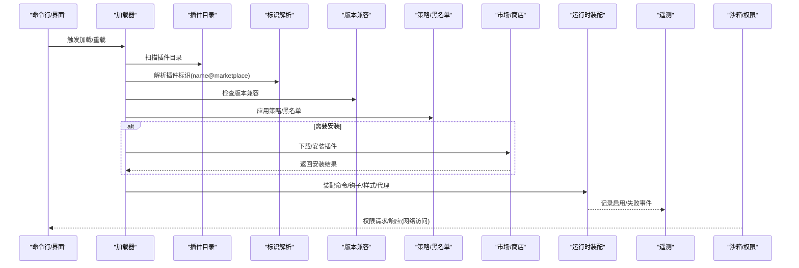
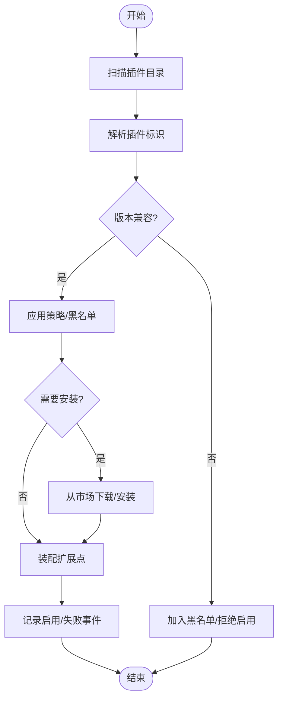
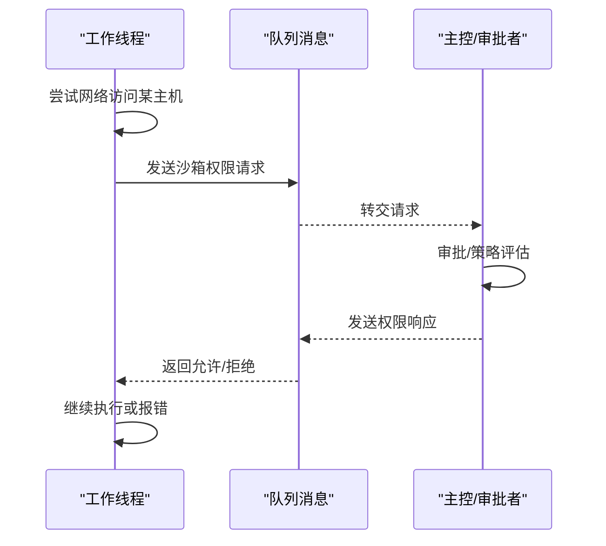
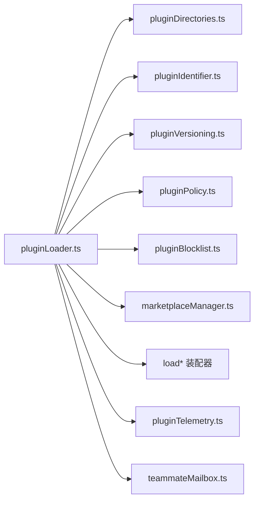

# 插件系统

<cite>
**本文引用的文件**
- [src/plugins/builtinPlugins.ts](file://src/plugins/builtinPlugins.ts)
- [src/plugins/bundled/index.ts](file://src/plugins/bundled/index.ts)
- [src/utils/plugins/pluginLoader.ts](file://src/utils/plugins/pluginLoader.ts)
- [src/utils/plugins/pluginDirectories.ts](file://src/utils/plugins/pluginDirectories.ts)
- [src/utils/plugins/pluginIdentifier.ts](file://src/utils/plugins/pluginIdentifier.ts)
- [src/utils/plugins/pluginVersioning.ts](file://src/utils/plugins/pluginVersioning.ts)
- [src/utils/plugins/pluginPolicy.ts](file://src/utils/plugins/pluginPolicy.ts)
- [src/utils/plugins/pluginAutoupdate.ts](file://src/utils/plugins/pluginAutoupdate.ts)
- [src/utils/plugins/marketplaceManager.ts](file://src/utils/plugins/marketplaceManager.ts)
- [src/utils/plugins/officialMarketplace.ts](file://src/utils/plugins/officialMarketplace.ts)
- [src/utils/plugins/marketplaceHelpers.ts](file://src/utils/plugins/marketplaceHelpers.ts)
- [src/utils/plugins/pluginInstallationHelpers.ts](file://src/utils/plugins/pluginInstallationHelpers.ts)
- [src/utils/plugins/pluginStartupCheck.ts](file://src/utils/plugins/pluginStartupCheck.ts)
- [src/utils/plugins/installedPluginsManager.ts](file://src/utils/plugins/installedPluginsManager.ts)
- [src/utils/plugins/pluginOptionsStorage.ts](file://src/utils/plugins/pluginOptionsStorage.ts)
- [src/utils/plugins/pluginBlocklist.ts](file://src/utils/plugins/pluginBlocklist.ts)
- [src/utils/plugins/pluginFlagging.ts](file://src/utils/plugins/pluginFlagging.ts)
- [src/utils/plugins/lspPluginIntegration.ts](file://src/utils/plugins/lspPluginIntegration.ts)
- [src/utils/plugins/mcpPluginIntegration.ts](file://src/utils/plugins/mcpPluginIntegration.ts)
- [src/utils/plugins/loadPluginCommands.ts](file://src/utils/plugins/loadPluginCommands.ts)
- [src/utils/plugins/loadPluginHooks.ts](file://src/utils/plugins/loadPluginHooks.ts)
- [src/utils/plugins/loadPluginOutputStyles.ts](file://src/utils/plugins/loadPluginOutputStyles.ts)
- [src/utils/plugins/loadPluginAgents.ts](file://src/utils/plugins/loadPluginAgents.ts)
- [src/utils/telemetry/pluginTelemetry.ts](file://src/utils/telemetry/pluginTelemetry.ts)
- [src/utils/teammateMailbox.ts](file://src/utils/teammateMailbox.ts)
- [src/commands/reload-plugins/reload-plugins.ts](file://src/commands/reload-plugins/reload-plugins.ts)
- [src/services/plugins/pluginOperations.ts](file://src/services/plugins/pluginOperations.ts)
- [src/services/plugins/pluginCliCommands.ts](file://src/services/plugins/pluginCliCommands.ts)
- [src/types/plugin.ts](file://src/types/plugin.ts)
</cite>

## 目录
1. [简介](#简介)
2. [项目结构](#项目结构)
3. [核心组件](#核心组件)
4. [架构总览](#架构总览)
5. [组件详解](#组件详解)
6. [依赖关系分析](#依赖关系分析)
7. [性能考量](#性能考量)
8. [故障排查指南](#故障排查指南)
9. [结论](#结论)
10. [附录](#附录)

## 简介
本文件面向 Claude Code 插件系统的使用者与开发者，系统化阐述插件架构设计、动态加载机制、标准化接口与版本兼容性管理；提供插件开发指南（模板、API、生命周期、错误处理）；介绍内置插件、插件市场与商店集成；说明安全策略、权限管理与沙箱隔离；并给出最佳实践、调试技巧与发布流程建议。

## 项目结构
插件系统围绕“加载器”“目录与标识”“版本与策略”“市场与安装”“启动检查与遥测”等模块组织，形成从发现到运行、从安装到卸载的闭环。关键目录与职责概览：
- 插件定义与类型：src/types/plugin.ts
- 内置插件清单与打包入口：src/plugins/builtinPlugins.ts、src/plugins/bundled/index.ts
- 动态加载与装配：src/utils/plugins/pluginLoader.ts、loadPluginCommands.ts、loadPluginHooks.ts、loadPluginOutputStyles.ts、loadPluginAgents.ts
- 目录与标识：src/utils/plugins/pluginDirectories.ts、src/utils/plugins/pluginIdentifier.ts
- 版本与兼容：src/utils/plugins/pluginVersioning.ts
- 策略与白名单：src/utils/plugins/pluginPolicy.ts、src/utils/plugins/pluginBlocklist.ts
- 自动更新：src/utils/plugins/pluginAutoupdate.ts
- 市场与商店：src/utils/plugins/marketplaceManager.ts、src/utils/plugins/officialMarketplace.ts、src/utils/plugins/marketplaceHelpers.ts、src/utils/plugins/pluginInstallationHelpers.ts
- 启动检查：src/utils/plugins/pluginStartupCheck.ts
- 已安装插件管理：src/utils/plugins/installedPluginsManager.ts
- 配置存储：src/utils/plugins/pluginOptionsStorage.ts
- LSP/MCP 集成：src/utils/plugins/lspPluginIntegration.ts、src/utils/plugins/mcpPluginIntegration.ts
- 遥测：src/utils/telemetry/pluginTelemetry.ts
- 安全与权限：src/utils/teammateMailbox.ts（沙箱权限请求/响应消息）
- CLI 与命令：src/commands/reload-plugins/reload-plugins.ts、src/services/plugins/pluginOperations.ts、src/services/plugins/pluginCliCommands.ts

```mermaid
graph TB
subgraph "插件定义与类型"
T["types/plugin.ts"]
end
subgraph "内置与打包"
BP["plugins/builtinPlugins.ts"]
BD["plugins/bundled/index.ts"]
end
subgraph "加载与装配"
PL["utils/plugins/pluginLoader.ts"]
LCMDS["utils/plugins/loadPluginCommands.ts"]
LHKS["utils/plugins/loadPluginHooks.ts"]
LOPTS["utils/plugins/loadPluginOutputStyles.ts"]
LAG["utils/plugins/loadPluginAgents.ts"]
end
subgraph "目录与标识"
PDIR["utils/plugins/pluginDirectories.ts"]
PID["utils/plugins/pluginIdentifier.ts"]
end
subgraph "版本与策略"
PV["utils/plugins/pluginVersioning.ts"]
PP["utils/plugins/pluginPolicy.ts"]
PBL["utils/plugins/pluginBlocklist.ts"]
end
subgraph "市场与商店"
MM["utils/plugins/marketplaceManager.ts"]
OM["utils/plugins/officialMarketplace.ts"]
MH["utils/plugins/marketplaceHelpers.ts"]
PIH["utils/plugins/pluginInstallationHelpers.ts"]
end
subgraph "运行期"
PSUC["utils/plugins/pluginStartupCheck.ts"]
IPM["utils/plugins/installedPluginsManager.ts"]
POS["utils/plugins/pluginOptionsStorage.ts"]
LAU["utils/plugins/pluginAutoupdate.ts"]
end
subgraph "集成与遥测"
LPI["utils/plugins/lspPluginIntegration.ts"]
MPI["utils/plugins/mcpPluginIntegration.ts"]
PT["utils/telemetry/pluginTelemetry.ts"]
TM["utils/telemetry/pluginTelemetry.ts"]
end
subgraph "安全与权限"
TMB["utils/teammateMailbox.ts"]
end
subgraph "CLI 与命令"
RPL["commands/reload-plugins/reload-plugins.ts"]
PO["services/plugins/pluginOperations.ts"]
PC["services/plugins/pluginCliCommands.ts"]
end
T --> PL
BP --> PL
BD --> PL
PDIR --> PL
PID --> PL
PV --> PL
PP --> PL
PBL --> PL
MM --> PL
OM --> PL
MH --> PL
PIH --> PL
PSUC --> PL
IPM --> PL
POS --> PL
LAU --> PL
LPI --> PL
MPI --> PL
PT --> PL
TMB --> PL
RPL --> PL
PO --> PL
PC --> PL
```

**图表来源**
- [src/types/plugin.ts](file://src/types/plugin.ts)
- [src/plugins/builtinPlugins.ts](file://src/plugins/builtinPlugins.ts)
- [src/plugins/bundled/index.ts](file://src/plugins/bundled/index.ts)
- [src/utils/plugins/pluginLoader.ts](file://src/utils/plugins/pluginLoader.ts)
- [src/utils/plugins/loadPluginCommands.ts](file://src/utils/plugins/loadPluginCommands.ts)
- [src/utils/plugins/loadPluginHooks.ts](file://src/utils/plugins/loadPluginHooks.ts)
- [src/utils/plugins/loadPluginOutputStyles.ts](file://src/utils/plugins/loadPluginOutputStyles.ts)
- [src/utils/plugins/loadPluginAgents.ts](file://src/utils/plugins/loadPluginAgents.ts)
- [src/utils/plugins/pluginDirectories.ts](file://src/utils/plugins/pluginDirectories.ts)
- [src/utils/plugins/pluginIdentifier.ts](file://src/utils/plugins/pluginIdentifier.ts)
- [src/utils/plugins/pluginVersioning.ts](file://src/utils/plugins/pluginVersioning.ts)
- [src/utils/plugins/pluginPolicy.ts](file://src/utils/plugins/pluginPolicy.ts)
- [src/utils/plugins/pluginBlocklist.ts](file://src/utils/plugins/pluginBlocklist.ts)
- [src/utils/plugins/marketplaceManager.ts](file://src/utils/plugins/marketplaceManager.ts)
- [src/utils/plugins/officialMarketplace.ts](file://src/utils/plugins/officialMarketplace.ts)
- [src/utils/plugins/marketplaceHelpers.ts](file://src/utils/plugins/marketplaceHelpers.ts)
- [src/utils/plugins/pluginInstallationHelpers.ts](file://src/utils/plugins/pluginInstallationHelpers.ts)
- [src/utils/plugins/pluginStartupCheck.ts](file://src/utils/plugins/pluginStartupCheck.ts)
- [src/utils/plugins/installedPluginsManager.ts](file://src/utils/plugins/installedPluginsManager.ts)
- [src/utils/plugins/pluginOptionsStorage.ts](file://src/utils/plugins/pluginOptionsStorage.ts)
- [src/utils/plugins/pluginAutoupdate.ts](file://src/utils/plugins/pluginAutoupdate.ts)
- [src/utils/plugins/lspPluginIntegration.ts](file://src/utils/plugins/lspPluginIntegration.ts)
- [src/utils/plugins/mcpPluginIntegration.ts](file://src/utils/plugins/mcpPluginIntegration.ts)
- [src/utils/telemetry/pluginTelemetry.ts](file://src/utils/telemetry/pluginTelemetry.ts)
- [src/utils/teammateMailbox.ts](file://src/utils/teammateMailbox.ts)
- [src/commands/reload-plugins/reload-plugins.ts](file://src/commands/reload-plugins/reload-plugins.ts)
- [src/services/plugins/pluginOperations.ts](file://src/services/plugins/pluginOperations.ts)
- [src/services/plugins/pluginCliCommands.ts](file://src/services/plugins/pluginCliCommands.ts)

**章节来源**
- [src/types/plugin.ts](file://src/types/plugin.ts)
- [src/plugins/builtinPlugins.ts](file://src/plugins/builtinPlugins.ts)
- [src/plugins/bundled/index.ts](file://src/plugins/bundled/index.ts)
- [src/utils/plugins/pluginLoader.ts](file://src/utils/plugins/pluginLoader.ts)

## 核心组件
- 插件类型与元数据：定义插件清单、加载状态、错误分类、启用方式、遥测字段等，确保跨模块一致的数据契约。
- 加载器与装配器：负责扫描目录、解析标识、执行版本兼容性检查、装配命令/钩子/输出样式/代理等扩展点。
- 目录与标识：统一插件路径与唯一标识解析规则，支持内置、用户安装、企业托管、种子挂载等多种来源。
- 版本与策略：版本解析与兼容判断、自动更新策略、黑名单与封禁策略。
- 市场与商店：官方市场接入、安装辅助、输入解析与启动检查。
- 运行期管理：启动检查、已安装插件管理、配置存储、自动更新。
- 集成与遥测：LSP/MCP 集成、插件生命周期事件遥测、隐私保护的双列模式。
- 安全与权限：沙箱网络访问请求/响应消息协议，团队内权限协调。
- CLI 与命令：重载插件、安装/卸载/升级等操作的命令行入口。

**章节来源**
- [src/types/plugin.ts](file://src/types/plugin.ts)
- [src/utils/plugins/pluginLoader.ts](file://src/utils/plugins/pluginLoader.ts)
- [src/utils/plugins/pluginDirectories.ts](file://src/utils/plugins/pluginDirectories.ts)
- [src/utils/plugins/pluginIdentifier.ts](file://src/utils/plugins/pluginIdentifier.ts)
- [src/utils/plugins/pluginVersioning.ts](file://src/utils/plugins/pluginVersioning.ts)
- [src/utils/plugins/pluginPolicy.ts](file://src/utils/plugins/pluginPolicy.ts)
- [src/utils/plugins/pluginAutoupdate.ts](file://src/utils/plugins/pluginAutoupdate.ts)
- [src/utils/plugins/marketplaceManager.ts](file://src/utils/plugins/marketplaceManager.ts)
- [src/utils/plugins/officialMarketplace.ts](file://src/utils/plugins/officialMarketplace.ts)
- [src/utils/plugins/marketplaceHelpers.ts](file://src/utils/plugins/marketplaceHelpers.ts)
- [src/utils/plugins/pluginInstallationHelpers.ts](file://src/utils/plugins/pluginInstallationHelpers.ts)
- [src/utils/plugins/pluginStartupCheck.ts](file://src/utils/plugins/pluginStartupCheck.ts)
- [src/utils/plugins/installedPluginsManager.ts](file://src/utils/plugins/installedPluginsManager.ts)
- [src/utils/plugins/pluginOptionsStorage.ts](file://src/utils/plugins/pluginOptionsStorage.ts)
- [src/utils/plugins/lspPluginIntegration.ts](file://src/utils/plugins/lspPluginIntegration.ts)
- [src/utils/plugins/mcpPluginIntegration.ts](file://src/utils/plugins/mcpPluginIntegration.ts)
- [src/utils/telemetry/pluginTelemetry.ts](file://src/utils/telemetry/pluginTelemetry.ts)
- [src/utils/teammateMailbox.ts](file://src/utils/teammateMailbox.ts)
- [src/commands/reload-plugins/reload-plugins.ts](file://src/commands/reload-plugins/reload-plugins.ts)
- [src/services/plugins/pluginOperations.ts](file://src/services/plugins/pluginOperations.ts)
- [src/services/plugins/pluginCliCommands.ts](file://src/services/plugins/pluginCliCommands.ts)

## 架构总览
下图展示从“发现与解析”到“装配与运行”的端到端流程，以及与市场、遥测、安全的交互。

**图表来源**
- [src/utils/plugins/pluginLoader.ts](file://src/utils/plugins/pluginLoader.ts)
- [src/utils/plugins/pluginDirectories.ts](file://src/utils/plugins/pluginDirectories.ts)
- [src/utils/plugins/pluginIdentifier.ts](file://src/utils/plugins/pluginIdentifier.ts)
- [src/utils/plugins/pluginVersioning.ts](file://src/utils/plugins/pluginVersioning.ts)
- [src/utils/plugins/pluginPolicy.ts](file://src/utils/plugins/pluginPolicy.ts)
- [src/utils/plugins/pluginBlocklist.ts](file://src/utils/plugins/pluginBlocklist.ts)
- [src/utils/plugins/marketplaceManager.ts](file://src/utils/plugins/marketplaceManager.ts)
- [src/utils/plugins/officialMarketplace.ts](file://src/utils/plugins/officialMarketplace.ts)
- [src/utils/plugins/loadPluginCommands.ts](file://src/utils/plugins/loadPluginCommands.ts)
- [src/utils/plugins/loadPluginHooks.ts](file://src/utils/plugins/loadPluginHooks.ts)
- [src/utils/plugins/loadPluginOutputStyles.ts](file://src/utils/plugins/loadPluginOutputStyles.ts)
- [src/utils/plugins/loadPluginAgents.ts](file://src/utils/plugins/loadPluginAgents.ts)
- [src/utils/telemetry/pluginTelemetry.ts](file://src/utils/telemetry/pluginTelemetry.ts)
- [src/utils/teammateMailbox.ts](file://src/utils/teammateMailbox.ts)

## 组件详解

### 插件类型与元数据
- 插件清单字段：名称、市场、版本、入口、能力声明、权限需求、输出样式、代理等。
- 加载状态与错误分类：区分加载失败、网络错误、权限错误、校验错误等类别，便于诊断与告警。
- 启用方式与来源：默认启用、企业策略、种子挂载、用户安装等，用于统计与合规。
- 遥测字段：插件ID哈希、作用域枚举、脱敏列、是否官方插件等，满足隐私与聚合需求。

**章节来源**
- [src/types/plugin.ts](file://src/types/plugin.ts)
- [src/utils/telemetry/pluginTelemetry.ts](file://src/utils/telemetry/pluginTelemetry.ts)

### 动态加载机制
- 目录扫描：遍历内置与用户目录，识别插件根目录与清单文件。
- 标识解析：解析 name@marketplace，支持大小写与市场名规范化。
- 版本兼容：根据目标环境版本范围判断兼容性。
- 装配扩展点：按需注入命令、钩子、输出样式、代理等。
- 错误分类：对网络、权限、校验、未知等错误进行归类，便于上报与恢复。

**图表来源**
- [src/utils/plugins/pluginLoader.ts](file://src/utils/plugins/pluginLoader.ts)
- [src/utils/plugins/pluginDirectories.ts](file://src/utils/plugins/pluginDirectories.ts)
- [src/utils/plugins/pluginIdentifier.ts](file://src/utils/plugins/pluginIdentifier.ts)
- [src/utils/plugins/pluginVersioning.ts](file://src/utils/plugins/pluginVersioning.ts)
- [src/utils/plugins/pluginPolicy.ts](file://src/utils/plugins/pluginPolicy.ts)
- [src/utils/plugins/pluginBlocklist.ts](file://src/utils/plugins/pluginBlocklist.ts)
- [src/utils/plugins/marketplaceManager.ts](file://src/utils/plugins/marketplaceManager.ts)
- [src/utils/plugins/officialMarketplace.ts](file://src/utils/plugins/officialMarketplace.ts)
- [src/utils/telemetry/pluginTelemetry.ts](file://src/utils/telemetry/pluginTelemetry.ts)

**章节来源**
- [src/utils/plugins/pluginLoader.ts](file://src/utils/plugins/pluginLoader.ts)
- [src/utils/plugins/pluginDirectories.ts](file://src/utils/plugins/pluginDirectories.ts)
- [src/utils/plugins/pluginIdentifier.ts](file://src/utils/plugins/pluginIdentifier.ts)
- [src/utils/plugins/pluginVersioning.ts](file://src/utils/plugins/pluginVersioning.ts)
- [src/utils/plugins/pluginPolicy.ts](file://src/utils/plugins/pluginPolicy.ts)
- [src/utils/plugins/pluginBlocklist.ts](file://src/utils/plugins/pluginBlocklist.ts)
- [src/utils/plugins/marketplaceManager.ts](file://src/utils/plugins/marketplaceManager.ts)
- [src/utils/plugins/officialMarketplace.ts](file://src/utils/plugins/officialMarketplace.ts)
- [src/utils/telemetry/pluginTelemetry.ts](file://src/utils/telemetry/pluginTelemetry.ts)

### 标准化接口与生命周期
- 标准化接口：命令、钩子、输出样式、代理、MCP/LSP 集成等扩展点均有统一注册与调用约定。
- 生命周期：发现 → 解析 → 兼容性检查 → 策略应用 → 安装/启用 → 装配 → 运行 → 卸载/禁用。
- 生命周期事件遥测：记录启用、失败、卸载、自动更新等事件，支持按插件聚合与趋势分析。

**章节来源**
- [src/utils/plugins/loadPluginCommands.ts](file://src/utils/plugins/loadPluginCommands.ts)
- [src/utils/plugins/loadPluginHooks.ts](file://src/utils/plugins/loadPluginHooks.ts)
- [src/utils/plugins/loadPluginOutputStyles.ts](file://src/utils/plugins/loadPluginOutputStyles.ts)
- [src/utils/plugins/loadPluginAgents.ts](file://src/utils/plugins/loadPluginAgents.ts)
- [src/utils/plugins/lspPluginIntegration.ts](file://src/utils/plugins/lspPluginIntegration.ts)
- [src/utils/plugins/mcpPluginIntegration.ts](file://src/utils/plugins/mcpPluginIntegration.ts)
- [src/utils/telemetry/pluginTelemetry.ts](file://src/utils/telemetry/pluginTelemetry.ts)

### 版本兼容性管理
- 版本解析：支持语义化版本与范围表达式。
- 兼容性判定：基于目标运行时版本与插件声明的版本范围计算。
- 回退策略：当不兼容时提示升级或降级，必要时回滚至稳定版本。

**章节来源**
- [src/utils/plugins/pluginVersioning.ts](file://src/utils/plugins/pluginVersioning.ts)

### 插件开发指南
- 插件模板：参考内置插件与打包入口，遵循清单字段与入口规范。
- API 接口：命令、钩子、输出样式、代理、MCP/LSP 集成的注册与调用方式。
- 生命周期管理：在合适阶段完成初始化、资源清理、错误处理。
- 错误处理：区分网络、权限、校验、未知错误，提供可诊断的错误信息与恢复建议。

**章节来源**
- [src/plugins/builtinPlugins.ts](file://src/plugins/builtinPlugins.ts)
- [src/plugins/bundled/index.ts](file://src/plugins/bundled/index.ts)
- [src/utils/plugins/loadPluginCommands.ts](file://src/utils/plugins/loadPluginCommands.ts)
- [src/utils/plugins/loadPluginHooks.ts](file://src/utils/plugins/loadPluginHooks.ts)
- [src/utils/plugins/loadPluginOutputStyles.ts](file://src/utils/plugins/loadPluginOutputStyles.ts)
- [src/utils/plugins/loadPluginAgents.ts](file://src/utils/plugins/loadPluginAgents.ts)
- [src/utils/plugins/mcpPluginIntegration.ts](file://src/utils/plugins/mcpPluginIntegration.ts)
- [src/utils/plugins/lspPluginIntegration.ts](file://src/utils/plugins/lspPluginIntegration.ts)

### 内置插件与使用
- 内置插件：随产品默认启用，标识属于内置市场，具备最高信任度。
- 使用方法：通过命令面板、快捷指令或工作流触发；可在设置中查看与管理。

**章节来源**
- [src/plugins/builtinPlugins.ts](file://src/plugins/builtinPlugins.ts)
- [src/utils/telemetry/pluginTelemetry.ts](file://src/utils/telemetry/pluginTelemetry.ts)

### 插件市场与商店集成
- 市场管理：官方市场接入、商店页面、搜索与推荐。
- 安装流程：输入解析、下载、校验、安装、注册与启用。
- 启动检查：首次运行前进行健康检查与依赖验证。
- 自动更新：基于策略与版本范围自动升级，支持静默与通知模式。

**章节来源**
- [src/utils/plugins/marketplaceManager.ts](file://src/utils/plugins/marketplaceManager.ts)
- [src/utils/plugins/officialMarketplace.ts](file://src/utils/plugins/officialMarketplace.ts)
- [src/utils/plugins/marketplaceHelpers.ts](file://src/utils/plugins/marketplaceHelpers.ts)
- [src/utils/plugins/pluginInstallationHelpers.ts](file://src/utils/plugins/pluginInstallationHelpers.ts)
- [src/utils/plugins/pluginStartupCheck.ts](file://src/utils/plugins/pluginStartupCheck.ts)
- [src/utils/plugins/pluginAutoupdate.ts](file://src/utils/plugins/pluginAutoupdate.ts)

### 安全策略、权限管理与沙箱隔离
- 权限模型：插件声明所需权限，运行时按最小权限原则授予。
- 沙箱隔离：限制网络、文件系统、进程等能力，违规访问触发权限请求。
- 权限请求/响应：通过队列消息在工作线程与主控之间传递，经人工或策略审批后放行。
- 黑名单与封禁：对存在风险的插件实施封禁与提示。

**图表来源**
- [src/utils/teammateMailbox.ts](file://src/utils/teammateMailbox.ts)

**章节来源**
- [src/utils/teammateMailbox.ts](file://src/utils/teammateMailbox.ts)
- [src/utils/plugins/pluginBlocklist.ts](file://src/utils/plugins/pluginBlocklist.ts)

### 最佳实践、调试技巧与发布流程
- 最佳实践：严格遵守版本范围、最小权限、幂等与可观测性；使用遥测定位问题。
- 调试技巧：利用日志、断点、单元测试与集成测试；关注加载失败与权限被拒两类高频场景。
- 发布流程：本地验证 → 市场预检 → 提交审核 → 上架与灰度 → 监控与回滚。

**章节来源**
- [src/utils/telemetry/pluginTelemetry.ts](file://src/utils/telemetry/pluginTelemetry.ts)
- [src/utils/plugins/pluginStartupCheck.ts](file://src/utils/plugins/pluginStartupCheck.ts)

## 依赖关系分析
- 低耦合高内聚：加载器仅依赖目录、标识、版本、策略与市场接口，其他功能以装配器形式注入。
- 可替换性：市场实现、策略规则、黑名单均可替换或扩展。
- 循环依赖规避：通过类型与工具函数拆分，避免直接循环导入。

**图表来源**
- [src/utils/plugins/pluginLoader.ts](file://src/utils/plugins/pluginLoader.ts)
- [src/utils/plugins/pluginDirectories.ts](file://src/utils/plugins/pluginDirectories.ts)
- [src/utils/plugins/pluginIdentifier.ts](file://src/utils/plugins/pluginIdentifier.ts)
- [src/utils/plugins/pluginVersioning.ts](file://src/utils/plugins/pluginVersioning.ts)
- [src/utils/plugins/pluginPolicy.ts](file://src/utils/plugins/pluginPolicy.ts)
- [src/utils/plugins/pluginBlocklist.ts](file://src/utils/plugins/pluginBlocklist.ts)
- [src/utils/plugins/marketplaceManager.ts](file://src/utils/plugins/marketplaceManager.ts)
- [src/utils/plugins/loadPluginCommands.ts](file://src/utils/plugins/loadPluginCommands.ts)
- [src/utils/plugins/loadPluginHooks.ts](file://src/utils/plugins/loadPluginHooks.ts)
- [src/utils/plugins/loadPluginOutputStyles.ts](file://src/utils/plugins/loadPluginOutputStyles.ts)
- [src/utils/plugins/loadPluginAgents.ts](file://src/utils/plugins/loadPluginAgents.ts)
- [src/utils/telemetry/pluginTelemetry.ts](file://src/utils/telemetry/pluginTelemetry.ts)
- [src/utils/teammateMailbox.ts](file://src/utils/teammateMailbox.ts)

**章节来源**
- [src/utils/plugins/pluginLoader.ts](file://src/utils/plugins/pluginLoader.ts)
- [src/utils/plugins/pluginDirectories.ts](file://src/utils/plugins/pluginDirectories.ts)
- [src/utils/plugins/pluginIdentifier.ts](file://src/utils/plugins/pluginIdentifier.ts)
- [src/utils/plugins/pluginVersioning.ts](file://src/utils/plugins/pluginVersioning.ts)
- [src/utils/plugins/pluginPolicy.ts](file://src/utils/plugins/pluginPolicy.ts)
- [src/utils/plugins/pluginBlocklist.ts](file://src/utils/plugins/pluginBlocklist.ts)
- [src/utils/plugins/marketplaceManager.ts](file://src/utils/plugins/marketplaceManager.ts)
- [src/utils/plugins/loadPluginCommands.ts](file://src/utils/plugins/loadPluginCommands.ts)
- [src/utils/plugins/loadPluginHooks.ts](file://src/utils/plugins/loadPluginHooks.ts)
- [src/utils/plugins/loadPluginOutputStyles.ts](file://src/utils/plugins/loadPluginOutputStyles.ts)
- [src/utils/plugins/loadPluginAgents.ts](file://src/utils/plugins/loadPluginAgents.ts)
- [src/utils/telemetry/pluginTelemetry.ts](file://src/utils/telemetry/pluginTelemetry.ts)
- [src/utils/teammateMailbox.ts](file://src/utils/teammateMailbox.ts)

## 性能考量
- 加载性能：缓存目录扫描结果、延迟解析与按需装配，减少冷启动时间。
- 版本检查：批量版本解析与缓存匹配，避免重复 IO。
- 遥测采样：对高频事件进行采样与聚合，降低带宽与存储压力。
- 更新策略：增量更新与并行下载，缩短等待时间。

## 故障排查指南
- 常见错误分类：网络、未找到、权限、校验、未知；依据错误类别采取不同恢复策略。
- 诊断步骤：确认标识解析正确、版本兼容、策略允许、市场可达、权限已授予。
- 日志与遥测：结合加载失败事件与沙箱权限请求/响应，快速定位问题根因。

**章节来源**
- [src/utils/telemetry/pluginTelemetry.ts](file://src/utils/telemetry/pluginTelemetry.ts)
- [src/utils/teammateMailbox.ts](file://src/utils/teammateMailbox.ts)

## 结论
该插件系统通过清晰的类型定义、可插拔的加载器与装配器、完善的版本与策略管理、官方市场与商店集成、以及安全与权限控制，构建了稳定、可扩展且可审计的生态。开发者可据此快速实现高质量插件，并借助遥测与权限体系保障运行安全。

## 附录
- CLI 与命令入口：重载插件、安装/卸载/升级等操作可通过命令行与服务层统一调度。
- 已安装插件管理：集中维护插件状态、配置与选项，支持批量操作与一致性校验。
- LSP/MCP 集成：为语言与模型通信提供标准通道，提升插件能力边界。

**章节来源**
- [src/commands/reload-plugins/reload-plugins.ts](file://src/commands/reload-plugins/reload-plugins.ts)
- [src/services/plugins/pluginOperations.ts](file://src/services/plugins/pluginOperations.ts)
- [src/services/plugins/pluginCliCommands.ts](file://src/services/plugins/pluginCliCommands.ts)
- [src/utils/plugins/installedPluginsManager.ts](file://src/utils/plugins/installedPluginsManager.ts)
- [src/utils/plugins/pluginOptionsStorage.ts](file://src/utils/plugins/pluginOptionsStorage.ts)
- [src/utils/plugins/lspPluginIntegration.ts](file://src/utils/plugins/lspPluginIntegration.ts)
- [src/utils/plugins/mcpPluginIntegration.ts](file://src/utils/plugins/mcpPluginIntegration.ts)