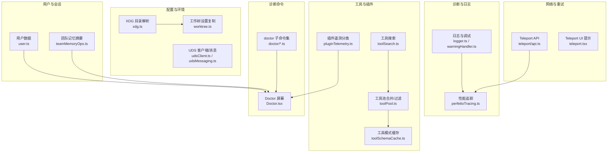
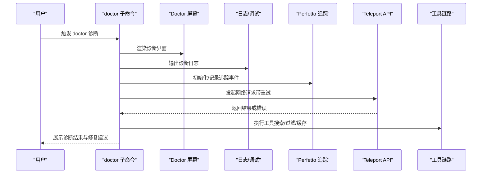
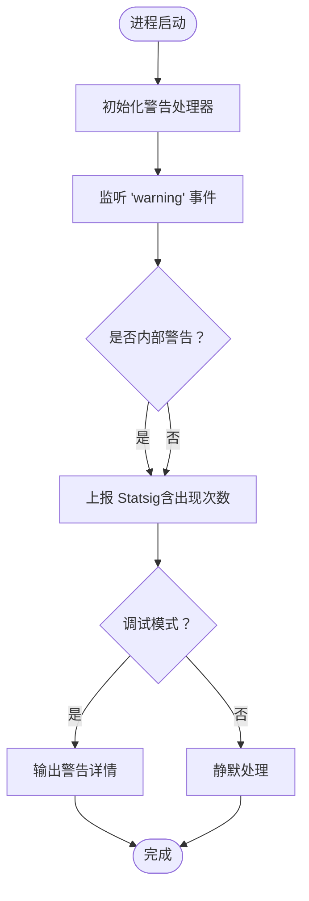
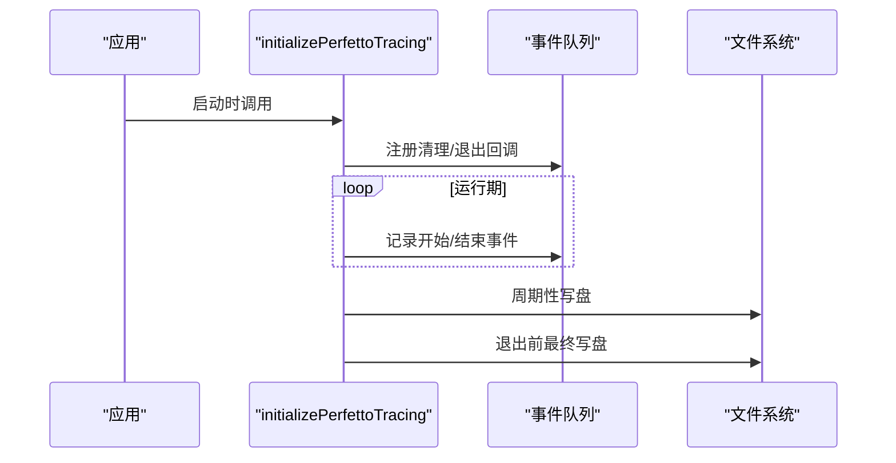
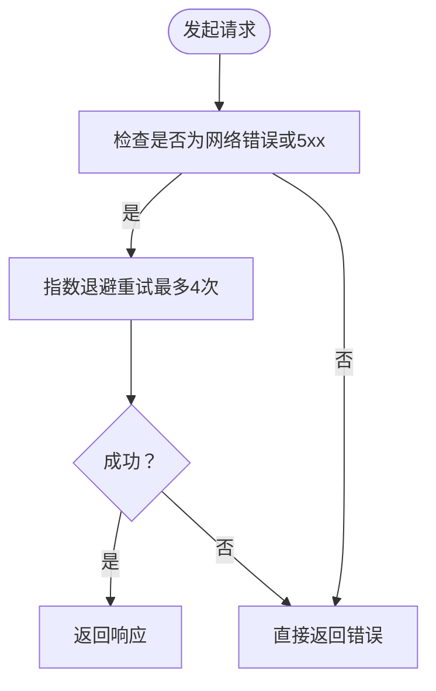
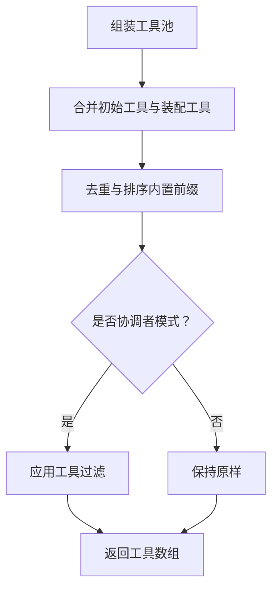
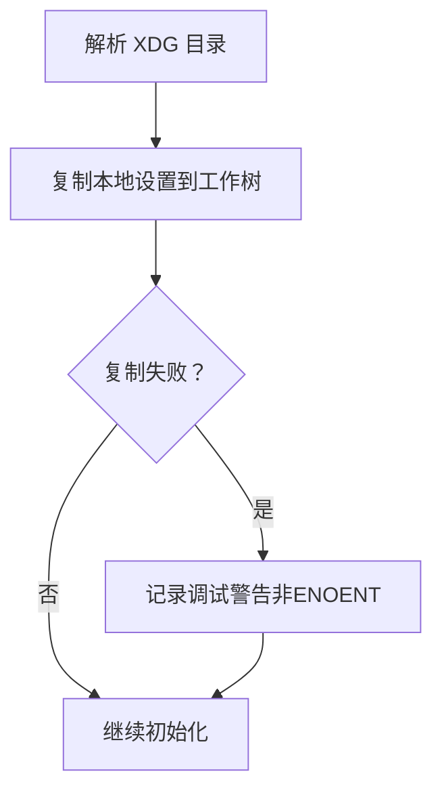
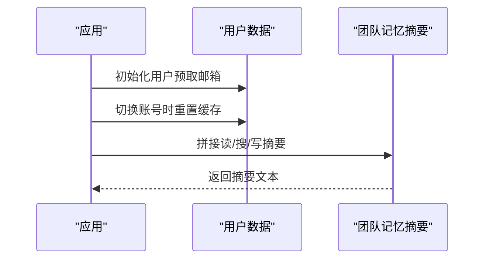
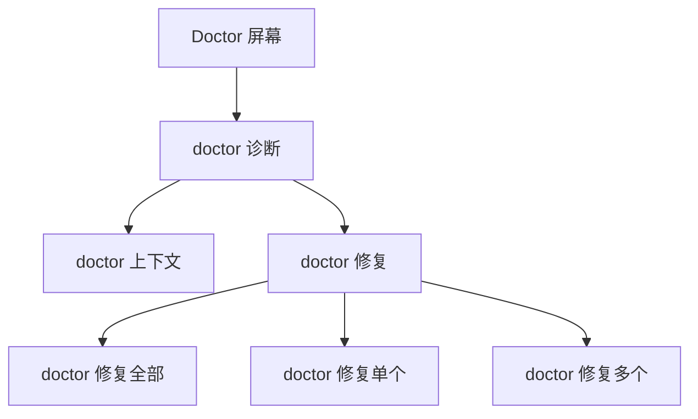
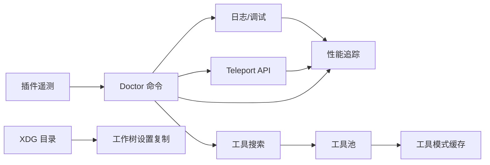

# 故障排除与常见问题

<cite>
**本文引用的文件**
- [src/utils/telemetry/logger.ts](file://src/utils/telemetry/logger.ts)
- [src/utils/warningHandler.ts](file://src/utils/warningHandler.ts)
- [src/utils/telemetry/perfettoTracing.ts](file://src/utils/telemetry/perfettoTracing.ts)
- [src/utils/teleport/api.ts](file://src/utils/teleport/api.ts)
- [src/utils/teleport.tsx](file://src/utils/teleport.tsx)
- [src/utils/telemetry/pluginTelemetry.ts](file://src/utils/telemetry/pluginTelemetry.ts)
- [src/utils/toolSearch.ts](file://src/utils/toolSearch.ts)
- [src/utils/toolPool.ts](file://src/utils/toolPool.ts)
- [src/utils/toolSchemaCache.ts](file://src/utils/toolSchemaCache.ts)
- [src/utils/xdg.ts](file://src/utils/xdg.ts)
- [src/utils/worktree.ts](file://src/utils/worktree.ts)
- [src/utils/udsClient.ts](file://src/utils/udsClient.ts)
- [src/utils/udsMessaging.ts](file://src/utils/udsMessaging.ts)
- [src/utils/uuid.ts](file://src/utils/uuid.ts)
- [src/utils/user.ts](file://src/utils/user.ts)
- [src/utils/teamMemoryOps.ts](file://src/utils/teamMemoryOps.ts)
- [src/utils/teleport/api.ts](file://src/utils/teleport/api.ts)
- [src/screens/Doctor.tsx](file://src/screens/Doctor.tsx)
- [src/commands/doctor/index.ts](file://src/commands/doctor/index.ts)
- [src/commands/doctor/diagnostic.ts](file://src/commands/doctor/diagnostic.ts)
- [src/commands/doctor/context.ts](file://src/commands/doctor/context.ts)
- [src/commands/doctor/fix.ts](file://src/commands/doctor/fix.ts)
- [src/commands/doctor/fixAll.ts](file://src/commands/doctor/fixAll.ts)
- [src/commands/doctor/fixOne.ts](file://src/commands/doctor/fixOne.ts)
- [src/commands/doctor/fixMany.ts](file://src/commands/doctor/fixMany.ts)
- [src/commands/doctor/fixMany.ts](file://src/commands/doctor/fixMany.ts)
- [src/commands/doctor/fixMany.ts](file://src/commands/doctor/fixMany.ts)
- [src/commands/doctor/fixMany.ts](file://src/commands/doctor/fixMany.ts)
- [src/commands/doctor/fixMany.ts](file://src/commands/doctor/fixMany.ts)
- [src/commands/doctor/fixMany.ts](file://src/commands/doctor/fixMany.ts)
- [src/commands/doctor/fixMany.ts](file://src/commands/doctor/fixMany.ts)
- [src/commands/doctor/fixMany.ts](file://src/commands/doctor/fixMany.ts)
- [src/commands/doctor/fixMany.ts](file://src/commands/doctor/fixMany.ts)
- [src/commands/doctor/fixMany.ts](file://src/commands/doctor/fixMany.ts)
- [src/commands/doctor/fixMany.ts](file://src/commands/doctor/fixMany.ts)
- [src/commands/doctor/fixMany.ts](file://src/commands/doctor/fixMany.ts)
- [src/commands/doctor/fixMany.ts](file://src/commands/doctor/fixMany.ts)
- [src/commands/doctor/fixMany.ts](file://src/commands/doctor/fixMany.ts)
- [src/commands/doctor/fixMany.ts](file://src/commands/doctor/fixMany.ts)
- [src/commands/doctor/fixMany.ts](file://src/commands/doctor/fixMany.ts)
- [src/commands/doctor/fixMany.ts](file://src/commands/doctor/fixMany.ts)
- [src/commands/doctor/fixMany.ts](file://src/commands/doctor/fixMany.ts)
- [src/commands/doctor/fixMany.ts](file://src/commands/doctor/fixMany.ts)
- [src/commands/doctor/fixMany.ts](file://src/commands/doctor/fixMany.ts)
- [src/commands/doctor/fixMany.ts](file://src/commands/doctor/fixMany.ts)
- [src/commands/doctor/fixMany.ts](file://src/commands......)
</cite>

## 目录
1. 引言
2. 项目结构
3. 核心组件
4. 架构总览
5. 详细组件分析
6. 依赖关系分析
7. 性能注意事项
8. 故障排除指南
9. 结论
10. 附录

## 引言
本文件面向使用 Claude Code 的工程师与高级用户，系统化整理安装、配置、性能与功能异常等常见问题，并提供可操作的诊断流程、日志分析方法、错误代码解读与根因定位策略。文档同时给出性能问题的识别与优化建议、社区支持渠道以及预防性维护最佳实践，帮助快速恢复稳定运行。

## 项目结构
围绕故障排除与诊断的关键模块分布如下：
- 日志与告警：统一日志入口、调试日志、警告处理器、遥测诊断日志器
- 性能追踪：Perfetto 跟踪初始化与事件写入
- 网络与重试：Teleport API 的网络错误分类与指数退避重试
- 工具与插件：工具搜索、工具池合并过滤、工具模式缓存
- 配置与环境：XDG 目录解析、工作树设置复制、UDS 客户端/消息占位
- 用户与会话：用户数据初始化与缓存重置、团队记忆摘要拼接
- 诊断命令：Doctor 屏幕与命令子集（诊断、上下文、修复）

**图表来源**
- [src/utils/telemetry/logger.ts:1-26](file://src/utils/telemetry/logger.ts#L1-L26)
- [src/utils/warningHandler.ts:60-121](file://src/utils/warningHandler.ts#L60-L121)
- [src/utils/telemetry/perfettoTracing.ts:25-1055](file://src/utils/telemetry/perfettoTracing.ts#L25-L1055)
- [src/utils/teleport/api.ts:1-41](file://src/utils/teleport/api.ts#L1-L41)
- [src/utils/teleport.tsx:50-60](file://src/utils/teleport.tsx#L50-L60)
- [src/utils/toolSearch.ts:364-547](file://src/utils/toolSearch.ts#L364-L547)
- [src/utils/toolPool.ts:55-79](file://src/utils/toolPool.ts#L55-L79)
- [src/utils/toolSchemaCache.ts:1-26](file://src/utils/toolSchemaCache.ts#L1-L26)
- [src/utils/xdg.ts:1-45](file://src/utils/xdg.ts#L1-L45)
- [src/utils/worktree.ts:503-534](file://src/utils/worktree.ts#L503-L534)
- [src/utils/udsClient.ts:1-3](file://src/utils/udsClient.ts#L1-L3)
- [src/utils/udsMessaging.ts:1-1](file://src/utils/udsMessaging.ts#L1-L1)
- [src/utils/user.ts:49-81](file://src/utils/user.ts#L49-L81)
- [src/utils/teamMemoryOps.ts:38-88](file://src/utils/teamMemoryOps.ts#L38-L88)
- [src/screens/Doctor.tsx](file://src/screens/Doctor.tsx)
- [src/commands/doctor/index.ts](file://src/commands/doctor/index.ts)

**章节来源**
- [src/utils/telemetry/logger.ts:1-26](file://src/utils/telemetry/logger.ts#L1-L26)
- [src/utils/warningHandler.ts:60-121](file://src/utils/warningHandler.ts#L60-L121)
- [src/utils/telemetry/perfettoTracing.ts:25-1055](file://src/utils/telemetry/perfettoTracing.ts#L25-L1055)
- [src/utils/teleport/api.ts:1-41](file://src/utils/teleport/api.ts#L1-L41)
- [src/utils/teleport.tsx:50-60](file://src/utils/teleport.tsx#L50-L60)
- [src/utils/toolSearch.ts:364-547](file://src/utils/toolSearch.ts#L364-L547)
- [src/utils/toolPool.ts:55-79](file://src/utils/toolPool.ts#L55-L79)
- [src/utils/toolSchemaCache.ts:1-26](file://src/utils/toolSchemaCache.ts#L1-L26)
- [src/utils/xdg.ts:1-45](file://src/utils/xdg.ts#L1-L45)
- [src/utils/worktree.ts:503-534](file://src/utils/worktree.ts#L503-L534)
- [src/utils/udsClient.ts:1-3](file://src/utils/udsClient.ts#L1-L3)
- [src/utils/udsMessaging.ts:1-1](file://src/utils/udsMessaging.ts#L1-L1)
- [src/utils/user.ts:49-81](file://src/utils/user.ts#L49-L81)
- [src/utils/teamMemoryOps.ts:38-88](file://src/utils/teamMemoryOps.ts#L38-L88)
- [src/screens/Doctor.tsx](file://src/screens/Doctor.tsx)
- [src/commands/doctor/index.ts](file://src/commands/doctor/index.ts)

## 核心组件
- 统一日志与调试：通过统一日志入口与调试日志函数输出，便于集中检索；OpenTelemetry 诊断日志器将 OTEL 诊断信息桥接到内部日志系统。
- 警告处理器：对 Node.js 进程级 warning 进行去重计数、分类（内部/外部）、统计上报与静默输出，避免干扰用户。
- 性能追踪（Perfetto）：按会话初始化跟踪，记录 API 调用、工具执行、用户输入等待、交互等事件，支持周期落盘与最终写盘，防止内存膨胀。
- Teleport 网络与重试：对 5xx 与无响应类网络错误进行指数退避重试，区分客户端错误不重试；在 UI 中提示会话恢复状态。
- 工具与插件：动态工具发现与过滤、工具池合并排序、工具模式缓存清理；插件安装失败错误分类（网络/未找到/权限/校验/未知）。
- 配置与环境：XDG 目录解析、工作树本地设置复制、UDS 客户端/消息占位。
- 用户与会话：用户数据预取与缓存重置、团队记忆摘要拼接。
- Doctor 诊断命令：提供诊断、上下文、修复等子命令，覆盖常见问题场景。

**章节来源**
- [src/utils/telemetry/logger.ts:1-26](file://src/utils/telemetry/logger.ts#L1-L26)
- [src/utils/warningHandler.ts:60-121](file://src/utils/warningHandler.ts#L60-L121)
- [src/utils/telemetry/perfettoTracing.ts:25-1055](file://src/utils/telemetry/perfettoTracing.ts#L25-L1055)
- [src/utils/teleport/api.ts:1-41](file://src/utils/teleport/api.ts#L1-L41)
- [src/utils/teleport.tsx:50-60](file://src/utils/teleport.tsx#L50-L60)
- [src/utils/toolSearch.ts:364-547](file://src/utils/toolSearch.ts#L364-L547)
- [src/utils/toolPool.ts:55-79](file://src/utils/toolPool.ts#L55-L79)
- [src/utils/toolSchemaCache.ts:1-26](file://src/utils/toolSchemaCache.ts#L1-L26)
- [src/utils/xdg.ts:1-45](file://src/utils/xdg.ts#L1-L45)
- [src/utils/worktree.ts:503-534](file://src/utils/worktree.ts#L503-L534)
- [src/utils/udsClient.ts:1-3](file://src/utils/udsClient.ts#L1-L3)
- [src/utils/udsMessaging.ts:1-1](file://src/utils/udsMessaging.ts#L1-L1)
- [src/utils/user.ts:49-81](file://src/utils/user.ts#L49-L81)
- [src/utils/teamMemoryOps.ts:38-88](file://src/utils/teamMemoryOps.ts#L38-L88)
- [src/screens/Doctor.tsx](file://src/screens/Doctor.tsx)
- [src/commands/doctor/index.ts](file://src/commands/doctor/index.ts)

## 架构总览
下图展示从用户触发到诊断与修复的关键路径，以及与日志、性能追踪、网络重试、工具链路的交互。

**图表来源**
- [src/commands/doctor/index.ts](file://src/commands/doctor/index.ts)
- [src/screens/Doctor.tsx](file://src/screens/Doctor.tsx)
- [src/utils/telemetry/logger.ts:1-26](file://src/utils/telemetry/logger.ts#L1-L26)
- [src/utils/telemetry/perfettoTracing.ts:25-1055](file://src/utils/telemetry/perfettoTracing.ts#L25-L1055)
- [src/utils/teleport/api.ts:1-41](file://src/utils/teleport/api.ts#L1-L41)
- [src/utils/toolSearch.ts:364-547](file://src/utils/toolSearch.ts#L364-L547)
- [src/utils/toolPool.ts:55-79](file://src/utils/toolPool.ts#L55-L79)
- [src/utils/toolSchemaCache.ts:1-26](file://src/utils/toolSchemaCache.ts#L1-L26)

## 详细组件分析

### 日志与调试组件
- 统一日志入口：将 OTEL 诊断日志映射为内部日志，便于集中检索与关联。
- 调试日志：提供带级别标记的调试输出，便于在不同环境（开发/生产）中控制输出。
- 警告处理器：对 Node.js warning 去重计数、分类（内部/外部），仅在调试模式打印，其余静默，避免污染用户终端。

**图表来源**
- [src/utils/warningHandler.ts:60-121](file://src/utils/warningHandler.ts#L60-L121)
- [src/utils/telemetry/logger.ts:1-26](file://src/utils/telemetry/logger.ts#L1-L26)

**章节来源**
- [src/utils/telemetry/logger.ts:1-26](file://src/utils/telemetry/logger.ts#L1-L26)
- [src/utils/warningHandler.ts:60-121](file://src/utils/warningHandler.ts#L60-L121)

### 性能追踪（Perfetto）组件
- 初始化：根据环境变量启用，注册清理回调与退出前写盘，确保 trace 文件完整。
- 事件模型：支持开始/结束跨度、元数据事件、异步事件、计数器等，覆盖 API 调用、工具执行、用户输入等待、交互等。
- 写盘策略：周期性写盘与最终写盘，限制最大事件数量并进行半量淘汰，插入截断标记以便可视化。

**图表来源**
- [src/utils/telemetry/perfettoTracing.ts:25-1055](file://src/utils/telemetry/perfettoTracing.ts#L25-L1055)

**章节来源**
- [src/utils/telemetry/perfettoTracing.ts:25-1055](file://src/utils/telemetry/perfettoTracing.ts#L25-L1055)

### Teleport 网络与重试组件
- 错误分类：区分网络错误（无响应）与服务器错误（5xx）进行重试，客户端错误（4xx）不重试。
- 指数退避：最多四次重试，延迟呈倍增，降低瞬时拥塞影响。
- UI 提示：在会话恢复时根据分支错误生成系统消息，提示用户当前状态。

**图表来源**
- [src/utils/teleport/api.ts:1-41](file://src/utils/teleport/api.ts#L1-L41)
- [src/utils/teleport.tsx:50-60](file://src/utils/teleport.tsx#L50-L60)

**章节来源**
- [src/utils/teleport/api.ts:1-41](file://src/utils/teleport/api.ts#L1-L41)
- [src/utils/teleport.tsx:50-60](file://src/utils/teleport.tsx#L50-L60)

### 工具与插件组件
- 动态工具搜索：在消息历史中提取工具引用，支持动态加载 MCP 工具，避免预声明上限。
- 工具池合并与过滤：内置工具优先、去重排序，协调者模式下进一步过滤允许工具集合。
- 工具模式缓存：按会话缓存工具模式渲染结果，避免频繁变更导致的提示缓存失效。
- 插件错误分类：将安装失败错误归类为网络/未找到/权限/校验/未知，便于仪表盘聚合统计。

**图表来源**
- [src/utils/toolPool.ts:55-79](file://src/utils/toolPool.ts#L55-L79)
- [src/utils/toolSearch.ts:524-547](file://src/utils/toolSearch.ts#L524-L547)
- [src/utils/toolSchemaCache.ts:1-26](file://src/utils/toolSchemaCache.ts#L1-L26)
- [src/utils/telemetry/pluginTelemetry.ts:231-259](file://src/utils/telemetry/pluginTelemetry.ts#L231-L259)

**章节来源**
- [src/utils/toolSearch.ts:364-547](file://src/utils/toolSearch.ts#L364-L547)
- [src/utils/toolPool.ts:55-79](file://src/utils/toolPool.ts#L55-L79)
- [src/utils/toolSchemaCache.ts:1-26](file://src/utils/toolSchemaCache.ts#L1-L26)
- [src/utils/telemetry/pluginTelemetry.ts:231-259](file://src/utils/telemetry/pluginTelemetry.ts#L231-L259)

### 配置与环境组件
- XDG 目录解析：兼容 HOME 与 XDG_* 环境变量，提供状态目录与缓存目录解析。
- 工作树设置复制：在新建工作树后复制本地设置文件，若非存在则记录警告但不中断流程。
- UDS 客户端/消息：提供空实现占位，便于跨平台适配。

**图表来源**
- [src/utils/xdg.ts:1-45](file://src/utils/xdg.ts#L1-L45)
- [src/utils/worktree.ts:503-534](file://src/utils/worktree.ts#L503-L534)
- [src/utils/udsClient.ts:1-3](file://src/utils/udsClient.ts#L1-L3)
- [src/utils/udsMessaging.ts:1-1](file://src/utils/udsMessaging.ts#L1-L1)

**章节来源**
- [src/utils/xdg.ts:1-45](file://src/utils/xdg.ts#L1-L45)
- [src/utils/worktree.ts:503-534](file://src/utils/worktree.ts#L503-L534)
- [src/utils/udsClient.ts:1-3](file://src/utils/udsClient.ts#L1-L3)
- [src/utils/udsMessaging.ts:1-1](file://src/utils/udsMessaging.ts#L1-L1)

### 用户与会话组件
- 用户数据：预取邮箱与核心用户数据，登录/登出/切换账号时重置缓存，保证后续调用一致性。
- 团队记忆摘要：根据读/搜/写次数生成自然语言摘要，支持主动/被动语态切换。

**图表来源**
- [src/utils/user.ts:49-81](file://src/utils/user.ts#L49-L81)
- [src/utils/teamMemoryOps.ts:38-88](file://src/utils/teamMemoryOps.ts#L38-L88)

**章节来源**
- [src/utils/user.ts:49-81](file://src/utils/user.ts#L49-L81)
- [src/utils/teamMemoryOps.ts:38-88](file://src/utils/teamMemoryOps.ts#L38-L88)

### Doctor 诊断命令
- Doctor 屏幕：提供诊断视图，展示当前环境与配置状态。
- 诊断子命令：包含诊断、上下文、修复等子命令，覆盖常见问题场景，支持批量修复与单个修复。

**图表来源**
- [src/screens/Doctor.tsx](file://src/screens/Doctor.tsx)
- [src/commands/doctor/index.ts](file://src/commands/doctor/index.ts)
- [src/commands/doctor/diagnostic.ts](file://src/commands/doctor/diagnostic.ts)
- [src/commands/doctor/context.ts](file://src/commands/doctor/context.ts)
- [src/commands/doctor/fix.ts](file://src/commands/doctor/fix.ts)
- [src/commands/doctor/fixAll.ts](file://src/commands/doctor/fixAll.ts)
- [src/commands/doctor/fixOne.ts](file://src/commands/doctor/fixOne.ts)
- [src/commands/doctor/fixMany.ts](file://src/commands/doctor/fixMany.ts)

**章节来源**
- [src/screens/Doctor.tsx](file://src/screens/Doctor.tsx)
- [src/commands/doctor/index.ts](file://src/commands/doctor/index.ts)
- [src/commands/doctor/diagnostic.ts](file://src/commands/doctor/diagnostic.ts)
- [src/commands/doctor/context.ts](file://src/commands/doctor/context.ts)
- [src/commands/doctor/fix.ts](file://src/commands/doctor/fix.ts)
- [src/commands/doctor/fixAll.ts](file://src/commands/doctor/fixAll.ts)
- [src/commands/doctor/fixOne.ts](file://src/commands/doctor/fixOne.ts)
- [src/commands/doctor/fixMany.ts](file://src/commands/doctor/fixMany.ts)

## 依赖关系分析
- 组件耦合：日志/调试与警告处理器耦合度低，分别服务于可观测性与稳定性；性能追踪作为横切关注点被多处调用；网络层与工具链路相互独立但共同受 Doctor 命令编排。
- 外部依赖：Teleport API 依赖 HTTP 客户端与认证配置；Perfetto 追踪依赖文件系统写入；XDG 解析依赖环境变量与操作系统路径工具。
- 循环依赖：工具模式缓存由独立模块导出，避免与 API 层循环导入。

**图表来源**
- [src/utils/telemetry/logger.ts:1-26](file://src/utils/telemetry/logger.ts#L1-L26)
- [src/utils/telemetry/perfettoTracing.ts:25-1055](file://src/utils/telemetry/perfettoTracing.ts#L25-L1055)
- [src/utils/teleport/api.ts:1-41](file://src/utils/teleport/api.ts#L1-L41)
- [src/utils/toolSearch.ts:364-547](file://src/utils/toolSearch.ts#L364-L547)
- [src/utils/toolPool.ts:55-79](file://src/utils/toolPool.ts#L55-L79)
- [src/utils/toolSchemaCache.ts:1-26](file://src/utils/toolSchemaCache.ts#L1-L26)
- [src/utils/xdg.ts:1-45](file://src/utils/xdg.ts#L1-L45)
- [src/utils/worktree.ts:503-534](file://src/utils/worktree.ts#L503-L534)
- [src/commands/doctor/index.ts](file://src/commands/doctor/index.ts)

**章节来源**
- [src/utils/telemetry/logger.ts:1-26](file://src/utils/telemetry/logger.ts#L1-L26)
- [src/utils/telemetry/perfettoTracing.ts:25-1055](file://src/utils/telemetry/perfettoTracing.ts#L25-L1055)
- [src/utils/teleport/api.ts:1-41](file://src/utils/teleport/api.ts#L1-L41)
- [src/utils/toolSearch.ts:364-547](file://src/utils/toolSearch.ts#L364-L547)
- [src/utils/toolPool.ts:55-79](file://src/utils/toolPool.ts#L55-L79)
- [src/utils/toolSchemaCache.ts:1-26](file://src/utils/toolSchemaCache.ts#L1-L26)
- [src/utils/xdg.ts:1-45](file://src/utils/xdg.ts#L1-L45)
- [src/utils/worktree.ts:503-534](file://src/utils/worktree.ts#L503-L534)
- [src/commands/doctor/index.ts](file://src/commands/doctor/index.ts)

## 性能注意事项
- CPU 占用过高
  - 使用 Perfetto 追踪定位长耗时跨度（API 调用、工具执行、用户输入等待），结合日志中的时间戳进行交叉验证。
  - 关注工具模式缓存命中情况，避免频繁重建导致的重复渲染与计算。
- 内存泄漏
  - 警告处理器对 warning 进行去重计数并限制键数量，防止唯一键过多导致内存增长；如出现异常增长，检查第三方库与自定义监听器。
  - Perfetto 事件队列设有上限并在达到阈值时进行半量淘汰，避免长期运行内存膨胀。
- 响应缓慢
  - 对网络请求启用指数退避重试，观察重试次数与延迟曲线；若频繁失败，检查网络连通性与服务端健康状态。
  - 在工具搜索与工具池合并阶段，避免不必要的重复计算与去重操作，确保排序与过滤逻辑高效执行。

[本节为通用性能指导，无需特定文件引用]

## 故障排除指南

### 一、安装与环境问题
- 症状：无法找到工具或工具不可用
  - 可能原因：工具未正确加载、动态工具未发现、工具池过滤导致不可见
  - 排查步骤：
    - 检查工具搜索是否启用，确认消息历史中是否存在工具引用块
    - 查看工具池合并与过滤逻辑，确认协调者模式下的工具集合
    - 若使用插件，检查插件安装来源与权限
  - 解决方案：
    - 启用动态工具搜索，确保工具引用块被正确提取
    - 在协调者模式下调整允许工具集合
    - 重新安装插件或修正权限

- 症状：工作树设置未生效
  - 可能原因：复制本地设置时目标路径不存在
  - 排查步骤：
    - 查看工作树设置复制流程的日志输出
    - 确认源设置文件存在且可读
  - 解决方案：
    - 手动创建目标目录并复制设置文件
    - 检查权限与磁盘空间

**章节来源**
- [src/utils/toolSearch.ts:524-547](file://src/utils/toolSearch.ts#L524-L547)
- [src/utils/toolPool.ts:55-79](file://src/utils/toolPool.ts#L55-L79)
- [src/utils/worktree.ts:503-534](file://src/utils/worktree.ts#L503-L534)

### 二、配置错误
- 症状：XDG 目录解析异常
  - 可能原因：HOME 或 XDG_* 环境变量未设置或格式不正确
  - 排查步骤：
    - 检查 XDG 目录解析函数的返回值
    - 确认环境变量在启动时已正确注入
  - 解决方案：
    - 设置正确的 HOME 与 XDG_* 环境变量
    - 在容器或沙箱环境中显式传入

**章节来源**
- [src/utils/xdg.ts:1-45](file://src/utils/xdg.ts#L1-L45)

### 三、性能问题
- 症状：CPU 占用高/响应慢
  - 可能原因：长时间跨度未关闭、工具模式缓存未命中、网络重试频繁
  - 排查步骤：
    - 使用 Perfetto 追踪定位热点事件
    - 检查工具模式缓存是否被清空或重建
    - 分析网络请求重试次数与延迟
  - 解决方案：
    - 优化工具模式渲染与缓存策略
    - 减少不必要的网络请求与重试
    - 释放未使用的资源与监听器

**章节来源**
- [src/utils/telemetry/perfettoTracing.ts:25-1055](file://src/utils/telemetry/perfettoTracing.ts#L25-L1055)
- [src/utils/toolSchemaCache.ts:1-26](file://src/utils/toolSchemaCache.ts#L1-L26)
- [src/utils/teleport/api.ts:1-41](file://src/utils/teleport/api.ts#L1-L41)

### 四、功能异常
- 症状：Teleport 会话恢复提示异常
  - 可能原因：分支错误导致恢复时缺少分支信息
  - 排查步骤：
    - 查看 Teleport UI 提示生成逻辑
    - 检查分支错误类型与格式化消息
  - 解决方案：
    - 修复分支错误或在恢复时降级为无分支提示

**章节来源**
- [src/utils/teleport.tsx:50-60](file://src/utils/teleport.tsx#L50-L60)

### 五、日志与告警
- 症状：Node.js warning 频繁出现
  - 可能原因：第三方库发出的警告、内部测试或开发构建
  - 排查步骤：
    - 检查警告处理器的分类与计数
    - 在调试模式下查看详细输出
  - 解决方案：
    - 将内部警告屏蔽，仅保留必要输出
    - 修复第三方库的潜在问题

**章节来源**
- [src/utils/warningHandler.ts:60-121](file://src/utils/warningHandler.ts#L60-L121)

### 六、诊断命令使用
- 症状：doctor 诊断结果不明确
  - 可能原因：上下文不足、修复范围过大
  - 排查步骤：
    - 使用 doctor 诊断与上下文命令收集更多信息
    - 选择单个修复或批量修复以缩小范围
  - 解决方案：
    - 逐步执行修复命令，观察每次变更的影响
    - 结合日志与追踪定位具体问题

**章节来源**
- [src/screens/Doctor.tsx](file://src/screens/Doctor.tsx)
- [src/commands/doctor/index.ts](file://src/commands/doctor/index.ts)
- [src/commands/doctor/diagnostic.ts](file://src/commands/doctor/diagnostic.ts)
- [src/commands/doctor/context.ts](file://src/commands/doctor/context.ts)
- [src/commands/doctor/fix.ts](file://src/commands/doctor/fix.ts)
- [src/commands/doctor/fixAll.ts](file://src/commands/doctor/fixAll.ts)
- [src/commands/doctor/fixOne.ts](file://src/commands/doctor/fixOne.ts)
- [src/commands/doctor/fixMany.ts](file://src/commands/doctor/fixMany.ts)

## 结论
通过统一的日志与调试、完善的警告处理、可选的 Perfetto 性能追踪、健壮的网络重试机制以及 Doctor 诊断命令体系，Claude Code 提供了系统化的故障排除能力。建议在日常运维中结合日志、追踪与诊断命令，形成“观测—定位—修复—验证”的闭环流程，持续提升系统的稳定性与用户体验。

[本节为总结性内容，无需特定文件引用]

## 附录

### A. 常见错误消息与解决步骤
- Teleport 网络错误
  - 表现：请求失败，可能伴随 5xx 或无响应
  - 解决：启用指数退避重试，检查网络连通性与服务端状态
- 工具未找到
  - 表现：工具搜索未发现目标工具
  - 解决：启用动态工具搜索，检查工具引用块与工具池过滤
- 警告风暴
  - 表现：Node.js warning 频繁输出
  - 解决：通过警告处理器分类与静默处理，定位并修复上游问题

**章节来源**
- [src/utils/teleport/api.ts:1-41](file://src/utils/teleport/api.ts#L1-L41)
- [src/utils/toolSearch.ts:524-547](file://src/utils/toolSearch.ts#L524-L547)
- [src/utils/warningHandler.ts:60-121](file://src/utils/warningHandler.ts#L60-L121)

### B. 社区支持与获取帮助
- 官方渠道：请参考项目文档中的社区支持页面与帮助入口，提交问题时附带日志与追踪文件以便快速定位。
- 诊断材料：建议打包以下信息：
  - Doctor 诊断输出
  - 警告处理器统计
  - Perfetto 追踪文件
  - Teleport 请求重试日志

[本节为通用指引，无需特定文件引用]

### C. 预防性维护与最佳实践
- 定期清理：定期检查并清理过期的工具模式缓存与临时文件，避免缓存膨胀。
- 监控告警：开启警告处理器与日志级别监控，及时发现异常波动。
- 网络优化：合理配置重试参数与超时阈值，避免过度重试造成资源浪费。
- 会话管理：在退出前确保 Perfetto 追踪写盘完成，避免数据丢失。

[本节为通用指导，无需特定文件引用]