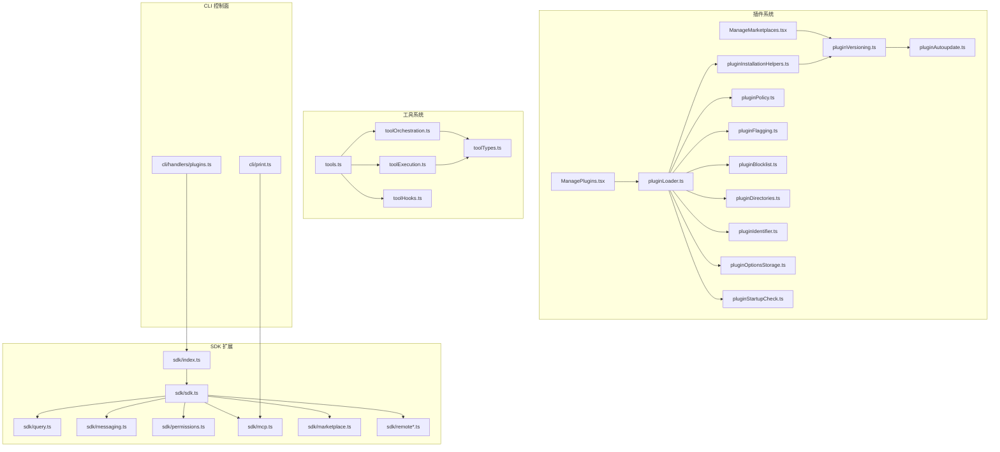
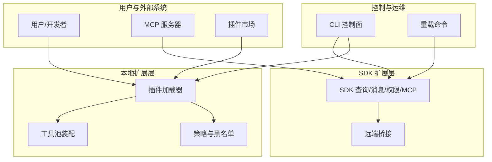
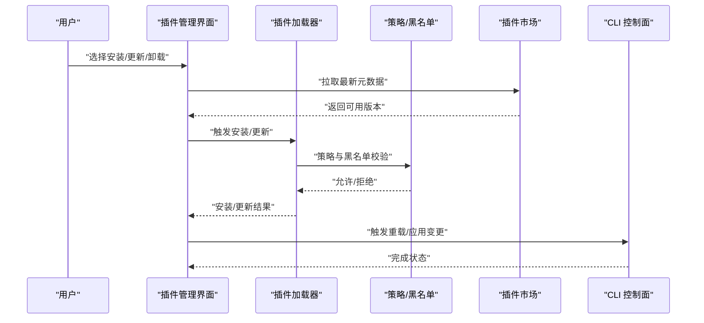
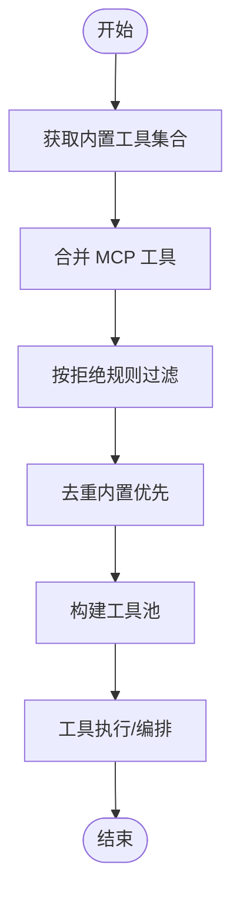
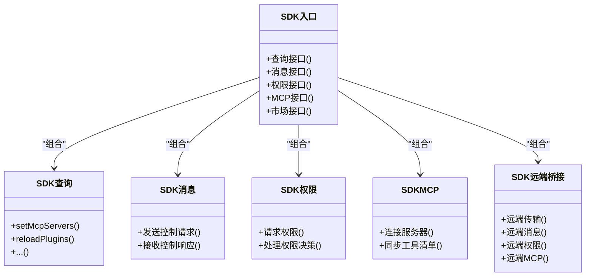
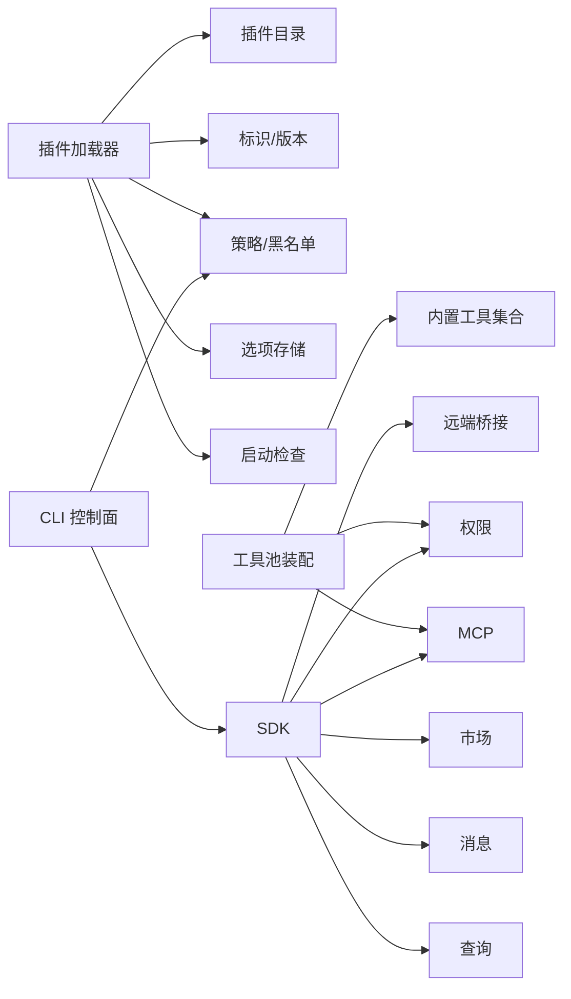

# 扩展点设计

<cite>
**本文引用的文件**
- [src/commands/plugin/ManagePlugins.tsx](file://src/commands/plugin/ManagePlugins.tsx)
- [src/commands/plugin/ManageMarketplaces.tsx](file://src/commands/plugin/ManageMarketplaces.tsx)
- [src/commands/reload-plugins/index.ts](file://src/commands/reload-plugins/index.ts)
- [src/commands/reload-plugins/reload-plugins.ts](file://src/commands/reload-plugins/reload-plugins.ts)
- [src/cli/print.ts](file://src/cli/print.ts)
- [src/cli/handlers/plugins.ts](file://src/cli/handlers/plugins.ts)
- [src/services/plugins/pluginOperations.ts](file://src/services/plugins/pluginOperations.ts)
- [src/services/plugins/pluginCliCommands.ts](file://src/services/plugins/pluginCliCommands.ts)
- [src/utils/plugins/pluginLoader.ts](file://src/utils/plugins/pluginLoader.ts)
- [src/utils/plugins/pluginInstallationHelpers.ts](file://src/utils/plugins/pluginInstallationHelpers.ts)
- [src/utils/plugins/pluginVersioning.ts](file://src/utils/plugins/pluginVersioning.ts)
- [src/utils/plugins/pluginAutoupdate.ts](file://src/utils/plugins/pluginAutoupdate.ts)
- [src/utils/plugins/pluginPolicy.ts](file://src/utils/plugins/pluginPolicy.ts)
- [src/utils/plugins/pluginFlagging.ts](file://src/utils/plugins/pluginFlagging.ts)
- [src/utils/plugins/pluginBlocklist.ts](file://src/utils/plugins/pluginBlocklist.ts)
- [src/utils/plugins/pluginDirectories.ts](file://src/utils/plugins/pluginDirectories.ts)
- [src/utils/plugins/pluginIdentifier.ts](file://src/utils/plugins/pluginIdentifier.ts)
- [src/utils/plugins/pluginOptionsStorage.ts](file://src/utils/plugins/pluginOptionsStorage.ts)
- [src/utils/plugins/pluginStartupCheck.ts](file://src/utils/plugins/pluginStartupCheck.ts)
- [src/utils/telemetry/pluginTelemetry.ts](file://src/utils/telemetry/pluginTelemetry.ts)
- [src/types/plugin.ts](file://src/types/plugin.ts)
- [src/tools.ts](file://src/tools.ts)
- [src/services/tools/toolOrchestration.ts](file://src/services/tools/toolOrchestration.ts)
- [src/services/tools/toolExecution.ts](file://src/services/tools/toolExecution.ts)
- [src/services/tools/toolHooks.ts](file://src/services/tools/toolHooks.ts)
- [src/entrypoints/sdk/toolTypes.ts](file://src/entrypoints/sdk/toolTypes.ts)
- [src/bridge/types.ts](file://src/bridge/types.ts)
- [src/entrypoints/sdk/index.ts](file://src/entrypoints/sdk/index.ts)
- [src/entrypoints/sdk/sdk.ts](file://src/entrypoints/sdk/sdk.ts)
- [src/entrypoints/sdk/query.ts](file://src/entrypoints/sdk/query.ts)
- [src/entrypoints/sdk/transport.ts](file://src/entrypoints/sdk/transport.ts)
- [src/entrypoints/sdk/messaging.ts](file://src/entrypoints/sdk/messaging.ts)
- [src/entrypoints/sdk/permissions.ts](file://src/entrypoints/sdk/permissions.ts)
- [src/entrypoints/sdk/mcp.ts](file://src/entrypoints/sdk/mcp.ts)
- [src/entrypoints/sdk/marketplace.ts](file://src/entrypoints/sdk/marketplace.ts)
- [src/entrypoints/sdk/agentSdkTypes.ts](file://src/entrypoints/sdk/agentSdkTypes.ts)
- [src/entrypoints/sdk/sandboxTypes.ts](file://src/entrypoints/sdk/sandboxTypes.ts)
- [src/entrypoints/sdk/remote.ts](file://src/entrypoints/sdk/remote.ts)
- [src/entrypoints/sdk/remoteBridge.ts](file://src/entrypoints/sdk/remoteBridge.ts)
- [src/entrypoints/sdk/remoteTransport.ts](file://src/entrypoints/sdk/remoteTransport.ts)
- [src/entrypoints/sdk/remoteMessaging.ts](file://src/entrypoints/sdk/remoteMessaging.ts)
- [src/entrypoints/sdk/remotePermissions.ts](file://src/entrypoints/sdk/remotePermissions.ts)
- [src/entrypoints/sdk/remoteMcp.ts](file://src/entrypoints/sdk/remoteMcp.ts)
- [src/entrypoints/sdk/remoteMarketplace.ts](file://src/entrypoints/sdk/remoteMarketplace.ts)
- [src/entrypoints/sdk/remoteAgentSdkTypes.ts](file://src/entrypoints/sdk/remoteAgentSdkTypes.ts)
- [src/entrypoints/sdk/remoteSandboxTypes.ts](file://src/entrypoints/sdk/remoteSandboxTypes.ts)
- [src/entrypoints/sdk/remoteRemote.ts](file://src/entrypoints/sdk/remoteRemote.ts)
</cite>

## 目录
1. [引言](#引言)
2. [项目结构](#项目结构)
3. [核心组件](#核心组件)
4. [架构总览](#架构总览)
5. [详细组件分析](#详细组件分析)
6. [依赖关系分析](#依赖关系分析)
7. [性能考量](#性能考量)
8. [故障排查指南](#故障排查指南)
9. [结论](#结论)
10. [附录](#附录)

## 引言
本设计文档聚焦于 Claude Code 的扩展点体系，涵盖插件系统、工具系统与 SDK 接口的扩展能力，以及第三方集成（如 MCP 服务器）支持。文档从架构、数据流、生命周期管理、版本兼容性、安全与性能等维度进行系统化阐述，并提供可操作的开发与集成指南。

## 项目结构
围绕扩展点的关键目录与模块如下：
- 插件管理与市场：命令行与 UI 管理插件安装、更新、卸载；市场刷新与版本对齐；策略与黑名单控制。
- 工具系统：内置工具聚合、MCP 工具合并、权限过滤与去重。
- SDK 扩展：统一的 SDK 入口、查询接口、消息传输、权限与 MCP 集成，以及远端桥接实现。
- CLI 控制面：处理 MCP 服务器配置变更、策略过滤与状态更新。
- 工具执行与编排：工具调用链路、钩子与执行器。

图表来源
- [src/commands/plugin/ManagePlugins.tsx](file://src/commands/plugin/ManagePlugins.tsx)
- [src/commands/plugin/ManageMarketplaces.tsx](file://src/commands/plugin/ManageMarketplaces.tsx)
- [src/utils/plugins/pluginLoader.ts](file://src/utils/plugins/pluginLoader.ts)
- [src/utils/plugins/pluginInstallationHelpers.ts](file://src/utils/plugins/pluginInstallationHelpers.ts)
- [src/utils/plugins/pluginVersioning.ts](file://src/utils/plugins/pluginVersioning.ts)
- [src/utils/plugins/pluginAutoupdate.ts](file://src/utils/plugins/pluginAutoupdate.ts)
- [src/utils/plugins/pluginPolicy.ts](file://src/utils/plugins/pluginPolicy.ts)
- [src/utils/plugins/pluginFlagging.ts](file://src/utils/plugins/pluginFlagging.ts)
- [src/utils/plugins/pluginBlocklist.ts](file://src/utils/plugins/pluginBlocklist.ts)
- [src/utils/plugins/pluginDirectories.ts](file://src/utils/plugins/pluginDirectories.ts)
- [src/utils/plugins/pluginIdentifier.ts](file://src/utils/plugins/pluginIdentifier.ts)
- [src/utils/plugins/pluginOptionsStorage.ts](file://src/utils/plugins/pluginOptionsStorage.ts)
- [src/utils/plugins/pluginStartupCheck.ts](file://src/utils/plugins/pluginStartupCheck.ts)
- [src/tools.ts](file://src/tools.ts)
- [src/services/tools/toolOrchestration.ts](file://src/services/tools/toolOrchestration.ts)
- [src/services/tools/toolExecution.ts](file://src/services/tools/toolExecution.ts)
- [src/services/tools/toolHooks.ts](file://src/services/tools/toolHooks.ts)
- [src/entrypoints/sdk/index.ts](file://src/entrypoints/sdk/index.ts)
- [src/entrypoints/sdk/sdk.ts](file://src/entrypoints/sdk/sdk.ts)
- [src/entrypoints/sdk/query.ts](file://src/entrypoints/sdk/query.ts)
- [src/entrypoints/sdk/messaging.ts](file://src/entrypoints/sdk/messaging.ts)
- [src/entrypoints/sdk/permissions.ts](file://src/entrypoints/sdk/permissions.ts)
- [src/entrypoints/sdk/mcp.ts](file://src/entrypoints/sdk/mcp.ts)
- [src/entrypoints/sdk/marketplace.ts](file://src/entrypoints/sdk/marketplace.ts)
- [src/entrypoints/sdk/remote*.ts](file://src/entrypoints/sdk/remote*.ts)
- [src/cli/print.ts](file://src/cli/print.ts)
- [src/cli/handlers/plugins.ts](file://src/cli/handlers/plugins.ts)

章节来源
- [src/commands/plugin/ManagePlugins.tsx](file://src/commands/plugin/ManagePlugins.tsx)
- [src/commands/plugin/ManageMarketplaces.tsx](file://src/commands/plugin/ManageMarketplaces.tsx)
- [src/utils/plugins/pluginLoader.ts](file://src/utils/plugins/pluginLoader.ts)
- [src/tools.ts](file://src/tools.ts)
- [src/entrypoints/sdk/index.ts](file://src/entrypoints/sdk/index.ts)
- [src/cli/print.ts](file://src/cli/print.ts)

## 核心组件
- 插件加载与装配：通过插件加载器扫描目录、解析元信息、构建版本缓存、执行启动检查与策略校验。
- 插件生命周期：安装、启用、禁用、更新、卸载、自动更新与版本对齐；支持市场刷新与依赖回溯。
- 工具池装配：内置工具与 MCP 工具合并，按权限上下文过滤与去重，保证一致性与优先级。
- SDK 扩展点：统一入口、查询接口、消息与权限协议、MCP 集成与远端桥接，支持第三方工具与服务器接入。
- CLI 控制面：处理 MCP 服务器配置变更、策略过滤与应用，确保企业策略一致生效。

章节来源
- [src/utils/plugins/pluginLoader.ts](file://src/utils/plugins/pluginLoader.ts)
- [src/utils/plugins/pluginInstallationHelpers.ts](file://src/utils/plugins/pluginInstallationHelpers.ts)
- [src/utils/plugins/pluginVersioning.ts](file://src/utils/plugins/pluginVersioning.ts)
- [src/utils/plugins/pluginAutoupdate.ts](file://src/utils/plugins/pluginAutoupdate.ts)
- [src/utils/plugins/pluginPolicy.ts](file://src/utils/plugins/pluginPolicy.ts)
- [src/utils/plugins/pluginFlagging.ts](file://src/utils/plugins/pluginFlagging.ts)
- [src/utils/plugins/pluginBlocklist.ts](file://src/utils/plugins/pluginBlocklist.ts)
- [src/utils/plugins/pluginDirectories.ts](file://src/utils/plugins/pluginDirectories.ts)
- [src/utils/plugins/pluginIdentifier.ts](file://src/utils/plugins/pluginIdentifier.ts)
- [src/utils/plugins/pluginOptionsStorage.ts](file://src/utils/plugins/pluginOptionsStorage.ts)
- [src/utils/plugins/pluginStartupCheck.ts](file://src/utils/plugins/pluginStartupCheck.ts)
- [src/tools.ts](file://src/tools.ts)
- [src/entrypoints/sdk/index.ts](file://src/entrypoints/sdk/index.ts)
- [src/cli/print.ts](file://src/cli/print.ts)

## 架构总览
扩展点架构由“插件层—工具层—SDK 层—CLI 控制层”构成，形成从本地插件到远程 MCP 服务器的统一扩展通道。

图表来源
- [src/utils/plugins/pluginLoader.ts](file://src/utils/plugins/pluginLoader.ts)
- [src/tools.ts](file://src/tools.ts)
- [src/utils/plugins/pluginPolicy.ts](file://src/utils/plugins/pluginPolicy.ts)
- [src/entrypoints/sdk/sdk.ts](file://src/entrypoints/sdk/sdk.ts)
- [src/entrypoints/sdk/messaging.ts](file://src/entrypoints/sdk/messaging.ts)
- [src/entrypoints/sdk/permissions.ts](file://src/entrypoints/sdk/permissions.ts)
- [src/entrypoints/sdk/mcp.ts](file://src/entrypoints/sdk/mcp.ts)
- [src/entrypoints/sdk/remote*.ts](file://src/entrypoints/sdk/remote*.ts)
- [src/cli/print.ts](file://src/cli/print.ts)
- [src/commands/reload-plugins/index.ts](file://src/commands/reload-plugins/index.ts)

## 详细组件分析

### 插件系统架构与生命周期
- 加载与发现：扫描插件目录，解析标识、版本、作用域与依赖，构建版本化缓存，执行启动检查。
- 安装与更新：支持从市场安装、批量更新、版本对齐与清理孤儿版本；提供自动更新策略。
- 策略与安全：基于策略白名单/黑名单过滤，支持企业策略与用户标记；支持黑名单与封禁。
- 市场与依赖：支持多市场刷新，自动提升已安装插件至新版本；提供反向依赖检测与提示。
- 运行时变更：通过重载命令与 SDK 控制消息应用变更，避免竞态并保持一致性。

图表来源
- [src/commands/plugin/ManagePlugins.tsx](file://src/commands/plugin/ManagePlugins.tsx)
- [src/commands/plugin/ManageMarketplaces.tsx](file://src/commands/plugin/ManageMarketplaces.tsx)
- [src/utils/plugins/pluginLoader.ts](file://src/utils/plugins/pluginLoader.ts)
- [src/utils/plugins/pluginPolicy.ts](file://src/utils/plugins/pluginPolicy.ts)
- [src/utils/plugins/pluginAutoupdate.ts](file://src/utils/plugins/pluginAutoupdate.ts)
- [src/utils/plugins/pluginVersioning.ts](file://src/utils/plugins/pluginVersioning.ts)
- [src/cli/print.ts](file://src/cli/print.ts)

章节来源
- [src/commands/plugin/ManagePlugins.tsx](file://src/commands/plugin/ManagePlugins.tsx)
- [src/commands/plugin/ManageMarketplaces.tsx](file://src/commands/plugin/ManageMarketplaces.tsx)
- [src/utils/plugins/pluginLoader.ts](file://src/utils/plugins/pluginLoader.ts)
- [src/utils/plugins/pluginAutoupdate.ts](file://src/utils/plugins/pluginAutoupdate.ts)
- [src/utils/plugins/pluginVersioning.ts](file://src/utils/plugins/pluginVersioning.ts)
- [src/utils/plugins/pluginPolicy.ts](file://src/utils/plugins/pluginPolicy.ts)
- [src/utils/plugins/pluginFlagging.ts](file://src/utils/plugins/pluginFlagging.ts)
- [src/utils/plugins/pluginBlocklist.ts](file://src/utils/plugins/pluginBlocklist.ts)
- [src/utils/plugins/pluginDirectories.ts](file://src/utils/plugins/pluginDirectories.ts)
- [src/utils/plugins/pluginIdentifier.ts](file://src/utils/plugins/pluginIdentifier.ts)
- [src/utils/plugins/pluginOptionsStorage.ts](file://src/utils/plugins/pluginOptionsStorage.ts)
- [src/utils/plugins/pluginStartupCheck.ts](file://src/utils/plugins/pluginStartupCheck.ts)

### 工具系统的扩展点
- 聚合与去重：内置工具与 MCP 工具合并，内置工具优先；按权限上下文过滤。
- 执行与编排：统一的工具执行器与钩子，支持工具调用链与错误处理。
- 类型与协议：SDK 工具类型定义，确保第三方工具遵循一致的接口规范。

图表来源
- [src/tools.ts](file://src/tools.ts)
- [src/services/tools/toolOrchestration.ts](file://src/services/tools/toolOrchestration.ts)
- [src/services/tools/toolExecution.ts](file://src/services/tools/toolExecution.ts)
- [src/services/tools/toolHooks.ts](file://src/services/tools/toolHooks.ts)
- [src/entrypoints/sdk/toolTypes.ts](file://src/entrypoints/sdk/toolTypes.ts)

章节来源
- [src/tools.ts](file://src/tools.ts)
- [src/services/tools/toolOrchestration.ts](file://src/services/tools/toolOrchestration.ts)
- [src/services/tools/toolExecution.ts](file://src/services/tools/toolExecution.ts)
- [src/services/tools/toolHooks.ts](file://src/services/tools/toolHooks.ts)
- [src/entrypoints/sdk/toolTypes.ts](file://src/entrypoints/sdk/toolTypes.ts)

### SDK 接口与第三方集成
- 统一入口：SDK 提供查询、消息、权限、MCP 与市场接口，支持本地与远端桥接。
- 消息与权限：定义控制响应事件与权限决策协议，确保跨进程/跨设备的一致行为。
- MCP 集成：支持 SDK 与进程式 MCP 服务器，统一策略过滤与状态更新。
- 远端桥接：提供远端 SDK 实现，适配不同运行环境与传输层。

图表来源
- [src/entrypoints/sdk/index.ts](file://src/entrypoints/sdk/index.ts)
- [src/entrypoints/sdk/sdk.ts](file://src/entrypoints/sdk/sdk.ts)
- [src/entrypoints/sdk/query.ts](file://src/entrypoints/sdk/query.ts)
- [src/entrypoints/sdk/messaging.ts](file://src/entrypoints/sdk/messaging.ts)
- [src/entrypoints/sdk/permissions.ts](file://src/entrypoints/sdk/permissions.ts)
- [src/entrypoints/sdk/mcp.ts](file://src/entrypoints/sdk/mcp.ts)
- [src/entrypoints/sdk/marketplace.ts](file://src/entrypoints/sdk/marketplace.ts)
- [src/entrypoints/sdk/remote*.ts](file://src/entrypoints/sdk/remote*.ts)
- [src/bridge/types.ts](file://src/bridge/types.ts)

章节来源
- [src/entrypoints/sdk/index.ts](file://src/entrypoints/sdk/index.ts)
- [src/entrypoints/sdk/sdk.ts](file://src/entrypoints/sdk/sdk.ts)
- [src/entrypoints/sdk/query.ts](file://src/entrypoints/sdk/query.ts)
- [src/entrypoints/sdk/messaging.ts](file://src/entrypoints/sdk/messaging.ts)
- [src/entrypoints/sdk/permissions.ts](file://src/entrypoints/sdk/permissions.ts)
- [src/entrypoints/sdk/mcp.ts](file://src/entrypoints/sdk/mcp.ts)
- [src/entrypoints/sdk/marketplace.ts](file://src/entrypoints/sdk/marketplace.ts)
- [src/entrypoints/sdk/remote*.ts](file://src/entrypoints/sdk/remote*.ts)
- [src/bridge/types.ts](file://src/bridge/types.ts)

### 版本兼容性与策略控制
- 版本化缓存：插件版本目录隔离，支持多版本共存与切换。
- 自动更新：基于策略与用户设置的自动更新流程，避免破坏性升级。
- 企业策略：统一的策略过滤与错误反馈，确保 MCP 服务器添加失败原因可追溯。
- 启动检查：在加载前执行健康检查与依赖验证，降低运行时风险。

章节来源
- [src/utils/plugins/pluginVersioning.ts](file://src/utils/plugins/pluginVersioning.ts)
- [src/utils/plugins/pluginAutoupdate.ts](file://src/utils/plugins/pluginAutoupdate.ts)
- [src/utils/plugins/pluginPolicy.ts](file://src/utils/plugins/pluginPolicy.ts)
- [src/utils/plugins/pluginStartupCheck.ts](file://src/utils/plugins/pluginStartupCheck.ts)
- [src/cli/print.ts](file://src/cli/print.ts)

## 依赖关系分析
- 插件层内部依赖：加载器依赖目录、标识、版本、策略、黑名单、选项存储与启动检查；安装辅助负责路径与缓存管理；自动更新与版本对齐贯穿全生命周期。
- 工具层依赖：工具池装配依赖内置工具集合、MCP 工具与权限上下文；执行与编排依赖钩子与类型定义。
- SDK 层依赖：SDK 组合查询、消息、权限、MCP 与市场模块；远端桥接复用相同协议与类型。
- CLI 控制面：处理 MCP 服务器配置变更，串接策略过滤与状态更新。

图表来源
- [src/utils/plugins/pluginLoader.ts](file://src/utils/plugins/pluginLoader.ts)
- [src/utils/plugins/pluginDirectories.ts](file://src/utils/plugins/pluginDirectories.ts)
- [src/utils/plugins/pluginIdentifier.ts](file://src/utils/plugins/pluginIdentifier.ts)
- [src/utils/plugins/pluginVersioning.ts](file://src/utils/plugins/pluginVersioning.ts)
- [src/utils/plugins/pluginPolicy.ts](file://src/utils/plugins/pluginPolicy.ts)
- [src/utils/plugins/pluginBlocklist.ts](file://src/utils/plugins/pluginBlocklist.ts)
- [src/utils/plugins/pluginOptionsStorage.ts](file://src/utils/plugins/pluginOptionsStorage.ts)
- [src/utils/plugins/pluginStartupCheck.ts](file://src/utils/plugins/pluginStartupCheck.ts)
- [src/tools.ts](file://src/tools.ts)
- [src/entrypoints/sdk/sdk.ts](file://src/entrypoints/sdk/sdk.ts)
- [src/cli/print.ts](file://src/cli/print.ts)

章节来源
- [src/utils/plugins/pluginLoader.ts](file://src/utils/plugins/pluginLoader.ts)
- [src/tools.ts](file://src/tools.ts)
- [src/entrypoints/sdk/sdk.ts](file://src/entrypoints/sdk/sdk.ts)
- [src/cli/print.ts](file://src/cli/print.ts)

## 性能考量
- 插件加载：采用版本化缓存与懒加载策略，减少重复解析与 IO 开销；批量安装/更新时串行化以避免资源竞争。
- 工具池装配：内置工具与 MCP 工具合并时进行去重与优先级判定，避免重复初始化；权限过滤在装配阶段一次性完成。
- SDK 通信：消息与权限协议采用异步处理与批量化，降低主线程阻塞；远端桥接通过传输层优化数据传输。
- CLI 控制面：序列化并发调用，防止 MCP 服务器配置变更导致的状态不一致。

## 故障排查指南
- 插件安装失败：检查策略/黑名单与目录权限；查看启动检查日志；确认版本缓存是否被正确写入。
- 工具不可用：确认工具池装配是否包含目标工具；检查权限上下文与拒绝规则；核对内置工具优先级。
- MCP 服务器不可用：通过 CLI 控制面查看策略过滤错误；确认企业策略配置；检查远端桥接连通性。
- 权限决策异常：核对权限请求与响应事件格式；确认 SDK 消息通道是否正常；检查远端权限回调。

章节来源
- [src/utils/plugins/pluginPolicy.ts](file://src/utils/plugins/pluginPolicy.ts)
- [src/utils/plugins/pluginStartupCheck.ts](file://src/utils/plugins/pluginStartupCheck.ts)
- [src/bridge/types.ts](file://src/bridge/types.ts)
- [src/cli/print.ts](file://src/cli/print.ts)

## 结论
Claude Code 的扩展点设计以“插件—工具—SDK—CLI”四层协同为核心，结合策略与安全控制、版本化与自动更新机制，提供了稳定、可扩展且可控的第三方集成能力。通过统一的 SDK 协议与远端桥接，系统既能满足本地插件生态，也能无缝对接 MCP 服务器与外部工具，为开发者与用户提供灵活的扩展体验。

## 附录
- 使用示例与最佳实践
  - 插件开发：遵循插件标识与版本规范；在启动检查中暴露必要能力；利用策略与黑名单保障安全。
  - 工具扩展：实现 SDK 工具类型定义；在工具池装配中确保去重与优先级；通过权限上下文控制访问范围。
  - 第三方集成：通过 SDK 的 MCP 接口注册服务器；在 CLI 控制面应用策略过滤；使用重载命令即时生效。
- 安全与合规
  - 严格的企业策略过滤与错误反馈；
  - 黑名单与封禁机制；
  - 权限请求与决策的标准化协议；
  - 远端桥接的认证与传输安全。