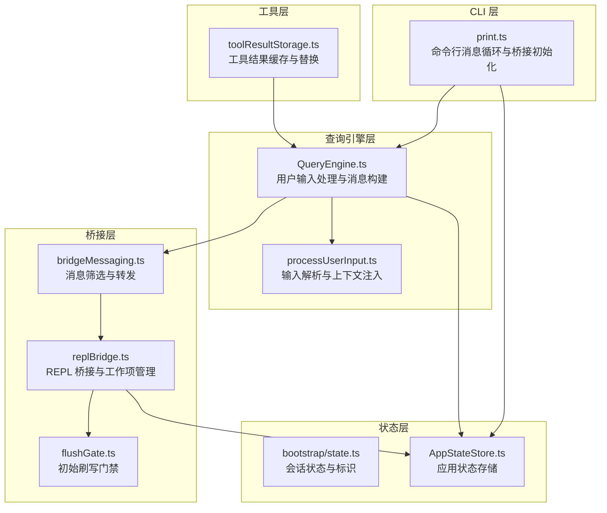
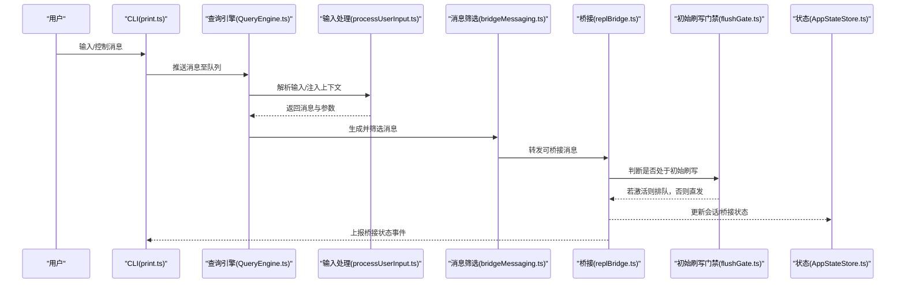
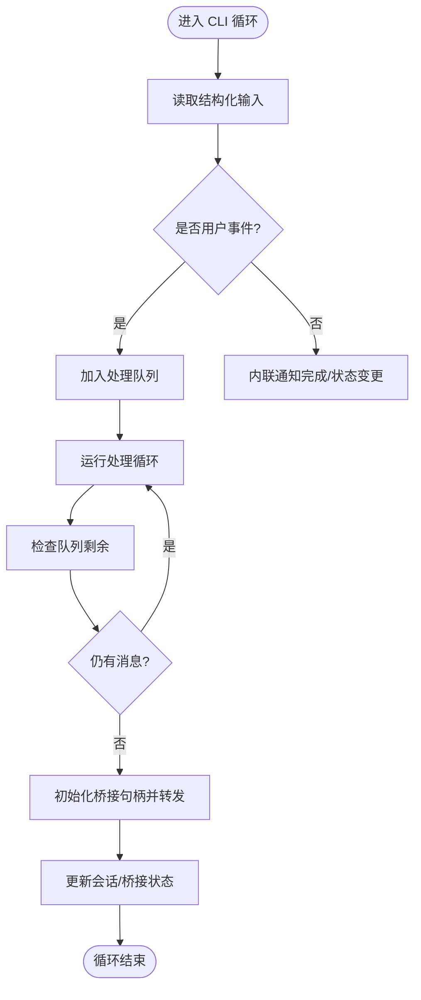
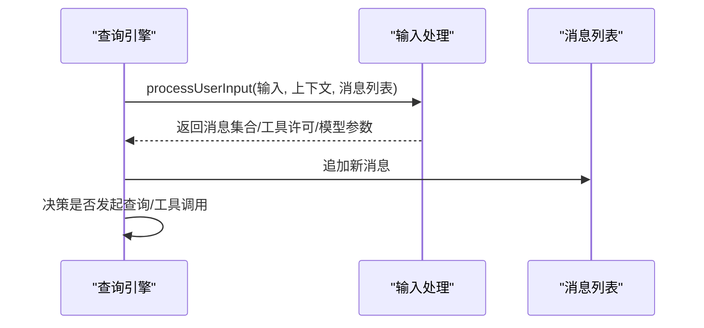
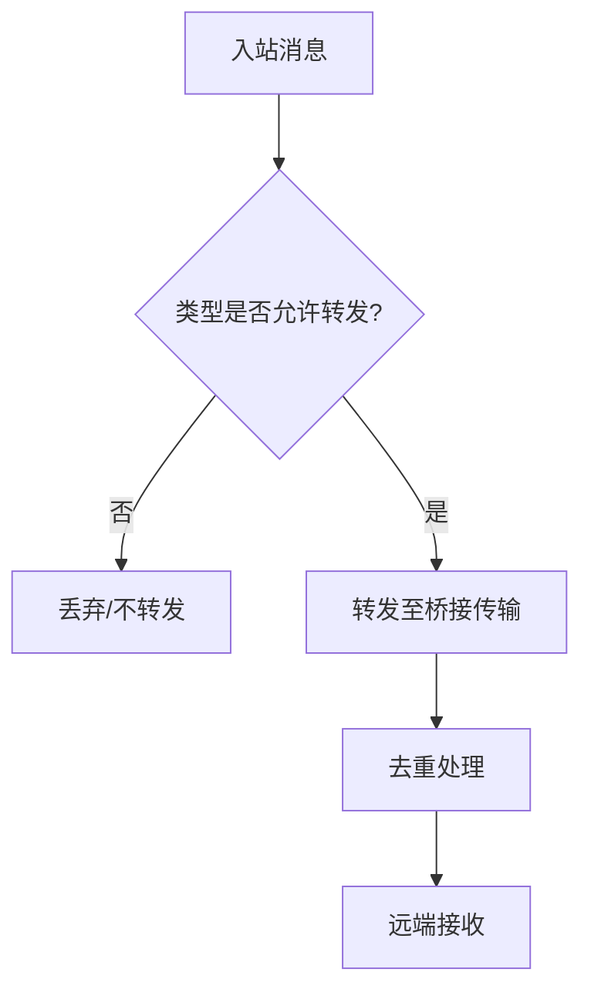
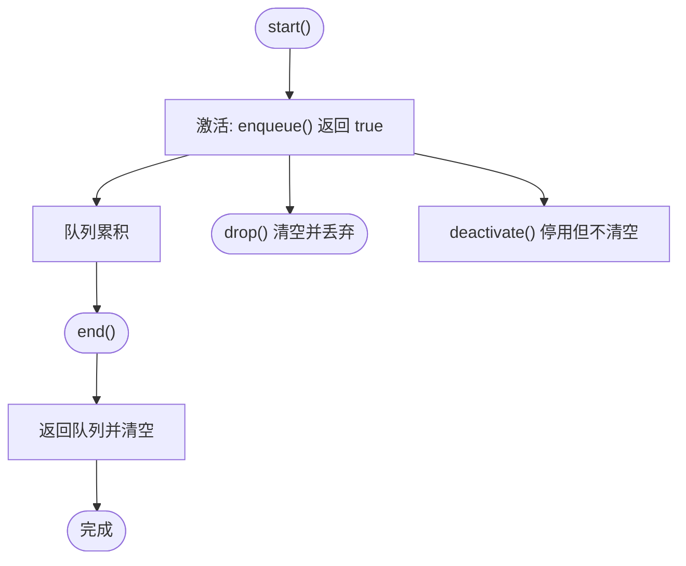
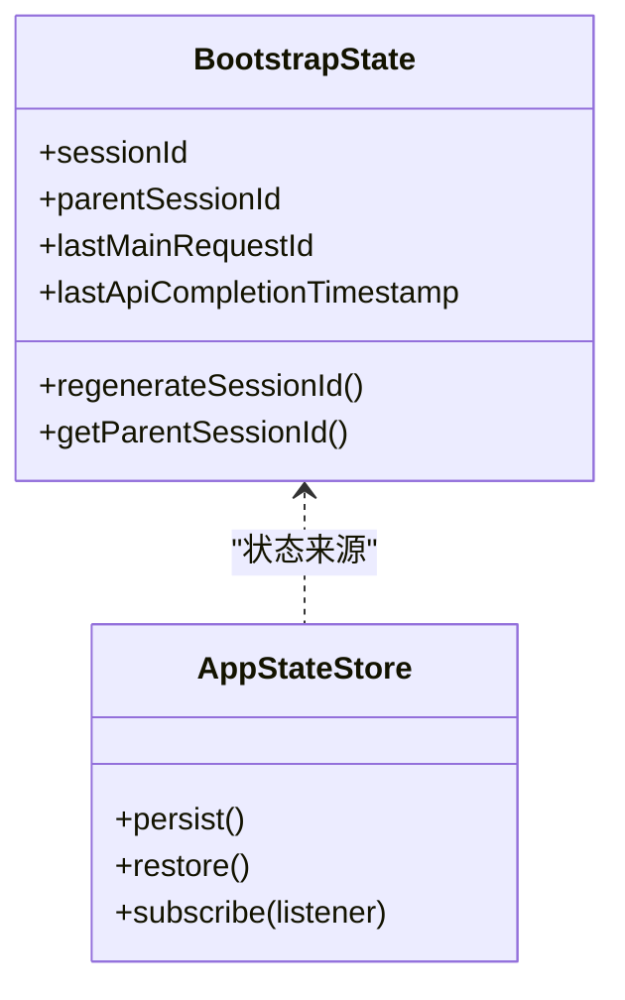
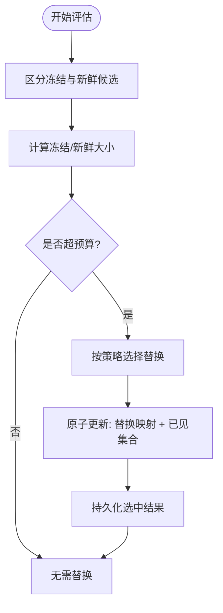
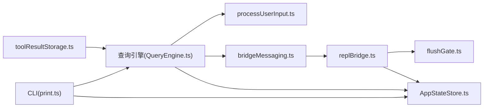

# 数据流设计

<cite>
**本文引用的文件**
- [src/cli/print.ts](file://src/cli/print.ts)
- [src/QueryEngine.ts](file://src/QueryEngine.ts)
- [src/utils/toolResultStorage.ts](file://src/utils/toolResultStorage.ts)
- [src/commands/clear/conversation.ts](file://src/commands/clear/conversation.ts)
- [src/bridge/replBridge.ts](file://src/bridge/replBridge.ts)
- [src/bridge/flushGate.ts](file://src/bridge/flushGate.ts)
- [src/bridge/bridgeMessaging.ts](file://src/bridge/bridgeMessaging.ts)
- [src/bootstrap/state.ts](file://src/bootstrap/state.ts)
- [src/state/AppStateStore.ts](file://src/state/AppStateStore.ts)
- [src/types/message.ts](file://src/types/message.ts)
- [src/utils/processUserInput/processUserInput.ts](file://src/utils/processUserInput/processUserInput.ts)
- [docs/06-bridge.md](file://docs/06-bridge.md)
</cite>

## 目录
1. [引言](#引言)
2. [项目结构](#项目结构)
3. [核心组件](#核心组件)
4. [架构总览](#架构总览)
5. [详细组件分析](#详细组件分析)
6. [依赖关系分析](#依赖关系分析)
7. [性能考量](#性能考量)
8. [故障排查指南](#故障排查指南)
9. [结论](#结论)
10. [附录](#附录)

## 引言
本设计文档聚焦 Claude Code 的数据流与处理机制，围绕“用户输入—消息创建—消息传播—状态更新与同步”展开，覆盖从 UI 层到服务层再到工具层的数据流转路径，并解释数据缓存策略、状态持久化与一致性保障。文档同时提供数据流图与处理流程图，帮助读者快速把握典型场景下的数据处理过程。

## 项目结构
本项目采用多模块分层组织，关键层次如下：
- CLI 层：负责命令行交互、消息循环与桥接初始化
- 查询引擎层：封装用户输入处理、消息构建与查询决策
- 桥接层：负责与远端服务的通信、消息去重与初始历史刷写控制
- 状态层：维护会话状态、应用状态与持久化存储
- 工具层：执行具体工具调用，支持结果缓存与替换策略

图表来源
- [src/cli/print.ts:2475-2828](file://src/cli/print.ts#L2475-L2828)
- [src/QueryEngine.ts:397-434](file://src/QueryEngine.ts#L397-L434)
- [src/utils/processUserInput/processUserInput.ts](file://src/utils/processUserInput/processUserInput.ts)
- [src/bridge/bridgeMessaging.ts:72-88](file://src/bridge/bridgeMessaging.ts#L72-L88)
- [src/bridge/replBridge.ts:576-615](file://src/bridge/replBridge.ts#L576-L615)
- [src/bridge/flushGate.ts:1-50](file://src/bridge/flushGate.ts#L1-L50)
- [src/bootstrap/state.ts:410-454](file://src/bootstrap/state.ts#L410-L454)
- [src/state/AppStateStore.ts](file://src/state/AppStateStore.ts)
- [src/utils/toolResultStorage.ts:816-851](file://src/utils/toolResultStorage.ts#L816-L851)

章节来源
- [src/cli/print.ts:2475-2828](file://src/cli/print.ts#L2475-L2828)
- [src/QueryEngine.ts:397-434](file://src/QueryEngine.ts#L397-L434)
- [src/bridge/bridgeMessaging.ts:72-88](file://src/bridge/bridgeMessaging.ts#L72-L88)
- [src/bridge/replBridge.ts:576-615](file://src/bridge/replBridge.ts#L576-L615)
- [src/bridge/flushGate.ts:1-50](file://src/bridge/flushGate.ts#L1-L50)
- [src/bootstrap/state.ts:410-454](file://src/bootstrap/state.ts#L410-L454)
- [src/state/AppStateStore.ts](file://src/state/AppStateStore.ts)
- [src/utils/toolResultStorage.ts:816-851](file://src/utils/toolResultStorage.ts#L816-L851)

## 核心组件
- CLI 消息循环与桥接初始化：负责从标准输入读取结构化消息、驱动主循环、触发桥接状态事件与消息转发。
- 查询引擎与用户输入处理：对用户输入进行解析、注入上下文、生成消息并决定是否发起查询。
- 桥接消息筛选与转发：仅转发符合桥接协议的消息类型，屏蔽内部进度与工具结果等消息。
- 初始刷写门禁：在会话启动时对新消息进行排队，确保历史消息先于新消息到达远端。
- 状态管理：维护会话标识、父会话、模型切换痕迹与应用状态持久化。
- 工具结果缓存与替换：基于大小预算选择性持久化工具结果，避免超限并维持一致性。

章节来源
- [src/cli/print.ts:2475-2828](file://src/cli/print.ts#L2475-L2828)
- [src/QueryEngine.ts:397-434](file://src/QueryEngine.ts#L397-L434)
- [src/bridge/bridgeMessaging.ts:72-88](file://src/bridge/bridgeMessaging.ts#L72-L88)
- [src/bridge/flushGate.ts:1-50](file://src/bridge/flushGate.ts#L1-L50)
- [src/bootstrap/state.ts:410-454](file://src/bootstrap/state.ts#L410-L454)
- [src/utils/toolResultStorage.ts:816-851](file://src/utils/toolResultStorage.ts#L816-L851)

## 架构总览
下图展示了从 CLI 到桥接、再到远端服务的典型数据流，以及状态更新与一致性保障的关键节点。

图表来源
- [src/cli/print.ts:2475-2828](file://src/cli/print.ts#L2475-L2828)
- [src/QueryEngine.ts:397-434](file://src/QueryEngine.ts#L397-L434)
- [src/utils/processUserInput/processUserInput.ts](file://src/utils/processUserInput/processUserInput.ts)
- [src/bridge/bridgeMessaging.ts:72-88](file://src/bridge/bridgeMessaging.ts#L72-L88)
- [src/bridge/replBridge.ts:576-615](file://src/bridge/replBridge.ts#L576-L615)
- [src/bridge/flushGate.ts:1-50](file://src/bridge/flushGate.ts#L1-L50)
- [src/state/AppStateStore.ts](file://src/state/AppStateStore.ts)

## 详细组件分析

### 组件一：CLI 消息循环与桥接初始化
- 处理逻辑要点
  - 并行读取标准输入与处理队列，保证输入与生成并行推进。
  - 在特定特性开启时注入主动轮询，维持队列活力。
  - 对非用户事件进行生命周期通知，确保控制响应及时上报。
  - 初始化桥接句柄，转发初始消息并记录最后转发索引，避免重复。
- 关键状态
  - 会话标识与父会话标识用于会话树管理与转录路径推导。
  - 桥接状态事件通过输出通道广播，供上层监听。

图表来源
- [src/cli/print.ts:2475-2828](file://src/cli/print.ts#L2475-L2828)
- [src/cli/print.ts:3951-3985](file://src/cli/print.ts#L3951-L3985)
- [src/bootstrap/state.ts:410-454](file://src/bootstrap/state.ts#L410-L454)

章节来源
- [src/cli/print.ts:2475-2828](file://src/cli/print.ts#L2475-L2828)
- [src/cli/print.ts:3951-3985](file://src/cli/print.ts#L3951-L3985)
- [src/bootstrap/state.ts:410-454](file://src/bootstrap/state.ts#L410-L454)

### 组件二：查询引擎与用户输入处理
- 处理逻辑要点
  - 对用户输入进行解析，结合上下文生成消息集合。
  - 支持从 SDK 或 REPL 场景注入消息，动态更新模型与参数。
  - 将新消息追加到可变消息列表，随后进行查询决策与工具选择。
- 关键状态
  - 可变消息列表作为查询上下文，贯穿多次迭代。
  - 模型切换痕迹通过面包屑注入，确保模型变更可见。

图表来源
- [src/QueryEngine.ts:397-434](file://src/QueryEngine.ts#L397-L434)
- [src/utils/processUserInput/processUserInput.ts](file://src/utils/processUserInput/processUserInput.ts)
- [src/types/message.ts](file://src/types/message.ts)

章节来源
- [src/QueryEngine.ts:397-434](file://src/QueryEngine.ts#L397-L434)
- [src/utils/processUserInput/processUserInput.ts](file://src/utils/processUserInput/processUserInput.ts)
- [src/types/message.ts](file://src/types/message.ts)

### 组件三：桥接消息筛选与转发
- 处理逻辑要点
  - 仅转发用户/助手对话与本地命令类型的系统消息；虚拟消息不转发。
  - 通过桥接消息类型映射，确保远端仅接收有效负载。
- 一致性保障
  - 回声去重与最近入站 UUID 过滤，避免重复或回环消息影响。

图表来源
- [src/bridge/bridgeMessaging.ts:72-88](file://src/bridge/bridgeMessaging.ts#L72-L88)
- [docs/06-bridge.md:61-113](file://docs/06-bridge.md#L61-L113)

章节来源
- [src/bridge/bridgeMessaging.ts:72-88](file://src/bridge/bridgeMessaging.ts#L72-L88)
- [docs/06-bridge.md:61-113](file://docs/06-bridge.md#L61-L113)

### 组件四：初始刷写门禁
- 处理逻辑要点
  - 会话启动时标记“初始刷写中”，所有新消息进入待发队列。
  - 刷写结束后一次性释放队列，保证历史消息优先到达。
  - 提供激活/结束/丢弃/停用四种状态转换，支持传输替换与异常恢复。
- 一致性保障
  - 通过门禁状态与计数器，避免新旧消息交错导致的时序问题。

图表来源
- [src/bridge/flushGate.ts:1-50](file://src/bridge/flushGate.ts#L1-L50)
- [src/bridge/replBridge.ts:576-615](file://src/bridge/replBridge.ts#L576-L615)

章节来源
- [src/bridge/flushGate.ts:1-50](file://src/bridge/flushGate.ts#L1-L50)
- [src/bridge/replBridge.ts:576-615](file://src/bridge/replBridge.ts#L576-L615)

### 组件五：状态管理与持久化
- 处理逻辑要点
  - 会话状态包含会话标识、父会话标识、模型切换痕迹与时间戳等。
  - 应用状态存储负责跨进程/重启后的状态恢复与持久化。
  - 清理会话时保留后台任务状态，避免中断正在执行的任务。
- 一致性保障
  - 会话标识再生与计划片段缓存清理，防止陈旧键值污染后续会话。

图表来源
- [src/bootstrap/state.ts:410-454](file://src/bootstrap/state.ts#L410-L454)
- [src/state/AppStateStore.ts](file://src/state/AppStateStore.ts)
- [src/commands/clear/conversation.ts:119-166](file://src/commands/clear/conversation.ts#L119-L166)

章节来源
- [src/bootstrap/state.ts:410-454](file://src/bootstrap/state.ts#L410-L454)
- [src/state/AppStateStore.ts](file://src/state/AppStateStore.ts)
- [src/commands/clear/conversation.ts:119-166](file://src/commands/clear/conversation.ts#L119-L166)

### 组件六：工具结果缓存与替换
- 处理逻辑要点
  - 基于预算限制选择性持久化工具结果，冻结态与新鲜态分别统计大小。
  - 对超出预算的候选进行替换选择，确保一致性与原子性。
  - 不满足持久化条件的结果标记为已见，避免并发观察到不一致视图。
- 性能与一致性
  - 通过“已见集合”与“替换映射”的原子更新，避免缓存命中不一致。

图表来源
- [src/utils/toolResultStorage.ts:816-851](file://src/utils/toolResultStorage.ts#L816-L851)

章节来源
- [src/utils/toolResultStorage.ts:816-851](file://src/utils/toolResultStorage.ts#L816-L851)

## 依赖关系分析
- 组件耦合
  - CLI 依赖查询引擎与桥接层；查询引擎依赖输入处理与消息类型定义。
  - 桥接层依赖消息筛选与门禁；状态层为多组件共享。
  - 工具层独立于桥接，但受查询引擎调度。
- 外部依赖
  - 文档明确桥接协议版本演进与消息类型规范，指导消息转发与去重策略。

图表来源
- [src/cli/print.ts:2475-2828](file://src/cli/print.ts#L2475-L2828)
- [src/QueryEngine.ts:397-434](file://src/QueryEngine.ts#L397-L434)
- [src/bridge/bridgeMessaging.ts:72-88](file://src/bridge/bridgeMessaging.ts#L72-L88)
- [src/bridge/replBridge.ts:576-615](file://src/bridge/replBridge.ts#L576-L615)
- [src/bridge/flushGate.ts:1-50](file://src/bridge/flushGate.ts#L1-L50)
- [src/state/AppStateStore.ts](file://src/state/AppStateStore.ts)
- [src/utils/toolResultStorage.ts:816-851](file://src/utils/toolResultStorage.ts#L816-L851)

章节来源
- [src/cli/print.ts:2475-2828](file://src/cli/print.ts#L2475-L2828)
- [src/QueryEngine.ts:397-434](file://src/QueryEngine.ts#L397-L434)
- [src/bridge/bridgeMessaging.ts:72-88](file://src/bridge/bridgeMessaging.ts#L72-L88)
- [src/bridge/replBridge.ts:576-615](file://src/bridge/replBridge.ts#L576-L615)
- [src/bridge/flushGate.ts:1-50](file://src/bridge/flushGate.ts#L1-L50)
- [src/state/AppStateStore.ts](file://src/state/AppStateStore.ts)
- [src/utils/toolResultStorage.ts:816-851](file://src/utils/toolResultStorage.ts#L816-L851)

## 性能考量
- 并行处理：CLI 层通过并行读取输入与处理队列提升吞吐。
- 预算驱动的工具结果缓存：通过大小预算与替换策略降低内存压力。
- 初始刷写门禁：避免历史与新消息交错带来的额外往返与重试成本。
- 去重与回环防护：减少无效重放与重复计算。

## 故障排查指南
- 桥接状态异常
  - 观察桥接状态事件输出，定位初始化失败或能力受限原因。
  - 检查会话令牌与心跳配置，确认工作项是否被服务器回收。
- 消息未达远端
  - 确认消息类型是否被桥接筛选器允许转发。
  - 检查初始刷写门禁是否仍处于激活状态。
- 会话状态不一致
  - 清理会话时保留后台任务，避免前台任务中断导致的状态漂移。
  - 校验会话标识再生与计划片段缓存清理逻辑。

章节来源
- [src/cli/print.ts:3951-3985](file://src/cli/print.ts#L3951-L3985)
- [src/bridge/replBridge.ts:1077-1911](file://src/bridge/replBridge.ts#L1077-L1911)
- [src/bridge/bridgeMessaging.ts:72-88](file://src/bridge/bridgeMessaging.ts#L72-L88)
- [src/bridge/flushGate.ts:1-50](file://src/bridge/flushGate.ts#L1-L50)
- [src/commands/clear/conversation.ts:119-166](file://src/commands/clear/conversation.ts#L119-L166)

## 结论
本设计文档梳理了 Claude Code 的数据流全链路：从 CLI 的消息循环与桥接初始化，到查询引擎的输入处理与消息构建，再到桥接层的消息筛选与初始刷写门禁，最终落到状态管理与工具结果缓存的协同。通过门禁、去重与预算策略，系统在复杂交互场景下实现了高吞吐与强一致性的平衡。

## 附录
- 桥接协议与消息类型参考：详见文档说明，涵盖 v1/v2 协议差异、消息去重与传输细节。

章节来源
- [docs/06-bridge.md:61-113](file://docs/06-bridge.md#L61-L113)