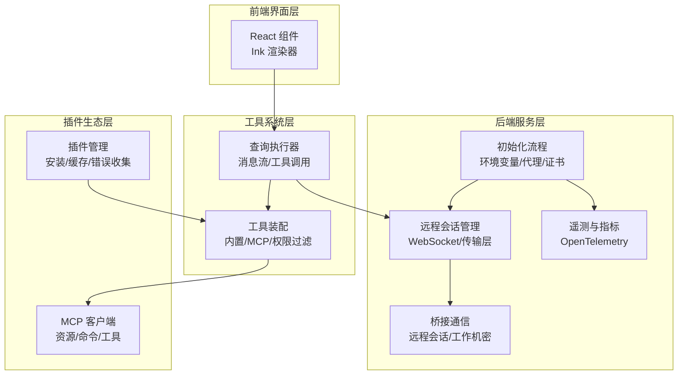
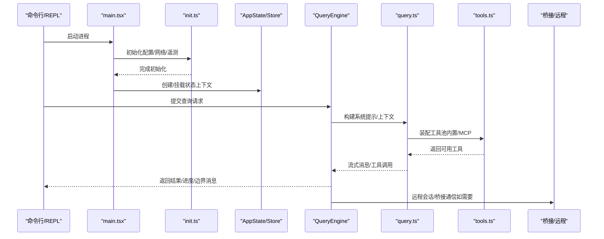
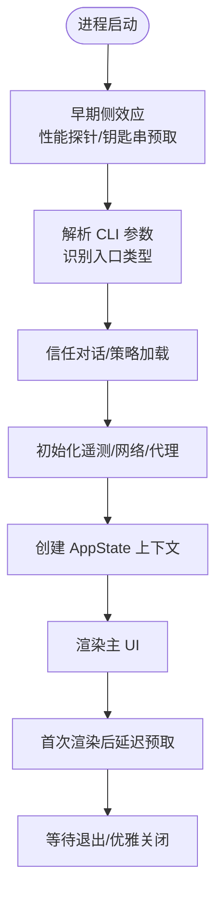
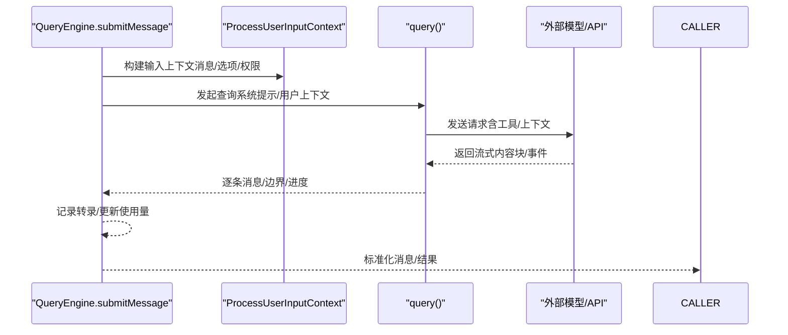
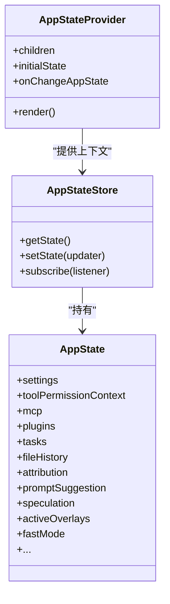
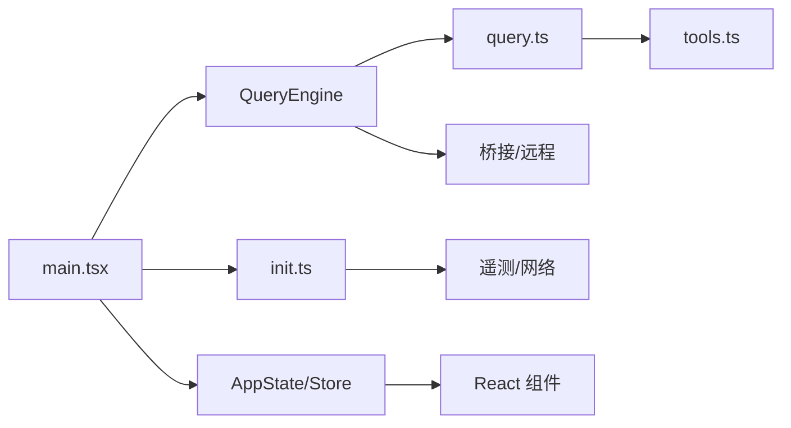

# 整体架构概览

<cite>
**本文档引用的文件**
- [main.tsx](file://src/main.tsx)
- [QueryEngine.ts](file://src/QueryEngine.ts)
- [AppState.tsx](file://src/state/AppState.tsx)
- [AppStateStore.ts](file://src/state/AppStateStore.ts)
- [query.ts](file://src/query.ts)
- [init.ts](file://src/entrypoints/init.ts)
- [tools.ts](file://src/tools.ts)
- [package.json](file://package.json)
</cite>

## 目录
1. [简介](#简介)
2. [项目结构](#项目结构)
3. [核心组件](#核心组件)
4. [架构总览](#架构总览)
5. [详细组件分析](#详细组件分析)
6. [依赖关系分析](#依赖关系分析)
7. [性能考量](#性能考量)
8. [故障排除指南](#故障排除指南)
9. [结论](#结论)

## 简介
本文件为 Claude Code 的整体架构概览文档，面向希望理解系统高层设计与运行机制的读者。文档从分层架构视角出发，系统阐述前端界面层、后端服务层、工具系统层与插件生态层的布局与交互关系；重点解析主入口点 main.tsx 的启动流程、QueryEngine 作为核心查询引擎的作用、AppState 如何管理全局状态，以及各模块间的依赖关系与扩展性设计。

## 项目结构
Claude Code 采用模块化、分层化的组织方式：
- 前端界面层：基于 React 和 Ink 的终端 UI，负责用户交互与状态渲染。
- 后端服务层：包含初始化流程、网络与遥测配置、桥接通信、远程会话管理等。
- 工具系统层：内置工具与 MCP 工具的统一装配与权限控制。
- 插件生态层：插件市场、安装与加载、动态组件发现与注册。

**图表来源**
- [main.tsx:585-800](file://src/main.tsx#L585-L800)
- [init.ts:57-238](file://src/entrypoints/init.ts#L57-L238)
- [tools.ts:345-352](file://src/tools.ts#L345-L352)
- [query.ts:181-200](file://src/query.ts#L181-L200)

**章节来源**
- [package.json:25-99](file://package.json#L25-L99)

## 核心组件
本节聚焦于系统的关键构件及其职责边界。

- 主入口与启动流程（main.tsx）
  - 负责早期侧效应（性能探针、钥匙串预取）、参数解析、信任对话与遥测初始化、设置与策略加载、提示词与上下文预取、延迟预取启动等。
  - 通过交互式渲染与优雅退出流程，支撑 REPL 与 CLI 场景。

- 查询引擎（QueryEngine）
  - 封装查询生命周期与会话状态，支持头尾模式与 REPL 模式复用。
  - 负责系统提示构建、权限包装、消息组装、工具调用编排、历史压缩与持久化、权限拒绝追踪、结构化输出约束等。

- 全局状态管理（AppState/Store）
  - 提供 React 上下文与订阅机制，封装深度不可变状态模型，暴露选择器与更新器，支持多场景（本地/远程）状态同步。

- 查询执行器（query.ts）
  - 实现消息规范化、令牌预算控制、工具执行编排、流事件处理、上下文折叠与紧凑化、停止钩子与恢复逻辑等。

- 初始化与服务（init.ts）
  - 配置安全环境变量、代理与 mTLS、预连接 API、上游代理、清理注册、遥测初始化等。

**章节来源**
- [main.tsx:585-800](file://src/main.tsx#L585-L800)
- [QueryEngine.ts:184-207](file://src/QueryEngine.ts#L184-L207)
- [AppState.tsx:37-110](file://src/state/AppState.tsx#L37-L110)
- [AppStateStore.ts:89-452](file://src/state/AppStateStore.ts#L89-L452)
- [query.ts:181-200](file://src/query.ts#L181-L200)
- [init.ts:57-238](file://src/entrypoints/init.ts#L57-L238)

## 架构总览
系统采用“入口引导 + 查询引擎 + 状态管理 + 工具装配 + 插件生态”的分层设计，强调模块解耦与可扩展性。

**图表来源**
- [main.tsx:585-800](file://src/main.tsx#L585-L800)
- [init.ts:57-238](file://src/entrypoints/init.ts#L57-L238)
- [AppState.tsx:37-110](file://src/state/AppState.tsx#L37-L110)
- [QueryEngine.ts:209-236](file://src/QueryEngine.ts#L209-L236)
- [query.ts:181-200](file://src/query.ts#L181-L200)
- [tools.ts:345-352](file://src/tools.ts#L345-L352)

## 详细组件分析

### 主入口与启动流程（main.tsx）
- 早期侧效应与性能探针：在导入前执行性能标记与钥匙串预取，减少首屏阻塞。
- 参数与入口点识别：解析 CLI 参数，识别 mcp serve、GitHub Action、本地代理等入口类型。
- 信任与遥测：在信任建立后初始化遥测与增长实验门控。
- 设置与策略：应用安全配置环境变量、加载远程托管设置与策略限制、迁移与版本控制。
- 预取与延迟启动：在首次渲染后启动非关键预取（用户上下文、提示、模型能力、变更检测等），避免阻塞关键路径。
- 交互式渲染与优雅退出：通过 Ink 渲染主 UI，启动延迟预取，等待退出信号并进行资源回收。

**图表来源**
- [main.tsx:1-120](file://src/main.tsx#L1-L120)
- [main.tsx:388-431](file://src/main.tsx#L388-L431)
- [main.tsx:585-800](file://src/main.tsx#L585-L800)

**章节来源**
- [main.tsx:1-120](file://src/main.tsx#L1-L120)
- [main.tsx:388-431](file://src/main.tsx#L388-L431)
- [main.tsx:585-800](file://src/main.tsx#L585-L800)

### 查询引擎（QueryEngine）
- 角色定位：封装一次会话内的查询生命周期，聚合系统提示、权限包装、消息持久化、历史压缩与工具调用编排。
- 关键流程：
  - 权限包装：对 canUseTool 进行包装以追踪拒绝原因，用于 SDK 报告。
  - 系统提示构建：组合默认/自定义/内存机制提示，并注入协调者上下文与沙盒目录信息。
  - 工具装配：加载技能与插件缓存，构建系统初始化消息（工具/MCP/命令/代理/插件/快速模式）。
  - 查询循环：驱动 query() 生成器，记录转录、ACK 初始用户消息、处理流事件、维护使用量与预算。
  - 结果产出：标准化消息、生成结果摘要、返回权限拒绝列表、快照状态等。

**图表来源**
- [QueryEngine.ts:209-236](file://src/QueryEngine.ts#L209-L236)
- [QueryEngine.ts:675-686](file://src/QueryEngine.ts#L675-L686)
- [query.ts:181-200](file://src/query.ts#L181-L200)

**章节来源**
- [QueryEngine.ts:184-207](file://src/QueryEngine.ts#L184-L207)
- [QueryEngine.ts:209-236](file://src/QueryEngine.ts#L209-L236)
- [QueryEngine.ts:675-686](file://src/QueryEngine.ts#L675-L686)

### 全局状态管理（AppState/Store）
- 设计要点：
  - 深度不可变状态模型，通过选择器订阅局部状态变化，避免不必要的重渲染。
  - 提供稳定的 setState 引用，确保仅在状态变化时触发渲染。
  - 支持在非 Provider 环境下的安全访问（返回 undefined）。
  - 在挂载阶段根据远程设置禁用某些模式（如 bypass 权限模式）。
- 应用场景：跨组件共享设置、权限上下文、MCP/插件状态、任务与通知、文件历史与归属信息、思考模式与提示建议等。

**图表来源**
- [AppStateStore.ts:89-452](file://src/state/AppStateStore.ts#L89-L452)
- [AppState.tsx:37-110](file://src/state/AppState.tsx#L37-L110)

**章节来源**
- [AppState.tsx:37-110](file://src/state/AppState.tsx#L37-L110)
- [AppStateStore.ts:89-452](file://src/state/AppStateStore.ts#L89-L452)

### 查询执行器（query.ts）
- 功能范围：消息规范化、令牌预算与最大输出令牌处理、工具执行编排、上下文折叠与紧凑化、停止钩子与恢复逻辑、流事件处理与增量使用量统计。
- 关键特性：
  - 可选的历史紧凑化与反应式紧凑化，平衡内存占用与会话可恢复性。
  - 对“最大输出令牌”等特殊错误进行延迟抛出，避免提前中断 SDK 流水线。
  - 通过依赖注入与配置工厂，支持不同查询来源（SDK/REPL/远程）的一致行为。

**章节来源**
- [query.ts:1-200](file://src/query.ts#L1-L200)
- [query.ts:181-200](file://src/query.ts#L181-L200)

### 初始化与服务（init.ts）
- 职责边界：
  - 安全环境变量应用、代理与 mTLS 配置、预连接 API、上游代理初始化、清理注册、遥测初始化。
  - 在信任建立后重新应用完整环境变量，确保遥测与网络策略生效。
- 性能与可靠性：延迟加载遥测 SDK 与 gRPC 导出器，避免启动时的模块开销；对非配置类错误进行保护性处理。

**章节来源**
- [init.ts:57-238](file://src/entrypoints/init.ts#L57-L238)
- [init.ts:247-341](file://src/entrypoints/init.ts#L247-L341)

### 工具系统与插件生态
- 工具装配（tools.ts）
  - 统一装配内置工具与 MCP 工具，按权限规则过滤与去重，优先内置工具。
  - 支持动态合并与过滤，结合合成输出工具与 JSON Schema 约束。
- 插件生态（插件管理与 MCP）
  - 插件安装状态、错误收集、刷新需求标记；MCP 客户端、资源与命令的统一管理。
  - 通过插件缓存与懒加载，降低启动与查询路径的阻塞。

**章节来源**
- [tools.ts:345-352](file://src/tools.ts#L345-L352)

## 依赖关系分析
- 模块耦合与内聚
  - main.tsx 作为顶层入口，依赖 init.ts、AppState/Store、QueryEngine、工具与插件装配模块，形成高内聚的启动与运行时框架。
  - QueryEngine 与 query.ts 形成紧密协作：前者负责生命周期与状态，后者负责具体的消息与工具执行逻辑。
  - AppState/Store 通过 React 上下文与订阅机制，被 UI 与服务层广泛使用，但不直接依赖具体实现细节，保持良好抽象。
- 外部依赖与集成点
  - 包管理与运行时：Bun、React、Ink、OpenTelemetry、AWS/GCP SDK、MCP SDK、模型 SDK 等。
  - 桥接与远程：基于 HTTP/WebSocket 的桥接 API、工作机密解析、SDK URL 构造等。

**图表来源**
- [main.tsx:585-800](file://src/main.tsx#L585-L800)
- [init.ts:57-238](file://src/entrypoints/init.ts#L57-L238)
- [AppState.tsx:37-110](file://src/state/AppState.tsx#L37-L110)
- [QueryEngine.ts:184-207](file://src/QueryEngine.ts#L184-L207)
- [query.ts:181-200](file://src/query.ts#L181-L200)
- [tools.ts:345-352](file://src/tools.ts#L345-L352)

**章节来源**
- [package.json:25-99](file://package.json#L25-L99)

## 性能考量
- 启动优化
  - 早期侧效应与钥匙串预取并行化，减少导入阶段阻塞。
  - 延迟预取：在首次渲染后执行非关键任务（用户上下文、提示、模型能力、变更检测），避免阻塞关键路径。
- 查询路径优化
  - 令牌预算与最大输出令牌处理，避免过早失败导致的重试成本。
  - 历史紧凑化与上下文折叠，控制长会话内存占用。
- 遥测与诊断
  - 按需延迟加载遥测 SDK，减少启动时模块体积。
  - 性能探针与诊断日志，便于定位瓶颈。

[本节为通用指导，无需特定文件引用]

## 故障排除指南
- 配置错误
  - 非交互模式下，配置错误直接输出到标准错误并优雅退出；交互模式下弹出无效配置对话框。
- 遥测初始化失败
  - 在信任建立后重试初始化，若仍失败则记录错误并允许继续运行。
- 权限与沙盒
  - 当远程设置禁用 bypass 权限时，自动禁用相关模式，避免冲突。
- 退出与清理
  - 注册优雅退出钩子，确保资源释放与状态落盘。

**章节来源**
- [init.ts:215-238](file://src/entrypoints/init.ts#L215-L238)
- [init.ts:278-341](file://src/entrypoints/init.ts#L278-L341)
- [AppState.tsx:111-116](file://src/state/AppState.tsx#L111-L116)

## 结论
Claude Code 通过清晰的分层架构与模块化设计，实现了从前端交互到后端服务、从工具系统到插件生态的有机整合。主入口 main.tsx 负责稳健的启动与初始化，QueryEngine 作为核心查询引擎贯穿会话生命周期，AppState/Store 提供一致的状态抽象，tools.ts 与插件体系保障了强大的扩展能力。该架构在保证可维护性的同时，兼顾性能与可扩展性，为复杂 AI 辅助开发场景提供了坚实基础。