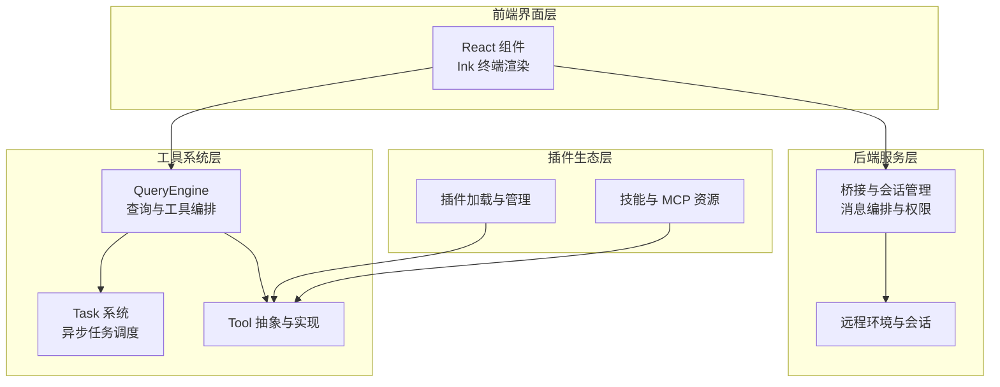
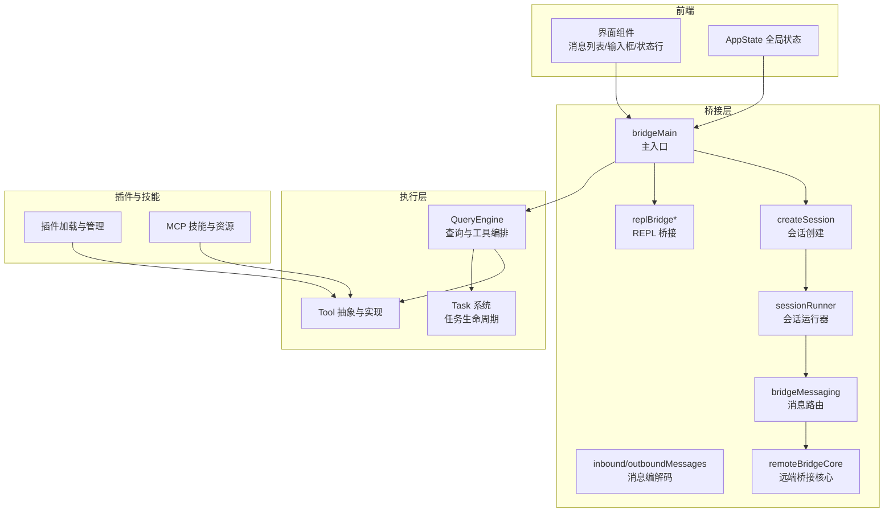
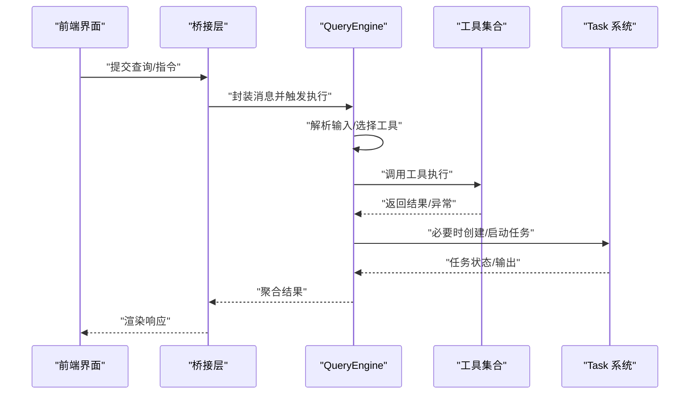
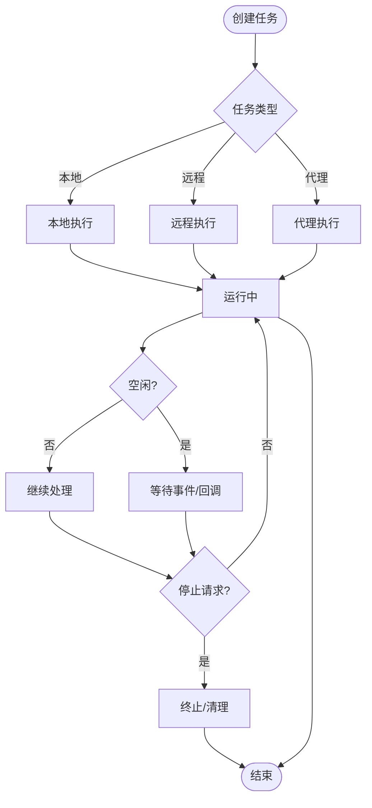
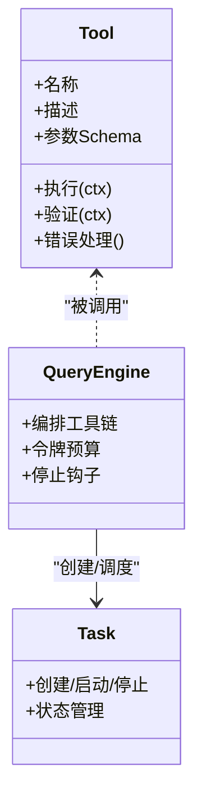
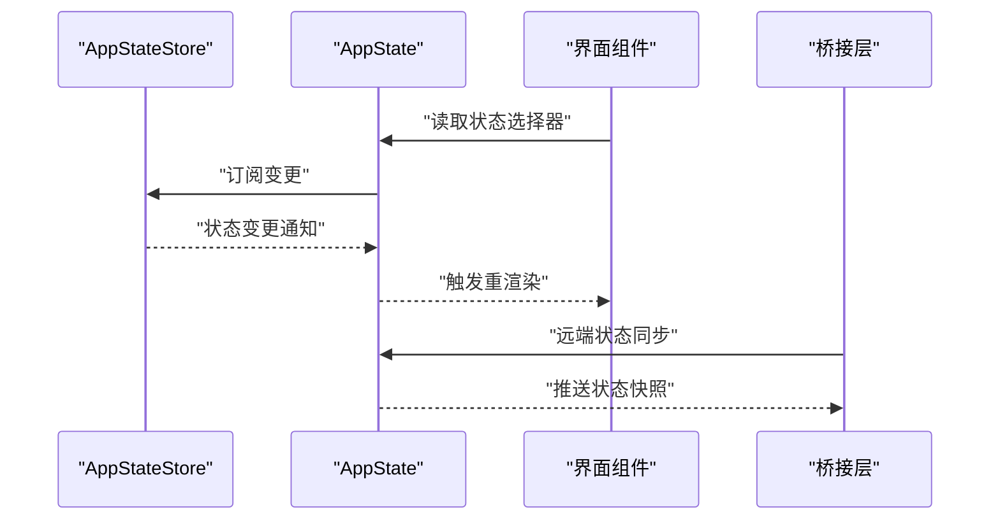
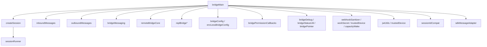
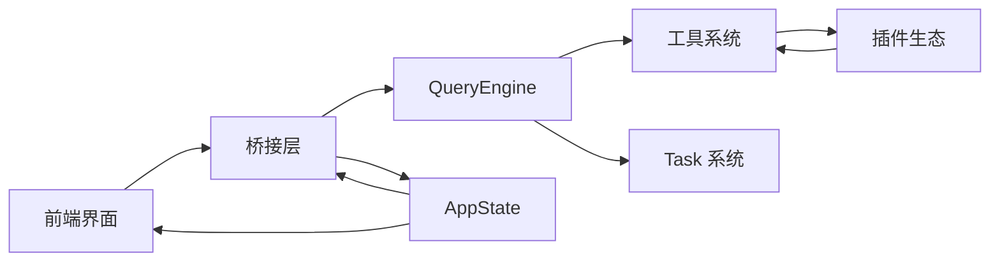

# 架构设计

<cite>
**本文引用的文件**
- [src/QueryEngine.ts](file://src/QueryEngine.ts)
- [src/Task.ts](file://src/Task.ts)
- [src/Tool.ts](file://src/Tool.ts)
- [src/state/AppState.tsx](file://src/state/AppState.tsx)
- [src/bootstrap/state.ts](file://src/bootstrap/state.ts)
- [src/utils/workloadContext.ts](file://src/utils/workloadContext.ts)
- [src/utils/teammate.ts](file://src/utils/teammate.ts)
- [src/utils/teammateMailbox.ts](file://src/utils/teammateMailbox.ts)
- [src/tasks/types.ts](file://src/tasks/types.ts)
- [src/tasks/LocalMainSessionTask.ts](file://src/tasks/LocalMainSessionTask.ts)
- [src/services/analytics/index.ts](file://src/services/analytics/index.ts)
- [src/bridge/bridgeMain.ts](file://src/bridge/bridgeMain.ts)
- [src/bridge/createSession.ts](file://src/bridge/createSession.ts)
- [src/bridge/sessionRunner.ts](file://src/bridge/sessionRunner.ts)
- [src/bridge/inboundMessages.ts](file://src/bridge/inboundMessages.ts)
- [src/bridge/outboundMessages.ts](file://src/bridge/outboundMessages.ts)
- [src/bridge/bridgeMessaging.ts](file://src/bridge/bridgeMessaging.ts)
- [src/bridge/remoteBridgeCore.ts](file://src/bridge/remoteBridgeCore.ts)
- [src/bridge/replBridge.ts](file://src/bridge/replBridge.ts)
- [src/bridge/replBridgeHandle.ts](file://src/bridge/replBridgeHandle.ts)
- [src/bridge/replBridgeTransport.ts](file://src/bridge/replBridgeTransport.ts)
- [src/bridge/initReplBridge.ts](file://src/bridge/initReplBridge.ts)
- [src/bridge/pollConfig.ts](file://src/bridge/pollConfig.ts)
- [src/bridge/pollConfigDefaults.ts](file://src/bridge/pollConfigDefaults.ts)
- [src/bridge/envLessBridgeConfig.ts](file://src/bridge/envLessBridgeConfig.ts)
- [src/bridge/bridgeConfig.ts](file://src/bridge/bridgeConfig.ts)
- [src/bridge/bridgeUI.ts](file://src/bridge/bridgeUI.ts)
- [src/bridge/bridgeDebug.ts](file://src/bridge/bridgeDebug.ts)
- [src/bridge/bridgeStatusUtil.ts](file://src/bridge/bridgeStatusUtil.ts)
- [src/bridge/bridgePointer.ts](file://src/bridge/bridgePointer.ts)
- [src/bridge/bridgePermissionCallbacks.ts](file://src/bridge/bridgePermissionCallbacks.ts)
- [src/bridge/webhookSanitizer.ts](file://src/bridge/webhookSanitizer.ts)
- [src/bridge/workSecret.ts](file://src/bridge/workSecret.ts)
- [src/bridge/trustedDevice.ts](file://src/bridge/trustedDevice.ts)
- [src/bridge/capacityWake.ts](file://src/bridge/capacityWake.ts)
- [src/bridge/jwtUtils.ts](file://src/bridge/jwtUtils.ts)
- [src/bridge/peerSessions.ts](file://src/bridge/peerSessions.ts)
- [src/bridge/codeSessionApi.ts](file://src/bridge/codeSessionApi.ts)
- [src/bridge/debugUtils.ts](file://src/bridge/debugUtils.ts)
- [src/bridge/flushGate.ts](file://src/bridge/flushGate.ts)
- [src/bridge/inboundAttachments.ts](file://src/bridge/inboundAttachments.ts)
- [src/bridge/remoteBridgeCore.ts](file://src/bridge/remoteBridgeCore.ts)
- [src/bridge/sdkMessageAdapter.ts](file://src/bridge/sdkMessageAdapter.ts)
- [src/bridge/bridgeApi.ts](file://src/bridge/bridgeApi.ts)
- [src/bridge/bridgeEnabled.ts](file://src/bridge/bridgeEnabled.ts)
- [src/bridge/sessionIdCompat.ts](file://src/bridge/sessionIdCompat.ts)
- [src/bridge/initReplBridge.ts](file://src/bridge/initReplBridge.ts)
- [src/bridge/bridgeStatusUtil.ts](file://src/bridge/bridgeStatusUtil.ts)
- [src/bridge/bridgePointer.ts](file://src/bridge/bridgePointer.ts)
- [src/bridge/bridgePermissionCallbacks.ts](file://src/bridge/bridgePermissionCallbacks.ts)
- [src/bridge/webhookSanitizer.ts](file://src/bridge/webhookSanitizer.ts)
- [src/bridge/workSecret.ts](file://src/bridge/workSecret.ts)
- [src/bridge/trustedDevice.ts](file://src/bridge/trustedDevice.ts)
- [src/bridge/capacityWake.ts](file://src/bridge/capacityWake.ts)
- [src/bridge/jwtUtils.ts](file://src/bridge/jwtUtils.ts)
- [src/bridge/peerSessions.ts](file://src/bridge/peerSessions.ts)
- [src/bridge/codeSessionApi.ts](file://src/bridge/codeSessionApi.ts)
- [src/bridge/debugUtils.ts](file://src/bridge/debugUtils.ts)
- [src/bridge/flushGate.ts](file://src/bridge/flushGate.ts)
- [src/bridge/inboundAttachments.ts](file://src/bridge/inboundAttachments.ts)
- [src/bridge/remoteBridgeCore.ts](file://src/bridge/remoteBridgeCore.ts)
- [src/bridge/sdkMessageAdapter.ts](file://src/bridge/sdkMessageAdapter.ts)
- [src/bridge/bridgeApi.ts](file://src/bridge/bridgeApi.ts)
- [src/bridge/bridgeEnabled.ts](file://src/bridge/bridgeEnabled.ts)
- [src/bridge/sessionIdCompat.ts](file://src/bridge/sessionIdCompat.ts)
- [src/bridge/initReplBridge.ts](file://src/bridge/initReplBridge.ts)
- [src/bridge/bridgeStatusUtil.ts](file://src/bridge/bridgeStatusUtil.ts)
- [src/bridge/bridgePointer.ts](file://src/bridge/bridgePointer.ts)
- [src/bridge/bridgePermissionCallbacks.ts](file://src/bridge/bridgePermissionCallbacks.ts)
- [src/bridge/webhookSanitizer.ts](file://src/bridge/webhookSanitizer.ts)
- [src/bridge/workSecret.ts](file://src/bridge/workSecret.ts)
- [src/bridge/trustedDevice.ts](file://src/bridge/trustedDevice.ts)
- [src/bridge/capacityWake.ts](file://src/bridge/capacityWake.ts)
- [src/bridge/jwtUtils.ts](file://src/bridge/jwtUtils.ts)
- [src/bridge/peerSessions.ts](file://src/bridge/peerSessions.ts)
- [src/bridge/codeSessionApi.ts](file://src/bridge/codeSessionApi.ts)
- [src/bridge/debugUtils.ts](file://src/bridge/debugUtils.ts)
- [src/bridge/flushGate.ts](file://src/bridge/flushGate.ts)
- [src/bridge/inboundAttachments.ts](file://src/bridge/inboundAttachments.ts)
- [src/bridge/remoteBridgeCore.ts](file://src/bridge/remoteBridgeCore.ts)
- [src/bridge/sdkMessageAdapter.ts](file://src/bridge/sdkMessageAdapter.ts)
- [src/bridge/bridgeApi.ts](file://src/bridge/bridgeApi.ts)
- [src/bridge/bridgeEnabled.ts](file://src/bridge/bridgeEnabled.ts)
- [src/bridge/sessionIdCompat.ts](file://src/bridge/sessionIdCompat.ts)
- [src/bridge/initReplBridge.ts](file://src/bridge/initReplBridge.ts)
- [src/bridge/bridgeStatusUtil.ts](file://src/bridge/bridgeStatusUtil.ts)
- [src/bridge/bridgePointer.ts](file://src/bridge/bridgePointer.ts)
- [src/bridge/bridgePermissionCallbacks.ts](file://src/bridge/bridgePermissionCallbacks.ts)
- [src/bridge/webhookSanitizer.ts](file://src/bridge/webhookSanitizer.ts)
- [src/bridge/workSecret.ts](file://src/bridge/workSecret.ts)
- [src/bridge/trustedDevice.ts](file://src/bridge/trustedDevice.ts)
- [src/bridge/capacityWake.ts](file://src/bridge/capacityWake.ts)
- [src/bridge/jwtUtils.ts](file://src/bridge/jwtUtils.ts)
- [src/bridge/peerSessions.ts](file://src/bridge/peerSessions.ts)
- [src/bridge/codeSessionApi.ts](file://src/bridge/codeSessionApi.ts)
- [src/bridge/debugUtils.ts](file://src/bridge/debugUtils.ts)
- [src/bridge/flushGate.ts](file://src/bridge/flushGate.ts)
- [src/bridge/inboundAttachments.ts](file://src/bridge/inboundAttachments.ts)
- [src/bridge/remoteBridgeCore.ts](file://src/bridge/remoteBridgeCore.ts)
- [src/bridge/sdkMessageAdapter.ts](file://src/bridge/sdkMessageAdapter.ts)
- [src/bridge/bridgeApi.ts](file://src/bridge/bridgeApi.ts)
- [src/bridge/bridgeEnabled.ts](file://src/bridge/bridgeEnabled.ts)
- [src/bridge/sessionIdCompat.ts](file://src/bridge/sessionIdCompat.ts)
- [src/bridge/initReplBridge.ts](file://src/bridge/initReplBridge.ts)
- [src/bridge/bridgeStatusUtil.ts](file://src/bridge/bridgeStatusUtil.ts)
- [src/bridge/bridgePointer.ts](file://src/bridge/bridgePointer.ts)
- [src/bridge/bridgePermissionCallbacks.ts](file://src/bridge/bridgePermissionCallbacks.ts)
- [src/bridge/webhookSanitizer.ts](file://src/bridge/webhookSanitizer.ts)
- [src/bridge/workSecret.ts](file://src/bridge/workSecret.ts)
- [src/bridge/trustedDevice.ts](file://src/bridge/trustedDevice.ts)
- [src/bridge/capacityWake.ts](file://src/bridge/capacityWake.ts)
- [src/bridge/jwtUtils.ts](file://src/bridge/jwtUtils.ts)
- [src/bridge/peerSessions.ts](file://src/bridge/peerSessions.ts)
- [src/bridge/codeSessionApi.ts](file://src/bridge/codeSessionApi.ts)
- [src/bridge/debugUtils.ts](file://src/bridge/debugUtils.ts)
- [src/bridge/flushGate.ts](file://src/bridge/flushGate.ts)
- [src/bridge/inboundAttachments.ts](file://src/bridge/inboundAttachments.ts)
- [src/bridge/remoteBridgeCore.ts](file://src/bridge/remoteBridgeCore.ts)
- [src/bridge/sdkMessageAdapter.ts](file://src/bridge/sdkMessageAdapter.ts)
- [src/bridge/bridgeApi.ts](file://src/bridge/bridgeApi.ts)
- [src/bridge/bridgeEnabled.ts](file://src/bridge/bridgeEnabled.ts)
- [src/bridge/sessionIdCompat.ts](file://src/bridge/sessionIdCompat.ts)
- [src/bridge/initReplBridge.ts](file://src/bridge/initReplBridge.ts)
- [src/bridge/bridgeStatusUtil.ts](file://src/bridge/bridgeStatusUtil.ts)
- [src/bridge/bridgePointer.ts](file://src/bridge/bridgePointer.ts)
- [src/bridge/bridgePermissionCallbacks.ts](file://src/bridge/bridgePermissionCallbacks.ts)
- [src/bridge/webhookSanitizer.ts](file://src/bridge/webhookSanitizer.ts)
- [src/bridge/workSecret.ts](file://src/bridge/workSecret.ts)
- [src/bridge/trustedDevice.ts](file://src/bridge/trustedDevice.ts)
- [src/bridge/capacityWake.ts](file://src/bridge/capacityWake.ts)
- [src/bridge/jwtUtils.ts](file://src/bridge/jwtUtils.ts)
- [src/bridge/peerSessions.ts](file://src/bridge/peerSessions.ts)
- [src/bridge/codeSessionApi.ts](file://src/bridge/codeSessionApi.ts)
- [src/bridge/debugUtils.ts](file://src/bridge/debugUtils.ts)
- [src/bridge/flushGate.ts](file://src/bridge/flushGate.ts)
- [src/bridge/inboundAttachments.ts](file://src/bridge/inboundAttachments.ts)
- [src/bridge/remoteBridgeCore.ts](file://src/bridge/remoteBridgeCore.ts)
- [src/bridge/sdkMessageAdapter.ts](file://src/bridge/sdkMessageAdapter.ts)
- [src/bridge/bridgeApi.ts](file://src/bridge/bridgeApi.ts)
- [src/bridge/bridgeEnabled.ts](file://src/bridge/bridgeEnabled.ts)
- [src/bridge/sessionIdCompat.ts](file://src/bridge/sessionIdCompat.ts)
- [src/bridge/initReplBridge.ts](file://src/bridge/initReplBridge.ts)
- [src/bridge/bridgeStatusUtil.ts......](file://src/bridge/bridgeStatusUtil.ts)
</cite>

## 目录
1. [引言](#引言)
2. [项目结构](#项目结构)
3. [核心组件](#核心组件)
4. [架构总览](#架构总览)
5. [详细组件分析](#详细组件分析)
6. [依赖分析](#依赖分析)
7. [性能考虑](#性能考虑)
8. [故障排查指南](#故障排查指南)
9. [结论](#结论)
10. [附录](#附录)

## 引言
本架构文档面向 Claude Code 的整体模块化设计，围绕前端界面层、后端服务层、工具系统层与插件生态层进行系统化梳理。重点阐释 QueryEngine 如何协调工具执行、AppState 如何管理全局状态、Task 系统如何处理异步任务，并总结观察者模式、工厂模式、策略模式等设计模式在系统中的应用。同时，文档给出架构图表与组件关系图，解释数据流与控制流，帮助读者快速理解系统的扩展性与可维护性。

## 项目结构
Claude Code 采用多层分层与功能域划分相结合的组织方式：
- 前端界面层：React 组件与 Ink 终端渲染体系，负责用户交互与可视化展示。
- 后端服务层：桥接与远程会话管理、消息编排、权限与配置管理。
- 工具系统层：统一的工具抽象与执行框架，支持本地与远程工具调用。
- 插件生态层：内置与外部插件加载、安装来源分类与遥测统计。

下图给出高层结构示意（概念性）：

## 核心组件
本节聚焦三个核心构件及其职责边界与交互关系。

- QueryEngine：统一的查询与工具编排引擎，负责解析输入、选择工具、执行工具链路、处理令牌预算与停止钩子。
- Task：异步任务抽象与生命周期管理，支持本地、远程、代理等任务类型，提供统一的创建、运行、停止与状态更新机制。
- Tool：工具抽象基类与具体工具实现，定义工具接口、参数校验、执行上下文与错误处理策略。
- AppState：全局状态容器，提供状态选择器、变更订阅与派发机制，贯穿前端与后端交互。

章节来源
- [src/QueryEngine.ts](file://src/QueryEngine.ts)
- [src/Task.ts](file://src/Task.ts)
- [src/Tool.ts](file://src/Tool.ts)
- [src/state/AppState.tsx](file://src/state/AppState.tsx)

## 架构总览
系统采用“前端驱动 + 桥接编排 + 工具执行 + 插件扩展”的分层架构。前端通过桥接通道与后端服务通信，QueryEngine 协调工具执行，Task 系统承载异步工作负载，插件生态提供能力扩展。

图表来源
- [src/bridge/bridgeMain.ts](file://src/bridge/bridgeMain.ts)
- [src/bridge/createSession.ts](file://src/bridge/createSession.ts)
- [src/bridge/sessionRunner.ts](file://src/bridge/sessionRunner.ts)
- [src/bridge/inboundMessages.ts](file://src/bridge/inboundMessages.ts)
- [src/bridge/outboundMessages.ts](file://src/bridge/outboundMessages.ts)
- [src/bridge/bridgeMessaging.ts](file://src/bridge/bridgeMessaging.ts)
- [src/bridge/remoteBridgeCore.ts](file://src/bridge/remoteBridgeCore.ts)
- [src/bridge/replBridge.ts](file://src/bridge/replBridge.ts)
- [src/bridge/replBridgeHandle.ts](file://src/bridge/replBridgeHandle.ts)
- [src/bridge/replBridgeTransport.ts](file://src/bridge/replBridgeTransport.ts)
- [src/bridge/initReplBridge.ts](file://src/bridge/initReplBridge.ts)
- [src/QueryEngine.ts](file://src/QueryEngine.ts)
- [src/Task.ts](file://src/Task.ts)
- [src/Tool.ts](file://src/Tool.ts)

## 详细组件分析

### QueryEngine：查询与工具编排
QueryEngine 是系统的核心执行中枢，负责：
- 输入解析与上下文注入
- 工具选择与参数装配
- 执行链路编排与并发控制
- 令牌预算与停止钩子
- 与 Task 系统协作处理异步工作

图表来源
- [src/QueryEngine.ts](file://src/QueryEngine.ts)
- [src/bridge/bridgeMain.ts](file://src/bridge/bridgeMain.ts)
- [src/bridge/inboundMessages.ts](file://src/bridge/inboundMessages.ts)
- [src/bridge/outboundMessages.ts](file://src/bridge/outboundMessages.ts)

章节来源
- [src/QueryEngine.ts](file://src/QueryEngine.ts)
- [src/query/config.ts](file://src/query/config.ts)
- [src/query/deps.ts](file://src/query/deps.ts)
- [src/query/stopHooks.ts](file://src/query/stopHooks.ts)
- [src/query/tokenBudget.ts](file://src/query/tokenBudget.ts)
- [src/query/transitions.ts](file://src/query/transitions.ts)

### Task 系统：异步任务生命周期
Task 系统提供统一的任务抽象与生命周期管理，覆盖本地、远程、代理等场景。其关键点包括：
- 任务类型与状态机：running/idle/stopped 等状态转换
- 任务创建与启动：根据任务类型选择执行路径
- 任务停止与中断：支持优雅关闭与强制终止
- 与 AppState 的集成：通过状态更新驱动 UI 变更

图表来源
- [src/Task.ts](file://src/Task.ts)
- [src/tasks/types.ts](file://src/tasks/types.ts)
- [src/tasks/LocalMainSessionTask.ts](file://src/tasks/LocalMainSessionTask.ts)

章节来源
- [src/Task.ts](file://src/Task.ts)
- [src/tasks/types.ts](file://src/tasks/types.ts)
- [src/tasks/LocalMainSessionTask.ts](file://src/tasks/LocalMainSessionTask.ts)

### Tool 抽象与实现：工具系统层
Tool 抽象定义了工具的通用接口与执行规范，具体工具实现遵循统一约定：
- 参数校验与安全检查
- 上下文注入与权限控制
- 错误处理与重试策略
- 与 QueryEngine 的协作接口

图表来源
- [src/Tool.ts](file://src/Tool.ts)
- [src/QueryEngine.ts](file://src/QueryEngine.ts)
- [src/Task.ts](file://src/Task.ts)

章节来源
- [src/Tool.ts](file://src/Tool.ts)
- [src/tools.ts](file://src/tools.ts)

### AppState：全局状态管理
AppState 提供全局状态容器与变更通知机制，贯穿前端与后端交互：
- 状态选择器：按需选取子状态，避免全量重渲染
- 变更订阅：基于观察者模式的订阅/发布
- 与桥接层协同：通过桥接通道同步状态到远端

图表来源
- [src/state/AppState.tsx](file://src/state/AppState.tsx)
- [src/state/store.ts](file://src/state/store.ts)
- [src/state/selectors.ts](file://src/state/selectors.ts)
- [src/state/AppStateStore.ts](file://src/state/AppStateStore.ts)
- [src/state/onChangeAppState.ts](file://src/state/onChangeAppState.ts)

章节来源
- [src/state/AppState.tsx](file://src/state/AppState.tsx)
- [src/state/store.ts](file://src/state/store.ts)
- [src/state/selectors.ts](file://src/state/selectors.ts)
- [src/state/AppStateStore.ts](file://src/state/AppStateStore.ts)
- [src/state/onChangeAppState.ts](file://src/state/onChangeAppState.ts)

### 桥接层：前后端通信与会话管理
桥接层负责前端与后端服务之间的消息编排、权限控制与会话管理：
- 主入口与配置：bridgeMain、bridgeConfig、envLessBridgeConfig
- 会话创建与运行：createSession、sessionRunner
- 消息编解码与路由：inboundMessages、outboundMessages、bridgeMessaging
- 远端桥接核心：remoteBridgeCore
- REPL 桥接：replBridge、replBridgeHandle、replBridgeTransport、initReplBridge
- 权限与调试：bridgePermissionCallbacks、bridgeDebug、bridgeStatusUtil、bridgePointer
- 安全与合规：webhookSanitizer、workSecret、trustedDevice、capacityWake
- JWT 与设备：jwtUtils、trustedDevice
- 会话兼容：sessionIdCompat
- SDK 适配：sdkMessageAdapter

图表来源
- [src/bridge/bridgeMain.ts](file://src/bridge/bridgeMain.ts)
- [src/bridge/createSession.ts](file://src/bridge/createSession.ts)
- [src/bridge/sessionRunner.ts](file://src/bridge/sessionRunner.ts)
- [src/bridge/inboundMessages.ts](file://src/bridge/inboundMessages.ts)
- [src/bridge/outboundMessages.ts](file://src/bridge/outboundMessages.ts)
- [src/bridge/bridgeMessaging.ts](file://src/bridge/bridgeMessaging.ts)
- [src/bridge/remoteBridgeCore.ts](file://src/bridge/remoteBridgeCore.ts)
- [src/bridge/replBridge.ts](file://src/bridge/replBridge.ts)
- [src/bridge/replBridgeHandle.ts](file://src/bridge/replBridgeHandle.ts)
- [src/bridge/replBridgeTransport.ts](file://src/bridge/replBridgeTransport.ts)
- [src/bridge/initReplBridge.ts](file://src/bridge/initReplBridge.ts)
- [src/bridge/bridgeConfig.ts](file://src/bridge/bridgeConfig.ts)
- [src/bridge/envLessBridgeConfig.ts](file://src/bridge/envLessBridgeConfig.ts)
- [src/bridge/bridgePermissionCallbacks.ts](file://src/bridge/bridgePermissionCallbacks.ts)
- [src/bridge/bridgeDebug.ts](file://src/bridge/bridgeDebug.ts)
- [src/bridge/bridgeStatusUtil.ts](file://src/bridge/bridgeStatusUtil.ts)
- [src/bridge/bridgePointer.ts](file://src/bridge/bridgePointer.ts)
- [src/bridge/webhookSanitizer.ts](file://src/bridge/webhookSanitizer.ts)
- [src/bridge/workSecret.ts](file://src/bridge/workSecret.ts)
- [src/bridge/trustedDevice.ts](file://src/bridge/trustedDevice.ts)
- [src/bridge/capacityWake.ts](file://src/bridge/capacityWake.ts)
- [src/bridge/jwtUtils.ts](file://src/bridge/jwtUtils.ts)
- [src/bridge/sessionIdCompat.ts](file://src/bridge/sessionIdCompat.ts)
- [src/bridge/sdkMessageAdapter.ts](file://src/bridge/sdkMessageAdapter.ts)

章节来源
- [src/bridge/bridgeMain.ts](file://src/bridge/bridgeMain.ts)
- [src/bridge/createSession.ts](file://src/bridge/createSession.ts)
- [src/bridge/sessionRunner.ts](file://src/bridge/sessionRunner.ts)
- [src/bridge/inboundMessages.ts](file://src/bridge/inboundMessages.ts)
- [src/bridge/outboundMessages.ts](file://src/bridge/outboundMessages.ts)
- [src/bridge/bridgeMessaging.ts](file://src/bridge/bridgeMessaging.ts)
- [src/bridge/remoteBridgeCore.ts](file://src/bridge/remoteBridgeCore.ts)
- [src/bridge/replBridge.ts](file://src/bridge/replBridge.ts)
- [src/bridge/replBridgeHandle.ts](file://src/bridge/replBridgeHandle.ts)
- [src/bridge/replBridgeTransport.ts](file://src/bridge/replBridgeTransport.ts)
- [src/bridge/initReplBridge.ts](file://src/bridge/initReplBridge.ts)
- [src/bridge/bridgeConfig.ts](file://src/bridge/bridgeConfig.ts)
- [src/bridge/envLessBridgeConfig.ts](file://src/bridge/envLessBridgeConfig.ts)
- [src/bridge/bridgePermissionCallbacks.ts](file://src/bridge/bridgePermissionCallbacks.ts)
- [src/bridge/bridgeDebug.ts](file://src/bridge/bridgeDebug.ts)
- [src/bridge/bridgeStatusUtil.ts](file://src/bridge/bridgeStatusUtil.ts)
- [src/bridge/bridgePointer.ts](file://src/bridge/bridgePointer.ts)
- [src/bridge/webhookSanitizer.ts](file://src/bridge/webhookSanitizer.ts)
- [src/bridge/workSecret.ts](file://src/bridge/workSecret.ts)
- [src/bridge/trustedDevice.ts](file://src/bridge/trustedDevice.ts)
- [src/bridge/capacityWake.ts](file://src/bridge/capacityWake.ts)
- [src/bridge/jwtUtils.ts](file://src/bridge/jwtUtils.ts)
- [src/bridge/sessionIdCompat.ts](file://src/bridge/sessionIdCompat.ts)
- [src/bridge/sdkMessageAdapter.ts](file://src/bridge/sdkMessageAdapter.ts)

### 设计模式应用
- 观察者模式：AppState 通过订阅/发布机制实现状态变更通知；Task 系统在空闲时注册回调以响应状态变化。
- 工厂模式：工具系统通过工具注册表与工厂函数创建具体工具实例，支持动态扩展。
- 策略模式：QueryEngine 在不同上下文（如 cron、普通会话）下采用不同的策略组合（令牌预算、停止钩子、工具选择）。
- 状态机：Task 类型与状态机用于建模任务生命周期，确保状态转换的确定性与可追踪性。

章节来源
- [src/state/AppState.tsx](file://src/state/AppState.tsx)
- [src/Task.ts](file://src/Task.ts)
- [src/QueryEngine.ts](file://src/QueryEngine.ts)
- [src/utils/workloadContext.ts](file://src/utils/workloadContext.ts)

### 扩展性设计与插件生态
- 插件加载与来源分类：支持默认启用、组织策略、种子挂载与用户安装等来源，便于企业级部署与个性化定制。
- 遥测与分类：对插件命令错误进行网络、权限、校验、未知等分类，辅助问题定位与优化。
- 技能与 MCP：通过技能与 MCP 资源扩展工具集，提升跨平台与跨语言能力。

章节来源
- [src/utils/telemetry/pluginTelemetry.ts](file://src/utils/telemetry/pluginTelemetry.ts)
- [src/skills/mcpSkills.ts](file://src/skills/mcpSkills.ts)
- [src/skills/mcpSkillBuilders.ts](file://src/skills/mcpSkillBuilders.ts)

## 依赖分析
系统各层之间存在清晰的依赖边界与耦合度控制：
- 前端层仅通过桥接层与后端交互，降低对后端细节的耦合。
- QueryEngine 作为编排中心，向上依赖工具系统，向下依赖 Task 系统与桥接层。
- AppState 作为状态枢纽，被前端与桥接层共同依赖，但不直接依赖业务逻辑。
- 插件生态通过工具系统间接影响 QueryEngine 的可用工具集。

图表来源
- [src/bridge/bridgeMain.ts](file://src/bridge/bridgeMain.ts)
- [src/QueryEngine.ts](file://src/QueryEngine.ts)
- [src/Task.ts](file://src/Task.ts)
- [src/Tool.ts](file://src/Tool.ts)
- [src/state/AppState.tsx](file://src/state/AppState.tsx)

章节来源
- [src/bridge/bridgeMain.ts](file://src/bridge/bridgeMain.ts)
- [src/QueryEngine.ts](file://src/QueryEngine.ts)
- [src/Task.ts](file://src/Task.ts)
- [src/Tool.ts](file://src/Tool.ts)
- [src/state/AppState.tsx](file://src/state/AppState.tsx)

## 性能考虑
- 异步上下文隔离：通过 AsyncLocalStorage 为 turn-scoped workload 与 agent 上下文建立隔离边界，避免泄漏与串扰。
- 任务并发与空闲检测：Task 系统在空闲时释放资源，减少不必要的 CPU 占用；支持等待所有同伴任务空闲后再退出，保证一致性。
- 查询预算与停止钩子：QueryEngine 在工具执行前评估预算与停止条件，避免超时或资源耗尽。
- 缓存与懒初始化：用户数据与配置采用缓存与懒初始化策略，降低启动开销。

章节来源
- [src/utils/workloadContext.ts](file://src/utils/workloadContext.ts)
- [src/utils/teammate.ts](file://src/utils/teammate.ts)
- [src/utils/teammateMailbox.ts](file://src/utils/teammateMailbox.ts)
- [src/query/tokenBudget.ts](file://src/query/tokenBudget.ts)
- [src/query/stopHooks.ts](file://src/query/stopHooks.ts)
- [src/utils/user.ts](file://src/utils/user.ts)

## 故障排查指南
- 插件命令错误分类：依据错误信息匹配网络、权限、校验与未知类别，指导修复方向。
- 团队任务空闲等待：当存在正在工作的同伴任务时，使用回调注册等待其全部空闲，避免提前退出导致任务丢失。
- 消息格式与权限：检查消息是否符合预期格式，确认权限回调与调试开关已正确配置。
- REPL 桥接与传输：若 REPL 无响应，检查传输层与初始化流程，确保桥接通道畅通。

章节来源
- [src/utils/telemetry/pluginTelemetry.ts](file://src/utils/telemetry/pluginTelemetry.ts)
- [src/utils/teammate.ts](file://src/utils/teammate.ts)
- [src/bridge/bridgePermissionCallbacks.ts](file://src/bridge/bridgePermissionCallbacks.ts)
- [src/bridge/bridgeDebug.ts](file://src/bridge/bridgeDebug.ts)
- [src/bridge/replBridgeTransport.ts](file://src/bridge/replBridgeTransport.ts)
- [src/bridge/initReplBridge.ts](file://src/bridge/initReplBridge.ts)

## 结论
Claude Code 通过清晰的分层架构与强约束的工具/任务抽象，实现了前端驱动、后端编排、工具执行与插件扩展的有机统一。QueryEngine、Task 系统与 AppState 构成核心控制回路，桥接层保障前后端通信的稳定性与安全性。设计模式的应用提升了系统的可维护性与可扩展性，为后续生态演进奠定了坚实基础。

## 附录
- 关键文件索引
  - QueryEngine：[src/QueryEngine.ts](file://src/QueryEngine.ts)
  - Task：[src/Task.ts](file://src/Task.ts)
  - Tool：[src/Tool.ts](file://src/Tool.ts)
  - AppState：[src/state/AppState.tsx](file://src/state/AppState.tsx)
  - 桥接主入口：[src/bridge/bridgeMain.ts](file://src/bridge/bridgeMain.ts)
  - 会话创建：[src/bridge/createSession.ts](file://src/bridge/createSession.ts)
  - 会话运行器：[src/bridge/sessionRunner.ts](file://src/bridge/sessionRunner.ts)
  - 消息编解码：[src/bridge/inboundMessages.ts](file://src/bridge/inboundMessages.ts), [src/bridge/outboundMessages.ts](file://src/bridge/outboundMessages.ts)
  - 消息路由：[src/bridge/bridgeMessaging.ts](file://src/bridge/bridgeMessaging.ts)
  - 远端桥接核心：[src/bridge/remoteBridgeCore.ts](file://src/bridge/remoteBridgeCore.ts)
  - REPL 桥接：[src/bridge/replBridge.ts](file://src/bridge/replBridge.ts), [src/bridge/replBridgeHandle.ts](file://src/bridge/replBridgeHandle.ts), [src/bridge/replBridgeTransport.ts](file://src/bridge/replBridgeTransport.ts), [src/bridge/initReplBridge.ts](file://src/bridge/initReplBridge.ts)
  - 配置与环境：[src/bridge/bridgeConfig.ts](file://src/bridge/bridgeConfig.ts), [src/bridge/envLessBridgeConfig.ts](file://src/bridge/envLessBridgeConfig.ts)
  - 权限与调试：[src/bridge/bridgePermissionCallbacks.ts](file://src/bridge/bridgePermissionCallbacks.ts), [src/bridge/bridgeDebug.ts](file://src/bridge/bridgeDebug.ts), [src/bridge/bridgeStatusUtil.ts](file://src/bridge/bridgeStatusUtil.ts), [src/bridge/bridgePointer.ts](file://src/bridge/bridgePointer.ts)
  - 安全与合规：[src/bridge/webhookSanitizer.ts](file://src/bridge/webhookSanitizer.ts), [src/bridge/workSecret.ts](file://src/bridge/workSecret.ts), [src/bridge/trustedDevice.ts](file://src/bridge/trustedDevice.ts), [src/bridge/capacityWake.ts](file://src/bridge/capacityWake.ts)
  - JWT 与设备：[src/bridge/jwtUtils.ts](file://src/bridge/jwtUtils.ts), [src/bridge/trustedDevice.ts](file://src/bridge/trustedDevice.ts)
  - 会话兼容：[src/bridge/sessionIdCompat.ts](file://src/bridge/sessionIdCompat.ts)
  - SDK 适配：[src/bridge/sdkMessageAdapter.ts](file://src/bridge/sdkMessageAdapter.ts)
  - 插件遥测：[src/utils/telemetry/pluginTelemetry.ts](file://src/utils/telemetry/pluginTelemetry.ts)
  - 技能与 MCP：[src/skills/mcpSkills.ts](file://src/skills/mcpSkills.ts), [src/skills/mcpSkillBuilders.ts](file://src/skills/mcpSkillBuilders.ts)