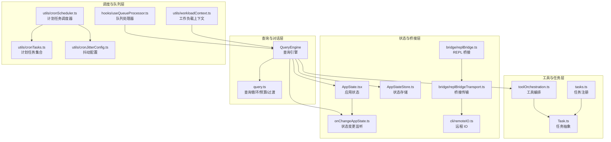
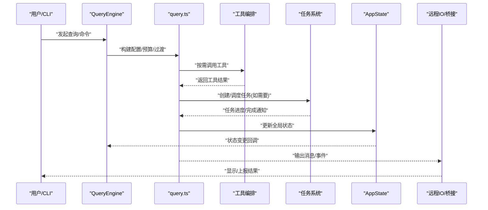
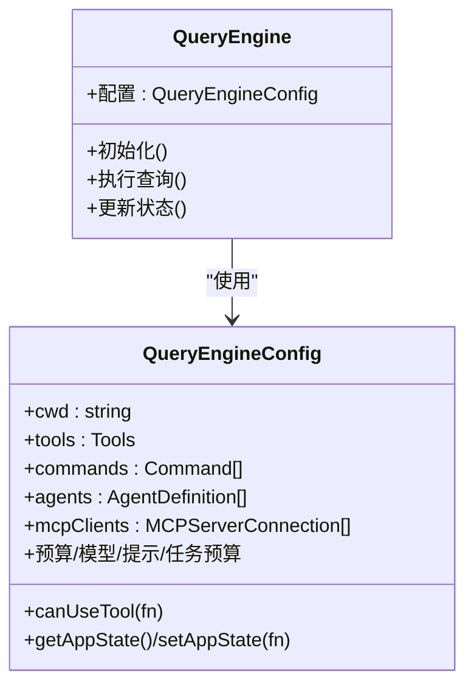
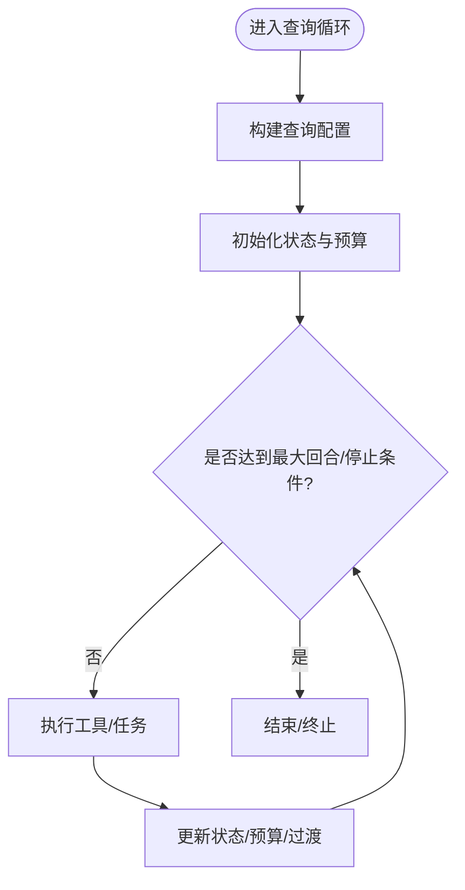
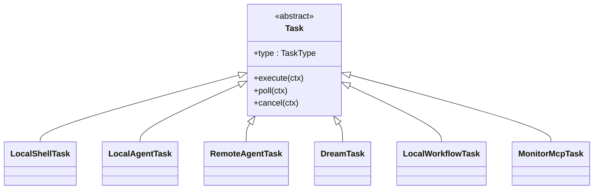
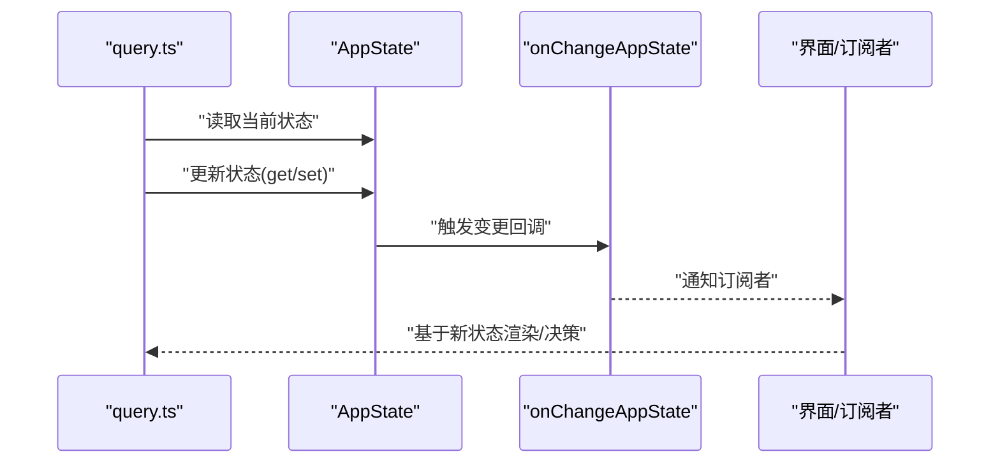
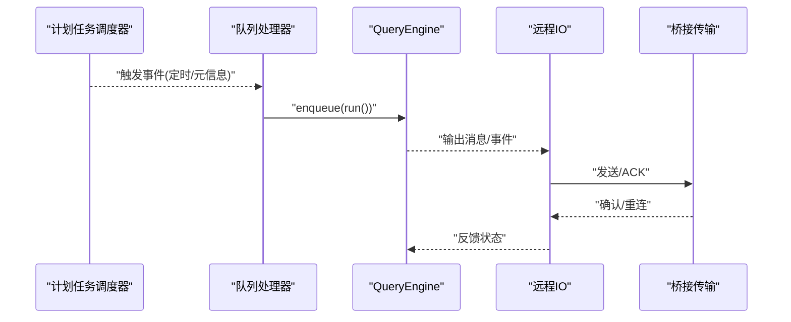
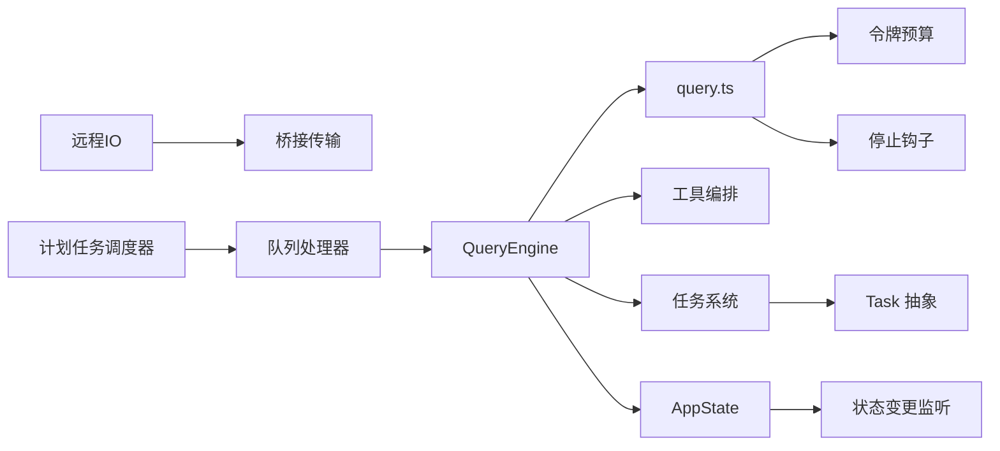

# 组件交互关系

<cite>
**本文引用的文件**
- [QueryEngine.ts](file://src/QueryEngine.ts)
- [query.ts](file://src/query.ts)
- [tasks.ts](file://src/tasks.ts)
- [Task.ts](file://src/Task.ts)
- [AppState.tsx](file://src/state/AppState.tsx)
- [AppStateStore.ts](file://src/state/AppStateStore.ts)
- [onChangeAppState.ts](file://src/state/onChangeAppState.ts)
- [bootstrap/state.ts](file://src/bootstrap/state.ts)
- [cli/print.ts](file://src/cli/print.ts)
- [cli/remoteIO.ts](file://src/cli/remoteIO.ts)
- [bridge/replBridge.ts](file://src/bridge/replBridge.ts)
- [bridge/replBridgeTransport.ts](file://src/bridge/replBridgeTransport.ts)
- [services/tools/toolOrchestration.ts](file://src/services/tools/toolOrchestration.ts)
- [query/config.ts](file://src/query/config.ts)
- [query/deps.ts](file://src/query/deps.ts)
- [query/transitions.ts](file://src/query/transitions.ts)
- [query/tokenBudget.ts](file://src/query/tokenBudget.ts)
- [query/stopHooks.ts](file://src/query/stopHooks.ts)
- [utils/workloadContext.ts](file://src/utils/workloadContext.ts)
- [hooks/useQueueProcessor.ts](file://src/hooks/useQueueProcessor.ts)
- [hooks/useScheduledTasks.ts](file://src/hooks/useScheduledTasks.ts)
- [utils/cronScheduler.ts](file://src/utils/cronScheduler.ts)
- [utils/cronTasks.ts](file://src/utils/cronTasks.ts)
- [utils/cronTasksLock.ts](file://src/utils/cronTasksLock.ts)
- [utils/cronJitterConfig.ts](file://src/utils/cronJitterConfig.ts)
- [utils/messageQueueManager.ts](file://src/utils/messageQueueManager.ts)
- [utils/telemetry.ts](file://src/utils/telemetry.ts)
</cite>

## 目录
1. [引言](#引言)
2. [项目结构](#项目结构)
3. [核心组件](#核心组件)
4. [架构总览](#架构总览)
5. [详细组件分析](#详细组件分析)
6. [依赖关系分析](#依赖关系分析)
7. [性能考量](#性能考量)
8. [故障排查指南](#故障排查指南)
9. [结论](#结论)
10. [附录](#附录)

## 引言
本文件聚焦于 Claude Code 的核心组件交互关系，围绕以下主题展开：QueryEngine 如何协调工具与任务执行；Task 系统如何处理异步任务调度；AppState 如何管理全局状态同步；以及组件间通信机制（事件驱动、消息传递、回调）。文档通过架构图、时序图与流程图，解释典型场景下的数据流与控制流，并分析组件间的依赖与耦合。

## 项目结构
从代码库中可抽象出如下关键层次：
- 查询与对话层：QueryEngine 负责构建查询配置、编排工具调用、维护令牌预算与停止钩子。
- 工具与任务层：工具通过 orchestration 协调执行，任务以 Task 抽象统一调度，支持本地/远程/工作流等类型。
- 状态与桥接层：AppState 提供全局状态读写与变更通知；CLI/桥接模块负责消息传输与事件上报。
- 队列与调度层：命令队列、计划任务、工作负载上下文确保并发安全与有序执行。

**图表来源**
- [QueryEngine.ts:130-173](file://src/QueryEngine.ts#L130-L173)
- [query.ts:241-280](file://src/query.ts#L241-L280)
- [services/tools/toolOrchestration.ts](file://src/services/tools/toolOrchestration.ts)
- [tasks.ts:1-39](file://src/tasks.ts#L1-L39)
- [Task.ts](file://src/Task.ts)
- [AppState.tsx](file://src/state/AppState.tsx)
- [AppStateStore.ts](file://src/state/AppStateStore.ts)
- [onChangeAppState.ts](file://src/state/onChangeAppState.ts)
- [bridge/replBridge.ts:576-615](file://src/bridge/replBridge.ts#L576-L615)
- [bridge/replBridgeTransport.ts:234-252](file://src/bridge/replBridgeTransport.ts#L234-L252)
- [cli/remoteIO.ts:221-255](file://src/cli/remoteIO.ts#L221-L255)
- [hooks/useQueueProcessor.ts](file://src/hooks/useQueueProcessor.ts)
- [utils/cronScheduler.ts](file://src/utils/cronScheduler.ts)
- [utils/cronTasks.ts](file://src/utils/cronTasks.ts)
- [utils/cronJitterConfig.ts](file://src/utils/cronJitterConfig.ts)
- [utils/workloadContext.ts:32-57](file://src/utils/workloadContext.ts#L32-L57)

**章节来源**
- [QueryEngine.ts:130-173](file://src/QueryEngine.ts#L130-L173)
- [query.ts:241-280](file://src/query.ts#L241-L280)
- [tasks.ts:1-39](file://src/tasks.ts#L1-L39)

## 核心组件
- QueryEngine：作为查询编排中心，接收工具、命令、代理、MCP 客户端等依赖，提供系统提示注入、模型选择、预算与回退策略、历史截断等能力。
- query.ts：实现查询循环与状态机，包含预算跟踪、令牌计数、停止钩子、配置构建与过渡逻辑。
- Task 体系：统一的任务抽象与动态加载，支持本地/远程/工作流/监控等类型，配合队列与计划任务进行异步调度。
- AppState：提供全局状态的读取、更新与变更通知，支撑 UI 与后台逻辑的状态一致性。
- CLI/桥接：负责消息输出、事件上报、权限请求、重连与环境恢复等。

**章节来源**
- [QueryEngine.ts:130-173](file://src/QueryEngine.ts#L130-L173)
- [query.ts:241-280](file://src/query.ts#L241-L280)
- [tasks.ts:1-39](file://src/tasks.ts#L1-L39)
- [AppState.tsx](file://src/state/AppState.tsx)
- [AppStateStore.ts](file://src/state/AppStateStore.ts)
- [onChangeAppState.ts](file://src/state/onChangeAppState.ts)

## 架构总览
下图展示 QueryEngine 在一次典型“询问-工具-任务-状态-输出”的往返中，各组件的交互路径与职责边界。

**图表来源**
- [QueryEngine.ts:130-173](file://src/QueryEngine.ts#L130-L173)
- [query.ts:241-280](file://src/query.ts#L241-L280)
- [services/tools/toolOrchestration.ts](file://src/services/tools/toolOrchestration.ts)
- [tasks.ts:1-39](file://src/tasks.ts#L1-L39)
- [AppState.tsx](file://src/state/AppState.tsx)
- [cli/remoteIO.ts:221-255](file://src/cli/remoteIO.ts#L221-L255)

## 详细组件分析

### QueryEngine：查询编排与资源协调
- 职责
  - 接收工具、命令、代理、MCP 客户端、系统提示、模型与预算参数。
  - 通过配置模块与依赖注入构建运行时上下文。
  - 协调工具执行与任务调度，处理停止钩子与预算检查。
- 关键交互
  - 与工具编排：调用工具执行接口，聚合结果并更新状态。
  - 与任务系统：在查询循环中触发任务创建与轮询。
  - 与状态：读取/更新全局状态，驱动 UI 与后台行为。
  - 与输出：通过远程 IO/桥接模块发送消息与事件。

**图表来源**
- [QueryEngine.ts:130-173](file://src/QueryEngine.ts#L130-L173)

**章节来源**
- [QueryEngine.ts:130-173](file://src/QueryEngine.ts#L130-L173)

### query.ts：查询循环、预算与过渡
- 职责
  - 实现异步迭代的查询循环，维护跨迭代状态。
  - 管理令牌预算、输出计数、预算追踪与回退。
  - 应用停止钩子、构建查询配置、处理过渡（继续/终止）。
- 关键点
  - 状态对象包含消息、工具上下文、最大输出令牌覆盖、停止钩子标记、回合计数等。
  - 预算跟踪器在特性开关开启时启用，贯穿整个查询生命周期。

**图表来源**
- [query.ts:241-280](file://src/query.ts#L241-L280)
- [query/config.ts](file://src/query/config.ts)
- [query/deps.ts](file://src/query/deps.ts)
- [query/transitions.ts](file://src/query/transitions.ts)
- [query/tokenBudget.ts](file://src/query/tokenBudget.ts)
- [query/stopHooks.ts](file://src/query/stopHooks.ts)

**章节来源**
- [query.ts:241-280](file://src/query.ts#L241-L280)
- [query/config.ts](file://src/query/config.ts)
- [query/deps.ts](file://src/query/deps.ts)
- [query/transitions.ts](file://src/query/transitions.ts)
- [query/tokenBudget.ts](file://src/query/tokenBudget.ts)
- [query/stopHooks.ts](file://src/query/stopHooks.ts)

### Task 系统：异步任务调度
- 职责
  - 统一的任务抽象与动态加载，支持本地/远程/工作流/监控等类型。
  - 与查询循环集成，在需要时创建并轮询任务状态。
- 关键点
  - 动态引入任务类型，避免顶层常量导致的循环依赖。
  - 与队列处理器协作，保证并发安全与有序执行。

**图表来源**
- [tasks.ts:1-39](file://src/tasks.ts#L1-L39)
- [Task.ts](file://src/Task.ts)

**章节来源**
- [tasks.ts:1-39](file://src/tasks.ts#L1-L39)
- [Task.ts](file://src/Task.ts)

### AppState：全局状态同步
- 职责
  - 提供全局状态的读取与更新入口。
  - 通过变更监听器驱动 UI 与后台逻辑的联动。
- 关键点
  - 与查询引擎配置中的状态读写函数对接，确保查询循环内可见最新状态。
  - 与桥接/远程 IO 协作，保障跨进程状态一致。

**图表来源**
- [AppState.tsx](file://src/state/AppState.tsx)
- [AppStateStore.ts](file://src/state/AppStateStore.ts)
- [onChangeAppState.ts](file://src/state/onChangeAppState.ts)
- [bootstrap/state.ts](file://src/bootstrap/state.ts)

**章节来源**
- [AppState.tsx](file://src/state/AppState.tsx)
- [AppStateStore.ts](file://src/state/AppStateStore.ts)
- [onChangeAppState.ts](file://src/state/onChangeAppState.ts)
- [bootstrap/state.ts](file://src/bootstrap/state.ts)

### 通信机制：事件驱动、消息传递与回调
- 事件驱动
  - 队列处理器与计划任务调度器通过事件/回调驱动查询循环重启与命令入队。
- 消息传递
  - 远程 IO 将消息写入传输层，桥接传输负责事件确认与重连恢复。
- 回调函数
  - 状态变更回调、工具执行回调、任务轮询回调共同构成异步链路。

**图表来源**
- [hooks/useQueueProcessor.ts](file://src/hooks/useQueueProcessor.ts)
- [hooks/useScheduledTasks.ts](file://src/hooks/useScheduledTasks.ts)
- [utils/cronScheduler.ts](file://src/utils/cronScheduler.ts)
- [utils/cronTasks.ts](file://src/utils/cronTasks.ts)
- [utils/cronJitterConfig.ts](file://src/utils/cronJitterConfig.ts)
- [cli/remoteIO.ts:221-255](file://src/cli/remoteIO.ts#L221-L255)
- [bridge/replBridgeTransport.ts:234-252](file://src/bridge/replBridgeTransport.ts#L234-L252)

**章节来源**
- [hooks/useQueueProcessor.ts](file://src/hooks/useQueueProcessor.ts)
- [hooks/useScheduledTasks.ts](file://src/hooks/useScheduledTasks.ts)
- [utils/cronScheduler.ts](file://src/utils/cronScheduler.ts)
- [utils/cronTasks.ts](file://src/utils/cronTasks.ts)
- [utils/cronJitterConfig.ts](file://src/utils/cronJitterConfig.ts)
- [cli/remoteIO.ts:221-255](file://src/cli/remoteIO.ts#L221-L255)
- [bridge/replBridgeTransport.ts:234-252](file://src/bridge/replBridgeTransport.ts#L234-L252)

## 依赖关系分析
- 松耦合设计
  - QueryEngine 通过配置接口注入依赖，降低对具体工具/任务实现的耦合。
  - 状态读写通过函数注入，便于测试与替换。
- 关键依赖链
  - QueryEngine -> query.ts -> 工具编排/任务系统/状态/预算。
  - CLI/桥接 -> 远程 IO -> 传输层 -> 外部系统。
- 并发与一致性
  - 工作负载上下文确保在泄漏上下文中也能正确隔离，避免跨回合污染。
  - 队列与计划任务在运行互斥锁保护下有序执行。

**图表来源**
- [QueryEngine.ts:130-173](file://src/QueryEngine.ts#L130-L173)
- [query.ts:241-280](file://src/query.ts#L241-L280)
- [services/tools/toolOrchestration.ts](file://src/services/tools/toolOrchestration.ts)
- [tasks.ts:1-39](file://src/tasks.ts#L1-L39)
- [Task.ts](file://src/Task.ts)
- [AppState.tsx](file://src/state/AppState.tsx)
- [onChangeAppState.ts](file://src/state/onChangeAppState.ts)
- [cli/remoteIO.ts:221-255](file://src/cli/remoteIO.ts#L221-L255)
- [bridge/replBridgeTransport.ts:234-252](file://src/bridge/replBridgeTransport.ts#L234-L252)
- [hooks/useQueueProcessor.ts](file://src/hooks/useQueueProcessor.ts)
- [utils/cronScheduler.ts](file://src/utils/cronScheduler.ts)

**章节来源**
- [QueryEngine.ts:130-173](file://src/QueryEngine.ts#L130-L173)
- [query.ts:241-280](file://src/query.ts#L241-L280)
- [tasks.ts:1-39](file://src/tasks.ts#L1-L39)
- [AppState.tsx](file://src/state/AppState.tsx)
- [cli/remoteIO.ts:221-255](file://src/cli/remoteIO.ts#L221-L255)
- [bridge/replBridgeTransport.ts:234-252](file://src/bridge/replBridgeTransport.ts#L234-L252)
- [hooks/useQueueProcessor.ts](file://src/hooks/useQueueProcessor.ts)
- [utils/cronScheduler.ts](file://src/utils/cronScheduler.ts)

## 性能考量
- 预算与回退
  - 启用令牌预算跟踪，结合输出计数与回退模型，避免超支与长尾延迟。
- 背压与刷新
  - 事件上传器在队列满时阻塞入队，支持 flush 与 close 清理，减少内存压力。
- 计划任务抖动
  - 使用抖动配置平滑突发，避免集中触发导致的资源争用。
- 工作负载隔离
  - 始终建立上下文边界，防止泄漏上下文影响后续回合的统计与调度。

**章节来源**
- [query/tokenBudget.ts](file://src/query/tokenBudget.ts)
- [cli/transports/SerialBatchEventUploader.ts:106-150](file://src/cli/transports/SerialBatchEventUploader.ts#L106-L150)
- [utils/cronJitterConfig.ts](file://src/utils/cronJitterConfig.ts)
- [utils/workloadContext.ts:32-57](file://src/utils/workloadContext.ts#L32-L57)

## 故障排查指南
- 环境重建与重连
  - 当后端返回 404 或会话丢失时，桥接模块尝试“原地重连”或“全新会话”，并共享重连 Promise 避免竞态。
- 事件确认与积压
  - 桥接传输在 SSE 事件到达时立即上报“已接收/已处理”，避免重启后重复排队。
- 队列与计划任务
  - 若出现消息卡住，检查队列互斥锁与计划任务调度器状态；必要时触发 flush/close 清理。
- 状态不一致
  - 确认状态变更回调是否被触发，以及 UI 是否订阅到最新状态。

**章节来源**
- [bridge/replBridge.ts:576-615](file://src/bridge/replBridge.ts#L576-L615)
- [bridge/replBridgeTransport.ts:234-252](file://src/bridge/replBridgeTransport.ts#L234-L252)
- [cli/transports/SerialBatchEventUploader.ts:106-150](file://src/cli/transports/SerialBatchEventUploader.ts#L106-L150)
- [cli/print.ts:2475-2510](file://src/cli/print.ts#L2475-L2510)

## 结论
本文件梳理了 QueryEngine、query 循环、Task 系统、AppState 与桥接/远程 IO 的交互关系。通过事件驱动、消息传递与回调机制，系统实现了查询编排、工具与任务调度、全局状态同步与可观测性。建议在扩展新工具/任务时遵循配置注入与状态回调模式，保持松耦合与高内聚；在引入新特性时利用工作负载上下文与预算控制，确保稳定性与性能。

## 附录
- 典型场景参考
  - 任务通知 -> 队列处理器 -> 查询循环 -> 工具执行 -> 状态更新 -> 输出上报。
  - 计划任务触发 -> 队列入队 -> 运行互斥锁保护 -> 执行查询 -> 刷新队列。
- 参考实现位置
  - [cli/print.ts:2006-2033](file://src/cli/print.ts#L2006-L2033)
  - [cli/print.ts:2696-2734](file://src/cli/print.ts#L2696-L2734)
  - [utils/messageQueueManager.ts](file://src/utils/messageQueueManager.ts)
  - [utils/telemetry.ts](file://src/utils/telemetry.ts)