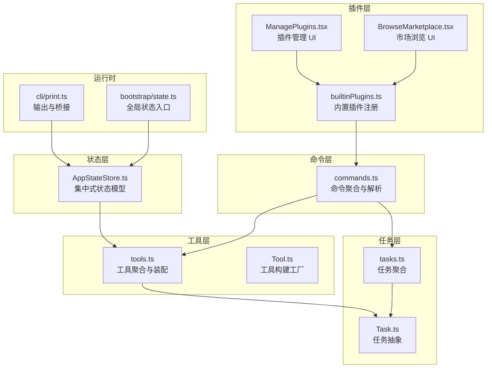
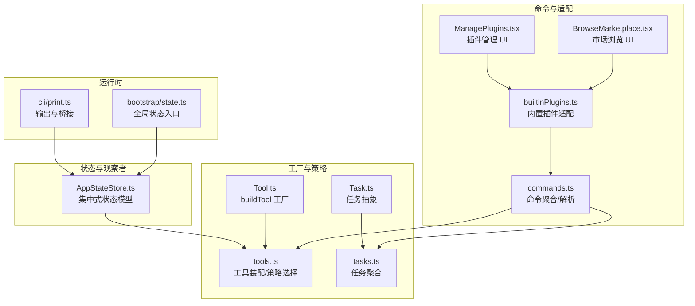
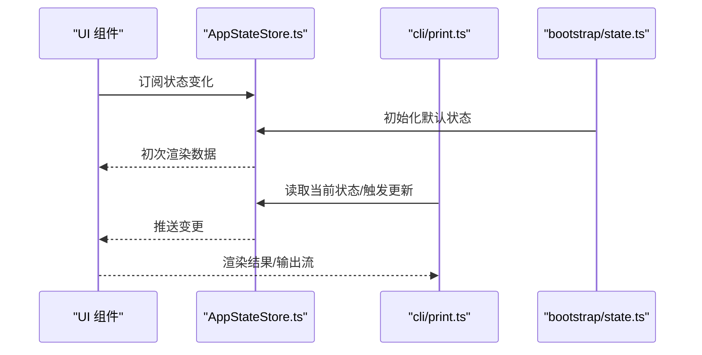
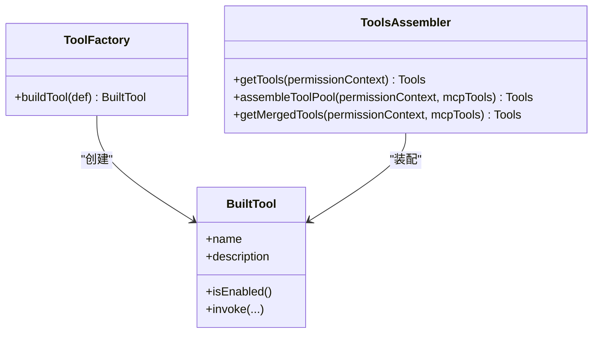
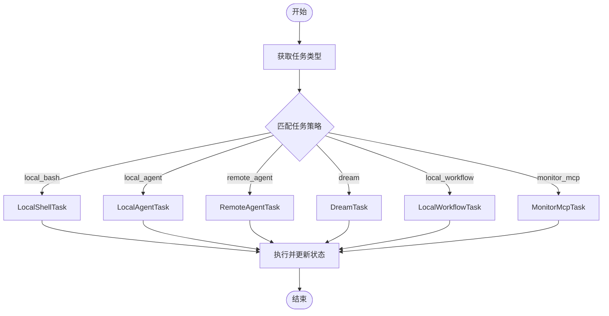
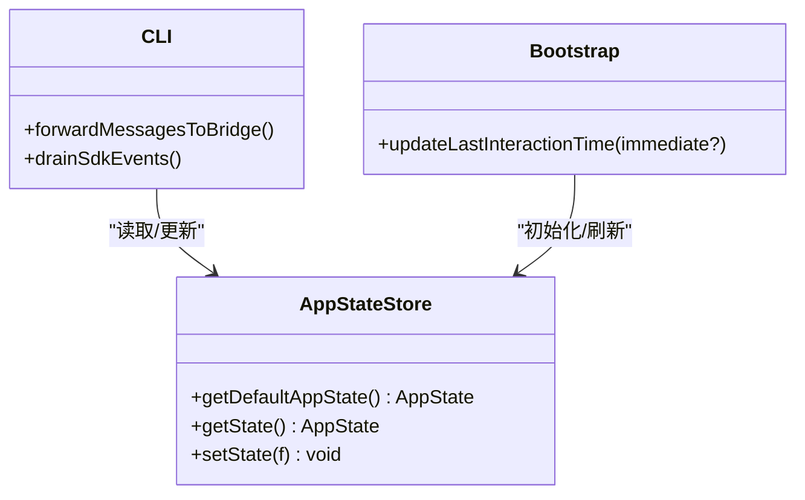
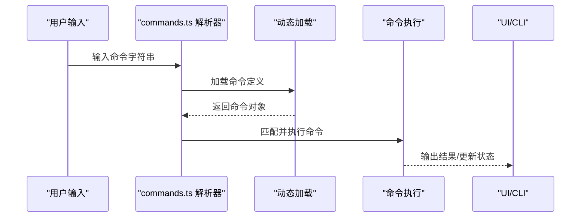
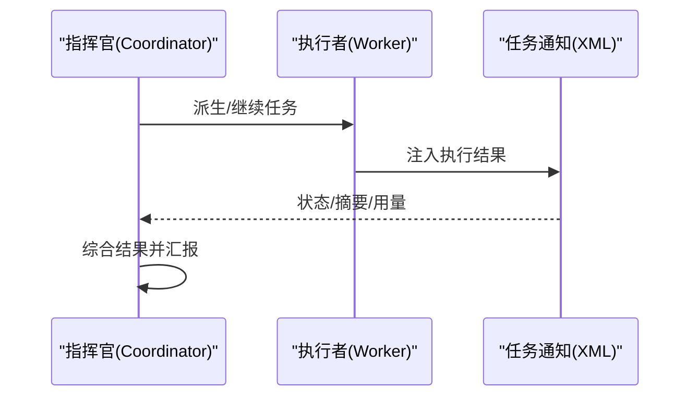
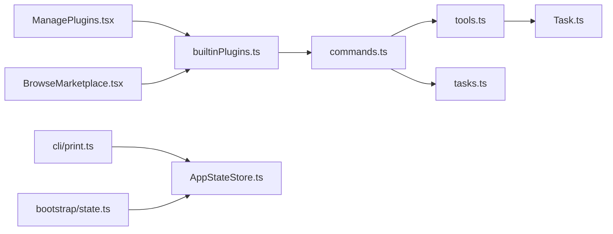

# 设计模式应用

<cite>
**本文引用的文件**
- [src/state/AppStateStore.ts](file://src/state/AppStateStore.ts)
- [src/tools.ts](file://src/tools.ts)
- [src/Tool.ts](file://src/Tool.ts)
- [src/tasks.ts](file://src/tasks.ts)
- [src/Task.ts](file://src/Task.ts)
- [src/commands.ts](file://src/commands.ts)
- [src/plugins/builtinPlugins.ts](file://src/plugins/builtinPlugins.ts)
- [src/commands/plugin/ManagePlugins.tsx](file://src/commands/plugin/ManagePlugins.tsx)
- [src/commands/plugin/BrowseMarketplace.tsx](file://src/commands/plugin/BrowseMarketplace.tsx)
- [src/commands/plugin/pluginDetailsHelpers.tsx](file://src/commands/plugin/pluginDetailsHelpers.tsx)
- [src/commands/plugin/parseArgs.ts](file://src/commands/plugin/parseArgs.ts)
- [src/cli/print.ts](file://src/cli/print.ts)
- [src/bootstrap/state.ts](file://src/bootstrap/state.ts)
- [docs/04-coordinator.md](file://docs/04-coordinator.md)
</cite>

## 目录
1. [引言](#引言)
2. [项目结构](#项目结构)
3. [核心组件](#核心组件)
4. [架构总览](#架构总览)
5. [详细组件分析](#详细组件分析)
6. [依赖关系分析](#依赖关系分析)
7. [性能考量](#性能考量)
8. [故障排查指南](#故障排查指南)
9. [结论](#结论)

## 引言
本文件聚焦于 Claude Code 项目中的设计模式实践，围绕以下主题展开：  
- 观察者模式在状态管理中的应用（通过 AppStateStore 的事件驱动与订阅更新）  
- 工厂模式在工具创建中的使用（buildTool 与工具注册装配）  
- 策略模式在任务执行中的体现（按类型选择不同任务实现）  
- 单例模式在全局状态中的实现（通过模块级状态与集中式 Store）  
- 命令模式在命令系统中的应用（命令定义、解析与执行）  
- 适配器模式在插件系统中的作用（内置插件与市场插件的统一适配）

## 项目结构
该项目采用“功能域 + 层次化”的组织方式：  
- state：集中式状态模型与 Store 抽象  
- tools：工具体系（内置工具与 MCP 工具的合并与去重）  
- tasks：任务抽象与多实现（本地/远程/工作流等）  
- commands：命令体系（内置命令、技能命令、插件命令）  
- plugins：插件注册与内置插件适配  
- cli：输出与桥接（CLI 输出流、消息转发）  
- docs：编排模式文档（Coordinator 模式）



图示来源
- [src/state/AppStateStore.ts:1-570](file://src/state/AppStateStore.ts#L1-L570)
- [src/tools.ts:1-390](file://src/tools.ts#L1-L390)
- [src/Tool.ts:716-792](file://src/Tool.ts#L716-L792)
- [src/tasks.ts:1-39](file://src/tasks.ts#L1-L39)
- [src/Task.ts:1-57](file://src/Task.ts#L1-L57)
- [src/commands.ts:1-755](file://src/commands.ts#L1-L755)
- [src/plugins/builtinPlugins.ts:1-160](file://src/plugins/builtinPlugins.ts#L1-L160)
- [src/commands/plugin/ManagePlugins.tsx:193-225](file://src/commands/plugin/ManagePlugins.tsx#L193-L225)
- [src/commands/plugin/BrowseMarketplace.tsx:635-658](file://src/commands/plugin/BrowseMarketplace.tsx#L635-L658)
- [src/cli/print.ts:2216-2254](file://src/cli/print.ts#L2216-L2254)
- [src/bootstrap/state.ts:627-673](file://src/bootstrap/state.ts#L627-L673)

章节来源
- [src/state/AppStateStore.ts:1-570](file://src/state/AppStateStore.ts#L1-L570)
- [src/tools.ts:1-390](file://src/tools.ts#L1-L390)
- [src/commands.ts:1-755](file://src/commands.ts#L1-L755)
- [src/plugins/builtinPlugins.ts:1-160](file://src/plugins/builtinPlugins.ts#L1-L160)

## 核心组件
- 集中式状态模型（AppStateStore）：统一承载设置、任务、插件、通知、权限等状态，并提供默认值与深冻结结构，确保状态不可变性与可追踪性。  
- 工具体系（tools.ts + Tool.ts）：内置工具与 MCP 工具的合并、去重与权限过滤；通过 buildTool 提供一致的工具构建接口。  
- 任务体系（tasks.ts + Task.ts）：抽象任务类型与状态，按类型分发到不同实现（本地/远程/工作流/监控等）。  
- 命令体系（commands.ts）：内置命令、技能命令、插件命令的聚合与动态加载，支持远程安全命令过滤与描述格式化。  
- 插件系统（builtinPlugins.ts + ManagePlugins.tsx + BrowseMarketplace.tsx）：内置插件注册与启用/禁用控制，统一适配为命令源；UI 展示与菜单选项生成。  
- CLI 输出与桥接（cli/print.ts + bootstrap/state.ts）：输出流控制、消息转发、交互时间戳刷新。

章节来源
- [src/state/AppStateStore.ts:456-570](file://src/state/AppStateStore.ts#L456-L570)
- [src/tools.ts:193-390](file://src/tools.ts#L193-L390)
- [src/Tool.ts:716-792](file://src/Tool.ts#L716-L792)
- [src/tasks.ts:17-39](file://src/tasks.ts#L17-L39)
- [src/Task.ts:6-57](file://src/Task.ts#L6-L57)
- [src/commands.ts:258-517](file://src/commands.ts#L258-L517)
- [src/plugins/builtinPlugins.ts:57-121](file://src/plugins/builtinPlugins.ts#L57-L121)
- [src/cli/print.ts:2216-2254](file://src/cli/print.ts#L2216-L2254)
- [src/bootstrap/state.ts:627-673](file://src/bootstrap/state.ts#L627-L673)

## 架构总览
下图展示了设计模式在系统中的落地位置与交互关系：



图示来源
- [src/state/AppStateStore.ts:1-570](file://src/state/AppStateStore.ts#L1-L570)
- [src/Tool.ts:716-792](file://src/Tool.ts#L716-L792)
- [src/tools.ts:193-390](file://src/tools.ts#L193-L390)
- [src/Task.ts:6-57](file://src/Task.ts#L6-L57)
- [src/tasks.ts:17-39](file://src/tasks.ts#L17-L39)
- [src/commands.ts:258-517](file://src/commands.ts#L258-L517)
- [src/plugins/builtinPlugins.ts:57-121](file://src/plugins/builtinPlugins.ts#L57-L121)
- [src/commands/plugin/ManagePlugins.tsx:193-225](file://src/commands/plugin/ManagePlugins.tsx#L193-L225)
- [src/commands/plugin/BrowseMarketplace.tsx:635-658](file://src/commands/plugin/BrowseMarketplace.tsx#L635-L658)
- [src/cli/print.ts:2216-2254](file://src/cli/print.ts#L2216-L2254)
- [src/bootstrap/state.ts:627-673](file://src/bootstrap/state.ts#L627-L673)

## 详细组件分析

### 观察者模式在状态管理中的应用（AppStateStore）
- 模式要点：状态变更通过集中 Store 推送，组件订阅后响应式更新；避免直接修改共享状态，降低耦合。  
- 实现细节：  
  - 默认状态与深冻结结构，保证状态一致性与可追踪性。  
  - 通过 getter/setter 形式的状态访问与更新函数，集中处理状态变更。  
  - 与 CLI 输出、桥接、UI 组件形成松耦合的观察者链路。  



图示来源
- [src/state/AppStateStore.ts:456-570](file://src/state/AppStateStore.ts#L456-L570)
- [src/cli/print.ts:2216-2254](file://src/cli/print.ts#L2216-L2254)
- [src/bootstrap/state.ts:627-673](file://src/bootstrap/state.ts#L627-L673)

章节来源
- [src/state/AppStateStore.ts:456-570](file://src/state/AppStateStore.ts#L456-L570)
- [src/cli/print.ts:2216-2254](file://src/cli/print.ts#L2216-L2254)
- [src/bootstrap/state.ts:627-673](file://src/bootstrap/state.ts#L627-L673)

### 工厂模式在工具创建中的使用（buildTool 与工具装配）
- 模式要点：统一工具构建接口，合并默认行为与用户自定义实现，屏蔽差异。  
- 实现细节：  
  - buildTool 使用类型级工具定义与默认值合并，确保调用方获得完整工具对象。  
  - tools.ts 中按权限上下文与环境特性装配内置工具与 MCP 工具，进行去重与排序，保持提示缓存稳定。  



图示来源
- [src/Tool.ts:716-792](file://src/Tool.ts#L716-L792)
- [src/tools.ts:193-390](file://src/tools.ts#L193-L390)

章节来源
- [src/Tool.ts:716-792](file://src/Tool.ts#L716-L792)
- [src/tools.ts:193-390](file://src/tools.ts#L193-L390)

### 策略模式在任务执行中的体现（按类型选择任务）
- 模式要点：根据任务类型选择不同的执行策略（本地/远程/工作流/监控），统一接口与状态流转。  
- 实现细节：  
  - Task.ts 定义任务抽象与通用状态字段；tasks.ts 聚合多类任务实现，并按类型检索。  
  - 通过 isTerminalTaskStatus 等辅助方法保障终端态一致性，避免对已完成任务的重复处理。  



图示来源
- [src/Task.ts:6-57](file://src/Task.ts#L6-L57)
- [src/tasks.ts:17-39](file://src/tasks.ts#L17-L39)

章节来源
- [src/Task.ts:6-57](file://src/Task.ts#L6-L57)
- [src/tasks.ts:17-39](file://src/tasks.ts#L17-L39)

### 单例模式在全局状态中的实现（AppStateStore）
- 模式要点：通过模块级状态与集中式 Store，确保全局唯一的状态入口，避免多实例导致的数据不一致。  
- 实现细节：  
  - getDefaultAppState 提供统一默认值；AppStateStore 类型约束与深冻结结构保证状态不可变性。  
  - CLI 与 UI 通过统一入口读取/更新状态，形成稳定的单点依赖。  



图示来源
- [src/state/AppStateStore.ts:456-570](file://src/state/AppStateStore.ts#L456-L570)
- [src/cli/print.ts:2216-2254](file://src/cli/print.ts#L2216-L2254)
- [src/bootstrap/state.ts:627-673](file://src/bootstrap/state.ts#L627-L673)

章节来源
- [src/state/AppStateStore.ts:456-570](file://src/state/AppStateStore.ts#L456-L570)
- [src/cli/print.ts:2216-2254](file://src/cli/print.ts#L2216-L2254)
- [src/bootstrap/state.ts:627-673](file://src/bootstrap/state.ts#L627-L673)

### 命令模式在命令系统中的应用（命令定义、解析与执行）
- 模式要点：命令作为独立对象封装请求与执行逻辑，支持动态加载、权限过滤与远程安全策略。  
- 实现细节：  
  - commands.ts 聚合内置命令、技能命令、插件命令，提供动态加载与缓存清理能力。  
  - 支持远程模式安全命令过滤（REMOTE_SAFE_COMMANDS、BRIDGE_SAFE_COMMANDS）。  
  - 命令解析与参数处理（parseArgs.ts）分离出命令类型与动作，便于扩展。  



图示来源
- [src/commands.ts:258-517](file://src/commands.ts#L258-L517)
- [src/commands/plugin/parseArgs.ts:52-103](file://src/commands/plugin/parseArgs.ts#L52-L103)

章节来源
- [src/commands.ts:258-517](file://src/commands.ts#L258-L517)
- [src/commands/plugin/parseArgs.ts:52-103](file://src/commands/plugin/parseArgs.ts#L52-L103)

### 适配器模式在插件系统中的作用（内置插件与市场插件统一）
- 模式要点：内置插件与市场插件通过统一的 LoadedPlugin 结构对外暴露，适配为命令源，屏蔽来源差异。  
- 实现细节：  
  - builtinPlugins.ts 将内置插件定义转换为 LoadedPlugin，区分启用/禁用状态，统一为命令集合。  
  - ManagePlugins.tsx 与 BrowseMarketplace.tsx 通过统一结构渲染插件信息与菜单选项，pluginDetailsHelpers.tsx 生成安装/浏览菜单。  

```mermaid
classDiagram
class BuiltinPlugins {
+registerBuiltinPlugin(def)
+getBuiltinPlugins() {enabled, disabled}
+getBuiltinPluginSkillCommands() Command[]
}
class LoadedPlugin {
+name
+manifest
+source
+enabled
+isBuiltin
}
class ManagePluginsUI {
+显示已安装组件
}
class BrowseMarketplaceUI {
+展示详情/菜单
}
BuiltinPlugins --> LoadedPlugin : "适配为"
ManagePluginsUI --> BuiltinPlugins : "读取"
BrowseMarketplaceUI --> BuiltinPlugins : "读取"
```

图示来源
- [src/plugins/builtinPlugins.ts:57-121](file://src/plugins/builtinPlugins.ts#L57-L121)
- [src/commands/plugin/ManagePlugins.tsx:193-225](file://src/commands/plugin/ManagePlugins.tsx#L193-L225)
- [src/commands/plugin/BrowseMarketplace.tsx:635-658](file://src/commands/plugin/BrowseMarketplace.tsx#L635-L658)
- [src/commands/plugin/pluginDetailsHelpers.tsx:43-74](file://src/commands/plugin/pluginDetailsHelpers.tsx#L43-L74)

章节来源
- [src/plugins/builtinPlugins.ts:57-121](file://src/plugins/builtinPlugins.ts#L57-L121)
- [src/commands/plugin/ManagePlugins.tsx:193-225](file://src/commands/plugin/ManagePlugins.tsx#L193-L225)
- [src/commands/plugin/BrowseMarketplace.tsx:635-658](file://src/commands/plugin/BrowseMarketplace.tsx#L635-L658)
- [src/commands/plugin/pluginDetailsHelpers.tsx:43-74](file://src/commands/plugin/pluginDetailsHelpers.tsx#L43-L74)

### 编排模式（Coordinator 模式）在多 Agent 协作中的应用
- 模式要点：将系统分为“指挥官”和“执行者”，通过消息与任务通知实现协作与并发控制。  
- 实现细节：  
  - 文档说明了指挥官与执行者的职责边界、XML 通知格式、并发规则与继续/派生决策。  
  - 通过工具集限制与消息注入，确保执行者专注于具体操作，指挥官负责综合分析与协调。  



图示来源
- [docs/04-coordinator.md:1-110](file://docs/04-coordinator.md#L1-L110)

章节来源
- [docs/04-coordinator.md:1-110](file://docs/04-coordinator.md#L1-L110)

## 依赖关系分析
- 组件内聚与耦合：  
  - tools.ts 与 Task.ts 之间存在清晰的策略分发关系；commands.ts 同时依赖工具与任务，形成“命令-工具-任务”的执行链。  
  - 插件系统通过 builtinPlugins.ts 与 UI 组件解耦，UI 仅依赖 LoadedPlugin 结构。  
- 外部依赖与集成点：  
  - CLI 输出与桥接依赖 AppStateStore 的状态读取；bootstrap/state.ts 提供交互时间戳刷新等全局入口。  



图示来源
- [src/commands.ts:258-517](file://src/commands.ts#L258-L517)
- [src/tools.ts:193-390](file://src/tools.ts#L193-L390)
- [src/tasks.ts:17-39](file://src/tasks.ts#L17-L39)
- [src/Task.ts:6-57](file://src/Task.ts#L6-L57)
- [src/plugins/builtinPlugins.ts:57-121](file://src/plugins/builtinPlugins.ts#L57-L121)
- [src/commands/plugin/ManagePlugins.tsx:193-225](file://src/commands/plugin/ManagePlugins.tsx#L193-L225)
- [src/commands/plugin/BrowseMarketplace.tsx:635-658](file://src/commands/plugin/BrowseMarketplace.tsx#L635-L658)
- [src/cli/print.ts:2216-2254](file://src/cli/print.ts#L2216-L2254)
- [src/bootstrap/state.ts:627-673](file://src/bootstrap/state.ts#L627-L673)

章节来源
- [src/commands.ts:258-517](file://src/commands.ts#L258-L517)
- [src/tools.ts:193-390](file://src/tools.ts#L193-L390)
- [src/tasks.ts:17-39](file://src/tasks.ts#L17-L39)
- [src/plugins/builtinPlugins.ts:57-121](file://src/plugins/builtinPlugins.ts#L57-L121)
- [src/cli/print.ts:2216-2254](file://src/cli/print.ts#L2216-L2254)
- [src/bootstrap/state.ts:627-673](file://src/bootstrap/state.ts#L627-L673)

## 性能考量
- 动态加载与缓存：  
  - commands.ts 对命令加载与技能索引进行 memoization，减少重复 I/O 与动态导入开销。  
  - tools.ts 在工具装配时进行去重与排序，避免提示缓存失效带来的下游键失效。  
- 输出流与桥接：  
  - cli/print.ts 在批量处理与后台任务期间延迟/缓冲事件，提升实时性与吞吐量。  
- 状态更新：  
  - AppStateStore 的深冻结与不可变结构有助于追踪与调试，但需注意大对象更新的成本，建议局部更新策略。

## 故障排查指南
- 命令安全过滤：  
  - 若远程客户端无法执行某些命令，检查 isBridgeSafeCommand 与 filterCommandsForRemoteMode 的白名单配置。  
- 插件适配问题：  
  - 确认插件 ID 后缀与来源标记（如 @builtin），并验证 LoadedPlugin 字段完整性。  
- 任务状态异常：  
  - 使用 isTerminalTaskStatus 检查任务是否处于终止态，避免对已完成任务进行二次注入或处理。  
- 交互时间戳：  
  - 若 UI 时间戳滞留，确认 updateLastInteractionTime 的 immediate 参数使用是否正确。

章节来源
- [src/commands.ts:619-686](file://src/commands.ts#L619-L686)
- [src/plugins/builtinPlugins.ts:37-50](file://src/plugins/builtinPlugins.ts#L37-L50)
- [src/Task.ts:27-29](file://src/Task.ts#L27-L29)
- [src/bootstrap/state.ts:667-673](file://src/bootstrap/state.ts#L667-L673)

## 结论
本项目在状态管理、工具装配、任务执行、命令系统与插件适配等多个层面体现了多种设计模式：  
- 观察者模式保障状态驱动与组件解耦；  
- 工厂模式统一工具构建；  
- 策略模式实现任务类型的灵活分发；  
- 单例模式确保全局状态入口的一致性；  
- 命令模式使命令具备可组合与可扩展性；  
- 适配器模式让内置与市场插件无缝对接。  
这些模式协同提升了系统的可维护性、可扩展性与运行效率。