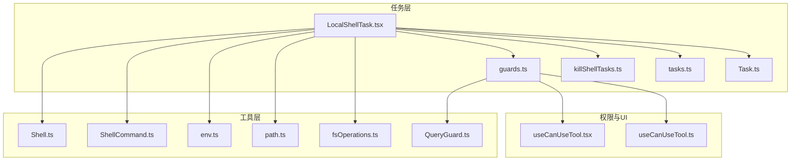
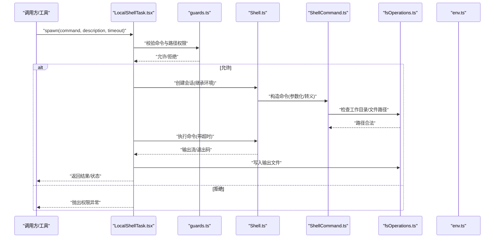
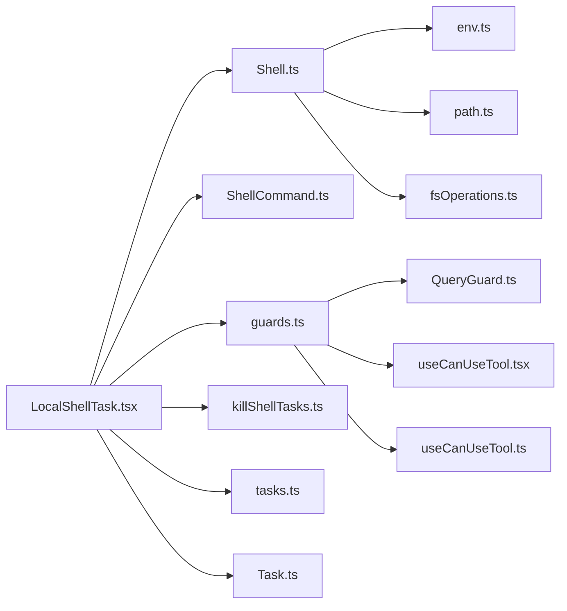

# Shell 任务

<cite>
**本文引用的文件**
- [src/tasks/LocalShellTask/LocalShellTask.tsx](file://src/tasks/LocalShellTask/LocalShellTask.tsx)
- [src/tasks/LocalShellTask/guards.ts](file://src/tasks/LocalShellTask/guards.ts)
- [src/tasks/LocalShellTask/killShellTasks.ts](file://src/tasks/LocalShellTask/killShellTasks.ts)
- [src/tasks.ts](file://src/tasks.ts)
- [src/Task.ts](file://src/Task.ts)
- [src/utils/timeouts.ts](file://src/utils/timeouts.ts)
- [src/utils/shell/Shell.ts](file://src/utils/shell/Shell.ts)
- [src/utils/shell/ShellCommand.ts](file://src/utils/shell/ShellCommand.ts)
- [src/utils/processUserInput/processUserInput.ts](file://src/utils/processUserInput/processUserInput.ts)
- [src/utils/env.ts](file://src/utils/env.ts)
- [src/utils/path.ts](file://src/utils/path.ts)
- [src/utils/fsOperations.ts](file://src/utils/fsOperations.ts)
- [src/utils/permissions/QueryGuard.ts](file://src/utils/permissions/QueryGuard.ts)
- [src/components/permissions/useCanUseTool.tsx](file://src/components/permissions/useCanUseTool.tsx)
- [src/hooks/toolPermission/useCanUseTool.ts](file://src/hooks/toolPermission/useCanUseTool.ts)
- [src/services/analytics/internalLogging.ts](file://src/services/analytics/internalLogging.ts)
- [src/utils/debug.ts](file://src/utils/debug.ts)
- [src/cli/print.ts](file://src/cli/print.ts)
- [src/setup.ts](file://src/setup.ts)
</cite>

## 目录
1. [简介](#简介)
2. [项目结构](#项目结构)
3. [核心组件](#核心组件)
4. [架构总览](#架构总览)
5. [详细组件分析](#详细组件分析)
6. [依赖关系分析](#依赖关系分析)
7. [性能考虑](#性能考虑)
8. [故障排查指南](#故障排查指南)
9. [结论](#结论)
10. [附录](#附录)

## 简介
本文件为 Shell 任务的综合技术文档，聚焦 LocalShellTask 的架构设计与实现原理，涵盖本地 Shell 会话管理、命令执行与输出处理机制；深入解析安全控制（命令白名单、路径限制、权限验证）；阐述生命周期管理（进程创建、监控与清理）；并提供可直接定位到源码的示例路径，帮助读者快速理解与使用。同时说明 Shell 任务与文件系统、环境变量、进程管理的集成方式，并给出错误处理、超时控制与资源清理的最佳实践。

## 项目结构
LocalShellTask 所在模块位于 tasks/LocalShellTask，主要由以下文件组成：
- LocalShellTask.tsx：任务定义与执行入口
- guards.ts：安全守卫与权限校验
- killShellTasks.ts：批量终止 Shell 任务

此外，任务注册与类型定义位于：
- tasks.ts：任务集合与按类型获取
- Task.ts：任务类型、任务 ID 生成与状态基座

图表来源
- [src/tasks/LocalShellTask/LocalShellTask.tsx](file://src/tasks/LocalShellTask/LocalShellTask.tsx)
- [src/tasks/LocalShellTask/guards.ts](file://src/tasks/LocalShellTask/guards.ts)
- [src/tasks/LocalShellTask/killShellTasks.ts](file://src/tasks/LocalShellTask/killShellTasks.ts)
- [src/tasks.ts](file://src/tasks.ts)
- [src/Task.ts](file://src/Task.ts)
- [src/utils/shell/Shell.ts](file://src/utils/shell/Shell.ts)
- [src/utils/shell/ShellCommand.ts](file://src/utils/shell/ShellCommand.ts)
- [src/utils/env.ts](file://src/utils/env.ts)
- [src/utils/path.ts](file://src/utils/path.ts)
- [src/utils/fsOperations.ts](file://src/utils/fsOperations.ts)
- [src/utils/permissions/QueryGuard.ts](file://src/utils/permissions/QueryGuard.ts)
- [src/components/permissions/useCanUseTool.tsx](file://src/components/permissions/useCanUseTool.tsx)
- [src/hooks/toolPermission/useCanUseTool.ts](file://src/hooks/toolPermission/useCanUseTool.ts)

章节来源
- [src/tasks.ts:1-39](file://src/tasks.ts#L1-L39)
- [src/Task.ts:59-125](file://src/Task.ts#L59-L125)

## 核心组件
- 任务类型与输入
  - LocalShellSpawnInput：包含命令字符串、描述、可选超时、工具使用标识、代理标识以及 UI 展示变体（bash/monitor）
  - 任务 ID 生成：基于前缀与随机字符，确保兼容性与抗枚举能力
  - 任务状态基座：统一记录任务状态、开始时间、输出文件路径与偏移等

- 任务注册与发现
  - getAllTasks 返回包含 LocalShellTask 在内的任务集合
  - getTaskByType 按类型获取任务实例

- 超时策略
  - 默认与最大超时通过环境变量可配置，保障长耗时命令的可控性

章节来源
- [src/Task.ts:59-125](file://src/Task.ts#L59-L125)
- [src/tasks.ts:17-39](file://src/tasks.ts#L17-L39)
- [src/utils/timeouts.ts:1-39](file://src/utils/timeouts.ts#L1-L39)

## 架构总览
LocalShellTask 的执行流程从“任务注册”到“安全校验”，再到“Shell 会话与命令执行”，最后“输出写入与清理”。下图展示了关键组件之间的交互：

图表来源
- [src/tasks/LocalShellTask/LocalShellTask.tsx](file://src/tasks/LocalShellTask/LocalShellTask.tsx)
- [src/tasks/LocalShellTask/guards.ts](file://src/tasks/LocalShellTask/guards.ts)
- [src/utils/shell/Shell.ts](file://src/utils/shell/Shell.ts)
- [src/utils/shell/ShellCommand.ts](file://src/utils/shell/ShellCommand.ts)
- [src/utils/fsOperations.ts](file://src/utils/fsOperations.ts)
- [src/utils/env.ts](file://src/utils/env.ts)

## 详细组件分析

### LocalShellTask.tsx：任务定义与执行
- 任务职责
  - 接收 LocalShellSpawnInput，生成任务 ID，初始化任务状态
  - 调用安全守卫进行命令与路径校验
  - 创建 Shell 会话并执行命令，处理输出流与退出码
  - 将输出写入任务专属输出文件，维护输出偏移
  - 提供 kill 方法以终止任务进程

- 关键流程
  - 输入校验：命令非空、描述必填、kind 合法
  - 会话创建：继承当前进程环境变量，设置工作目录
  - 命令执行：支持超时控制与中断信号
  - 输出处理：分块写入文件，记录偏移，避免重复读取
  - 清理回收：关闭句柄、释放资源、更新状态

- 示例路径
  - 任务定义与 spawn/kill 实现：[src/tasks/LocalShellTask/LocalShellTask.tsx](file://src/tasks/LocalShellTask/LocalShellTask.tsx)
  - 任务注册与类型映射：[src/tasks.ts:17-39](file://src/tasks.ts#L17-L39)
  - 任务 ID 生成与状态基座：[src/Task.ts:59-125](file://src/Task.ts#L59-L125)

章节来源
- [src/tasks/LocalShellTask/LocalShellTask.tsx](file://src/tasks/LocalShellTask/LocalShellTask.tsx)
- [src/tasks.ts:17-39](file://src/tasks.ts#L17-L39)
- [src/Task.ts:59-125](file://src/Task.ts#L59-L125)

### guards.ts：安全控制与权限验证
- 命令白名单
  - 基于 QueryGuard 对命令进行静态分析与规则匹配
  - 支持对危险命令或高风险模式进行拦截

- 路径限制
  - 结合 path 工具与 fsOperations，限制工作目录与文件访问范围
  - 防止越权访问与路径穿越

- 权限验证
  - 与 useCanUseTool 组件与 Hook 协作，确保调用方具备相应工具权限
  - 在 CLI 或桌面端入口处进行权限上下文初始化与校验

- 示例路径
  - 安全守卫实现与规则匹配：[src/tasks/LocalShellTask/guards.ts](file://src/tasks/LocalShellTask/guards.ts)
  - 查询守卫核心逻辑：[src/utils/permissions/QueryGuard.ts](file://src/utils/permissions/QueryGuard.ts)
  - UI 权限钩子：[src/components/permissions/useCanUseTool.tsx](file://src/components/permissions/useCanUseTool.tsx)
  - Hook 权限钩子：[src/hooks/toolPermission/useCanUseTool.ts](file://src/hooks/toolPermission/useCanUseTool.ts)
  - 环境与路径工具：[src/utils/env.ts](file://src/utils/env.ts)，[src/utils/path.ts](file://src/utils/path.ts)
  - 文件系统操作：[src/utils/fsOperations.ts](file://src/utils/fsOperations.ts)

章节来源
- [src/tasks/LocalShellTask/guards.ts](file://src/tasks/LocalShellTask/guards.ts)
- [src/utils/permissions/QueryGuard.ts](file://src/utils/permissions/QueryGuard.ts)
- [src/components/permissions/useCanUseTool.tsx](file://src/components/permissions/useCanUseTool.tsx)
- [src/hooks/toolPermission/useCanUseTool.ts](file://src/hooks/toolPermission/useCanUseTool.ts)
- [src/utils/env.ts](file://src/utils/env.ts)
- [src/utils/path.ts](file://src/utils/path.ts)
- [src/utils/fsOperations.ts](file://src/utils/fsOperations.ts)

### killShellTasks.ts：生命周期管理与清理
- 批量终止
  - 提供按条件筛选并终止 Shell 任务的能力
  - 与任务状态协同，确保终止后资源被回收

- 进程监控
  - 通过进程 ID 与信号机制实现优雅终止
  - 避免僵尸进程与资源泄漏

- 示例路径
  - 终止任务实现：[src/tasks/LocalShellTask/killShellTasks.ts](file://src/tasks/LocalShellTask/killShellTasks.ts)

章节来源
- [src/tasks/LocalShellTask/killShellTasks.ts](file://src/tasks/LocalShellTask/killShellTasks.ts)

### Shell 与 ShellCommand：会话与命令执行
- Shell.ts
  - 封装底层进程执行，负责环境变量继承、工作目录设置、标准输入输出管道
  - 提供超时控制与中断信号处理

- ShellCommand.ts
  - 参数化与转义处理，防止注入与意外扩展
  - 支持多平台命令格式差异

- 示例路径
  - Shell 会话封装：[src/utils/shell/Shell.ts](file://src/utils/shell/Shell.ts)
  - Shell 命令封装：[src/utils/shell/ShellCommand.ts](file://src/utils/shell/ShellCommand.ts)

章节来源
- [src/utils/shell/Shell.ts](file://src/utils/shell/Shell.ts)
- [src/utils/shell/ShellCommand.ts](file://src/utils/shell/ShellCommand.ts)

### 超时控制与资源清理
- 超时策略
  - 默认与最大超时可通过环境变量配置，避免长时间阻塞
  - 超时触发后主动中断进程，确保资源及时释放

- 资源清理
  - 输出文件写入完成后关闭句柄
  - 任务结束后更新状态并清理临时资源

- 示例路径
  - 超时常量与解析：[src/utils/timeouts.ts:1-39](file://src/utils/timeouts.ts#L1-L39)

章节来源
- [src/utils/timeouts.ts:1-39](file://src/utils/timeouts.ts#L1-L39)

### 与文件系统、环境变量、进程管理的集成
- 文件系统
  - 使用 fsOperations 进行安全的文件与目录操作
  - 输出文件采用任务专属路径，避免冲突

- 环境变量
  - Shell 会话继承当前进程环境，保证命令运行一致性
  - 可通过 env 工具进行动态环境检测与适配

- 进程管理
  - 通过进程 ID 与信号实现监控与终止
  - 与 CLI/桌面端的沙箱与权限系统协同

- 示例路径
  - 文件系统操作：[src/utils/fsOperations.ts](file://src/utils/fsOperations.ts)
  - 环境工具：[src/utils/env.ts](file://src/utils/env.ts)
  - CLI 沙箱初始化：[src/cli/print.ts:598-626](file://src/cli/print.ts#L598-L626)
  - 启动时权限检查：[src/setup.ts:416-446](file://src/setup.ts#L416-L446)

章节来源
- [src/utils/fsOperations.ts](file://src/utils/fsOperations.ts)
- [src/utils/env.ts](file://src/utils/env.ts)
- [src/cli/print.ts:598-626](file://src/cli/print.ts#L598-L626)
- [src/setup.ts:416-446](file://src/setup.ts#L416-L446)

## 依赖关系分析
LocalShellTask 的依赖关系如下所示：

图表来源
- [src/tasks/LocalShellTask/LocalShellTask.tsx](file://src/tasks/LocalShellTask/LocalShellTask.tsx)
- [src/tasks/LocalShellTask/guards.ts](file://src/tasks/LocalShellTask/guards.ts)
- [src/tasks/LocalShellTask/killShellTasks.ts](file://src/tasks/LocalShellTask/killShellTasks.ts)
- [src/tasks.ts](file://src/tasks.ts)
- [src/Task.ts](file://src/Task.ts)
- [src/utils/shell/Shell.ts](file://src/utils/shell/Shell.ts)
- [src/utils/shell/ShellCommand.ts](file://src/utils/shell/ShellCommand.ts)
- [src/utils/permissions/QueryGuard.ts](file://src/utils/permissions/QueryGuard.ts)
- [src/components/permissions/useCanUseTool.tsx](file://src/components/permissions/useCanUseTool.tsx)
- [src/hooks/toolPermission/useCanUseTool.ts](file://src/hooks/toolPermission/useCanUseTool.ts)
- [src/utils/env.ts](file://src/utils/env.ts)
- [src/utils/path.ts](file://src/utils/path.ts)
- [src/utils/fsOperations.ts](file://src/utils/fsOperations.ts)

章节来源
- [src/tasks/LocalShellTask/LocalShellTask.tsx](file://src/tasks/LocalShellTask/LocalShellTask.tsx)
- [src/tasks/LocalShellTask/guards.ts](file://src/tasks/LocalShellTask/guards.ts)
- [src/tasks/LocalShellTask/killShellTasks.ts](file://src/tasks/LocalShellTask/killShellTasks.ts)
- [src/tasks.ts:1-39](file://src/tasks.ts#L1-L39)
- [src/Task.ts:59-125](file://src/Task.ts#L59-L125)

## 性能考虑
- 超时控制
  - 合理设置默认与最大超时，避免长时间阻塞影响用户体验
  - 对高风险命令建议缩短超时阈值

- 输出写入
  - 分块写入与偏移记录减少内存占用，提升大输出场景下的稳定性

- 并发与资源
  - 批量终止与清理应避免阻塞主线程，必要时异步执行

- 环境与路径
  - 预先解析与缓存常用路径与环境变量，降低每次执行开销

## 故障排查指南
- 权限相关
  - 若出现权限不足，请检查工具权限上下文与守卫规则
  - 参考：[src/tasks/LocalShellTask/guards.ts](file://src/tasks/LocalShellTask/guards.ts)，[src/components/permissions/useCanUseTool.tsx](file://src/components/permissions/useCanUseTool.tsx)，[src/hooks/toolPermission/useCanUseTool.ts](file://src/hooks/toolPermission/useCanUseTool.ts)

- 超时与中断
  - 超时后命令会被中断，确认环境变量配置是否合理
  - 参考：[src/utils/timeouts.ts:1-39](file://src/utils/timeouts.ts#L1-L39)

- 输出异常
  - 检查输出文件路径与权限，确认写入流程是否完成
  - 参考：[src/utils/fsOperations.ts](file://src/utils/fsOperations.ts)

- 沙箱与网络
  - CLI 启动时若沙箱不可用，需根据提示调整配置
  - 参考：[src/cli/print.ts:598-626](file://src/cli/print.ts#L598-L626)

- 调试日志
  - 使用调试工具与内部日志服务辅助定位问题
  - 参考：[src/utils/debug.ts](file://src/utils/debug.ts)，[src/services/analytics/internalLogging.ts](file://src/services/analytics/internalLogging.ts)

章节来源
- [src/tasks/LocalShellTask/guards.ts](file://src/tasks/LocalShellTask/guards.ts)
- [src/components/permissions/useCanUseTool.tsx](file://src/components/permissions/useCanUseTool.tsx)
- [src/hooks/toolPermission/useCanUseTool.ts](file://src/hooks/toolPermission/useCanUseTool.ts)
- [src/utils/timeouts.ts:1-39](file://src/utils/timeouts.ts#L1-L39)
- [src/utils/fsOperations.ts](file://src/utils/fsOperations.ts)
- [src/cli/print.ts:598-626](file://src/cli/print.ts#L598-L626)
- [src/utils/debug.ts](file://src/utils/debug.ts)
- [src/services/analytics/internalLogging.ts](file://src/services/analytics/internalLogging.ts)

## 结论
LocalShellTask 通过清晰的任务抽象、严格的权限守卫与稳健的 Shell 会话管理，实现了安全、可控且可观察的本地命令执行能力。结合超时控制与资源清理机制，能够在复杂环境中保持稳定与高效。建议在生产中配合沙箱与权限策略，确保命令执行符合组织安全基线。

## 附录
- 任务创建与使用示例（路径）
  - 任务定义与 spawn/kill：[src/tasks/LocalShellTask/LocalShellTask.tsx](file://src/tasks/LocalShellTask/LocalShellTask.tsx)
  - 任务注册与类型获取：[src/tasks.ts:17-39](file://src/tasks.ts#L17-L39)
  - 任务 ID 生成与状态基座：[src/Task.ts:59-125](file://src/Task.ts#L59-L125)
- 安全与权限
  - 命令白名单与路径限制：[src/tasks/LocalShellTask/guards.ts](file://src/tasks/LocalShellTask/guards.ts)
  - 查询守卫：[src/utils/permissions/QueryGuard.ts](file://src/utils/permissions/QueryGuard.ts)
  - 权限钩子（UI/Hook）：[src/components/permissions/useCanUseTool.tsx](file://src/components/permissions/useCanUseTool.tsx)，[src/hooks/toolPermission/useCanUseTool.ts](file://src/hooks/toolPermission/useCanUseTool.ts)
- 执行与输出
  - Shell 会话与命令封装：[src/utils/shell/Shell.ts](file://src/utils/shell/Shell.ts)，[src/utils/shell/ShellCommand.ts](file://src/utils/shell/ShellCommand.ts)
  - 文件系统与环境：[src/utils/fsOperations.ts](file://src/utils/fsOperations.ts)，[src/utils/env.ts](file://src/utils/env.ts)
- 生命周期与清理
  - 批量终止：[src/tasks/LocalShellTask/killShellTasks.ts](file://src/tasks/LocalShellTask/killShellTasks.ts)
- 超时与沙箱
  - 超时配置：[src/utils/timeouts.ts:1-39](file://src/utils/timeouts.ts#L1-L39)
  - CLI 沙箱初始化：[src/cli/print.ts:598-626](file://src/cli/print.ts#L598-L626)
  - 启动时权限检查：[src/setup.ts:416-446](file://src/setup.ts#L416-L446)