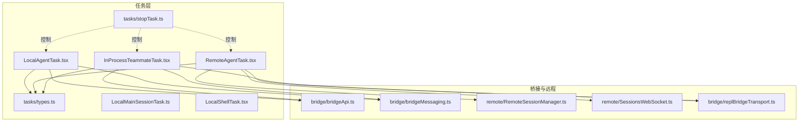
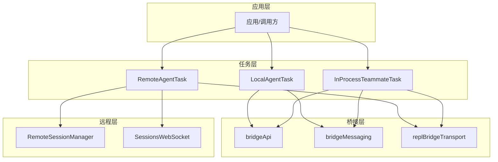
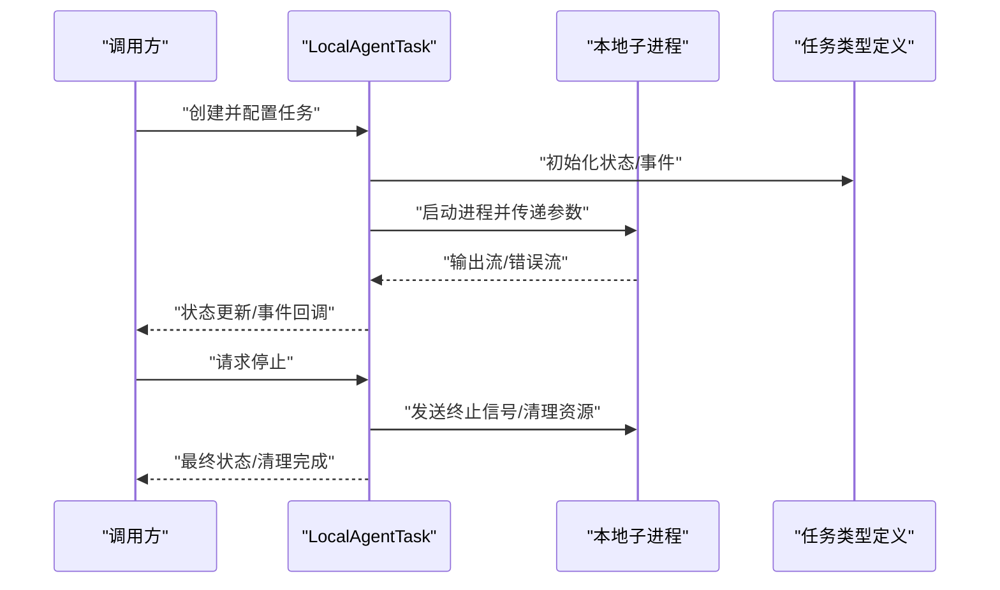
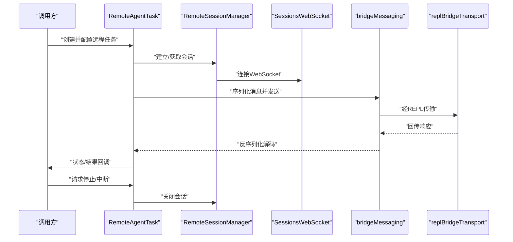
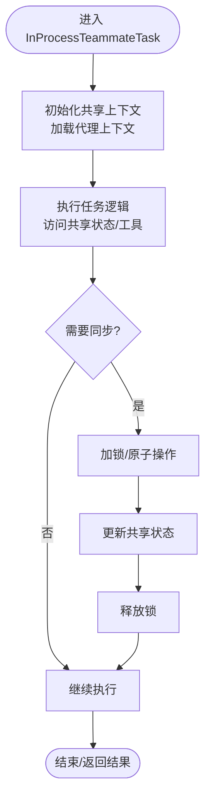
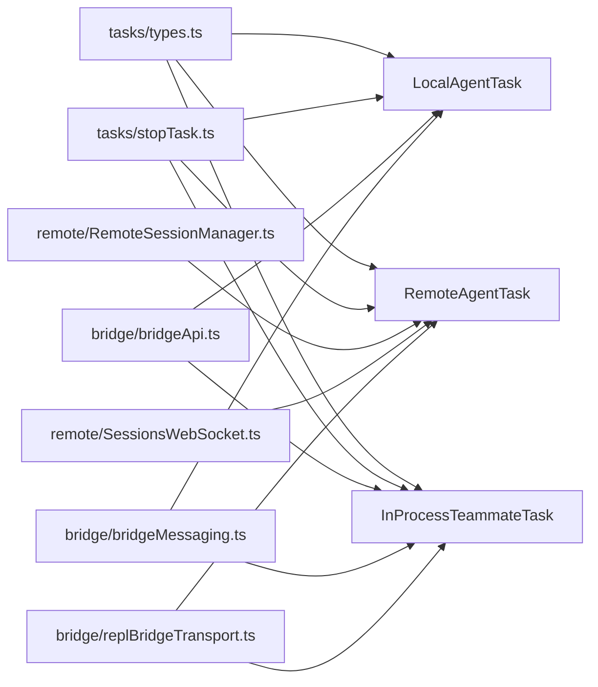

# 代理任务

<cite>
**本文引用的文件**
- [LocalAgentTask.tsx](file://src/tasks/LocalAgentTask/LocalAgentTask.tsx)
- [RemoteAgentTask.tsx](file://src/tasks/RemoteAgentTask/RemoteAgentTask.tsx)
- [InProcessTeammateTask.tsx](file://src/tasks/InProcessTeammateTask/InProcessTeammateTask.tsx)
- [types.ts](file://src/tasks/types.ts)
- [stopTask.ts](file://src/tasks/stopTask.ts)
- [LocalMainSessionTask.ts](file://src/tasks/LocalMainSessionTask.ts)
- [LocalShellTask.tsx](file://src/tasks/LocalShellTask/LocalShellTask.tsx)
- [RemoteSessionManager.ts](file://src/remote/RemoteSessionManager.ts)
- [SessionsWebSocket.ts](file://src/remote/SessionsWebSocket.ts)
- [bridgeApi.ts](file://src/bridge/bridgeApi.ts)
- [bridgeMessaging.ts](file://src/bridge/bridgeMessaging.ts)
- [replBridge.ts](file://src/bridge/replBridge.ts)
- [replBridgeTransport.ts](file://src/bridge/replBridgeTransport.ts)
- [agentContext.ts](file://src/utils/agentContext.ts)
- [inProcessTeammateHelpers.ts](file://src/utils/inProcessTeammateHelpers.ts)
- [task.ts](file://src/Task.ts)
- [tools.ts](file://src/tools.ts)
</cite>

## 目录
1. [简介](#简介)
2. [项目结构](#项目结构)
3. [核心组件](#核心组件)
4. [架构总览](#架构总览)
5. [详细组件分析](#详细组件分析)
6. [依赖关系分析](#依赖关系分析)
7. [性能考量](#性能考量)
8. [故障排查指南](#故障排查指南)
9. [结论](#结论)
10. [附录](#附录)

## 简介
本文件系统性阐述代理任务的设计与实现，重点对比 LocalAgentTask（本地代理任务）、RemoteAgentTask（远程代理任务）与 InProcessTeammateTask（进程内代理任务）。内容涵盖三类任务的职责边界、运行机制、状态同步与通信协议、内存与线程安全、协作模式、性能优化、错误恢复与监控诊断等，并通过图示与路径引用帮助读者快速定位源码位置。

## 项目结构
代理任务相关代码集中于 src/tasks 目录，围绕三类任务展开：
- LocalAgentTask：封装本地子进程执行、状态同步与生命周期管理
- RemoteAgentTask：封装远程会话桥接、消息路由与网络传输
- InProcessTeammateTask：封装进程内团队成员执行、共享内存与线程安全

此外，还包含通用类型定义、停止控制、主会话任务以及与桥接层、远程会话管理器的集成模块。

**图表来源**
- [LocalAgentTask.tsx:1-200](file://src/tasks/LocalAgentTask/LocalAgentTask.tsx#L1-L200)
- [RemoteAgentTask.tsx:1-200](file://src/tasks/RemoteAgentTask/RemoteAgentTask.tsx#L1-L200)
- [InProcessTeammateTask.tsx:1-200](file://src/tasks/InProcessTeammateTask/InProcessTeammateTask.tsx#L1-L200)
- [types.ts:1-200](file://src/tasks/types.ts#L1-L200)
- [stopTask.ts:1-200](file://src/tasks/stopTask.ts#L1-L200)
- [bridgeApi.ts:1-200](file://src/bridge/bridgeApi.ts#L1-L200)
- [bridgeMessaging.ts:1-200](file://src/bridge/bridgeMessaging.ts#L1-L200)
- [RemoteSessionManager.ts:1-200](file://src/remote/RemoteSessionManager.ts#L1-L200)
- [SessionsWebSocket.ts:1-200](file://src/remote/SessionsWebSocket.ts#L1-L200)
- [replBridgeTransport.ts:1-200](file://src/bridge/replBridgeTransport.ts#L1-L200)

**章节来源**
- [LocalAgentTask.tsx:1-200](file://src/tasks/LocalAgentTask/LocalAgentTask.tsx#L1-L200)
- [RemoteAgentTask.tsx:1-200](file://src/tasks/RemoteAgentTask/RemoteAgentTask.tsx#L1-L200)
- [InProcessTeammateTask.tsx:1-200](file://src/tasks/InProcessTeammateTask/InProcessTeammateTask.tsx#L1-L200)
- [types.ts:1-200](file://src/tasks/types.ts#L1-L200)

## 核心组件
- LocalAgentTask：负责在本地子进程中启动与管理代理任务，维护任务状态、输出流与生命周期，支持中断与清理。
- RemoteAgentTask：负责通过远程会话桥接与远端代理通信，处理消息序列化、会话建立与断开、网络传输与重连。
- InProcessTeammateTask：负责在同一进程内的团队成员间协作，强调共享内存与线程安全，避免跨进程/网络开销。

关键类型与接口由 tasks/types.ts 定义，统一了任务状态、事件与配置项；stopTask 提供统一的任务停止控制入口。

**章节来源**
- [types.ts:1-200](file://src/tasks/types.ts#L1-L200)
- [stopTask.ts:1-200](file://src/tasks/stopTask.ts#L1-L200)

## 架构总览
下图展示了三类代理任务与桥接层、远程会话管理器及 REPL 传输层的交互关系：

**图表来源**
- [LocalAgentTask.tsx:1-200](file://src/tasks/LocalAgentTask/LocalAgentTask.tsx#L1-L200)
- [RemoteAgentTask.tsx:1-200](file://src/tasks/RemoteAgentTask/RemoteAgentTask.tsx#L1-L200)
- [InProcessTeammateTask.tsx:1-200](file://src/tasks/InProcessTeammateTask/InProcessTeammateTask.tsx#L1-L200)
- [bridgeApi.ts:1-200](file://src/bridge/bridgeApi.ts#L1-L200)
- [bridgeMessaging.ts:1-200](file://src/bridge/bridgeMessaging.ts#L1-L200)
- [replBridgeTransport.ts:1-200](file://src/bridge/replBridgeTransport.ts#L1-L200)
- [RemoteSessionManager.ts:1-200](file://src/remote/RemoteSessionManager.ts#L1-L200)
- [SessionsWebSocket.ts:1-200](file://src/remote/SessionsWebSocket.ts#L1-L200)

## 详细组件分析

### LocalAgentTask 分析
- 设计要点
  - 进程管理：以子进程方式启动代理，捕获标准输入输出与错误流，进行实时状态上报与日志透传。
  - 状态同步：通过统一的状态枚举与事件回调，向外部暴露任务进度、结果与异常。
  - 生命周期：支持启动、运行中、成功、失败、已停止等状态转换；提供中断与清理流程。
- 关键实现路径
  - 任务状态与事件定义：[types.ts:1-200](file://src/tasks/types.ts#L1-L200)
  - 停止控制入口：[stopTask.ts:1-200](file://src/tasks/stopTask.ts#L1-L200)
  - 本地任务主入口与流程：[LocalAgentTask.tsx:1-200](file://src/tasks/LocalAgentTask/LocalAgentTask.tsx#L1-L200)
  - 主会话任务（可作为本地任务的特化）：[LocalMainSessionTask.ts:1-200](file://src/tasks/LocalMainSessionTask.ts#L1-L200)
  - 本地 Shell 任务（参考实现）：[LocalShellTask.tsx:1-200](file://src/tasks/LocalShellTask/LocalShellTask.tsx#L1-L200)

**图表来源**
- [LocalAgentTask.tsx:1-200](file://src/tasks/LocalAgentTask/LocalAgentTask.tsx#L1-L200)
- [types.ts:1-200](file://src/tasks/types.ts#L1-L200)
- [stopTask.ts:1-200](file://src/tasks/stopTask.ts#L1-L200)

**章节来源**
- [LocalAgentTask.tsx:1-200](file://src/tasks/LocalAgentTask/LocalAgentTask.tsx#L1-L200)
- [types.ts:1-200](file://src/tasks/types.ts#L1-L200)
- [stopTask.ts:1-200](file://src/tasks/stopTask.ts#L1-L200)
- [LocalMainSessionTask.ts:1-200](file://src/tasks/LocalMainSessionTask.ts#L1-L200)
- [LocalShellTask.tsx:1-200](file://src/tasks/LocalShellTask/LocalShellTask.tsx#L1-L200)

### RemoteAgentTask 分析
- 设计要点
  - 会话管理：通过 RemoteSessionManager 维护会话生命周期，SessionsWebSocket 负责底层网络传输。
  - 消息协议：基于桥接层的消息编解码与路由，REPL 传输层提供可靠的数据通道。
  - 错误恢复：断线重连、消息重发与幂等处理，保证任务在不稳定网络下的连续性。
- 关键实现路径
  - 远程任务主入口与流程：[RemoteAgentTask.tsx:1-200](file://src/tasks/RemoteAgentTask/RemoteAgentTask.tsx#L1-L200)
  - 会话管理器：[RemoteSessionManager.ts:1-200](file://src/remote/RemoteSessionManager.ts#L1-L200)
  - WebSocket 会话：[SessionsWebSocket.ts:1-200](file://src/remote/SessionsWebSocket.ts#L1-L200)
  - 桥接 API：[bridgeApi.ts:1-200](file://src/bridge/bridgeApi.ts#L1-L200)
  - 桥接消息：[bridgeMessaging.ts:1-200](file://src/bridge/bridgeMessaging.ts#L1-L200)
  - REPL 传输：[replBridgeTransport.ts:1-200](file://src/bridge/replBridgeTransport.ts#L1-L200)

**图表来源**
- [RemoteAgentTask.tsx:1-200](file://src/tasks/RemoteAgentTask/RemoteAgentTask.tsx#L1-L200)
- [RemoteSessionManager.ts:1-200](file://src/remote/RemoteSessionManager.ts#L1-L200)
- [SessionsWebSocket.ts:1-200](file://src/remote/SessionsWebSocket.ts#L1-L200)
- [bridgeMessaging.ts:1-200](file://src/bridge/bridgeMessaging.ts#L1-L200)
- [replBridgeTransport.ts:1-200](file://src/bridge/replBridgeTransport.ts#L1-L200)

**章节来源**
- [RemoteAgentTask.tsx:1-200](file://src/tasks/RemoteAgentTask/RemoteAgentTask.tsx#L1-L200)
- [RemoteSessionManager.ts:1-200](file://src/remote/RemoteSessionManager.ts#L1-L200)
- [SessionsWebSocket.ts:1-200](file://src/remote/SessionsWebSocket.ts#L1-L200)
- [bridgeApi.ts:1-200](file://src/bridge/bridgeApi.ts#L1-L200)
- [bridgeMessaging.ts:1-200](file://src/bridge/bridgeMessaging.ts#L1-L200)
- [replBridgeTransport.ts:1-200](file://src/bridge/replBridgeTransport.ts#L1-L200)

### InProcessTeammateTask 分析
- 设计要点
  - 内存与线程安全：在同一进程内共享状态，避免跨进程/网络通信开销；通过并发安全的共享结构与锁策略保障一致性。
  - 协作模式：与桥接层协同工作，复用消息编解码与传输能力，同时减少延迟。
- 关键实现路径
  - 进程内任务主入口与流程：[InProcessTeammateTask.tsx:1-200](file://src/tasks/InProcessTeammateTask/InProcessTeammateTask.tsx#L1-L200)
  - 进程内助手工具：[inProcessTeammateHelpers.ts:1-200](file://src/utils/inProcessTeammateHelpers.ts#L1-L200)
  - 代理上下文：[agentContext.ts:1-200](file://src/utils/agentContext.ts#L1-L200)
  - 任务基类与工具：[task.ts:1-200](file://src/Task.ts#L1-L200), [tools.ts:1-200](file://src/tools.ts#L1-L200)

**图表来源**
- [InProcessTeammateTask.tsx:1-200](file://src/tasks/InProcessTeammateTask/InProcessTeammateTask.tsx#L1-L200)
- [inProcessTeammateHelpers.ts:1-200](file://src/utils/inProcessTeammateHelpers.ts#L1-L200)
- [agentContext.ts:1-200](file://src/utils/agentContext.ts#L1-L200)
- [task.ts:1-200](file://src/Task.ts#L1-L200)
- [tools.ts:1-200](file://src/tools.ts#L1-L200)

**章节来源**
- [InProcessTeammateTask.tsx:1-200](file://src/tasks/InProcessTeammateTask/InProcessTeammateTask.tsx#L1-L200)
- [inProcessTeammateHelpers.ts:1-200](file://src/utils/inProcessTeammateHelpers.ts#L1-L200)
- [agentContext.ts:1-200](file://src/utils/agentContext.ts#L1-L200)
- [task.ts:1-200](file://src/Task.ts#L1-L200)
- [tools.ts:1-200](file://src/tools.ts#L1-L200)

### 三者设计差异与适用场景
- LocalAgentTask
  - 场景：需要隔离环境、独立生命周期与资源配额的任务；对安全性与稳定性要求高。
  - 特点：子进程隔离、状态同步通过回调/事件；适合长耗时或易崩溃任务。
- RemoteAgentTask
  - 场景：分布式协作、跨设备/跨网络的任务；需要与远端代理保持一致状态。
  - 特点：会话管理、消息编解码、网络传输与重连；适合需要远程协作与共享状态的任务。
- InProcessTeammateTask
  - 场景：同进程内的团队成员协作，低延迟与高吞吐需求。
  - 特点：共享内存与线程安全；适合高频交互与轻量任务。

**章节来源**
- [LocalAgentTask.tsx:1-200](file://src/tasks/LocalAgentTask/LocalAgentTask.tsx#L1-L200)
- [RemoteAgentTask.tsx:1-200](file://src/tasks/RemoteAgentTask/RemoteAgentTask.tsx#L1-L200)
- [InProcessTeammateTask.tsx:1-200](file://src/tasks/InProcessTeammateTask/InProcessTeammateTask.tsx#L1-L200)

## 依赖关系分析
- 任务类型与通用工具
  - 所有任务均依赖 tasks/types.ts 中的统一类型与事件模型，确保状态与行为的一致性。
  - stopTask 提供统一的停止控制，避免各任务重复实现中断逻辑。
- 桥接与远程通信
  - LocalAgentTask 与 InProcessTeammateTask 共享桥接层能力，通过 bridgeApi 与 bridgeMessaging 实现消息编解码与路由。
  - RemoteAgentTask 依赖 RemoteSessionManager 与 SessionsWebSocket 建立与维持网络会话，并通过 replBridgeTransport 进行可靠传输。
- 工具与上下文
  - agentContext 提供代理上下文信息；inProcessTeammateHelpers 提供进程内协作辅助；task 与 tools 提供基础能力与工具集。

**图表来源**
- [types.ts:1-200](file://src/tasks/types.ts#L1-L200)
- [stopTask.ts:1-200](file://src/tasks/stopTask.ts#L1-L200)
- [bridgeApi.ts:1-200](file://src/bridge/bridgeApi.ts#L1-L200)
- [bridgeMessaging.ts:1-200](file://src/bridge/bridgeMessaging.ts#L1-L200)
- [RemoteSessionManager.ts:1-200](file://src/remote/RemoteSessionManager.ts#L1-L200)
- [SessionsWebSocket.ts:1-200](file://src/remote/SessionsWebSocket.ts#L1-L200)
- [replBridgeTransport.ts:1-200](file://src/bridge/replBridgeTransport.ts#L1-L200)

**章节来源**
- [types.ts:1-200](file://src/tasks/types.ts#L1-L200)
- [stopTask.ts:1-200](file://src/tasks/stopTask.ts#L1-L200)
- [bridgeApi.ts:1-200](file://src/bridge/bridgeApi.ts#L1-L200)
- [bridgeMessaging.ts:1-200](file://src/bridge/bridgeMessaging.ts#L1-L200)
- [RemoteSessionManager.ts:1-200](file://src/remote/RemoteSessionManager.ts#L1-L200)
- [SessionsWebSocket.ts:1-200](file://src/remote/SessionsWebSocket.ts#L1-L200)
- [replBridgeTransport.ts:1-200](file://src/bridge/replBridgeTransport.ts#L1-L200)

## 性能考量
- 本地任务
  - 子进程启动成本与资源占用需评估；建议批量启动与复用进程，避免频繁创建销毁。
  - 输出流异步处理，避免阻塞主线程；合理设置缓冲与刷新策略。
- 远程任务
  - 会话保活与心跳策略，降低断线概率；消息批量化与压缩提升带宽利用率。
  - 传输层采用可靠协议，结合指数退避与重试策略，平衡可靠性与延迟。
- 进程内任务
  - 共享状态访问应尽量减少锁粒度与持有时间；采用无锁队列或原子操作优化吞吐。
  - 避免长时间阻塞操作，必要时拆分为多个短任务并行执行。

[本节为通用性能建议，不直接分析具体文件]

## 故障排查指南
- 本地任务
  - 检查子进程退出码与错误输出；确认资源限制与权限配置；使用 stopTask 触发强制停止与清理。
- 远程任务
  - 关注会话建立与断线日志；验证 WebSocket 连接状态与消息往返；检查桥接层编解码是否正确。
- 进程内任务
  - 排查共享状态竞争条件与死锁；核对线程安全实现；记录关键临界区耗时。

**章节来源**
- [stopTask.ts:1-200](file://src/tasks/stopTask.ts#L1-L200)
- [LocalAgentTask.tsx:1-200](file://src/tasks/LocalAgentTask/LocalAgentTask.tsx#L1-L200)
- [RemoteAgentTask.tsx:1-200](file://src/tasks/RemoteAgentTask/RemoteAgentTask.tsx#L1-L200)
- [InProcessTeammateTask.tsx:1-200](file://src/tasks/InProcessTeammateTask/InProcessTeammateTask.tsx#L1-L200)

## 结论
LocalAgentTask、RemoteAgentTask 与 InProcessTeammateTask 分别面向本地隔离、远程协作与进程内高效执行三种典型场景。通过统一的任务类型模型与桥接/远程通信栈，三者在职责清晰的前提下实现了可插拔的协作模式。实践中应根据任务特性选择合适类型，并结合性能优化与故障排查最佳实践，确保系统的稳定性与可维护性。

## 附录
- 代码示例路径（不展示具体代码）
  - 创建与配置本地代理任务：[LocalAgentTask.tsx:1-200](file://src/tasks/LocalAgentTask/LocalAgentTask.tsx#L1-L200)
  - 创建与配置远程代理任务：[RemoteAgentTask.tsx:1-200](file://src/tasks/RemoteAgentTask/RemoteAgentTask.tsx#L1-L200)
  - 创建与配置进程内代理任务：[InProcessTeammateTask.tsx:1-200](file://src/tasks/InProcessTeammateTask/InProcessTeammateTask.tsx#L1-L200)
  - 通用类型与事件模型：[types.ts:1-200](file://src/tasks/types.ts#L1-L200)
  - 统一停止控制：[stopTask.ts:1-200](file://src/tasks/stopTask.ts#L1-L200)
  - 进程内协作辅助：[inProcessTeammateHelpers.ts:1-200](file://src/utils/inProcessTeammateHelpers.ts#L1-L200)
  - 代理上下文：[agentContext.ts:1-200](file://src/utils/agentContext.ts#L1-L200)
  - 基础任务与工具：[task.ts:1-200](file://src/Task.ts#L1-L200), [tools.ts:1-200](file://src/tools.ts#L1-L200)