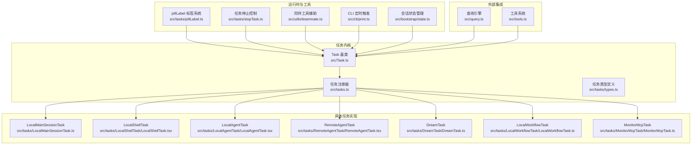
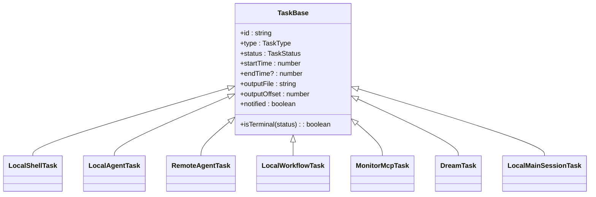
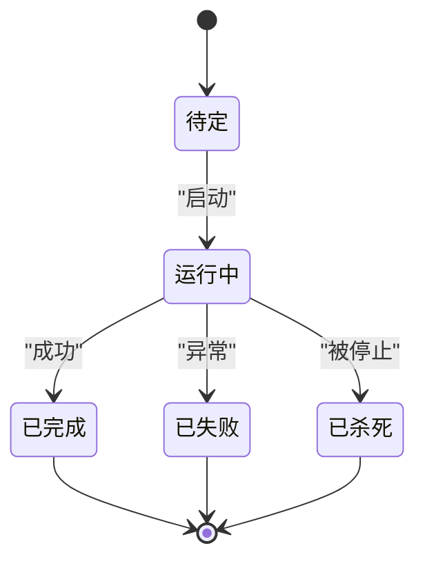
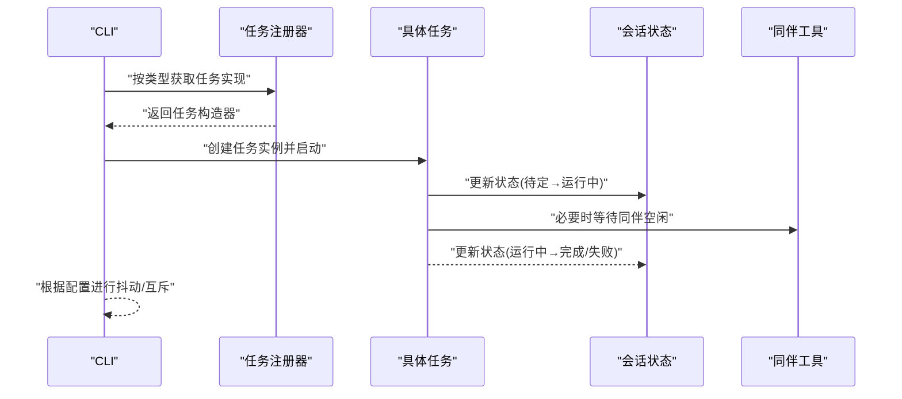
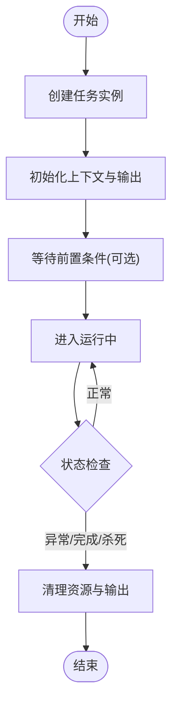
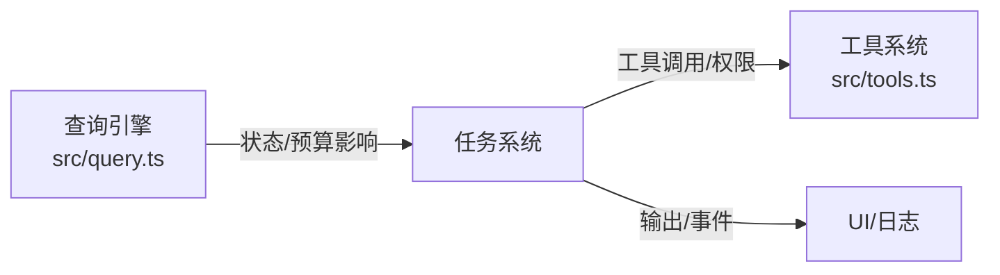
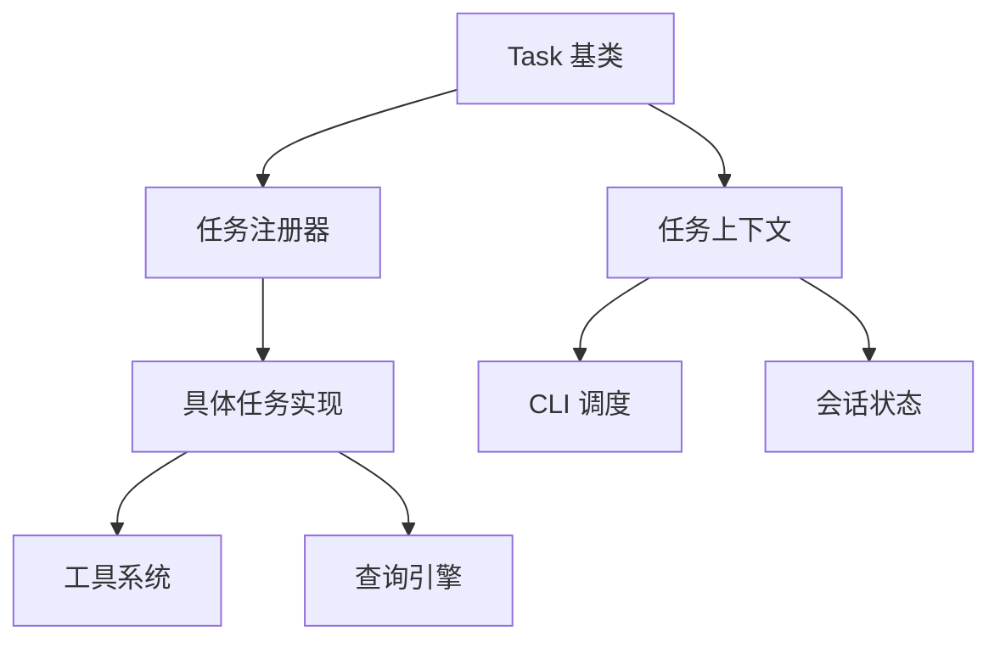

# 任务架构设计

<cite>
**本文引用的文件**
- [src/Task.ts](file://src/Task.ts)
- [src/tasks.ts](file://src/tasks.ts)
- [src/tasks/pillLabel.ts](file://src/tasks/pillLabel.ts)
- [src/tasks/stopTask.ts](file://src/tasks/stopTask.ts)
- [src/tasks/types.ts](file://src/tasks/types.ts)
- [src/tasks/LocalMainSessionTask.ts](file://src/tasks/LocalMainSessionTask.ts)
- [src/tasks/LocalShellTask/LocalShellTask.tsx](file://src/tasks/LocalShellTask/LocalShellTask.tsx)
- [src/tasks/LocalAgentTask/LocalAgentTask.tsx](file://src/tasks/LocalAgentTask/LocalAgentTask.tsx)
- [src/tasks/RemoteAgentTask/RemoteAgentTask.tsx](file://src/tasks/RemoteAgentTask/RemoteAgentTask.tsx)
- [src/tasks/DreamTask/DreamTask.ts](file://src/tasks/DreamTask/DreamTask.ts)
- [src/tasks/LocalWorkflowTask/LocalWorkflowTask.ts](file://src/tasks/LocalWorkflowTask/LocalWorkflowTask.ts)
- [src/tasks/MonitorMcpTask/MonitorMcpTask.ts](file://src/tasks/MonitorMcpTask/MonitorMcpTask.ts)
- [src/utils/teammate.ts](file://src/utils/teammate.ts)
- [src/commands/clear/conversation.ts](file://src/commands/clear/conversation.ts)
- [src/cli/print.ts](file://src/cli/print.ts)
- [src/bootstrap/state.ts](file://src/bootstrap/state.ts)
- [src/query.ts](file://src/query.ts)
- [src/tools.ts](file://src/tools.ts)
</cite>

## 目录
1. [引言](#引言)
2. [项目结构](#项目结构)
3. [核心组件](#核心组件)
4. [架构总览](#架构总览)
5. [详细组件分析](#详细组件分析)
6. [依赖关系分析](#依赖关系分析)
7. [性能考量](#性能考量)
8. [故障排查指南](#故障排查指南)
9. [结论](#结论)
10. [附录](#附录)

## 引言
本文件面向任务系统的架构设计与实现，围绕 Task 基类、任务生命周期与状态机、标签系统（pillLabel）、调度与并发控制、以及与查询引擎、工具系统等核心模块的集成进行系统化阐述。文档旨在帮助开发者快速理解任务体系的设计思想、扩展点与最佳实践，并提供端到端的创建、启动、监控与销毁流程参考。

## 项目结构
任务系统位于 src 目录下，核心入口为 Task 基类与任务注册器；具体任务类型分布在 tasks 子目录中；标签与停止控制分别由 pillLabel 与 stopTask 提供；与应用状态、命令、CLI、查询引擎、工具系统存在多处集成点。

图表来源
- [src/Task.ts:1-57](file://src/Task.ts#L1-L57)
- [src/tasks.ts:1-39](file://src/tasks.ts#L1-L39)
- [src/tasks/pillLabel.ts:1-200](file://src/tasks/pillLabel.ts)
- [src/tasks/stopTask.ts:1-200](file://src/tasks/stopTask.ts)
- [src/tasks/types.ts:1-200](file://src/tasks/types.ts)
- [src/tasks/LocalMainSessionTask.ts:1-200](file://src/tasks/LocalMainSessionTask.ts)
- [src/tasks/LocalShellTask/LocalShellTask.tsx:1-200](file://src/tasks/LocalShellTask/LocalShellTask.tsx)
- [src/tasks/LocalAgentTask/LocalAgentTask.tsx:1-200](file://src/tasks/LocalAgentTask/LocalAgentTask.tsx)
- [src/tasks/RemoteAgentTask/RemoteAgentTask.tsx:1-200](file://src/tasks/RemoteAgentTask/RemoteAgentTask.tsx)
- [src/tasks/DreamTask/DreamTask.ts:1-200](file://src/tasks/DreamTask/DreamTask.ts)
- [src/tasks/LocalWorkflowTask/LocalWorkflowTask.ts:1-200](file://src/tasks/LocalWorkflowTask/LocalWorkflowTask.ts)
- [src/tasks/MonitorMcpTask/MonitorMcpTask.ts:1-200](file://src/tasks/MonitorMcpTask/MonitorMcpTask.ts)
- [src/utils/teammate.ts:244-292](file://src/utils/teammate.ts#L244-L292)
- [src/cli/print.ts:2696-2734](file://src/cli/print.ts#L2696-L2734)
- [src/bootstrap/state.ts:1298-1347](file://src/bootstrap/state.ts#L1298-L1347)
- [src/query.ts:1-200](file://src/query.ts)
- [src/tools.ts:1-200](file://src/tools.ts)

章节来源
- [src/Task.ts:1-57](file://src/Task.ts#L1-L57)
- [src/tasks.ts:1-39](file://src/tasks.ts#L1-L39)

## 核心组件
- Task 基类与状态模型：统一的任务字段、状态枚举与终止态判定，提供跨任务一致的生命周期与输出管理能力。
- 任务注册器：集中导出与按类型检索任务实现，支持特性开关动态加载。
- 具体任务类型：覆盖本地 Shell、本地/远程代理、工作流、MCP 监控、梦境任务等。
- 标签系统（pillLabel）：为任务生成可读性高、可追踪的标签，便于 UI 展示与日志审计。
- 停止控制（stopTask）：提供统一的停止入口与清理钩子，确保资源回收与状态一致性。
- 运行时集成：与 CLI 调度、会话状态、同伴工具、查询引擎、工具系统形成闭环。

章节来源
- [src/Task.ts:1-57](file://src/Task.ts#L1-L57)
- [src/tasks.ts:1-39](file://src/tasks.ts#L1-L39)
- [src/tasks/pillLabel.ts:1-200](file://src/tasks/pillLabel.ts)
- [src/tasks/stopTask.ts:1-200](file://src/tasks/stopTask.ts)
- [src/tasks/types.ts:1-200](file://src/tasks/types.ts)

## 架构总览
任务系统采用“基类 + 多实现 + 注册器”的分层架构。基类定义通用状态与行为，具体任务实现各自职责边界；注册器负责发现与装配；标签与停止控制作为横切关注点贯穿所有任务；调度通过 CLI 与会话状态驱动，查询与工具系统提供输入与能力扩展。

图表来源
- [src/Task.ts:1-57](file://src/Task.ts#L1-L57)
- [src/tasks/LocalShellTask/LocalShellTask.tsx:1-200](file://src/tasks/LocalShellTask/LocalShellTask.tsx)
- [src/tasks/LocalAgentTask/LocalAgentTask.tsx:1-200](file://src/tasks/LocalAgentTask/LocalAgentTask.tsx)
- [src/tasks/RemoteAgentTask/RemoteAgentTask.tsx:1-200](file://src/tasks/RemoteAgentTask/RemoteAgentTask.tsx)
- [src/tasks/LocalWorkflowTask/LocalWorkflowTask.ts:1-200](file://src/tasks/LocalWorkflowTask/LocalWorkflowTask.ts)
- [src/tasks/MonitorMcpTask/MonitorMcpTask.ts:1-200](file://src/tasks/MonitorMcpTask/MonitorMcpTask.ts)
- [src/tasks/DreamTask/DreamTask.ts:1-200](file://src/tasks/DreamTask/DreamTask.ts)
- [src/tasks/LocalMainSessionTask.ts:1-200](file://src/tasks/LocalMainSessionTask.ts)

## 详细组件分析

### Task 基类与生命周期
- 设计要点
  - 统一的状态枚举与终止态判定，避免状态机分支散落各处。
  - 输出文件与偏移量用于增量记录与回放，提升可观测性。
  - 上下文包含 AbortController 与状态读写函数，便于中断与状态更新。
- 生命周期与状态转换
  - 典型路径：pending → running → completed/failed/killed。
  - 终止态不可逆，用于清理与去关联。
- 数据结构复杂度
  - 状态判断 O(1)，任务集合遍历 O(n)。

图表来源
- [src/Task.ts:15-29](file://src/Task.ts#L15-L29)

章节来源
- [src/Task.ts:1-57](file://src/Task.ts#L1-L57)

### 任务标签系统（pillLabel）
- 工作原理
  - 依据任务类型、描述与关键元信息生成人类可读标签，便于 UI 展示与日志检索。
  - 支持多语言与可配置格式，兼顾一致性与可读性。
- 使用场景
  - 任务列表展示、通知标题、审计日志、调试面板筛选。
- 扩展建议
  - 新增任务类型时同步完善标签模板，保持标签语义稳定。

章节来源
- [src/tasks/pillLabel.ts:1-200](file://src/tasks/pillLabel.ts)

### 任务调度器与并发控制
- 调度机制
  - CLI 层通过定时器与队列触发任务执行，结合运行互斥与抖动配置，避免瞬时拥塞。
  - 会话状态维护会话级定时任务集合，支持增删与持久化。
- 并发控制
  - 按任务类型与资源占用特征制定并发策略：只读任务自由并行；写操作任务对同一文件区域串行；验证任务可与实施任务在不同区域并行。
- 资源分配
  - 通过 AbortController 与清理钩子回收进程、文件句柄与内存；对前台/后台任务采取差异化处理策略。

图表来源
- [src/tasks.ts:17-39](file://src/tasks.ts#L17-L39)
- [src/cli/print.ts:2696-2734](file://src/cli/print.ts#L2696-L2734)
- [src/bootstrap/state.ts:1298-1347](file://src/bootstrap/state.ts#L1298-L1347)
- [src/utils/teammate.ts:244-292](file://src/utils/teammate.ts#L244-L292)

章节来源
- [src/cli/print.ts:2696-2734](file://src/cli/print.ts#L2696-L2734)
- [src/bootstrap/state.ts:1298-1347](file://src/bootstrap/state.ts#L1298-L1347)
- [src/utils/teammate.ts:244-292](file://src/utils/teammate.ts#L244-L292)

### 任务创建、启动、监控与销毁流程
- 创建
  - 通过注册器按类型获取实现，传入上下文与参数初始化任务实例。
- 启动
  - 更新状态为“运行中”，记录开始时间与输出位置；必要时等待前置条件（如同伴空闲）。
- 监控
  - 定期检查状态与输出偏移；对长时间无进展的任务触发告警或自动停止。
- 销毁
  - 终止态后释放资源、清理输出、从状态中移除或标记为可回收。

图表来源
- [src/tasks.ts:17-39](file://src/tasks.ts#L17-L39)
- [src/tasks/stopTask.ts:1-200](file://src/tasks/stopTask.ts)
- [src/commands/clear/conversation.ts:135-166](file://src/commands/clear/conversation.ts#L135-L166)

章节来源
- [src/tasks.ts:17-39](file://src/tasks.ts#L17-L39)
- [src/tasks/stopTask.ts:1-200](file://src/tasks/stopTask.ts)
- [src/commands/clear/conversation.ts:135-166](file://src/commands/clear/conversation.ts#L135-L166)

### 与查询引擎、工具系统的集成
- 查询引擎
  - 任务可作为查询执行单元参与令牌预算与转场控制；任务状态变化影响查询的暂停/恢复。
- 工具系统
  - 任务通过工具调用扩展能力；工具的权限与限制在任务生命周期内持续生效；任务停止时需撤销工具持有的资源。

图表来源
- [src/query.ts:1-200](file://src/query.ts)
- [src/tools.ts:1-200](file://src/tools.ts)
- [src/Task.ts:38-42](file://src/Task.ts#L38-L42)

章节来源
- [src/query.ts:1-200](file://src/query.ts)
- [src/tools.ts:1-200](file://src/tools.ts)
- [src/Task.ts:38-42](file://src/Task.ts#L38-L42)

## 依赖关系分析
- 组件耦合
  - 任务实现依赖基类与上下文接口，耦合度低；注册器集中管理类型映射，避免循环依赖。
- 外部依赖
  - CLI 与会话状态提供调度与持久化；工具系统提供能力扩展；查询引擎提供执行环境。
- 潜在风险
  - 特性开关导致的任务缺失需在注册器与调用方做好兜底；停止控制需确保清理钩子幂等。

图表来源
- [src/Task.ts:1-57](file://src/Task.ts#L1-L57)
- [src/tasks.ts:1-39](file://src/tasks.ts#L1-L39)
- [src/cli/print.ts:2696-2734](file://src/cli/print.ts#L2696-L2734)
- [src/bootstrap/state.ts:1298-1347](file://src/bootstrap/state.ts#L1298-L1347)
- [src/tools.ts:1-200](file://src/tools.ts)
- [src/query.ts:1-200](file://src/query.ts)

章节来源
- [src/tasks.ts:1-39](file://src/tasks.ts#L1-L39)
- [src/cli/print.ts:2696-2734](file://src/cli/print.ts#L2696-L2734)
- [src/bootstrap/state.ts:1298-1347](file://src/bootstrap/state.ts#L1298-L1347)

## 性能考量
- 并发与抖动
  - 对高频触发的任务启用抖动与互斥，降低瞬时负载峰值。
- 输出与日志
  - 增量写入与偏移量管理减少磁盘 IO；标签与事件结构化便于索引与检索。
- 清理与回收
  - 终止态后立即释放资源，避免泄漏；批量清理时注意幂等与异常保护。

## 故障排查指南
- 常见问题
  - 任务卡死：检查 AbortController 是否正确传播；查看输出偏移是否停滞。
  - 并发冲突：确认写操作任务在同一文件区域的串行策略是否生效。
  - 资源未释放：核对停止控制的清理钩子是否执行；检查会话缓存清理逻辑。
- 排查步骤
  - 通过标签定位任务；查看状态与时间线；核对工具调用链路；复核 CLI 调度与互斥配置。

章节来源
- [src/tasks/stopTask.ts:1-200](file://src/tasks/stopTask.ts)
- [src/commands/clear/conversation.ts:135-166](file://src/commands/clear/conversation.ts#L135-L166)

## 结论
任务系统以清晰的基类抽象、灵活的注册机制与完善的生命周期管理为核心，配合标签与停止控制形成可观测、可治理的执行框架。通过与 CLI、会话状态、查询引擎与工具系统的深度集成，实现了从调度到执行再到回收的全链路闭环。建议在新增任务类型时遵循现有模式，确保状态机一致、清理幂等与标签可读。

## 附录
- 最佳实践
  - 明确任务类型与并发策略，避免写操作任务的竞态。
  - 在任务上下文中统一处理中断与清理，保证异常路径可控。
  - 为关键路径增加可观测性指标与告警阈值。
- 扩展点
  - 新增任务类型：实现基类约定的接口，加入注册器映射。
  - 新增标签模板：完善 pillLabel 的格式化逻辑。
  - 新增停止策略：在 stopTask 中补充特定资源的回收逻辑。