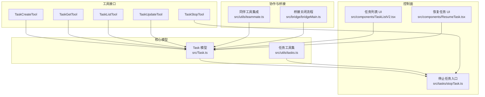
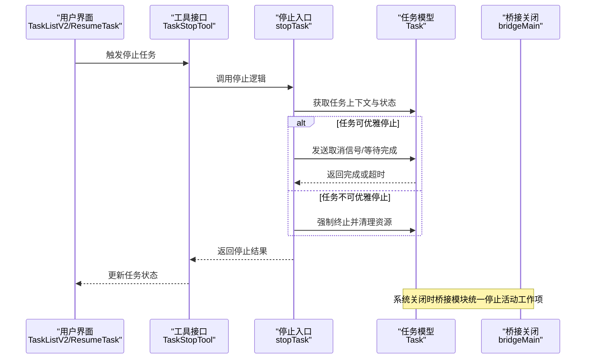
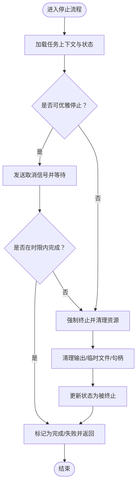
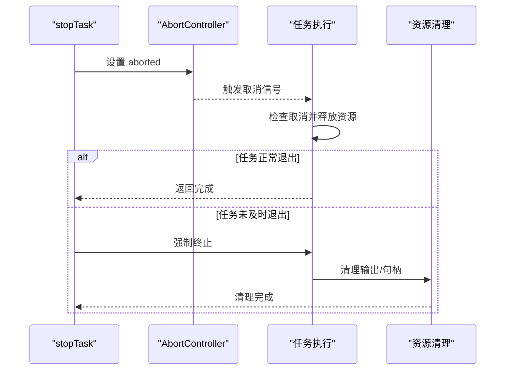
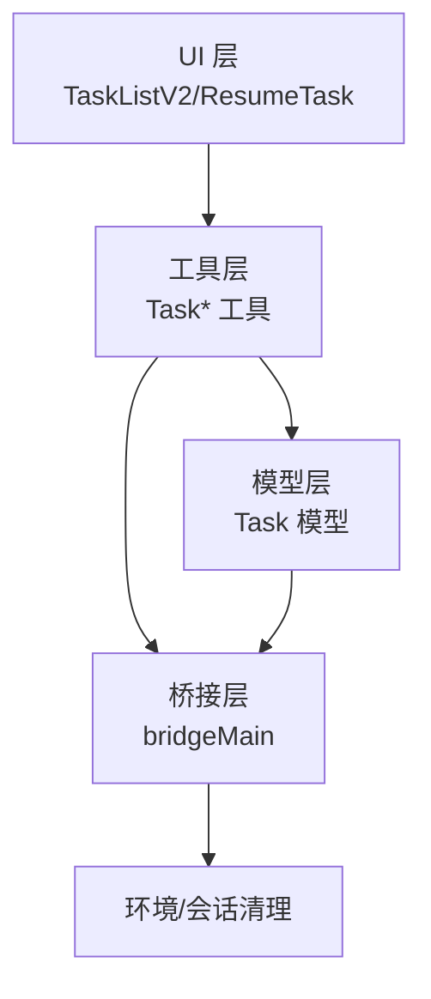
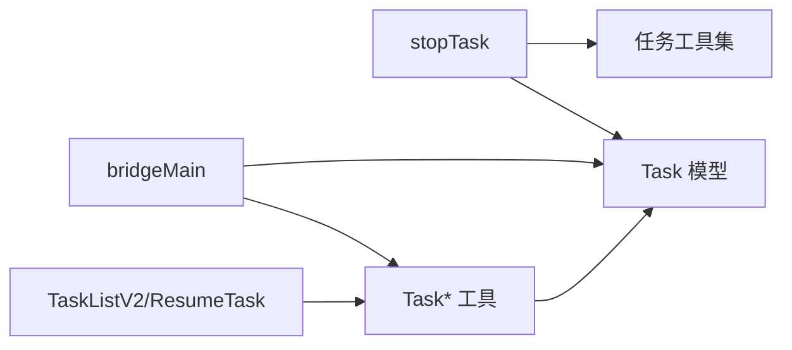

# 任务管理

<cite>
**本文引用的文件**
- [src/Task.ts](file://src/Task.ts)
- [src/tasks/stopTask.ts](file://src/tasks/stopTask.ts)
- [src/tasks.ts](file://src/tasks.ts)
- [src/utils/tasks.ts](file://src/utils/tasks.ts)
- [src/components/TaskListV2.tsx](file://src/components/TaskListV2.tsx)
- [src/components/ResumeTask.tsx](file://src/components/ResumeTask.tsx)
- [src/tools/TaskStopTool/TaskStopTool.ts](file://src/tools/TaskStopTool/TaskStopTool.ts)
- [src/tools/TaskListTool/TaskListTool.ts](file://src/tools/TaskListTool/TaskListTool.ts)
- [src/tools/TaskGetTool/TaskGetTool.ts](file://src/tools/TaskGetTool/TaskGetTool.ts)
- [src/tools/TaskCreateTool/TaskCreateTool.ts](file://src/tools/TaskCreateTool/TaskCreateTool.ts)
- [src/tools/TaskUpdateTool/TaskUpdateTool.ts](file://src/tools/TaskUpdateTool/TaskUpdateTool.ts)
- [src/utils/teammate.ts](file://src/utils/teammate.ts)
- [src/bridge/bridgeMain.ts](file://src/bridge/bridgeMain.ts)
</cite>

## 目录
1. [简介](#简介)
2. [项目结构](#项目结构)
3. [核心组件](#核心组件)
4. [架构总览](#架构总览)
5. [详细组件分析](#详细组件分析)
6. [依赖关系分析](#依赖关系分析)
7. [性能考量](#性能考量)
8. [故障排查指南](#故障排查指南)
9. [结论](#结论)
10. [附录](#附录)

## 简介
本文件围绕任务管理系统进行系统化技术文档整理，重点覆盖以下主题：
- 任务停止机制（stopTask）的实现原理与使用方法：包括优雅关闭、强制终止与资源清理策略
- 任务管理器的职责与工作机制：任务注册、状态跟踪与生命周期管理
- 任务取消的信号传递机制与中断处理流程
- 具体操作示例路径：启动、暂停、恢复与终止任务
- 任务管理与其他系统组件的协调机制与依赖关系
- 错误处理、状态同步与性能监控的最佳实践

## 项目结构
任务管理相关代码主要分布在如下位置：
- 核心类型与通用工具：src/Task.ts、src/utils/tasks.ts
- 任务停止入口：src/tasks/stopTask.ts
- 任务列表与UI：src/components/TaskListV2.tsx、src/components/ResumeTask.tsx
- 工具接口：TaskCreateTool、TaskGetTool、TaskListTool、TaskUpdateTool、TaskStopTool
- 组件间协作与桥接：src/utils/teammate.ts、src/bridge/bridgeMain.ts



图表来源
- [src/Task.ts:1-57](file://src/Task.ts#L1-L57)
- [src/tasks/stopTask.ts](file://src/tasks/stopTask.ts)
- [src/utils/tasks.ts](file://src/utils/tasks.ts)
- [src/components/TaskListV2.tsx](file://src/components/TaskListV2.tsx)
- [src/components/ResumeTask.tsx](file://src/components/ResumeTask.tsx)
- [src/utils/teammate.ts:244-292](file://src/utils/teammate.ts#L244-L292)
- [src/bridge/bridgeMain.ts:1421-1538](file://src/bridge/bridgeMain.ts#L1421-L1538)

章节来源
- [src/Task.ts:1-57](file://src/Task.ts#L1-L57)
- [src/tasks/stopTask.ts](file://src/tasks/stopTask.ts)
- [src/utils/tasks.ts](file://src/utils/tasks.ts)
- [src/components/TaskListV2.tsx](file://src/components/TaskListV2.tsx)
- [src/components/ResumeTask.tsx](file://src/components/ResumeTask.tsx)
- [src/utils/teammate.ts:244-292](file://src/utils/teammate.ts#L244-L292)
- [src/bridge/bridgeMain.ts:1421-1538](file://src/bridge/bridgeMain.ts#L1421-L1538)

## 核心组件
- 任务模型与状态
  - 定义了任务类型（如本地 Bash、本地 Agent、远程 Agent、进程内同伴、工作流、MCP 监控、梦境等）与状态（待定、运行中、已完成、失败、被终止）
  - 提供判断“是否为终态”的辅助函数，用于避免对已结束任务注入消息或清理路径
  - 提供任务句柄（TaskHandle）与上下文（TaskContext），包含 AbortController、状态获取与更新回调
- 任务工具集
  - 提供任务在磁盘输出路径解析、任务状态转换与持久化、任务元数据管理等通用能力
- 停止任务入口
  - 负责接收停止请求，按任务类型选择优雅关闭或强制终止，并执行资源清理
- 任务列表与 UI
  - 提供任务列表展示与恢复任务交互，驱动用户侧任务生命周期操作
- 工具接口
  - TaskCreateTool：创建任务
  - TaskGetTool：查询任务详情
  - TaskListTool：列出任务
  - TaskUpdateTool：更新任务状态/元数据
  - TaskStopTool：触发停止任务

章节来源
- [src/Task.ts:1-57](file://src/Task.ts#L1-L57)
- [src/utils/tasks.ts](file://src/utils/tasks.ts)
- [src/tasks/stopTask.ts](file://src/tasks/stopTask.ts)
- [src/components/TaskListV2.tsx](file://src/components/TaskListV2.tsx)
- [src/components/ResumeTask.tsx](file://src/components/ResumeTask.tsx)
- [src/tools/TaskCreateTool/TaskCreateTool.ts](file://src/tools/TaskCreateTool/TaskCreateTool.ts)
- [src/tools/TaskGetTool/TaskGetTool.ts](file://src/tools/TaskGetTool/TaskGetTool.ts)
- [src/tools/TaskListTool/TaskListTool.ts](file://src/tools/TaskListTool/TaskListTool.ts)
- [src/tools/TaskUpdateTool/TaskUpdateTool.ts](file://src/tools/TaskUpdateTool/TaskUpdateTool.ts)
- [src/tools/TaskStopTool/TaskStopTool.ts](file://src/tools/TaskStopTool/TaskStopTool.ts)

## 架构总览
任务管理贯穿“模型层—控制层—工具层—UI 层—桥接层”，形成闭环：
- 模型层：定义任务类型与状态，提供终态判定与上下文
- 控制层：stopTask 作为统一停止入口，协调不同任务类型的停止策略
- 工具层：通过 Task* 工具实现任务的创建、查询、更新与停止
- UI 层：TaskListV2 与 ResumeTask 驱动用户交互
- 桥接层：在系统关闭时，桥接模块对活动会话与工作项进行优雅停止与资源清理



图表来源
- [src/components/TaskListV2.tsx](file://src/components/TaskListV2.tsx)
- [src/components/ResumeTask.tsx](file://src/components/ResumeTask.tsx)
- [src/tools/TaskStopTool/TaskStopTool.ts](file://src/tools/TaskStopTool/TaskStopTool.ts)
- [src/tasks/stopTask.ts](file://src/tasks/stopTask.ts)
- [src/Task.ts:1-57](file://src/Task.ts#L1-L57)
- [src/bridge/bridgeMain.ts:1421-1538](file://src/bridge/bridgeMain.ts#L1421-L1538)

## 详细组件分析

### 任务停止机制（stopTask）
- 设计目标
  - 对不同类型任务采用差异化停止策略：优先优雅关闭，必要时强制终止
  - 在停止过程中确保资源清理与状态同步，避免悬挂进程或未释放资源
- 关键流程
  - 接收停止请求后，根据任务类型与当前状态决定策略
  - 优雅关闭：向任务上下文中的 AbortController 发出取消信号，等待任务完成清理
  - 强制终止：直接调用任务的终止接口，随后执行资源回收
  - 清理阶段：关闭输出流、删除临时文件、更新任务状态为“被终止”
- 与桥接关闭的协同
  - 当系统整体关闭时，桥接模块会遍历活动工作项，统一调用停止接口并等待退出，最后进行环境与会话清理



图表来源
- [src/tasks/stopTask.ts](file://src/tasks/stopTask.ts)
- [src/Task.ts:1-57](file://src/Task.ts#L1-L57)
- [src/bridge/bridgeMain.ts:1421-1538](file://src/bridge/bridgeMain.ts#L1421-L1538)

章节来源
- [src/tasks/stopTask.ts](file://src/tasks/stopTask.ts)
- [src/Task.ts:1-57](file://src/Task.ts#L1-L57)
- [src/bridge/bridgeMain.ts:1421-1538](file://src/bridge/bridgeMain.ts#L1421-L1538)

### 任务管理器职责与工作机制
- 任务注册
  - 通过 TaskCreateTool 创建任务，写入任务模型并初始化状态
- 状态跟踪
  - 通过 TaskListTool 与 TaskGetTool 查询任务状态与元数据
  - UI 层（TaskListV2）实时展示任务状态变化
- 生命周期管理
  - 通过 TaskUpdateTool 更新任务状态（如暂停、恢复、完成）
  - 通过 TaskStopTool 触发停止；系统关闭时由桥接模块统一停止

```mermaid
sequenceDiagram
participant Creator as "创建者"
participant Create as "TaskCreateTool"
participant Store as "任务存储/状态"
participant List as "TaskListTool/TaskGetTool"
participant UI as "TaskListV2/UI"
Creator->>Create : 创建任务
Create->>Store : 写入初始状态
UI->>List : 查询任务列表/详情
List-->>UI : 返回任务状态
UI-->>Creator : 展示并允许操作
```

图表来源
- [src/tools/TaskCreateTool/TaskCreateTool.ts](file://src/tools/TaskCreateTool/TaskCreateTool.ts)
- [src/tools/TaskListTool/TaskListTool.ts](file://src/tools/TaskListTool/TaskListTool.ts)
- [src/tools/TaskGetTool/TaskGetTool.ts](file://src/tools/TaskGetTool/TaskGetTool.ts)
- [src/components/TaskListV2.tsx](file://src/components/TaskListV2.tsx)

章节来源
- [src/tools/TaskCreateTool/TaskCreateTool.ts](file://src/tools/TaskCreateTool/TaskCreateTool.ts)
- [src/tools/TaskListTool/TaskListTool.ts](file://src/tools/TaskListTool/TaskListTool.ts)
- [src/tools/TaskGetTool/TaskGetTool.ts](file://src/tools/TaskGetTool/TaskGetTool.ts)
- [src/components/TaskListV2.tsx](file://src/components/TaskListV2.tsx)

### 任务取消的信号传递与中断处理
- 信号传递
  - 通过 AbortController 将取消信号传递给任务执行线程
  - 任务内部应定期检查取消信号并在检测到后尽快释放资源并退出
- 中断处理
  - 优雅关闭：等待任务完成清理，更新状态为“已完成”或“失败”
  - 强制终止：直接终止进程/线程并清理残留资源
- 同伴任务的等待机制
  - 在同伴工具集成中，可等待多个“进程内同伴”全部空闲后再进行系统级关闭



图表来源
- [src/tasks/stopTask.ts](file://src/tasks/stopTask.ts)
- [src/utils/teammate.ts:244-292](file://src/utils/teammate.ts#L244-L292)

章节来源
- [src/tasks/stopTask.ts](file://src/tasks/stopTask.ts)
- [src/utils/teammate.ts:244-292](file://src/utils/teammate.ts#L244-L292)

### 具体操作示例（以路径代替代码）
- 启动任务
  - 使用 TaskCreateTool 创建任务，参考：[src/tools/TaskCreateTool/TaskCreateTool.ts](file://src/tools/TaskCreateTool/TaskCreateTool.ts)
- 暂停任务
  - 通过 TaskUpdateTool 更新任务状态为“暂停”，参考：[src/tools/TaskUpdateTool/TaskUpdateTool.ts](file://src/tools/TaskUpdateTool/TaskUpdateTool.ts)
- 恢复任务
  - 通过 TaskUpdateTool 更新任务状态为“运行中”，参考：[src/tools/TaskUpdateTool/TaskUpdateTool.ts](file://src/tools/TaskUpdateTool/TaskUpdateTool.ts)
- 终止任务
  - 通过 TaskStopTool 触发停止，参考：[src/tools/TaskStopTool/TaskStopTool.ts](file://src/tools/TaskStopTool/TaskStopTool.ts)
  - 或直接调用停止入口：[src/tasks/stopTask.ts](file://src/tasks/stopTask.ts)

章节来源
- [src/tools/TaskCreateTool/TaskCreateTool.ts](file://src/tools/TaskCreateTool/TaskCreateTool.ts)
- [src/tools/TaskUpdateTool/TaskUpdateTool.ts](file://src/tools/TaskUpdateTool/TaskUpdateTool.ts)
- [src/tools/TaskStopTool/TaskStopTool.ts](file://src/tools/TaskStopTool/TaskStopTool.ts)
- [src/tasks/stopTask.ts](file://src/tasks/stopTask.ts)

### 任务管理与系统其他组件的协调机制
- 与 UI 的协调
  - TaskListV2 展示任务状态，支持用户触发恢复任务（ResumeTask）
- 与桥接的协调
  - 系统关闭时，bridgeMain 会统一停止所有活动工作项并清理会话与环境
- 与同伴工具的协调
  - 在关闭前等待“进程内同伴”全部空闲，避免中断正在进行的工作



图表来源
- [src/components/TaskListV2.tsx](file://src/components/TaskListV2.tsx)
- [src/components/ResumeTask.tsx](file://src/components/ResumeTask.tsx)
- [src/tools/TaskStopTool/TaskStopTool.ts](file://src/tools/TaskStopTool/TaskStopTool.ts)
- [src/bridge/bridgeMain.ts:1421-1538](file://src/bridge/bridgeMain.ts#L1421-L1538)

章节来源
- [src/components/TaskListV2.tsx](file://src/components/TaskListV2.tsx)
- [src/components/ResumeTask.tsx](file://src/components/ResumeTask.tsx)
- [src/tools/TaskStopTool/TaskStopTool.ts](file://src/tools/TaskStopTool/TaskStopTool.ts)
- [src/bridge/bridgeMain.ts:1421-1538](file://src/bridge/bridgeMain.ts#L1421-L1538)

## 依赖关系分析
- 模块耦合
  - stopTask 依赖 Task 模型与工具集，负责统一停止策略
  - UI 通过工具接口与任务模型交互，不直接依赖底层实现细节
  - 桥接模块在系统关闭时对所有活动工作项进行统一停止
- 外部依赖
  - AbortController 用于取消信号传递
  - 文件系统用于任务输出与临时文件管理



图表来源
- [src/tasks/stopTask.ts](file://src/tasks/stopTask.ts)
- [src/Task.ts:1-57](file://src/Task.ts#L1-L57)
- [src/utils/tasks.ts](file://src/utils/tasks.ts)
- [src/components/TaskListV2.tsx](file://src/components/TaskListV2.tsx)
- [src/components/ResumeTask.tsx](file://src/components/ResumeTask.tsx)
- [src/bridge/bridgeMain.ts:1421-1538](file://src/bridge/bridgeMain.ts#L1421-L1538)

章节来源
- [src/tasks/stopTask.ts](file://src/tasks/stopTask.ts)
- [src/Task.ts:1-57](file://src/Task.ts#L1-L57)
- [src/utils/tasks.ts](file://src/utils/tasks.ts)
- [src/components/TaskListV2.tsx](file://src/components/TaskListV2.tsx)
- [src/components/ResumeTask.tsx](file://src/components/ResumeTask.tsx)
- [src/bridge/bridgeMain.ts:1421-1538](file://src/bridge/bridgeMain.ts#L1421-L1538)

## 性能考量
- 优雅关闭优先：尽量通过取消信号让任务自然退出，减少强制终止带来的资源抖动
- 批量停止：在系统关闭时，利用桥接模块统一停止活动工作项，避免逐个等待导致的延迟累积
- 输出与清理：及时关闭输出流与删除临时文件，降低磁盘压力
- 状态同步：通过工具接口与 UI 实时同步任务状态，避免重复轮询造成 CPU 占用

## 故障排查指南
- 任务长时间无法停止
  - 检查是否正确传递取消信号（AbortController）
  - 若任务未响应，考虑强制终止并记录日志
- 系统关闭后残留工作项
  - 确认 bridgeMain 是否正确调用停止接口并等待退出
- UI 不显示最新状态
  - 检查 TaskListTool/TaskGetTool 是否正确返回最新状态
- 进程内同伴未及时空闲
  - 使用同伴等待机制，在关闭前等待所有同伴空闲

章节来源
- [src/bridge/bridgeMain.ts:1421-1538](file://src/bridge/bridgeMain.ts#L1421-L1538)
- [src/utils/teammate.ts:244-292](file://src/utils/teammate.ts#L244-L292)

## 结论
任务管理通过统一的模型与工具接口，实现了从创建、运行、暂停、恢复到停止的完整生命周期管理。stopTask 作为统一停止入口，结合 AbortController 的取消信号与桥接模块的系统级关闭流程，确保了优雅关闭与资源清理的可靠性。配合 UI 与工具层的协同，任务管理在复杂场景下仍能保持稳定与高效。

## 附录
- 术语
  - 终态：已完成、失败、被终止，不再发生状态转移
  - 优雅关闭：通过取消信号让任务自然退出
  - 强制终止：直接终止任务并清理资源
- 参考路径
  - 任务模型与状态：[src/Task.ts:1-57](file://src/Task.ts#L1-L57)
  - 停止入口：[src/tasks/stopTask.ts](file://src/tasks/stopTask.ts)
  - 任务工具集：[src/utils/tasks.ts](file://src/utils/tasks.ts)
  - 任务列表 UI：[src/components/TaskListV2.tsx](file://src/components/TaskListV2.tsx)
  - 恢复任务 UI：[src/components/ResumeTask.tsx](file://src/components/ResumeTask.tsx)
  - 工具接口：TaskCreateTool/TaskGetTool/TaskListTool/TaskUpdateTool/TaskStopTool
  - 桥接关闭：[src/bridge/bridgeMain.ts:1421-1538](file://src/bridge/bridgeMain.ts#L1421-L1538)