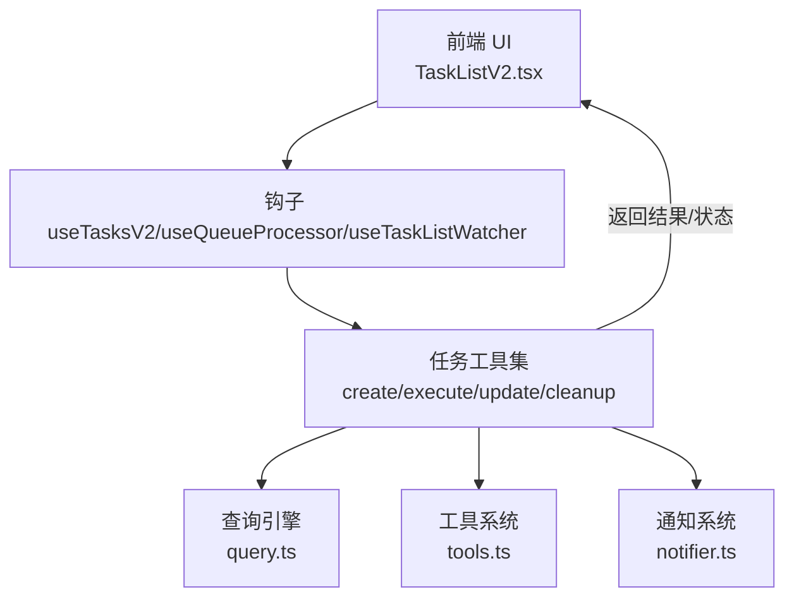
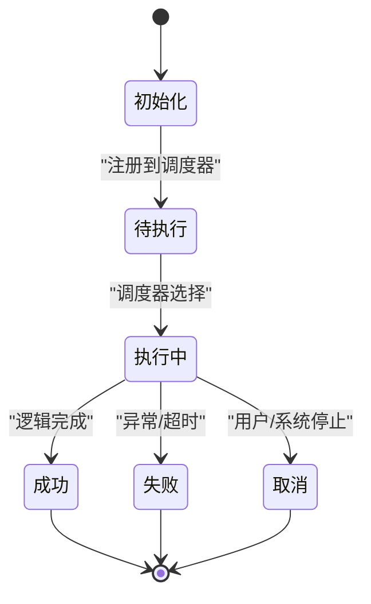
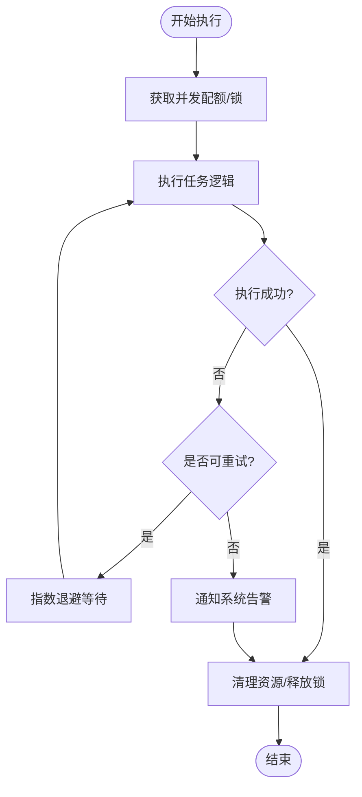
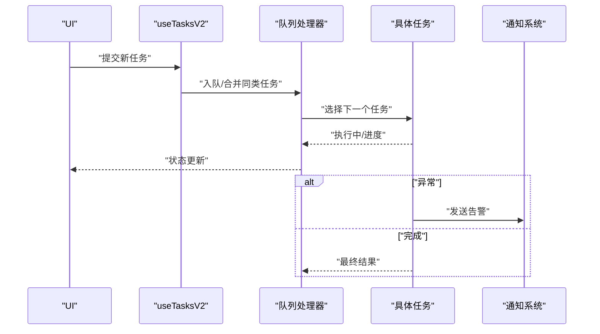
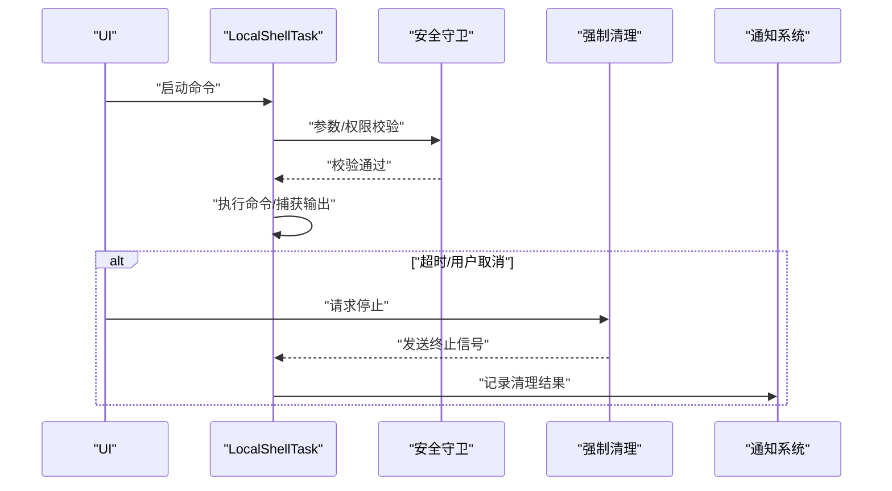
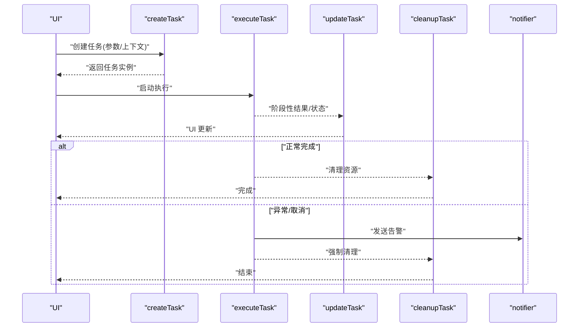
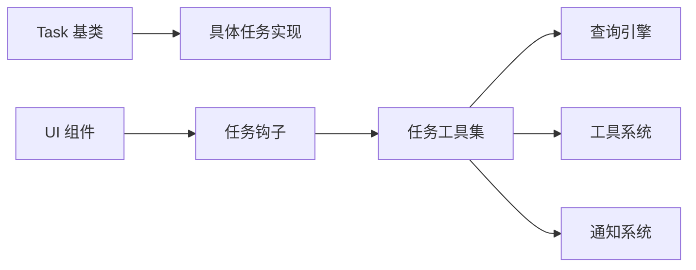

# 任务系统

<cite>
**本文引用的文件**
- [src/Task.ts](file://src/Task.ts)
- [src/tasks.ts](file://src/tasks.ts)
- [src/tasks/types.ts](file://src/tasks/types.ts)
- [src/tasks/stopTask.ts](file://src/tasks/stopTask.ts)
- [src/tasks/pillLabel.ts](file://src/tasks/pillLabel.ts)
- [src/tasks/DreamTask/DreamTask.ts](file://src/tasks/DreamTask/DreamTask.ts)
- [src/tasks/LocalShellTask/LocalShellTask.tsx](file://src/tasks/LocalShellTask/LocalShellTask.tsx)
- [src/tasks/LocalShellTask/guards.ts](file://src/tasks/LocalShellTask/guards.ts)
- [src/tasks/LocalShellTask/killShellTasks.ts](file://src/tasks/LocalShellTask/killShellTasks.ts)
- [src/tasks/LocalAgentTask/LocalAgentTask.tsx](file://src/tasks/LocalAgentTask/LocalAgentTask.tsx)
- [src/tasks/RemoteAgentTask/RemoteAgentTask.tsx](file://src/tasks/RemoteAgentTask/RemoteAgentTask.tsx)
- [src/tasks/InProcessTeammateTask/InProcessTeammateTask.tsx](file://src/tasks/InProcessTeammateTask/InProcessTeammateTask.tsx)
- [src/tasks/InProcessTeammateTask/types.ts](file://src/tasks/InProcessTeammateTask/types.ts)
- [src/tasks/LocalWorkflowTask/LocalWorkflowTask.ts](file://src/tasks/LocalWorkflowTask/LocalWorkflowTask.ts)
- [src/tasks/MonitorMcpTask/MonitorMcpTask.ts](file://src/tasks/MonitorMcpTask/MonitorMcpTask.ts)
- [src/tasks/LocalMainSessionTask.ts](file://src/tasks/LocalMainSessionTask.ts)
- [src/query.ts](file://src/query.ts)
- [src/tools.ts](file://src/tools.ts)
- [src/services/notifier.ts](file://src/services/notifier.ts)
- [src/hooks/useTasksV2.ts](file://src/hooks/useTasksV2.ts)
- [src/hooks/useQueueProcessor.ts](file://src/hooks/useQueueProcessor.ts)
- [src/hooks/useTaskListWatcher.ts](file://src/hooks/useTaskListWatcher.ts)
- [src/utils/task/index.ts](file://src/utils/task/index.ts)
- [src/utils/task/createTask.ts](file://src/utils/task/createTask.ts)
- [src/utils/task/executeTask.ts](file://src/utils/task/executeTask.ts)
- [src/utils/task/updateTask.ts](file://src/utils/task/updateTask.ts)
- [src/utils/task/cleanupTask.ts](file://src/utils/task/cleanupTask.ts)
- [src/components/tasks/TaskListV2.tsx](file://src/components/tasks/TaskListV2.tsx)
</cite>

## 目录
1. [简介](#简介)
2. [项目结构](#项目结构)
3. [核心组件](#核心组件)
4. [架构总览](#架构总览)
5. [详细组件分析](#详细组件分析)
6. [依赖关系分析](#依赖关系分析)
7. [性能考虑](#性能考虑)
8. [故障排除指南](#故障排除指南)
9. [结论](#结论)
10. [附录](#附录)

## 简介
本文件为任务系统（Tasks）的综合技术文档，涵盖任务生命周期管理、异步执行机制、任务调度策略与状态跟踪。文档深入解析核心任务类型（如 DreamTask、LocalShellTask、RemoteAgentTask 等）的实现原理与使用场景，并说明并发控制、资源管理与错误恢复机制。同时提供任务创建、启动、监控与清理的流程图与时序图，以及与查询引擎、工具系统和通知系统的集成方式。最后给出调试、性能监控与故障排除的最佳实践。

## 项目结构
任务系统主要由以下层次构成：
- 顶层任务抽象与通用工具：定义任务基类、通用状态与生命周期方法、任务停止与标签显示等。
- 具体任务实现：按运行环境与用途划分，如本地 Shell 任务、本地代理任务、远程代理任务、进程内队友任务、工作流任务、MCP 监控任务等。
- 任务编排与调度：通过钩子与工具函数协调任务队列、监听任务列表变化、统一创建/执行/更新/清理流程。
- 集成点：与查询引擎（QueryEngine）、工具系统（Tools）、通知系统（Notifier）协同工作。

```mermaid
graph TB
subgraph "任务抽象层"
TaskBase["Task 基类<br/>src/Task.ts"]
TaskTypes["任务类型定义<br/>src/tasks/types.ts"]
StopTask["任务停止工具<br/>src/tasks/stopTask.ts"]
PillLabel["任务标签显示<br/>src/tasks/pillLabel.ts"]
end
subgraph "具体任务实现"
DreamTask["DreamTask<br/>src/tasks/DreamTask/DreamTask.ts"]
LocalShellTask["LocalShellTask<br/>src/tasks/LocalShellTask/LocalShellTask.tsx"]
LocalAgentTask["LocalAgentTask<br/>src/tasks/LocalAgentTask/LocalAgentTask.tsx"]
RemoteAgentTask["RemoteAgentTask<br/>src/tasks/RemoteAgentTask/RemoteAgentTask.tsx"]
InProcessTeammate["InProcessTeammateTask<br/>src/tasks/InProcessTeammateTask/InProcessTeammateTask.tsx"]
LocalWorkflow["LocalWorkflowTask<br/>src/tasks/LocalWorkflowTask/LocalWorkflowTask.ts"]
MonitorMcp["MonitorMcpTask<br/>src/tasks/MonitorMcpTask/MonitorMcpTask.ts"]
LocalMainSession["LocalMainSessionTask<br/>src/tasks/LocalMainSessionTask.ts"]
end
subgraph "编排与调度"
TasksIndex["任务入口导出<br/>src/tasks.ts"]
UseTasksV2["任务钩子 useTasksV2<br/>src/hooks/useTasksV2.ts"]
UseQueue["队列处理器 useQueueProcessor<br/>src/hooks/useQueueProcessor.ts"]
TaskListWatcher["任务列表监听器<br/>src/hooks/useTaskListWatcher.ts"]
UtilsTask["任务工具集<br/>src/utils/task/*"]
end
subgraph "集成系统"
QueryEngine["查询引擎<br/>src/query.ts"]
Tools["工具系统<br/>src/tools.ts"]
Notifier["通知系统<br/>src/services/notifier.ts"]
TaskListUI["任务列表 UI<br/>src/components/tasks/TaskListV2.tsx"]
end
TaskBase --> TasksIndex
TaskTypes --> TasksIndex
StopTask --> TasksIndex
PillLabel --> TasksIndex
TasksIndex --> DreamTask
TasksIndex --> LocalShellTask
TasksIndex --> LocalAgentTask
TasksIndex --> RemoteAgentTask
TasksIndex --> InProcessTeammate
TasksIndex --> LocalWorkflow
TasksIndex --> MonitorMcp
TasksIndex --> LocalMainSession
UseTasksV2 --> UtilsTask
UseQueue --> UtilsTask
TaskListWatcher --> UtilsTask
UtilsTask --> QueryEngine
UtilsTask --> Tools
UtilsTask --> Notifier
UtilsTask --> TaskListUI
```

图表来源
- [src/Task.ts](file://src/Task.ts)
- [src/tasks.ts](file://src/tasks.ts)
- [src/tasks/types.ts](file://src/tasks/types.ts)
- [src/tasks/stopTask.ts](file://src/tasks/stopTask.ts)
- [src/tasks/pillLabel.ts](file://src/tasks/pillLabel.ts)
- [src/tasks/DreamTask/DreamTask.ts](file://src/tasks/DreamTask/DreamTask.ts)
- [src/tasks/LocalShellTask/LocalShellTask.tsx](file://src/tasks/LocalShellTask/LocalShellTask.tsx)
- [src/tasks/LocalAgentTask/LocalAgentTask.tsx](file://src/tasks/LocalAgentTask/LocalAgentTask.tsx)
- [src/tasks/RemoteAgentTask/RemoteAgentTask.tsx](file://src/tasks/RemoteAgentTask/RemoteAgentTask.tsx)
- [src/tasks/InProcessTeammateTask/InProcessTeammateTask.tsx](file://src/tasks/InProcessTeammateTask/InProcessTeammateTask.tsx)
- [src/tasks/LocalWorkflowTask/LocalWorkflowTask.ts](file://src/tasks/LocalWorkflowTask/LocalWorkflowTask.ts)
- [src/tasks/MonitorMcpTask/MonitorMcpTask.ts](file://src/tasks/MonitorMcpTask/MonitorMcpTask.ts)
- [src/tasks/LocalMainSessionTask.ts](file://src/tasks/LocalMainSessionTask.ts)
- [src/hooks/useTasksV2.ts](file://src/hooks/useTasksV2.ts)
- [src/hooks/useQueueProcessor.ts](file://src/hooks/useQueueProcessor.ts)
- [src/hooks/useTaskListWatcher.ts](file://src/hooks/useTaskListWatcher.ts)
- [src/utils/task/index.ts](file://src/utils/task/index.ts)
- [src/query.ts](file://src/query.ts)
- [src/tools.ts](file://src/tools.ts)
- [src/services/notifier.ts](file://src/services/notifier.ts)
- [src/components/tasks/TaskListV2.tsx](file://src/components/tasks/TaskListV2.tsx)

章节来源
- [src/tasks.ts](file://src/tasks.ts)
- [src/tasks/types.ts](file://src/tasks/types.ts)

## 核心组件
- 任务基类与生命周期
  - 定义统一的任务接口、状态枚举、开始/执行/完成/失败/取消等生命周期方法。
  - 提供任务元数据（名称、描述、优先级、创建时间、标签等）与上下文存储。
- 任务类型系统
  - 通过类型定义区分不同任务类别，便于调度器与 UI 进行差异化处理。
- 任务停止与标签
  - 统一的任务停止逻辑，支持优雅终止与强制清理。
  - 任务标签用于在 UI 中快速识别任务类型与状态。
- 任务工具集
  - 创建、执行、更新、清理任务的标准流程封装，确保一致性与可维护性。

章节来源
- [src/Task.ts](file://src/Task.ts)
- [src/tasks/types.ts](file://src/tasks/types.ts)
- [src/tasks/stopTask.ts](file://src/tasks/stopTask.ts)
- [src/tasks/pillLabel.ts](file://src/tasks/pillLabel.ts)
- [src/utils/task/index.ts](file://src/utils/task/index.ts)

## 架构总览
任务系统采用“抽象基类 + 多种具体任务实现 + 工具集编排”的分层架构。调度与 UI 通过钩子与工具函数与任务系统交互；任务内部通过查询引擎与工具系统协作完成实际工作；通知系统负责状态变更与异常告警。

图表来源
- [src/components/tasks/TaskListV2.tsx](file://src/components/tasks/TaskListV2.tsx)
- [src/hooks/useTasksV2.ts](file://src/hooks/useTasksV2.ts)
- [src/hooks/useQueueProcessor.ts](file://src/hooks/useQueueProcessor.ts)
- [src/hooks/useTaskListWatcher.ts](file://src/hooks/useTaskListWatcher.ts)
- [src/utils/task/createTask.ts](file://src/utils/task/createTask.ts)
- [src/utils/task/executeTask.ts](file://src/utils/task/executeTask.ts)
- [src/utils/task/updateTask.ts](file://src/utils/task/updateTask.ts)
- [src/utils/task/cleanupTask.ts](file://src/utils/task/cleanupTask.ts)
- [src/query.ts](file://src/query.ts)
- [src/tools.ts](file://src/tools.ts)
- [src/services/notifier.ts](file://src/services/notifier.ts)

## 详细组件分析

### 任务生命周期与状态跟踪
- 生命周期阶段
  - 初始化：设置任务元数据、参数校验、资源预分配。
  - 启动：注册到调度器，进入待执行队列或直接执行。
  - 执行：调用具体任务逻辑，期间可能与查询引擎/工具系统交互。
  - 结束：成功完成或被取消/失败，触发清理与通知。
- 状态跟踪
  - 使用统一的状态枚举与事件回调，确保 UI 与后台同步。
  - 支持暂停/恢复、进度上报与中间态持久化。

章节来源
- [src/Task.ts](file://src/Task.ts)
- [src/tasks/types.ts](file://src/tasks/types.ts)

### 异步执行机制与并发控制
- 并发模型
  - 通过队列处理器与钩子实现串行/并行调度策略，避免资源争用。
  - 支持任务优先级与配额限制，保障关键任务优先执行。
- 资源管理
  - 本地 Shell 任务使用守护进程与信号量控制，防止僵尸进程与资源泄漏。
  - 进程内队友任务与主会话任务通过上下文隔离与超时控制保证稳定性。
- 错误恢复
  - 失败重试、降级策略与回滚机制，结合通知系统进行告警。

图表来源
- [src/hooks/useQueueProcessor.ts](file://src/hooks/useQueueProcessor.ts)
- [src/utils/task/executeTask.ts](file://src/utils/task/executeTask.ts)
- [src/services/notifier.ts](file://src/services/notifier.ts)

章节来源
- [src/hooks/useQueueProcessor.ts](file://src/hooks/useQueueProcessor.ts)
- [src/utils/task/executeTask.ts](file://src/utils/task/executeTask.ts)
- [src/services/notifier.ts](file://src/services/notifier.ts)

### 任务调度策略
- 队列策略
  - 基于钩子的任务队列处理器，支持 FIFO/LIFO/优先级队列。
  - 任务列表监听器实时感知状态变化，驱动 UI 更新与后续调度。
- 动态调度
  - 根据系统负载与任务类型动态调整并发度与资源分配。
  - 对高耗时任务（如 DreamTask）采用分片执行与断点续传。

图表来源
- [src/hooks/useTasksV2.ts](file://src/hooks/useTasksV2.ts)
- [src/hooks/useQueueProcessor.ts](file://src/hooks/useQueueProcessor.ts)
- [src/hooks/useTaskListWatcher.ts](file://src/hooks/useTaskListWatcher.ts)
- [src/services/notifier.ts](file://src/services/notifier.ts)

章节来源
- [src/hooks/useTasksV2.ts](file://src/hooks/useTasksV2.ts)
- [src/hooks/useQueueProcessor.ts](file://src/hooks/useQueueProcessor.ts)
- [src/hooks/useTaskListWatcher.ts](file://src/hooks/useTaskListWatcher.ts)

### 核心任务类型详解

#### DreamTask
- 功能特性
  - 面向复杂推理与生成任务，支持多轮对话与外部工具调用。
  - 内置查询引擎集成，自动优化提示词与上下文。
- 使用场景
  - 需要深度思考与跨模块协作的长任务，如计划制定、方案评估等。
- 关键实现要点
  - 通过工具集封装执行流程，确保可观察性与可恢复性。
  - 与通知系统联动，及时反馈进度与异常。

章节来源
- [src/tasks/DreamTask/DreamTask.ts](file://src/tasks/DreamTask/DreamTask.ts)
- [src/utils/task/executeTask.ts](file://src/utils/task/executeTask.ts)
- [src/query.ts](file://src/query.ts)

#### LocalShellTask
- 功能特性
  - 在本地执行 Shell 命令，支持输出捕获、超时控制与安全守卫。
  - 提供任务停止与强制清理能力，避免僵尸进程。
- 使用场景
  - 文件操作、构建脚本、系统诊断、日志收集等。
- 关键实现要点
  - 通过守护进程与信号量管理命令生命周期。
  - 守卫函数用于权限与参数校验，减少风险。

图表来源
- [src/tasks/LocalShellTask/LocalShellTask.tsx](file://src/tasks/LocalShellTask/LocalShellTask.tsx)
- [src/tasks/LocalShellTask/guards.ts](file://src/tasks/LocalShellTask/guards.ts)
- [src/tasks/LocalShellTask/killShellTasks.ts](file://src/tasks/LocalShellTask/killShellTasks.ts)
- [src/services/notifier.ts](file://src/services/notifier.ts)

章节来源
- [src/tasks/LocalShellTask/LocalShellTask.tsx](file://src/tasks/LocalShellTask/LocalShellTask.tsx)
- [src/tasks/LocalShellTask/guards.ts](file://src/tasks/LocalShellTask/guards.ts)
- [src/tasks/LocalShellTask/killShellTasks.ts](file://src/tasks/LocalShellTask/killShellTasks.ts)

#### RemoteAgentTask
- 功能特性
  - 运行在远端代理上的任务，支持网络传输与状态同步。
  - 与桥接系统协作，确保跨设备/跨环境的一致性。
- 使用场景
  - 分布式计算、远程调试、跨主机协作等。
- 关键实现要点
  - 通过桥接通道与远端通信，实现任务分发与结果回传。
  - 状态同步与重连机制保障网络波动下的可靠性。

章节来源
- [src/tasks/RemoteAgentTask/RemoteAgentTask.tsx](file://src/tasks/RemoteAgentTask/RemoteAgentTask.tsx)

#### LocalAgentTask
- 功能特性
  - 本地代理任务，适合轻量级自动化与快速迭代。
  - 与本地工具链深度集成，降低部署成本。
- 使用场景
  - IDE 插件自动化、本地脚本编排、快速原型验证等。
- 关键实现要点
  - 与本地工具系统协作，复用现有工具能力。
  - 通过任务工具集实现一致的生命周期管理。

章节来源
- [src/tasks/LocalAgentTask/LocalAgentTask.tsx](file://src/tasks/LocalAgentTask/LocalAgentTask.tsx)
- [src/tools.ts](file://src/tools.ts)

#### InProcessTeammateTask
- 功能特性
  - 进程内队友任务，强调低延迟与高内聚。
  - 与主会话任务共享上下文，提升协作效率。
- 使用场景
  - 即时问答、上下文增强、多模态输入处理等。
- 关键实现要点
  - 类型定义明确任务边界与依赖关系。
  - 与主会话任务协同，避免状态不一致。

章节来源
- [src/tasks/InProcessTeammateTask/InProcessTeammateTask.tsx](file://src/tasks/InProcessTeammateTask/InProcessTeammateTask.tsx)
- [src/tasks/InProcessTeammateTask/types.ts](file://src/tasks/InProcessTeammateTask/types.ts)
- [src/tasks/LocalMainSessionTask.ts](file://src/tasks/LocalMainSessionTask.ts)

#### LocalWorkflowTask
- 功能特性
  - 本地工作流任务，支持多步骤编排与条件分支。
  - 与工具系统配合，实现复杂业务流程自动化。
- 使用场景
  - CI/CD 流水线、批量处理、数据转换与发布流程等。
- 关键实现要点
  - 步骤间状态传递与错误传播，确保流程完整性。
  - 与通知系统联动，及时反馈流程状态。

章节来源
- [src/tasks/LocalWorkflowTask/LocalWorkflowTask.ts](file://src/tasks/LocalWorkflowTask/LocalWorkflowTask.ts)
- [src/tools.ts](file://src/tools.ts)

#### MonitorMcpTask
- 功能特性
  - MCP（Model Context Protocol）监控任务，负责协议层面的可观测性。
  - 捕获与上报 MCP 交互日志，辅助问题定位。
- 使用场景
  - MCP 服务治理、协议合规检查、性能监控等。
- 关键实现要点
  - 与 MCP 工具与服务器审批流程集成，确保安全可控。
  - 输出标准化，便于集中分析与告警。

章节来源
- [src/tasks/MonitorMcpTask/MonitorMcpTask.ts](file://src/tasks/MonitorMcpTask/MonitorMcpTask.ts)
- [src/tools.ts](file://src/tools.ts)

### 任务创建、启动、监控与清理流程

图表来源
- [src/utils/task/createTask.ts](file://src/utils/task/createTask.ts)
- [src/utils/task/executeTask.ts](file://src/utils/task/executeTask.ts)
- [src/utils/task/updateTask.ts](file://src/utils/task/updateTask.ts)
- [src/utils/task/cleanupTask.ts](file://src/utils/task/cleanupTask.ts)
- [src/services/notifier.ts](file://src/services/notifier.ts)

章节来源
- [src/utils/task/createTask.ts](file://src/utils/task/createTask.ts)
- [src/utils/task/executeTask.ts](file://src/utils/task/executeTask.ts)
- [src/utils/task/updateTask.ts](file://src/utils/task/updateTask.ts)
- [src/utils/task/cleanupTask.ts](file://src/utils/task/cleanupTask.ts)

## 依赖关系分析
- 组件耦合
  - 任务基类与具体任务之间为松耦合的继承关系，便于扩展新任务类型。
  - 工具集对查询引擎、工具系统与通知系统形成弱依赖，通过接口适配器解耦。
- 外部依赖
  - 查询引擎提供上下文与提示词优化能力。
  - 工具系统提供可插拔的执行单元，支持本地与远程工具。
  - 通知系统提供统一的告警与状态推送渠道。
- 潜在循环依赖
  - 通过工具集与钩子作为中介，避免任务实现与 UI 的直接循环引用。

图表来源
- [src/Task.ts](file://src/Task.ts)
- [src/tasks.ts](file://src/tasks.ts)
- [src/utils/task/index.ts](file://src/utils/task/index.ts)
- [src/query.ts](file://src/query.ts)
- [src/tools.ts](file://src/tools.ts)
- [src/services/notifier.ts](file://src/services/notifier.ts)
- [src/components/tasks/TaskListV2.tsx](file://src/components/tasks/TaskListV2.tsx)

章节来源
- [src/tasks.ts](file://src/tasks.ts)
- [src/utils/task/index.ts](file://src/utils/task/index.ts)

## 性能考虑
- 并发与配额
  - 为不同类型任务设置并发上限，避免 CPU/IO 抖动。
  - 对高耗时任务启用分片执行与断点续传，减少单次执行时间。
- 资源回收
  - 严格遵循生命周期，确保临时文件、进程句柄与网络连接及时释放。
  - 对 Shell 任务使用守护进程与信号量，防止资源泄漏。
- 观察性
  - 在关键节点埋点，记录执行时延、重试次数与失败原因，支撑性能分析。
  - 与通知系统联动，对异常与瓶颈进行即时告警。

## 故障排除指南
- 常见问题
  - 任务卡死：检查队列处理器是否阻塞，确认任务是否正确上报进度。
  - 资源泄漏：核对清理流程是否执行，特别是 Shell 任务的强制清理。
  - 状态不一致：检查任务列表监听器与 UI 的同步逻辑。
- 排查步骤
  - 查看任务日志与通知系统告警，定位异常发生阶段。
  - 使用任务停止工具进行强制终止，确保系统回到稳定状态。
  - 对高风险任务启用更严格的守卫与超时配置。
- 最佳实践
  - 为每个任务定义明确的超时与重试策略。
  - 将任务拆分为小步骤，便于定位与回滚。
  - 在 UI 中提供任务详情面板，展示关键指标与日志片段。

章节来源
- [src/tasks/stopTask.ts](file://src/tasks/stopTask.ts)
- [src/tasks/LocalShellTask/killShellTasks.ts](file://src/tasks/LocalShellTask/killShellTasks.ts)
- [src/hooks/useTaskListWatcher.ts](file://src/hooks/useTaskListWatcher.ts)
- [src/services/notifier.ts](file://src/services/notifier.ts)

## 结论
任务系统通过清晰的抽象层、多样化的任务实现与完善的工具集，实现了从创建、执行、监控到清理的全生命周期管理。其与查询引擎、工具系统和通知系统的紧密集成，使得任务具备强大的上下文理解、可扩展的执行单元与可靠的可观测性。遵循本文提供的并发控制、资源管理与错误恢复策略，可显著提升系统的稳定性与可维护性。

## 附录
- 术语表
  - 任务：系统中可执行的工作单元，具有明确的输入、输出与生命周期。
  - 并发控制：对同时执行的任务数量与资源占用进行限制与调度。
  - 观察性：通过日志、指标与告警对系统行为进行可视化与可审计。
- 参考实现路径
  - 任务基类与类型：[src/Task.ts](file://src/Task.ts)、[src/tasks/types.ts](file://src/tasks/types.ts)
  - 任务工具集：[src/utils/task/index.ts](file://src/utils/task/index.ts)
  - 具体任务实现：参见各任务目录下的实现文件
  - 集成点：查询引擎、工具系统、通知系统与 UI 组件