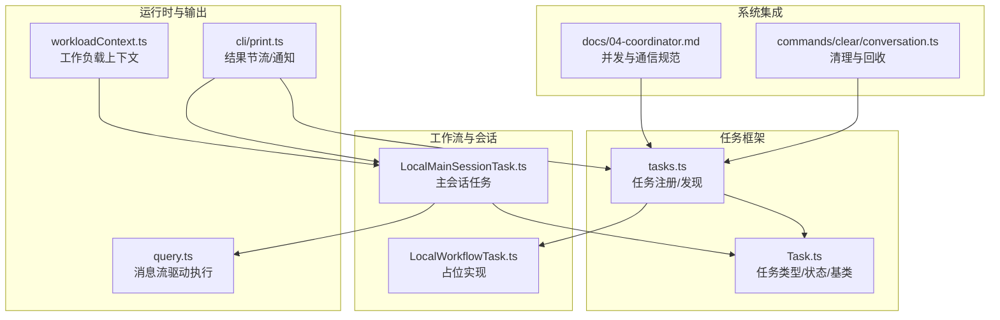
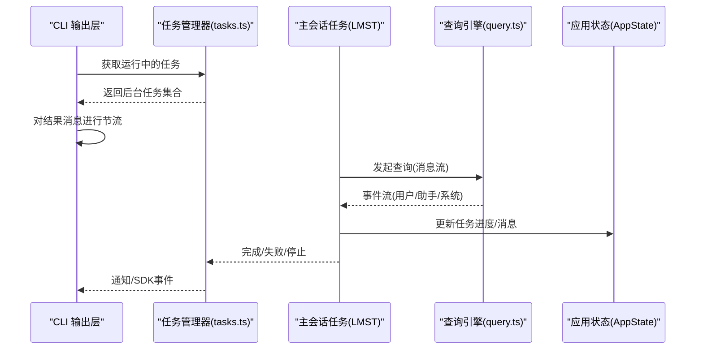
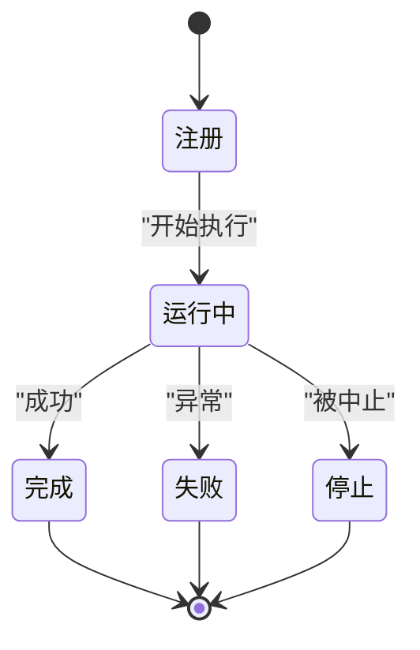
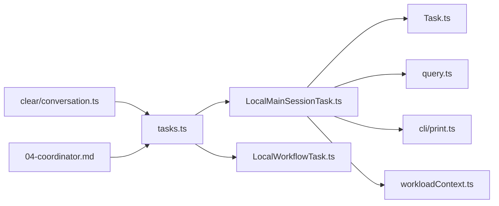

# 工作流任务

<cite>
**本文引用的文件**
- [src/Task.ts](file://src/Task.ts)
- [src/tasks.ts](file://src/tasks.ts)
- [src/tasks/LocalWorkflowTask/LocalWorkflowTask.ts](file://src/tasks/LocalWorkflowTask/LocalWorkflowTask.ts)
- [src/tasks/LocalMainSessionTask.ts](file://src/tasks/LocalMainSessionTask.ts)
- [src/cli/print.ts](file://src/cli/print.ts)
- [src/query.ts](file://src/query.ts)
- [src/utils/workloadContext.ts](file://src/utils/workloadContext.ts)
- [src/commands/clear/conversation.ts](file://src/commands/clear/conversation.ts)
- [docs/04-coordinator.md](file://docs/04-coordinator.md)
</cite>

## 目录
1. [简介](#简介)
2. [项目结构](#项目结构)
3. [核心组件](#核心组件)
4. [架构总览](#架构总览)
5. [详细组件分析](#详细组件分析)
6. [依赖关系分析](#依赖关系分析)
7. [性能考量](#性能考量)
8. [故障排查指南](#故障排查指南)
9. [结论](#结论)
10. [附录](#附录)

## 简介
本文件面向“工作流任务”的设计与实现，重点覆盖以下内容：
- LocalWorkflowTask 的设计原理与当前实现状态
- 主会话任务 LocalMainSessionTask 的职责、生命周期与状态跟踪
- 工作流任务的执行策略（并行、串行、条件分支）与与任务调度器的集成
- 错误处理、重试与回滚的最佳实践
- 通过源码路径定位关键实现点，便于进一步扩展与维护

## 项目结构
围绕工作流任务的关键模块分布如下：
- 通用任务抽象与类型定义位于 Task.ts
- 任务注册与发现位于 tasks.ts
- LocalWorkflowTask 当前为占位实现（占位符）
- LocalMainSessionTask 负责后台主会话查询的生命周期管理
- CLI 输出层对“后台任务”进行结果节流与通知
- 查询引擎 query.ts 提供消息流驱动的任务执行模型
- 工作负载上下文 workloadContext.ts 支持并发与隔离控制
- 清理会话时对任务进行清理与回收

图表来源
- [src/tasks.ts:1-39](file://src/tasks.ts#L1-L39)
- [src/Task.ts:1-125](file://src/Task.ts#L1-L125)
- [src/tasks/LocalWorkflowTask/LocalWorkflowTask.ts:1-6](file://src/tasks/LocalWorkflowTask/LocalWorkflowTask.ts#L1-L6)
- [src/tasks/LocalMainSessionTask.ts:1-480](file://src/tasks/LocalMainSessionTask.ts#L1-L480)
- [src/cli/print.ts:2216-2406](file://src/cli/print.ts#L2216-L2406)
- [src/query.ts:1134-1166](file://src/query.ts#L1134-L1166)
- [src/utils/workloadContext.ts:1-57](file://src/utils/workloadContext.ts#L1-L57)
- [src/commands/clear/conversation.ts:119-166](file://src/commands/clear/conversation.ts#L119-L166)
- [docs/04-coordinator.md:58-110](file://docs/04-coordinator.md#L58-L110)

章节来源
- [src/tasks.ts:1-39](file://src/tasks.ts#L1-L39)
- [src/Task.ts:1-125](file://src/Task.ts#L1-L125)

## 核心组件
- 任务类型与状态
  - 任务类型包含 local_workflow；状态涵盖 pending/running/completed/failed/killed
  - 终止态判断用于避免向已结束任务注入消息与清理孤儿任务
- 任务注册与发现
  - 通过 getAllTasks/getTaskByType 汇聚本地任务（含可选的 LocalWorkflowTask 与 MonitorMcpTask）

章节来源
- [src/Task.ts:6-29](file://src/Task.ts#L6-L29)
- [src/tasks.ts:22-39](file://src/tasks.ts#L22-L39)

## 架构总览
工作流任务的执行遵循“消息流驱动 + 任务状态机”的模式：
- 任务通过 registerTask 注册到全局状态
- 执行器（如 LocalMainSessionTask）基于 query.ts 的消息流推进任务进度
- CLI 层对“后台任务”进行结果节流，确保前台交互体验
- 工作负载上下文支持并发隔离与泄漏防护
- 清理流程在会话清空时回收任务资源

图表来源
- [src/cli/print.ts:2216-2406](file://src/cli/print.ts#L2216-L2406)
- [src/tasks.ts:22-39](file://src/tasks.ts#L22-L39)
- [src/tasks/LocalMainSessionTask.ts:338-479](file://src/tasks/LocalMainSessionTask.ts#L338-L479)
- [src/query.ts:1134-1166](file://src/query.ts#L1134-L1166)

## 详细组件分析

### LocalWorkflowTask 设计与现状
- 设计目标
  - 作为本地工作流编排入口，负责步骤管理与状态跟踪
  - 支持并行/串行/条件分支等执行策略
  - 与任务调度器集成，实现资源协调与生命周期管理
- 当前实现
  - 文件存在但仅包含占位类型与判定函数，未见实际执行逻辑
  - 任务注册受特性开关控制，需启用相应功能后才会被加入任务列表
- 建议扩展方向
  - 引入工作流图数据结构与节点执行器
  - 实现步骤间依赖解析与拓扑排序
  - 提供条件分支与循环控制的语义
  - 集成错误处理、重试与回滚机制
  - 与 CLI/SDK 事件队列对接，提供进度与结果通知

章节来源
- [src/tasks/LocalWorkflowTask/LocalWorkflowTask.ts:1-6](file://src/tasks/LocalWorkflowTask/LocalWorkflowTask.ts#L1-L6)
- [src/tasks.ts:9-11](file://src/tasks.ts#L9-L11)

### LocalMainSessionTask：主会话任务
- 角色与职责
  - 处理用户在查询过程中触发“后台化”的场景
  - 复用本地代理任务的状态结构，使用专用 agentType
  - 在后台继续执行查询，完成后发送通知或 SDK 事件
- 生命周期
  - 注册：生成任务 ID、初始化输出链接、注册清理钩子、设置初始状态
  - 执行：基于 query 的消息流增量记录转录、统计工具使用次数与令牌数、更新进度
  - 完成：根据成功与否标记状态、清理输出、按是否后台化决定通知策略
  - 前台化：将后台任务切换为前台显示其累积消息
- 关键接口
  - registerMainSessionTask：注册后台任务
  - startBackgroundSession：启动独立后台会话
  - completeMainSessionTask：完成并通知
  - foregroundMainSessionTask：前台化
  - isMainSessionTask：类型守卫

图表来源
- [src/tasks/LocalMainSessionTask.ts:94-162](file://src/tasks/LocalMainSessionTask.ts#L94-L162)
- [src/tasks/LocalMainSessionTask.ts:168-219](file://src/tasks/LocalMainSessionTask.ts#L168-L219)
- [src/tasks/LocalMainSessionTask.ts:270-302](file://src/tasks/LocalMainSessionTask.ts#L270-L302)

章节来源
- [src/tasks/LocalMainSessionTask.ts:1-480](file://src/tasks/LocalMainSessionTask.ts#L1-L480)

### 执行策略与调度集成
- 并行策略
  - 协调器文档给出“只读任务自由并行、写操作互斥、验证任务可跨区域并行”的规则
  - 该规则适用于多 Worker 场景下的并发约束
- 串行与条件分支
  - LocalWorkflowTask 当前为空实现，尚未体现串行/条件分支的执行图
  - 建议引入 DAG 与条件节点，结合状态机实现分支选择与汇聚
- 与任务调度器的集成
  - 通过 tasks.ts 的注册机制统一纳入调度器
  - CLI 层对“后台任务”进行结果节流，避免前台阻塞
  - 工作负载上下文提供并发隔离边界，防止上下文泄漏

章节来源
- [docs/04-coordinator.md:74-110](file://docs/04-coordinator.md#L74-L110)
- [src/cli/print.ts:2216-2406](file://src/cli/print.ts#L2216-L2406)
- [src/utils/workloadContext.ts:1-57](file://src/utils/workloadContext.ts#L1-L57)
- [src/tasks.ts:22-39](file://src/tasks.ts#L22-L39)

### 代码示例（以路径代替代码片段）
- 创建与注册主会话任务
  - [src/tasks/LocalMainSessionTask.ts:94-162](file://src/tasks/LocalMainSessionTask.ts#L94-L162)
- 启动后台会话
  - [src/tasks/LocalMainSessionTask.ts:338-479](file://src/tasks/LocalMainSessionTask.ts#L338-L479)
- 完成并通知
  - [src/tasks/LocalMainSessionTask.ts:168-219](file://src/tasks/LocalMainSessionTask.ts#L168-L219)
- 前台化查看
  - [src/tasks/LocalMainSessionTask.ts:270-302](file://src/tasks/LocalMainSessionTask.ts#L270-L302)
- 查询消息流推进
  - [src/query.ts:1134-1166](file://src/query.ts#L1134-L1166)
- 结果节流与通知
  - [src/cli/print.ts:2216-2406](file://src/cli/print.ts#L2216-L2406)

## 依赖关系分析
- 组件耦合
  - LocalMainSessionTask 依赖 Task.ts 的状态基类与任务 ID 生成
  - 依赖 query.ts 的消息流驱动执行
  - 依赖 CLI 层的结果节流与通知机制
  - 依赖工作负载上下文进行并发隔离
- 外部依赖与集成点
  - 特性开关控制 LocalWorkflowTask 的加载
  - 清理会话时对任务进行回收与清理

图表来源
- [src/tasks/LocalMainSessionTask.ts:1-52](file://src/tasks/LocalMainSessionTask.ts#L1-L52)
- [src/Task.ts:1-125](file://src/Task.ts#L1-L125)
- [src/cli/print.ts:2216-2406](file://src/cli/print.ts#L2216-L2406)
- [src/utils/workloadContext.ts:1-57](file://src/utils/workloadContext.ts#L1-L57)
- [src/tasks.ts:1-39](file://src/tasks.ts#L1-L39)
- [src/commands/clear/conversation.ts:119-166](file://src/commands/clear/conversation.ts#L119-L166)
- [docs/04-coordinator.md:58-110](file://docs/04-coordinator.md#L58-L110)

章节来源
- [src/tasks.ts:1-39](file://src/tasks.ts#L1-L39)
- [src/tasks/LocalMainSessionTask.ts:1-52](file://src/tasks/LocalMainSessionTask.ts#L1-L52)

## 性能考量
- 后台任务节流
  - CLI 层在存在后台任务时延迟输出结果，避免 UI 卡顿
- 进度更新去抖
  - 仅在令牌数/工具使用数变化或消息数组变更时才更新状态，减少渲染压力
- 资源隔离
  - 工作负载上下文通过 ALS 建立隔离边界，防止泄漏导致的上下文污染
- 清理与回收
  - 清理会话时对任务进行回收，释放输出链接与清理钩子，降低内存占用

章节来源
- [src/cli/print.ts:2216-2406](file://src/cli/print.ts#L2216-L2406)
- [src/utils/workloadContext.ts:32-57](file://src/utils/workloadContext.ts#L32-L57)
- [src/commands/clear/conversation.ts:119-166](file://src/commands/clear/conversation.ts#L119-L166)

## 故障排查指南
- 后台任务无结果
  - 检查是否存在仍在运行的后台任务，CLI 层会对结果进行节流
  - 确认任务状态是否为终止态，避免向已结束任务注入消息
- 任务未被清理
  - 清理会话时会尝试中止/清理前台任务，后台任务会被保留
  - 如需强制清理，检查任务的清理钩子是否正确注册与注销
- 上下文泄漏
  - 使用工作负载上下文时，确认每次调用都建立新的 ALS 边界
- 通知缺失
  - 若任务已前台化，不会发送后台通知；可通过 SDK 事件确认任务结束

章节来源
- [src/cli/print.ts:2216-2406](file://src/cli/print.ts#L2216-L2406)
- [src/Task.ts:22-29](file://src/Task.ts#L22-L29)
- [src/utils/workloadContext.ts:32-57](file://src/utils/workloadContext.ts#L32-L57)
- [src/commands/clear/conversation.ts:119-166](file://src/commands/clear/conversation.ts#L119-L166)

## 结论
- LocalWorkflowTask 当前处于占位阶段，建议尽快补齐执行图、并行/串行/条件分支与错误处理能力
- LocalMainSessionTask 已具备完整的生命周期管理与通知机制，适合作为工作流任务的参考实现
- 通过 CLI 节流、工作负载上下文与清理流程，系统在并发与资源管理方面具备良好基础
- 下一步建议优先完善 LocalWorkflowTask 的核心执行逻辑，并与现有任务框架与 CLI 体系深度集成

## 附录
- 相关文档与规范
  - 协调器并发与通信机制：[docs/04-coordinator.md:58-110](file://docs/04-coordinator.md#L58-L110)
- 关键实现路径索引
  - 任务类型与状态：[src/Task.ts:1-125](file://src/Task.ts#L1-L125)
  - 任务注册与发现：[src/tasks.ts:1-39](file://src/tasks.ts#L1-L39)
  - 主会话任务：[src/tasks/LocalMainSessionTask.ts:1-480](file://src/tasks/LocalMainSessionTask.ts#L1-L480)
  - 查询消息流：[src/query.ts:1134-1166](file://src/query.ts#L1134-L1166)
  - CLI 结果节流：[src/cli/print.ts:2216-2406](file://src/cli/print.ts#L2216-L2406)
  - 工作负载上下文：[src/utils/workloadContext.ts:1-57](file://src/utils/workloadContext.ts#L1-L57)
  - 清理会话：[src/commands/clear/conversation.ts:119-166](file://src/commands/clear/conversation.ts#L119-L166)