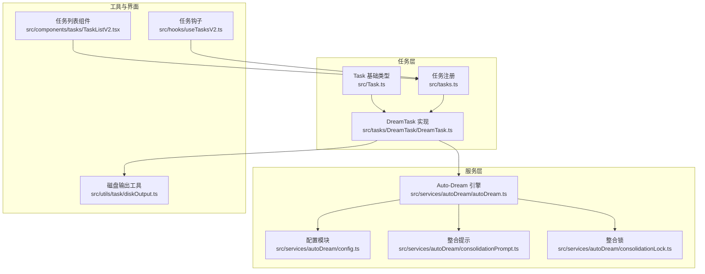
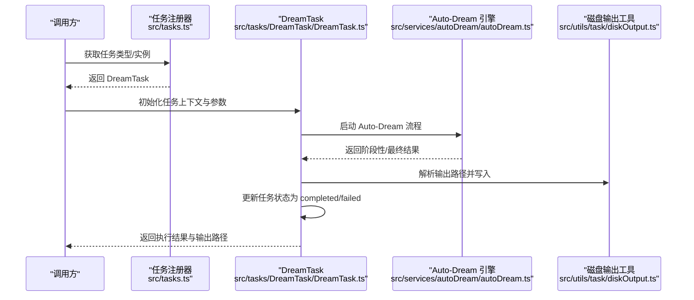
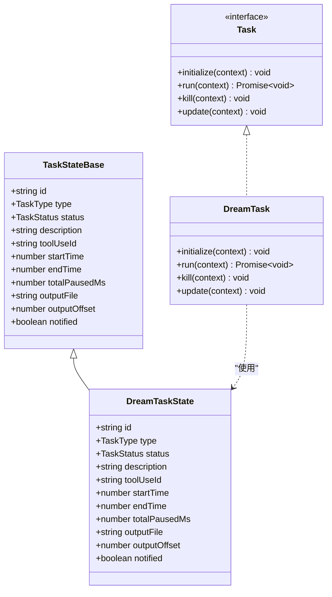
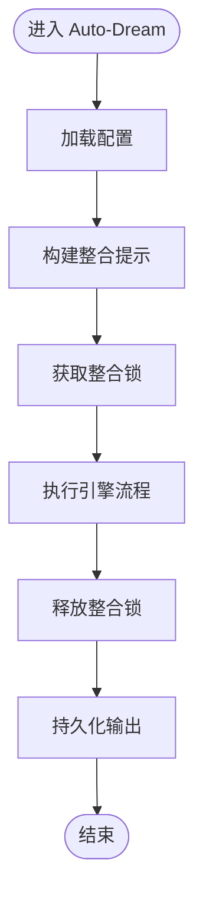
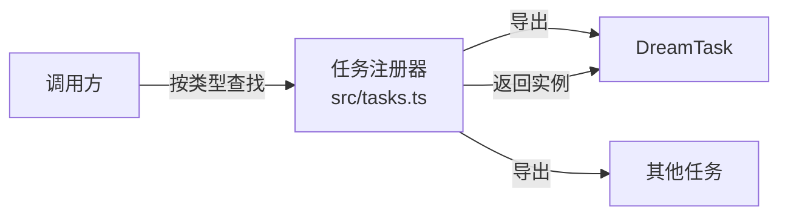
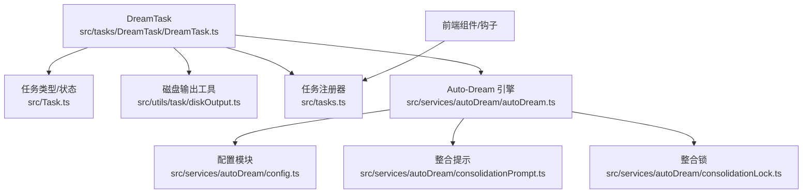

# 梦境任务

<cite>
**本文引用的文件**
- [src/Task.ts](file://src/Task.ts)
- [src/tasks.ts](file://src/tasks.ts)
- [src/tasks/DreamTask/DreamTask.ts](file://src/tasks/DreamTask/DreamTask.ts)
- [src/services/autoDream/autoDream.ts](file://src/services/autoDream/autoDream.ts)
- [src/services/autoDream/config.ts](file://src/services/autoDream/config.ts)
- [src/services/autoDream/consolidationPrompt.ts](file://src/services/autoDream/consolidationPrompt.ts)
- [src/services/autoDream/consolidationLock.ts](file://src/services/autoDream/consolidationLock.ts)
- [src/utils/task/diskOutput.ts](file://src/utils/task/diskOutput.ts)
- [src/tools.ts](file://src/tools.ts)
- [src/components/tasks/TaskListV2.tsx](file://src/components/tasks/TaskListV2.tsx)
- [src/hooks/useTasksV2.ts](file://src/hooks/useTasksV2.ts)
</cite>

## 目录
1. [引言](#引言)
2. [项目结构](#项目结构)
3. [核心组件](#核心组件)
4. [架构总览](#架构总览)
5. [详细组件分析](#详细组件分析)
6. [依赖分析](#依赖分析)
7. [性能考虑](#性能考虑)
8. [故障排查指南](#故障排查指南)
9. [结论](#结论)
10. [附录](#附录)

## 引言
本文件系统性阐述“梦境任务”（DreamTask）的设计目标、运行机制与工程实现，重点覆盖以下方面：
- 设计目的与应用场景：在 AI 梦境生成、创意探索与智能推理中承担核心角色，通过自动化的提示工程与整合流程提升创造性输出质量与稳定性。
- 执行流程：从任务初始化、状态管理到输出落盘与清理回收的全链路。
- 参数配置与结果处理：如何通过配置模块与磁盘输出工具进行参数化控制与结果持久化。
- 协作关系与数据流：与 Auto-Dream 引擎、整合提示与整合锁等服务的协同方式。
- 性能优化、错误处理与调试方法：结合任务状态机与工具层抽象给出可操作建议。
- 最佳实践与注意事项：面向不同使用场景的落地建议。

## 项目结构
DreamTask 属于任务体系的一部分，位于 tasks 子目录；其核心逻辑与类型定义如下：
- 任务类型与基础状态：定义于 [src/Task.ts](file://src/Task.ts)，包含任务类型枚举、状态枚举与通用状态基类。
- 任务注册与发现：在 [src/tasks.ts](file://src/tasks.ts) 中集中导出并注册 DreamTask，便于上层统一调度。
- 任务实现：DreamTask 的具体实现位于 [src/tasks/DreamTask/DreamTask.ts](file://src/tasks/DreamTask/DreamTask.ts)。
- 自动化梦境服务：Auto-Dream 引擎及相关配置、整合提示与整合锁位于 [src/services/autoDream/](file://src/services/autoDream/)。
- 输出落盘：任务输出路径解析由 [src/utils/task/diskOutput.ts](file://src/utils/task/diskOutput.ts) 提供。
- 前端集成：任务列表与钩子用于在界面层呈现与交互，参考 [src/components/tasks/TaskListV2.tsx](file://src/components/tasks/TaskListV2.tsx) 与 [src/hooks/useTasksV2.ts](file://src/hooks/useTasksV2.ts)。

图表来源
- [src/Task.ts:1-57](file://src/Task.ts#L1-L57)
- [src/tasks.ts:17-39](file://src/tasks.ts#L17-L39)
- [src/tasks/DreamTask/DreamTask.ts:131-160](file://src/tasks/DreamTask/DreamTask.ts#L131-L160)
- [src/services/autoDream/autoDream.ts](file://src/services/autoDream/autoDream.ts)
- [src/services/autoDream/config.ts](file://src/services/autoDream/config.ts)
- [src/services/autoDream/consolidationPrompt.ts](file://src/services/autoDream/consolidationPrompt.ts)
- [src/services/autoDream/consolidationLock.ts](file://src/services/autoDream/consolidationLock.ts)
- [src/utils/task/diskOutput.ts](file://src/utils/task/diskOutput.ts)
- [src/components/tasks/TaskListV2.tsx](file://src/components/tasks/TaskListV2.tsx)
- [src/hooks/useTasksV2.ts](file://src/hooks/useTasksV2.ts)

章节来源
- [src/Task.ts:1-57](file://src/Task.ts#L1-L57)
- [src/tasks.ts:17-39](file://src/tasks.ts#L17-L39)

## 核心组件
- 任务类型与状态
  - 类型枚举包含 dream 等任务类型，状态涵盖 pending、running、completed、failed、killed 等。
  - 终止态判断函数用于避免对已完成任务继续注入消息或清理路径。
- 任务上下文
  - 包含 AbortController、获取/设置应用状态的方法，为任务生命周期内的中断与状态变更提供支撑。
- 任务状态基类
  - 统一字段：id、type、status、description、toolUseId、时间戳、输出路径与偏移、通知标记等。
- DreamTask 实现
  - 定义 DreamTaskState 并实现 Task 接口，包含初始化、执行、状态更新与清理等关键步骤。
- Auto-Dream 服务
  - 引擎负责自动化提示与整合流程；配置模块提供参数化开关；整合提示与整合锁保障多轮对话的连贯性与一致性。

章节来源
- [src/Task.ts:6-57](file://src/Task.ts#L6-L57)
- [src/tasks/DreamTask/DreamTask.ts:24-160](file://src/tasks/DreamTask/DreamTask.ts#L24-L160)
- [src/services/autoDream/autoDream.ts](file://src/services/autoDream/autoDream.ts)
- [src/services/autoDream/config.ts](file://src/services/autoDream/config.ts)
- [src/services/autoDream/consolidationPrompt.ts](file://src/services/autoDream/consolidationPrompt.ts)
- [src/services/autoDream/consolidationLock.ts](file://src/services/autoDream/consolidationLock.ts)

## 架构总览
DreamTask 的执行围绕“任务状态机 + 服务编排”的模式展开：
- 任务入口：通过任务注册器集中暴露 DreamTask，便于上层按类型检索与启动。
- 任务执行：在任务上下文中调用 Auto-Dream 引擎，结合配置与整合提示完成一轮或多轮的创造性输出。
- 结果落盘：利用磁盘输出工具生成稳定的结果文件路径，并记录输出偏移，支持后续续写与回溯。
- 状态流转：严格遵循任务状态机，确保任务在终止态后不再被修改，避免资源泄漏与竞态。

图表来源
- [src/tasks.ts:22-39](file://src/tasks.ts#L22-L39)
- [src/tasks/DreamTask/DreamTask.ts:60-160](file://src/tasks/DreamTask/DreamTask.ts#L60-L160)
- [src/services/autoDream/autoDream.ts](file://src/services/autoDream/autoDream.ts)
- [src/utils/task/diskOutput.ts](file://src/utils/task/diskOutput.ts)

## 详细组件分析

### DreamTask 类与状态模型
- 状态模型
  - 基于 TaskStateBase 扩展，包含任务标识、类型、状态、描述、时间戳、输出路径与偏移、通知标记等字段。
- 执行流程
  - 初始化：生成任务 ID、解析输出路径、记录开始时间。
  - 运行：在任务上下文中调用 Auto-Dream 引擎，传入配置与整合提示，等待引擎返回结果。
  - 结束：根据执行结果更新状态为 completed 或 failed，并记录结束时间与输出偏移。
  - 清理：提供可选清理回调，释放资源或触发后续动作。
- 关键接口
  - initialize：初始化任务状态与输出路径。
  - run：执行核心逻辑，调用引擎并处理结果。
  - kill：终止任务并清理。
  - update：更新任务状态与元信息。

图表来源
- [src/Task.ts:44-57](file://src/Task.ts#L44-L57)
- [src/tasks/DreamTask/DreamTask.ts:24-160](file://src/tasks/DreamTask/DreamTask.ts#L24-L160)

章节来源
- [src/tasks/DreamTask/DreamTask.ts:24-160](file://src/tasks/DreamTask/DreamTask.ts#L24-L160)
- [src/Task.ts:44-57](file://src/Task.ts#L44-L57)

### Auto-Dream 引擎与整合流程
- Auto-Dream 引擎
  - 负责自动化提示工程与多轮整合，结合配置模块与整合提示生成高质量输出。
- 配置模块
  - 提供参数化开关与默认值，影响引擎行为与输出风格。
- 整合提示
  - 四阶段提示模板，确保输出在不同阶段保持一致性与连贯性。
- 整合锁
  - 控制并发整合过程，避免竞争条件与重复计算。

图表来源
- [src/services/autoDream/autoDream.ts](file://src/services/autoDream/autoDream.ts)
- [src/services/autoDream/config.ts](file://src/services/autoDream/config.ts)
- [src/services/autoDream/consolidationPrompt.ts](file://src/services/autoDream/consolidationPrompt.ts)
- [src/services/autoDream/consolidationLock.ts](file://src/services/autoDream/consolidationLock.ts)

章节来源
- [src/services/autoDream/autoDream.ts](file://src/services/autoDream/autoDream.ts)
- [src/services/autoDream/config.ts](file://src/services/autoDream/config.ts)
- [src/services/autoDream/consolidationPrompt.ts](file://src/services/autoDream/consolidationPrompt.ts)
- [src/services/autoDream/consolidationLock.ts](file://src/services/autoDream/consolidationLock.ts)

### 任务注册与发现
- 任务注册器集中导出 DreamTask，并提供按类型查找的任务实例。
- 该模式保证了任务的统一管理与扩展点，便于新增任务类型时无需改动上层调用逻辑。

图表来源
- [src/tasks.ts:22-39](file://src/tasks.ts#L22-L39)

章节来源
- [src/tasks.ts:22-39](file://src/tasks.ts#L22-L39)

### 输出路径与落盘
- 输出路径解析
  - 使用磁盘输出工具生成稳定的输出文件路径，确保任务结果可追溯与可复用。
- 输出偏移
  - 记录当前输出偏移，支持增量写入与断点续写。
- 通知标记
  - 控制是否向外部组件发出通知，避免重复或无效通知。

章节来源
- [src/utils/task/diskOutput.ts](file://src/utils/task/diskOutput.ts)
- [src/tasks/DreamTask/DreamTask.ts:60-160](file://src/tasks/DreamTask/DreamTask.ts#L60-L160)

### 前端集成与交互
- 任务列表组件
  - 在界面层展示任务状态、描述与进度，便于用户监控 DreamTask 的执行情况。
- 任务钩子
  - 通过钩子订阅任务状态变化，驱动 UI 更新与交互反馈。

章节来源
- [src/components/tasks/TaskListV2.tsx](file://src/components/tasks/TaskListV2.tsx)
- [src/hooks/useTasksV2.ts](file://src/hooks/useTasksV2.ts)

## 依赖分析
- 内部依赖
  - DreamTask 依赖任务基础类型与状态机，依赖磁盘输出工具进行结果落盘。
  - 任务注册器集中管理所有任务类型，包括 DreamTask。
- 外部服务依赖
  - Auto-Dream 引擎作为核心执行单元，依赖配置、整合提示与整合锁。
- 耦合与内聚
  - DreamTask 与 Auto-Dream 引擎之间为高内聚低耦合：DreamTask 负责生命周期与状态管理，引擎负责业务逻辑。
  - 任务注册器与前端组件分别承担“发现/调度”和“展示/交互”的职责，边界清晰。

图表来源
- [src/tasks/DreamTask/DreamTask.ts:24-160](file://src/tasks/DreamTask/DreamTask.ts#L24-L160)
- [src/Task.ts:1-57](file://src/Task.ts#L1-L57)
- [src/utils/task/diskOutput.ts](file://src/utils/task/diskOutput.ts)
- [src/tasks.ts:17-39](file://src/tasks.ts#L17-L39)
- [src/services/autoDream/autoDream.ts](file://src/services/autoDream/autoDream.ts)
- [src/services/autoDream/config.ts](file://src/services/autoDream/config.ts)
- [src/services/autoDream/consolidationPrompt.ts](file://src/services/autoDream/consolidationPrompt.ts)
- [src/services/autoDream/consolidationLock.ts](file://src/services/autoDream/consolidationLock.ts)

章节来源
- [src/tasks/DreamTask/DreamTask.ts:24-160](file://src/tasks/DreamTask/DreamTask.ts#L24-L160)
- [src/Task.ts:1-57](file://src/Task.ts#L1-L57)
- [src/tasks.ts:17-39](file://src/tasks.ts#L17-L39)

## 性能考虑
- 状态机与终止态保护
  - 利用终止态判断函数避免对已完成任务进行无意义的状态更新，减少不必要的 UI 刷新与资源占用。
- 输出落盘优化
  - 通过输出偏移与增量写入降低磁盘 IO 压力；合理设置输出路径以避免跨盘符写入带来的性能损耗。
- 引擎并发控制
  - 整合锁确保并发安全，避免重复计算与资源争用；在高负载场景下建议限制并发数量。
- 前端渲染节流
  - 任务列表与钩子应采用节流/防抖策略，避免频繁重渲染导致的卡顿。

## 故障排查指南
- 常见问题定位
  - 任务未更新状态：检查状态更新函数调用链与终止态保护逻辑。
  - 输出为空或异常：核对输出路径解析与权限，确认磁盘空间充足。
  - 引擎执行失败：查看 Auto-Dream 引擎日志与配置项，确认整合提示与整合锁状态。
- 调试建议
  - 在任务初始化与运行阶段添加关键节点的日志输出，便于回溯执行路径。
  - 使用前端任务钩子观察状态变化，快速定位异常阶段。
- 错误处理策略
  - 对异常进行分类（初始化失败、引擎异常、落盘失败），分别采取重试、降级或终止策略。
  - 在任务上下文中正确传递 AbortController，确保可中断与可清理。

章节来源
- [src/Task.ts:27-29](file://src/Task.ts#L27-L29)
- [src/tasks/DreamTask/DreamTask.ts:60-160](file://src/tasks/DreamTask/DreamTask.ts#L60-L160)
- [src/services/autoDream/autoDream.ts](file://src/services/autoDream/autoDream.ts)

## 结论
DreamTask 将任务生命周期管理与 Auto-Dream 引擎有机结合，形成一套可扩展、可维护且具备良好用户体验的创造性工作流。通过明确的类型与状态模型、规范的注册与发现机制、稳健的输出落盘策略以及与前端的紧密集成，DreamTask 能够在 AI 梦境生成、创意探索与智能推理场景中发挥重要作用。建议在实际部署中关注并发控制、输出路径与权限、日志可观测性与前端渲染性能，以获得更佳的稳定性与体验。

## 附录
- 代码示例路径（不展示具体代码内容）
  - 创建与配置 DreamTask 实例：参见 [src/tasks/DreamTask/DreamTask.ts](file://src/tasks/DreamTask/DreamTask.ts)
  - 任务类型与状态定义：参见 [src/Task.ts](file://src/Task.ts)
  - 任务注册与发现：参见 [src/tasks.ts](file://src/tasks.ts)
  - Auto-Dream 引擎与配置：参见 [src/services/autoDream/autoDream.ts](file://src/services/autoDream/autoDream.ts)、[src/services/autoDream/config.ts](file://src/services/autoDream/config.ts)
  - 整合提示与整合锁：参见 [src/services/autoDream/consolidationPrompt.ts](file://src/services/autoDream/consolidationPrompt.ts)、[src/services/autoDream/consolidationLock.ts](file://src/services/autoDream/consolidationLock.ts)
  - 输出路径解析：参见 [src/utils/task/diskOutput.ts](file://src/utils/task/diskOutput.ts)
  - 前端任务列表与钩子：参见 [src/components/tasks/TaskListV2.tsx](file://src/components/tasks/TaskListV2.tsx)、[src/hooks/useTasksV2.ts](file://src/hooks/useTasksV2.ts)