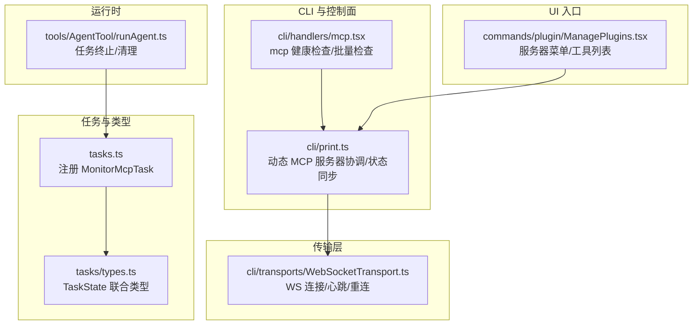
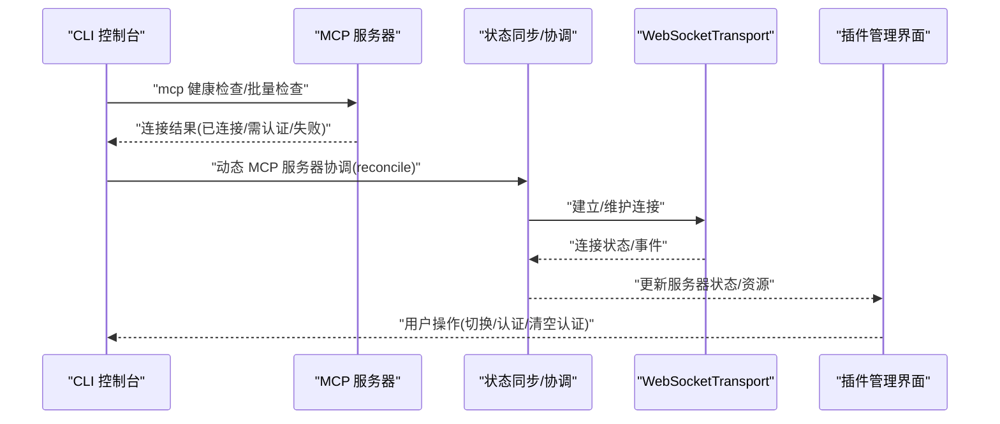
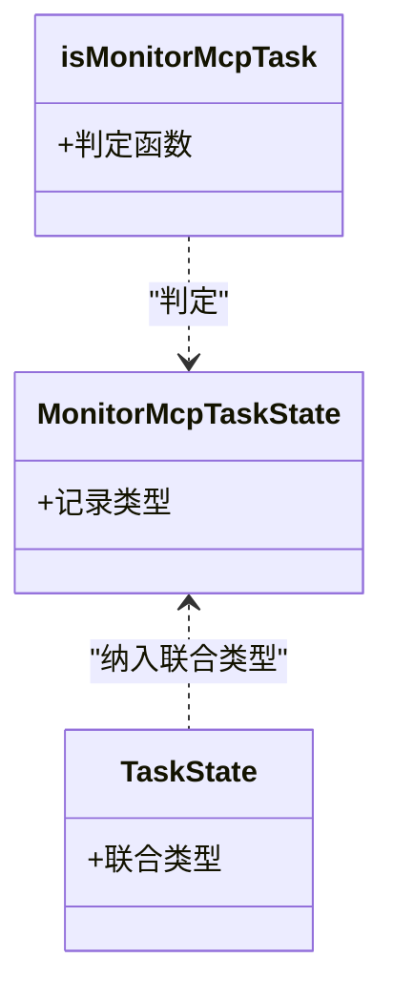
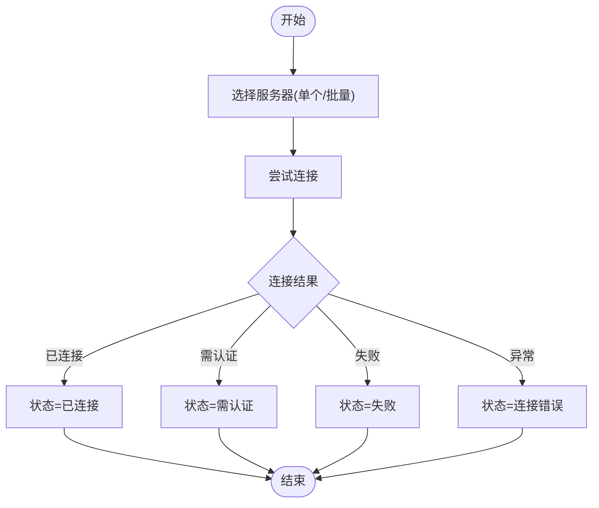
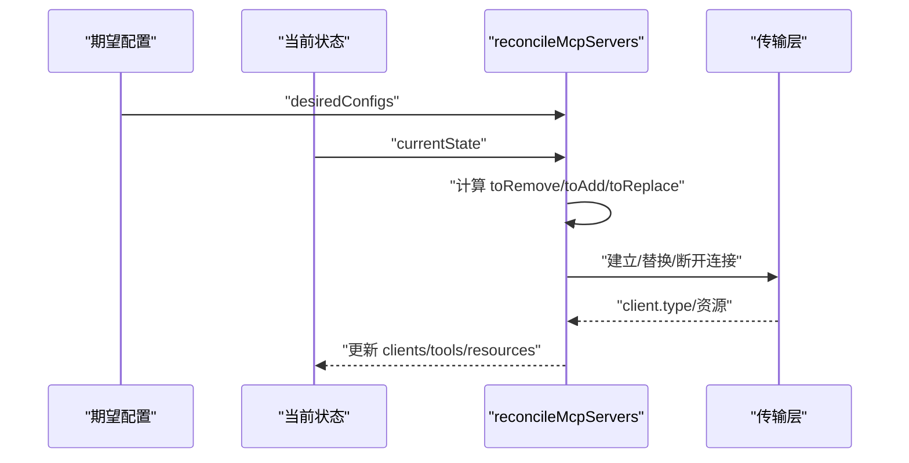
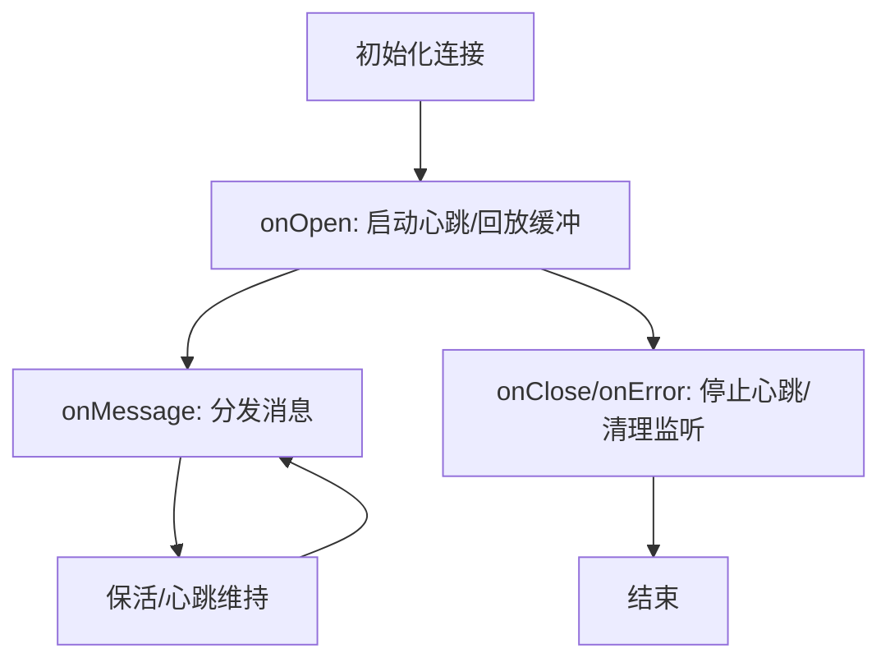
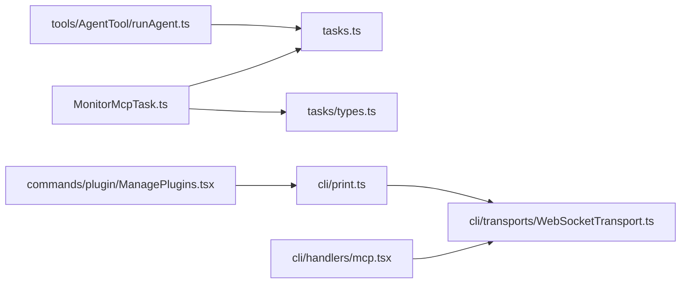

# 监控任务

<cite>
**本文引用的文件**
- [src/tasks/MonitorMcpTask/MonitorMcpTask.ts](file://src/tasks/MonitorMcpTask/MonitorMcpTask.ts)
- [src/tasks/types.ts](file://src/tasks/types.ts)
- [src/tasks.ts](file://src/tasks.ts)
- [src/cli/handlers/mcp.tsx](file://src/cli/handlers/mcp.tsx)
- [src/cli/print.ts](file://src/cli/print.ts)
- [src/cli/transports/WebSocketTransport.ts](file://src/cli/transports/WebSocketTransport.ts)
- [src/commands/plugin/ManagePlugins.tsx](file://src/commands/plugin/ManagePlugins.tsx)
- [src/tools/AgentTool/runAgent.ts](file://src/tools/AgentTool/runAgent.ts)
</cite>

## 目录
1. [简介](#简介)
2. [项目结构](#项目结构)
3. [核心组件](#核心组件)
4. [架构总览](#架构总览)
5. [详细组件分析](#详细组件分析)
6. [依赖分析](#依赖分析)
7. [性能考虑](#性能考虑)
8. [故障排查指南](#故障排查指南)
9. [结论](#结论)
10. [附录](#附录)

## 简介
本文件面向“监控任务”的技术文档，聚焦于 MonitorMcpTask 的设计目的与实现原理，涵盖 MCP 服务器监控、连接状态检查与性能指标采集机制；解释监控任务的数据采集（定时采样）、异常检测与告警触发策略；阐述监控任务与 MCP 系统的集成方式与通信协议；并提供配置与使用示例路径、监控数据的存储与分析流程、可视化建议，以及性能优化、阈值设置与故障诊断的最佳实践。

根据仓库现有代码，MonitorMcpTask 当前仅包含基础类型与判定逻辑，未见具体监控实现。本文将基于现有 MCP 连接、健康检查与传输层能力，给出可落地的监控方案与集成路径。

## 项目结构
围绕“监控任务”，相关代码主要分布在以下模块：
- 任务注册与类型：tasks.ts、tasks/types.ts
- MCP 监控与健康检查：cli/handlers/mcp.tsx
- 动态 MCP 服务器管理与状态同步：cli/print.ts
- 传输层与连接稳定性：cli/transports/WebSocketTransport.ts
- UI 展示与菜单入口：commands/plugin/ManagePlugins.tsx
- 任务生命周期与终止：tools/AgentTool/runAgent.ts

图表来源
- [src/tasks.ts:12-31](file://src/tasks.ts#L12-L31)
- [src/tasks/types.ts:12-29](file://src/tasks/types.ts#L12-L29)
- [src/cli/handlers/mcp.tsx:26-39](file://src/cli/handlers/mcp.tsx#L26-L39)
- [src/cli/print.ts:5450-5479](file://src/cli/print.ts#L5450-L5479)
- [src/cli/transports/WebSocketTransport.ts:170-386](file://src/cli/transports/WebSocketTransport.ts#L170-L386)
- [src/commands/plugin/ManagePlugins.tsx:1972-2002](file://src/commands/plugin/ManagePlugins.tsx#L1972-L2002)
- [src/tools/AgentTool/runAgent.ts:850-851](file://src/tools/AgentTool/runAgent.ts#L850-L851)

章节来源
- [src/tasks.ts:12-31](file://src/tasks.ts#L12-L31)
- [src/tasks/types.ts:12-29](file://src/tasks/types.ts#L12-L29)
- [src/cli/handlers/mcp.tsx:26-39](file://src/cli/handlers/mcp.tsx#L26-L39)
- [src/cli/print.ts:5450-5479](file://src/cli/print.ts#L5450-L5479)
- [src/cli/transports/WebSocketTransport.ts:170-386](file://src/cli/transports/WebSocketTransport.ts#L170-L386)
- [src/commands/plugin/ManagePlugins.tsx:1972-2002](file://src/commands/plugin/ManagePlugins.tsx#L1972-L2002)
- [src/tools/AgentTool/runAgent.ts:850-851](file://src/tools/AgentTool/runAgent.ts#L850-L851)

## 核心组件
- MonitorMcpTask 类型与判定
  - MonitorMcpTaskState 为通用记录类型，用于承载监控任务的状态字段。
  - isMonitorMcpTask 判定函数当前返回固定值，表明该任务在当前版本中尚未启用或未实现。
- 任务注册与发现
  - tasks.ts 中通过特性开关加载 MonitorMcpTask，并将其纳入任务集合。
  - tasks/types.ts 将 MonitorMcpTaskState 纳入 TaskState 联合类型，确保上层组件可统一处理。

章节来源
- [src/tasks/MonitorMcpTask/MonitorMcpTask.ts:1-6](file://src/tasks/MonitorMcpTask/MonitorMcpTask.ts#L1-L6)
- [src/tasks/types.ts:9-18](file://src/tasks/types.ts#L9-L18)
- [src/tasks.ts:12-31](file://src/tasks.ts#L12-L31)

## 架构总览
下图展示了 MCP 监控从 CLI 触发到传输层连接、再到状态同步的整体流程。CLI 提供健康检查与批量检查；print 模块负责动态服务器的增删改与状态同步；传输层负责连接建立、心跳与重连；UI 提供服务器菜单与工具列表入口；Agent 运行时负责任务生命周期管理。

图表来源
- [src/cli/handlers/mcp.tsx:26-39](file://src/cli/handlers/mcp.tsx#L26-L39)
- [src/cli/print.ts:5450-5479](file://src/cli/print.ts#L5450-L5479)
- [src/cli/transports/WebSocketTransport.ts:170-386](file://src/cli/transports/WebSocketTransport.ts#L170-L386)
- [src/commands/plugin/ManagePlugins.tsx:1972-2002](file://src/commands/plugin/ManagePlugins.tsx#L1972-L2002)

## 详细组件分析

### 组件一：MonitorMcpTask（当前实现）
- 设计目的
  - 作为未来 MCP 监控任务的占位符，提供统一的任务类型与判定接口，便于后续扩展。
- 实现现状
  - 仅定义了状态类型与判定函数，未包含实际监控逻辑。
- 集成点
  - 通过 tasks.ts 注册；被 tasks/types.ts 的 TaskState 联合类型收录。

图表来源
- [src/tasks/MonitorMcpTask/MonitorMcpTask.ts:1-6](file://src/tasks/MonitorMcpTask/MonitorMcpTask.ts#L1-L6)
- [src/tasks/types.ts:12-29](file://src/tasks/types.ts#L12-L29)

章节来源
- [src/tasks/MonitorMcpTask/MonitorMcpTask.ts:1-6](file://src/tasks/MonitorMcpTask/MonitorMcpTask.ts#L1-L6)
- [src/tasks/types.ts:9-18](file://src/tasks/types.ts#L9-L18)
- [src/tasks.ts:12-31](file://src/tasks.ts#L12-L31)

### 组件二：MCP 健康检查与批量检查（CLI）
- 功能要点
  - 单个服务器健康检查：根据连接结果返回“已连接/需认证/失败/连接错误”等状态。
  - 批量检查：并发对多个服务器执行健康检查，并按类型输出信息。
- 关键行为
  - 使用连接器尝试建立连接，依据返回类型判断状态。
  - 并发度受连接批次大小限制，避免资源争用。

图表来源
- [src/cli/handlers/mcp.tsx:26-39](file://src/cli/handlers/mcp.tsx#L26-L39)
- [src/cli/handlers/mcp.tsx:156-185](file://src/cli/handlers/mcp.tsx#L156-L185)

章节来源
- [src/cli/handlers/mcp.tsx:26-39](file://src/cli/handlers/mcp.tsx#L26-L39)
- [src/cli/handlers/mcp.tsx:156-185](file://src/cli/handlers/mcp.tsx#L156-L185)

### 组件三：动态 MCP 服务器协调与状态同步（print）
- 功能要点
  - 对比期望配置与当前状态，计算需要移除、新增与替换的服务器。
  - 在状态变更时更新客户端、工具与资源映射。
  - 处理通道启用、认证、切换与清空认证等请求。
- 关键行为
  - 使用并发映射处理多服务器协调，提升吞吐。
  - 在连接成功后注册回调与处理器，确保消息与事件正确分发。

图表来源
- [src/cli/print.ts:5450-5479](file://src/cli/print.ts#L5450-L5479)

章节来源
- [src/cli/print.ts:5450-5479](file://src/cli/print.ts#L5450-L5479)

### 组件四：传输层连接与心跳（WebSocketTransport）
- 功能要点
  - 支持 Bun 与 Node 的 WebSocket 实现，自动选择适配环境。
  - 维护 ping/pong 心跳与保活定时器，断线后清理监听并停止心跳。
  - 断开时移除所有事件监听，防止内存泄漏与悬挂回调。
- 关键行为
  - 在打开事件中回放缓冲消息（去重）。
  - 在关闭/错误事件中停止心跳与保活，清理会话活动回调。

图表来源
- [src/cli/transports/WebSocketTransport.ts:170-386](file://src/cli/transports/WebSocketTransport.ts#L170-L386)

章节来源
- [src/cli/transports/WebSocketTransport.ts:170-386](file://src/cli/transports/WebSocketTransport.ts#L170-L386)

### 组件五：UI 入口与菜单（插件管理）
- 功能要点
  - 根据服务器类型（stdio/sse/http）渲染不同菜单项。
  - 提供查看工具、取消与完成等交互入口。
- 关键行为
  - 将客户端与配置映射为 UI 可识别的服务器信息对象。

章节来源
- [src/commands/plugin/ManagePlugins.tsx:1972-2002](file://src/commands/plugin/ManagePlugins.tsx#L1972-L2002)

### 组件六：Agent 运行时中的任务终止
- 功能要点
  - 在 Agent 运行时中调用模块以终止 MonitorMcpTasks，确保资源释放。
- 关键行为
  - 通过模块路径定位并调用终止逻辑。

章节来源
- [src/tools/AgentTool/runAgent.ts:850-851](file://src/tools/AgentTool/runAgent.ts#L850-L851)

## 依赖分析
- 低耦合高内聚
  - MonitorMcpTask 当前为纯类型占位，不直接依赖其他模块，符合最小实现原则。
- 间接依赖
  - tasks.ts 通过特性开关引入 MonitorMcpTask，避免在未启用时产生副作用。
  - tasks/types.ts 将其纳入 TaskState，保证上层组件的统一处理能力。
- 传输层依赖
  - CLI 的健康检查与批量检查依赖传输层的连接能力；print 模块依赖传输层的状态反馈进行协调。

图表来源
- [src/tasks.ts:12-31](file://src/tasks.ts#L12-L31)
- [src/tasks/types.ts:12-29](file://src/tasks/types.ts#L12-L29)
- [src/cli/handlers/mcp.tsx:26-39](file://src/cli/handlers/mcp.tsx#L26-L39)
- [src/cli/transports/WebSocketTransport.ts:170-386](file://src/cli/transports/WebSocketTransport.ts#L170-L386)
- [src/cli/print.ts:5450-5479](file://src/cli/print.ts#L5450-L5479)
- [src/commands/plugin/ManagePlugins.tsx:1972-2002](file://src/commands/plugin/ManagePlugins.tsx#L1972-L2002)
- [src/tools/AgentTool/runAgent.ts:850-851](file://src/tools/AgentTool/runAgent.ts#L850-L851)

章节来源
- [src/tasks.ts:12-31](file://src/tasks.ts#L12-L31)
- [src/tasks/types.ts:12-29](file://src/tasks/types.ts#L12-L29)
- [src/cli/handlers/mcp.tsx:26-39](file://src/cli/handlers/mcp.tsx#L26-L39)
- [src/cli/transports/WebSocketTransport.ts:170-386](file://src/cli/transports/WebSocketTransport.ts#L170-L386)
- [src/cli/print.ts:5450-5479](file://src/cli/print.ts#L5450-L5479)
- [src/commands/plugin/ManagePlugins.tsx:1972-2002](file://src/commands/plugin/ManagePlugins.tsx#L1972-L2002)
- [src/tools/AgentTool/runAgent.ts:850-851](file://src/tools/AgentTool/runAgent.ts#L850-L851)

## 性能考虑
- 并发连接与批处理
  - 批量健康检查采用并发映射，受连接批次大小限制，避免过度并发导致资源争用。
- 心跳与保活
  - 传输层维护心跳与保活定时器，断线后及时清理，减少无效连接占用。
- 资源回收
  - 断开连接时移除事件监听，防止内存泄漏与悬挂回调积累。

章节来源
- [src/cli/handlers/mcp.tsx:156-185](file://src/cli/handlers/mcp.tsx#L156-L185)
- [src/cli/transports/WebSocketTransport.ts:170-386](file://src/cli/transports/WebSocketTransport.ts#L170-L386)

## 故障排查指南
- 常见问题与定位
  - 连接失败：检查服务器地址、网络与认证配置；确认 CLI 健康检查返回状态。
  - 需要认证：确认服务器类型与认证流程是否匹配；必要时执行认证或清空认证。
  - 连接错误：关注传输层错误事件与关闭事件，检查心跳与保活是否正常。
- 建议步骤
  - 使用 CLI 的健康检查命令验证单个服务器状态。
  - 使用批量检查命令快速评估整体健康状况。
  - 在 UI 中查看服务器菜单与工具列表，确认资源映射与通道状态。
  - 若出现内存泄漏迹象，检查传输层断开逻辑是否正确执行。

章节来源
- [src/cli/handlers/mcp.tsx:26-39](file://src/cli/handlers/mcp.tsx#L26-L39)
- [src/cli/print.ts:5450-5479](file://src/cli/print.ts#L5450-L5479)
- [src/cli/transports/WebSocketTransport.ts:170-386](file://src/cli/transports/WebSocketTransport.ts#L170-L386)
- [src/commands/plugin/ManagePlugins.tsx:1972-2002](file://src/commands/plugin/ManagePlugins.tsx#L1972-L2002)

## 结论
- MonitorMcpTask 当前处于占位实现阶段，尚未包含具体监控逻辑。
- 现有 MCP 健康检查、动态服务器协调与传输层连接能力为构建监控任务提供了坚实基础。
- 建议在保持低耦合的前提下，逐步扩展 MonitorMcpTask 的功能，结合 CLI 与传输层能力，实现定时采样、异常检测与告警触发，并完善数据存储与可视化链路。

## 附录

### 配置与使用示例（路径指引）
- 启动 MCP 服务器
  - 示例路径：[启动 MCP 服务器处理函数:42-71](file://src/cli/handlers/mcp.tsx#L42-L71)
- 获取与查看 MCP 服务器
  - 示例路径：[获取指定服务器配置与健康状态:193-210](file://src/cli/handlers/mcp.tsx#L193-L210)
- 批量检查 MCP 服务器
  - 示例路径：[批量健康检查与输出:156-185](file://src/cli/handlers/mcp.tsx#L156-L185)
- 动态 MCP 服务器协调
  - 示例路径：[reconcileMcpServers：增删改与状态同步:5450-5479](file://src/cli/print.ts#L5450-L5479)
- 传输层连接与心跳
  - 示例路径：[WebSocketTransport：连接/心跳/断开:170-386](file://src/cli/transports/WebSocketTransport.ts#L170-L386)
- UI 入口与菜单
  - 示例路径：[按服务器类型渲染菜单项:1972-2002](file://src/commands/plugin/ManagePlugins.tsx#L1972-L2002)
- Agent 运行时终止 MonitorMcpTasks
  - 示例路径：[终止 MonitorMcpTasks:850-851](file://src/tools/AgentTool/runAgent.ts#L850-L851)

### 数据采集与处理流程（概念性说明）
- 定时采样
  - 基于 CLI 的健康检查与传输层事件，周期性采集连接状态、资源可用性与响应时间。
- 异常检测
  - 依据连接类型与错误码，识别断连、认证失败与超时等异常场景。
- 告警触发
  - 当异常持续超过阈值或发生关键事件时，触发告警并记录上下文信息。
- 存储与可视化
  - 建议将采样数据持久化至本地或远端存储，结合 UI 或外部面板进行可视化展示。

[本节为概念性说明，不直接分析具体文件，故无章节来源]