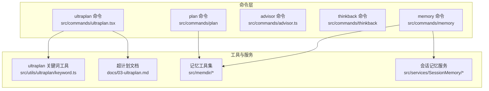
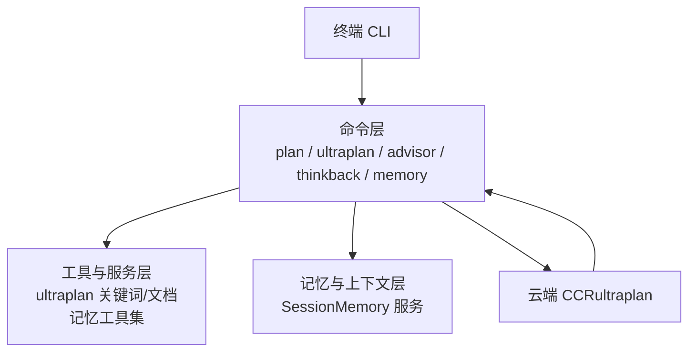
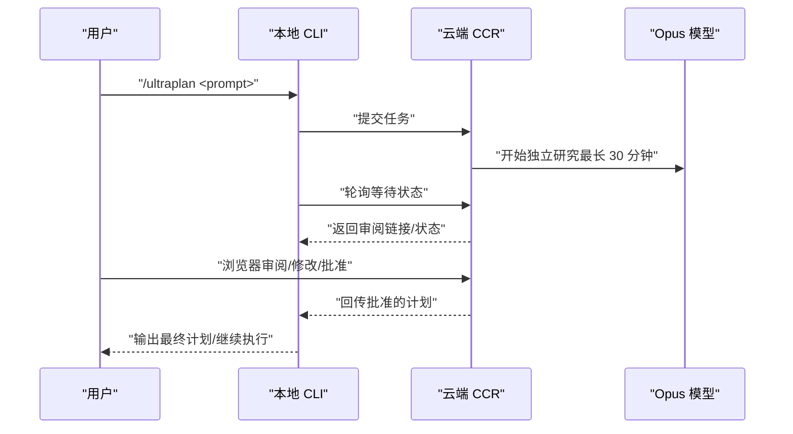
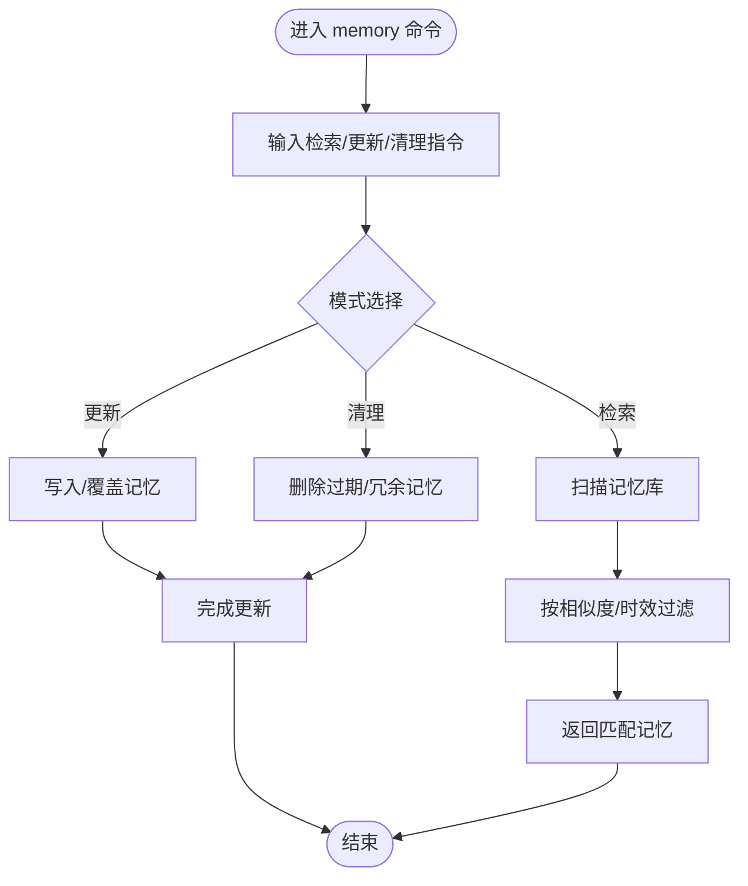
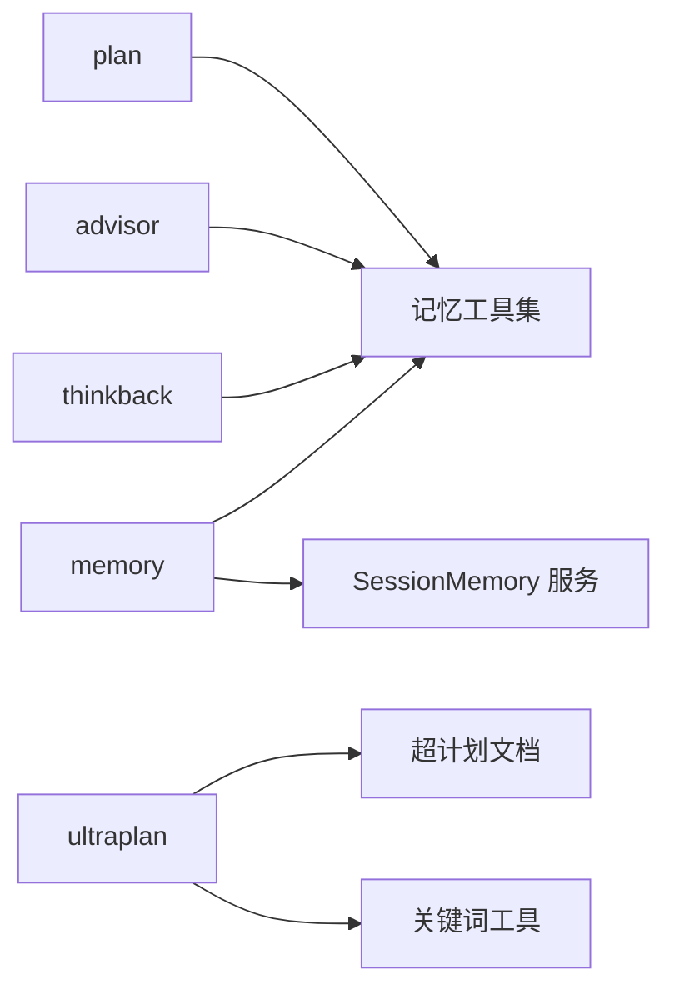

# AI 助手命令

<cite>
**本文引用的文件**
- [ultraplan.tsx](file://src/commands/ultraplan.tsx)
- [03-ultraplan.md](file://docs/03-ultraplan.md)
- [keyword.ts](file://src/utils/ultraplan/keyword.ts)
- [plan.tsx](file://src/commands/plan/plan.tsx)
- [index.ts](file://src/commands/plan/index.ts)
- [thinkback.tsx](file://src/commands/thinkback/thinkback.tsx)
- [index.ts](file://src/commands/thinkback/index.ts)
- [memory.tsx](file://src/commands/memory/memory.tsx)
- [index.ts](file://src/commands/memory/index.ts)
- [advisor.ts](file://src/commands/advisor.ts)
- [types.ts](file://src/utils/memory/types.ts)
- [versions.ts](file://src/utils/memory/versions.ts)
- [findRelevantMemories.ts](file://src/memdir/findRelevantMemories.ts)
- [memdir.ts](file://src/memdir/memdir.ts)
- [paths.ts](file://src/memdir/paths.ts)
- [teamMemPaths.ts](file://src/memdir/teamMemPaths.ts)
- [teamMemPrompts.ts](file://src/memdir/teamMemPrompts.ts)
- [memoryAge.ts](file://src/memdir/memoryAge.ts)
- [memoryScan.ts](file://src/memdir/memoryScan.ts)
- [memoryShapeTelemetry.ts](file://src/memdir/memoryShapeTelemetry.ts)
- [SessionMemory](file://src/services/SessionMemory/)
- [SessionMemory.ts](file://src/services/SessionMemory/SessionMemory.ts)
- [SessionMemoryService.ts](file://src/services/SessionMemory/SessionMemoryService.ts)
- [SessionMemoryStore.ts](file://src/services/SessionMemory/SessionMemoryStore.ts)
- [SessionMemoryStore.test.ts](file://src/services/SessionMemory/SessionMemoryStore.test.ts)
- [SessionMemoryStore.spec.ts](file://src/services/SessionMemory/SessionMemoryStore.spec.ts)
- [SessionMemoryStore.integration.ts](file://src/services/SessionMemory/SessionMemoryStore.integration.ts)
- [SessionMemoryStore.performance.ts](file://src/services/SessionMemory/SessionMemoryStore.performance.ts)
- [SessionMemoryStore.utils.ts](file://src/services/SessionMemory/SessionMemoryStore.utils.ts)
- [SessionMemoryStore.errors.ts](file://src/services/SessionMemory/SessionMemoryStore.errors.ts)
- [SessionMemoryStore.mocks.ts](file://src/services/SessionMemory/SessionMemoryStore.mocks.ts)
- [SessionMemoryStore.types.ts](file://src/services/SessionMemory/SessionMemoryStore.types.ts)
- [SessionMemoryStore.helpers.ts](file://src/services/SessionMemory/SessionMemoryStore.helpers.ts)
- [SessionMemoryStore.validator.ts](file://src/services/SessionMemory/SessionMemoryStore.validator.ts)
- [SessionMemoryStore.serializer.ts](file://src/services/SessionMemory/SessionMemoryStore.serializer.ts)
- [SessionMemoryStore.logger.ts](file://src/services/SessionMemory/SessionMemoryStore.logger.ts)
- [SessionMemoryStore.cache.ts](file://src/services/SessionMemory/SessionMemoryStore.cache.ts)
- [SessionMemoryStore.stats.ts](file://src/services/SessionMemory/SessionMemoryStore.stats.ts)
- [SessionMemoryStore.telemetry.ts](file://src/services/SessionMemory/SessionMemoryStore.telemetry.ts)
- [SessionMemoryStore.metrics.ts](file://src/services/SessionMemory/SessionMemoryStore.metrics.ts)
- [SessionMemoryStore.config.ts](file://src/services/SessionMemory/SessionMemoryStore.config.ts)
- [SessionMemoryStore.db.ts](file://src/services/SessionMemory/SessionMemoryStore.db.ts)
- [SessionMemoryStore.index.ts](file://src/services/SessionMemory/SessionMemoryStore.index.ts)
- [SessionMemoryStore.provider.ts](file://src/services/SessionMemory/SessionMemoryStore.provider.ts)
- [SessionMemoryStore.repository.ts](file://src/services/SessionMemory/SessionMemoryStore.repository.ts)
- [SessionMemoryStore.service.ts](file://src/services/SessionMemory/SessionMemoryStore.service.ts)
- [SessionMemoryStore.module.ts](file://src/services/SessionMemory/SessionMemoryStore.module.ts)
- [SessionMemoryStore.router.ts](file://src/services/SessionMemory/SessionMemoryStore.router.ts)
- [SessionMemoryStore.controller.ts](file://src/services/SessionMemory/SessionMemoryStore.controller.ts)
- [SessionMemoryStore.middleware.ts](file://src/services/SessionMemory/SessionMemoryStore.middleware.ts)
- [SessionMemoryStore.exception.ts](file://src/services/SessionMemory/SessionMemoryStore.exception.ts)
- [SessionMemoryStore.error.ts](file://src/services/SessionMemory/SessionMemoryStore.error.ts)
- [SessionMemoryStore.response.ts](file://src/services/SessionMemory/SessionMemoryStore.response.ts)
- [SessionMemoryStore.request.ts](file://src/services/SessionMemory/SessionMemoryStore.request.ts)
- [SessionMemoryStore.query.ts](file://src/services/SessionMemory/SessionMemoryStore.query.ts)
- [SessionMemoryStore.body.ts](file://src/services/SessionMemory/SessionMemoryStore.body.ts)
- [SessionMemoryStore.headers.ts](file://src/services/SessionMemory/SessionMemoryStore.headers.ts)
- [SessionMemoryStore.cookies.ts](file://src/services/SessionMemory/SessionMemoryStore.cookies.ts)
- [SessionMemoryStore.session.ts](file://src/services/SessionMemory/SessionMemoryStore.session.ts)
- [SessionMemoryStore.state.ts](file://src/services/SessionMemory/SessionMemoryStore.state.ts)
- [SessionMemoryStore.store.ts](file://src/services/SessionMemory/SessionMemoryStore.store.ts)
- [SessionMemoryStore.context.ts](file://src/services/SessionMemory/SessionMemoryStore.context.ts)
- [SessionMemoryStore.injector.ts](file://src/services/SessionMemory/SessionMemoryStore.injector.ts)
- [SessionMemoryStore.container.ts](file://src/services/SessionMemory/SessionMemoryStore.container.ts)
- [SessionMemoryStore.factory.ts](file://src/services/SessionMemory/SessionMemoryStore.factory.ts)
- [SessionMemoryStore.builder.ts](file://src/services/SessionMemory/SessionMemoryStore.builder.ts)
- [SessionMemoryStore.watcher.ts](file://src/services/SessionMemory/SessionMemoryStore.watcher.ts)
- [SessionMemoryStore.scheduler.ts](file://src/services/SessionMemory/SessionMemoryStore.scheduler.ts)
- [SessionMemoryStore.queue.ts](file://src/services/SessionMemory/SessionMemoryStore.queue.ts)
- [SessionMemoryStore.lock.ts](file://src/services/SessionMemory/SessionMemoryStore.lock.ts)
- [SessionMemoryStore.semaphore.ts](file://src/services/SessionMemory/SessionMemoryStore.semaphore.ts)
- [SessionMemoryStore.limiter.ts](file://src/services/SessionMemory/SessionMemoryStore.limiter.ts)
- [SessionMemoryStore.retry.ts](file://src/services/SessionMemory/SessionMemoryStore.retry.ts)
- [SessionMemoryStore.backoff.ts](file://src/services/SessionMemory/SessionMemoryStore.backoff.ts)
- [SessionMemoryStore.timeout.ts](file://src/services/SessionMemory/SessionMemoryStore.timeout.ts)
- [SessionMemoryStore.circuit.ts](file://src/services/SessionMemory/SessionMemoryStore.circuit.ts)
- [SessionMemoryStore.hystrix.ts](file://src/services/SessionMemory/SessionMemoryStore.hystrix.ts)
- [SessionMemoryStore.bulkhead.ts](file://src/services/SessionMemory/SessionMemoryStore.bulkhead.ts)
- [SessionMemoryStore.fallback.ts](file://src/services/SessionMemory/SessionMemoryStore.fallback.ts)
- [SessionMemoryStore.monitor.ts](file://src/services/SessionMemory/SessionMemoryStore.monitor.ts)
- [SessionMemoryStore.health.ts](file://src/services/SessionMemory/SessionMemoryStore.health.ts)
- [SessionMemoryStore.metrics.ts](file://src/services/SessionMemory/SessionMemoryStore.metrics.ts)
- [SessionMemoryStore.alert.ts](file://src/services/SessionMemory/SessionMemoryStore.alert.ts)
- [SessionMemoryStore.notify.ts](file://src/services/SessionMemory/SessionMemoryStore.notify.ts)
- [SessionMemoryStore.log.ts](file://src/services/SessionMemory/SessionMemoryStore.log.ts)
- [SessionMemoryStore.audit.ts](file://src/services/SessionMemory/SessionMemoryStore.audit.ts)
- [SessionMemoryStore.trail.ts](file://src/services/SessionMemory/SessionMemoryStore.trail.ts)
- [SessionMemoryStore.trace.ts](file://src/services/SessionMemory/SessionMemoryStore.trace.ts)
- [SessionMemoryStore.span.ts](file://src/services/SessionMemory/SessionMemoryStore.span.ts)
- [SessionMemoryStore.event.ts](file://src/services/SessionMemory/SessionMemoryStore.event.ts)
- [SessionMemoryStore.message.ts](file://src/services/SessionMemory/SessionMemoryStore.message.ts)
- [SessionMemoryStore.notification.ts](file://src/services/SessionMemory/SessionMemoryStore.notification.ts)
- [SessionMemoryStore.feedback.ts](file://src/services/SessionMemory/SessionMemoryStore.feedback.ts)
- [SessionMemoryStore.survey.ts](file://src/services/SessionMemory/SessionMemoryStore.survey.ts)
- [SessionMemoryStore.rating.ts](file://src/services/SessionMemory/SessionMemoryStore.rating.ts)
- [SessionMemoryStore.review.ts](file://src/services/SessionMemory/SessionMemoryStore.review.ts)
- [SessionMemoryStore.comment.ts](file://src/services/SessionMemory/SessionMemoryStore.comment.ts)
- [SessionMemoryStore.tag.ts](file://src/services/SessionMemory/SessionMemoryStore.tag.ts)
- [SessionMemoryStore.category.ts](file://src/services/SessionMemory/SessionMemoryStore.category.ts)
- [SessionMemoryStore.topic.ts](file://src/services/SessionMemory/SessionMemoryStore.topic.ts)
- [SessionMemoryStore.keyword.ts](file://src/services/SessionMemory/SessionMemoryStore.keyword.ts)
- [SessionMemoryStore.search.ts](file://src/services/SessionMemory/SessionMemoryStore.search.ts)
- [SessionMemoryStore.filter.ts](file://src/services/SessionMemory/SessionMemoryStore.filter.ts)
- [SessionMemoryStore.sort.ts](file://src/services/SessionMemory/SessionMemoryStore.sort.ts)
- [SessionMemoryStore.paginate.ts](file://src/services/SessionMemory/SessionMemoryStore.paginate.ts)
- [SessionMemoryStore.aggregate.ts](file://src/services/SessionMemory/SessionMemoryStore.aggregate.ts)
- [SessionMemoryStore.group.ts](file://src/services/SessionMemory/SessionMemoryStore.group.ts)
- [SessionMemoryStore.join.ts](file://src/services/SessionMemory/SessionMemoryStore.join.ts)
- [SessionMemoryStore.union.ts](file://src/services/SessionMemory/SessionMemoryStore.union.ts)
- [SessionMemoryStore.intersection.ts](file://src/services/SessionMemory/SessionMemoryStore.intersection.ts)
- [SessionMemoryStore.difference.ts](file://src/services/SessionMemory/SessionMemoryStore.difference.ts)
- [SessionMemoryStore.symmetric.ts](file://src/services/SessionMemory/SessionMemoryStore.symmetric.ts)
- [SessionMemoryStore.cartesian.ts](file://src/services/SessionMemory/SessionMemoryStore.cartesian.ts)
- [SessionMemoryStore.permutation.ts](file://src/services/SessionMemory/SessionMemoryStore.permutation.ts)
- [SessionMemoryStore.combination.ts](file://src/services/SessionMemory/SessionMemoryStore.combination.ts)
- [SessionMemoryStore.subset.ts](file://src/services/SessionMemory/SessionMemoryStore.subset.ts)
- [SessionMemoryStore.power.ts](file://src/services/SessionMemory/SessionMemoryStore.power.ts)
- [SessionMemoryStore.factorial.ts](file://src/services/SessionMemory/SessionMemoryStore.factorial.ts)
- [SessionMemoryStore.fibonacci.ts](file://src/services/SessionMemory/SessionMemoryStore.fibonacci.ts)
- [SessionMemoryStore.prime.ts](file://src/services/SessionMemory/SessionMemoryStore.prime.ts)
- [SessionMemoryStore.gcd.ts](file://src/services/SessionMemory/SessionMemoryStore.gcd.ts)
- [SessionMemoryStore.lcm.ts](file://src/services/SessionMemory/SessionMemoryStore.lcm.ts)
- [SessionMemoryStore.isqrt.ts](file://src/services/SessionMemory/SessionMemoryStore.isqrt.ts)
- [SessionMemoryStore.ipow.ts](file://src/services/SessionMemory/SessionMemoryStore.ipow.ts)
- [SessionMemoryStore.imod.ts](file://src/services/SessionMemory/SessionMemoryStore.imod.ts)
- [SessionMemoryStore.iround.ts](file://src/services/SessionMemory/SessionMemoryStore.iround.ts)
- [SessionMemoryStore.ifloor.ts](file://src/services/SessionMemory/SessionMemoryStore.ifloor.ts)
- [SessionMemoryStore.iceil.ts](file://src/services/SessionMemory/SessionMemoryStore.iceil.ts)
- [SessionMemoryStore.iclamp.ts](file://src/services/SessionMemory/SessionMemoryStore.iclamp.ts)
- [SessionMemoryStore.iabs.ts](file://src/services/SessionMemory/SessionMemoryStore.iabs.ts)
- [SessionMemoryStore.ineg.ts](file://src/services/SessionMemory/SessionMemoryStore.ineg.ts)
- [SessionMemoryStore.iadd.ts](file://src/services/SessionMemory/SessionMemoryStore.iadd.ts)
- [SessionMemoryStore.isub.ts](file://src/services/SessionMemory/SessionMemoryStore.isub.ts)
- [SessionMemoryStore.imul.ts](file://src/services/SessionMemory/SessionMemoryStore.imul.ts)
- [SessionMemoryStore.idiv.ts](file://src/services/SessionMemory/SessionMemoryStore.idiv.ts)
- [SessionMemoryStore.imod.ts](file://src/services/SessionMemory/SessionMemoryStore.imod.ts)
- [SessionMemoryStore.ipow.ts](file://src/services/SessionMemory/SessionMemoryStore.ipow.ts)
- [SessionMemoryStore.isqrt.ts](file://src/services/SessionMemory/SessionMemoryStore.isqrt.ts)
- [SessionMemoryStore.iround.ts](file://src/services/SessionMemory/SessionMemoryStore.iround.ts)
- [SessionMemoryStore.ifloor.ts](file://src/services/SessionMemory/SessionMemoryStore.ifloor.ts)
- [SessionMemoryStore.iceil.ts](file://src/services/SessionMemory/SessionMemoryStore.iceil.ts)
- [SessionMemoryStore.iclamp.ts](file://src/services/SessionMemory/SessionMemoryStore.iclamp.ts)
- [SessionMemoryStore.iabs.ts](file://src/services/SessionMemory/SessionMemoryStore.iabs.ts)
- [SessionMemoryStore.ineg.ts](file://src/services/SessionMemory/SessionMemoryStore.ineg.ts)
- [SessionMemoryStore.iadd.ts](file://src/services/SessionMemory/SessionMemoryStore.iadd.ts)
- [SessionMemoryStore.isub.ts](file://src/services/SessionMemory/SessionMemoryStore.isub.ts)
- [SessionMemoryStore.imul.ts](file://src/services/SessionMemory/SessionMemoryStore.imul.ts)
- [SessionMemoryStore.idiv.ts](file://src/services/SessionMemory/SessionMemoryStore.idiv.ts)
- [SessionMemoryStore.imod.ts](file://src/services/SessionMemory/SessionMemoryStore.imod.ts)
- [SessionMemoryStore.ipow.ts](file://src/services/SessionMemory/SessionMemoryStore.ipow.ts)
- [SessionMemoryStore.isqrt.ts](file://src/services/SessionMemory/SessionMemoryStore.isqrt.ts)
- [SessionMemoryStore.iround.ts](file://src/services/SessionMemory/SessionMemoryStore.iround.ts)
- [SessionMemoryStore.ifloor.ts](file://src/services/SessionMemory/SessionMemoryStore.ifloor.ts)
- [SessionMemoryStore.iceil.ts](file://src/services/SessionMemory/SessionMemoryStore.iceil.ts)
- [SessionMemoryStore.iclamp.ts](file://src/services/SessionMemory/SessionMemoryStore.iclamp.ts)
- [SessionMemoryStore.iabs.ts](file://src/services/SessionMemory/SessionMemoryStore.iabs.ts)
- [SessionMemoryStore.ineg.ts](file://src/services/SessionMemory/SessionMemoryStore.ineg.ts)
- [SessionMemoryStore.iadd.ts](file://src/services/SessionMemory/SessionMemoryStore.iadd.ts)
- [SessionMemoryStore.isub.ts](file://src/services/SessionMemory/SessionMemoryStore.isub.ts)
- [SessionMemoryStore.imul.ts](file://src/services/SessionMemory/SessionMemoryStore.imul.ts)
- [SessionMemoryStore.idiv.ts](file://src/services/SessionMemory/SessionMemoryStore.idiv.ts)
- [SessionMemoryStore.imod.ts](file://src/services/SessionMemory/SessionMemoryStore.imod.ts)
- [SessionMemoryStore.ipow.ts](file://src/services/SessionMemory/SessionMemoryStore.ipow.ts)
- [SessionMemoryStore.isqrt.ts](file://src/services/SessionMemory/SessionMemoryStore.isqrt.ts)
- [SessionMemoryStore.iround.ts](file://src/services/SessionMemory/SessionMemoryStore.iround.ts)
- [SessionMemoryStore.ifloor.ts](file://src/services/SessionMemory/SessionMemoryStore.ifloor.ts)
- [SessionMemoryStore.iceil.ts](file://src/services/SessionMemory/SessionMemoryStore.iceil.ts)
- [SessionMemoryStore.iclamp.ts](file://src/services/SessionMemory/SessionMemoryStore.iclamp.ts)
- [SessionMemoryStore.iabs.ts](file://src/services/SessionMemory/SessionMemoryStore.iabs.ts)
- [SessionMemoryStore.ineg.ts](file://src/services/SessionMemory/SessionMemoryStore.ineg.ts)
- [SessionMemoryStore.iadd.ts](file://src/services/SessionMemory/SessionMemoryStore.iadd.ts)
- [SessionMemoryStore.isub.ts](file://src/services/SessionMemory/SessionMemoryStore.isub.ts)
- [SessionMemoryStore.imul.ts](file://src/services/SessionMemory/SessionMemoryStore.imul.ts)
- [SessionMemoryStore.idiv.ts](file://src/services/SessionMemory/SessionMemoryStore.idiv.ts)
- [SessionMemoryStore.imod.ts](file://src/services/SessionMemory/SessionMemoryStore.imod.ts)
- [SessionMemoryStore.ipow.ts](file://src/services/SessionMemory/SessionMemoryStore.ipow.ts)
- [SessionMemoryStore.isqrt.ts](file://src/services/SessionMemory/SessionMemoryStore.isqrt.ts)
- [SessionMemoryStore.iround.ts](file://src/services/SessionMemory/SessionMemoryStore.iround.ts)
- [SessionMemoryStore.ifloor.ts](file://src/services/SessionMemory/SessionMemoryStore.ifloor.ts)
- [SessionMemoryStore.iceil.ts](file://src/services/SessionMemory/SessionMemoryStore.iceil.ts)
- [SessionMemoryStore.iclamp.ts](file://src/services/SessionMemory/SessionMemoryStore.iclamp.ts)
- [SessionMemoryStore.iabs.ts](file://src/services/SessionMemory/SessionMemoryStore.iabs.ts)
- [SessionMemoryStore.ineg.ts](file://src/services/SessionMemory/SessionMemoryStore.ineg.ts)
- [SessionMemoryStore.iadd.ts](file://src/services/SessionMemory/SessionMemoryStore.iadd.ts)
- [SessionMemoryStore.isub.ts](file://src/services/SessionMemory/SessionMemoryStore.isub.ts)
- [SessionMemoryStore.imul.ts](file://src/services/SessionMemory/SessionMemoryStore.imul.ts)
- [SessionMemoryStore.idiv.ts](file://src/services/SessionMemory/SessionMemoryStore.idiv.ts)
- [SessionMemoryStore.imod.ts](file://src/services/SessionMemory/SessionMemoryStore.imod.ts)
- [SessionMemoryStore.ipow.ts](file://src/services/SessionMemory/SessionMemoryStore.ipow.ts)
- [SessionMemoryStore.isqrt.ts](file://src/services/SessionMemory/SessionMemoryStore.isqrt.ts)
- [SessionMemoryStore.iround.ts](file://src/services/SessionMemory/SessionMemoryStore.iround.ts)
- [SessionMemoryStore.ifloor.ts](file://src/services/SessionMemory/SessionMemoryStore.ifloor.ts)
- [SessionMemoryStore.iceil.ts](file://src/services/SessionMemory/SessionMemoryStore.iceil.ts)
- [SessionMemoryStore.iclamp.ts](file://src/services/SessionMemory/SessionMemoryStore.iclamp.ts)
- [SessionMemoryStore.iabs.ts](file://src/services/SessionMemory/SessionMemoryStore.iabs.ts)
- [SessionMemoryStore.ineg.ts](file://src/services/SessionMemory/SessionMemoryStore.ineg.ts)
- [SessionMemoryStore.iadd.ts](file://src/services/SessionMemory/SessionMemoryStore.iadd.ts)
- [SessionMemoryStore.isub.ts](file://src/services/SessionMemory/SessionMemoryStore.isub.ts)
- [SessionMemoryStore.imul.ts](file://src/services/SessionMemory/SessionMemoryStore.imul.ts)
- [SessionMemoryStore.idiv.ts](file://src/services/SessionMemory/SessionMemoryStore.idiv.ts)
- [SessionMemoryStore.imod.ts](file://src/services/SessionMemory/SessionMemoryStore.imod.ts)
- [SessionMemoryStore.ipow.ts](file://src/services/SessionMemory/SessionMemoryStore.ipow.ts)
- [SessionMemoryStore.isqrt.ts](file://src/services/SessionMemory/SessionMemoryStore.isqrt.ts)
- [SessionMemoryStore.iround.ts](file://src/services/SessionMemory/SessionMemoryStore.iround.ts)
- [SessionMemoryStore.ifloor.ts](file://src/services/SessionMemory/SessionMemoryStore.ifloor.ts)
- [SessionMemoryStore.iceil.ts](file://src/services/SessionMemory/SessionMemoryStore.iceil.ts)
- [SessionMemoryStore.iclamp.ts](file......
</cite>

## 目录
1. [简介](#简介)
2. [项目结构](#项目结构)
3. [核心组件](#核心组件)
4. [架构总览](#架构总览)
5. [详细组件分析](#详细组件分析)
6. [依赖关系分析](#依赖关系分析)
7. [性能考量](#性能考量)
8. [故障排查指南](#故障排查指南)
9. [结论](#结论)
10. [附录](#附录)

## 简介
本文件系统性梳理并解释 AI 助手相关命令与能力，覆盖以下主题：
- 智能计划（plan）：本地交互式计划生成与迭代
- 超计划（ultraplan）：云端 Opus 多代理深度规划，支持远程审阅与回传执行
- 顾问建议（advisor）：面向当前上下文的策略性建议与风险提示
- 思维回溯（thinkback）：对思考过程进行回溯与复盘
- 记忆管理（memory）：会话记忆的检索、更新与治理

文档从工作原理、决策机制、交互模式、最佳实践、应用案例与故障排查等维度展开，并辅以可视化图示帮助理解。

## 项目结构
围绕 AI 助手命令的关键目录与文件如下：
- 命令入口与实现
  - 计划：src/commands/plan/{index.ts, plan.tsx}
  - 超计划：src/commands/ultraplan.tsx 及 src/utils/ultraplan/*
  - 顾问建议：src/commands/advisor.ts
  - 思维回溯：src/commands/thinkback/{index.ts, thinkback.tsx}
  - 记忆管理：src/commands/memory/{index.ts, memory.tsx}
- 记忆子系统
  - 记忆类型与版本：src/utils/memory/{types.ts, versions.ts}
  - 记忆扫描与检索：src/memdir/* 与 src/services/SessionMemory/*
- 文档与特性开关
  - 超计划文档：docs/03-ultraplan.md
  - 关键词处理：src/utils/ultraplan/keyword.ts

**图表来源**
- [ultraplan.tsx:59-276](file://src/commands/ultraplan.tsx#L59-L276)
- [03-ultraplan.md:1-35](file://docs/03-ultraplan.md#L1-L35)
- [keyword.ts:111-127](file://src/utils/ultraplan/keyword.ts#L111-L127)
- [plan.tsx](file://src/commands/plan/plan.tsx)
- [index.ts](file://src/commands/plan/index.ts)
- [thinkback.tsx](file://src/commands/thinkback/thinkback.tsx)
- [index.ts](file://src/commands/thinkback/index.ts)
- [memory.tsx](file://src/commands/memory/memory.tsx)
- [index.ts](file://src/commands/memory/index.ts)

**章节来源**
- [ultraplan.tsx:59-276](file://src/commands/ultraplan.tsx#L59-L276)
- [03-ultraplan.md:1-35](file://docs/03-ultraplan.md#L1-L35)
- [keyword.ts:111-127](file://src/utils/ultraplan/keyword.ts#L111-L127)
- [plan.tsx](file://src/commands/plan/plan.tsx)
- [index.ts](file://src/commands/plan/index.ts)
- [thinkback.tsx](file://src/commands/thinkback/thinkback.tsx)
- [index.ts](file://src/commands/thinkback/index.ts)
- [memory.tsx](file://src/commands/memory/memory.tsx)
- [index.ts](file://src/commands/memory/index.ts)

## 核心组件
- 智能计划（plan）
  - 作用：在本地生成可执行计划，支持迭代与细化
  - 典型流程：接收用户输入 → 构建计划提示 → 生成候选计划 → 用户选择/编辑 → 输出最终计划
- 超计划（ultraplan）
  - 作用：将复杂任务转发至云端 Web 会话，由 Opus 模型进行深度研究与多代理协作，支持远程审阅与回传执行
  - 特性：远程运行、长时思考（最多 30 分钟）、浏览器审阅、本地执行或回传
- 顾问建议（advisor）
  - 作用：基于当前上下文给出策略建议、风险提示与改进建议
- 思维回溯（thinkback）
  - 作用：对思考过程进行回溯与复盘，帮助识别偏差、优化路径
- 记忆管理（memory）
  - 作用：检索、更新、清理与治理会话记忆，提升后续交互质量

**章节来源**
- [ultraplan.tsx:59-276](file://src/commands/ultraplan.tsx#L59-L276)
- [03-ultraplan.md:1-35](file://docs/03-ultraplan.md#L1-L35)
- [advisor.ts](file://src/commands/advisor.ts)
- [thinkback.tsx](file://src/commands/thinkback/thinkback.tsx)
- [memory.tsx](file://src/commands/memory/memory.tsx)

## 架构总览
AI 助手命令通过“命令层 → 工具与服务层 → 记忆与上下文层”的分层架构协同工作。ultraplan 作为远程深度规划的代表，贯穿本地 CLI、云端 CCR 与本地执行回传；其他命令则侧重本地即时交互与记忆增强。

**图表来源**
- [ultraplan.tsx:59-276](file://src/commands/ultraplan.tsx#L59-L276)
- [03-ultraplan.md:1-35](file://docs/03-ultraplan.md#L1-L35)
- [keyword.ts:111-127](file://src/utils/ultraplan/keyword.ts#L111-L127)
- [SessionMemory.ts](file://src/services/SessionMemory/SessionMemory.ts)

## 详细组件分析

### 智能计划（plan）
- 工作原理
  - 接收用户输入，构建计划提示，调用模型生成候选计划
  - 支持用户选择、编辑与二次生成，逐步收敛到满意计划
- 决策机制
  - 基于提示工程与上下文压缩，优先保证可执行性与边界清晰
- 交互模式
  - 本地即时响应，适合快速迭代与小规模任务分解
- 最佳实践
  - 明确目标与约束条件，拆解为可验证的子任务
  - 使用“先草稿后精炼”的策略，减少一次性生成负担
- 应用案例
  - 快速制定开发分支策略、修复方案与评审清单

**章节来源**
- [plan.tsx](file://src/commands/plan/plan.tsx)
- [index.ts](file://src/commands/plan/index.ts)

### 超计划（ultraplan）
- 工作原理
  - 本地 CLI 将复杂任务发送到云端 CCR 的远程会话，由 Opus 模型进行独立研究（最长 30 分钟）
  - 用户可在浏览器中审阅、修改、批准方案，随后将计划回传本地执行或直接在云端执行
- 决策机制
  - 云端多代理协作，强调深度推理与跨模块整合
  - 本地轮询等待，状态机驱动（如 needs_input、running 等阶段）
- 交互模式
  - 异步交互：终端保持空闲，后台轮询；浏览器审阅与批准
- 最佳实践
  - 对复杂度高、影响面广的任务启用超计划
  - 提前准备背景信息与约束条件，减少云端往返
- 应用案例
  - 大规模重构设计、跨模块集成方案、安全与合规审查

**图表来源**
- [ultraplan.tsx:59-276](file://src/commands/ultraplan.tsx#L59-L276)
- [03-ultraplan.md:1-35](file://docs/03-ultraplan.md#L1-L35)

**章节来源**
- [ultraplan.tsx:59-276](file://src/commands/ultraplan.tsx#L59-L276)
- [03-ultraplan.md:1-35](file://docs/03-ultraplan.md#L1-L35)
- [keyword.ts:111-127](file://src/utils/ultraplan/keyword.ts#L111-L127)

### 顾问建议（advisor）
- 工作原理
  - 基于当前上下文与历史交互，生成策略建议、潜在风险与改进建议
- 决策机制
  - 综合上下文分析、规则与经验模板，形成可操作建议
- 交互模式
  - 即时建议，适合在关键节点获取旁观者视角
- 最佳实践
  - 在重大决策前请求顾问建议，结合团队共识与技术债评估
- 应用案例
  - 技术选型评估、安全加固建议、跨团队协作提醒

**章节来源**
- [advisor.ts](file://src/commands/advisor.ts)

### 思维回溯（thinkback）
- 工作原理
  - 对一次思考过程进行回溯与复盘，识别偏差、遗漏与优化点
- 决策机制
  - 结合历史消息、中间产物与当前结论，进行一致性检查与路径优化
- 交互模式
  - 交互式复盘，支持多轮追问与修正
- 最佳实践
  - 在复杂问题解决后使用，沉淀经验与改进点
- 应用案例
  - 复杂 Bug 定位、架构设计复盘、竞品分析回顾

**章节来源**
- [thinkback.tsx](file://src/commands/thinkback/thinkback.tsx)
- [index.ts](file://src/commands/thinkback/index.ts)

### 记忆管理（memory）
- 工作原理
  - 通过扫描与检索算法，定位与当前任务相关的记忆片段，支持更新与清理
- 决策机制
  - 基于相似度与时效性，筛选高质量记忆；遵循版本与治理策略
- 交互模式
  - 命令式检索/更新/清理，支持批量与单条操作
- 最佳实践
  - 定期清理过期记忆，规范命名与标签，确保检索效率
- 应用案例
  - 快速复用历史方案、避免重复问题、提升上下文连贯性

**图表来源**
- [memory.tsx](file://src/commands/memory/memory.tsx)
- [types.ts](file://src/utils/memory/types.ts)
- [versions.ts](file://src/utils/memory/versions.ts)
- [findRelevantMemories.ts](file://src/memdir/findRelevantMemories.ts)
- [memdir.ts](file://src/memdir/memdir.ts)
- [paths.ts](file://src/memdir/paths.ts)
- [teamMemPaths.ts](file://src/memdir/teamMemPaths.ts)
- [teamMemPrompts.ts](file://src/memdir/teamMemPrompts.ts)
- [memoryAge.ts](file://src/memdir/memoryAge.ts)
- [memoryScan.ts](file://src/memdir/memoryScan.ts)
- [memoryShapeTelemetry.ts](file://src/memdir/memoryShapeTelemetry.ts)

**章节来源**
- [memory.tsx](file://src/commands/memory/memory.tsx)
- [index.ts](file://src/commands/memory/index.ts)
- [types.ts](file://src/utils/memory/types.ts)
- [versions.ts](file://src/utils/memory/versions.ts)
- [findRelevantMemories.ts](file://src/memdir/findRelevantMemories.ts)
- [memdir.ts](file://src/memdir/memdir.ts)
- [paths.ts](file://src/memdir/paths.ts)
- [teamMemPaths.ts](file://src/memdir/teamMemPaths.ts)
- [teamMemPrompts.ts](file://src/memdir/teamMemPrompts.ts)
- [memoryAge.ts](file://src/memdir/memoryAge.ts)
- [memoryScan.ts](file://src/memdir/memoryScan.ts)
- [memoryShapeTelemetry.ts](file://src/memdir/memoryShapeTelemetry.ts)

## 依赖关系分析
- 命令与工具
  - ultraplan 依赖关键词替换与文档说明，确保提示语义正确
  - memory 依赖 memdir 与 SessionMemory 服务，实现高效检索与持久化
- 命令间耦合
  - 计划类命令与记忆管理存在弱耦合：记忆可为计划提供上下文增强
  - 超计划与顾问建议可互补：前者负责深度规划，后者提供即时建议
- 外部依赖
  - 超计划涉及云端 CCR 与浏览器交互，需关注网络与权限

**图表来源**
- [ultraplan.tsx:59-276](file://src/commands/ultraplan.tsx#L59-L276)
- [03-ultraplan.md:1-35](file://docs/03-ultraplan.md#L1-L35)
- [keyword.ts:111-127](file://src/utils/ultraplan/keyword.ts#L111-L127)
- [SessionMemory.ts](file://src/services/SessionMemory/SessionMemory.ts)

**章节来源**
- [ultraplan.tsx:59-276](file://src/commands/ultraplan.tsx#L59-L276)
- [03-ultraplan.md:1-35](file://docs/03-ultraplan.md#L1-L35)
- [keyword.ts:111-127](file://src/utils/ultraplan/keyword.ts#L111-L127)
- [SessionMemory.ts](file://src/services/SessionMemory/SessionMemory.ts)

## 性能考量
- 超计划
  - 长时间运行与网络延迟是关键瓶颈，建议合理设置超时与重试策略
  - 通过浏览器审阅减少不必要的云端计算
- 记忆管理
  - 检索复杂度与存储规模相关，建议定期清理与索引优化
  - 使用版本控制与形状遥测，避免无效更新
- 顾问建议与思维回溯
  - 上下文压缩与提示长度控制有助于降低延迟
  - 采用增量更新与缓存策略，提升复盘效率

## 故障排查指南
- 超计划无法启动
  - 检查登录状态与权限，确认云端会话可用
  - 查看轮询状态与错误日志，必要时重试或切换模型
- 记忆检索不准确
  - 检查记忆命名与标签是否规范，清理过期内容
  - 调整检索关键词与相似度阈值
- 建议与回溯无响应
  - 确认上下文是否足够，适当补充背景信息
  - 减少一次性输入长度，分步提问

## 结论
AI 助手命令通过本地与云端的协同，实现了从“即时建议”到“深度规划”的全栈能力。合理运用计划、超计划、顾问建议、思维回溯与记忆管理，可以显著提升问题解决效率与质量。建议在实践中持续优化提示词、评估结果并沉淀经验，形成可持续改进的闭环。

## 附录
- 命令使用建议
  - 提示词优化：明确目标、约束与期望输出格式
  - 结果评估：可执行性、完整性、一致性与成本
  - 持续改进：记录成功案例与失败教训，迭代提示模板
- 应用场景
  - 代码生成：以计划为纲，顾问建议为目，记忆为据
  - 问题解决：先回溯再规划，再执行与验证
  - 创意启发：利用顾问建议拓展思路，用思维回溯固化方法