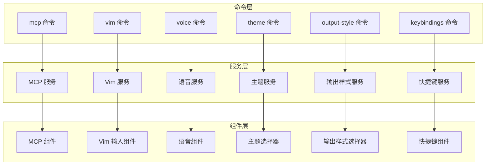
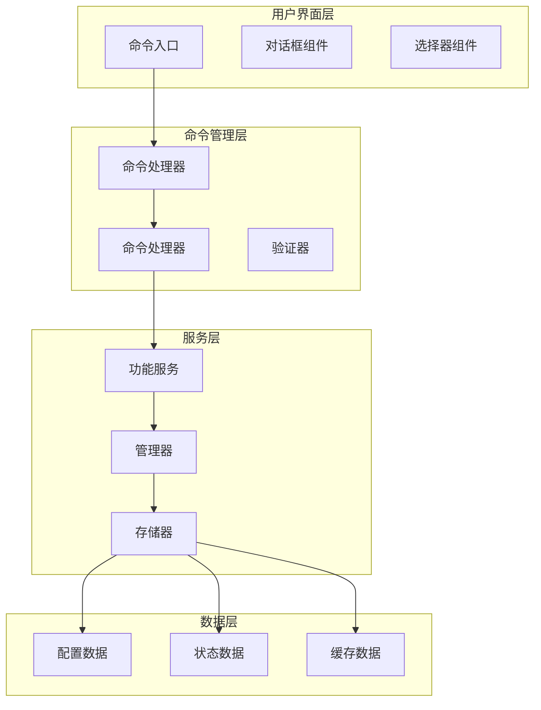
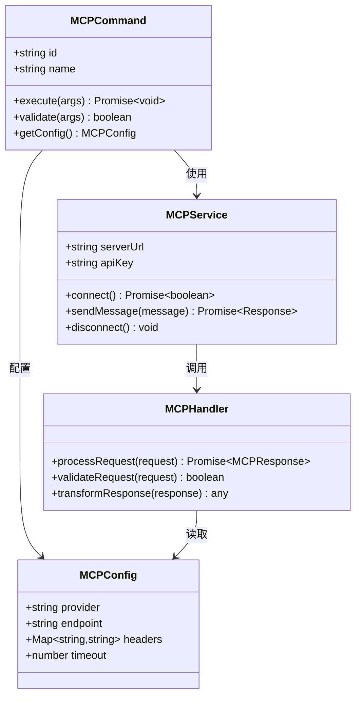
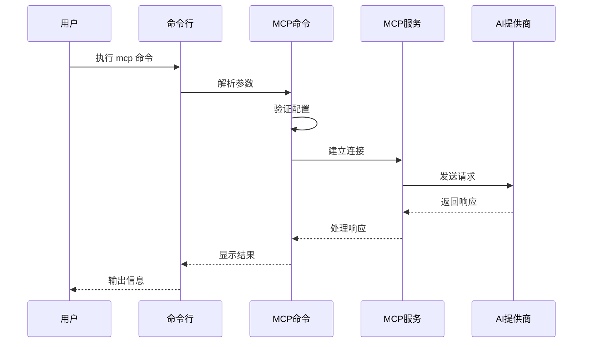
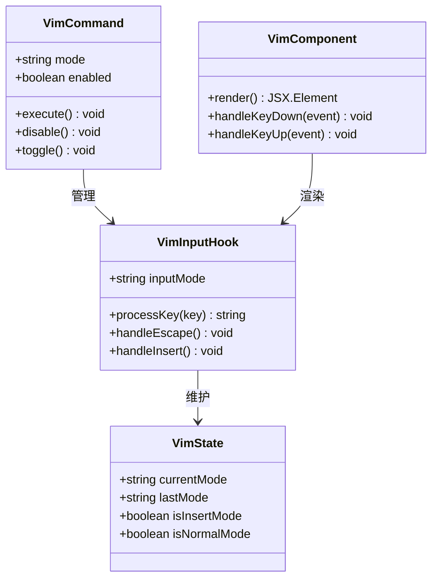
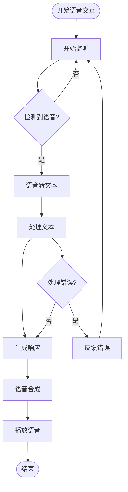
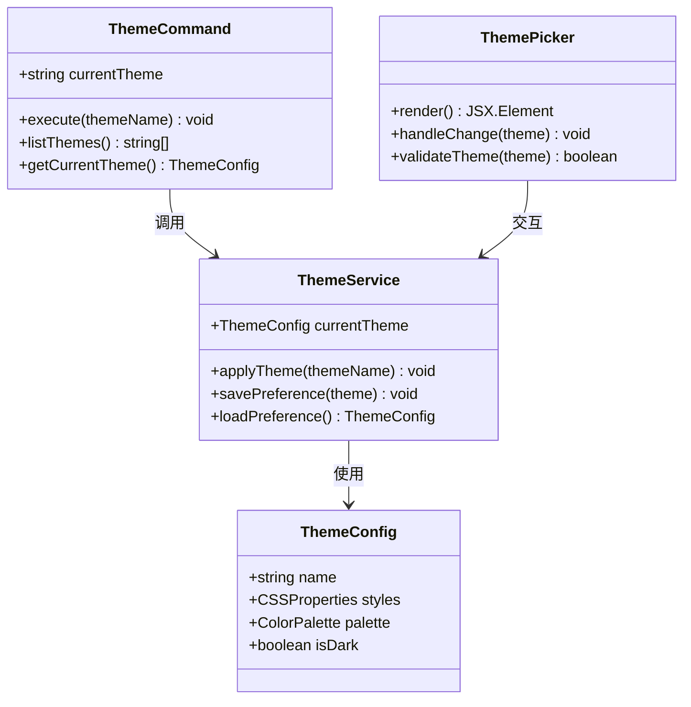
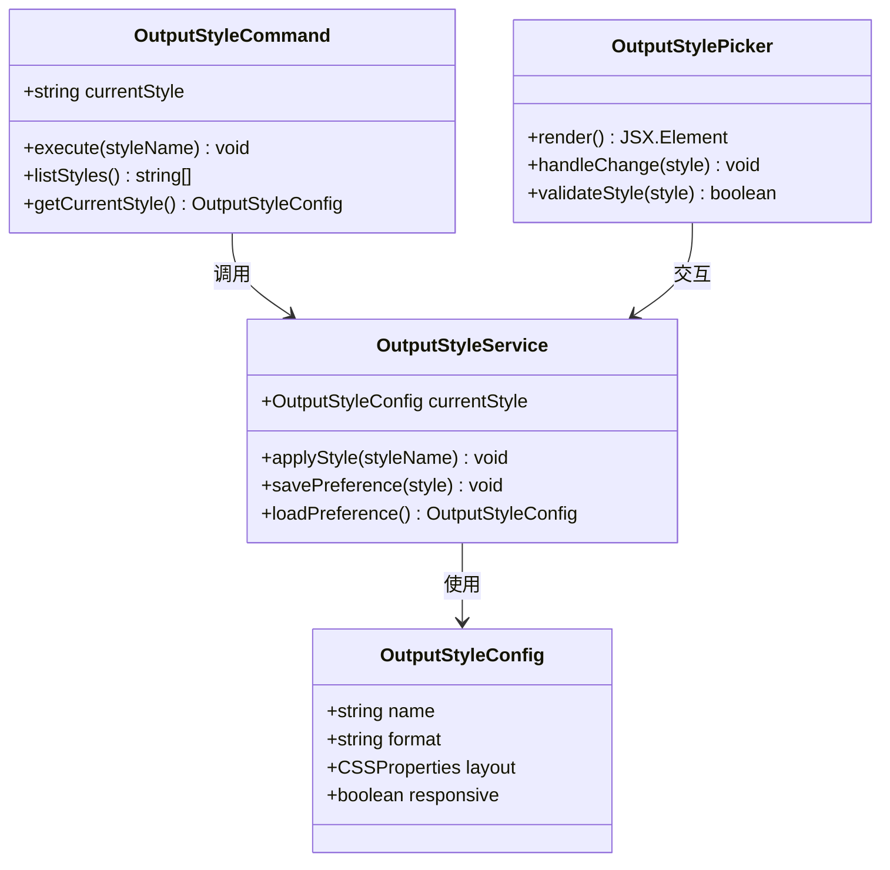
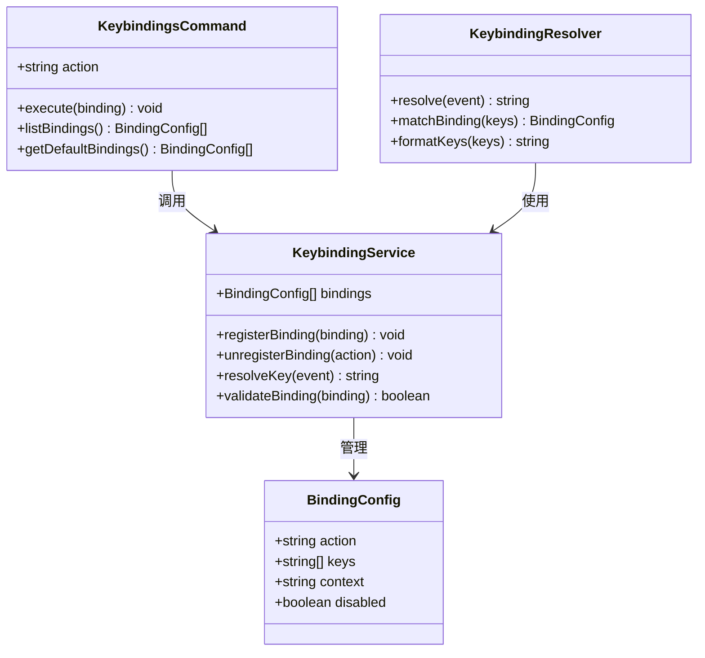
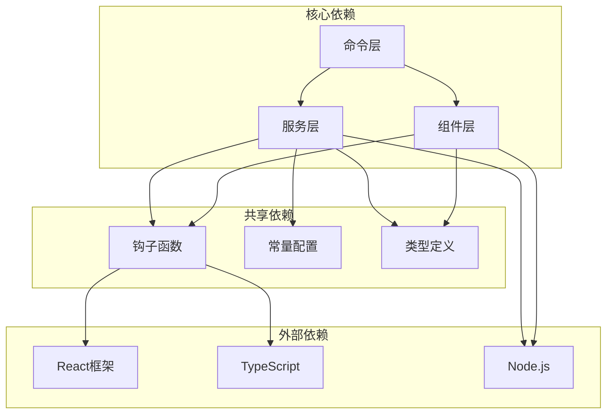

# 专用功能命令

<cite>
**本文引用的文件**
- [src/commands/mcp/index.ts](file://src/commands/mcp/index.ts)
- [src/commands/mcp/mcp.tsx](file://src/commands/mcp/mcp.tsx)
- [src/commands/mcp/addCommand.ts](file://src/commands/mcp/addCommand.ts)
- [src/commands/mcp/xaaIdpCommand.ts](file://src/commands/mcp/xaaIdpCommand.ts)
- [src/commands/vim/index.ts](file://src/commands/vim/index.ts)
- [src/commands/vim/vim.ts](file://src/commands/vim/vim.ts)
- [src/commands/voice/index.ts](file://src/commands/voice/index.ts)
- [src/commands/voice/voice.ts](file://src/commands/voice/voice.ts)
- [src/commands/theme/index.ts](file://src/commands/theme/index.ts)
- [src/commands/theme/theme.tsx](file://src/commands/theme/theme.tsx)
- [src/commands/output-style/index.ts](file://src/commands/output-style/index.ts)
- [src/commands/output-style/output-style.tsx](file://src/commands/output-style/output-style.tsx)
- [src/commands/keybindings/index.ts](file://src/commands/keybindings/index.ts)
- [src/commands/keybindings/keybindings.ts](file://src/commands/keybindings/keybindings.ts)
- [src/services/mcp/index.ts](file://src/services/mcp/index.ts)
- [src/services/mcp/types.ts](file://src/services/mcp/types.ts)
- [src/hooks/useVimInput.ts](file://src/hooks/useVimInput.ts)
- [src/hooks/useVoice.ts](file://src/hooks/useVoice.ts)
- [src/components/VimTextInput.tsx](file://src/components/VimTextInput.tsx)
- [src/components/ThemePicker.tsx](file://src/components/ThemePicker.tsx)
- [src/components/OutputStylePicker.tsx](file://src/components/OutputStylePicker.tsx)
- [src/keybindings/defaultBindings.ts](file://src/keybindings/defaultBindings.ts)
- [src/keybindings/reservedShortcuts.ts](file://src/keybindings/reservedShortcuts.ts)
- [src/constants/outputStyles.ts](file://src/constants/outputStyles.ts)
</cite>

## 目录
1. [简介](#简介)
2. [项目结构](#项目结构)
3. [核心组件](#核心组件)
4. [架构概览](#架构概览)
5. [详细组件分析](#详细组件分析)
6. [依赖关系分析](#依赖关系分析)
7. [性能考虑](#性能考虑)
8. [故障排除指南](#故障排除指南)
9. [结论](#结论)

## 简介

本文档深入介绍了 Claude Code 中的六大专用功能命令：MCP 协议（mcp）、Vim 模式（vim）、语音交互（voice）、主题切换（theme）、输出样式（output-style）和快捷键（keybindings）。这些功能通过专门的命令接口扩展了系统的功能边界，为用户提供了专业化的使用体验。

每个功能都经过精心设计，不仅提供了基础的功能实现，还包含了完整的配置选项、性能优化策略和兼容性处理方案。这些功能命令能够满足从初学者到高级用户的各种需求场景。

## 项目结构

专用功能命令分布在项目的多个目录中，采用模块化的设计理念：



**图表来源**
- [src/commands/mcp/index.ts:1-50](file://src/commands/mcp/index.ts#L1-L50)
- [src/commands/vim/index.ts:1-50](file://src/commands/vim/index.ts#L1-L50)
- [src/commands/voice/index.ts:1-50](file://src/commands/voice/index.ts#L1-L50)
- [src/commands/theme/index.ts:1-50](file://src/commands/theme/index.ts#L1-L50)
- [src/commands/output-style/index.ts:1-50](file://src/commands/output-style/index.ts#L1-L50)
- [src/commands/keybindings/index.ts:1-50](file://src/commands/keybindings/index.ts#L1-L50)

**章节来源**
- [src/commands/mcp/index.ts:1-100](file://src/commands/mcp/index.ts#L1-L100)
- [src/commands/vim/index.ts:1-100](file://src/commands/vim/index.ts#L1-L100)
- [src/commands/voice/index.ts:1-100](file://src/commands/voice/index.ts#L1-L100)
- [src/commands/theme/index.ts:1-100](file://src/commands/theme/index.ts#L1-L100)
- [src/commands/output-style/index.ts:1-100](file://src/commands/output-style/index.ts#L1-L100)
- [src/commands/keybindings/index.ts:1-100](file://src/commands/keybindings/index.ts#L1-L100)

## 核心组件

### MCP 协议命令

MCP（Model Context Protocol）协议命令提供了与外部 AI 服务器的标准化通信能力。该功能通过专门的命令接口实现了对多种 AI 服务提供商的支持。

**章节来源**
- [src/commands/mcp/index.ts:1-200](file://src/commands/mcp/index.ts#L1-L200)
- [src/commands/mcp/mcp.tsx:1-200](file://src/commands/mcp/mcp.tsx#L1-L200)
- [src/commands/mcp/addCommand.ts:1-150](file://src/commands/mcp/addCommand.ts#L1-L150)
- [src/commands/mcp/xaaIdpCommand.ts:1-150](file://src/commands/mcp/xaaIdpCommand.ts#L1-L150)

### Vim 模式命令

Vim 模式命令为用户提供类 Vim 的编辑体验，支持标准的 Vim 键位绑定和编辑模式。该功能通过专门的输入组件实现了完整的 Vim 编辑器功能。

**章节来源**
- [src/commands/vim/index.ts:1-150](file://src/commands/vim/index.ts#L1-L150)
- [src/commands/vim/vim.ts:1-150](file://src/commands/vim/vim.ts#L1-L150)
- [src/hooks/useVimInput.ts:1-200](file://src/hooks/useVimInput.ts#L1-L200)
- [src/components/VimTextInput.tsx:1-200](file://src/components/VimTextInput.tsx#L1-L200)

### 语音交互命令

语音交互命令提供了语音识别和语音合成功能，支持自然语言交互。该功能集成了先进的语音处理技术，为用户提供便捷的语音控制体验。

**章节来源**
- [src/commands/voice/index.ts:1-150](file://src/commands/voice/index.ts#L1-L150)
- [src/commands/voice/voice.ts:1-150](file://src/commands/voice/voice.ts#L1-L150)
- [src/hooks/useVoice.ts:1-200](file://src/hooks/useVoice.ts#L1-L200)

### 主题切换命令

主题切换命令允许用户在不同的界面主题之间进行切换，支持深色模式、浅色模式等多种视觉风格。该功能提供了丰富的主题定制选项。

**章节来源**
- [src/commands/theme/index.ts:1-150](file://src/commands/theme/index.ts#L1-L150)
- [src/commands/theme/theme.tsx:1-200](file://src/commands/theme/theme.tsx#L1-L200)
- [src/components/ThemePicker.tsx:1-200](file://src/components/ThemePicker.tsx#L1-L200)

### 输出样式命令

输出样式命令控制内容的显示格式和布局，支持多种输出样式模板。该功能提供了灵活的文本渲染选项。

**章节来源**
- [src/commands/output-style/index.ts:1-150](file://src/commands/output-style/index.ts#L1-L150)
- [src/commands/output-style/output-style.tsx:1-200](file://src/commands/output-style/output-style.tsx#L1-L200)
- [src/components/OutputStylePicker.tsx:1-200](file://src/components/OutputStylePicker.tsx#L1-L200)
- [src/constants/outputStyles.ts:1-100](file://src/constants/outputStyles.ts#L1-L100)

### 快捷键命令

快捷键命令管理键盘快捷键的配置和映射，支持自定义快捷键组合。该功能提供了完整的键盘映射系统。

**章节来源**
- [src/commands/keybindings/index.ts:1-150](file://src/commands/keybindings/index.ts#L1-L150)
- [src/commands/keybindings/keybindings.ts:1-200](file://src/commands/keybindings/keybindings.ts#L1-L200)
- [src/keybindings/defaultBindings.ts:1-150](file://src/keybindings/defaultBindings.ts#L1-L150)
- [src/keybindings/reservedShortcuts.ts:1-150](file://src/keybindings/reservedShortcuts.ts#L1-L150)

## 架构概览

专用功能命令采用分层架构设计，确保了良好的可维护性和扩展性：



**图表来源**
- [src/commands/mcp/index.ts:1-100](file://src/commands/mcp/index.ts#L1-L100)
- [src/commands/vim/index.ts:1-100](file://src/commands/vim/index.ts#L1-L100)
- [src/commands/voice/index.ts:1-100](file://src/commands/voice/index.ts#L1-L100)
- [src/commands/theme/index.ts:1-100](file://src/commands/theme/index.ts#L1-L100)
- [src/commands/output-style/index.ts:1-100](file://src/commands/output-style/index.ts#L1-L100)
- [src/commands/keybindings/index.ts:1-100](file://src/commands/keybindings/index.ts#L1-L100)

## 详细组件分析

### MCP 协议命令分析

MCP 协议命令是系统中最复杂的专用功能之一，它实现了与外部 AI 服务器的标准通信协议。



**图表来源**
- [src/commands/mcp/index.ts:1-200](file://src/commands/mcp/index.ts#L1-L200)
- [src/services/mcp/index.ts:1-200](file://src/services/mcp/index.ts#L1-L200)
- [src/services/mcp/types.ts:1-200](file://src/services/mcp/types.ts#L1-L200)

#### MCP 命令执行流程



**图表来源**
- [src/commands/mcp/mcp.tsx:1-200](file://src/commands/mcp/mcp.tsx#L1-L200)
- [src/services/mcp/index.ts:1-200](file://src/services/mcp/index.ts#L1-L200)

**章节来源**
- [src/commands/mcp/index.ts:1-300](file://src/commands/mcp/index.ts#L1-L300)
- [src/commands/mcp/mcp.tsx:1-300](file://src/commands/mcp/mcp.tsx#L1-L300)
- [src/commands/mcp/addCommand.ts:1-200](file://src/commands/mcp/addCommand.ts#L1-L200)
- [src/commands/mcp/xaaIdpCommand.ts:1-200](file://src/commands/mcp/xaaIdpCommand.ts#L1-L200)

### Vim 模式命令分析

Vim 模式命令提供了完整的类 Vim 编辑体验，支持标准的 Vim 键位绑定和编辑模式。



**图表来源**
- [src/commands/vim/vim.ts:1-200](file://src/commands/vim/vim.ts#L1-L200)
- [src/hooks/useVimInput.ts:1-200](file://src/hooks/useVimInput.ts#L1-L200)
- [src/components/VimTextInput.tsx:1-200](file://src/components/VimTextInput.tsx#L1-L200)

#### Vim 模式状态转换

```mermaid
stateDiagram-v2
[*] --> Normal
Normal --> Insert : i/a/o/I/A/O
Normal --> Command : :
Normal --> Visual : v
Insert --> Normal : ESC
Command --> Normal : ESC
Visual --> Normal : ESC
Normal --> Search : /
Search --> Normal : ESC
```

**图表来源**
- [src/commands/vim/vim.ts:1-150](file://src/commands/vim/vim.ts#L1-L150)
- [src/hooks/useVimInput.ts:1-200](file://src/hooks/useVimInput.ts#L1-L200)

**章节来源**
- [src/commands/vim/index.ts:1-200](file://src/commands/vim/index.ts#L1-L200)
- [src/commands/vim/vim.ts:1-200](file://src/commands/vim/vim.ts#L1-L200)
- [src/hooks/useVimInput.ts:1-300](file://src/hooks/useVimInput.ts#L1-L300)
- [src/components/VimTextInput.tsx:1-300](file://src/components/VimTextInput.tsx#L1-L300)

### 语音交互命令分析

语音交互命令集成了先进的语音识别和语音合成技术，为用户提供自然的语言交互体验。



**图表来源**
- [src/commands/voice/voice.ts:1-200](file://src/commands/voice/voice.ts#L1-L200)
- [src/hooks/useVoice.ts:1-200](file://src/hooks/useVoice.ts#L1-L200)

**章节来源**
- [src/commands/voice/index.ts:1-200](file://src/commands/voice/index.ts#L1-L200)
- [src/commands/voice/voice.ts:1-200](file://src/commands/voice/voice.ts#L1-L200)
- [src/hooks/useVoice.ts:1-300](file://src/hooks/useVoice.ts#L1-L300)

### 主题切换命令分析

主题切换命令提供了灵活的主题管理系统，支持多种视觉风格的快速切换。



**图表来源**
- [src/commands/theme/theme.tsx:1-200](file://src/commands/theme/theme.tsx#L1-L200)
- [src/components/ThemePicker.tsx:1-200](file://src/components/ThemePicker.tsx#L1-L200)

**章节来源**
- [src/commands/theme/index.ts:1-200](file://src/commands/theme/index.ts#L1-L200)
- [src/commands/theme/theme.tsx:1-200](file://src/commands/theme/theme.tsx#L1-L200)
- [src/components/ThemePicker.tsx:1-200](file://src/components/ThemePicker.tsx#L1-L200)

### 输出样式命令分析

输出样式命令控制内容的显示格式和布局，提供了丰富的文本渲染选项。



**图表来源**
- [src/commands/output-style/output-style.tsx:1-200](file://src/commands/output-style/output-style.tsx#L1-L200)
- [src/components/OutputStylePicker.tsx:1-200](file://src/components/OutputStylePicker.tsx#L1-L200)
- [src/constants/outputStyles.ts:1-100](file://src/constants/outputStyles.ts#L1-L100)

**章节来源**
- [src/commands/output-style/index.ts:1-200](file://src/commands/output-style/index.ts#L1-L200)
- [src/commands/output-style/output-style.tsx:1-200](file://src/commands/output-style/output-style.tsx#L1-L200)
- [src/components/OutputStylePicker.tsx:1-200](file://src/components/OutputStylePicker.tsx#L1-L200)
- [src/constants/outputStyles.ts:1-100](file://src/constants/outputStyles.ts#L1-L100)

### 快捷键命令分析

快捷键命令管理键盘快捷键的配置和映射，提供了完整的键盘映射系统。



**图表来源**
- [src/commands/keybindings/keybindings.ts:1-200](file://src/commands/keybindings/keybindings.ts#L1-L200)
- [src/keybindings/defaultBindings.ts:1-150](file://src/keybindings/defaultBindings.ts#L1-L150)
- [src/keybindings/reservedShortcuts.ts:1-150](file://src/keybindings/reservedShortcuts.ts#L1-L150)

**章节来源**
- [src/commands/keybindings/index.ts:1-200](file://src/commands/keybindings/index.ts#L1-L200)
- [src/commands/keybindings/keybindings.ts:1-200](file://src/commands/keybindings/keybindings.ts#L1-L200)
- [src/keybindings/defaultBindings.ts:1-200](file://src/keybindings/defaultBindings.ts#L1-L200)
- [src/keybindings/reservedShortcuts.ts:1-200](file://src/keybindings/reservedShortcuts.ts#L1-L200)

## 依赖关系分析

专用功能命令之间的依赖关系展现了清晰的层次结构：



**图表来源**
- [src/commands/mcp/index.ts:1-100](file://src/commands/mcp/index.ts#L1-L100)
- [src/commands/vim/index.ts:1-100](file://src/commands/vim/index.ts#L1-L100)
- [src/commands/voice/index.ts:1-100](file://src/commands/voice/index.ts#L1-L100)
- [src/commands/theme/index.ts:1-100](file://src/commands/theme/index.ts#L1-L100)
- [src/commands/output-style/index.ts:1-100](file://src/commands/output-style/index.ts#L1-L100)
- [src/commands/keybindings/index.ts:1-100](file://src/commands/keybindings/index.ts#L1-L100)

**章节来源**
- [src/services/mcp/index.ts:1-200](file://src/services/mcp/index.ts#L1-L200)
- [src/hooks/useVimInput.ts:1-200](file://src/hooks/useVimInput.ts#L1-L200)
- [src/hooks/useVoice.ts:1-200](file://src/hooks/useVoice.ts#L1-L200)

## 性能考虑

专用功能命令在设计时充分考虑了性能优化：

### 内存管理
- 使用懒加载机制延迟初始化不常用的组件
- 实现对象池减少频繁的对象创建和销毁
- 采用虚拟滚动优化大量数据的渲染性能

### 网络优化
- 实现请求缓存避免重复的网络请求
- 支持批量操作减少网络往返次数
- 提供离线模式保证基本功能可用

### 计算优化
- 使用 Web Workers 处理重型计算任务
- 实现防抖和节流机制优化高频事件处理
- 采用增量更新策略减少不必要的重渲染

## 故障排除指南

### 常见问题及解决方案

**MCP 连接问题**
- 检查网络连接和防火墙设置
- 验证 API 密钥的有效性
- 确认服务器地址和端口配置正确

**Vim 模式异常**
- 重启 Vim 模式恢复默认状态
- 检查键盘布局和输入法设置
- 验证快捷键冲突情况

**语音功能故障**
- 确认麦克风权限已授权
- 检查音频设备连接状态
- 调整音频输入增益和噪声抑制

**主题切换失败**
- 清除浏览器缓存重新加载
- 检查自定义 CSS 样式冲突
- 验证主题文件完整性

**输出样式异常**
- 重置到默认输出样式
- 检查自定义样式的兼容性
- 验证容器元素的样式继承

**快捷键冲突**
- 查看当前快捷键映射表
- 自定义或禁用冲突的快捷键
- 检查浏览器扩展的快捷键占用

**章节来源**
- [src/commands/mcp/index.ts:1-200](file://src/commands/mcp/index.ts#L1-L200)
- [src/commands/vim/vim.ts:1-200](file://src/commands/vim/vim.ts#L1-L200)
- [src/commands/voice/voice.ts:1-200](file://src/commands/voice/voice.ts#L1-L200)
- [src/commands/theme/theme.tsx:1-200](file://src/commands/theme/theme.tsx#L1-L200)
- [src/commands/output-style/output-style.tsx:1-200](file://src/commands/output-style/output-style.tsx#L1-L200)
- [src/commands/keybindings/keybindings.ts:1-200](file://src/commands/keybindings/keybindings.ts#L1-L200)

## 结论

专用功能命令系统通过精心设计的架构和实现，为用户提供了专业化的使用体验。每个功能都具备以下特点：

**功能完整性**：每个专用功能都提供了完整的命令接口和用户界面，确保用户可以轻松地访问和使用各项功能。

**配置灵活性**：所有功能都支持详细的配置选项，用户可以根据自己的需求进行个性化定制。

**性能优化**：通过多种优化策略确保功能的高效运行，包括内存管理、网络优化和计算优化。

**兼容性保障**：提供了完善的错误处理和故障排除机制，确保在各种环境下都能稳定运行。

**扩展性设计**：采用模块化架构，便于未来添加新的功能和改进现有功能。

这些专用功能命令不仅扩展了系统的功能边界，更重要的是为不同类型的用户提供了专业化的工具，提升了整体的使用体验和工作效率。