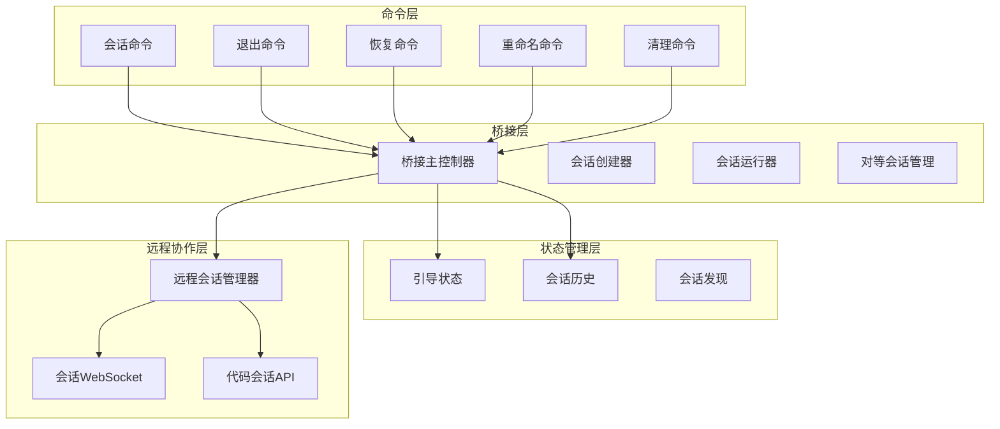
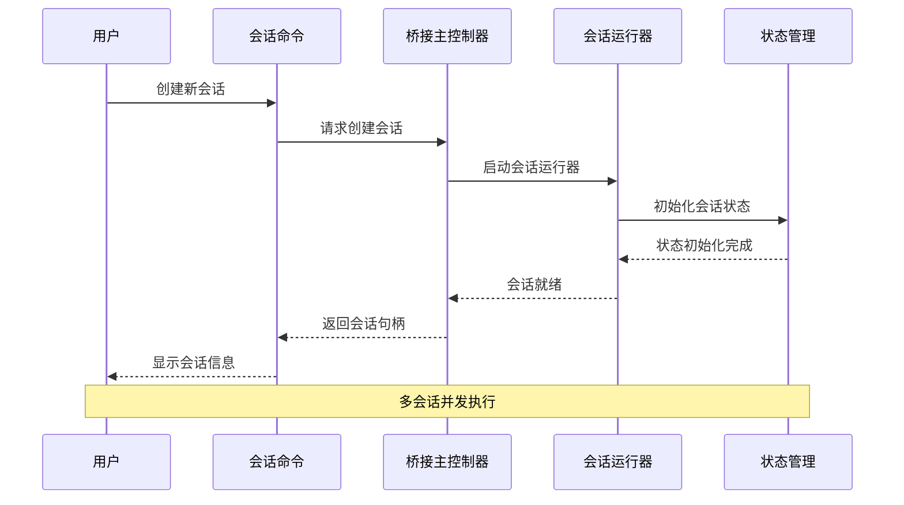
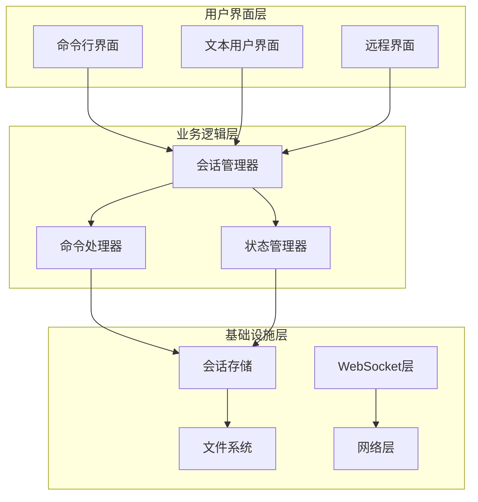
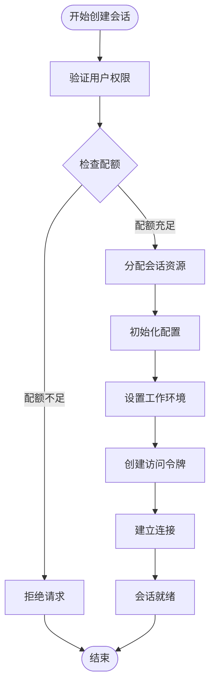
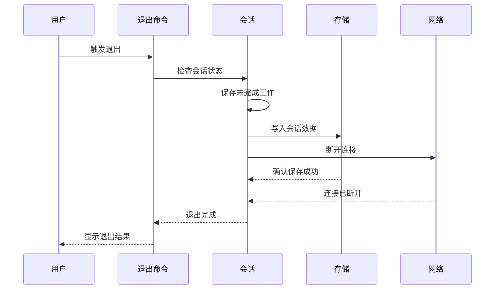
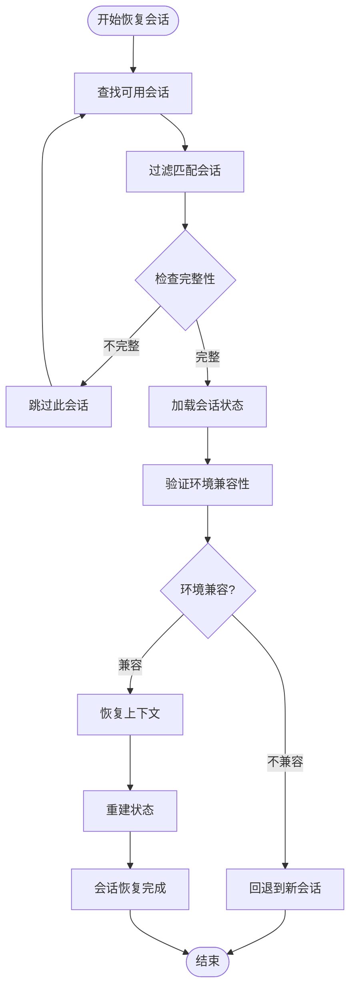
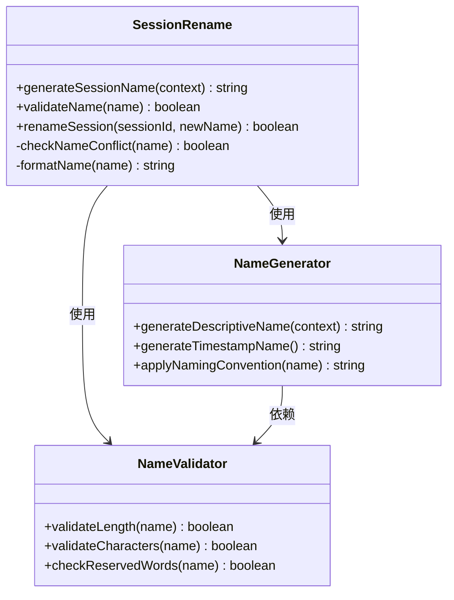
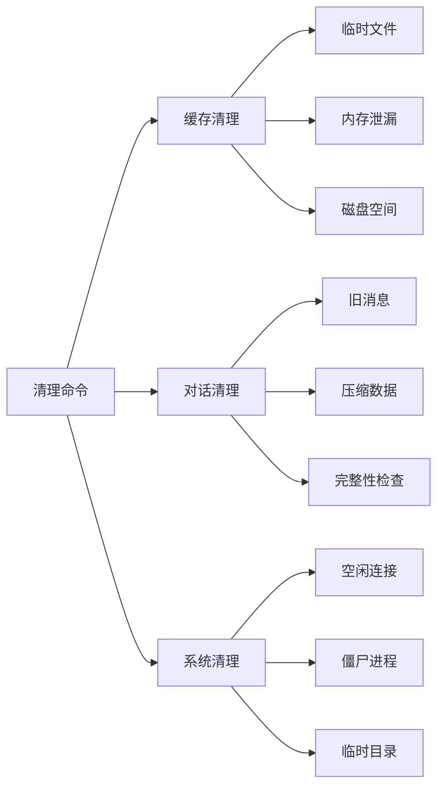
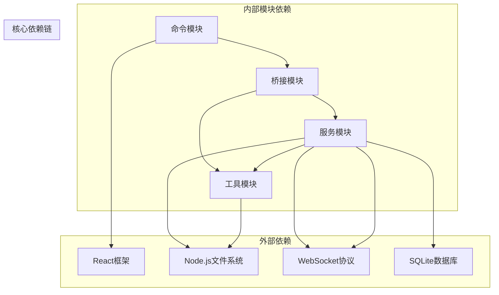

# 会话管理命令

<cite>
**本文档引用的文件**
- [src/commands/session/index.ts](file://src/commands/session/index.ts)
- [src/commands/session/session.tsx](file://src/commands/session/session.tsx)
- [src/commands/exit/exit.tsx](file://src/commands/exit/exit.tsx)
- [src/commands/exit/index.ts](file://src/commands/exit/index.ts)
- [src/commands/resume/index.ts](file://src/commands/resume/index.ts)
- [src/commands/resume/resume.tsx](file://src/commands/resume/resume.tsx)
- [src/commands/rename/index.ts](file://src/commands/rename/index.ts)
- [src/commands/rename/rename.ts](file://src/commands/rename/rename.ts)
- [src/commands/rename/generateSessionName.ts](file://src/commands/rename/generateSessionName.ts)
- [src/commands/clear/index.ts](file://src/commands/clear/index.ts)
- [src/commands/clear/clear.ts](file://src/commands/clear/clear.ts)
- [src/commands/clear/caches.ts](file://src/commands/clear/caches.ts)
- [src/commands/clear/conversation.ts](file://src/commands/clear/conversation.ts)
- [src/bridge/bridgeMain.ts](file://src/bridge/bridgeMain.ts)
- [src/bridge/createSession.ts](file://src/bridge/createSession.ts)
- [src/bridge/sessionRunner.ts](file://src/bridge/sessionRunner.ts)
- [src/bridge/peerSessions.ts](file://src/bridge/peerSessions.ts)
- [src/bridge/codeSessionApi.ts](file://src/bridge/codeSessionApi.ts)
- [src/bridge/types.ts](file://src/bridge/types.ts)
- [src/assistant/sessionDiscovery.ts](file://src/assistant/sessionDiscovery.ts)
- [src/assistant/sessionHistory.ts](file://src/assistant/sessionHistory.ts)
- [src/bootstrap/state.ts](file://src/bootstrap/state.ts)
- [src/hooks/useRemoteSession.ts](file://src/hooks/useRemoteSession.ts)
- [src/hooks/useSessionBackgrounding.ts](file://src/hooks/useSessionBackgrounding.ts)
- [src/remote/RemoteSessionManager.ts](file://src/remote/RemoteSessionManager.ts)
- [src/remote/SessionsWebSocket.ts](file://src/remote/SessionsWebSocket.ts)
- [src/tasks/LocalMainSessionTask.ts](file://src/tasks/LocalMainSessionTask.ts)
- [src/utils/listSessionsImpl.ts](file://src/utils/listSessionsImpl.ts)
</cite>

## 目录
1. [简介](#简介)
2. [项目结构](#项目结构)
3. [核心组件](#核心组件)
4. [架构概览](#架构概览)
5. [详细组件分析](#详细组件分析)
6. [依赖关系分析](#依赖关系分析)
7. [性能考虑](#性能考虑)
8. [故障排除指南](#故障排除指南)
9. [结论](#结论)

## 简介

会话管理命令是 Claude Code 开发环境中用于管理对话会话的核心功能模块。本文档深入介绍了会话创建（session）、退出（exit）、恢复（resume）、重命名（rename）和清理（clear）等会话相关命令的完整实现。这些命令支持多会话并发处理、状态持久化、远程协作和长时间开发任务管理。

会话管理系统采用分层架构设计，包含本地会话管理、远程会话协调、状态持久化和并发控制等多个层面。系统支持单用户多会话并发操作，提供智能会话恢复机制，并具备完善的错误处理和资源清理能力。

## 项目结构

会话管理功能分布在多个核心模块中：

**图表来源**
- [src/commands/session/index.ts](file://src/commands/session/index.ts)
- [src/bridge/bridgeMain.ts](file://src/bridge/bridgeMain.ts)
- [src/bootstrap/state.ts](file://src/bootstrap/state.ts)
- [src/remote/RemoteSessionManager.ts](file://src/remote/RemoteSessionManager.ts)

**章节来源**
- [src/commands/session/index.ts](file://src/commands/session/index.ts)
- [src/bridge/bridgeMain.ts](file://src/bridge/bridgeMain.ts)
- [src/bootstrap/state.ts](file://src/bootstrap/state.ts)

## 核心组件

### 会话生命周期管理

会话生命周期由以下关键组件协同管理：

1. **会话创建与初始化**
   - 通过 `createSession` 函数创建新会话
   - 初始化会话状态和配置
   - 设置会话元数据和工作树信息

2. **会话状态跟踪**
   - 使用 `Map` 数据结构跟踪活动会话
   - 维护会话启动时间和工作ID映射
   - 管理会话超时和容量限制

3. **会话持久化**
   - 支持会话状态持久化到磁盘
   - 实现会话数据备份和恢复
   - 提供会话历史记录管理

**章节来源**
- [src/bridge/createSession.ts](file://src/bridge/createSession.ts)
- [src/bridge/bridgeMain.ts](file://src/bridge/bridgeMain.ts)
- [src/bootstrap/state.ts](file://src/bootstrap/state.ts)

### 多会话并发处理

系统支持高效的多会话并发处理机制：

**图表来源**
- [src/bridge/bridgeMain.ts](file://src/bridge/bridgeMain.ts)
- [src/bridge/sessionRunner.ts](file://src/bridge/sessionRunner.ts)
- [src/bootstrap/state.ts](file://src/bootstrap/state.ts)

**章节来源**
- [src/bridge/bridgeMain.ts](file://src/bridge/bridgeMain.ts)
- [src/bridge/sessionRunner.ts](file://src/bridge/sessionRunner.ts)

## 架构概览

会话管理系统的整体架构采用分层设计：

**图表来源**
- [src/commands/session/session.tsx](file://src/commands/session/session.tsx)
- [src/bridge/bridgeMain.ts](file://src/bridge/bridgeMain.ts)
- [src/remote/RemoteSessionManager.ts](file://src/remote/RemoteSessionManager.ts)

## 详细组件分析

### 会话创建命令 (session)

会话创建命令负责初始化新的对话会话：

#### 核心功能特性

1. **会话初始化流程**
   - 验证用户权限和配额
   - 分配会话资源和容量
   - 初始化会话配置参数

2. **工作树集成**
   - 自动检测项目根目录
   - 配置 Git 工作树环境
   - 设置 IDE 集成选项

3. **远程会话支持**
   - 生成会话访问令牌
   - 建立安全连接通道
   - 同步会话状态到远程端

**图表来源**
- [src/commands/session/index.ts](file://src/commands/session/index.ts)
- [src/bridge/createSession.ts](file://src/bridge/createSession.ts)

**章节来源**
- [src/commands/session/index.ts](file://src/commands/session/index.ts)
- [src/commands/session/session.tsx](file://src/commands/session/session.tsx)

### 会话退出命令 (exit)

会话退出命令负责安全地终止会话并清理资源：

#### 退出流程管理

1. **优雅关闭流程**
   - 检查会话状态完整性
   - 保存未完成的工作
   - 清理临时文件和缓存

2. **资源释放策略**
   - 关闭数据库连接
   - 释放内存资源
   - 断开网络连接

3. **状态同步**
   - 更新会话历史记录
   - 发送退出通知
   - 维护会话统计信息

**图表来源**
- [src/commands/exit/exit.tsx](file://src/commands/exit/exit.tsx)
- [src/commands/exit/index.ts](file://src/commands/exit/index.ts)

**章节来源**
- [src/commands/exit/exit.tsx](file://src/commands/exit/exit.tsx)
- [src/commands/exit/index.ts](file://src/commands/exit/index.ts)

### 会话恢复命令 (resume)

会话恢复命令支持从之前的会话状态继续工作：

#### 恢复机制设计

1. **会话状态检索**
   - 查找可用的会话历史
   - 验证会话完整性
   - 加载会话配置数据

2. **状态一致性检查**
   - 比较工作树变更
   - 验证依赖项版本
   - 检查环境兼容性

3. **增量恢复策略**
   - 恢复对话历史
   - 重建上下文状态
   - 恢复用户偏好设置

**图表来源**
- [src/commands/resume/index.ts](file://src/commands/resume/index.ts)
- [src/commands/resume/resume.tsx](file://src/commands/resume/resume.tsx)

**章节来源**
- [src/commands/resume/index.ts](file://src/commands/resume/index.ts)
- [src/commands/resume/resume.tsx](file://src/commands/resume/resume.tsx)

### 会话重命名命令 (rename)

会话重命名命令允许用户自定义会话标识符：

#### 命名规范系统

1. **自动命名生成**
   - 基于项目内容生成描述性名称
   - 使用时间戳确保唯一性
   - 应用命名约定和格式化规则

2. **手动命名支持**
   - 允许用户自定义会话名称
   - 提供命名验证和冲突检测
   - 支持批量重命名操作

3. **命名持久化**
   - 更新会话元数据存储
   - 同步到所有相关组件
   - 维护命名历史记录

**图表来源**
- [src/commands/rename/rename.ts](file://src/commands/rename/rename.ts)
- [src/commands/rename/generateSessionName.ts](file://src/commands/rename/generateSessionName.ts)

**章节来源**
- [src/commands/rename/index.ts](file://src/commands/rename/index.ts)
- [src/commands/rename/rename.ts](file://src/commands/rename/rename.ts)
- [src/commands/rename/generateSessionName.ts](file://src/commands/rename/generateSessionName.ts)

### 会话清理命令 (clear)

会话清理命令提供多种清理选项以管理会话资源：

#### 清理策略分类

1. **会话缓存清理**
   - 清理临时文件和中间结果
   - 释放内存占用
   - 优化磁盘空间使用

2. **对话历史清理**
   - 删除过期的对话记录
   - 压缩历史数据
   - 维护数据完整性

3. **系统资源清理**
   - 关闭空闲连接
   - 释放僵尸进程
   - 清理临时目录

**图表来源**
- [src/commands/clear/clear.ts](file://src/commands/clear/clear.ts)
- [src/commands/clear/caches.ts](file://src/commands/clear/caches.ts)
- [src/commands/clear/conversation.ts](file://src/commands/clear/conversation.ts)

**章节来源**
- [src/commands/clear/index.ts](file://src/commands/clear/index.ts)
- [src/commands/clear/clear.ts](file://src/commands/clear/clear.ts)
- [src/commands/clear/caches.ts](file://src/commands/clear/caches.ts)
- [src/commands/clear/conversation.ts](file://src/commands/clear/conversation.ts)

## 依赖关系分析

会话管理系统的依赖关系呈现复杂的层次结构：

**图表来源**
- [src/commands.ts](file://src/commands.ts)
- [src/bridge/bridgeMain.ts](file://src/bridge/bridgeMain.ts)
- [src/utils/listSessionsImpl.ts](file://src/utils/listSessionsImpl.ts)

**章节来源**
- [src/commands.ts](file://src/commands.ts)
- [src/bridge/bridgeMain.ts](file://src/bridge/bridgeMain.ts)

## 性能考虑

会话管理系统在性能方面采用了多项优化策略：

### 并发处理优化

1. **会话池管理**
   - 动态调整会话池大小
   - 实现会话预热机制
   - 优化资源分配算法

2. **内存管理**
   - 实现会话状态压缩
   - 使用弱引用避免内存泄漏
   - 定期清理无用数据

3. **I/O 优化**
   - 批量文件操作
   - 异步数据处理
   - 缓存策略优化

### 资源监控

系统提供实时资源监控功能：

- **会话资源使用统计**
- **内存占用分析**
- **CPU 使用率监控**
- **网络带宽使用情况**

## 故障排除指南

### 常见问题及解决方案

#### 会话创建失败

**问题症状**
- 会话创建超时
- 资源分配失败
- 权限验证错误

**解决步骤**
1. 检查系统资源配额
2. 验证用户权限设置
3. 确认网络连接状态
4. 查看系统日志获取详细错误信息

#### 会话恢复异常

**问题症状**
- 会话状态不一致
- 数据丢失或损坏
- 环境兼容性问题

**解决步骤**
1. 检查会话历史完整性
2. 验证工作树状态
3. 确认依赖项版本兼容
4. 尝试回退到备份会话

#### 并发会话冲突

**问题症状**
- 会话间数据竞争
- 资源锁定超时
- 状态更新冲突

**解决步骤**
1. 检查会话锁机制
2. 验证事务隔离级别
3. 实施适当的同步策略
4. 优化并发控制算法

**章节来源**
- [src/bridge/bridgeMain.ts](file://src/bridge/bridgeMain.ts)
- [src/bootstrap/state.ts](file://src/bootstrap/state.ts)

## 结论

会话管理命令系统提供了完整的会话生命周期管理解决方案，支持多会话并发处理、智能状态恢复和高效的资源管理。系统的设计充分考虑了用户体验、性能优化和可靠性保障。

通过标准化的会话管理接口和灵活的配置选项，该系统能够适应各种开发场景，从个人开发者到大型团队协作都能找到合适的使用模式。建议在实际使用中遵循最佳实践，合理规划会话命名、状态保存和资源清理策略，以获得最佳的开发体验。