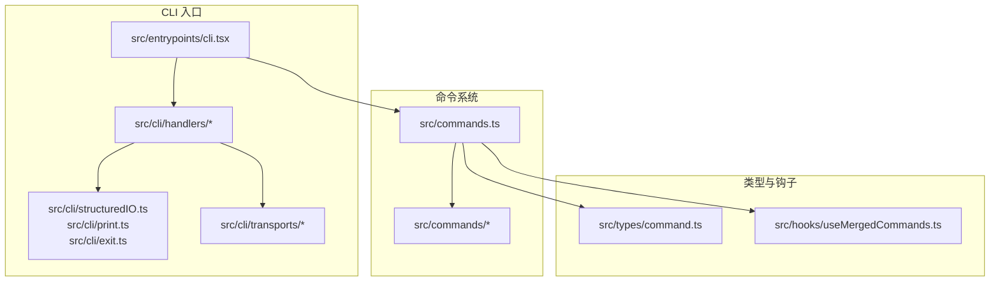
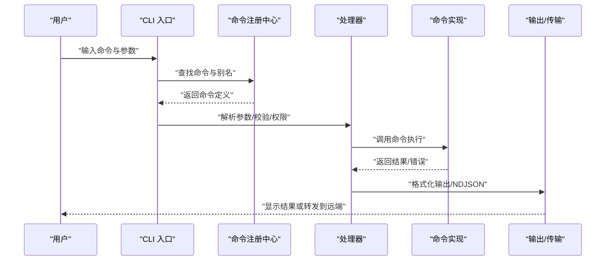
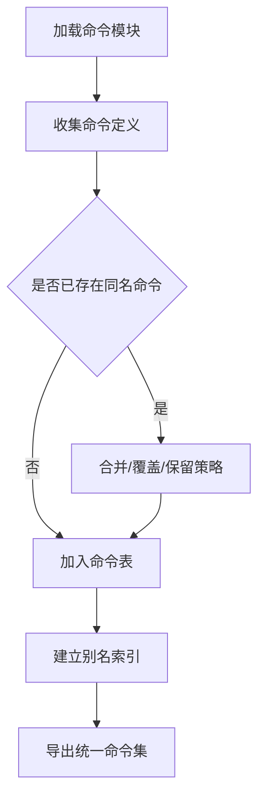
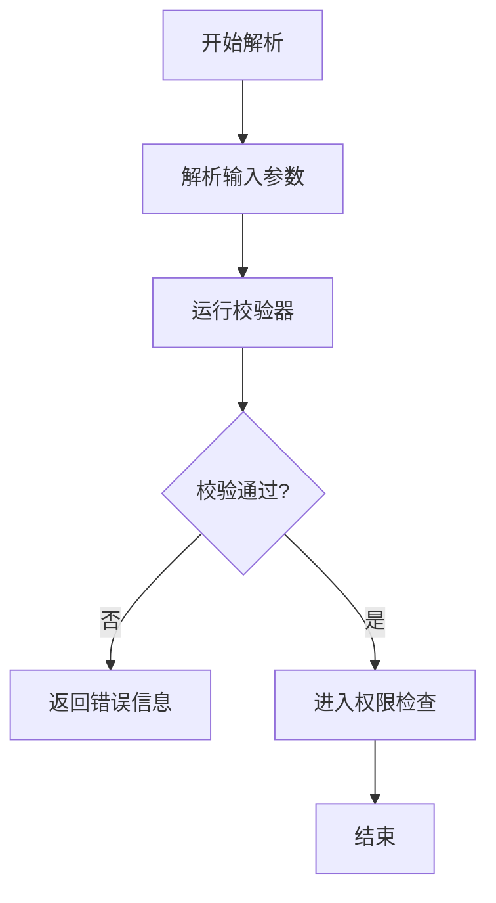
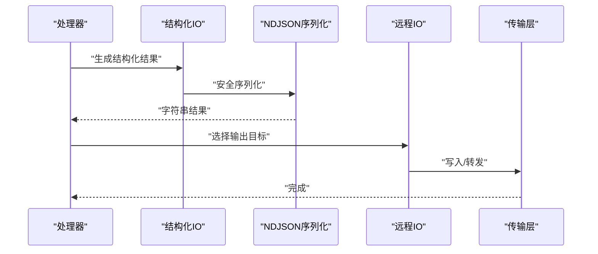
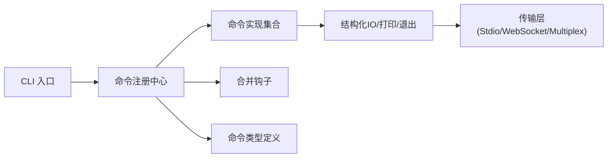

# 命令系统

<cite>
**本文引用的文件**
- [commands.ts](file://src/commands.ts)
- [init.ts](file://src/commands/init.ts)
- [version.ts](file://src/commands/version.ts)
- [help/help.tsx](file://src/commands/help/help.tsx)
- [config/config.tsx](file://src/commands/config/config.tsx)
- [status/status.tsx](file://src/commands/status/status.tsx)
- [cli.tsx](file://src/entrypoints/cli.tsx)
- [handlers/util.tsx](file://src/cli/handlers/util.tsx)
- [structuredIO.ts](file://src/cli/structuredIO.ts)
- [print.ts](file://src/cli/print.ts)
- [exit.ts](file://src/cli/exit.ts)
- [ndjsonSafeStringify.ts](file://src/cli/ndjsonSafeStringify.ts)
- [remoteIO.ts](file://src/cli/remoteIO.ts)
- [transports/stdio.ts](file://src/cli/transports/stdio.ts)
- [transports/websocket.ts](file://src/cli/transports/websocket.ts)
- [transports/multiplex.ts](file://src/cli/transports/multiplex.ts)
- [createMovedToPluginCommand.ts](file://src/commands/createMovedToPluginCommand.ts)
- [exampleCommands.ts](file://src/utils/exampleCommands.ts)
- [commandLifecycle.ts](file://src/utils/commandLifecycle.ts)
- [command.ts](file://src/types/command.ts)
- [useMergedCommands.ts](file://src/hooks/useMergedCommands.ts)
- [init-verifiers.ts](file://src/commands/init-verifiers.ts)
</cite>

## 目录
1. [简介](#简介)
2. [项目结构](#项目结构)
3. [核心组件](#核心组件)
4. [架构总览](#架构总览)
5. [详细组件分析](#详细组件分析)
6. [依赖分析](#依赖分析)
7. [性能考虑](#性能考虑)
8. [故障排除指南](#故障排除指南)
9. [结论](#结论)
10. [附录](#附录)

## 简介
本文件系统性阐述命令系统（Commands）的技术设计与实现细节，覆盖命令注册机制、参数解析、权限验证与执行流程；详解基础命令（init、help、config、status 等）的功能与使用方式；说明扩展机制（新增命令、别名与组合）、与工具系统、配置管理及用户界面的交互关系，并提供可操作的使用示例与排障建议。

## 项目结构
命令系统位于 src/commands 目录下，采用“按功能分包”的组织方式：每个命令一个子目录，包含入口 index.ts 与具体实现文件（多为 .tsx）。命令系统通过统一的注册与调度入口进行集中管理，并通过 CLI 入口与传输层对接终端或远程环境。

图表来源
- [commands.ts](file://src/commands.ts)
- [cli.tsx](file://src/entrypoints/cli.tsx)
- [structuredIO.ts](file://src/cli/structuredIO.ts)
- [print.ts](file://src/cli/print.ts)
- [exit.ts](file://src/cli/exit.ts)
- [transports/stdio.ts](file://src/cli/transports/stdio.ts)
- [transports/websocket.ts](file://src/cli/transports/websocket.ts)
- [transports/multiplex.ts](file://src/cli/transports/multiplex.ts)
- [command.ts](file://src/types/command.ts)
- [useMergedCommands.ts](file://src/hooks/useMergedCommands.ts)

章节来源
- [commands.ts](file://src/commands.ts)
- [cli.tsx](file://src/entrypoints/cli.tsx)

## 核心组件
- 命令注册与聚合
  - 统一注册入口负责收集各命令模块并建立命令表，支持别名映射与去重合并。
  - 合并钩子用于整合内置命令与插件命令，形成最终可用命令集。
- 参数解析与校验
  - 通过参数定义与校验器完成输入解析、默认值注入与类型约束。
- 权限与安全
  - 执行前进行权限检查与风险评估，必要时触发确认流程。
- 输出与传输
  - 支持结构化输出（JSON/NDJSON）、人类可读输出与远程传输协议。
- 生命周期与可观测性
  - 提供命令生命周期钩子，便于日志、指标与审计。

章节来源
- [commands.ts](file://src/commands.ts)
- [useMergedCommands.ts](file://src/hooks/useMergedCommands.ts)
- [command.ts](file://src/types/command.ts)
- [commandLifecycle.ts](file://src/utils/commandLifecycle.ts)

## 架构总览
命令系统围绕“注册—解析—验证—执行—输出—传输”闭环展开，CLI 入口负责接收与路由，处理器负责参数解析与权限校验，命令实现负责业务逻辑，传输层负责输出与远端通信。

图表来源
- [cli.tsx](file://src/entrypoints/cli.tsx)
- [commands.ts](file://src/commands.ts)
- [handlers/util.tsx](file://src/cli/handlers/util.tsx)
- [structuredIO.ts](file://src/cli/structuredIO.ts)
- [ndjsonSafeStringify.ts](file://src/cli/ndjsonSafeStringify.ts)
- [remoteIO.ts](file://src/cli/remoteIO.ts)

## 详细组件分析

### 命令注册与发现
- 注册入口
  - 聚合所有命令模块，构建命令表与别名索引，确保唯一性与可发现性。
- 合并与去重
  - 合并钩子将内置命令与插件命令统一，处理同名冲突与优先级。
- 示例与迁移
  - 迁移提示命令用于引导用户从旧命令迁移到新插件命令。

图表来源
- [commands.ts](file://src/commands.ts)
- [useMergedCommands.ts](file://src/hooks/useMergedCommands.ts)
- [createMovedToPluginCommand.ts](file://src/commands/createMovedToPluginCommand.ts)

章节来源
- [commands.ts](file://src/commands.ts)
- [useMergedCommands.ts](file://src/hooks/useMergedCommands.ts)
- [createMovedToPluginCommand.ts](file://src/commands/createMovedToPluginCommand.ts)

### 参数解析与校验
- 参数定义
  - 每个命令在自身目录内定义参数签名、默认值与描述。
- 解析与校验
  - 处理器对输入进行解析，应用默认值、类型转换与约束校验。
- 错误处理
  - 参数不合法时返回明确错误信息，指导用户修正。

图表来源
- [handlers/util.tsx](file://src/cli/handlers/util.tsx)
- [init-verifiers.ts](file://src/commands/init-verifiers.ts)

章节来源
- [handlers/util.tsx](file://src/cli/handlers/util.tsx)
- [init-verifiers.ts](file://src/commands/init-verifiers.ts)

### 权限验证与安全
- 权限检查
  - 在执行前对敏感命令进行权限核验，必要时弹出确认对话。
- 审计与日志
  - 记录命令执行上下文，便于审计与问题追踪。

章节来源
- [commandLifecycle.ts](file://src/utils/commandLifecycle.ts)

### 执行流程与输出
- 结构化输出
  - 使用结构化 IO 与 NDJSON 安全序列化，保证机器可读性。
- 人类可读输出
  - 对结构化数据进行格式化渲染，提升可读性。
- 远程传输
  - 通过传输层将结果发送至远端或标准输出。

图表来源
- [structuredIO.ts](file://src/cli/structuredIO.ts)
- [ndjsonSafeStringify.ts](file://src/cli/ndjsonSafeStringify.ts)
- [remoteIO.ts](file://src/cli/remoteIO.ts)
- [transports/stdio.ts](file://src/cli/transports/stdio.ts)
- [transports/websocket.ts](file://src/cli/transports/websocket.ts)
- [transports/multiplex.ts](file://src/cli/transports/multiplex.ts)

章节来源
- [structuredIO.ts](file://src/cli/structuredIO.ts)
- [ndjsonSafeStringify.ts](file://src/cli/ndjsonSafeStringify.ts)
- [remoteIO.ts](file://src/cli/remoteIO.ts)
- [transports/stdio.ts](file://src/cli/transports/stdio.ts)
- [transports/websocket.ts](file://src/cli/transports/websocket.ts)
- [transports/multiplex.ts](file://src/cli/transports/multiplex.ts)

### 基础命令详解

#### init 命令
- 功能概述
  - 初始化项目配置与工作环境，生成必要的配置文件与目录。
- 关键实现
  - 参数解析与默认值注入，初始化校验器确保前置条件满足。
- 使用示例
  - 命令行：执行初始化命令后，系统会根据参数生成配置并提示下一步操作。
- 输出与交互
  - 结构化输出初始化状态，必要时通过人类可读输出给出指引。

章节来源
- [init.ts](file://src/commands/init.ts)
- [init-verifiers.ts](file://src/commands/init-verifiers.ts)

#### help 命令
- 功能概述
  - 展示可用命令列表与帮助信息，支持按命令过滤与详情查看。
- 关键实现
  - 从注册中心获取命令清单，动态生成帮助页面。
- 使用示例
  - 命令行：输入帮助命令后，系统列出所有命令及其简要说明。

章节来源
- [help/help.tsx](file://src/commands/help/help.tsx)
- [commands.ts](file://src/commands.ts)

#### config 命令
- 功能概述
  - 查看与修改配置项，支持增删改查与配置验证。
- 关键实现
  - 与配置管理模块协作，执行读写操作并进行一致性校验。
- 使用示例
  - 命令行：查看当前配置、设置某项配置值或导出配置。

章节来源
- [config/config.tsx](file://src/commands/config/config.tsx)
- [commands.ts](file://src/commands.ts)

#### status 命令
- 功能概述
  - 展示系统状态、连接状态与运行指标，辅助诊断与运维。
- 关键实现
  - 聚合状态信息源，格式化输出关键指标与健康度。
- 使用示例
  - 命令行：执行状态命令后，系统输出当前运行状态与建议。

章节来源
- [status/status.tsx](file://src/commands/status/status.tsx)
- [commands.ts](file://src/commands.ts)

### 扩展机制
- 新增命令
  - 在 src/commands 下新建目录，编写命令实现与入口文件，注册入口会自动发现并纳入命令表。
- 别名支持
  - 在命令定义中声明别名，注册阶段建立映射，执行时可使用任一名称。
- 命令组合
  - 通过组合命令或脚本化调用实现复杂流程，结合参数传递与输出重定向。

章节来源
- [commands.ts](file://src/commands.ts)
- [createMovedToPluginCommand.ts](file://src/commands/createMovedToPluginCommand.ts)

### 与工具系统、配置管理与用户界面的交互
- 工具系统
  - 命令执行可能触发工具调用，需遵循工具权限与限制策略。
- 配置管理
  - 命令读写配置，变更需经过校验与持久化，避免破坏性修改。
- 用户界面
  - CLI 与图形界面共享同一套命令与参数解析逻辑，界面层负责渲染与交互。

章节来源
- [handlers/util.tsx](file://src/cli/handlers/util.tsx)
- [config/config.tsx](file://src/commands/config/config.tsx)
- [cli.tsx](file://src/entrypoints/cli.tsx)

## 依赖分析
命令系统与 CLI、传输层、类型定义与钩子之间存在清晰的依赖关系，耦合度低、内聚性强，便于扩展与维护。

图表来源
- [cli.tsx](file://src/entrypoints/cli.tsx)
- [commands.ts](file://src/commands.ts)
- [useMergedCommands.ts](file://src/hooks/useMergedCommands.ts)
- [command.ts](file://src/types/command.ts)
- [structuredIO.ts](file://src/cli/structuredIO.ts)
- [transports/stdio.ts](file://src/cli/transports/stdio.ts)
- [transports/websocket.ts](file://src/cli/transports/websocket.ts)
- [transports/multiplex.ts](file://src/cli/transports/multiplex.ts)

章节来源
- [commands.ts](file://src/commands.ts)
- [cli.tsx](file://src/entrypoints/cli.tsx)
- [command.ts](file://src/types/command.ts)
- [useMergedCommands.ts](file://src/hooks/useMergedCommands.ts)

## 性能考虑
- 解析与校验
  - 将参数解析与校验前置，减少无效执行开销。
- 输出优化
  - 优先使用结构化输出，避免冗余格式化；仅在需要时进行人类可读渲染。
- 并发与批处理
  - 对批量命令采用并发策略，注意资源竞争与限流控制。
- 缓存与复用
  - 对重复查询与配置读取进行缓存，降低 I/O 压力。

## 故障排除指南
- 参数错误
  - 症状：命令执行失败并提示参数不合法。
  - 排查：检查参数类型、必填项与取值范围；参考帮助命令获取正确用法。
- 权限不足
  - 症状：敏感命令被拒绝执行。
  - 排查：确认账户权限与配置；按提示进行授权或切换身份。
- 输出异常
  - 症状：输出格式不符合预期或无法解析。
  - 排查：确认传输层配置与目标输出设备；检查 NDJSON 序列化是否正确。
- 远程连接问题
  - 症状：远端无响应或断连。
  - 排查：检查网络与认证配置；确认传输协议与端口可达。

章节来源
- [handlers/util.tsx](file://src/cli/handlers/util.tsx)
- [structuredIO.ts](file://src/cli/structuredIO.ts)
- [ndjsonSafeStringify.ts](file://src/cli/ndjsonSafeStringify.ts)
- [remoteIO.ts](file://src/cli/remoteIO.ts)
- [transports/stdio.ts](file://src/cli/transports/stdio.ts)
- [transports/websocket.ts](file://src/cli/transports/websocket.ts)
- [transports/multiplex.ts](file://src/cli/transports/multiplex.ts)

## 结论
命令系统以清晰的注册与调度机制为核心，配合完善的参数解析、权限验证与输出传输能力，实现了高可扩展性与易用性。通过标准化的接口与类型定义，命令系统与工具、配置与界面紧密协作，既满足 CLI 场景下的高效操作，也为未来插件化与生态扩展奠定了坚实基础。

## 附录
- 常用命令速查
  - init：初始化项目配置
  - help：查看命令与参数帮助
  - config：查看/修改配置
  - status：查看系统状态
- 示例命令路径参考
  - [init.ts](file://src/commands/init.ts)
  - [help/help.tsx](file://src/commands/help/help.tsx)
  - [config/config.tsx](file://src/commands/config/config.tsx)
  - [status/status.tsx](file://src/commands/status/status.tsx)
  - [exampleCommands.ts](file://src/utils/exampleCommands.ts)