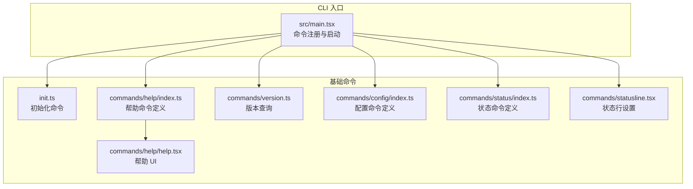
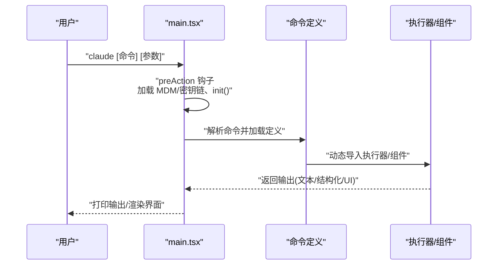
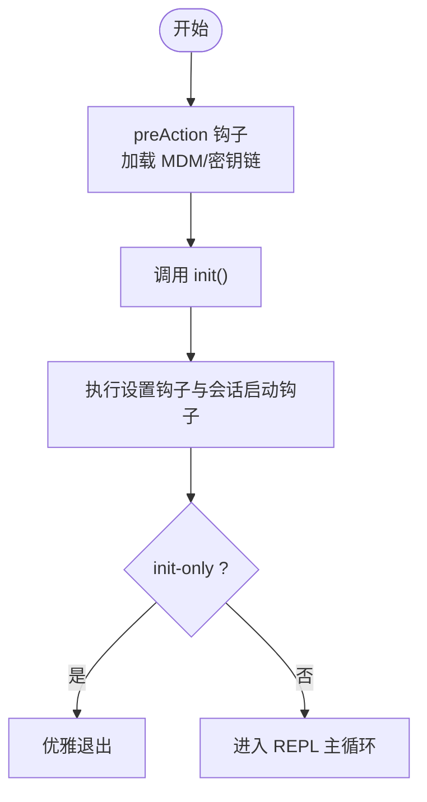
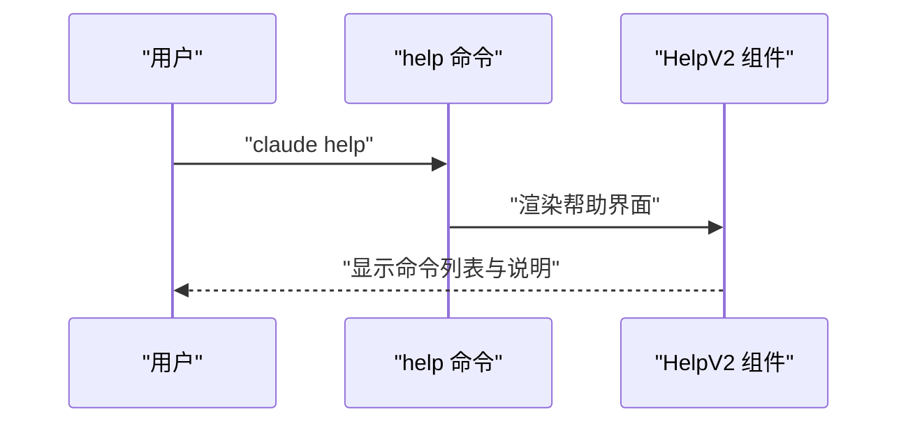
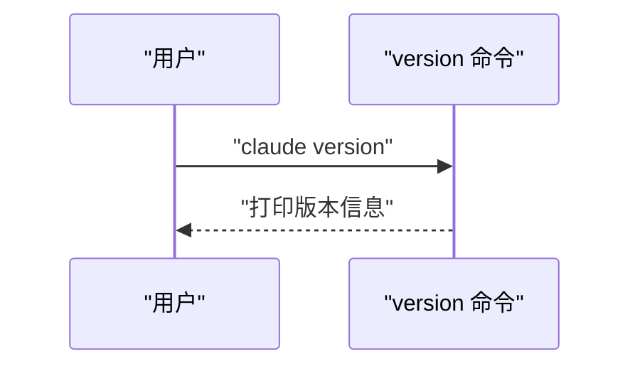
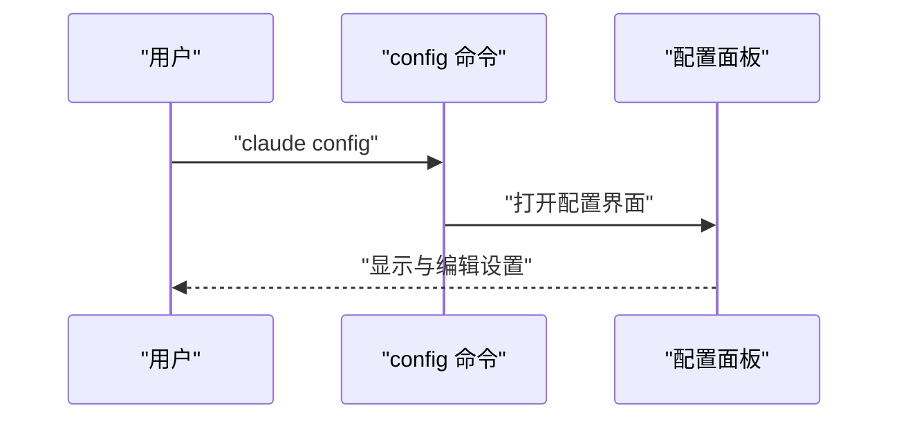
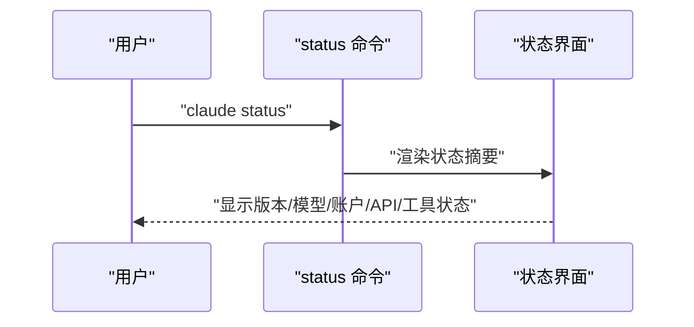
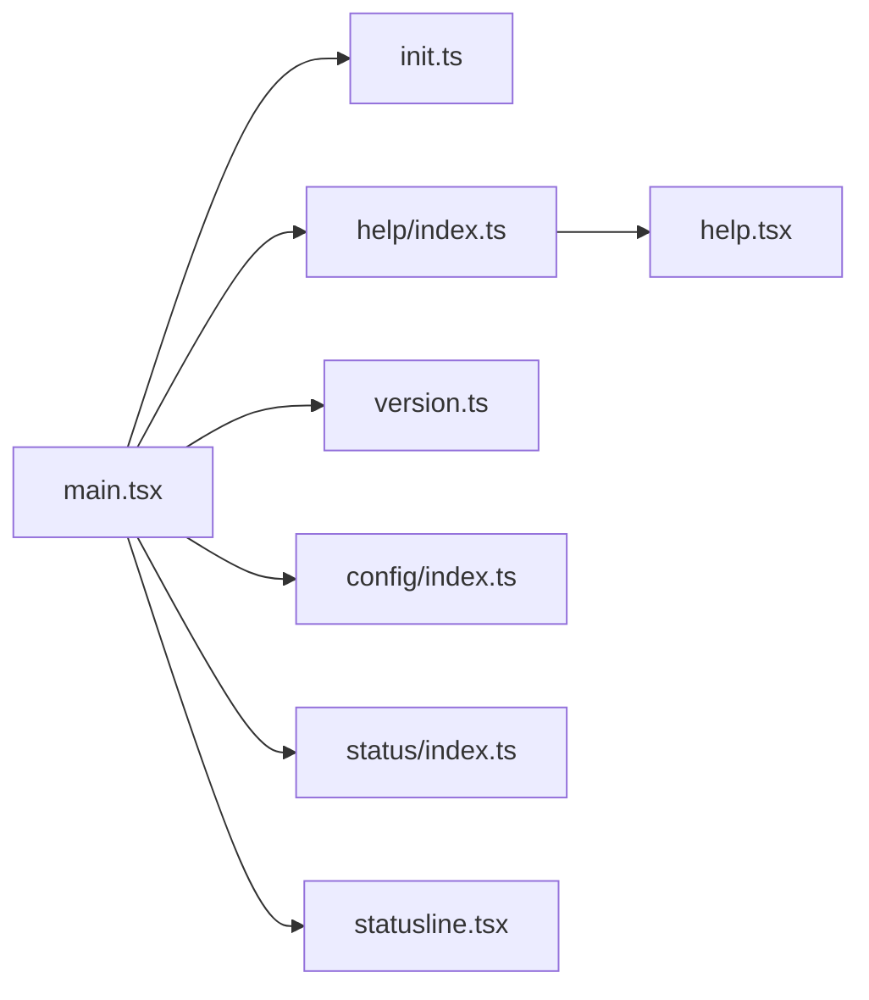

# 基础命令

<cite>
**本文引用的文件**
- [src/commands/init.ts](file://src/commands/init.ts)
- [src/entrypoints/init.ts](file://src/entrypoints/init.ts)
- [src/commands/help/index.ts](file://src/commands/help/index.ts)
- [src/commands/help/help.tsx](file://src/commands/help/help.tsx)
- [src/commands/version.ts](file://src/commands/version.ts)
- [src/commands/config/index.ts](file://src/commands/config/index.ts)
- [src/commands/status/index.ts](file://src/commands/status/index.ts)
- [src/main.tsx](file://src/main.tsx)
- [src/commands/statusline.tsx](file://src/commands/statusline.tsx)
</cite>

## 目录
1. [简介](#简介)
2. [项目结构](#项目结构)
3. [核心组件](#核心组件)
4. [架构总览](#架构总览)
5. [详细组件分析](#详细组件分析)
6. [依赖分析](#依赖分析)
7. [性能考虑](#性能考虑)
8. [故障排查指南](#故障排查指南)
9. [结论](#结论)
10. [附录](#附录)

## 简介
本文件聚焦于 Claude Code CLI 的基础命令：初始化（init）、帮助系统（help）、版本查询（version）、配置管理（config）与状态检查（status）。我们将从系统启动流程、命令注册与执行路径、数据与控制流、错误处理与性能特征等方面进行深入解析，并给出使用场景、参数选项、输出格式与典型示例，帮助开发者与用户在系统启动、故障排查与日常使用中高效利用这些命令。

## 项目结构
基础命令由“命令定义 + 执行器”两部分构成：
- 命令定义：位于 src/commands 下各子目录的 index.ts 或同名文件，声明命令名称、别名、描述、是否支持非交互模式、加载方式等元信息。
- 执行器：本地命令通常为纯函数；本地 JSX 命令通过 React 组件渲染 UI；部分命令通过动态导入加载实际逻辑。

图表来源
- [src/main.tsx](file://src/main.tsx)
- [src/commands/init.ts](file://src/commands/init.ts)
- [src/commands/help/index.ts](file://src/commands/help/index.ts)
- [src/commands/help/help.tsx](file://src/commands/help/help.tsx)
- [src/commands/version.ts](file://src/commands/version.ts)
- [src/commands/config/index.ts](file://src/commands/config/index.ts)
- [src/commands/status/index.ts](file://src/commands/status/index.ts)
- [src/commands/statusline.tsx](file://src/commands/statusline.tsx)

章节来源
- [src/main.tsx](file://src/main.tsx)
- [src/commands/help/index.ts](file://src/commands/help/index.ts)
- [src/commands/help/help.tsx](file://src/commands/help/help.tsx)
- [src/commands/version.ts](file://src/commands/version.ts)
- [src/commands/config/index.ts](file://src/commands/config/index.ts)
- [src/commands/status/index.ts](file://src/commands/status/index.ts)
- [src/commands/statusline.tsx](file://src/commands/statusline.tsx)

## 核心组件
- 初始化命令（init）
  - 功能：在首次运行或需要重建环境时执行初始化流程，确保配置、插件、会话等基础设施就绪。
  - 特性：支持 init-only 模式，仅执行初始化钩子后退出；与主 REPL 启动流程解耦。
  - 使用场景：新环境部署、重置工作树、维护模式下的环境准备。
  - 输出：以结构化事件形式记录初始化阶段与结果，便于日志追踪。
  
- 帮助系统（help）
  - 功能：展示可用命令列表与帮助信息，支持按命令过滤与交互式查看。
  - 特性：本地 JSX 命令，渲染 React 组件；可直接在终端内交互。
  - 使用场景：初次使用、快速查阅命令与参数、定位相关工具。
  - 输出：交互式 UI 展示命令与说明。
  
- 版本查询（version）
  - 功能：打印当前会话运行的版本号，可包含构建时间信息。
  - 特性：仅在特定用户类型下启用；支持非交互模式。
  - 使用场景：诊断问题、确认安装版本、自动化脚本识别版本。
  - 输出：文本字符串，包含版本与构建时间（若可用）。
  
- 配置管理（config）
  - 功能：打开配置面板，统一管理全局与项目级设置。
  - 特性：本地 JSX 命令；别名为 settings；与设置同步机制集成。
  - 使用场景：调整行为开关、模型选择、权限策略、代理与网络设置。
  - 输出：交互式配置界面。
  
- 状态检查（status）
  - 功能：汇总显示版本、模型、账户、API 连通性与工具状态等关键指标。
  - 特性：立即执行（immediate），用于快速诊断。
  - 使用场景：启动后自检、连接异常排查、权限与认证问题定位。
  - 输出：结构化状态摘要，便于快速判断健康状况。

章节来源
- [src/commands/init.ts](file://src/commands/init.ts)
- [src/entrypoints/init.ts](file://src/entrypoints/init.ts)
- [src/commands/help/index.ts](file://src/commands/help/index.ts)
- [src/commands/help/help.tsx](file://src/commands/help/help.tsx)
- [src/commands/version.ts](file://src/commands/version.ts)
- [src/commands/config/index.ts](file://src/commands/config/index.ts)
- [src/commands/status/index.ts](file://src/commands/status/index.ts)
- [src/commands/statusline.tsx](file://src/commands/statusline.tsx)

## 架构总览
基础命令在 CLI 启动时被注册，并在 preAction 钩子中完成初始化。命令执行路径遵循“定义 → 加载 → 调用”的模式，其中本地 JSX 命令通过 React 组件渲染 UI，本地命令通过纯函数返回文本或结构化输出。

图表来源
- [src/main.tsx](file://src/main.tsx)
- [src/commands/help/index.ts](file://src/commands/help/index.ts)
- [src/commands/help/help.tsx](file://src/commands/help/help.tsx)
- [src/commands/version.ts](file://src/commands/version.ts)
- [src/commands/config/index.ts](file://src/commands/config/index.ts)
- [src/commands/status/index.ts](file://src/commands/status/index.ts)

## 详细组件分析

### 初始化命令（init）
- 实现要点
  - 命令入口与执行逻辑位于命令模块，支持 init-only 模式，避免进入 REPL 主循环。
  - 在主程序的 preAction 钩子中完成 MDM 设置与密钥链预取，随后调用 init()，保证后续设置读取与信任建立的正确性。
  - 初始化完成后，根据配置触发设置钩子与会话启动钩子，最后优雅退出。
- 参数与行为
  - 无显式参数；通过 init-only 选项控制仅执行初始化。
  - 支持非交互模式，适合自动化脚本与 CI 场景。
- 使用场景
  - 新环境首次部署、重置工作树、维护模式准备。
- 输出与日志
  - 记录初始化阶段与结果，便于审计与排障。

图表来源
- [src/main.tsx](file://src/main.tsx)
- [src/commands/init.ts](file://src/commands/init.ts)
- [src/entrypoints/init.ts](file://src/entrypoints/init.ts)

章节来源
- [src/commands/init.ts](file://src/commands/init.ts)
- [src/entrypoints/init.ts](file://src/entrypoints/init.ts)
- [src/main.tsx](file://src/main.tsx)

### 帮助系统（help）
- 实现要点
  - 命令定义声明为本地 JSX 命令，加载 React 组件 HelpV2 渲染帮助界面。
  - 支持传入选项（如 commands 列表）以筛选或展示特定命令。
- 参数与行为
  - 无必需参数；可通过选项限制显示范围。
  - 交互式 UI，适合在终端内浏览命令与说明。
- 使用场景
  - 快速查阅命令列表、查看命令详情、定位相关工具。
- 输出与日志
  - 渲染帮助界面；不产生结构化输出。

图表来源
- [src/commands/help/index.ts](file://src/commands/help/index.ts)
- [src/commands/help/help.tsx](file://src/commands/help/help.tsx)

章节来源
- [src/commands/help/index.ts](file://src/commands/help/index.ts)
- [src/commands/help/help.tsx](file://src/commands/help/help.tsx)

### 版本查询（version）
- 实现要点
  - 本地命令，返回当前会话运行的版本号；若存在构建时间信息则一并输出。
  - 仅在特定用户类型下启用；支持非交互模式。
- 参数与行为
  - 无参数；输出为单行文本。
- 使用场景
  - 诊断问题、确认安装版本、自动化脚本识别版本。
- 输出与日志
  - 文本输出，包含版本与构建时间（若可用）。

图表来源
- [src/commands/version.ts](file://src/commands/version.ts)

章节来源
- [src/commands/version.ts](file://src/commands/version.ts)

### 配置管理（config）
- 实现要点
  - 命令定义为本地 JSX 命令，别名为 settings；加载配置面板组件。
  - 与设置同步机制集成，支持全局与项目级设置的统一管理。
- 参数与行为
  - 无必需参数；通过交互式界面进行配置修改。
- 使用场景
  - 调整行为开关、模型选择、权限策略、代理与网络设置。
- 输出与日志
  - 渲染配置界面；不产生结构化输出。

图表来源
- [src/commands/config/index.ts](file://src/commands/config/index.ts)

章节来源
- [src/commands/config/index.ts](file://src/commands/config/index.ts)

### 状态检查（status）
- 实现要点
  - 本地 JSX 命令，声明为立即执行（immediate），用于快速诊断系统健康状况。
  - 汇总版本、模型、账户、API 连通性与工具状态等关键指标。
- 参数与行为
  - 无必需参数；立即返回状态摘要。
- 使用场景
  - 启动后自检、连接异常排查、权限与认证问题定位。
- 输出与日志
  - 结构化状态摘要，便于快速判断健康状况。

图表来源
- [src/commands/status/index.ts](file://src/commands/status/index.ts)

章节来源
- [src/commands/status/index.ts](file://src/commands/status/index.ts)

### 状态行设置（statusline）
- 实现要点
  - 作为内置提示型命令，允许用户基于 shell PS1 配置生成状态行。
  - 通过代理工具与文件读写工具生成相应提示内容。
- 参数与行为
  - 支持传入自定义提示；禁用非交互模式。
- 使用场景
  - 自定义终端状态行，提升开发效率与上下文感知。
- 输出与日志
  - 生成提示内容块，供代理工具使用。

章节来源
- [src/commands/statusline.tsx](file://src/commands/statusline.tsx)

## 依赖分析
基础命令之间的依赖关系相对简单，主要体现为：
- 命令定义与执行器的解耦：通过动态导入实现延迟加载，降低启动开销。
- 与主程序的协作：所有命令在 main.tsx 的 preAction 钩子中完成初始化，确保设置与信任建立已完成。
- 与 UI 组件的集成：help 与 config 为本地 JSX 命令，依赖 React 组件渲染。

图表来源
- [src/main.tsx](file://src/main.tsx)
- [src/commands/init.ts](file://src/commands/init.ts)
- [src/commands/help/index.ts](file://src/commands/help/index.ts)
- [src/commands/help/help.tsx](file://src/commands/help/help.tsx)
- [src/commands/version.ts](file://src/commands/version.ts)
- [src/commands/config/index.ts](file://src/commands/config/index.ts)
- [src/commands/status/index.ts](file://src/commands/status/index.ts)
- [src/commands/statusline.tsx](file://src/commands/statusline.tsx)

章节来源
- [src/main.tsx](file://src/main.tsx)
- [src/commands/init.ts](file://src/commands/init.ts)
- [src/commands/help/index.ts](file://src/commands/help/index.ts)
- [src/commands/help/help.tsx](file://src/commands/help/help.tsx)
- [src/commands/version.ts](file://src/commands/version.ts)
- [src/commands/config/index.ts](file://src/commands/config/index.ts)
- [src/commands/status/index.ts](file://src/commands/status/index.ts)
- [src/commands/statusline.tsx](file://src/commands/statusline.tsx)

## 性能考虑
- 延迟加载：命令通过动态导入加载执行器，避免一次性引入大量模块，缩短启动时间。
- 预加载与缓存：在 preAction 钩子中提前加载 MDM 设置与密钥链，减少后续设置读取的等待。
- 非交互模式优化：print 模式下跳过子命令注册，将注意力集中在默认动作上，降低分支成本。
- 状态行设置：通过代理工具与最小化文件操作生成提示，避免复杂计算与 I/O。

## 故障排查指南
- 初始化失败
  - 现象：init-only 模式后未进入 REPL 或出现设置读取错误。
  - 排查：检查 preAction 钩子中的 MDM/密钥链加载是否成功；确认 init() 是否抛出异常；查看日志中初始化阶段的记录。
  - 参考
    - [src/main.tsx](file://src/main.tsx)
    - [src/commands/init.ts](file://src/commands/init.ts)
- 帮助无法显示
  - 现象：执行 help 后无输出或界面空白。
  - 排查：确认 HelpV2 组件加载成功；检查命令定义中的 load 函数是否返回有效组件。
  - 参考
    - [src/commands/help/index.ts](file://src/commands/help/index.ts)
    - [src/commands/help/help.tsx](file://src/commands/help/help.tsx)
- 版本信息为空
  - 现象：version 返回空值或仅显示构建时间。
  - 排查：确认版本常量是否可用；检查用户类型限制；验证非交互模式输出。
  - 参考
    - [src/commands/version.ts](file://src/commands/version.ts)
- 配置界面异常
  - 现象：config 打不开或设置未生效。
  - 排查：确认本地 JSX 命令加载；检查设置同步机制；验证权限与信任状态。
  - 参考
    - [src/commands/config/index.ts](file://src/commands/config/index.ts)
- 状态检查不准确
  - 现象：status 显示异常或缺失关键信息。
  - 排查：确认 immediate 执行路径；检查 API 连通性与工具状态；核对权限与认证。
  - 参考
    - [src/commands/status/index.ts](file://src/commands/status/index.ts)

章节来源
- [src/main.tsx](file://src/main.tsx)
- [src/commands/init.ts](file://src/commands/init.ts)
- [src/commands/help/index.ts](file://src/commands/help/index.ts)
- [src/commands/help/help.tsx](file://src/commands/help/help.tsx)
- [src/commands/version.ts](file://src/commands/version.ts)
- [src/commands/config/index.ts](file://src/commands/config/index.ts)
- [src/commands/status/index.ts](file://src/commands/status/index.ts)

## 结论
基础命令构成了 Claude Code CLI 的核心入口与诊断工具。通过清晰的命令定义、延迟加载与主程序协作，它们在系统启动、日常使用与故障排查中发挥着关键作用。建议在自动化脚本中优先使用非交互模式命令，在交互式环境中借助 help 与 status 快速定位问题并调整配置。

## 附录
- 常用命令调用示例（描述性）
  - 初始化：claude init（init-only 模式用于仅执行初始化）
  - 查看帮助：claude help（可结合选项筛选命令）
  - 查询版本：claude version（非交互模式输出）
  - 打开配置：claude config（或 claude settings）
  - 状态检查：claude status（立即执行，快速诊断）