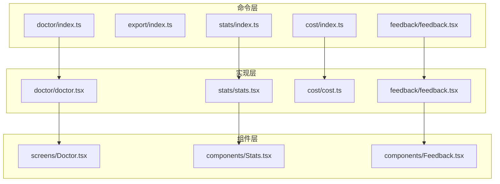
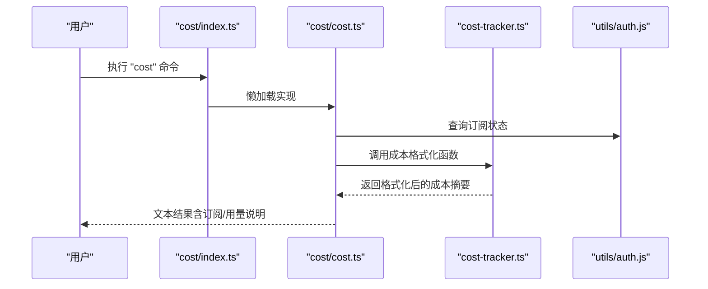
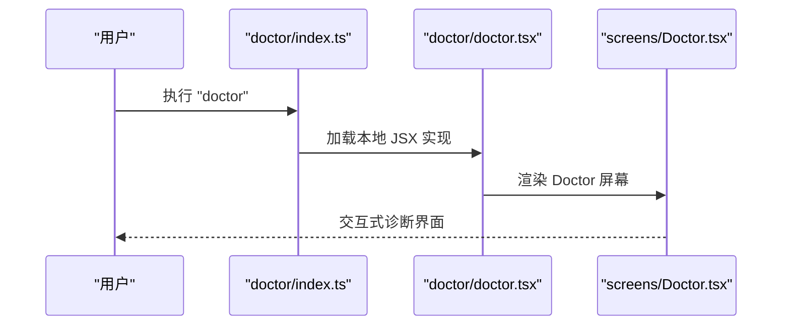
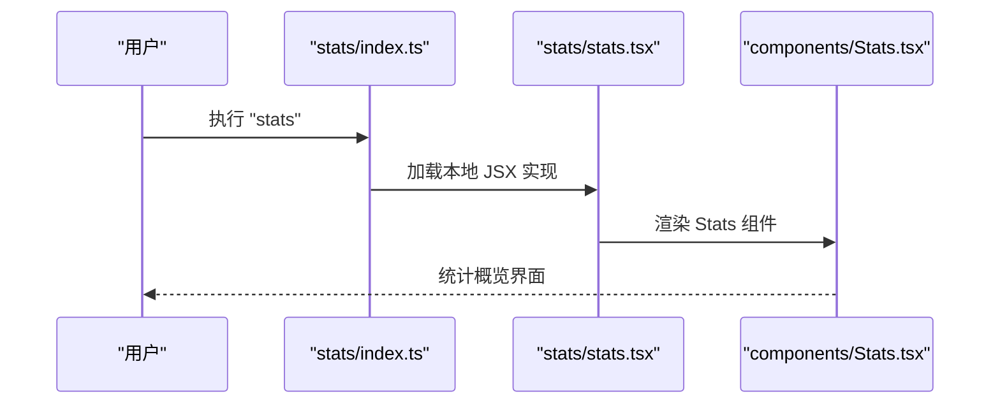
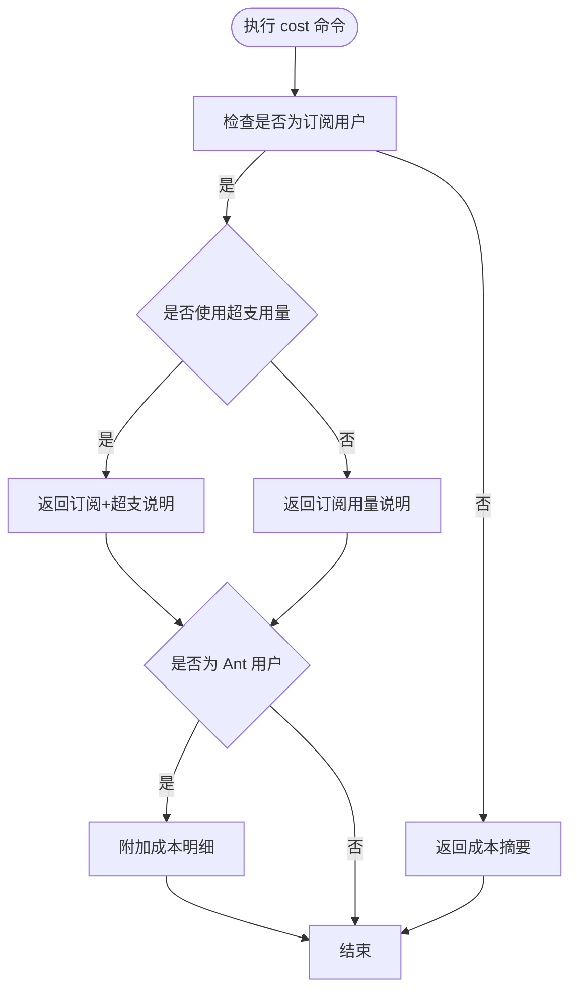
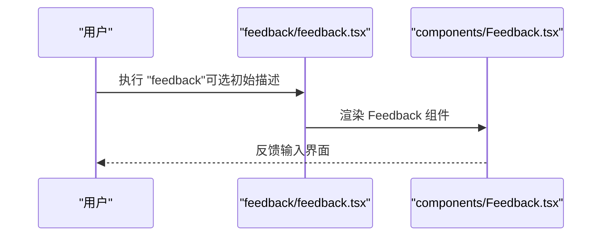
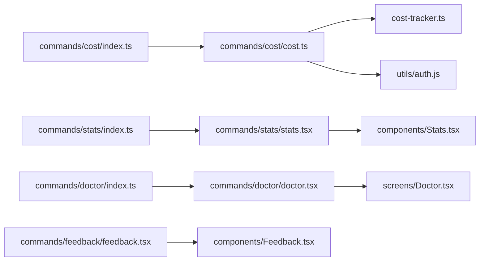

# 实用工具命令

<cite>
**本文引用的文件**
- [src/commands/doctor/index.ts](file://src/commands/doctor/index.ts)
- [src/commands/doctor/doctor.tsx](file://src/commands/doctor/doctor.tsx)
- [src/screens/Doctor.tsx](file://src/screens/Doctor.tsx)
- [src/commands/export/index.ts](file://src/commands/export/index.ts)
- [src/commands/stats/index.ts](file://src/commands/stats/index.ts)
- [src/commands/stats/stats.tsx](file://src/commands/stats/stats.tsx)
- [src/components/Stats.tsx](file://src/components/Stats.tsx)
- [src/commands/cost/index.ts](file://src/commands/cost/index.ts)
- [src/commands/cost/cost.ts](file://src/commands/cost/cost.ts)
- [src/cost-tracker.ts](file://src/cost-tracker.ts)
- [src/bootstrap/state.ts](file://src/bootstrap/state.ts)
- [src/commands/feedback/feedback.tsx](file://src/commands/feedback/feedback.tsx)
- [src/components/Feedback.tsx](file://src/components/Feedback.tsx)
- [src/commands/insights.ts](file://src/commands/insights.ts)
</cite>

## 目录
1. [简介](#简介)
2. [项目结构](#项目结构)
3. [核心组件](#核心组件)
4. [架构总览](#架构总览)
5. [详细组件分析](#详细组件分析)
6. [依赖关系分析](#依赖关系分析)
7. [性能考量](#性能考量)
8. [故障排查指南](#故障排查指南)
9. [结论](#结论)
10. [附录](#附录)

## 简介
本文件系统性梳理并解释实用工具命令：诊断工具（doctor）、导出功能（export）、统计信息（stats）、使用量统计（usage）、成本计算（cost）与反馈收集（feedback）。这些命令在系统维护、性能监控与用户体验优化中发挥关键作用，既可用于交互式界面操作，也可在非交互场景下以文本形式输出结果，便于自动化集成与日志采集。

## 项目结构
实用工具命令遵循“命令元数据 + 懒加载实现”的组织方式：
- 命令元数据文件定义命令名称、描述、类型、启用条件与懒加载入口
- 实际实现按需加载，减少启动时的资源占用
- 部分命令通过本地 JSX 渲染 UI 组件，部分通过纯本地命令返回文本结果

图表来源
- [src/commands/doctor/index.ts:1-12](file://src/commands/doctor/index.ts#L1-L12)
- [src/commands/doctor/doctor.tsx:1-7](file://src/commands/doctor/doctor.tsx#L1-L7)
- [src/screens/Doctor.tsx](file://src/screens/Doctor.tsx)
- [src/commands/export/index.ts:1-11](file://src/commands/export/index.ts#L1-L11)
- [src/commands/stats/index.ts:1-10](file://src/commands/stats/index.ts#L1-L10)
- [src/commands/stats/stats.tsx:1-7](file://src/commands/stats/stats.tsx#L1-L7)
- [src/components/Stats.tsx](file://src/components/Stats.tsx)
- [src/commands/cost/index.ts:1-23](file://src/commands/cost/index.ts#L1-L23)
- [src/commands/cost/cost.ts:1-24](file://src/commands/cost/cost.ts#L1-L24)
- [src/commands/feedback/feedback.tsx:1-24](file://src/commands/feedback/feedback.tsx#L1-L24)
- [src/components/Feedback.tsx](file://src/components/Feedback.tsx)

章节来源
- [src/commands/doctor/index.ts:1-12](file://src/commands/doctor/index.ts#L1-L12)
- [src/commands/export/index.ts:1-11](file://src/commands/export/index.ts#L1-L11)
- [src/commands/stats/index.ts:1-10](file://src/commands/stats/index.ts#L1-L10)
- [src/commands/cost/index.ts:1-23](file://src/commands/cost/index.ts#L1-L23)
- [src/commands/feedback/feedback.tsx:1-24](file://src/commands/feedback/feedback.tsx#L1-L24)

## 核心组件
- 诊断工具（doctor）
  - 类型：本地 JSX 命令
  - 启用条件：未设置禁用环境变量
  - 行为：渲染 Doctor 屏幕组件，用于安装与配置健康检查
- 导出功能（export）
  - 类型：本地 JSX 命令
  - 行为：渲染导出对话框，支持保存当前会话到文件或剪贴板
- 统计信息（stats）
  - 类型：本地 JSX 命令
  - 行为：渲染 Stats 组件，展示使用统计与活动概览
- 使用量统计（usage）
  - 仓库中存在“usage”相关命令与指标聚合逻辑，但未发现独立的“usage”命令文件；相关能力由“stats”与“insights”共同体现
- 成本计算（cost）
  - 类型：本地命令（支持非交互）
  - 行为：根据订阅状态与用量情况返回当前会话的成本摘要；Ant 用户可查看更详细的成本分解
- 反馈收集（feedback）
  - 类型：本地 JSX 命令
  - 行为：渲染 Feedback 组件，允许用户提交对会话体验的反馈

章节来源
- [src/commands/doctor/index.ts:1-12](file://src/commands/doctor/index.ts#L1-L12)
- [src/commands/export/index.ts:1-11](file://src/commands/export/index.ts#L1-L11)
- [src/commands/stats/index.ts:1-10](file://src/commands/stats/index.ts#L1-L10)
- [src/commands/cost/index.ts:1-23](file://src/commands/cost/index.ts#L1-L23)
- [src/commands/feedback/feedback.tsx:1-24](file://src/commands/feedback/feedback.tsx#L1-L24)

## 架构总览
以下序列图展示了“成本计算”命令的调用流程，体现从命令入口到成本格式化与限制状态查询的完整链路：

图表来源
- [src/commands/cost/index.ts:1-23](file://src/commands/cost/index.ts#L1-L23)
- [src/commands/cost/cost.ts:1-24](file://src/commands/cost/cost.ts#L1-L24)
- [src/cost-tracker.ts:112-137](file://src/cost-tracker.ts#L112-L137)

## 详细组件分析

### 诊断工具（doctor）
- 元数据定义
  - 名称：doctor
  - 描述：诊断并验证 Claude Code 安装与设置
  - 启用条件：未设置禁用环境变量
  - 类型：local-jsx
  - 懒加载入口：./doctor.js
- 实现要点
  - 通过本地 JSX 渲染 Doctor 屏幕组件，提供可视化诊断界面
- 使用场景
  - 安装后自检、配置异常排查、网络与权限问题定位

图表来源
- [src/commands/doctor/index.ts:1-12](file://src/commands/doctor/index.ts#L1-L12)
- [src/commands/doctor/doctor.tsx:1-7](file://src/commands/doctor/doctor.tsx#L1-L7)
- [src/screens/Doctor.tsx](file://src/screens/Doctor.tsx)

章节来源
- [src/commands/doctor/index.ts:1-12](file://src/commands/doctor/index.ts#L1-L12)
- [src/commands/doctor/doctor.tsx:1-7](file://src/commands/doctor/doctor.tsx#L1-L7)

### 导出功能（export）
- 元数据定义
  - 名称：export
  - 描述：将当前对话导出到文件或剪贴板
  - 参数提示：[filename]
  - 类型：local-jsx
  - 懒加载入口：./export.js
- 使用场景
  - 备份会话、分享对话、离线归档

章节来源
- [src/commands/export/index.ts:1-11](file://src/commands/export/index.ts#L1-L11)

### 统计信息（stats）
- 元数据定义
  - 名称：stats
  - 描述：显示 Claude Code 使用统计与活动
  - 类型：local-jsx
  - 懒加载入口：./stats.js
- 实现要点
  - 通过本地 JSX 渲染 Stats 组件，展示会话数量、消息数、Token 消耗、工具使用次数、语言分布、Git 提交/推送、项目分布、响应时间等指标
- 使用场景
  - 性能监控、效率分析、资源消耗评估

图表来源
- [src/commands/stats/index.ts:1-10](file://src/commands/stats/index.ts#L1-L10)
- [src/commands/stats/stats.tsx:1-7](file://src/commands/stats/stats.tsx#L1-L7)
- [src/components/Stats.tsx](file://src/components/Stats.tsx)

章节来源
- [src/commands/stats/index.ts:1-10](file://src/commands/stats/index.ts#L1-L10)
- [src/commands/stats/stats.tsx:1-7](file://src/commands/stats/stats.tsx#L1-L7)

### 使用量统计（usage）
- 仓库中未发现名为“usage”的独立命令文件
- “usage”能力由“stats”与“insights”共同体现：
  - stats：实时/交互式统计概览
  - insights：结构化导出与洞察生成，包含会话、消息、Token、工具、语言、Git、项目、满意度、摩擦点、成功度等多维聚合
- 使用场景
  - 数据驱动的性能与体验优化、团队级洞察与改进建议生成

章节来源
- [src/commands/insights.ts:275-326](file://src/commands/insights.ts#L275-L326)
- [src/commands/insights.ts:2652-2689](file://src/commands/insights.ts#L2652-L2689)
- [src/commands/insights.ts:2190-2650](file://src/commands/insights.ts#L2190-L2650)

### 成本计算（cost）
- 元数据定义
  - 名称：cost
  - 描述：显示当前会话的总成本与持续时间
  - 类型：local（支持非交互）
  - 启用条件：非订阅用户可见；Ant 用户始终可见（即使订阅）
  - 懒加载入口：./cost.js
- 实现要点
  - 订阅用户：区分订阅与超支用量，并给出切换说明
  - 非订阅用户：直接返回成本摘要
  - Ant 用户：附加显示成本明细
- 关联模块
  - 成本格式化与状态恢复：cost-tracker.ts
  - 启动状态管理：bootstrap/state.ts（成本状态恢复）

图表来源
- [src/commands/cost/index.ts:1-23](file://src/commands/cost/index.ts#L1-L23)
- [src/commands/cost/cost.ts:1-24](file://src/commands/cost/cost.ts#L1-L24)
- [src/cost-tracker.ts:112-137](file://src/cost-tracker.ts#L112-L137)
- [src/bootstrap/state.ts:877-916](file://src/bootstrap/state.ts#L877-L916)

章节来源
- [src/commands/cost/index.ts:1-23](file://src/commands/cost/index.ts#L1-L23)
- [src/commands/cost/cost.ts:1-24](file://src/commands/cost/cost.ts#L1-L24)
- [src/cost-tracker.ts:112-137](file://src/cost-tracker.ts#L112-L137)
- [src/bootstrap/state.ts:877-916](file://src/bootstrap/state.ts#L877-L916)

### 反馈收集（feedback）
- 元数据定义
  - 名称：feedback
  - 描述：收集用户对会话体验的反馈
  - 类型：local-jsx
  - 懒加载入口：./feedback.js
- 实现要点
  - 通过本地 JSX 渲染 Feedback 组件，支持传入初始描述与背景任务上下文
- 使用场景
  - 用户体验优化、问题定位与产品改进建议收集

图表来源
- [src/commands/feedback/feedback.tsx:1-24](file://src/commands/feedback/feedback.tsx#L1-L24)
- [src/components/Feedback.tsx](file://src/components/Feedback.tsx)

章节来源
- [src/commands/feedback/feedback.tsx:1-24](file://src/commands/feedback/feedback.tsx#L1-L24)

## 依赖关系分析
- 命令与实现的耦合
  - 命令元数据仅负责声明与懒加载，实现文件承担具体逻辑，降低启动时的耦合度
- 组件复用
  - doctor、stats、feedback 均通过本地 JSX 渲染对应屏幕/组件，提升一致性与可维护性
- 成本相关依赖
  - cost 命令依赖 cost-tracker 进行成本格式化与状态持久化，依赖订阅状态判断决定输出策略
  - bootstrap/state 提供成本状态恢复能力，确保会话恢复时成本统计连续

图表来源
- [src/commands/cost/index.ts:1-23](file://src/commands/cost/index.ts#L1-L23)
- [src/commands/cost/cost.ts:1-24](file://src/commands/cost/cost.ts#L1-L24)
- [src/cost-tracker.ts:112-137](file://src/cost-tracker.ts#L112-L137)
- [src/commands/stats/index.ts:1-10](file://src/commands/stats/index.ts#L1-L10)
- [src/commands/stats/stats.tsx:1-7](file://src/commands/stats/stats.tsx#L1-L7)
- [src/components/Stats.tsx](file://src/components/Stats.tsx)
- [src/commands/doctor/index.ts:1-12](file://src/commands/doctor/index.ts#L1-L12)
- [src/commands/doctor/doctor.tsx:1-7](file://src/commands/doctor/doctor.tsx#L1-L7)
- [src/screens/Doctor.tsx](file://src/screens/Doctor.tsx)
- [src/commands/feedback/feedback.tsx:1-24](file://src/commands/feedback/feedback.tsx#L1-L24)
- [src/components/Feedback.tsx](file://src/components/Feedback.tsx)

章节来源
- [src/commands/cost/index.ts:1-23](file://src/commands/cost/index.ts#L1-L23)
- [src/commands/cost/cost.ts:1-24](file://src/commands/cost/cost.ts#L1-L24)
- [src/cost-tracker.ts:112-137](file://src/cost-tracker.ts#L112-L137)
- [src/commands/stats/index.ts:1-10](file://src/commands/stats/index.ts#L1-L10)
- [src/commands/stats/stats.tsx:1-7](file://src/commands/stats/stats.tsx#L1-L7)
- [src/commands/doctor/index.ts:1-12](file://src/commands/doctor/index.ts#L1-L12)
- [src/commands/doctor/doctor.tsx:1-7](file://src/commands/doctor/doctor.tsx#L1-L7)
- [src/commands/feedback/feedback.tsx:1-24](file://src/commands/feedback/feedback.tsx#L1-L24)

## 性能考量
- 懒加载策略
  - doctor、export、stats、feedback 采用 local-jsx 并通过懒加载减少启动开销
  - cost 采用 local 命令，按需执行，避免不必要的 UI 渲染
- 统计与洞察
  - stats 提供交互式概览，insights 支持结构化导出，二者结合可满足不同粒度的性能分析需求
- 成本追踪
  - 成本状态在会话恢复时自动恢复，避免重复计算与统计偏差

## 故障排查指南
- 诊断工具（doctor）
  - 若无法进入诊断界面，检查命令启用条件与环境变量
  - 在 Doctor 屏幕中关注关键检查项（网络、权限、模型可用性），按提示修复后重试
- 导出功能（export）
  - 若导出失败，确认目标路径可写与权限充足；必要时尝试剪贴板导出
- 统计信息（stats）
  - 若统计数据缺失，确认会话历史与指标聚合是否正常；可在 stats 界面刷新后重试
- 成本计算（cost）
  - 订阅用户若显示超支用量，确认限额重置时间；Ant 用户可查看详细成本明细核对
  - 如成本不连续，检查会话恢复流程与成本状态恢复逻辑
- 反馈收集（feedback）
  - 若反馈未生效，确认网络连通与组件渲染是否完成；重新打开反馈界面提交

章节来源
- [src/commands/doctor/index.ts:1-12](file://src/commands/doctor/index.ts#L1-L12)
- [src/commands/export/index.ts:1-11](file://src/commands/export/index.ts#L1-L11)
- [src/commands/stats/index.ts:1-10](file://src/commands/stats/index.ts#L1-L10)
- [src/commands/cost/index.ts:1-23](file://src/commands/cost/index.ts#L1-L23)
- [src/commands/feedback/feedback.tsx:1-24](file://src/commands/feedback/feedback.tsx#L1-L24)

## 结论
实用工具命令围绕“诊断—导出—统计—成本—反馈”形成闭环，既满足日常运维与监控需求，又为产品优化提供数据支撑。通过懒加载与组件化设计，系统在保证功能完整性的同时兼顾性能与可维护性。建议在生产环境中结合 stats 与 insights 进行周期性分析，配合 cost 做好成本控制，并通过 feedback 持续收集用户意见以迭代改进。

## 附录
- 命令使用示例（说明性）
  - doctor：执行诊断命令，打开诊断界面，逐项检查安装与配置
  - export：执行导出命令，选择目标文件或复制到剪贴板
  - stats：执行统计命令，查看会话、消息、Token、工具与项目分布等
  - cost：执行成本命令，查看当前会话成本与订阅/超支状态
  - feedback：执行反馈命令，填写体验反馈并提交
- 输出解读与后续处理建议
  - doctor：根据诊断报告修复网络/权限/模型问题；完成后再次运行以确认
  - export：定期备份重要会话；必要时用于问题复现与审计
  - stats：对比历史趋势识别异常；针对高摩擦点与低满意度项制定优化计划
  - cost：关注超支用量与限额重置；结合业务峰值调整配额
  - feedback：汇总高频问题与改进建议，纳入产品路线图