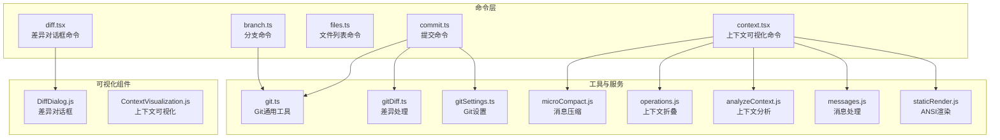
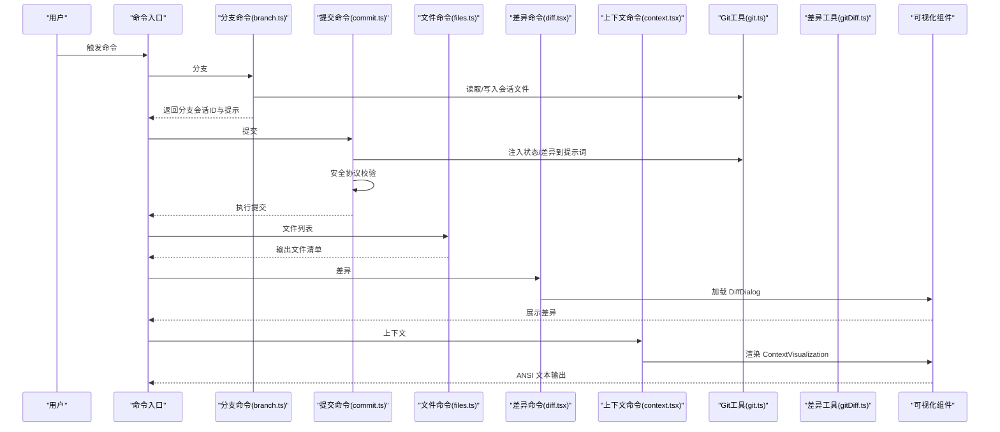
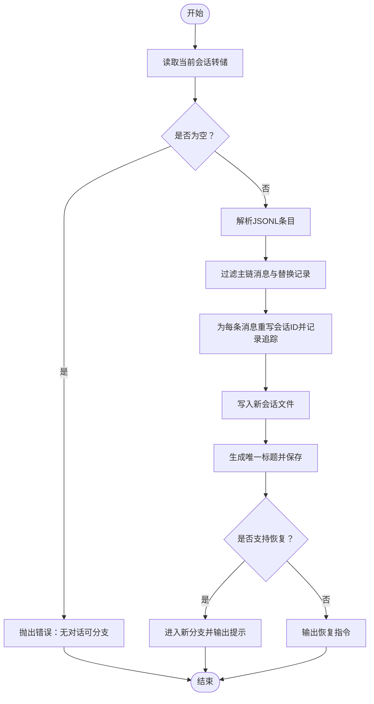
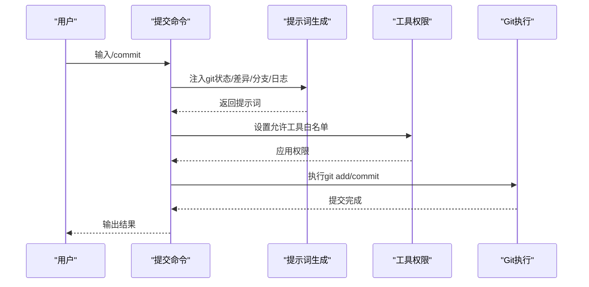
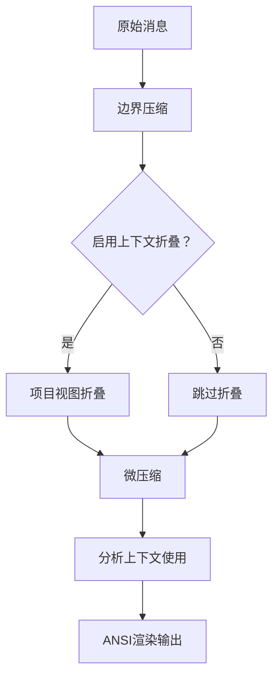
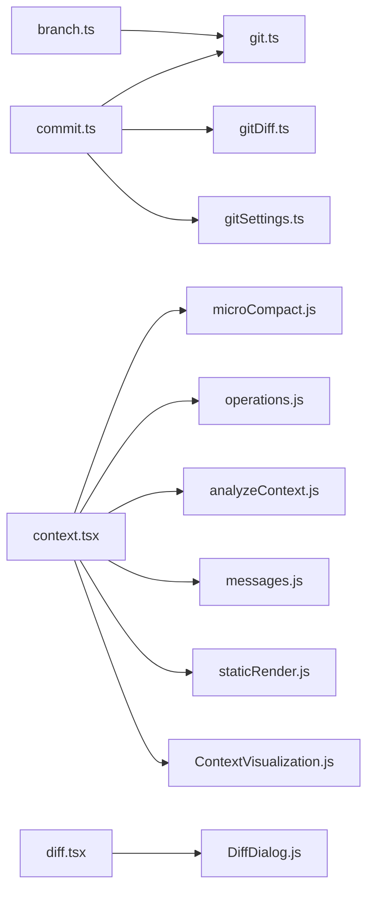

# 开发工具命令

<cite>
**本文引用的文件**
- [src/commands/branch/branch.ts](file://src/commands/branch/branch.ts)
- [src/commands/commit.ts](file://src/commands/commit.ts)
- [src/commands/files/files.ts](file://src/commands/files/files.ts)
- [src/commands/diff/diff.tsx](file://src/commands/diff/diff.tsx)
- [src/commands/context/context.tsx](file://src/commands/context/context.tsx)
- [src/utils/git.ts](file://src/utils/git.ts)
- [src/utils/gitDiff.ts](file://src/utils/gitDiff.ts)
- [src/utils/gitSettings.ts](file://src/utils/gitSettings.ts)
- [src/components/diff/DiffDialog.js](file://src/components/diff/DiffDialog.js)
- [src/components/ContextVisualization.js](file://src/components/ContextVisualization.js)
- [src/services/compact/microCompact.js](file://src/services/compact/microCompact.js)
- [src/services/contextCollapse/operations.js](file://src/services/contextCollapse/operations.js)
- [src/utils/analyzeContext.js](file://src/utils/analyzeContext.js)
- [src/utils/messages.js](file://src/utils/messages.js)
- [src/utils/staticRender.js](file://src/utils/staticRender.js)
</cite>

## 目录
1. [简介](#简介)
2. [项目结构](#项目结构)
3. [核心组件](#核心组件)
4. [架构总览](#架构总览)
5. [详细组件分析](#详细组件分析)
6. [依赖关系分析](#依赖关系分析)
7. [性能考量](#性能考量)
8. [故障排查指南](#故障排查指南)
9. [结论](#结论)
10. [附录](#附录)

## 简介
本文件系统性梳理与 Git 工作流深度集成的开发工具命令，覆盖分支管理、提交操作、文件管理、差异比较与上下文查看五大类命令。这些命令通过统一的命令框架与工具权限体系，将终端交互、可视化界面与 Git 操作无缝衔接，为代码版本控制与协作开发提供高效支持。文档不仅解释各命令的职责与实现要点，还给出典型使用场景与最佳实践，帮助开发者在日常开发中快速定位问题、规范提交、优化上下文与安全地进行分支探索。

## 项目结构
围绕“开发工具命令”的相关模块主要分布在以下路径：
- 命令实现：src/commands 下按功能划分目录，如 branch、commit、files、diff、context
- 工具与服务：src/utils 与 src/services 提供 Git 辅助、上下文压缩与可视化等能力
- 可视化组件：src/components 中的 DiffDialog 与 ContextVisualization 负责渲染差异与上下文分析结果

图表来源
- [src/commands/branch/branch.ts:1-297](file://src/commands/branch/branch.ts#L1-L297)
- [src/commands/commit.ts:1-93](file://src/commands/commit.ts#L1-L93)
- [src/commands/files/files.ts:1-20](file://src/commands/files/files.ts#L1-L20)
- [src/commands/diff/diff.tsx:1-9](file://src/commands/diff/diff.tsx#L1-L9)
- [src/commands/context/context.tsx:1-64](file://src/commands/context/context.tsx#L1-L64)
- [src/utils/git.ts](file://src/utils/git.ts)
- [src/utils/gitDiff.ts](file://src/utils/gitDiff.ts)
- [src/utils/gitSettings.ts](file://src/utils/gitSettings.ts)
- [src/services/compact/microCompact.js](file://src/services/compact/microCompact.js)
- [src/services/contextCollapse/operations.js](file://src/services/contextCollapse/operations.js)
- [src/utils/analyzeContext.js](file://src/utils/analyzeContext.js)
- [src/utils/messages.js](file://src/utils/messages.js)
- [src/utils/staticRender.js](file://src/utils/staticRender.js)
- [src/components/diff/DiffDialog.js](file://src/components/diff/DiffDialog.js)
- [src/components/ContextVisualization.js](file://src/components/ContextVisualization.js)

章节来源
- [src/commands/branch/branch.ts:1-297](file://src/commands/branch/branch.ts#L1-L297)
- [src/commands/commit.ts:1-93](file://src/commands/commit.ts#L1-L93)
- [src/commands/files/files.ts:1-20](file://src/commands/files/files.ts#L1-L20)
- [src/commands/diff/diff.tsx:1-9](file://src/commands/diff/diff.tsx#L1-L9)
- [src/commands/context/context.tsx:1-64](file://src/commands/context/context.tsx#L1-L64)

## 核心组件
- 分支命令（branch）
  - 功能：基于当前会话转储内容创建分支副本，保留元数据与替换记录，生成唯一分支标题，并可直接进入新分支继续工作
  - 关键点：解析会话日志、过滤主链消息、重写会话 ID、追加内容替换记录、持久化到独立会话文件、触发恢复流程或输出恢复指引
- 提交命令（commit）
  - 功能：根据当前 Git 状态与变更，生成一次安全的提交；内置安全协议与工具白名单，避免危险操作
  - 关键点：动态注入 git 状态与差异到提示词、限制允许工具、严格禁止 amend/跳过钩子等高风险行为
- 文件命令（files）
  - 功能：列出当前上下文中已加载的文件路径
  - 关键点：从缓存键集合提取文件列表，相对路径展示，空上下文时返回提示
- 差异命令（diff）
  - 功能：打开差异对话框，展示消息驱动的差异可视化
  - 关键点：异步加载 DiffDialog 组件并传入消息上下文
- 上下文命令（context）
  - 功能：对消息进行压缩与折叠，计算模型实际看到的上下文，渲染为 ANSI 文本用于终端显示
  - 关键点：先按边界压缩，再按配置执行项目视图折叠，最后渲染为 ANSI 字符串

章节来源
- [src/commands/branch/branch.ts:56-173](file://src/commands/branch/branch.ts#L56-L173)
- [src/commands/commit.ts:57-93](file://src/commands/commit.ts#L57-L93)
- [src/commands/files/files.ts:7-19](file://src/commands/files/files.ts#L7-L19)
- [src/commands/diff/diff.tsx:3-8](file://src/commands/diff/diff.tsx#L3-L8)
- [src/commands/context/context.tsx:18-63](file://src/commands/context/context.tsx#L18-L63)

## 架构总览
下图展示了“开发工具命令”与 Git 工作流及内部服务的交互关系。命令通过工具权限与提示词注入获取 Git 状态，结合上下文压缩与可视化组件完成最终呈现或执行。

图表来源
- [src/commands/branch/branch.ts:222-296](file://src/commands/branch/branch.ts#L222-L296)
- [src/commands/commit.ts:65-89](file://src/commands/commit.ts#L65-L89)
- [src/commands/files/files.ts:7-19](file://src/commands/files/files.ts#L7-L19)
- [src/commands/diff/diff.tsx:3-8](file://src/commands/diff/diff.tsx#L3-L8)
- [src/commands/context/context.tsx:30-63](file://src/commands/context/context.tsx#L30-L63)
- [src/utils/git.ts](file://src/utils/git.ts)
- [src/utils/gitDiff.ts](file://src/utils/gitDiff.ts)
- [src/components/diff/DiffDialog.js](file://src/components/diff/DiffDialog.js)
- [src/components/ContextVisualization.js](file://src/components/ContextVisualization.js)

## 详细组件分析

### 分支命令（branch）
- 设计目标
  - 在不中断当前会话的前提下，复制当前对话历史到新的会话文件，保留时间戳、分支追踪等元数据，确保后续恢复与审计一致
- 处理逻辑
  - 读取当前会话转储，解析 JSONL 条目，过滤主链消息与内容替换记录
  - 为每个条目重写会话 ID 并记录父消息 UUID，附加 forkedFrom 追踪
  - 将替换记录以单条记录形式写回，保证恢复时预算替换状态正确
  - 生成唯一标题，保存自定义标题并持久化到新会话文件
  - 触发恢复流程进入新分支，或输出恢复指令
- 错误处理
  - 当不存在可分支的会话或消息为空时抛出明确错误
- 性能与复杂度
  - 时间复杂度 O(n)，n 为消息条目数；空间复杂度 O(n) 用于序列化与写盘
- 最佳实践
  - 使用简洁的自定义标题，便于在 /status 与 /resume 中识别
  - 避免在分支中混入敏感文件，必要时在分支内清理

图表来源
- [src/commands/branch/branch.ts:67-173](file://src/commands/branch/branch.ts#L67-L173)
- [src/commands/branch/branch.ts:222-296](file://src/commands/branch/branch.ts#L222-L296)

章节来源
- [src/commands/branch/branch.ts:33-54](file://src/commands/branch/branch.ts#L33-L54)
- [src/commands/branch/branch.ts:56-173](file://src/commands/branch/branch.ts#L56-L173)
- [src/commands/branch/branch.ts:222-296](file://src/commands/branch/branch.ts#L222-L296)

### 提交命令（commit）
- 设计目标
  - 在安全协议约束下，自动分析当前 Git 状态与变更，生成一次合规的提交
- 处理逻辑
  - 构造提示词，注入 git status、diff、当前分支与最近提交等上下文
  - 仅允许特定工具（git add/status/commit），严格禁止 amend、跳过钩子等高风险操作
  - 通过一次性工具调用完成阶段化与提交，避免交互式命令
- 安全策略
  - 明确禁止更新 git config、禁止空提交、禁止提交可能泄露密钥的文件
  - 若用户强制要求危险操作，需显式声明
- 最佳实践
  - 先用 /diff 与 /context 检查变更与上下文，再执行 /commit
  - 遵循仓库既有提交风格，聚焦“为什么”而非“做了什么”

图表来源
- [src/commands/commit.ts:12-55](file://src/commands/commit.ts#L12-L55)
- [src/commands/commit.ts:65-89](file://src/commands/commit.ts#L65-L89)

章节来源
- [src/commands/commit.ts:6-10](file://src/commands/commit.ts#L6-L10)
- [src/commands/commit.ts:12-55](file://src/commands/commit.ts#L12-L55)
- [src/commands/commit.ts:57-93](file://src/commands/commit.ts#L57-L93)

### 文件命令（files）
- 设计目标
  - 快速列出当前上下文中已加载的文件，辅助审阅与定位
- 处理逻辑
  - 从缓存键集合提取文件路径，计算相对路径后逐行输出
  - 若无文件则提示“上下文为空”
- 最佳实践
  - 在执行任何编辑前，先用 /files 确认上下文范围
  - 对大工程建议配合筛选工具或 IDE 集成使用

章节来源
- [src/commands/files/files.ts:7-19](file://src/commands/files/files.ts#L7-L19)

### 差异命令（diff）
- 设计目标
  - 基于消息上下文打开差异对话框，直观展示变更
- 处理逻辑
  - 异步加载 DiffDialog 组件并将消息传递给其 props
- 最佳实践
  - 在提交前用 /diff 校验变更范围，避免误提交

章节来源
- [src/commands/diff/diff.tsx:3-8](file://src/commands/diff/diff.tsx#L3-L8)

### 上下文命令（context）
- 设计目标
  - 展示模型实际看到的上下文，包括折叠后的消息与令牌统计，帮助优化提示词与减少开销
- 处理逻辑
  - 先按边界压缩消息，再按特性开关应用项目视图折叠
  - 使用微压缩算法得到发送给 API 的消息集
  - 分析上下文使用情况，渲染为 ANSI 文本输出
- 最佳实践
  - 在长对话或多文件场景下，优先使用 /context 评估上下文大小
  - 结合 /diff 与 /files 判断是否需要裁剪或补充上下文

图表来源
- [src/commands/context/context.tsx:18-29](file://src/commands/context/context.tsx#L18-L29)
- [src/commands/context/context.tsx:42-57](file://src/commands/context/context.tsx#L42-L57)
- [src/commands/context/context.tsx:60-61](file://src/commands/context/context.tsx#L60-L61)

章节来源
- [src/commands/context/context.tsx:18-29](file://src/commands/context/context.tsx#L18-L29)
- [src/commands/context/context.tsx:30-63](file://src/commands/context/context.tsx#L30-L63)

## 依赖关系分析
- 命令到工具与服务
  - 分支命令依赖 Git 工具与会话存储能力
  - 提交命令依赖 Git 工具、差异工具与设置模块
  - 上下文命令依赖消息压缩、上下文折叠、分析与渲染工具
- 可视化组件
  - 差异命令依赖 DiffDialog
  - 上下文命令依赖 ContextVisualization
- 内聚与耦合
  - 各命令保持单一职责，与工具/服务通过清晰接口交互，降低耦合
  - 可视化组件通过异步加载解耦，提升启动性能

图表来源
- [src/commands/branch/branch.ts:1-25](file://src/commands/branch/branch.ts#L1-L25)
- [src/commands/commit.ts:1-10](file://src/commands/commit.ts#L1-L10)
- [src/commands/context/context.tsx:1-10](file://src/commands/context/context.tsx#L1-L10)
- [src/commands/diff/diff.tsx:1-8](file://src/commands/diff/diff.tsx#L1-L8)
- [src/utils/git.ts](file://src/utils/git.ts)
- [src/utils/gitDiff.ts](file://src/utils/gitDiff.ts)
- [src/utils/gitSettings.ts](file://src/utils/gitSettings.ts)
- [src/services/compact/microCompact.js](file://src/services/compact/microCompact.js)
- [src/services/contextCollapse/operations.js](file://src/services/contextCollapse/operations.js)
- [src/utils/analyzeContext.js](file://src/utils/analyzeContext.js)
- [src/utils/messages.js](file://src/utils/messages.js)
- [src/utils/staticRender.js](file://src/utils/staticRender.js)
- [src/components/diff/DiffDialog.js](file://src/components/diff/DiffDialog.js)
- [src/components/ContextVisualization.js](file://src/components/ContextVisualization.js)

章节来源
- [src/commands/branch/branch.ts:1-25](file://src/commands/branch/branch.ts#L1-L25)
- [src/commands/commit.ts:1-10](file://src/commands/commit.ts#L1-L10)
- [src/commands/context/context.tsx:1-10](file://src/commands/context/context.tsx#L1-L10)

## 性能考量
- 分支命令
  - 读取与写入为 O(n)；建议在大体量会话时谨慎使用，必要时先裁剪上下文
- 提交命令
  - 通过一次性工具调用减少往返；注意提示词长度与工具权限初始化成本
- 上下文命令
  - 微压缩与折叠可能带来额外计算；建议在终端宽度不足时适当减少折叠层级
- 文件命令
  - 仅遍历缓存键集合，开销极低

## 故障排查指南
- 分支失败
  - 症状：提示“无对话可分支”或“无消息可分支”
  - 排查：确认当前会话是否存在有效消息；检查会话文件是否被删除或损坏
- 提交失败
  - 症状：被安全协议拦截或提示高风险操作
  - 排查：检查是否尝试 amend 或跳过钩子；确认未提交敏感文件；必要时在提示词中明确用户意图
- 差异空白
  - 症状：打开差异对话框但无内容
  - 排查：确认消息上下文是否包含变更；检查可视化组件加载是否成功
- 上下文过大
  - 症状：模型响应受限或超时
  - 排查：使用 /context 查看折叠前后对比，裁剪无关消息或文件

章节来源
- [src/commands/branch/branch.ts:82-87](file://src/commands/branch/branch.ts#L82-L87)
- [src/commands/commit.ts:27-35](file://src/commands/commit.ts#L27-L35)
- [src/commands/diff/diff.tsx:3-8](file://src/commands/diff/diff.tsx#L3-L8)
- [src/commands/context/context.tsx:42-57](file://src/commands/context/context.tsx#L42-L57)

## 结论
上述五类命令构成了与 Git 工作流紧密耦合的开发工具链：以分支命令保障实验与回归的安全隔离，以提交命令确保变更的合规与可追溯，以文件与差异命令提升变更可见性，以上下文命令优化模型输入质量。通过统一的权限控制与可视化输出，这些命令在保障安全性的同时显著提升了协作效率与开发体验。

## 附录
- 使用示例（场景化）
  - 新增功能分支
    - 步骤：/branch “新增登录页” -> /resume <新会话ID>
    - 说明：在新分支中进行开发，完成后用 /diff 与 /context 校验变更与上下文
  - 安全提交
    - 步骤：/diff -> /context -> /commit
    - 说明：先审阅差异与上下文，再执行提交；遵循安全协议，避免 amend 与跳过钩子
  - 定位上下文问题
    - 步骤：/context -> 调整消息/文件 -> /context
    - 说明：观察折叠与令牌统计变化，逐步优化上下文
  - 快速查看当前文件
    - 步骤：/files
    - 说明：在执行编辑前确认上下文范围，避免遗漏关键文件