# 插件与市场命令

<cite>
**本文引用的文件**
- [src/commands/plugin/index.tsx](file://src/commands/plugin/index.tsx)
- [src/commands/plugin/plugin.tsx](file://src/commands/plugin/plugin.tsx)
- [src/commands/plugin/BrowseMarketplace.tsx](file://src/commands/plugin/BrowseMarketplace.tsx)
- [src/commands/plugin/ManagePlugins.tsx](file://src/commands/plugin/ManagePlugins.tsx)
- [src/commands/plugin/ManageMarketplaces.tsx](file://src/commands/plugin/ManageMarketplaces.tsx)
- [src/commands/plugin/UnifiedInstalledCell.tsx](file://src/commands/plugin/UnifiedInstalledCell.tsx)
- [src/commands/plugin/DiscoverPlugins.tsx](file://src/commands/plugin/DiscoverPlugins.tsx)
- [src/commands/plugin/AddMarketplace.tsx](file://src/commands/plugin/AddMarketplace.tsx)
- [src/commands/plugin/PluginOptionsFlow.tsx](file://src/commands/plugin/PluginOptionsFlow.tsx)
- [src/commands/plugin/PluginSettings.tsx](file://src/commands/plugin/PluginSettings.tsx)
- [src/commands/plugin/ValidatePlugin.tsx](file://src/commands/plugin/ValidatePlugin.tsx)
- [src/commands/plugin/pluginDetailsHelpers.tsx](file://src/commands/plugin/pluginDetailsHelpers.tsx)
- [src/commands/plugin/types.ts](file://src/commands/plugin/types.ts)
- [src/commands/plugin/unifiedTypes.ts](file://src/commands/plugin/unifiedTypes.ts)
- [src/commands/plugin/usePagination.ts](file://src/commands/plugin/usePagination.ts)
- [src/commands/reload-plugins/index.ts](file://src/commands/reload-plugins/index.ts)
- [src/commands/install-github-app/index.ts](file://src/commands/install-github-app/index.ts)
- [src/commands/install-slack-app/index.ts](file://src/commands/install-slack-app/index.ts)
- [src/types/plugin.ts](file://src/types/plugin.ts)
- [src/utils/plugins/pluginLoader.ts](file://src/utils/plugins/pluginLoader.ts)
- [src/utils/plugins/marketplaceManager.ts](file://src/utils/plugins/marketplaceManager.ts)
- [src/utils/plugins/marketplaceHelpers.ts](file://src/utils/plugins/marketplaceHelpers.ts)
- [src/utils/plugins/installedPluginsManager.ts](file://src/utils/plugins/installedPluginsManager.ts)
- [src/utils/plugins/loadPluginCommands.ts](file://src/utils/plugins/loadPluginCommands.ts)
- [src/utils/plugins/loadPluginAgents.ts](file://src/utils/plugins/loadPluginAgents.ts)
- [src/utils/plugins/loadPluginHooks.ts](file://src/utils/plugins/loadPluginHooks.ts)
- [src/utils/plugins/mcpPluginIntegration.ts](file://src/utils/plugins/mcpPluginIntegration.ts)
- [src/utils/plugins/officialMarketplace.ts](file://src/utils/plugins/officialMarketplace.ts)
- [src/utils/plugins/pluginAutoupdate.ts](file://src/utils/plugins/pluginAutoupdate.ts)
- [src/utils/plugins/pluginVersioning.ts](file://src/utils/plugins/pluginVersioning.ts)
- [src/utils/plugins/pluginInstallationHelpers.ts](file://src/utils/plugins/pluginInstallationHelpers.ts)
- [src/utils/plugins/headlessPluginInstall.ts](file://src/utils/plugins/headlessPluginInstall.ts)
- [src/utils/plugins/orphanedPluginFilter.ts](file://src/utils/plugins/orphanedPluginFilter.ts)
- [src/utils/plugins/dependencyResolver.ts](file://src/utils/plugins/dependencyResolver.ts)
- [src/utils/plugins/pluginDirectories.ts](file://src/utils/plugins/pluginDirectories.ts)
- [src/utils/plugins/pluginStartupCheck.ts](file://src/utils/plugins/pluginStartupCheck.ts)
- [src/utils/plugins/performStartupChecks.tsx](file://src/utils/plugins/performStartupChecks.tsx)
- [src/utils/plugins/refresh.ts](file://src/utils/plugins/refresh.ts)
- [src/utils/plugins/schemas.ts](file://src/utils/plugins/schemas.ts)
- [src/utils/plugins/validatePlugin.ts](file://src/utils/plugins/validatePlugin.ts)
- [src/utils/plugins/pluginBlocklist.ts](file://src/utils/plugins/pluginBlocklist.ts)
- [src/utils/plugins/pluginFlagging.ts](file://src/utils/plugins/pluginFlagging.ts)
- [src/utils/plugins/fetchTelemetry.ts](file://src/utils/plugins/fetchTelemetry.ts)
- [src/utils/plugins/installCounts.ts](file://src/utils/plugins/installCounts.ts)
- [src/utils/plugins/cacheUtils.ts](file://src/utils/plugins/cacheUtils.ts)
- [src/utils/plugins/zipCache.ts](file://src/utils/plugins/zipCache.ts)
- [src/utils/plugins/zipCacheAdapters.ts](file://src/utils/plugins/zipCacheAdapters.ts)
- [src/utils/plugins/gitAvailability.ts](file://src/utils/plugins/gitAvailability.ts)
- [src/utils/plugins/lspPluginIntegration.ts](file://src/utils/plugins/lspPluginIntegration.ts)
- [src/utils/plugins/mcpbHandler.ts](file://src/utils/plugins/mcpbHandler.ts)
- [src/utils/plugins/parseMarketplaceInput.ts](file://src/utils/plugins/parseMarketplaceInput.ts)
- [src/utils/plugins/officialMarketplaceGcs.ts](file://src/utils/plugins/officialMarketplaceGcs.ts)
- [src/utils/plugins/officialMarketplaceStartupCheck.ts](file://src/utils/plugins/officialMarketplaceStartupCheck.ts)
- [src/utils/plugins/walkPluginMarkdown.ts](file://src/utils/plugins/walkPluginMarkdown.ts)
- [src/utils/plugins/pluginIdentifier.ts](file://src/utils/plugins/pluginIdentifier.ts)
- [src/utils/plugins/pluginOptionsStorage.ts](file://src/utils/plugins/pluginOptionsStorage.ts)
- [src/utils/plugins/reconciler.ts](file://src/utils/plugins/reconciler.ts)
- [src/utils/plugins/hintRecommendation.ts](file://src/utils/plugins/hintRecommendation.ts)
- [src/utils/plugins/lspRecommendation.ts](file://src/utils/plugins/lspRecommendation.ts)
- [src/utils/plugins/managedPlugins.ts](file://src/utils/plugins/managedPlugins.ts)
- [src/utils/plugins/pluginPolicy.ts](file://src/utils/plugins/pluginPolicy.ts)
- [src/utils/plugins/outputStyles/loadOutputStylesDir.ts](file://src/utils/plugins/outputStyles/loadOutputStylesDir.ts)
- [src/services/plugins/index.ts](file://src/services/plugins/index.ts)
- [src/services/api/plugins/index.ts](file://src/services/api/plugins/index.ts)
- [src/constants/github-app.ts](file://src/constants/github-app.ts)
- [src/constants/oauth.ts](file://src/constants/oauth.ts)
- [src/utils/github/index.ts](file://src/utils/github/index.ts)
- [src/utils/oauth/index.ts](file://src/utils/oauth/index.ts)
- [src/hooks/useManagePlugins.ts](file://src/hooks/useManagePlugins.ts)
- [src/hooks/useMergedCommands.ts](file://src/hooks/useMergedCommands.ts)
- [src/hooks/useMergedTools.ts](file://src/hooks/useMergedTools.ts)
- [src/hooks/useMergedSkills.ts](file://src/hooks/useMergedSkills.ts)
- [src/hooks/usePluginRecommendationBase.tsx](file://src/hooks/usePluginRecommendationBase.tsx)
- [src/components/permissions/ConsoleOAuthFlow.tsx](file://src/components/permissions/ConsoleOAuthFlow.tsx)
</cite>

## 目录
1. [简介](#简介)
2. [项目结构](#项目结构)
3. [核心组件](#核心组件)
4. [架构总览](#架构总览)
5. [详细组件分析](#详细组件分析)
6. [依赖关系分析](#依赖关系分析)
7. [性能考虑](#性能考虑)
8. [故障排除指南](#故障排除指南)
9. [结论](#结论)
10. [附录](#附录)

## 简介
本文件面向插件与市场命令的使用者与开发者，系统性阐述以下能力与流程：
- 插件管理命令：安装、卸载、更新、启用/禁用、查看已安装插件、配置与选项管理、验证与诊断。
- 市场浏览与发现：多市场聚合浏览、分页与搜索、安装计数统计、依赖解析与冲突提示。
- 插件重载命令：在不重启应用的情况下重新加载插件，以应用最新变更。
- 第三方应用集成：GitHub 应用安装与 Slack 应用安装的交互式引导与 OAuth 流程。

同时，文档从架构、数据流、处理逻辑、错误处理与性能优化等维度进行深入剖析，并提供插件开发与发布的最佳实践建议。

## 项目结构
围绕“插件与市场命令”，核心目录与职责如下：
- 命令入口与 UI 组件：位于 src/commands/plugin 下，包含插件管理、市场浏览、发现、设置、选项流程等 UI 组件与类型定义。
- 工具与服务层：位于 src/utils/plugins 与 src/services/plugins，负责插件加载、市场管理、安装、版本与依赖、缓存、LSP/MCP 集成、启动检查等。
- 命令实现：位于 src/commands 下的 reload-plugins、install-github-app、install-slack-app 等子目录，提供 CLI 命令入口与交互逻辑。
- 类型与钩子：src/types/plugin.ts 定义插件核心类型；hooks 提供与插件生态的合并与推荐能力。

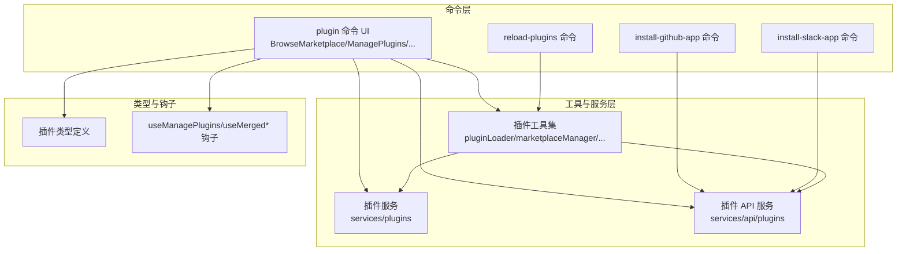

图表来源
- [src/commands/plugin/index.tsx](file://src/commands/plugin/index.tsx)
- [src/commands/plugin/BrowseMarketplace.tsx](file://src/commands/plugin/BrowseMarketplace.tsx)
- [src/commands/plugin/ManagePlugins.tsx](file://src/commands/plugin/ManagePlugins.tsx)
- [src/commands/reload-plugins/index.ts](file://src/commands/reload-plugins/index.ts)
- [src/commands/install-github-app/index.ts](file://src/commands/install-github-app/index.ts)
- [src/commands/install-slack-app/index.ts](file://src/commands/install-slack-app/index.ts)
- [src/utils/plugins/pluginLoader.ts](file://src/utils/plugins/pluginLoader.ts)
- [src/utils/plugins/marketplaceManager.ts](file://src/utils/plugins/marketplaceManager.ts)
- [src/services/plugins/index.ts](file://src/services/plugins/index.ts)
- [src/services/api/plugins/index.ts](file://src/services/api/plugins/index.ts)
- [src/types/plugin.ts](file://src/types/plugin.ts)
- [src/hooks/useManagePlugins.ts](file://src/hooks/useManagePlugins.ts)

章节来源
- [src/commands/plugin/index.tsx](file://src/commands/plugin/index.tsx)
- [src/commands/plugin/BrowseMarketplace.tsx](file://src/commands/plugin/BrowseMarketplace.tsx)
- [src/commands/plugin/ManagePlugins.tsx](file://src/commands/plugin/ManagePlugins.tsx)
- [src/commands/reload-plugins/index.ts](file://src/commands/reload-plugins/index.ts)
- [src/commands/install-github-app/index.ts](file://src/commands/install-github-app/index.ts)
- [src/commands/install-slack-app/index.ts](file://src/commands/install-slack-app/index.ts)
- [src/utils/plugins/pluginLoader.ts](file://src/utils/plugins/pluginLoader.ts)
- [src/utils/plugins/marketplaceManager.ts](file://src/utils/plugins/marketplaceManager.ts)
- [src/services/plugins/index.ts](file://src/services/plugins/index.ts)
- [src/services/api/plugins/index.ts](file://src/services/api/plugins/index.ts)
- [src/types/plugin.ts](file://src/types/plugin.ts)
- [src/hooks/useManagePlugins.ts](file://src/hooks/useManagePlugins.ts)

## 核心组件
- 插件命令入口与菜单：提供插件管理、市场浏览、发现、设置、选项流程等入口与导航。
- 市场浏览与详情：支持多市场聚合、分页滚动、插件详情展示、安装预览与依赖信息。
- 已安装插件管理：显示已安装插件列表、状态、组件清单、更新与卸载操作。
- 市场管理：添加/移除市场源、自动更新策略、最后更新时间与插件数量统计。
- 插件重载：触发插件重新加载，无需重启应用。
- GitHub/Slack 应用安装：通过 OAuth 引导完成应用安装与授权。

章节来源
- [src/commands/plugin/plugin.tsx](file://src/commands/plugin/plugin.tsx)
- [src/commands/plugin/BrowseMarketplace.tsx](file://src/commands/plugin/BrowseMarketplace.tsx)
- [src/commands/plugin/ManagePlugins.tsx](file://src/commands/plugin/ManagePlugins.tsx)
- [src/commands/plugin/ManageMarketplaces.tsx](file://src/commands/plugin/ManageMarketplaces.tsx)
- [src/commands/reload-plugins/index.ts](file://src/commands/reload-plugins/index.ts)
- [src/commands/install-github-app/index.ts](file://src/commands/install-github-app/index.ts)
- [src/commands/install-slack-app/index.ts](file://src/commands/install-slack-app/index.ts)

## 架构总览
下图展示了插件与市场命令的高层架构：命令层负责用户交互与视图渲染；工具层负责插件生命周期、市场聚合、安装与版本管理；服务层提供 API 调用与插件生态对接；类型与钩子为系统提供强类型约束与生态合并能力。

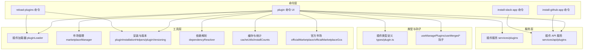

图表来源
- [src/commands/plugin/index.tsx](file://src/commands/plugin/index.tsx)
- [src/utils/plugins/pluginLoader.ts](file://src/utils/plugins/pluginLoader.ts)
- [src/utils/plugins/marketplaceManager.ts](file://src/utils/plugins/marketplaceManager.ts)
- [src/utils/plugins/pluginInstallationHelpers.ts](file://src/utils/plugins/pluginInstallationHelpers.ts)
- [src/utils/plugins/pluginVersioning.ts](file://src/utils/plugins/pluginVersioning.ts)
- [src/utils/plugins/dependencyResolver.ts](file://src/utils/plugins/dependencyResolver.ts)
- [src/utils/plugins/cacheUtils.ts](file://src/utils/plugins/cacheUtils.ts)
- [src/utils/plugins/installCounts.ts](file://src/utils/plugins/installCounts.ts)
- [src/utils/plugins/officialMarketplace.ts](file://src/utils/plugins/officialMarketplace.ts)
- [src/utils/plugins/officialMarketplaceGcs.ts](file://src/utils/plugins/officialMarketplaceGcs.ts)
- [src/services/plugins/index.ts](file://src/services/plugins/index.ts)
- [src/services/api/plugins/index.ts](file://src/services/api/plugins/index.ts)
- [src/types/plugin.ts](file://src/types/plugin.ts)
- [src/hooks/useManagePlugins.ts](file://src/hooks/useManagePlugins.ts)

## 详细组件分析

### 插件命令（plugin）
- 功能概述：提供插件管理主菜单，支持浏览市场、管理已安装插件、配置与选项、发现推荐、设置与验证等。
- 关键流程：
  - 启动时加载市场与已安装插件，构建视图状态。
  - 支持多市场聚合浏览与分页滚动，展示插件名称、描述、评分、安装计数等。
  - 进入详情后可查看命令、代理、技能、钩子、MCP 服务器等组件清单。
  - 支持批量选择与安装、更新、卸载、启用/禁用等操作。
- 数据模型：InstallablePlugin、LoadedPlugin、MarketplaceInfo 等类型贯穿 UI 与工具层。

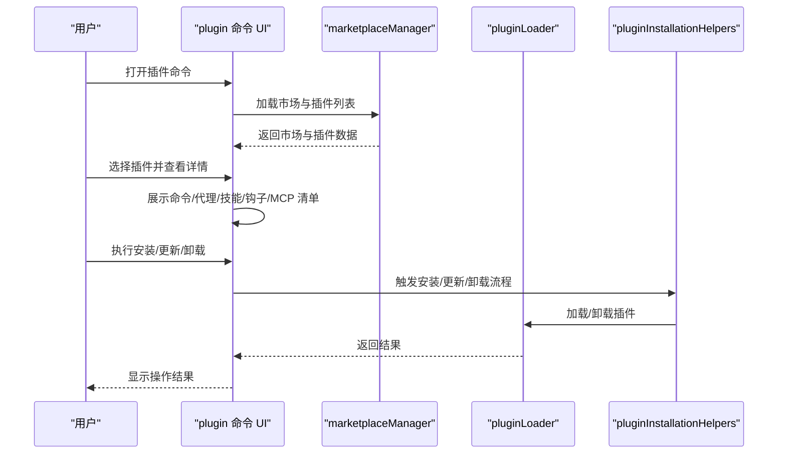

图表来源
- [src/commands/plugin/index.tsx](file://src/commands/plugin/index.tsx)
- [src/commands/plugin/BrowseMarketplace.tsx](file://src/commands/plugin/BrowseMarketplace.tsx)
- [src/commands/plugin/ManagePlugins.tsx](file://src/commands/plugin/ManagePlugins.tsx)
- [src/utils/plugins/marketplaceManager.ts](file://src/utils/plugins/marketplaceManager.ts)
- [src/utils/plugins/pluginLoader.ts](file://src/utils/plugins/pluginLoader.ts)
- [src/utils/plugins/pluginInstallationHelpers.ts](file://src/utils/plugins/pluginInstallationHelpers.ts)

章节来源
- [src/commands/plugin/index.tsx](file://src/commands/plugin/index.tsx)
- [src/commands/plugin/BrowseMarketplace.tsx](file://src/commands/plugin/BrowseMarketplace.tsx)
- [src/commands/plugin/ManagePlugins.tsx](file://src/commands/plugin/ManagePlugins.tsx)
- [src/commands/plugin/types.ts](file://src/commands/plugin/types.ts)
- [src/commands/plugin/unifiedTypes.ts](file://src/commands/plugin/unifiedTypes.ts)
- [src/commands/plugin/usePagination.ts](file://src/commands/plugin/usePagination.ts)

### 市场浏览与详情（BrowseMarketplace）
- 多市场聚合：支持多个市场源，逐个加载并在失败时优雅降级，保留可用数据。
- 分页与搜索：基于 usePagination 实现连续滚动分页，提升大列表体验。
- 详情展示：展示命令、代理、技能、钩子、MCP 服务器等组件清单，支持安装预览。
- 安装计数：展示每个插件的安装次数，辅助决策。

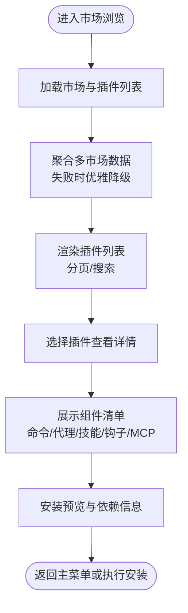

图表来源
- [src/commands/plugin/BrowseMarketplace.tsx](file://src/commands/plugin/BrowseMarketplace.tsx)
- [src/commands/plugin/usePagination.ts](file://src/commands/plugin/usePagination.ts)
- [src/utils/plugins/marketplaceManager.ts](file://src/utils/plugins/marketplaceManager.ts)
- [src/utils/plugins/installCounts.ts](file://src/utils/plugins/installCounts.ts)

章节来源
- [src/commands/plugin/BrowseMarketplace.tsx](file://src/commands/plugin/BrowseMarketplace.tsx)
- [src/commands/plugin/usePagination.ts](file://src/commands/plugin/usePagination.ts)
- [src/utils/plugins/marketplaceManager.ts](file://src/utils/plugins/marketplaceManager.ts)
- [src/utils/plugins/installCounts.ts](file://src/utils/plugins/installCounts.ts)

### 已安装插件管理（ManagePlugins）
- 组件展示：根据插件来源（内置/外部）分别读取注册定义或市场条目，合并命令、代理、技能、钩子、MCP 服务器等清单。
- 操作支持：更新、卸载、启用/禁用、查看依赖反向关系、版本比较与就地升级。
- 错误处理：对加载失败、未找到插件等情况给出明确提示。

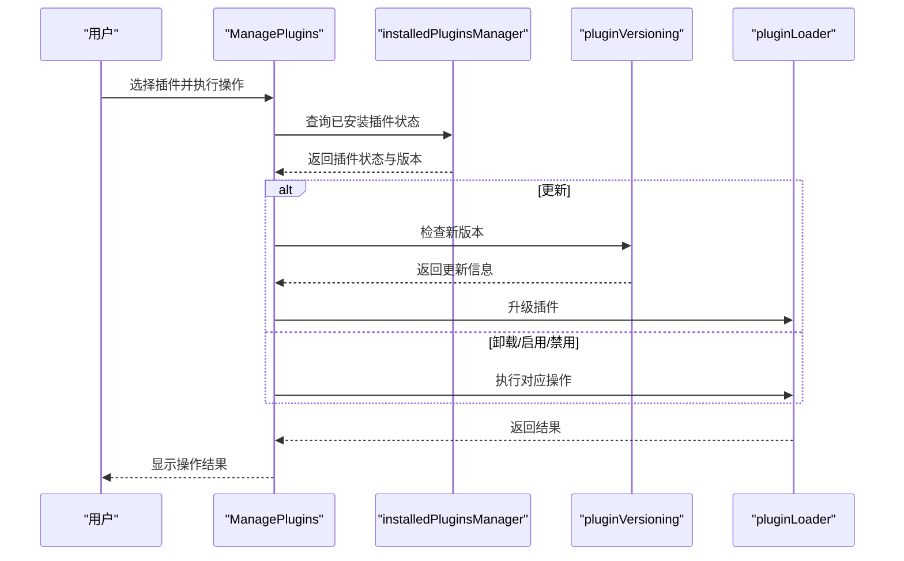

图表来源
- [src/commands/plugin/ManagePlugins.tsx](file://src/commands/plugin/ManagePlugins.tsx)
- [src/utils/plugins/installedPluginsManager.ts](file://src/utils/plugins/installedPluginsManager.ts)
- [src/utils/plugins/pluginVersioning.ts](file://src/utils/plugins/pluginVersioning.ts)
- [src/utils/plugins/pluginLoader.ts](file://src/utils/plugins/pluginLoader.ts)

章节来源
- [src/commands/plugin/ManagePlugins.tsx](file://src/commands/plugin/ManagePlugins.tsx)
- [src/utils/plugins/installedPluginsManager.ts](file://src/utils/plugins/installedPluginsManager.ts)
- [src/utils/plugins/pluginVersioning.ts](file://src/utils/plugins/pluginVersioning.ts)
- [src/utils/plugins/pluginLoader.ts](file://src/utils/plugins/pluginLoader.ts)

### 市场管理（ManageMarketplaces）
- 市场状态：显示每个市场的来源、最后更新时间、插件数量、已安装插件数、自动更新开关。
- 操作：添加/移除市场源，切换自动更新策略，刷新市场数据。
- 兼容性：对部分市场加载失败的情况进行记录与提示，不影响其他市场的正常使用。

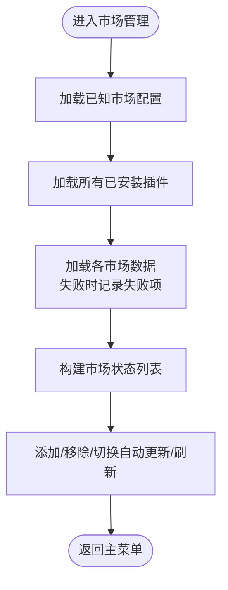

图表来源
- [src/commands/plugin/ManageMarketplaces.tsx](file://src/commands/plugin/ManageMarketplaces.tsx)
- [src/utils/plugins/marketplaceManager.ts](file://src/utils/plugins/marketplaceManager.ts)

章节来源
- [src/commands/plugin/ManageMarketplaces.tsx](file://src/commands/plugin/ManageMarketplaces.tsx)
- [src/utils/plugins/marketplaceManager.ts](file://src/utils/plugins/marketplaceManager.ts)

### 插件重载（reload-plugins）
- 目标：在不重启应用的前提下重新加载插件，使新增或修改的插件生效。
- 流程：调用插件加载器重新扫描插件目录，重建命令、代理、钩子、MCP 服务器等注册表，清理旧实例并初始化新实例。

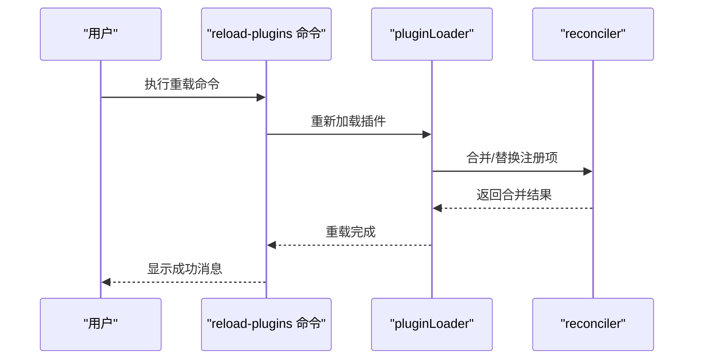

图表来源
- [src/commands/reload-plugins/index.ts](file://src/commands/reload-plugins/index.ts)
- [src/utils/plugins/pluginLoader.ts](file://src/utils/plugins/pluginLoader.ts)
- [src/utils/plugins/reconciler.ts](file://src/utils/plugins/reconciler.ts)

章节来源
- [src/commands/reload-plugins/index.ts](file://src/commands/reload-plugins/index.ts)
- [src/utils/plugins/pluginLoader.ts](file://src/utils/plugins/pluginLoader.ts)
- [src/utils/plugins/reconciler.ts](file://src/utils/plugins/reconciler.ts)

### GitHub 应用安装（install-github-app）
- 目标：引导用户在 GitHub 上安装 Claude Code 的应用，完成 OAuth 授权与回调。
- 流程：打开浏览器授权页面，等待用户完成授权；接收回调参数并写入本地凭据；刷新可用应用列表与权限状态。

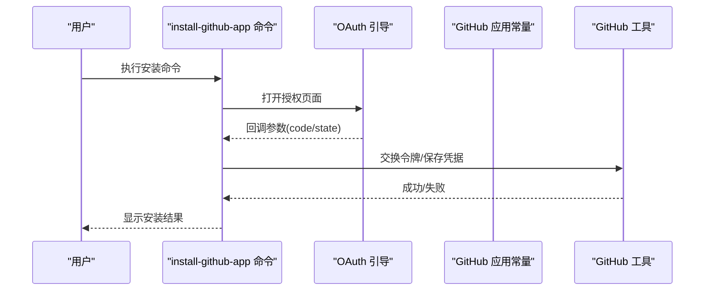

图表来源
- [src/commands/install-github-app/index.ts](file://src/commands/install-github-app/index.ts)
- [src/constants/github-app.ts](file://src/constants/github-app.ts)
- [src/constants/oauth.ts](file://src/constants/oauth.ts)
- [src/utils/github/index.ts](file://src/utils/github/index.ts)
- [src/utils/oauth/index.ts](file://src/utils/oauth/index.ts)

章节来源
- [src/commands/install-github-app/index.ts](file://src/commands/install-github-app/index.ts)
- [src/constants/github-app.ts](file://src/constants/github-app.ts)
- [src/constants/oauth.ts](file://src/constants/oauth.ts)
- [src/utils/github/index.ts](file://src/utils/github/index.ts)
- [src/utils/oauth/index.ts](file://src/utils/oauth/index.ts)

### Slack 应用安装（install-slack-app）
- 目标：引导用户在 Slack 上安装 Claude Code 的应用，完成 OAuth 授权与回调。
- 流程：打开浏览器授权页面，等待用户完成授权；接收回调参数并写入本地凭据；刷新可用应用列表与权限状态。

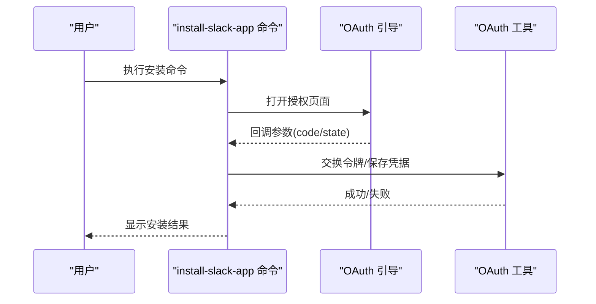

图表来源
- [src/commands/install-slack-app/index.ts](file://src/commands/install-slack-app/index.ts)
- [src/constants/oauth.ts](file://src/constants/oauth.ts)
- [src/utils/oauth/index.ts](file://src/utils/oauth/index.ts)

章节来源
- [src/commands/install-slack-app/index.ts](file://src/commands/install-slack-app/index.ts)
- [src/constants/oauth.ts](file://src/constants/oauth.ts)
- [src/utils/oauth/index.ts](file://src/utils/oauth/index.ts)

### 插件系统架构与加载机制
- 插件类型：LoadedPlugin、InstallablePlugin、MarketplaceInfo 等，统一描述插件元数据、来源、组件与版本。
- 加载器：扫描插件目录，解析入口与声明，注册命令、代理、钩子、MCP 服务器等。
- 市场管理：聚合多个市场源，解析插件清单，提供安装与更新入口。
- 版本与依赖：解析版本范围、依赖关系，避免冲突并提示兼容性问题。
- 缓存与统计：缓存市场数据与安装计数，减少网络请求与提升响应速度。
- 官方市场：提供官方插件仓库的访问与校验，支持 GCS 与启动检查。

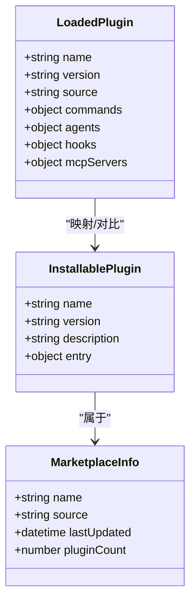

图表来源
- [src/types/plugin.ts](file://src/types/plugin.ts)
- [src/commands/plugin/types.ts](file://src/commands/plugin/types.ts)
- [src/commands/plugin/unifiedTypes.ts](file://src/commands/plugin/unifiedTypes.ts)

章节来源
- [src/types/plugin.ts](file://src/types/plugin.ts)
- [src/commands/plugin/types.ts](file://src/commands/plugin/types.ts)
- [src/commands/plugin/unifiedTypes.ts](file://src/commands/plugin/unifiedTypes.ts)
- [src/utils/plugins/pluginLoader.ts](file://src/utils/plugins/pluginLoader.ts)
- [src/utils/plugins/marketplaceManager.ts](file://src/utils/plugins/marketplaceManager.ts)
- [src/utils/plugins/pluginVersioning.ts](file://src/utils/plugins/pluginVersioning.ts)
- [src/utils/plugins/dependencyResolver.ts](file://src/utils/plugins/dependencyResolver.ts)
- [src/utils/plugins/cacheUtils.ts](file://src/utils/plugins/cacheUtils.ts)
- [src/utils/plugins/installCounts.ts](file://src/utils/plugins/installCounts.ts)
- [src/utils/plugins/officialMarketplace.ts](file://src/utils/plugins/officialMarketplace.ts)
- [src/utils/plugins/officialMarketplaceGcs.ts](file://src/utils/plugins/officialMarketplaceGcs.ts)

## 依赖关系分析
- 组件耦合：命令层与工具层通过类型与接口解耦，工具层内部模块化清晰，便于替换与扩展。
- 外部依赖：GitHub/Slack OAuth、官方市场 API、本地文件系统与缓存。
- 循环依赖：无明显循环依赖迹象；工具层模块职责单一，导入方向一致。
- 接口契约：插件类型与市场类型定义为跨层契约，确保 UI 与工具层的一致性。

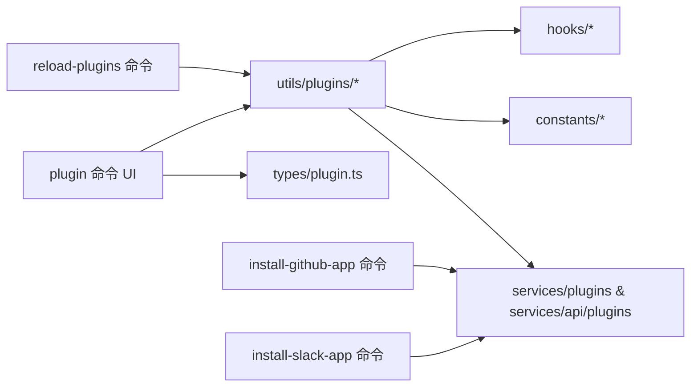

图表来源
- [src/commands/plugin/index.tsx](file://src/commands/plugin/index.tsx)
- [src/commands/reload-plugins/index.ts](file://src/commands/reload-plugins/index.ts)
- [src/commands/install-github-app/index.ts](file://src/commands/install-github-app/index.ts)
- [src/commands/install-slack-app/index.ts](file://src/commands/install-slack-app/index.ts)
- [src/types/plugin.ts](file://src/types/plugin.ts)
- [src/utils/plugins/*.ts](file://src/utils/plugins/pluginLoader.ts)
- [src/services/plugins/index.ts](file://src/services/plugins/index.ts)
- [src/services/api/plugins/index.ts](file://src/services/api/plugins/index.ts)
- [src/constants/github-app.ts](file://src/constants/github-app.ts)
- [src/constants/oauth.ts](file://src/constants/oauth.ts)
- [src/hooks/useManagePlugins.ts](file://src/hooks/useManagePlugins.ts)

章节来源
- [src/commands/plugin/index.tsx](file://src/commands/plugin/index.tsx)
- [src/commands/reload-plugins/index.ts](file://src/commands/reload-plugins/index.ts)
- [src/commands/install-github-app/index.ts](file://src/commands/install-github-app/index.ts)
- [src/commands/install-slack-app/index.ts](file://src/commands/install-slack-app/index.ts)
- [src/types/plugin.ts](file://src/types/plugin.ts)
- [src/utils/plugins/pluginLoader.ts](file://src/utils/plugins/pluginLoader.ts)
- [src/utils/plugins/marketplaceManager.ts](file://src/utils/plugins/marketplaceManager.ts)
- [src/services/plugins/index.ts](file://src/services/plugins/index.ts)
- [src/services/api/plugins/index.ts](file://src/services/api/plugins/index.ts)
- [src/constants/github-app.ts](file://src/constants/github-app.ts)
- [src/constants/oauth.ts](file://src/constants/oauth.ts)
- [src/hooks/useManagePlugins.ts](file://src/hooks/useManagePlugins.ts)

## 性能考虑
- 列表渲染与分页：使用分页与虚拟滚动策略，减少一次性渲染压力。
- 缓存策略：市场数据与安装计数缓存，降低重复请求与网络开销。
- 并发加载：多市场并发加载并在失败时优雅降级，保证主流程可用。
- 启动检查：插件与官方市场的启动检查，避免无效加载与异常。
- 重载优化：仅在必要时重建注册表，避免全量重载带来的抖动。

## 故障排除指南
- 市场加载失败：检查网络连接与市场源可达性；查看失败记录并尝试手动刷新。
- 插件安装失败：确认依赖满足、版本兼容与磁盘空间；查看安装日志与回滚策略。
- 重载无效果：确认插件目录权限与文件完整性；检查是否被黑名单或策略阻止。
- OAuth 授权失败：检查回调地址与安全设置；确认未过期的 state 参数；重试授权流程。
- 权限不足：检查 GitHub/Slack 应用权限范围与组织策略；按提示补充权限。

章节来源
- [src/commands/plugin/ManageMarketplaces.tsx](file://src/commands/plugin/ManageMarketplaces.tsx)
- [src/commands/plugin/ManagePlugins.tsx](file://src/commands/plugin/ManagePlugins.tsx)
- [src/commands/reload-plugins/index.ts](file://src/commands/reload-plugins/index.ts)
- [src/commands/install-github-app/index.ts](file://src/commands/install-github-app/index.ts)
- [src/commands/install-slack-app/index.ts](file://src/commands/install-slack-app/index.ts)
- [src/utils/plugins/pluginBlocklist.ts](file://src/utils/plugins/pluginBlocklist.ts)
- [src/utils/plugins/pluginPolicy.ts](file://src/utils/plugins/pluginPolicy.ts)

## 结论
本文件系统性梳理了插件与市场命令的架构与实现，覆盖从 UI 到工具层再到服务层的完整链路。通过模块化的工具集与清晰的类型契约，系统实现了多市场聚合、插件生命周期管理、重载与第三方应用集成等功能。建议在实际使用中结合缓存与启动检查策略，配合严格的版本与依赖管理，确保稳定性与可维护性。

## 附录
- 插件开发与发布最佳实践
  - 使用统一的插件类型定义与入口规范，确保命令、代理、钩子、MCP 服务器等组件声明清晰。
  - 在市场元数据中提供准确的版本范围与依赖声明，便于自动更新与冲突检测。
  - 使用官方市场作为发布渠道，遵循审核与安全策略；提供安装计数与反馈收集。
  - 开发阶段启用本地市场与调试模式，结合重载命令快速迭代。
  - 发布前进行兼容性测试与性能评估，关注缓存命中率与启动时间。
- 版本管理与自动更新
  - 使用语义化版本与版本范围表达法，避免破坏性更新。
  - 配置自动更新策略与灰度发布，逐步扩大影响面。
  - 对关键插件启用强制更新与回滚机制，保障稳定性。
- 第三方应用集成
  - 遵循 OAuth 安全最佳实践，妥善管理 state 与回调。
  - 在 UI 中提供清晰的授权引导与错误提示，提升用户体验。
  - 定期检查应用权限与组织策略变化，及时调整集成方案。