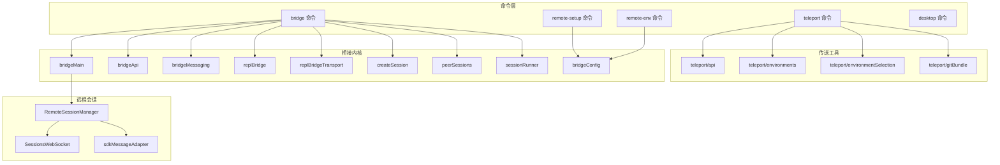
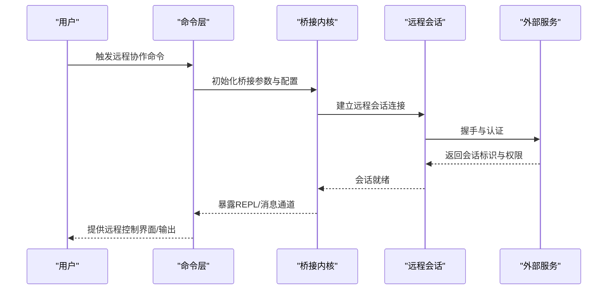
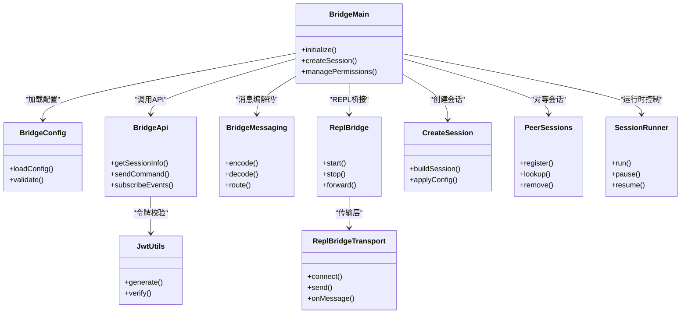
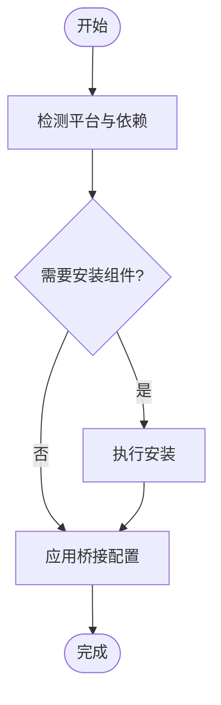
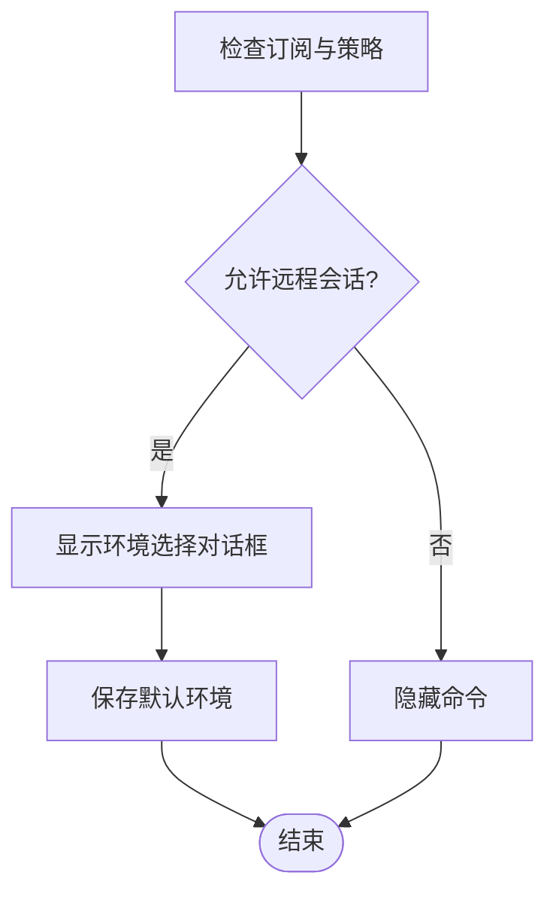
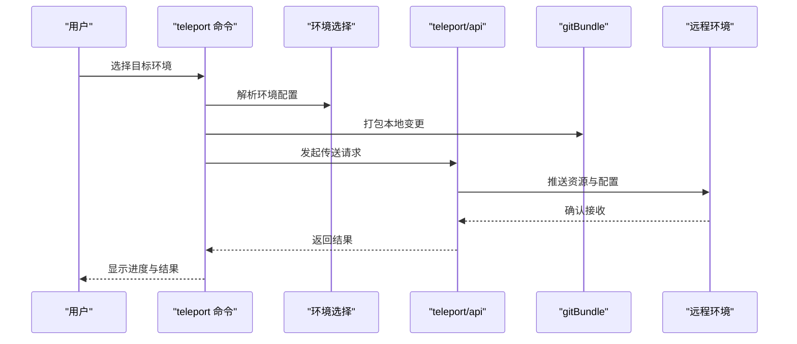
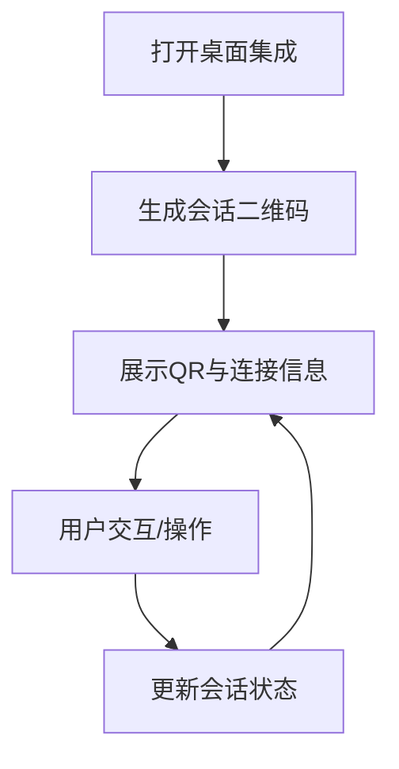
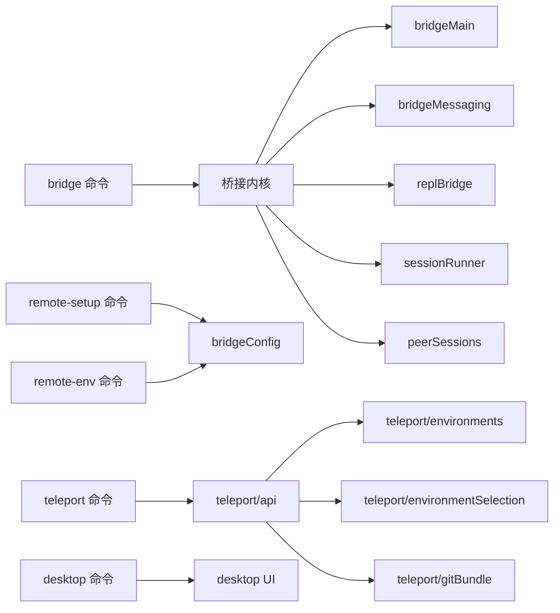

# 远程协作命令

<cite>
**本文档引用的文件**
- [src/commands/bridge/index.ts](file://src/commands/bridge/index.ts)
- [src/commands/bridge/bridge.tsx](file://src/commands/bridge/bridge.tsx)
- [src/commands/remote-setup/index.ts](file://src/commands/remote-setup/index.ts)
- [src/commands/remote-setup/remote-setup.tsx](file://src/commands/remote-setup/remote-setup.tsx)
- [src/commands/remote-env/index.ts](file://src/commands/remote-env/index.ts)
- [src/commands/remote-env/remote-env.tsx](file://src/commands/remote-env/remote-env.tsx)
- [src/commands/teleport/index.js](file://src/commands/teleport/index.js)
- [src/commands/desktop/index.ts](file://src/commands/desktop/index.ts)
- [src/commands/desktop/desktop.tsx](file://src/commands/desktop/desktop.tsx)
- [src/bridge/bridgeApi.ts](file://src/bridge/bridgeApi.ts)
- [src/bridge/bridgeConfig.ts](file://src/bridge/bridgeConfig.ts)
- [src/bridge/bridgeMain.ts](file://src/bridge/bridgeMain.ts)
- [src/bridge/bridgeMessaging.ts](file://src/bridge/bridgeMessaging.ts)
- [src/bridge/createSession.ts](file://src/bridge/createSession.ts)
- [src/bridge/jwtUtils.ts](file://src/bridge/jwtUtils.ts)
- [src/bridge/peerSessions.ts](file://src/bridge/peerSessions.ts)
- [src/bridge/replBridge.ts](file://src/bridge/replBridge.ts)
- [src/bridge/replBridgeTransport.ts](file://src/bridge/replBridgeTransport.ts)
- [src/bridge/sessionRunner.ts](file://src/bridge/sessionRunner.ts)
- [src/bridge/types.ts](file://src/bridge/types.ts)
- [src/remote/RemoteSessionManager.ts](file://src/remote/RemoteSessionManager.ts)
- [src/remote/SessionsWebSocket.ts](file://src/remote/SessionsWebSocket.ts)
- [src/remote/sdkMessageAdapter.ts](file://src/remote/sdkMessageAdapter.ts)
- [src/utils/teleport/api.ts](file://src/utils/teleport/api.ts)
- [src/utils/teleport/environmentSelection.ts](file://src/utils/teleport/environmentSelection.ts)
- [src/utils/teleport/environments.ts](file://src/utils/teleport/environments.ts)
- [src/utils/teleport/gitBundle.ts](file://src/utils/teleport/gitBundle.ts)
</cite>

## 目录
1. [简介](#简介)
2. [项目结构](#项目结构)
3. [核心组件](#核心组件)
4. [架构总览](#架构总览)
5. [详细组件分析](#详细组件分析)
6. [依赖关系分析](#依赖关系分析)
7. [性能考虑](#性能考虑)
8. [故障排除指南](#故障排除指南)
9. [结论](#结论)
10. [附录](#附录)

## 简介
本文件系统性梳理并解释远程协作相关命令与能力，涵盖远程桥接（bridge）、远程设置（remote-setup）、远程环境（remote-env）、传送功能（teleport）与桌面集成（desktop）。文档重点阐述远程会话建立流程、权限管理与安全通信机制，并提供网络配置、性能优化与故障排除的最佳实践，帮助分布式团队与跨地域开发者高效协同。

## 项目结构
远程协作功能主要分布在以下模块：
- 命令层：commands/bridge、commands/remote-setup、commands/remote-env、commands/teleport、commands/desktop
- 桥接内核：bridge/*（会话管理、消息传输、REPL桥、权限回调等）
- 远程会话：remote/*（会话管理器、WebSocket、SDK消息适配）
- 传送工具：utils/teleport/*（环境选择、环境配置、Git打包等）

**图表来源**
- [src/commands/bridge/index.ts](file://src/commands/bridge/index.ts)
- [src/bridge/bridgeMain.ts](file://src/bridge/bridgeMain.ts)
- [src/bridge/bridgeApi.ts](file://src/bridge/bridgeApi.ts)
- [src/bridge/bridgeMessaging.ts](file://src/bridge/bridgeMessaging.ts)
- [src/bridge/replBridge.ts](file://src/bridge/replBridge.ts)
- [src/bridge/replBridgeTransport.ts](file://src/bridge/replBridgeTransport.ts)
- [src/bridge/createSession.ts](file://src/bridge/createSession.ts)
- [src/bridge/peerSessions.ts](file://src/bridge/peerSessions.ts)
- [src/bridge/sessionRunner.ts](file://src/bridge/sessionRunner.ts)
- [src/remote/RemoteSessionManager.ts](file://src/remote/RemoteSessionManager.ts)
- [src/remote/SessionsWebSocket.ts](file://src/remote/SessionsWebSocket.ts)
- [src/remote/sdkMessageAdapter.ts](file://src/remote/sdkMessageAdapter.ts)
- [src/utils/teleport/api.ts](file://src/utils/teleport/api.ts)
- [src/utils/teleport/environments.ts](file://src/utils/teleport/environments.ts)
- [src/utils/teleport/environmentSelection.ts](file://src/utils/teleport/environmentSelection.ts)
- [src/utils/teleport/gitBundle.ts](file://src/utils/teleport/gitBundle.ts)

**章节来源**
- [src/commands/bridge/index.ts](file://src/commands/bridge/index.ts)
- [src/commands/remote-setup/index.ts](file://src/commands/remote-setup/index.ts)
- [src/commands/remote-env/index.ts](file://src/commands/remote-env/index.ts)
- [src/commands/teleport/index.js](file://src/commands/teleport/index.js)
- [src/commands/desktop/index.ts](file://src/commands/desktop/index.ts)

## 核心组件
- 远程桥接（bridge）：负责建立与维护远程会话，处理消息路由、REPL桥接、权限请求与状态管理。
- 远程设置（remote-setup）：引导用户完成远程环境初始化与配置，确保桥接前置条件满足。
- 远程环境（remote-env）：为传送会话设定默认远程环境，结合订阅与策略限制控制可用性。
- 传送功能（teleport）：将本地工作区打包并传送到远程环境，支持环境选择与Git资源同步。
- 桌面集成（desktop）：提供桌面侧的远程协作入口与交互体验，便于跨设备协作。

**章节来源**
- [src/commands/bridge/bridge.tsx](file://src/commands/bridge/bridge.tsx)
- [src/commands/remote-setup/remote-setup.tsx](file://src/commands/remote-setup/remote-setup.tsx)
- [src/commands/remote-env/remote-env.tsx](file://src/commands/remote-env/remote-env.tsx)
- [src/utils/teleport/api.ts](file://src/utils/teleport/api.ts)
- [src/commands/desktop/desktop.tsx](file://src/commands/desktop/desktop.tsx)

## 架构总览
远程协作采用“命令驱动 + 桥接内核 + 远程会话”的分层设计。命令层负责用户交互与入口；桥接内核负责会话生命周期、消息编解码与REPL通道；远程会话层通过WebSocket与远端服务对接；传送工具负责环境与资源准备。

**图表来源**
- [src/bridge/bridgeMain.ts](file://src/bridge/bridgeMain.ts)
- [src/bridge/bridgeApi.ts](file://src/bridge/bridgeApi.ts)
- [src/remote/RemoteSessionManager.ts](file://src/remote/RemoteSessionManager.ts)
- [src/remote/SessionsWebSocket.ts](file://src/remote/SessionsWebSocket.ts)

## 详细组件分析

### 远程桥接（bridge）
- 职责与流程
  - 初始化桥接配置与参数，加载REPL桥与消息传输层。
  - 创建并管理远程会话，处理入站消息与附件，转发到本地或远端。
  - 维护权限回调与状态工具，确保合规使用。
- 关键接口与数据流
  - 配置加载：bridgeConfig.ts
  - 会话创建：createSession.ts
  - 消息传输：bridgeMessaging.ts
  - REPL桥：replBridge.ts、replBridgeTransport.ts
  - 会话运行：sessionRunner.ts
  - 对等会话：peerSessions.ts
  - JWT工具：jwtUtils.ts

**图表来源**
- [src/bridge/bridgeMain.ts](file://src/bridge/bridgeMain.ts)
- [src/bridge/bridgeConfig.ts](file://src/bridge/bridgeConfig.ts)
- [src/bridge/bridgeApi.ts](file://src/bridge/bridgeApi.ts)
- [src/bridge/bridgeMessaging.ts](file://src/bridge/bridgeMessaging.ts)
- [src/bridge/replBridge.ts](file://src/bridge/replBridge.ts)
- [src/bridge/replBridgeTransport.ts](file://src/bridge/replBridgeTransport.ts)
- [src/bridge/createSession.ts](file://src/bridge/createSession.ts)
- [src/bridge/peerSessions.ts](file://src/bridge/peerSessions.ts)
- [src/bridge/sessionRunner.ts](file://src/bridge/sessionRunner.ts)
- [src/bridge/jwtUtils.ts](file://src/bridge/jwtUtils.ts)

**章节来源**
- [src/bridge/bridgeMain.ts](file://src/bridge/bridgeMain.ts)
- [src/bridge/bridgeConfig.ts](file://src/bridge/bridgeConfig.ts)
- [src/bridge/bridgeApi.ts](file://src/bridge/bridgeApi.ts)
- [src/bridge/bridgeMessaging.ts](file://src/bridge/bridgeMessaging.ts)
- [src/bridge/replBridge.ts](file://src/bridge/replBridge.ts)
- [src/bridge/replBridgeTransport.ts](file://src/bridge/replBridgeTransport.ts)
- [src/bridge/createSession.ts](file://src/bridge/createSession.ts)
- [src/bridge/peerSessions.ts](file://src/bridge/peerSessions.ts)
- [src/bridge/sessionRunner.ts](file://src/bridge/sessionRunner.ts)
- [src/bridge/jwtUtils.ts](file://src/bridge/jwtUtils.ts)

### 远程设置（remote-setup）
- 功能概述
  - 引导用户完成远程环境初始化，检查并安装必要组件，生成配置文件。
  - 与桥接配置联动，确保网络与权限满足要求。
- 典型流程
  - 用户触发命令后，进入设置向导。
  - 自动检测当前平台与环境依赖。
  - 生成并应用桥接配置，提示后续步骤。

**图表来源**
- [src/commands/remote-setup/remote-setup.tsx](file://src/commands/remote-setup/remote-setup.tsx)
- [src/bridge/bridgeConfig.ts](file://src/bridge/bridgeConfig.ts)

**章节来源**
- [src/commands/remote-setup/index.ts](file://src/commands/remote-setup/index.ts)
- [src/commands/remote-setup/remote-setup.tsx](file://src/commands/remote-setup/remote-setup.tsx)

### 远程环境（remote-env）
- 功能概述
  - 设定传送会话的默认远程环境，结合订阅状态与策略限制决定可见性与可用性。
  - 通过对话框选择环境，保存至持久化配置。
- 可用性控制
  - 仅限订阅用户且策略允许远程会话时显示。

**图表来源**
- [src/commands/remote-env/index.ts](file://src/commands/remote-env/index.ts)
- [src/commands/remote-env/remote-env.tsx](file://src/commands/remote-env/remote-env.tsx)

**章节来源**
- [src/commands/remote-env/index.ts](file://src/commands/remote-env/index.ts)
- [src/commands/remote-env/remote-env.tsx](file://src/commands/remote-env/remote-env.tsx)

### 传送功能（teleport）
- 功能概述
  - 将本地工作区打包并传送到指定远程环境，支持Git资源同步与环境隔离。
- 关键流程
  - 环境选择：environmentSelection.ts
  - 环境配置：environments.ts
  - API封装：api.ts
  - Git打包：gitBundle.ts

**图表来源**
- [src/commands/teleport/index.js](file://src/commands/teleport/index.js)
- [src/utils/teleport/environmentSelection.ts](file://src/utils/teleport/environmentSelection.ts)
- [src/utils/teleport/environments.ts](file://src/utils/teleport/environments.ts)
- [src/utils/teleport/api.ts](file://src/utils/teleport/api.ts)
- [src/utils/teleport/gitBundle.ts](file://src/utils/teleport/gitBundle.ts)

**章节来源**
- [src/commands/teleport/index.js](file://src/commands/teleport/index.js)
- [src/utils/teleport/api.ts](file://src/utils/teleport/api.ts)
- [src/utils/teleport/environmentSelection.ts](file://src/utils/teleport/environmentSelection.ts)
- [src/utils/teleport/environments.ts](file://src/utils/teleport/environments.ts)
- [src/utils/teleport/gitBundle.ts](file://src/utils/teleport/gitBundle.ts)

### 桌面集成（desktop）
- 功能概述
  - 在桌面环境中提供远程协作入口，支持扫码/链接快速接入、会话状态可视化与操作面板。
- 关键特性
  - QR码生成与展示，便于移动端快速访问。
  - 会话URL动态更新与状态切换。

**图表来源**
- [src/commands/desktop/desktop.tsx](file://src/commands/desktop/desktop.tsx)

**章节来源**
- [src/commands/desktop/index.ts](file://src/commands/desktop/index.ts)
- [src/commands/desktop/desktop.tsx](file://src/commands/desktop/desktop.tsx)

## 依赖关系分析
- 命令层依赖桥接内核与远程会话层，以实现从用户输入到远端执行的完整链路。
- 桥接内核内部模块高度内聚，通过明确的职责边界（配置、消息、REPL、会话）降低耦合。
- 传送工具与远程环境配置相互独立但可组合，便于按需启用。

**图表来源**
- [src/commands/bridge/index.ts](file://src/commands/bridge/index.ts)
- [src/bridge/bridgeMain.ts](file://src/bridge/bridgeMain.ts)
- [src/bridge/bridgeMessaging.ts](file://src/bridge/bridgeMessaging.ts)
- [src/bridge/replBridge.ts](file://src/bridge/replBridge.ts)
- [src/bridge/sessionRunner.ts](file://src/bridge/sessionRunner.ts)
- [src/bridge/peerSessions.ts](file://src/bridge/peerSessions.ts)
- [src/commands/remote-setup/index.ts](file://src/commands/remote-setup/index.ts)
- [src/bridge/bridgeConfig.ts](file://src/bridge/bridgeConfig.ts)
- [src/commands/remote-env/index.ts](file://src/commands/remote-env/index.ts)
- [src/commands/teleport/index.js](file://src/commands/teleport/index.js)
- [src/utils/teleport/api.ts](file://src/utils/teleport/api.ts)
- [src/utils/teleport/environments.ts](file://src/utils/teleport/environments.ts)
- [src/utils/teleport/environmentSelection.ts](file://src/utils/teleport/environmentSelection.ts)
- [src/utils/teleport/gitBundle.ts](file://src/utils/teleport/gitBundle.ts)
- [src/commands/desktop/index.ts](file://src/commands/desktop/index.ts)
- [src/commands/desktop/desktop.tsx](file://src/commands/desktop/desktop.tsx)

**章节来源**
- [src/commands/bridge/index.ts](file://src/commands/bridge/index.ts)
- [src/bridge/bridgeMain.ts](file://src/bridge/bridgeMain.ts)
- [src/bridge/bridgeMessaging.ts](file://src/bridge/bridgeMessaging.ts)
- [src/bridge/replBridge.ts](file://src/bridge/replBridge.ts)
- [src/bridge/sessionRunner.ts](file://src/bridge/sessionRunner.ts)
- [src/bridge/peerSessions.ts](file://src/bridge/peerSessions.ts)
- [src/commands/remote-setup/index.ts](file://src/commands/remote-setup/index.ts)
- [src/bridge/bridgeConfig.ts](file://src/bridge/bridgeConfig.ts)
- [src/commands/remote-env/index.ts](file://src/commands/remote-env/index.ts)
- [src/commands/teleport/index.js](file://src/commands/teleport/index.js)
- [src/utils/teleport/api.ts](file://src/utils/teleport/api.ts)
- [src/utils/teleport/environments.ts](file://src/utils/teleport/environments.ts)
- [src/utils/teleport/environmentSelection.ts](file://src/utils/teleport/environmentSelection.ts)
- [src/utils/teleport/gitBundle.ts](file://src/utils/teleport/gitBundle.ts)
- [src/commands/desktop/index.ts](file://src/commands/desktop/index.ts)
- [src/commands/desktop/desktop.tsx](file://src/commands/desktop/desktop.tsx)

## 性能考虑
- 传输优化
  - 使用二进制或紧凑编码的消息格式，减少带宽占用。
  - 分块传输与增量同步，避免大文件全量重传。
- 会话复用
  - 复用已建立的WebSocket连接，降低握手开销。
  - 合理设置心跳与保活策略，平衡延迟与稳定性。
- 资源管理
  - 控制并发任务数量，避免阻塞REPL与消息通道。
  - 对长耗时操作采用异步与进度反馈机制。
- 缓存策略
  - 缓存常用配置与环境元数据，减少重复查询。
  - 利用Git对象缓存与增量打包，提升传送效率。

## 故障排除指南
- 无法建立桥接
  - 检查网络连通性与代理设置，确认WebSocket端口未被阻断。
  - 核对认证令牌有效性与过期时间。
- 权限不足
  - 确认订阅状态与策略允许远程会话；必要时调整策略或升级订阅。
  - 检查权限回调是否正确返回授权结果。
- 传送失败
  - 查看Git打包日志，确认分支与提交状态一致。
  - 检查远端磁盘空间与目录权限。
- 桌面集成异常
  - 重新生成QR码并刷新页面；检查浏览器权限与HTTPS要求。
  - 确认会话URL未过期，及时刷新状态。

## 结论
远程协作命令通过清晰的分层架构实现了从命令入口到远端执行的完整闭环。桥接内核提供稳定的消息与REPL通道，传送工具保障资源迁移效率，桌面集成提升跨设备协作体验。结合权限与安全机制，可在保证合规的前提下实现高效的分布式协同。

## 附录
- 最佳实践清单
  - 网络：优先使用有线或高带宽无线；开启MTLS与端到端加密。
  - 安全：定期轮换令牌；最小权限原则；审计日志留存。
  - 性能：合理设置并发度；启用增量同步；压缩传输内容。
  - 可靠性：监控心跳与错误率；自动重连与退避策略；降级预案。
- 应用场景示例
  - 分布式团队：通过远程桥接共享开发环境，统一工具链与依赖。
  - 跨地域开发：使用传送功能快速复制工作区，配合桌面集成实现无缝切换。
  - 协作审查：利用REPL桥进行实时代码评审与调试演示。