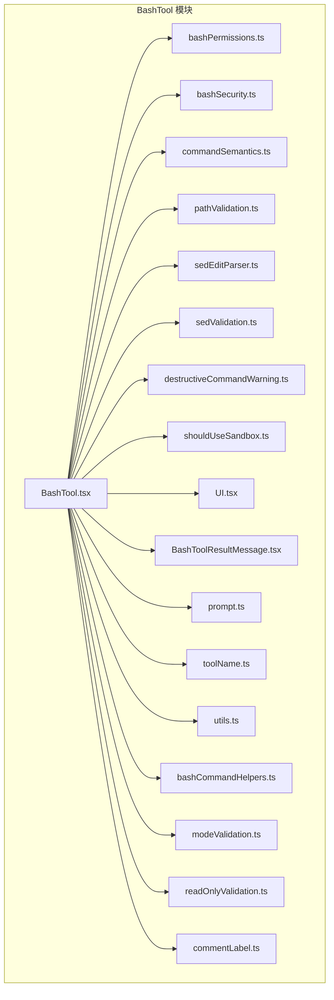
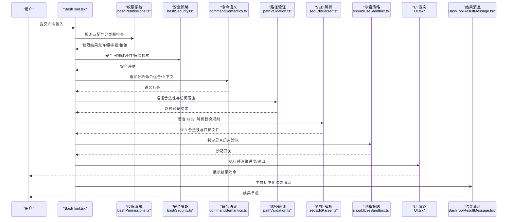
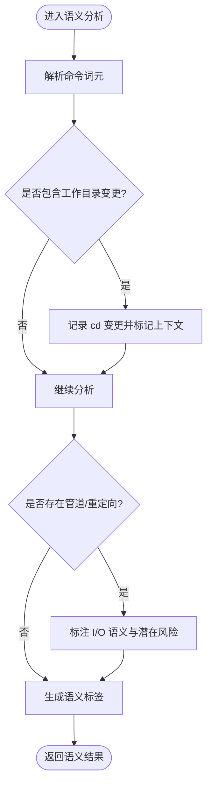
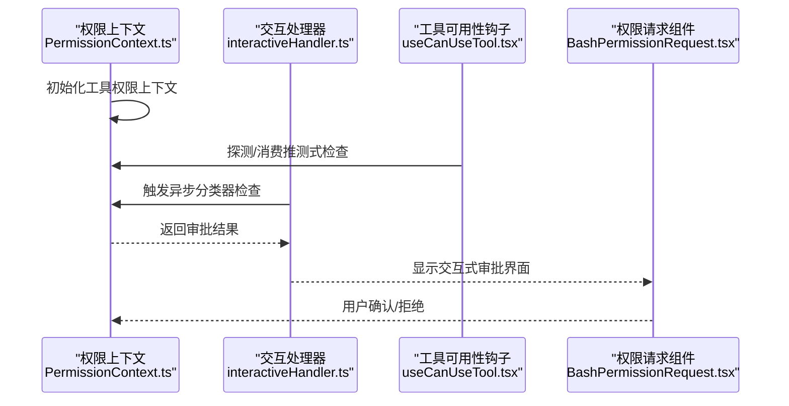
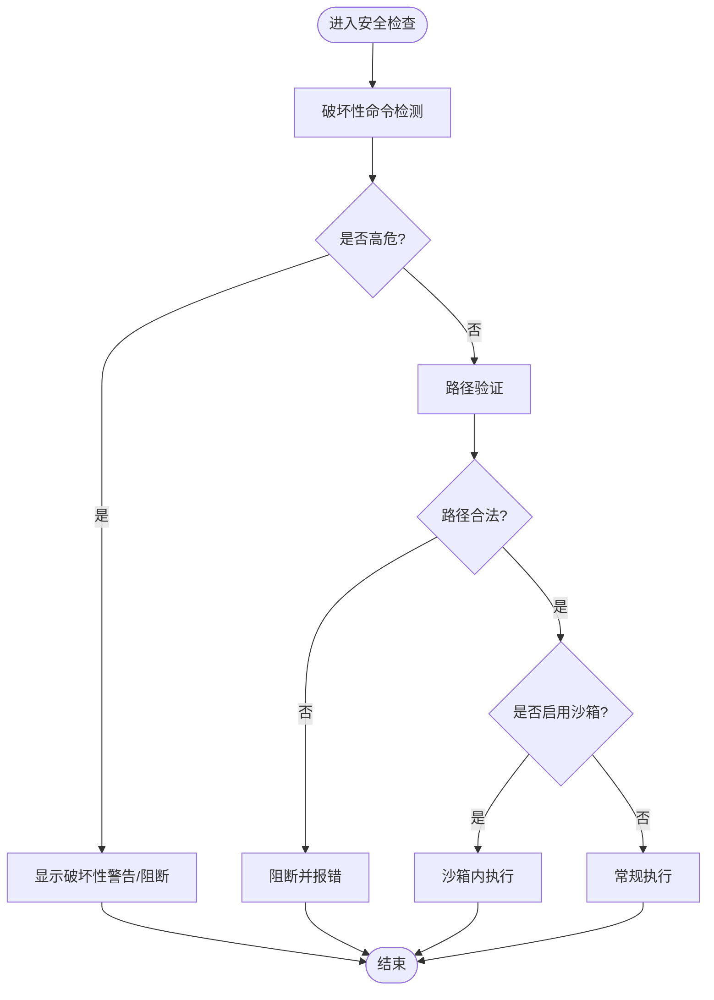
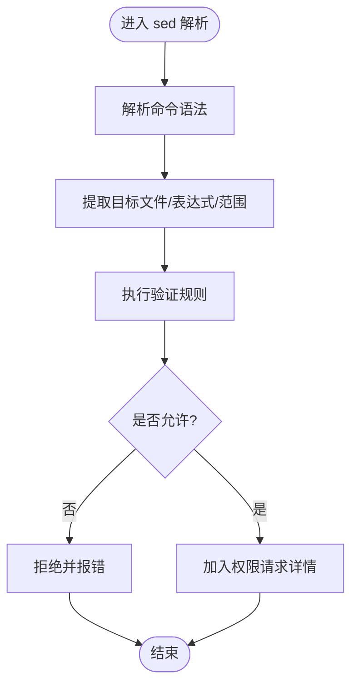
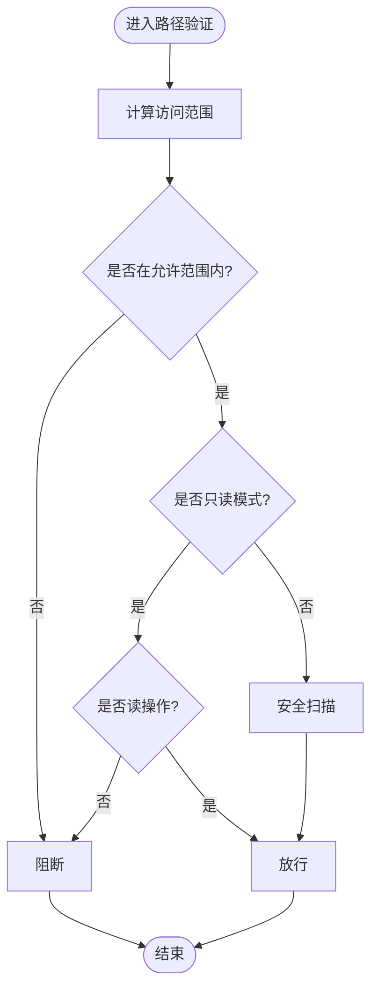
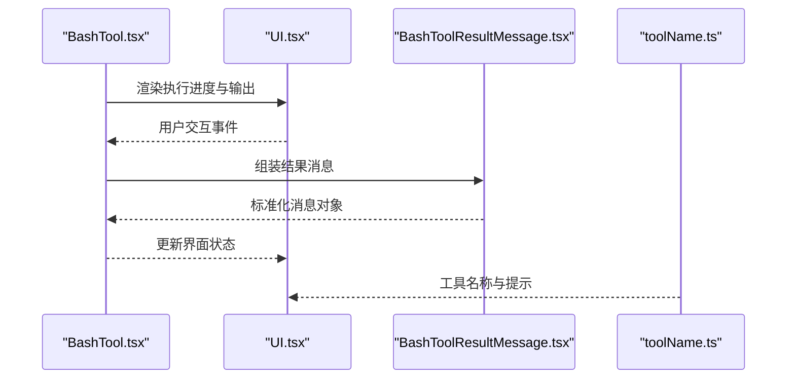
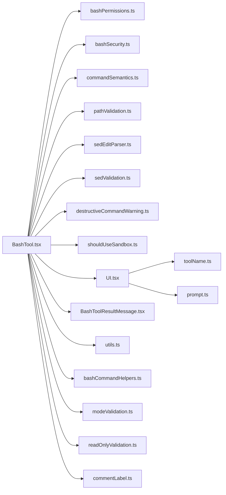

# BashTool 实现

<cite>
**本文引用的文件**
- [BashTool.tsx](file://src/tools/BashTool/BashTool.tsx)
- [bashPermissions.ts](file://src/tools/BashTool/bashPermissions.ts)
- [bashSecurity.ts](file://src/tools/BashTool/bashSecurity.ts)
- [commandSemantics.ts](file://src/tools/BashTool/commandSemantics.ts)
- [pathValidation.ts](file://src/tools/BashTool/pathValidation.ts)
- [sedEditParser.ts](file://src/tools/BashTool/sedEditParser.ts)
- [sedValidation.ts](file://src/tools/BashTool/sedValidation.ts)
- [destructiveCommandWarning.ts](file://src/tools/BashTool/destructiveCommandWarning.ts)
- [shouldUseSandbox.ts](file://src/tools/BashTool/shouldUseSandbox.ts)
- [UI.tsx](file://src/tools/BashTool/UI.tsx)
- [BashToolResultMessage.tsx](file://src/tools/BashTool/BashToolResultMessage.tsx)
- [prompt.ts](file://src/tools/BashTool/prompt.ts)
- [toolName.ts](file://src/tools/BashTool/toolName.ts)
- [utils.ts](file://src/tools/BashTool/utils.ts)
- [bashCommandHelpers.ts](file://src/tools/BashTool/bashCommandHelpers.ts)
- [modeValidation.ts](file://src/tools/BashTool/modeValidation.ts)
- [readOnlyValidation.ts](file://src/tools/BashTool/readOnlyValidation.ts)
- [commentLabel.ts](file://src/tools/BashTool/commentLabel.ts)
- [hooksConfigManager.ts](file://src/utils/hooks/hooksConfigManager.ts)
- [useCanUseTool.tsx](file://src/hooks/useCanUseTool.tsx)
- [PermissionContext.ts](file://src/hooks/toolPermission/PermissionContext.ts)
- [interactiveHandler.ts](file://src/hooks/toolPermission/handlers/interactiveHandler.ts)
- [BashPermissionRequest.tsx](file://src/components/permissions/BashPermissionRequest/BashPermissionRequest.tsx)
- [SedEditPermissionRequest.tsx](file://src/components/permissions/SedEditPermissionRequest/SedEditPermissionRequest.tsx)
- [tools.ts](file://src/tools.ts)
</cite>

## 目录
1. [引言](#引言)
2. [项目结构](#项目结构)
3. [核心组件](#核心组件)
4. [架构总览](#架构总览)
5. [详细组件分析](#详细组件分析)
6. [依赖关系分析](#依赖关系分析)
7. [性能考量](#性能考量)
8. [故障排查指南](#故障排查指南)
9. [结论](#结论)
10. [附录](#附录)

## 引言
本文件为 BashTool 的深入技术文档，聚焦于其实现架构与关键模块：命令解析器、权限验证系统、安全防护机制、输出处理流程，以及与沙箱机制的集成与跨平台兼容策略。重点覆盖命令语义分析、路径验证规则、SED 编辑器解析器与破坏性命令检测，并提供使用示例与安全最佳实践。

## 项目结构
BashTool 位于 src/tools/BashTool 目录下，采用按功能分层的组织方式，包含输入校验、权限控制、安全策略、SED 解析、路径与模式验证、UI 渲染与结果消息等模块。整体以工具入口为核心，围绕“输入—校验—执行—输出”的闭环设计。

图示来源
- [BashTool.tsx](file://src/tools/BashTool/BashTool.tsx)
- [bashPermissions.ts](file://src/tools/BashTool/bashPermissions.ts)
- [bashSecurity.ts](file://src/tools/BashTool/bashSecurity.ts)
- [commandSemantics.ts](file://src/tools/BashTool/commandSemantics.ts)
- [pathValidation.ts](file://src/tools/BashTool/pathValidation.ts)
- [sedEditParser.ts](file://src/tools/BashTool/sedEditParser.ts)
- [sedValidation.ts](file://src/tools/BashTool/sedValidation.ts)
- [destructiveCommandWarning.ts](file://src/tools/BashTool/destructiveCommandWarning.ts)
- [shouldUseSandbox.ts](file://src/tools/BashTool/shouldUseSandbox.ts)
- [UI.tsx](file://src/tools/BashTool/UI.tsx)
- [BashToolResultMessage.tsx](file://src/tools/BashTool/BashToolResultMessage.tsx)
- [prompt.ts](file://src/tools/BashTool/prompt.ts)
- [toolName.ts](file://src/tools/BashTool/toolName.ts)
- [utils.ts](file://src/tools/BashTool/utils.ts)
- [bashCommandHelpers.ts](file://src/tools/BashTool/bashCommandHelpers.ts)
- [modeValidation.ts](file://src/tools/BashTool/modeValidation.ts)
- [readOnlyValidation.ts](file://src/tools/BashTool/readOnlyValidation.ts)
- [commentLabel.ts](file://src/tools/BashTool/commentLabel.ts)

章节来源
- [BashTool.tsx](file://src/tools/BashTool/BashTool.tsx)
- [UI.tsx](file://src/tools/BashTool/UI.tsx)
- [BashToolResultMessage.tsx](file://src/tools/BashTool/BashToolResultMessage.tsx)

## 核心组件
- 工具入口与生命周期：负责接收输入、触发权限与安全检查、执行命令、生成输出消息。
- 权限验证系统：基于规则与分类器的动态权限判定，支持交互式审批与自动批准。
- 安全防护机制：命令语义分析、路径验证、破坏性命令检测、沙箱启用策略。
- SED 编辑器解析器：解析并验证 sed 命令，确保仅允许受控替换操作。
- 输出处理流程：将执行结果格式化为用户可读的消息，支持错误与状态提示。
- 跨平台与环境钩子：通过 hooks 配置管理器与平台适配逻辑，保障在不同运行环境下的稳定性。

章节来源
- [bashPermissions.ts](file://src/tools/BashTool/bashPermissions.ts)
- [bashSecurity.ts](file://src/tools/BashTool/bashSecurity.ts)
- [commandSemantics.ts](file://src/tools/BashTool/commandSemantics.ts)
- [pathValidation.ts](file://src/tools/BashTool/pathValidation.ts)
- [sedEditParser.ts](file://src/tools/BashTool/sedEditParser.ts)
- [sedValidation.ts](file://src/tools/BashTool/sedValidation.ts)
- [destructiveCommandWarning.ts](file://src/tools/BashTool/destructiveCommandWarning.ts)
- [shouldUseSandbox.ts](file://src/tools/BashTool/shouldUseSandbox.ts)
- [hooksConfigManager.ts](file://src/utils/hooks/hooksConfigManager.ts)

## 架构总览
BashTool 的执行流从入口开始，依次经过输入校验、权限与安全检查、命令解析与语义分析、路径与模式验证、SED 解析（如适用）、沙箱决策、执行与输出渲染。权限与安全模块贯穿始终，形成闭环保护。

图示来源
- [BashTool.tsx](file://src/tools/BashTool/BashTool.tsx)
- [bashPermissions.ts](file://src/tools/BashTool/bashPermissions.ts)
- [bashSecurity.ts](file://src/tools/BashTool/bashSecurity.ts)
- [commandSemantics.ts](file://src/tools/BashTool/commandSemantics.ts)
- [pathValidation.ts](file://src/tools/BashTool/pathValidation.ts)
- [sedEditParser.ts](file://src/tools/BashTool/sedEditParser.ts)
- [shouldUseSandbox.ts](file://src/tools/BashTool/shouldUseSandbox.ts)
- [UI.tsx](file://src/tools/BashTool/UI.tsx)
- [BashToolResultMessage.tsx](file://src/tools/BashTool/BashToolResultMessage.tsx)

## 详细组件分析

### 命令解析器与语义分析
- 命令语义分析模块负责识别命令组合、上下文与潜在风险，结合只读模式与工作目录变更进行综合判断。
- 关键点：复合命令拆解、cd 变更检测、管道与重定向的语义标注、脚本片段识别。
- 复杂度：线性时间复杂度 O(n)，n 为命令词元数；空间开销与嵌套层级成正比。

图示来源
- [commandSemantics.ts](file://src/tools/BashTool/commandSemantics.ts)
- [modeValidation.ts](file://src/tools/BashTool/modeValidation.ts)
- [bashCommandHelpers.ts](file://src/tools/BashTool/bashCommandHelpers.ts)

章节来源
- [commandSemantics.ts](file://src/tools/BashTool/commandSemantics.ts)
- [modeValidation.ts](file://src/tools/BashTool/modeValidation.ts)
- [bashCommandHelpers.ts](file://src/tools/BashTool/bashCommandHelpers.ts)

### 权限验证系统
- 动态权限判定：基于预设规则与分类器，支持自动批准与交互式审批。
- 分类器检查：在执行前进行推测式检查，减少等待时间；在交互处理器中触发异步审批。
- 权限上下文初始化：在应用启动时完成工具权限上下文构建，过滤过度宽泛的规则。

图示来源
- [PermissionContext.ts](file://src/hooks/toolPermission/PermissionContext.ts)
- [interactiveHandler.ts](file://src/hooks/toolPermission/handlers/interactiveHandler.ts)
- [useCanUseTool.tsx](file://src/hooks/useCanUseTool.tsx)
- [BashPermissionRequest.tsx](file://src/components/permissions/BashPermissionRequest/BashPermissionRequest.tsx)

章节来源
- [bashPermissions.ts](file://src/tools/BashTool/bashPermissions.ts)
- [PermissionContext.ts](file://src/hooks/toolPermission/PermissionContext.ts)
- [interactiveHandler.ts](file://src/hooks/toolPermission/handlers/interactiveHandler.ts)
- [useCanUseTool.tsx](file://src/hooks/useCanUseTool.tsx)
- [BashPermissionRequest.tsx](file://src/components/permissions/BashPermissionRequest/BashPermissionRequest.tsx)

### 安全防护机制
- 破坏性命令检测：对 rm、dd、mkfs 等高危命令进行预警或拦截。
- 安全扫描：结合语义分析与路径验证，识别越权写入与破坏性操作。
- 与沙箱集成：根据命令类型与上下文决定是否启用沙箱执行，降低全局影响面。

图示来源
- [destructiveCommandWarning.ts](file://src/tools/BashTool/destructiveCommandWarning.ts)
- [bashSecurity.ts](file://src/tools/BashTool/bashSecurity.ts)
- [pathValidation.ts](file://src/tools/BashTool/pathValidation.ts)
- [shouldUseSandbox.ts](file://src/tools/BashTool/shouldUseSandbox.ts)

章节来源
- [destructiveCommandWarning.ts](file://src/tools/BashTool/destructiveCommandWarning.ts)
- [bashSecurity.ts](file://src/tools/BashTool/bashSecurity.ts)
- [pathValidation.ts](file://src/tools/BashTool/pathValidation.ts)
- [shouldUseSandbox.ts](file://src/tools/BashTool/shouldUseSandbox.ts)

### SED 编辑器解析器与验证
- 解析器：将 sed 命令转换为结构化信息，提取目标文件、替换表达式与行号范围。
- 验证规则：限制仅允许对白名单内文件进行替换，禁止全局替换与破坏性表达式。
- 与权限系统联动：在权限请求阶段展示解析后的 sed 行为，供用户审阅。

图示来源
- [sedEditParser.ts](file://src/tools/BashTool/sedEditParser.ts)
- [sedValidation.ts](file://src/tools/BashTool/sedValidation.ts)
- [SedEditPermissionRequest.tsx](file://src/components/permissions/SedEditPermissionRequest/SedEditPermissionRequest.tsx)

章节来源
- [sedEditParser.ts](file://src/tools/BashTool/sedEditParser.ts)
- [sedValidation.ts](file://src/tools/BashTool/sedValidation.ts)
- [SedEditPermissionRequest.tsx](file://src/components/permissions/SedEditPermissionRequest/SedEditPermissionRequest.tsx)

### 路径验证规则
- 访问范围：严格限制对工作树外与敏感路径的访问，避免越权读写。
- 模式与只读：在只读模式下仅允许读取操作，写入一律阻断；非只读模式下仍需额外安全检查。
- 与钩子协作：通过 hooks 配置管理器动态更新监视路径与环境变量，保证后续命令生效。

图示来源
- [pathValidation.ts](file://src/tools/BashTool/pathValidation.ts)
- [readOnlyValidation.ts](file://src/tools/BashTool/readOnlyValidation.ts)
- [hooksConfigManager.ts](file://src/utils/hooks/hooksConfigManager.ts)

章节来源
- [pathValidation.ts](file://src/tools/BashTool/pathValidation.ts)
- [readOnlyValidation.ts](file://src/tools/BashTool/readOnlyValidation.ts)
- [hooksConfigManager.ts](file://src/utils/hooks/hooksConfigManager.ts)

### 输出处理流程与 UI
- UI 渲染：进度条、实时输出与错误提示，支持中断与重试。
- 结果消息：将执行结果封装为标准化消息，包含退出码、标准输出/错误、耗时等。
- 工具名称与提示：统一工具标识与使用提示，便于用户识别与反馈。

图示来源
- [UI.tsx](file://src/tools/BashTool/UI.tsx)
- [BashToolResultMessage.tsx](file://src/tools/BashTool/BashToolResultMessage.tsx)
- [toolName.ts](file://src/tools/BashTool/toolName.ts)

章节来源
- [UI.tsx](file://src/tools/BashTool/UI.tsx)
- [BashToolResultMessage.tsx](file://src/tools/BashTool/BashToolResultMessage.tsx)
- [toolName.ts](file://src/tools/BashTool/toolName.ts)

### 与沙箱机制的集成
- 决策依据：命令类型、路径范围、破坏性程度与用户策略。
- 执行隔离：在沙箱内限制文件系统、网络与进程能力，最小化副作用。
- 回退策略：若沙箱不可用或失败，则降级为受限执行并记录日志。

章节来源
- [shouldUseSandbox.ts](file://src/tools/BashTool/shouldUseSandbox.ts)
- [bashSecurity.ts](file://src/tools/BashTool/bashSecurity.ts)

### 跨平台兼容性处理
- 平台适配：通过平台工具与环境探测，选择合适的 shell 与路径分隔符。
- 钩子与环境：利用 hooks 配置管理器在不同平台上保持一致的行为与可观测性。
- 文件监视：动态注册与更新监视路径，确保跨平台一致性。

章节来源
- [hooksConfigManager.ts](file://src/utils/hooks/hooksConfigManager.ts)

## 依赖关系分析
BashTool 的模块间依赖清晰，遵循单一职责与低耦合原则。入口模块聚合各子模块，UI 与结果消息作为输出层独立存在，权限与安全模块通过接口与入口交互。

图示来源
- [BashTool.tsx](file://src/tools/BashTool/BashTool.tsx)
- [bashPermissions.ts](file://src/tools/BashTool/bashPermissions.ts)
- [bashSecurity.ts](file://src/tools/BashTool/bashSecurity.ts)
- [commandSemantics.ts](file://src/tools/BashTool/commandSemantics.ts)
- [pathValidation.ts](file://src/tools/BashTool/pathValidation.ts)
- [sedEditParser.ts](file://src/tools/BashTool/sedEditParser.ts)
- [sedValidation.ts](file://src/tools/BashTool/sedValidation.ts)
- [destructiveCommandWarning.ts](file://src/tools/BashTool/destructiveCommandWarning.ts)
- [shouldUseSandbox.ts](file://src/tools/BashTool/shouldUseSandbox.ts)
- [UI.tsx](file://src/tools/BashTool/UI.tsx)
- [BashToolResultMessage.tsx](file://src/tools/BashTool/BashToolResultMessage.tsx)
- [prompt.ts](file://src/tools/BashTool/prompt.ts)
- [toolName.ts](file://src/tools/BashTool/toolName.ts)
- [utils.ts](file://src/tools/BashTool/utils.ts)
- [bashCommandHelpers.ts](file://src/tools/BashTool/bashCommandHelpers.ts)
- [modeValidation.ts](file://src/tools/BashTool/modeValidation.ts)
- [readOnlyValidation.ts](file://src/tools/BashTool/readOnlyValidation.ts)
- [commentLabel.ts](file://src/tools/BashTool/commentLabel.ts)

章节来源
- [BashTool.tsx](file://src/tools/BashTool/BashTool.tsx)
- [tools.ts](file://src/tools.ts)

## 性能考量
- 权限与安全检查：采用推测式检查与缓存策略，减少重复计算；对大型命令集进行分片处理。
- 路径验证：使用索引与集合快速判断，避免深度遍历；对频繁访问路径建立缓存。
- SED 解析：仅在命令包含 sed 时触发，解析结果可复用；限制表达式复杂度。
- UI 渲染：增量更新输出缓冲区，避免全量重绘；在长输出场景启用虚拟滚动。

## 故障排查指南
- 权限被拒：检查规则配置与分类器结果，必要时走交互式审批流程。
- 路径访问失败：确认目标路径在工作树范围内且非只读模式下的写操作。
- SED 替换未生效：核对目标文件是否在白名单内，表达式是否符合验证规则。
- 沙箱执行异常：查看沙箱启用条件与平台支持情况，必要时关闭沙箱进行诊断。
- 输出不完整：检查超时设置与缓冲区大小，关注中断信号与错误码。

章节来源
- [BashPermissionRequest.tsx](file://src/components/permissions/BashPermissionRequest/BashPermissionRequest.tsx)
- [SedEditPermissionRequest.tsx](file://src/components/permissions/SedEditPermissionRequest/SedEditPermissionRequest.tsx)
- [hooksConfigManager.ts](file://src/utils/hooks/hooksConfigManager.ts)

## 结论
BashTool 通过模块化的架构实现了对命令执行的全链路安全管控：从输入到权限、语义、路径与 SED 的多维验证，再到沙箱与跨平台适配，最终以清晰的 UI 与标准化消息呈现结果。该设计在保障安全性的同时兼顾了易用性与可维护性。

## 附录
- 使用示例（概念性说明）
  - 基础命令：在只读模式下执行 ls、grep 等读取类命令。
  - SED 替换：对白名单内的文本文件进行受控替换，提交前由权限请求组件展示解析结果。
  - 破坏性命令：如需 rm、dd 等，系统会触发破坏性警告并要求二次确认。
- 安全最佳实践
  - 优先使用只读模式执行探索性命令。
  - 对涉及文件系统的命令，尽量限定在工作树内。
  - 使用 SED 时，明确指定目标文件与精确的替换表达式。
  - 在生产环境启用沙箱，并定期审查权限规则与分类器结果。
  - 通过 hooks 配置管理器动态更新监视路径与环境变量，确保后续命令生效。