# PowerShellTool 实现

<cite>
**本文档引用的文件**
- [PowerShellTool.tsx](file://src/tools/PowerShellTool/PowerShellTool.tsx)
- [commandSemantics.ts](file://src/tools/PowerShellTool/commandSemantics.ts)
- [gitSafety.ts](file://src/tools/PowerShellTool/gitSafety.ts)
- [powershellSecurity.ts](file://src/tools/PowerShellTool/powershellSecurity.ts)
- [pathValidation.ts](file://src/tools/PowerShellTool/pathValidation.ts)
- [modeValidation.ts](file://src/tools/PowerShellTool/modeValidation.ts)
- [readOnlyValidation.ts](file://src/tools/PowerShellTool/readOnlyValidation.ts)
- [powershellPermissions.ts](file://src/tools/PowerShellTool/powershellPermissions.ts)
- [tools.ts](file://src/tools.ts)
</cite>

## 目录
1. [简介](#简介)
2. [项目结构](#项目结构)
3. [核心组件](#核心组件)
4. [架构总览](#架构总览)
5. [详细组件分析](#详细组件分析)
6. [依赖关系分析](#依赖关系分析)
7. [性能考虑](#性能考虑)
8. [故障排除指南](#故障排除指南)
9. [结论](#结论)
10. [附录](#附录)

## 简介
本文件系统性阐述 PowerShellTool 的实现架构与关键技术细节，覆盖命令解析、危险 Cmdlet 检测、Git 安全保护、权限验证机制、命令语义分析、参数验证、路径安全检查以及只读模式保护等核心能力。同时解释与 Windows 系统的安全集成与跨平台兼容性处理，并提供使用示例与安全最佳实践。

## 项目结构
PowerShellTool 位于 `src/tools/PowerShellTool/` 目录下，采用模块化设计，按职责划分为以下关键模块：
- 工具入口与生命周期：PowerShellTool.tsx
- 命令语义解释：commandSemantics.ts
- Git 安全防护：gitSafety.ts
- PowerShell 安全检测：powershellSecurity.ts
- 路径验证与权限控制：pathValidation.ts
- 权限模式校验（只读/接受编辑）：modeValidation.ts
- 只读命令白名单与安全参数校验：readOnlyValidation.ts
- 权限综合判定流程：powershellPermissions.ts
- 工具注册与导出：tools.ts

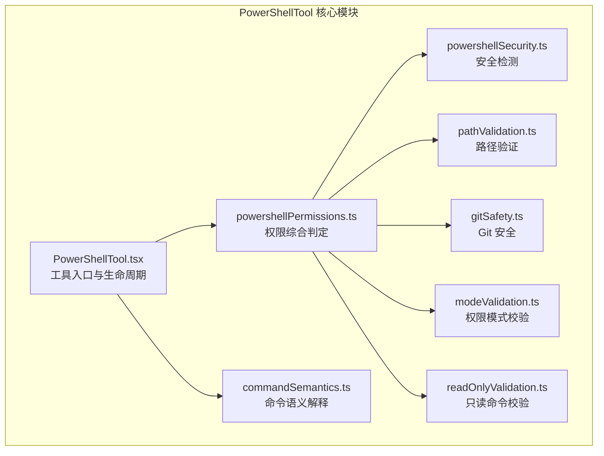

**图表来源**
- [PowerShellTool.tsx:272-662](file://src/tools/PowerShellTool/PowerShellTool.tsx#L272-L662)
- [powershellPermissions.ts:639-800](file://src/tools/PowerShellTool/powershellPermissions.ts#L639-L800)
- [powershellSecurity.ts:1-120](file://src/tools/PowerShellTool/powershellSecurity.ts#L1-L120)
- [pathValidation.ts:1-120](file://src/tools/PowerShellTool/pathValidation.ts#L1-L120)
- [gitSafety.ts:1-40](file://src/tools/PowerShellTool/gitSafety.ts#L1-L40)
- [modeValidation.ts:1-40](file://src/tools/PowerShellTool/modeValidation.ts#L1-L40)
- [readOnlyValidation.ts:1-40](file://src/tools/PowerShellTool/readOnlyValidation.ts#L1-L40)
- [commandSemantics.ts:1-40](file://src/tools/PowerShellTool/commandSemantics.ts#L1-L40)

**章节来源**
- [PowerShellTool.tsx:1-120](file://src/tools/PowerShellTool/PowerShellTool.tsx#L1-L120)
- [tools.ts:143-183](file://src/tools.ts#L143-L183)

## 核心组件
- 工具定义与生命周期管理：通过 `buildTool` 构建，提供输入输出模式、描述生成、进度渲染、结果映射、调用执行与并发安全判定。
- 命令解析与安全检测：基于 PowerShell AST 的多层安全检查，覆盖动态命令名、编码参数、嵌套进程、下载器、COM 对象、脚本块注入、成员调用、子表达式、可展开字符串、参数省略等。
- 路径验证与 Git 安全：提取命令中的文件路径，结合权限规则与工作目录约束，识别裸仓库攻击与 .git 内部路径写入风险。
- 权限模式与只读策略：支持 acceptEdits 模式下的自动放行与严格校验，防止复合命令中的目录变更与符号链接导致的路径绕过。
- 命令语义解释：针对外部可执行程序（如 grep、findstr、robocopy）的退出码进行语义化解析，避免误判为错误。

**章节来源**
- [PowerShellTool.tsx:272-436](file://src/tools/PowerShellTool/PowerShellTool.tsx#L272-L436)
- [powershellSecurity.ts:1-120](file://src/tools/PowerShellTool/powershellSecurity.ts#L1-L120)
- [pathValidation.ts:124-200](file://src/tools/PowerShellTool/pathValidation.ts#L124-L200)
- [gitSafety.ts:1-40](file://src/tools/PowerShellTool/gitSafety.ts#L1-L40)
- [modeValidation.ts:1-40](file://src/tools/PowerShellTool/modeValidation.ts#L1-L40)
- [commandSemantics.ts:1-40](file://src/tools/PowerShellTool/commandSemantics.ts#L1-L40)

## 架构总览
PowerShellTool 的执行流程从工具入口开始，经过权限判定、安全检测、路径验证与 Git 安全检查，最终进入命令执行阶段。执行过程中支持后台任务、进度上报、大输出持久化与图像输出压缩等特性。

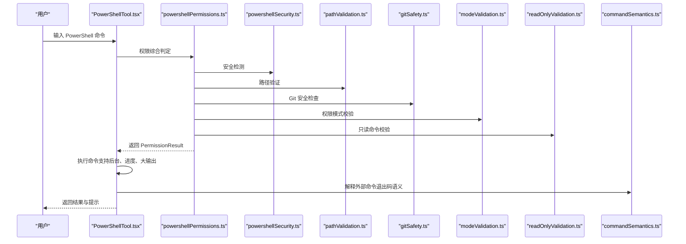

**图表来源**
- [PowerShellTool.tsx:437-658](file://src/tools/PowerShellTool/PowerShellTool.tsx#L437-L658)
- [powershellPermissions.ts:639-800](file://src/tools/PowerShellTool/powershellPermissions.ts#L639-L800)
- [powershellSecurity.ts:1-120](file://src/tools/PowerShellTool/powershellSecurity.ts#L1-L120)
- [pathValidation.ts:1-120](file://src/tools/PowerShellTool/pathValidation.ts#L1-L120)
- [gitSafety.ts:1-40](file://src/tools/PowerShellTool/gitSafety.ts#L1-L40)
- [modeValidation.ts:1-40](file://src/tools/PowerShellTool/modeValidation.ts#L1-L40)
- [readOnlyValidation.ts:1-40](file://src/tools/PowerShellTool/readOnlyValidation.ts#L1-L40)
- [commandSemantics.ts:1-40](file://src/tools/PowerShellTool/commandSemantics.ts#L1-L40)

## 详细组件分析

### PowerShellTool 入口与生命周期
- 输入/输出模式：严格模式、超时控制、描述生成、后台运行标记、沙箱禁用开关。
- 并发安全：基于只读命令判定，允许并发执行只读命令。
- 进度与后台：支持进度回调、后台任务注册、任务 ID 生成与输出路径管理。
- 大输出处理：超过阈值时落盘并提供预览，支持图像输出压缩。
- 退出码语义：调用命令语义解释模块，区分“无匹配”“复制成功”等非错误场景。

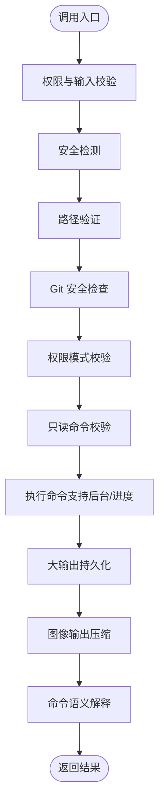

**图表来源**
- [PowerShellTool.tsx:437-658](file://src/tools/PowerShellTool/PowerShellTool.tsx#L437-L658)
- [commandSemantics.ts:127-143](file://src/tools/PowerShellTool/commandSemantics.ts#L127-L143)

**章节来源**
- [PowerShellTool.tsx:272-436](file://src/tools/PowerShellTool/PowerShellTool.tsx#L272-L436)
- [PowerShellTool.tsx:663-662](file://src/tools/PowerShellTool/PowerShellTool.tsx#L663-L662)

### PowerShell 安全检测（AST 驱动）
- 动态命令名检测：拒绝命令名由变量/索引/二元表达式拼接的动态调用。
- 编码参数检测：拒绝 -EncodedCommand/-E 参数，防止混淆意图。
- 嵌套进程检测：拒绝直接或间接启动 PowerShell 进程。
- 下载器与远程执行：识别 IWR/IRM/New-Object 等组合，要求明确授权。
- Add-Type 与 COM 对象：编译/加载类型或实例化 COM 对象需授权。
- 文件路径执行 Cmdlet：对 -FilePath/-LiteralPath 进行严格检查。
- ForEach-Object -MemberName：按名称调用方法的危险模式。
- Start-Process 特殊模式：请求提权或启动 PowerShell 可执行文件。
- 脚本块注入：在危险 Cmdlet 上下文中拒绝脚本块。
- 子表达式、可展开字符串、Splats、停止解析令牌、成员调用：统一标记为高风险。

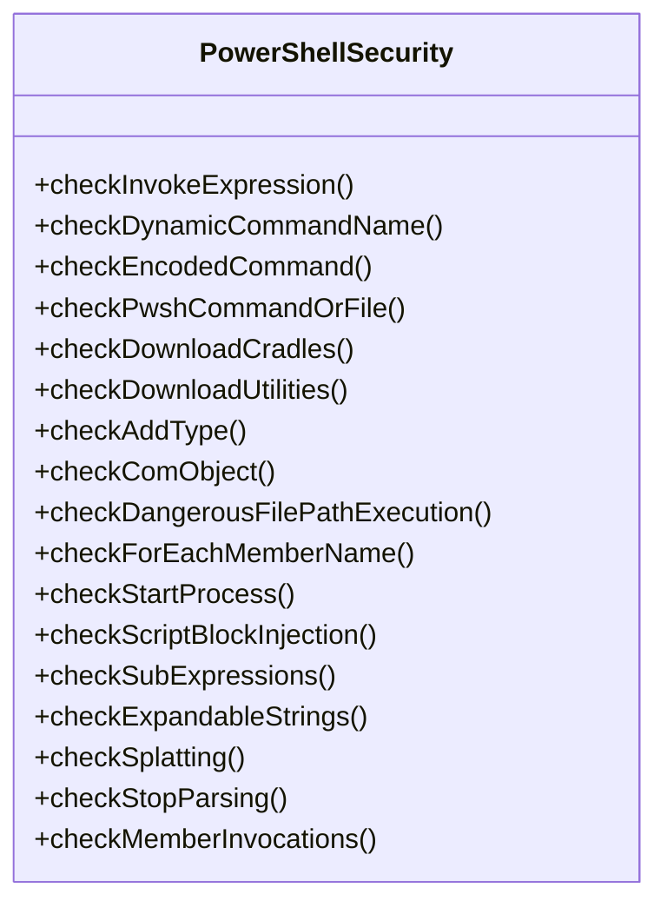

**图表来源**
- [powershellSecurity.ts:106-205](file://src/tools/PowerShellTool/powershellSecurity.ts#L106-L205)
- [powershellSecurity.ts:234-315](file://src/tools/PowerShellTool/powershellSecurity.ts#L234-L315)
- [powershellSecurity.ts:452-487](file://src/tools/PowerShellTool/powershellSecurity.ts#L452-L487)
- [powershellSecurity.ts:550-633](file://src/tools/PowerShellTool/powershellSecurity.ts#L550-L633)
- [powershellSecurity.ts:663-709](file://src/tools/PowerShellTool/powershellSecurity.ts#L663-L709)
- [powershellSecurity.ts:714-771](file://src/tools/PowerShellTool/powershellSecurity.ts#L714-L771)
- [powershellSecurity.ts:776-800](file://src/tools/PowerShellTool/powershellSecurity.ts#L776-L800)

**章节来源**
- [powershellSecurity.ts:1-120](file://src/tools/PowerShellTool/powershellSecurity.ts#L1-L120)
- [powershellSecurity.ts:120-240](file://src/tools/PowerShellTool/powershellSecurity.ts#L120-L240)
- [powershellSecurity.ts:240-400](file://src/tools/PowerShellTool/powershellSecurity.ts#L240-L400)

### 路径验证与权限控制
- 命令级参数配置：为每个 Cmdlet 明确定义读/写操作类型、路径参数、开关参数与值参数集合。
- 参数提取与规范化：处理冒号语法、转义字符、驱动器相对路径、NTFS 尾随空白与点等。
- 跨参数跟踪：对 -Name 等仅作为叶文件名的参数进行限制，避免跨参数路径解析复杂度。
- 写入目标路径验证：结合工作目录、沙箱白名单与危险路径规则，拒绝越权写入。
- 危险删除检测：识别可能破坏系统或项目结构的删除操作。

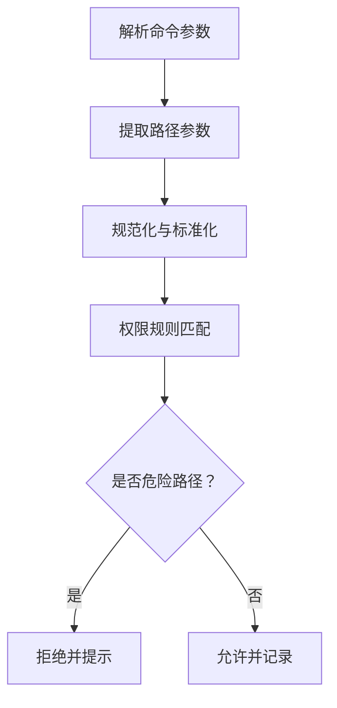

**图表来源**
- [pathValidation.ts:124-200](file://src/tools/PowerShellTool/pathValidation.ts#L124-L200)
- [pathValidation.ts:767-800](file://src/tools/PowerShellTool/pathValidation.ts#L767-L800)

**章节来源**
- [pathValidation.ts:1-120](file://src/tools/PowerShellTool/pathValidation.ts#L1-L120)
- [pathValidation.ts:120-200](file://src/tools/PowerShellTool/pathValidation.ts#L120-L200)
- [pathValidation.ts:767-800](file://src/tools/PowerShellTool/pathValidation.ts#L767-L800)

### Git 安全保护
- 裸仓库攻击防护：检测 cwd 中存在 HEAD/objects/refs 但无有效 .git/HEAD 的情况，防止将 hooks/ 作为工作树执行。
- Git 内部路径识别：对 hooks/、refs/、objects/、HEAD 等路径进行归一化与解析，确保在 cwd 变更后仍能正确判断。
- .git 目录识别：区分标准仓库与裸仓库，避免将普通项目目录误判为 .git。
- 归一化与解析：处理 Unicode 分隔符、反引号转义、提供程序前缀、驱动器相对路径等。

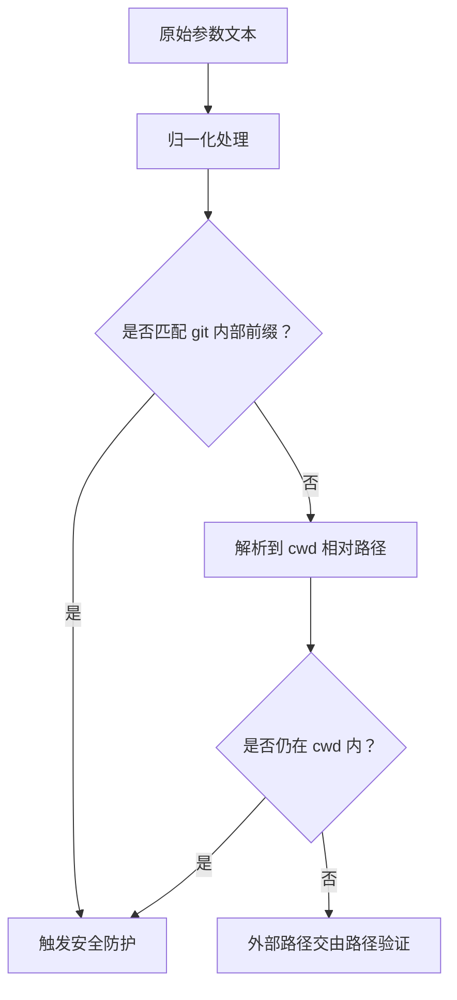

**图表来源**
- [gitSafety.ts:140-151](file://src/tools/PowerShellTool/gitSafety.ts#L140-L151)
- [gitSafety.ts:158-168](file://src/tools/PowerShellTool/gitSafety.ts#L158-L168)
- [gitSafety.ts:106-122](file://src/tools/PowerShellTool/gitSafety.ts#L106-L122)

**章节来源**
- [gitSafety.ts:1-40](file://src/tools/PowerShellTool/gitSafety.ts#L1-L40)
- [gitSafety.ts:140-177](file://src/tools/PowerShellTool/gitSafety.ts#L140-L177)

### 权限模式与只读策略
- acceptEdits 模式：在严格模式下自动放行简单写入 Cmdlet（如 Set-Content、Add-Content、Remove-Item、Clear-Content），并进行路径验证。
- 复合命令防护：若包含目录变更或符号链接创建，拒绝自动放行，防止路径解析时序差导致的绕过。
- 元素类型白名单：拒绝变量、哈希表、脚本块等不可静态解析的参数类型。
- 安全输出 Cmdlet：Out-Null、Out-Host、Out-String 等零参数安全输出不影响前置命令的权限继承。

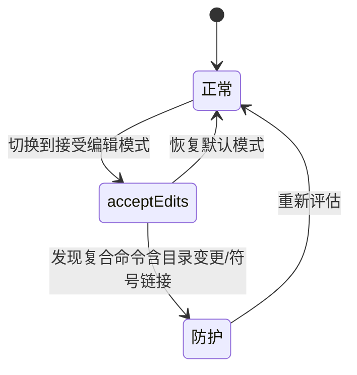

**图表来源**
- [modeValidation.ts:132-160](file://src/tools/PowerShellTool/modeValidation.ts#L132-L160)
- [modeValidation.ts:206-242](file://src/tools/PowerShellTool/modeValidation.ts#L206-L242)
- [modeValidation.ts:395-404](file://src/tools/PowerShellTool/modeValidation.ts#L395-L404)

**章节来源**
- [modeValidation.ts:1-40](file://src/tools/PowerShellTool/modeValidation.ts#L1-L40)
- [modeValidation.ts:132-200](file://src/tools/PowerShellTool/modeValidation.ts#L132-L200)
- [modeValidation.ts:200-405](file://src/tools/PowerShellTool/modeValidation.ts#L200-L405)

### 只读命令校验与参数安全
- Cmdlet 白名单：列举各 Cmdlet 的安全标志位，严格限定参数范围，避免泄露敏感信息。
- 参数类型白名单：仅允许字符串常量与参数名，拒绝变量、脚本块、子表达式、可展开字符串等。
- 特定命令的额外回调：如 Write-Output、Write-Host、Start-Sleep、Format-*、Measure-Object 等，通过回调检测参数值是否可能泄露。
- 外部命令与网络相关命令：对 Git/GitHub/Docker 等外部工具进行只读参数校验，避免远程请求与系统配置修改。

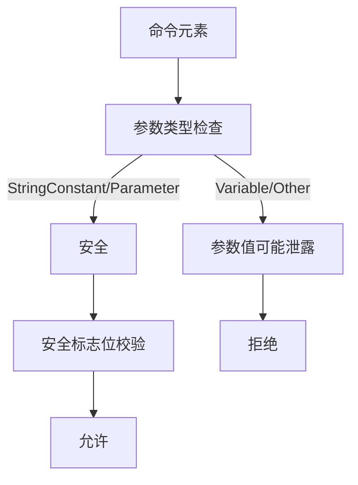

**图表来源**
- [readOnlyValidation.ts:76-115](file://src/tools/PowerShellTool/readOnlyValidation.ts#L76-L115)
- [readOnlyValidation.ts:129-200](file://src/tools/PowerShellTool/readOnlyValidation.ts#L129-L200)
- [readOnlyValidation.ts:500-565](file://src/tools/PowerShellTool/readOnlyValidation.ts#L500-L565)

**章节来源**
- [readOnlyValidation.ts:1-40](file://src/tools/PowerShellTool/readOnlyValidation.ts#L1-L40)
- [readOnlyValidation.ts:76-115](file://src/tools/PowerShellTool/readOnlyValidation.ts#L76-L115)
- [readOnlyValidation.ts:129-200](file://src/tools/PowerShellTool/readOnlyValidation.ts#L129-L200)

### 命令语义解释
- 默认语义：仅 0 表示成功，其他视为错误。
- grep/ripgrep/findstr：0=找到匹配，1=无匹配，2+=错误。
- robocopy：根据位字段解释，0-7 成功，8+ 错误。
- 提取最后一个管道段的命令名，进行语义化解析，避免误报。

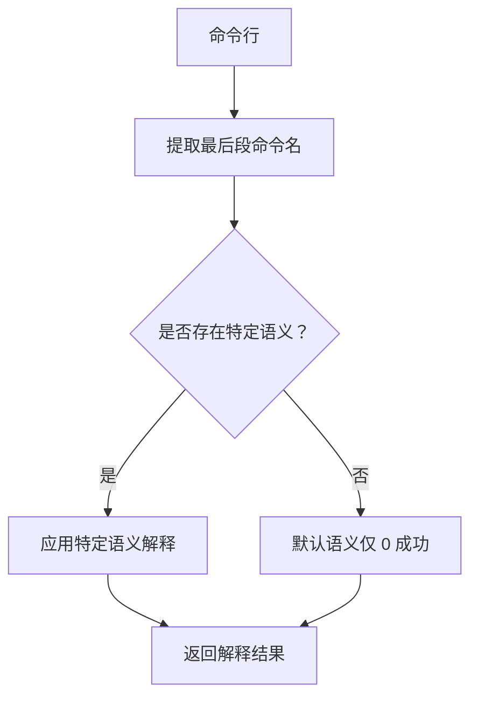

**图表来源**
- [commandSemantics.ts:130-143](file://src/tools/PowerShellTool/commandSemantics.ts#L130-L143)
- [commandSemantics.ts:62-94](file://src/tools/PowerShellTool/commandSemantics.ts#L62-L94)

**章节来源**
- [commandSemantics.ts:1-40](file://src/tools/PowerShellTool/commandSemantics.ts#L1-L40)
- [commandSemantics.ts:127-143](file://src/tools/PowerShellTool/commandSemantics.ts#L127-L143)

### 权限综合判定流程
- 规则匹配：精确匹配、前缀匹配、通配符匹配三类规则，分别对应 deny/ask/allow。
- 解析失败降级：当 PowerShell 解析失败时，对命令片段进行降级规则匹配，防止绕过。
- UNC 路径阻断：在子命令判定前阻断潜在触发网络请求的 UNC 路径。
- 子命令独立判定：对管道中的每个命令进行独立权限判定，安全输出命令不参与审批收集。

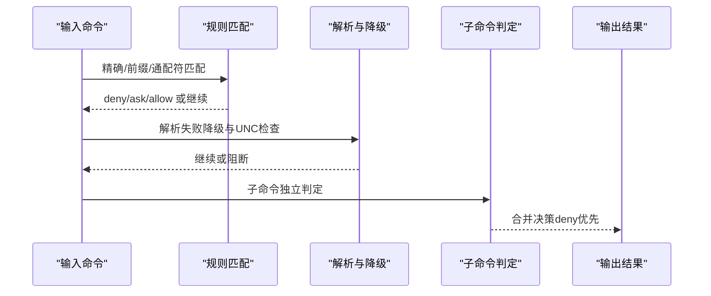

**图表来源**
- [powershellPermissions.ts:435-514](file://src/tools/PowerShellTool/powershellPermissions.ts#L435-L514)
- [powershellPermissions.ts:639-800](file://src/tools/PowerShellTool/powershellPermissions.ts#L639-L800)
- [powershellPermissions.ts:717-723](file://src/tools/PowerShellTool/powershellPermissions.ts#L717-L723)

**章节来源**
- [powershellPermissions.ts:1-120](file://src/tools/PowerShellTool/powershellPermissions.ts#L1-L120)
- [powershellPermissions.ts:435-514](file://src/tools/PowerShellTool/powershellPermissions.ts#L435-L514)
- [powershellPermissions.ts:639-800](file://src/tools/PowerShellTool/powershellPermissions.ts#L639-L800)

## 依赖关系分析
- 工具注册：通过 tools.ts 导出 PowerShellTool，按启用状态动态加载。
- 平台与沙箱：Windows 原生不支持沙箱，遵循企业策略强制拒绝；Linux/macOS/WSL2 使用沙箱包装。
- 与 BashTool 的一致性：路径验证、只读策略、权限模式等沿用 BashTool 的成熟模式，保持行为一致。

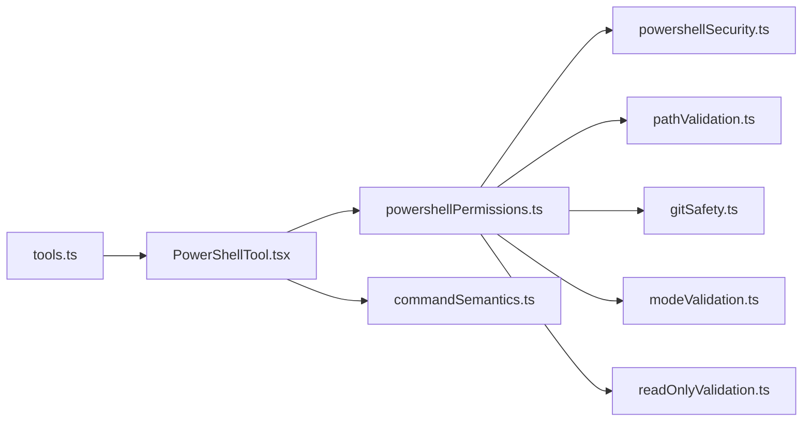

**图表来源**
- [tools.ts:143-183](file://src/tools.ts#L143-L183)
- [PowerShellTool.tsx:1-40](file://src/tools/PowerShellTool/PowerShellTool.tsx#L1-L40)
- [powershellPermissions.ts:1-60](file://src/tools/PowerShellTool/powershellPermissions.ts#L1-L60)

**章节来源**
- [tools.ts:143-183](file://src/tools.ts#L143-L183)
- [PowerShellTool.tsx:219-222](file://src/tools/PowerShellTool/PowerShellTool.tsx#L219-L222)

## 性能考虑
- 异步生成器与进度上报：通过异步生成器与定时器优化长命令的响应体验，避免阻塞主线程。
- 后台任务与任务通道：支持后台执行与任务注册，便于长时间运行命令的监控与通知。
- 大输出落盘与图像压缩：超过阈值时落盘并提供预览，减少内存占用；图像输出进行尺寸与维度压缩。
- 超时与预算控制：内置默认与最大超时，助手模式下有阻塞预算，避免长时间占用资源。

[本节为通用指导，无需具体文件分析]

## 故障排除指南
- PowerShell 不可用：返回 code=0 的优雅错误消息，避免抛出 ShellError。
- 解析失败：捕获执行异常，返回 code=0 的错误信息，提示命令未执行。
- 中断与超时：区分用户中断与超时/进程终止，仅用户中断抑制 ShellError。
- 大输出处理：若输出文件被提前清理，回退到 stdout 预览；必要时截断至最大持久化大小。
- 图像输出：解析失败时保留文本标签，UI 层面仍可正确显示。

**章节来源**
- [PowerShellTool.tsx:718-762](file://src/tools/PowerShellTool/PowerShellTool.tsx#L718-L762)
- [PowerShellTool.tsx:580-617](file://src/tools/PowerShellTool/PowerShellTool.tsx#L580-L617)
- [PowerShellTool.tsx:636-635](file://src/tools/PowerShellTool/PowerShellTool.tsx#L636-L635)

## 结论
PowerShellTool 通过严格的 AST 驱动安全检测、细粒度的路径验证与 Git 安全防护、灵活的权限模式与只读策略，以及完善的命令语义解释，构建了面向 Windows 与跨平台环境的安全执行框架。其与 BashTool 的一致性设计保证了用户体验与安全模型的一致性，适合在企业环境中用于受控的 PowerShell 命令执行与自动化。

[本节为总结，无需具体文件分析]

## 附录

### 使用示例与安全最佳实践
- 使用描述字段清晰说明命令目的，便于权限审核与审计。
- 避免使用动态命令名与编码参数，减少注入风险。
- 在 acceptEdits 模式下仅执行简单写入命令，避免复合命令中的目录变更与符号链接。
- 对外部命令的退出码进行语义化解读，避免误判为错误。
- 启用后台执行以提升交互体验，注意任务 ID 与输出路径管理。
- 避免在命令中直接打印敏感信息，使用安全输出命令并配合参数白名单。

[本节为通用指导，无需具体文件分析]