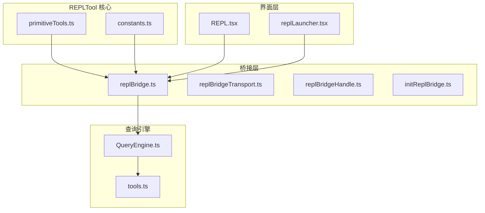
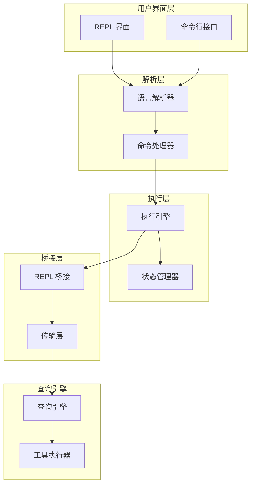
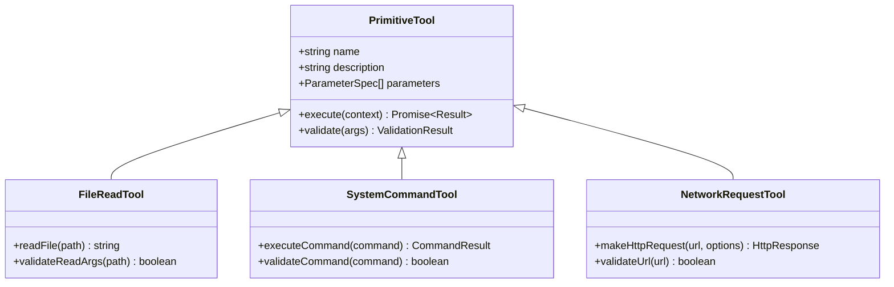
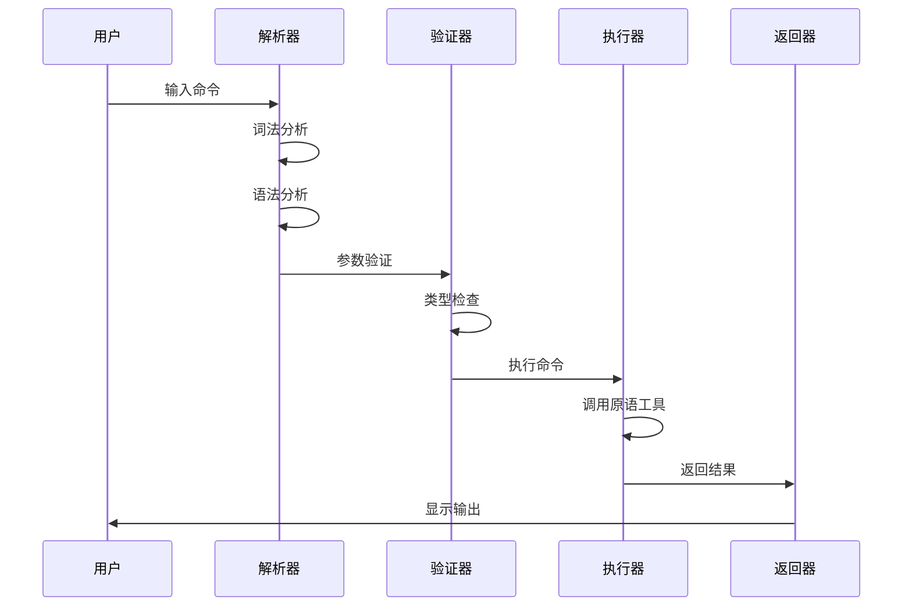
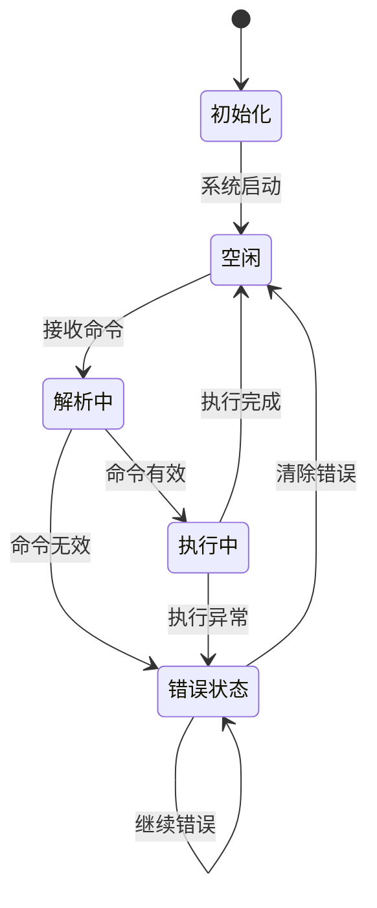
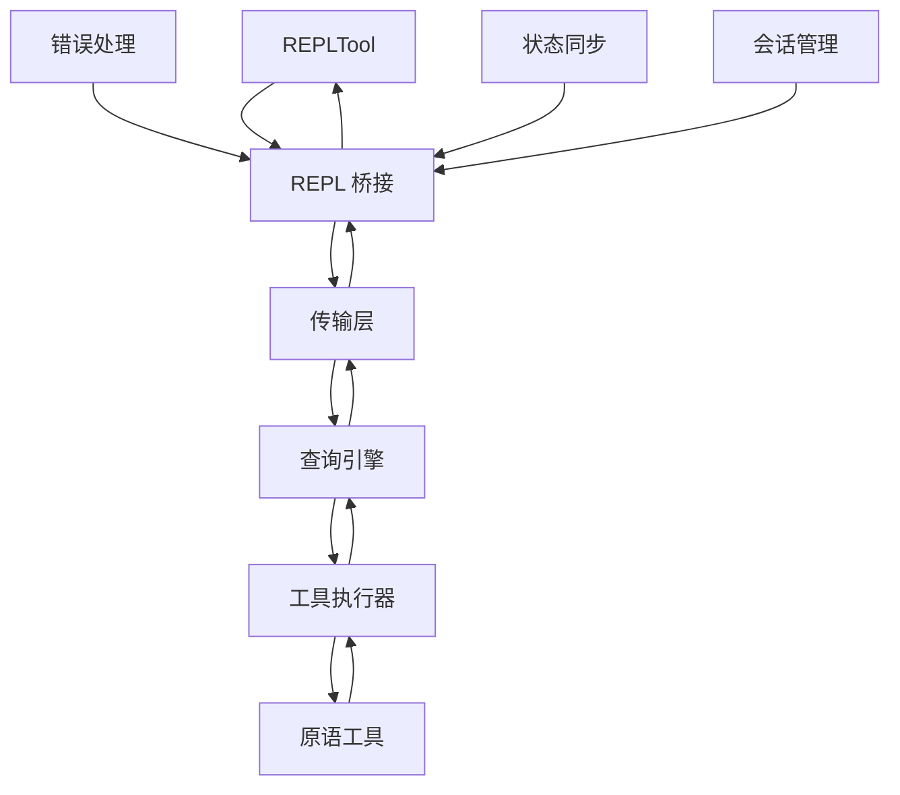
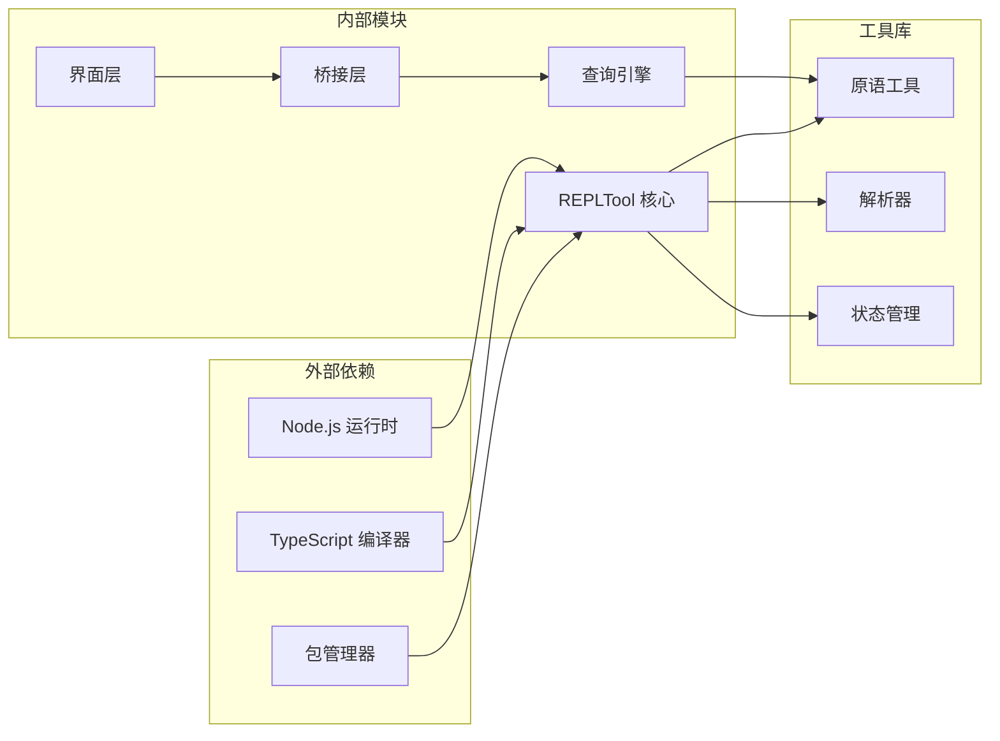

# REPLTool 实现

<cite>
**本文档引用的文件**
- [constants.ts](file://src/tools/REPLTool/constants.ts)
- [primitiveTools.ts](file://src/tools/REPLTool/primitiveTools.ts)
- [replBridge.ts](file://src/bridge/replBridge.ts)
- [replBridgeHandle.ts](file://src/bridge/replBridgeHandle.ts)
- [replBridgeTransport.ts](file://src/bridge/replBridgeTransport.ts)
- [initReplBridge.ts](file://src/bridge/initReplBridge.ts)
- [REPL.tsx](file://src/screens/REPL.tsx)
- [replLauncher.tsx](file://src/replLauncher.tsx)
- [QueryEngine.ts](file://src/QueryEngine.ts)
- [tools.ts](file://src/tools.ts)
</cite>

## 目录
1. [简介](#简介)
2. [项目结构](#项目结构)
3. [核心组件](#核心组件)
4. [架构概览](#架构概览)
5. [详细组件分析](#详细组件分析)
6. [依赖关系分析](#依赖关系分析)
7. [性能考虑](#性能考虑)
8. [故障排除指南](#故障排除指南)
9. [结论](#结论)

## 简介

REPLTool 是一个强大的交互式执行环境，为用户提供了一个可编程的命令行界面，支持多种原语操作和实时反馈。该工具集成了先进的命令解析机制、状态管理和错误处理系统，并与主查询引擎无缝集成。

REPLTool 的设计目标是提供一个灵活、可扩展的交互式编程平台，支持用户通过自然语言或命令行接口进行各种操作。它包含了完整的原语工具集合、智能命令解析器和健壮的状态管理系统。

## 项目结构

REPLTool 的实现分布在多个关键目录中：

**图表来源**
- [primitiveTools.ts](file://src/tools/REPLTool/primitiveTools.ts)
- [constants.ts](file://src/tools/REPLTool/constants.ts)
- [replBridge.ts](file://src/bridge/replBridge.ts)
- [REPL.tsx](file://src/screens/REPL.tsx)

**章节来源**
- [primitiveTools.ts](file://src/tools/REPLTool/primitiveTools.ts)
- [constants.ts](file://src/tools/REPLTool/constants.ts)
- [replBridge.ts](file://src/bridge/replBridge.ts)

## 核心组件

### 原语工具集合

REPLTool 的原语工具集合提供了基础的操作能力，包括：

- **文件操作原语**：支持文件读取、写入、删除等基本文件操作
- **系统命令原语**：提供系统级命令执行能力
- **数据转换原语**：支持 JSON、XML、CSV 等格式的数据转换
- **网络请求原语**：封装 HTTP 请求和响应处理
- **进程管理原语**：提供进程启动、监控和控制功能

### 命令解析机制

命令解析器采用多阶段解析策略：

1. **词法分析**：将输入字符串分解为标记(token)
2. **语法分析**：构建抽象语法树(AST)
3. **语义分析**：验证命令的有效性和参数完整性
4. **执行调度**：根据解析结果调用相应的原语工具

### 状态管理系统

状态管理器负责维护 REPLTool 的运行时状态：

- **会话状态**：跟踪当前用户的会话信息
- **执行状态**：记录命令执行的历史和结果
- **配置状态**：保存用户偏好设置和全局配置
- **错误状态**：捕获和报告执行过程中的异常

**章节来源**
- [primitiveTools.ts](file://src/tools/REPLTool/primitiveTools.ts)
- [constants.ts](file://src/tools/REPLTool/constants.ts)

## 架构概览

REPLTool 采用了分层架构设计，确保了模块间的松耦合和高内聚：

**图表来源**
- [replBridge.ts](file://src/bridge/replBridge.ts)
- [replBridgeTransport.ts](file://src/bridge/replBridgeTransport.ts)
- [QueryEngine.ts](file://src/QueryEngine.ts)

## 详细组件分析

### 原语工具实现

原语工具是 REPLTool 的核心执行单元，每个工具都实现了统一的接口规范：

**图表来源**
- [primitiveTools.ts](file://src/tools/REPLTool/primitiveTools.ts)

### 命令解析流程

命令解析采用递归下降解析算法：

**图表来源**
- [primitiveTools.ts](file://src/tools/REPLTool/primitiveTools.ts)
- [replBridge.ts](file://src/bridge/replBridge.ts)

### 状态管理机制

状态管理器采用观察者模式实现：

**图表来源**
- [replBridge.ts](file://src/bridge/replBridge.ts)

**章节来源**
- [primitiveTools.ts](file://src/tools/REPLTool/primitiveTools.ts)
- [replBridge.ts](file://src/bridge/replBridge.ts)

### 桥接通信机制

REPLTool 通过桥接层与外部系统通信：

**图表来源**
- [replBridge.ts](file://src/bridge/replBridge.ts)
- [replBridgeTransport.ts](file://src/bridge/replBridgeTransport.ts)
- [replBridgeHandle.ts](file://src/bridge/replBridgeHandle.ts)

**章节来源**
- [replBridge.ts](file://src/bridge/replBridge.ts)
- [replBridgeTransport.ts](file://src/bridge/replBridgeTransport.ts)
- [replBridgeHandle.ts](file://src/bridge/replBridgeHandle.ts)

## 依赖关系分析

REPLTool 的依赖关系体现了清晰的分层架构：

**图表来源**
- [primitiveTools.ts](file://src/tools/REPLTool/primitiveTools.ts)
- [replBridge.ts](file://src/bridge/replBridge.ts)
- [QueryEngine.ts](file://src/QueryEngine.ts)

**章节来源**
- [primitiveTools.ts](file://src/tools/REPLTool/primitiveTools.ts)
- [replBridge.ts](file://src/bridge/replBridge.ts)
- [QueryEngine.ts](file://src/QueryEngine.ts)

## 性能考虑

REPLTool 在设计时充分考虑了性能优化：

### 内存管理
- 使用对象池减少垃圾回收压力
- 实现缓存机制避免重复计算
- 采用流式处理大文件内容

### 并发处理
- 支持异步命令执行
- 实现命令队列管理
- 提供超时控制机制

### 资源优化
- 最小化依赖包大小
- 实现按需加载机制
- 优化网络请求频率

## 故障排除指南

### 常见问题及解决方案

**命令执行失败**
- 检查命令语法是否正确
- 验证参数类型和范围
- 查看错误日志获取详细信息

**连接问题**
- 确认网络连接状态
- 检查防火墙设置
- 验证服务器可达性

**内存不足**
- 清理不必要的会话
- 优化大文件处理
- 调整缓存大小

### 调试技巧

1. **启用调试模式**：在启动时添加调试标志
2. **查看日志文件**：分析详细的执行日志
3. **使用断点调试**：在关键位置设置断点
4. **监控资源使用**：定期检查内存和CPU使用情况

**章节来源**
- [replBridge.ts](file://src/bridge/replBridge.ts)
- [replBridgeHandle.ts](file://src/bridge/replBridgeHandle.ts)

## 结论

REPLTool 作为一个高度集成的交互式执行环境，展现了现代软件架构的最佳实践。其设计特点包括：

- **模块化设计**：清晰的分层架构确保了系统的可维护性
- **可扩展性**：原语工具系统支持自定义扩展
- **可靠性**：完善的错误处理和状态管理机制
- **性能优化**：针对大规模应用进行了专门优化

通过本文档的技术分析，开发者可以更好地理解和使用 REPLTool，同时为未来的功能扩展和性能优化提供指导。