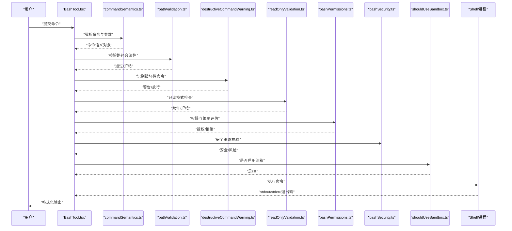
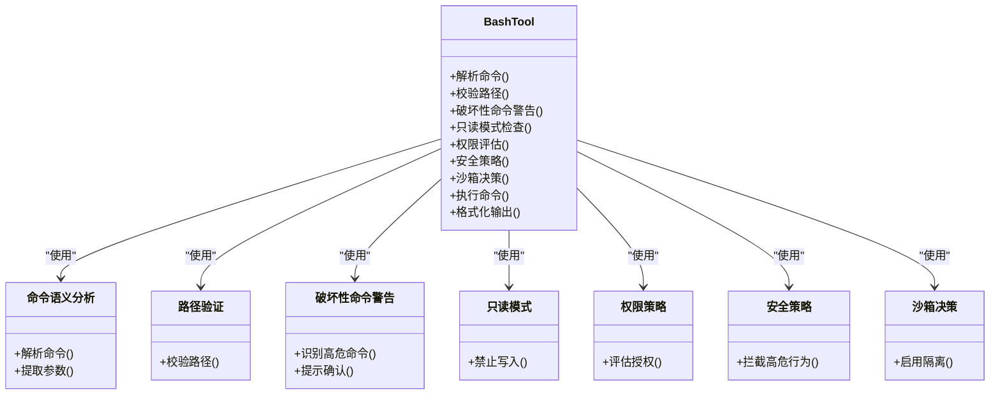
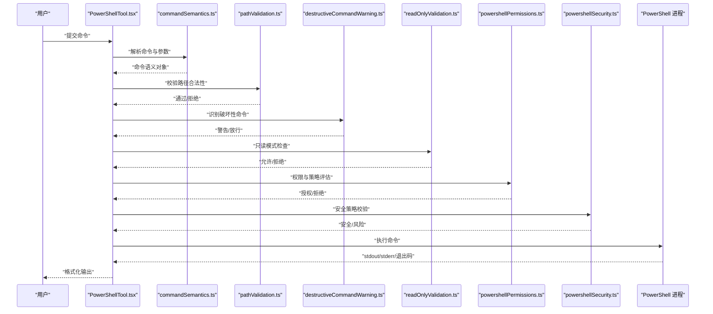
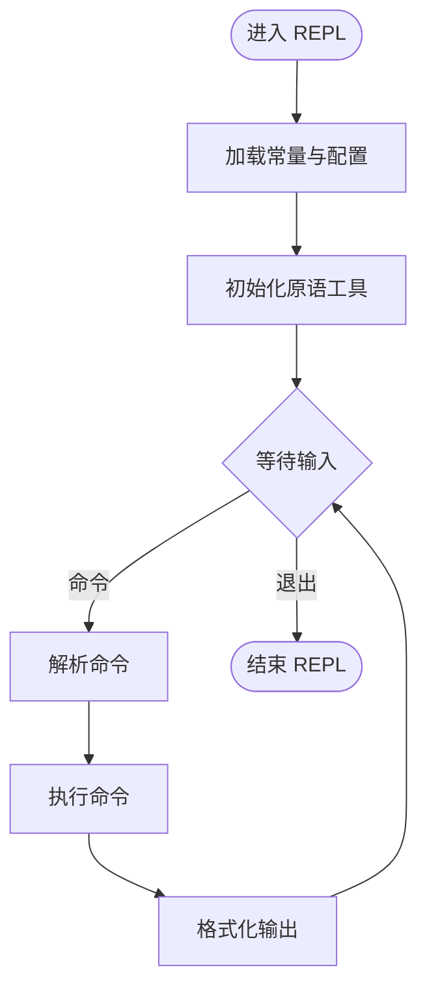
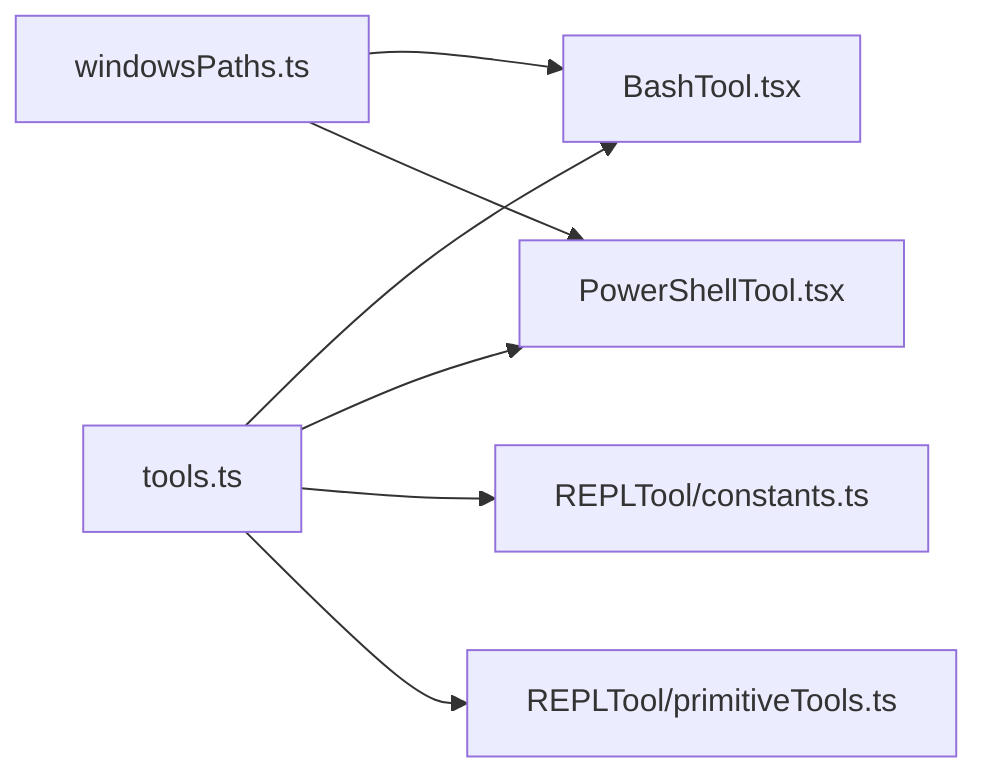

# Shell 工具

<cite>
**本文引用的文件**
- [src/tools/BashTool/BashTool.tsx](file://src/tools/BashTool/BashTool.tsx)
- [src/tools/BashTool/bashCommandHelpers.ts](file://src/tools/BashTool/bashCommandHelpers.ts)
- [src/tools/BashTool/bashPermissions.ts](file://src/tools/BashTool/bashPermissions.ts)
- [src/tools/BashTool/bashSecurity.ts](file://src/tools/BashTool/bashSecurity.ts)
- [src/tools/BashTool/commandSemantics.ts](file://src/tools/BashTool/commandSemantics.ts)
- [src/tools/BashTool/destructiveCommandWarning.ts](file://src/tools/BashTool/destructiveCommandWarning.ts)
- [src/tools/BashTool/modeValidation.ts](file://src/tools/BashTool/modeValidation.ts)
- [src/tools/BashTool/pathValidation.ts](file://src/tools/BashTool/pathValidation.ts)
- [src/tools/BashTool/readOnlyValidation.ts](file://src/tools/BashTool/readOnlyValidation.ts)
- [src/tools/BashTool/shouldUseSandbox.ts](file://src/tools/BashTool/shouldUseSandbox.ts)
- [src/tools/BashTool/toolName.ts](file://src/tools/BashTool/toolName.ts)
- [src/tools/BashTool/utils.ts](file://src/tools/BashTool/utils.ts)
- [src/tools/PowerShellTool/PowerShellTool.tsx](file://src/tools/PowerShellTool/PowerShellTool.tsx)
- [src/tools/PowerShellTool/commandSemantics.ts](file://src/tools/PowerShellTool/commandSemantics.ts)
- [src/tools/PowerShellTool/destructiveCommandWarning.ts](file://src/tools/PowerShellTool/destructiveCommandWarning.ts)
- [src/tools/PowerShellTool/modeValidation.ts](file://src/tools/PowerShellTool/modeValidation.ts)
- [src/tools/PowerShellTool/pathValidation.ts](file://src/tools/PowerShellTool/pathValidation.ts)
- [src/tools/PowerShellTool/powershellPermissions.ts](file://src/tools/PowerShellTool/powershellPermissions.ts)
- [src/tools/PowerShellTool/powershellSecurity.ts](file://src/tools/PowerShellTool/powershellSecurity.ts)
- [src/tools/PowerShellTool/readOnlyValidation.ts](file://src/tools/PowerShellTool/readOnlyValidation.ts)
- [src/tools/PowerShellTool/toolName.ts](file://src/tools/PowerShellTool/toolName.ts)
- [src/tools/REPLTool/constants.ts](file://src/tools/REPLTool/constants.ts)
- [src/tools/REPLTool/primitiveTools.ts](file://src/tools/REPLTool/primitiveTools.ts)
- [src/utils/windowsPaths.ts](file://src/utils/windowsPaths.ts)
- [src/tools.ts](file://src/tools.ts)
</cite>

## 目录
1. [简介](#简介)
2. [项目结构](#项目结构)
3. [核心组件](#核心组件)
4. [架构总览](#架构总览)
5. [详细组件分析](#详细组件分析)
6. [依赖关系分析](#依赖关系分析)
7. [性能考量](#性能考量)
8. [故障排查指南](#故障排查指南)
9. [结论](#结论)
10. [附录](#附录)

## 简介
本文件为 Shell 工具的综合技术文档，聚焦于 BashTool、PowerShellTool 与 REPLTool 的实现与使用。内容涵盖命令解析、权限验证、安全防护、输出处理、命令语义分析、路径验证、破坏性命令警告、只读模式验证、交互式执行环境与原语工具集合，并结合沙箱机制与跨平台兼容性进行说明。文档同时提供使用示例与最佳实践建议，帮助开发者与使用者在保证安全的前提下高效使用 Shell 工具。

## 项目结构
Shell 工具相关代码主要位于以下目录与文件中：
- BashTool：Bash 命令执行工具及其配套模块（命令解析、权限、安全、路径、只读、沙箱、工具名、通用工具等）
- PowerShellTool：PowerShell 命令执行工具及其配套模块（命令解析、权限、安全、路径、只读、破坏性命令警告等）
- REPLTool：交互式执行环境与原语工具集合
- 工具入口与加载：tools.ts 中对工具的动态加载与默认预设管理
- 跨平台支持：windowsPaths.ts 中针对 Windows 的 Shell 设置与 Git-Bash 路径处理

```mermaid
graph TB
subgraph "工具入口"
ToolsTS["tools.ts<br/>工具加载与预设"]
end
subgraph "Bash 工具"
BashTool["BashTool.tsx"]
BashCmd["bashCommandHelpers.ts"]
BashPerm["bashPermissions.ts"]
BashSec["bashSecurity.ts"]
BashSem["commandSemantics.ts"]
BashWarn["destructiveCommandWarning.ts"]
BashMode["modeValidation.ts"]
BashPath["pathValidation.ts"]
BashRO["readOnlyValidation.ts"]
BashSand["shouldUseSandbox.ts"]
BashName["toolName.ts"]
BashUtil["utils.ts"]
end
subgraph "PowerShell 工具"
PwshTool["PowerShellTool.tsx"]
PwshSem["commandSemantics.ts"]
PwshWarn["destructiveCommandWarning.ts"]
PwshMode["modeValidation.ts"]
PwshPath["pathValidation.ts"]
PwshPerm["powershellPermissions.ts"]
PwshSec["powershellSecurity.ts"]
PwshRO["readOnlyValidation.ts"]
PwshName["toolName.ts"]
end
subgraph "REPL 工具"
REPLConst["constants.ts"]
REPLPrim["primitiveTools.ts"]
end
subgraph "跨平台支持"
WinPaths["windowsPaths.ts"]
end
ToolsTS --> BashTool
ToolsTS --> PwshTool
ToolsTS --> REPLConst
ToolsTS --> REPLPrim
BashTool --> BashCmd
BashTool --> BashPerm
BashTool --> BashSec
BashTool --> BashSem
BashTool --> BashWarn
BashTool --> BashMode
BashTool --> BashPath
BashTool --> BashRO
BashTool --> BashSand
BashTool --> BashName
BashTool --> BashUtil
PwshTool --> PwshSem
PwshTool --> PwshWarn
PwshTool --> PwshMode
PwshTool --> PwshPath
PwshTool --> PwshPerm
PwshTool --> PwshSec
PwshTool --> PwshRO
PwshTool --> PwshName
WinPaths -.-> BashTool
WinPaths -.-> PwshTool
```

图表来源
- [src/tools.ts](file://src/tools.ts)
- [src/tools/BashTool/BashTool.tsx](file://src/tools/BashTool/BashTool.tsx)
- [src/tools/BashTool/bashCommandHelpers.ts](file://src/tools/BashTool/bashCommandHelpers.ts)
- [src/tools/BashTool/bashPermissions.ts](file://src/tools/BashTool/bashPermissions.ts)
- [src/tools/BashTool/bashSecurity.ts](file://src/tools/BashTool/bashSecurity.ts)
- [src/tools/BashTool/commandSemantics.ts](file://src/tools/BashTool/commandSemantics.ts)
- [src/tools/BashTool/destructiveCommandWarning.ts](file://src/tools/BashTool/destructiveCommandWarning.ts)
- [src/tools/BashTool/modeValidation.ts](file://src/tools/BashTool/modeValidation.ts)
- [src/tools/BashTool/pathValidation.ts](file://src/tools/BashTool/pathValidation.ts)
- [src/tools/BashTool/readOnlyValidation.ts](file://src/tools/BashTool/readOnlyValidation.ts)
- [src/tools/BashTool/shouldUseSandbox.ts](file://src/tools/BashTool/shouldUseSandbox.ts)
- [src/tools/BashTool/toolName.ts](file://src/tools/BashTool/toolName.ts)
- [src/tools/BashTool/utils.ts](file://src/tools/BashTool/utils.ts)
- [src/tools/PowerShellTool/PowerShellTool.tsx](file://src/tools/PowerShellTool/PowerShellTool.tsx)
- [src/tools/PowerShellTool/commandSemantics.ts](file://src/tools/PowerShellTool/commandSemantics.ts)
- [src/tools/PowerShellTool/destructiveCommandWarning.ts](file://src/tools/PowerShellTool/destructiveCommandWarning.ts)
- [src/tools/PowerShellTool/modeValidation.ts](file://src/tools/PowerShellTool/modeValidation.ts)
- [src/tools/PowerShellTool/pathValidation.ts](file://src/tools/PowerShellTool/pathValidation.ts)
- [src/tools/PowerShellTool/powershellPermissions.ts](file://src/tools/PowerShellTool/powershellPermissions.ts)
- [src/tools/PowerShellTool/powershellSecurity.ts](file://src/tools/PowerShellTool/powershellSecurity.ts)
- [src/tools/PowerShellTool/readOnlyValidation.ts](file://src/tools/PowerShellTool/readOnlyValidation.ts)
- [src/tools/PowerShellTool/toolName.ts](file://src/tools/PowerShellTool/toolName.ts)
- [src/tools/REPLTool/constants.ts](file://src/tools/REPLTool/constants.ts)
- [src/tools/REPLTool/primitiveTools.ts](file://src/tools/REPLTool/primitiveTools.ts)
- [src/utils/windowsPaths.ts](file://src/utils/windowsPaths.ts)

章节来源
- [src/tools.ts](file://src/tools.ts)
- [src/utils/windowsPaths.ts](file://src/utils/windowsPaths.ts)

## 核心组件
- BashTool：负责在 Bash 环境下解析与执行命令，包含命令语义分析、路径与破坏性命令校验、只读模式限制、权限与安全策略、沙箱启用判断以及输出处理等模块化能力。
- PowerShellTool：负责在 PowerShell 环境下解析与执行命令，包含命令语义分析、路径与破坏性命令校验、只读模式限制、权限与安全策略等。
- REPLTool：提供交互式执行环境与一组原语工具，支持在受限或隔离环境中进行命令式操作与探索。

章节来源
- [src/tools/BashTool/BashTool.tsx](file://src/tools/BashTool/BashTool.tsx)
- [src/tools/PowerShellTool/PowerShellTool.tsx](file://src/tools/PowerShellTool/PowerShellTool.tsx)
- [src/tools/REPLTool/constants.ts](file://src/tools/REPLTool/constants.ts)
- [src/tools/REPLTool/primitiveTools.ts](file://src/tools/REPLTool/primitiveTools.ts)

## 架构总览
BashTool 与 PowerShellTool 在架构上遵循统一的安全与执行框架：
- 输入层：接收用户命令字符串，进行语义分析与参数提取
- 安全校验层：路径合法性、破坏性命令检测、只读模式校验、权限与沙箱策略
- 执行层：调用系统 Shell 或 PowerShell 进行命令执行，捕获并格式化输出
- 输出层：将结果以消息形式返回给上层 UI 或调用方

图表来源
- [src/tools/BashTool/BashTool.tsx](file://src/tools/BashTool/BashTool.tsx)
- [src/tools/BashTool/commandSemantics.ts](file://src/tools/BashTool/commandSemantics.ts)
- [src/tools/BashTool/pathValidation.ts](file://src/tools/BashTool/pathValidation.ts)
- [src/tools/BashTool/destructiveCommandWarning.ts](file://src/tools/BashTool/destructiveCommandWarning.ts)
- [src/tools/BashTool/readOnlyValidation.ts](file://src/tools/BashTool/readOnlyValidation.ts)
- [src/tools/BashTool/bashPermissions.ts](file://src/tools/BashTool/bashPermissions.ts)
- [src/tools/BashTool/bashSecurity.ts](file://src/tools/BashTool/bashSecurity.ts)
- [src/tools/BashTool/shouldUseSandbox.ts](file://src/tools/BashTool/shouldUseSandbox.ts)

## 详细组件分析

### BashTool 组件分析
BashTool 是 Bash 命令执行的核心实现，围绕“解析—校验—执行—输出”的流程组织模块化能力。

- 命令解析与语义分析
  - 使用命令语义模块对输入进行解析，提取命令名称、参数与选项，形成可执行的语义对象，便于后续校验与执行。
  - 参考路径：[commandSemantics.ts](file://src/tools/BashTool/commandSemantics.ts)

- 权限与安全策略
  - 权限模块负责根据策略与上下文决定是否允许执行；安全模块对潜在高危行为进行拦截或提示。
  - 参考路径：[bashPermissions.ts](file://src/tools/BashTool/bashPermissions.ts)、[bashSecurity.ts](file://src/tools/BashTool/bashSecurity.ts)

- 路径与破坏性命令校验
  - 路径验证确保命令作用范围在允许范围内；破坏性命令警告模块对 rm、dd、mkfs 等高危命令进行前置提示。
  - 参考路径：[pathValidation.ts](file://src/tools/BashTool/pathValidation.ts)、[destructiveCommandWarning.ts](file://src/tools/BashTool/destructiveCommandWarning.ts)

- 只读模式与沙箱启用
  - 只读模式验证阻止写入类操作；沙箱启用模块根据配置与上下文决定是否启用隔离执行。
  - 参考路径：[readOnlyValidation.ts](file://src/tools/BashTool/readOnlyValidation.ts)、[shouldUseSandbox.ts](file://src/tools/BashTool/shouldUseSandbox.ts)

- 工具名与通用工具
  - 工具名模块用于标识工具；通用工具模块提供辅助函数（如编码、转义、日志等）。
  - 参考路径：[toolName.ts](file://src/tools/BashTool/toolName.ts)、[utils.ts](file://src/tools/BashTool/utils.ts)

- Bash 命令辅助
  - 提供 Bash 特定的命令处理逻辑（如管道、重定向、变量扩展等），并与主流程协同工作。
  - 参考路径：[bashCommandHelpers.ts](file://src/tools/BashTool/bashCommandHelpers.ts)

图表来源
- [src/tools/BashTool/BashTool.tsx](file://src/tools/BashTool/BashTool.tsx)
- [src/tools/BashTool/commandSemantics.ts](file://src/tools/BashTool/commandSemantics.ts)
- [src/tools/BashTool/pathValidation.ts](file://src/tools/BashTool/pathValidation.ts)
- [src/tools/BashTool/destructiveCommandWarning.ts](file://src/tools/BashTool/destructiveCommandWarning.ts)
- [src/tools/BashTool/readOnlyValidation.ts](file://src/tools/BashTool/readOnlyValidation.ts)
- [src/tools/BashTool/bashPermissions.ts](file://src/tools/BashTool/bashPermissions.ts)
- [src/tools/BashTool/bashSecurity.ts](file://src/tools/BashTool/bashSecurity.ts)
- [src/tools/BashTool/shouldUseSandbox.ts](file://src/tools/BashTool/shouldUseSandbox.ts)

章节来源
- [src/tools/BashTool/BashTool.tsx](file://src/tools/BashTool/BashTool.tsx)
- [src/tools/BashTool/commandSemantics.ts](file://src/tools/BashTool/commandSemantics.ts)
- [src/tools/BashTool/pathValidation.ts](file://src/tools/BashTool/pathValidation.ts)
- [src/tools/BashTool/destructiveCommandWarning.ts](file://src/tools/BashTool/destructiveCommandWarning.ts)
- [src/tools/BashTool/readOnlyValidation.ts](file://src/tools/BashTool/readOnlyValidation.ts)
- [src/tools/BashTool/bashPermissions.ts](file://src/tools/BashTool/bashPermissions.ts)
- [src/tools/BashTool/bashSecurity.ts](file://src/tools/BashTool/bashSecurity.ts)
- [src/tools/BashTool/shouldUseSandbox.ts](file://src/tools/BashTool/shouldUseSandbox.ts)
- [src/tools/BashTool/toolName.ts](file://src/tools/BashTool/toolName.ts)
- [src/tools/BashTool/utils.ts](file://src/tools/BashTool/utils.ts)
- [src/tools/BashTool/bashCommandHelpers.ts](file://src/tools/BashTool/bashCommandHelpers.ts)

### PowerShellTool 组件分析
PowerShellTool 在 PowerShell 环境下的实现与 BashTool 类似，但针对 PowerShell 的语法与生态做了适配。

- 命令解析与语义分析
  - 针对 PowerShell 的 cmdlet、脚本块、参数传递等进行解析，生成可执行语义对象。
  - 参考路径：[src/tools/PowerShellTool/commandSemantics.ts](file://src/tools/PowerShellTool/commandSemantics.ts)

- 路径与破坏性命令校验
  - 同样提供路径合法性与破坏性命令警告，覆盖 PowerShell 生态中的高危操作。
  - 参考路径：[src/tools/PowerShellTool/pathValidation.ts](file://src/tools/PowerShellTool/pathValidation.ts)、[src/tools/PowerShellTool/destructiveCommandWarning.ts](file://src/tools/PowerShellTool/destructiveCommandWarning.ts)

- 只读模式与权限安全
  - 只读模式与权限策略模块确保在受限环境下不执行写入或高危操作；安全模块拦截潜在风险。
  - 参考路径：[src/tools/PowerShellTool/readOnlyValidation.ts](file://src/tools/PowerShellTool/readOnlyValidation.ts)、[src/tools/PowerShellTool/powershellPermissions.ts](file://src/tools/PowerShellTool/powershellPermissions.ts)、[src/tools/PowerShellTool/powershellSecurity.ts](file://src/tools/PowerShellTool/powershellSecurity.ts)

- 工具名与 UI
  - 工具名模块用于标识工具；UI 模块负责与前端交互展示。
  - 参考路径：[src/tools/PowerShellTool/toolName.ts](file://src/tools/PowerShellTool/toolName.ts)

图表来源
- [src/tools/PowerShellTool/PowerShellTool.tsx](file://src/tools/PowerShellTool/PowerShellTool.tsx)
- [src/tools/PowerShellTool/commandSemantics.ts](file://src/tools/PowerShellTool/commandSemantics.ts)
- [src/tools/PowerShellTool/pathValidation.ts](file://src/tools/PowerShellTool/pathValidation.ts)
- [src/tools/PowerShellTool/destructiveCommandWarning.ts](file://src/tools/PowerShellTool/destructiveCommandWarning.ts)
- [src/tools/PowerShellTool/readOnlyValidation.ts](file://src/tools/PowerShellTool/readOnlyValidation.ts)
- [src/tools/PowerShellTool/powershellPermissions.ts](file://src/tools/PowerShellTool/powershellPermissions.ts)
- [src/tools/PowerShellTool/powershellSecurity.ts](file://src/tools/PowerShellTool/powershellSecurity.ts)

章节来源
- [src/tools/PowerShellTool/PowerShellTool.tsx](file://src/tools/PowerShellTool/PowerShellTool.tsx)
- [src/tools/PowerShellTool/commandSemantics.ts](file://src/tools/PowerShellTool/commandSemantics.ts)
- [src/tools/PowerShellTool/pathValidation.ts](file://src/tools/PowerShellTool/pathValidation.ts)
- [src/tools/PowerShellTool/destructiveCommandWarning.ts](file://src/tools/PowerShellTool/destructiveCommandWarning.ts)
- [src/tools/PowerShellTool/readOnlyValidation.ts](file://src/tools/PowerShellTool/readOnlyValidation.ts)
- [src/tools/PowerShellTool/powershellPermissions.ts](file://src/tools/PowerShellTool/powershellPermissions.ts)
- [src/tools/PowerShellTool/powershellSecurity.ts](file://src/tools/PowerShellTool/powershellSecurity.ts)
- [src/tools/PowerShellTool/toolName.ts](file://src/tools/PowerShellTool/toolName.ts)

### REPLTool 组件分析
REPLTool 提供交互式执行环境与一组原语工具，支持在受限或隔离场景下进行命令式探索与执行。

- 交互式执行环境
  - 通过常量与状态管理控制 REPL 的启用与运行模式，提供稳定的交互体验。
  - 参考路径：[src/tools/REPLTool/constants.ts](file://src/tools/REPLTool/constants.ts)

- 原语工具集合
  - 原语工具用于支撑基础能力（如文件读写、路径导航、命令拼装等），在 REPL 中作为底层能力被调用。
  - 参考路径：[src/tools/REPLTool/primitiveTools.ts](file://src/tools/REPLTool/primitiveTools.ts)

图表来源
- [src/tools/REPLTool/constants.ts](file://src/tools/REPLTool/constants.ts)
- [src/tools/REPLTool/primitiveTools.ts](file://src/tools/REPLTool/primitiveTools.ts)

章节来源
- [src/tools/REPLTool/constants.ts](file://src/tools/REPLTool/constants.ts)
- [src/tools/REPLTool/primitiveTools.ts](file://src/tools/REPLTool/primitiveTools.ts)

## 依赖关系分析
- 工具入口与加载
  - 工具入口文件负责按需加载 BashTool、PowerShellTool 与 REPLTool，并提供默认预设与工具列表过滤逻辑。
  - 参考路径：[src/tools.ts](file://src/tools.ts)

- 跨平台兼容性
  - Windows 平台通过设置 SHELL 环境变量与定位 Git-Bash 路径，确保 BashTool 与通用 Shell 行为一致。
  - 参考路径：[src/utils/windowsPaths.ts](file://src/utils/windowsPaths.ts)

图表来源
- [src/tools.ts](file://src/tools.ts)
- [src/utils/windowsPaths.ts](file://src/utils/windowsPaths.ts)

章节来源
- [src/tools.ts](file://src/tools.ts)
- [src/utils/windowsPaths.ts](file://src/utils/windowsPaths.ts)

## 性能考量
- 延迟与吞吐
  - 命令解析与安全校验应尽量轻量化，避免阻塞主线程；对高耗时命令建议采用异步执行与进度反馈。
- I/O 优化
  - 输出流处理应分片读取与增量渲染，减少一次性大块数据造成的卡顿。
- 沙箱与隔离
  - 沙箱启用会带来额外开销，应在必要时开启；可通过缓存策略降低重复启动成本。
- 跨平台差异
  - Windows 下通过 Git-Bash 间接调用 Bash，注意进程启动与路径转换的性能影响。

## 故障排查指南
- 命令被拒绝执行
  - 检查路径是否越权、是否命中破坏性命令、是否处于只读模式、权限是否不足、安全策略是否触发。
  - 参考模块：[pathValidation.ts](file://src/tools/BashTool/pathValidation.ts)、[destructiveCommandWarning.ts](file://src/tools/BashTool/destructiveCommandWarning.ts)、[readOnlyValidation.ts](file://src/tools/BashTool/readOnlyValidation.ts)、[bashPermissions.ts](file://src/tools/BashTool/bashPermissions.ts)、[bashSecurity.ts](file://src/tools/BashTool/bashSecurity.ts)
- PowerShell 命令失败
  - 检查参数与语法、权限与策略、只读限制与安全拦截。
  - 参考模块：[src/tools/PowerShellTool/commandSemantics.ts](file://src/tools/PowerShellTool/commandSemantics.ts)、[src/tools/PowerShellTool/powershellPermissions.ts](file://src/tools/PowerShellTool/powershellPermissions.ts)、[src/tools/PowerShellTool/powershellSecurity.ts](file://src/tools/PowerShellTool/powershellSecurity.ts)
- Windows 环境下 Bash 不可用
  - 检查 SHELL 环境变量与 Git-Bash 路径定位逻辑，确认可执行文件存在且可访问。
  - 参考模块：[src/utils/windowsPaths.ts](file://src/utils/windowsPaths.ts)

章节来源
- [src/tools/BashTool/pathValidation.ts](file://src/tools/BashTool/pathValidation.ts)
- [src/tools/BashTool/destructiveCommandWarning.ts](file://src/tools/BashTool/destructiveCommandWarning.ts)
- [src/tools/BashTool/readOnlyValidation.ts](file://src/tools/BashTool/readOnlyValidation.ts)
- [src/tools/BashTool/bashPermissions.ts](file://src/tools/BashTool/bashPermissions.ts)
- [src/tools/BashTool/bashSecurity.ts](file://src/tools/BashTool/bashSecurity.ts)
- [src/tools/PowerShellTool/commandSemantics.ts](file://src/tools/PowerShellTool/commandSemantics.ts)
- [src/tools/PowerShellTool/powershellPermissions.ts](file://src/tools/PowerShellTool/powershellPermissions.ts)
- [src/tools/PowerShellTool/powershellSecurity.ts](file://src/tools/PowerShellTool/powershellSecurity.ts)
- [src/utils/windowsPaths.ts](file://src/utils/windowsPaths.ts)

## 结论
BashTool、PowerShellTool 与 REPLTool 共同构成了一个安全、可控、可扩展的 Shell 执行体系。通过模块化的命令解析、严格的路径与破坏性命令校验、只读模式与权限策略、安全拦截与沙箱启用，以及跨平台兼容处理，能够在保障安全的前提下提供高效的命令执行体验。REPLTool 则进一步增强了交互式探索与原语能力，适用于调试、诊断与快速验证场景。

## 附录
- 使用示例与最佳实践
  - 示例一：在 BashTool 中执行 ls -la 并查看输出
    - 步骤：准备命令字符串 → 语义解析 → 路径与破坏性命令校验 → 只读模式检查 → 权限与安全策略评估 → 沙箱决策 → 执行并格式化输出
    - 参考模块：[src/tools/BashTool/BashTool.tsx](file://src/tools/BashTool/BashTool.tsx)、[src/tools/BashTool/commandSemantics.ts](file://src/tools/BashTool/commandSemantics.ts)、[src/tools/BashTool/pathValidation.ts](file://src/tools/BashTool/pathValidation.ts)、[src/tools/BashTool/destructiveCommandWarning.ts](file://src/tools/BashTool/destructiveCommandWarning.ts)、[src/tools/BashTool/readOnlyValidation.ts](file://src/tools/BashTool/readOnlyValidation.ts)、[src/tools/BashTool/bashPermissions.ts](file://src/tools/BashTool/bashPermissions.ts)、[src/tools/BashTool/bashSecurity.ts](file://src/tools/BashTool/bashSecurity.ts)、[src/tools/BashTool/shouldUseSandbox.ts](file://src/tools/BashTool/shouldUseSandbox.ts)
  - 示例二：在 PowerShellTool 中执行 Get-ChildItem 并查看输出
    - 步骤：准备命令字符串 → 语义解析 → 路径与破坏性命令校验 → 只读模式检查 → 权限与安全策略评估 → 执行并格式化输出
    - 参考模块：[src/tools/PowerShellTool/PowerShellTool.tsx](file://src/tools/PowerShellTool/PowerShellTool.tsx)、[src/tools/PowerShellTool/commandSemantics.ts](file://src/tools/PowerShellTool/commandSemantics.ts)、[src/tools/PowerShellTool/pathValidation.ts](file://src/tools/PowerShellTool/pathValidation.ts)、[src/tools/PowerShellTool/destructiveCommandWarning.ts](file://src/tools/PowerShellTool/destructiveCommandWarning.ts)、[src/tools/PowerShellTool/readOnlyValidation.ts](file://src/tools/PowerShellTool/readOnlyValidation.ts)、[src/tools/PowerShellTool/powershellPermissions.ts](file://src/tools/PowerShellTool/powershellPermissions.ts)、[src/tools/PowerShellTool/powershellSecurity.ts](file://src/tools/PowerShellTool/powershellSecurity.ts)
  - 示例三：在 REPLTool 中使用原语工具进行文件读取与路径导航
    - 步骤：加载常量与原语工具 → 解析用户输入 → 执行原语 → 渲染输出
    - 参考模块：[src/tools/REPLTool/constants.ts](file://src/tools/REPLTool/constants.ts)、[src/tools/REPLTool/primitiveTools.ts](file://src/tools/REPLTool/primitiveTools.ts)
- 最佳实践
  - 优先使用只读模式进行探索性命令，避免误写入
  - 对高危命令（如删除、格式化、网络操作）启用破坏性命令警告并二次确认
  - 在 Windows 环境下确保 Git-Bash 可用，避免因 SHELL 设置不当导致执行失败
  - 在需要隔离的场景启用沙箱，平衡安全性与性能