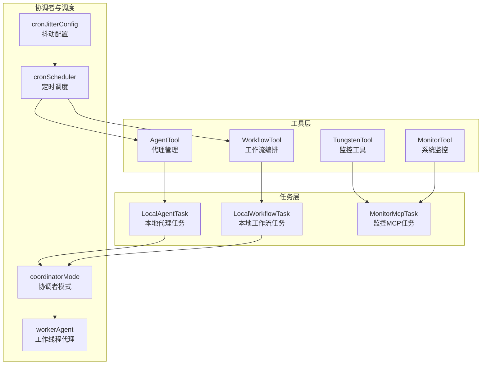
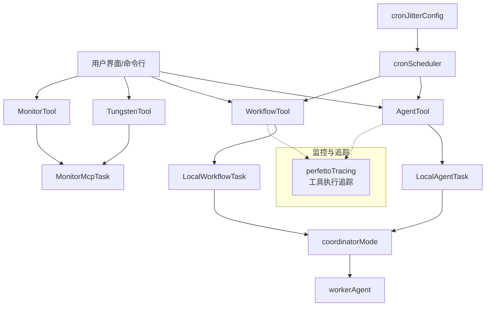
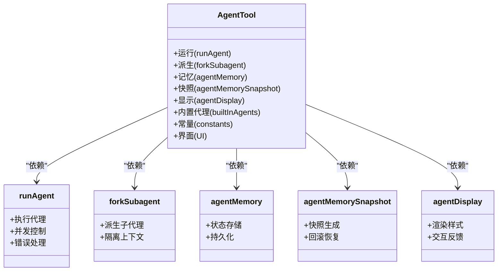
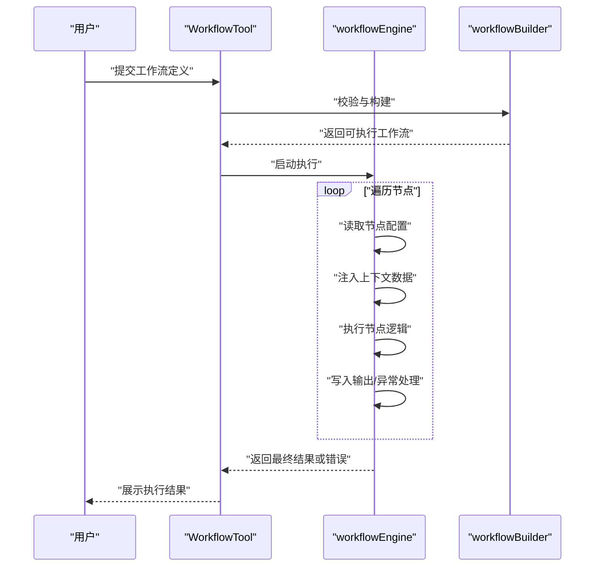
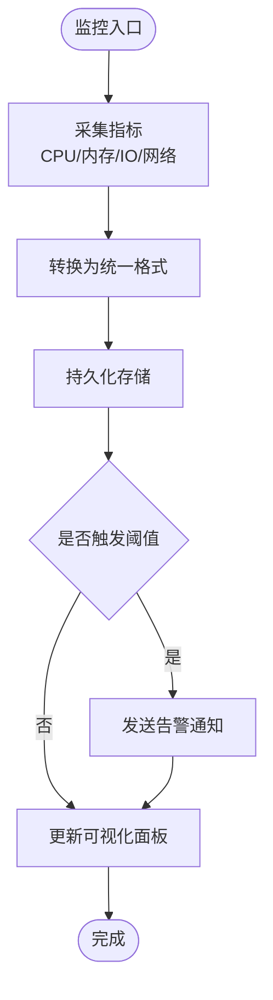
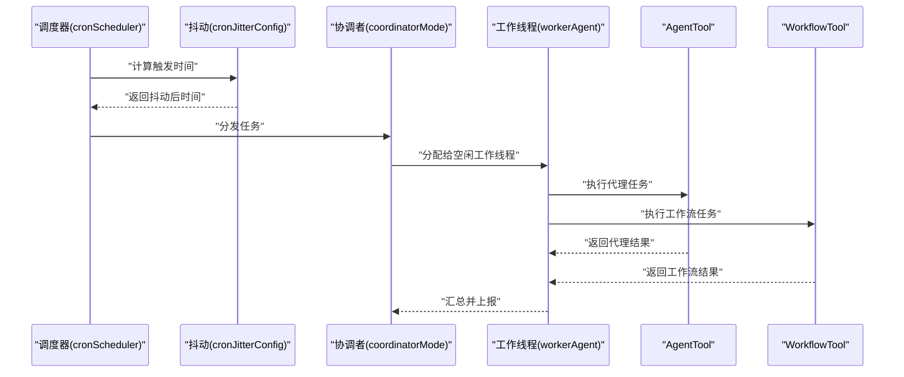
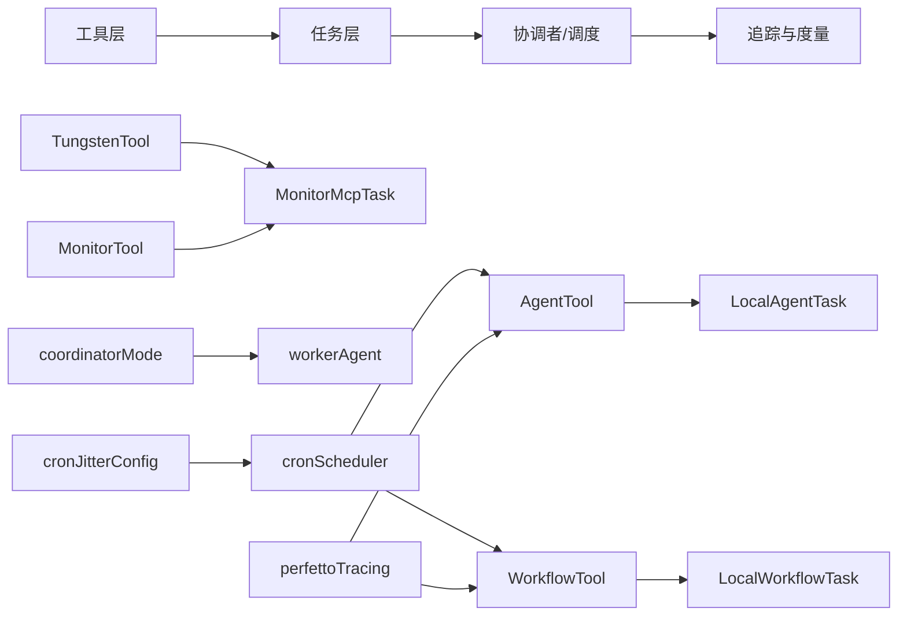

# 代理与工作流工具

<cite>
**本文引用的文件**
- [src/tools/AgentTool/AgentTool.tsx](file://src/tools/AgentTool/AgentTool.tsx)
- [src/tools/AgentTool/runAgent.ts](file://src/tools/AgentTool/runAgent.ts)
- [src/tools/AgentTool/forkSubagent.ts](file://src/tools/AgentTool/forkSubagent.ts)
- [src/tools/AgentTool/agentMemory.ts](file://src/tools/AgentTool/agentMemory.ts)
- [src/tools/AgentTool/agentMemorySnapshot.ts](file://src/tools/AgentTool/agentMemorySnapshot.ts)
- [src/tools/AgentTool/agentDisplay.ts](file://src/tools/AgentTool/agentDisplay.ts)
- [src/tools/AgentTool/builtInAgents.ts](file://src/tools/AgentTool/builtInAgents.ts)
- [src/tools/AgentTool/constants.ts](file://src/tools/AgentTool/constants.ts)
- [src/tools/AgentTool/UI.tsx](file://src/tools/AgentTool/UI.tsx)
- [src/tools/WorkflowTool/WorkflowTool.tsx](file://src/tools/WorkflowTool/WorkflowTool.tsx)
- [src/tools/WorkflowTool/workflowEngine.ts](file://src/tools/WorkflowTool/workflowEngine.ts)
- [src/tools/WorkflowTool/workflowBuilder.ts](file://src/tools/WorkflowTool/workflowBuilder.ts)
- [src/tools/TungstenTool/TungstenTool.tsx](file://src/tools/TungstenTool/TungstenTool.tsx)
- [src/tools/TungstenTool/tungstenMonitor.ts](file://src/tools/TungstenTool/tungstenMonitor.ts)
- [src/tools/MonitorTool/MonitorTool.ts](file://src/tools/MonitorTool/MonitorTool.ts)
- [src/tasks.ts](file://src/tasks.ts)
- [src/tasks/LocalAgentTask/LocalAgentTask.ts](file://src/tasks/LocalAgentTask/LocalAgentTask.ts)
- [src/tasks/LocalWorkflowTask/LocalWorkflowTask.ts](file://src/tasks/LocalWorkflowTask/LocalWorkflowTask.ts)
- [src/tasks/MonitorMcpTask/MonitorMcpTask.ts](file://src/tasks/MonitorMcpTask/MonitorMcpTask.ts)
- [src/coordinator/coordinatorMode.ts](file://src/coordinator/coordinatorMode.ts)
- [src/coordinator/workerAgent.ts](file://src/coordinator/workerAgent.ts)
- [src/utils/cronScheduler.ts](file://src/utils/cronScheduler.ts)
- [src/utils/cronJitterConfig.ts](file://src/utils/cronJitterConfig.ts)
- [src/tools/ScheduleCronTool/CronCreateTool.ts](file://src/tools/ScheduleCronTool/CronCreateTool.ts)
- [src/tools/ScheduleCronTool/CronListTool.ts](file://src/tools/ScheduleCronTool/CronListTool.ts)
- [src/tools/ScheduleCronTool/CronDeleteTool.ts](file://src/tools/ScheduleCronTool/CronDeleteTool.ts)
- [src/utils/telemetry/perfettoTracing.ts](file://src/utils/telemetry/perfettoTracing.ts)
- [src/bootstrap/state.ts](file://src/bootstrap/state.ts)
- [src/tools.ts](file://src/tools.ts)
</cite>

## 目录
1. [简介](#简介)
2. [项目结构](#项目结构)
3. [核心组件](#核心组件)
4. [架构总览](#架构总览)
5. [详细组件分析](#详细组件分析)
6. [依赖分析](#依赖分析)
7. [性能考虑](#性能考虑)
8. [故障排查指南](#故障排查指南)
9. [结论](#结论)
10. [附录](#附录)

## 简介
本文件面向代理与工作流工具的技术文档，聚焦以下目标：
- 深入解析 AgentTool 的智能代理管理能力：包括代理生命周期、状态与记忆、并发与派生子代理、UI 展示与交互。
- 全面阐述 WorkflowTool 的工作流编排能力：包括流程定义、节点执行、条件分支、错误处理与重试策略。
- 解释 TungstenTool 的监控工具与 MonitorTool 的系统监控能力：覆盖资源采集、指标上报、可视化与告警联动。
- 总结代理工具的内存管理、状态持久化与并发控制机制。
- 提供工作流设计与代理配置的实际案例，以及与协调者模式和任务调度系统的集成关系。

## 项目结构
该代码库围绕“工具（Tools）”“任务（Tasks）”“协调者（Coordinator）”“调度器（Cron Scheduler）”等模块组织，形成从工具到任务再到编排与调度的完整链路。代理与工作流工具位于 src/tools 下，分别以 AgentTool 与 WorkflowTool 为核心；监控相关由 TungstenTool 与 MonitorTool 实现，并通过任务层的 MonitorMcpTask 进行系统级监控。

图表来源
- [src/tools/AgentTool/AgentTool.tsx](file://src/tools/AgentTool/AgentTool.tsx)
- [src/tools/WorkflowTool/WorkflowTool.tsx](file://src/tools/WorkflowTool/WorkflowTool.tsx)
- [src/tools/TungstenTool/TungstenTool.tsx](file://src/tools/TungstenTool/TungstenTool.tsx)
- [src/tools/MonitorTool/MonitorTool.ts](file://src/tools/MonitorTool/MonitorTool.ts)
- [src/tasks/LocalAgentTask/LocalAgentTask.ts](file://src/tasks/LocalAgentTask/LocalAgentTask.ts)
- [src/tasks/LocalWorkflowTask/LocalWorkflowTask.ts](file://src/tasks/LocalWorkflowTask/LocalWorkflowTask.ts)
- [src/tasks/MonitorMcpTask/MonitorMcpTask.ts](file://src/tasks/MonitorMcpTask/MonitorMcpTask.ts)
- [src/coordinator/coordinatorMode.ts](file://src/coordinator/coordinatorMode.ts)
- [src/coordinator/workerAgent.ts](file://src/coordinator/workerAgent.ts)
- [src/utils/cronScheduler.ts](file://src/utils/cronScheduler.ts)
- [src/utils/cronJitterConfig.ts](file://src/utils/cronJitterConfig.ts)

章节来源
- [src/tools.ts](file://src/tools.ts)
- [src/tasks.ts](file://src/tasks.ts)

## 核心组件
- AgentTool：提供代理的创建、运行、记忆与展示，支持派生子代理与并发控制。
- WorkflowTool：提供工作流的构建、执行与回溯，支持节点间数据传递与错误恢复。
- TungstenTool：提供系统级监控能力，采集关键指标并进行可视化与告警联动。
- MonitorTool：提供系统监控工具，用于观测与记录系统状态。
- 协调者与调度：通过 coordinatorMode 与 workerAgent 实现多代理协作；通过 cronScheduler 与 cronJitterConfig 实现定时触发与去抖动。

章节来源
- [src/tools/AgentTool/AgentTool.tsx](file://src/tools/AgentTool/AgentTool.tsx)
- [src/tools/WorkflowTool/WorkflowTool.tsx](file://src/tools/WorkflowTool/WorkflowTool.tsx)
- [src/tools/TungstenTool/TungstenTool.tsx](file://src/tools/TungstenTool/TungstenTool.tsx)
- [src/tools/MonitorTool/MonitorTool.ts](file://src/tools/MonitorTool/MonitorTool.ts)
- [src/coordinator/coordinatorMode.ts](file://src/coordinator/coordinatorMode.ts)
- [src/coordinator/workerAgent.ts](file://src/coordinator/workerAgent.ts)
- [src/utils/cronScheduler.ts](file://src/utils/cronScheduler.ts)
- [src/utils/cronJitterConfig.ts](file://src/utils/cronJitterConfig.ts)

## 架构总览
下图展示了代理与工作流工具在整体系统中的位置与交互关系，以及与任务层、协调者与调度系统的集成。

图表来源
- [src/tools/AgentTool/AgentTool.tsx](file://src/tools/AgentTool/AgentTool.tsx)
- [src/tools/WorkflowTool/WorkflowTool.tsx](file://src/tools/WorkflowTool/WorkflowTool.tsx)
- [src/tools/TungstenTool/TungstenTool.tsx](file://src/tools/TungstenTool/TungstenTool.tsx)
- [src/tools/MonitorTool/MonitorTool.ts](file://src/tools/MonitorTool/MonitorTool.ts)
- [src/tasks/LocalAgentTask/LocalAgentTask.ts](file://src/tasks/LocalAgentTask/LocalAgentTask.ts)
- [src/tasks/LocalWorkflowTask/LocalWorkflowTask.ts](file://src/tasks/LocalWorkflowTask/LocalWorkflowTask.ts)
- [src/tasks/MonitorMcpTask/MonitorMcpTask.ts](file://src/tasks/MonitorMcpTask/MonitorMcpTask.ts)
- [src/coordinator/coordinatorMode.ts](file://src/coordinator/coordinatorMode.ts)
- [src/coordinator/workerAgent.ts](file://src/coordinator/workerAgent.ts)
- [src/utils/cronScheduler.ts](file://src/utils/cronScheduler.ts)
- [src/utils/cronJitterConfig.ts](file://src/utils/cronJitterConfig.ts)
- [src/utils/telemetry/perfettoTracing.ts](file://src/utils/telemetry/perfettoTracing.ts)

## 详细组件分析

### AgentTool 组件分析
AgentTool 负责代理的全生命周期管理，包含运行、记忆、派生子代理与 UI 展示。其核心要点如下：
- 运行与派生：runAgent 负责代理执行；forkSubagent 支持派生子代理，便于并发与隔离。
- 记忆与快照：agentMemory 与 agentMemorySnapshot 提供状态持久化与快照回滚能力。
- 内置代理与常量：builtInAgents 与 constants 定义默认行为与配置。
- UI 展示：UI.tsx 提供交互式界面，结合 agentDisplay 控制展示样式。

图表来源
- [src/tools/AgentTool/AgentTool.tsx](file://src/tools/AgentTool/AgentTool.tsx)
- [src/tools/AgentTool/runAgent.ts](file://src/tools/AgentTool/runAgent.ts)
- [src/tools/AgentTool/forkSubagent.ts](file://src/tools/AgentTool/forkSubagent.ts)
- [src/tools/AgentTool/agentMemory.ts](file://src/tools/AgentTool/agentMemory.ts)
- [src/tools/AgentTool/agentMemorySnapshot.ts](file://src/tools/AgentTool/agentMemorySnapshot.ts)
- [src/tools/AgentTool/agentDisplay.ts](file://src/tools/AgentTool/agentDisplay.ts)
- [src/tools/AgentTool/builtInAgents.ts](file://src/tools/AgentTool/builtInAgents.ts)
- [src/tools/AgentTool/constants.ts](file://src/tools/AgentTool/constants.ts)
- [src/tools/AgentTool/UI.tsx](file://src/tools/AgentTool/UI.tsx)

章节来源
- [src/tools/AgentTool/AgentTool.tsx](file://src/tools/AgentTool/AgentTool.tsx)
- [src/tools/AgentTool/runAgent.ts](file://src/tools/AgentTool/runAgent.ts)
- [src/tools/AgentTool/forkSubagent.ts](file://src/tools/AgentTool/forkSubagent.ts)
- [src/tools/AgentTool/agentMemory.ts](file://src/tools/AgentTool/agentMemory.ts)
- [src/tools/AgentTool/agentMemorySnapshot.ts](file://src/tools/AgentTool/agentMemorySnapshot.ts)
- [src/tools/AgentTool/agentDisplay.ts](file://src/tools/AgentTool/agentDisplay.ts)
- [src/tools/AgentTool/builtInAgents.ts](file://src/tools/AgentTool/builtInAgents.ts)
- [src/tools/AgentTool/constants.ts](file://src/tools/AgentTool/constants.ts)
- [src/tools/AgentTool/UI.tsx](file://src/tools/AgentTool/UI.tsx)

### WorkflowTool 组件分析
WorkflowTool 提供工作流的构建与执行能力，强调可组合性与容错性：
- 工作流引擎：workflowEngine 负责节点调度、数据传递与错误传播。
- 构建器：workflowBuilder 提供声明式工作流定义与校验。
- 执行序列：从开始节点到结束节点，支持条件分支与并行聚合。

图表来源
- [src/tools/WorkflowTool/WorkflowTool.tsx](file://src/tools/WorkflowTool/WorkflowTool.tsx)
- [src/tools/WorkflowTool/workflowEngine.ts](file://src/tools/WorkflowTool/workflowEngine.ts)
- [src/tools/WorkflowTool/workflowBuilder.ts](file://src/tools/WorkflowTool/workflowBuilder.ts)

章节来源
- [src/tools/WorkflowTool/WorkflowTool.tsx](file://src/tools/WorkflowTool/WorkflowTool.tsx)
- [src/tools/WorkflowTool/workflowEngine.ts](file://src/tools/WorkflowTool/workflowEngine.ts)
- [src/tools/WorkflowTool/workflowBuilder.ts](file://src/tools/WorkflowTool/workflowBuilder.ts)

### TungstenTool 与 MonitorTool 组件分析
- TungstenTool：提供系统级监控能力，采集关键指标并进行可视化与告警联动。
- MonitorTool：提供系统监控工具，用于观测与记录系统状态。
- MonitorMcpTask：在任务层实现系统级监控，与 TungstenTool/MonitorTool 配合使用。

图表来源
- [src/tools/TungstenTool/TungstenTool.tsx](file://src/tools/TungstenTool/TungstenTool.tsx)
- [src/tools/TungstenTool/tungstenMonitor.ts](file://src/tools/TungstenTool/tungstenMonitor.ts)
- [src/tools/MonitorTool/MonitorTool.ts](file://src/tools/MonitorTool/MonitorTool.ts)
- [src/tasks/MonitorMcpTask/MonitorMcpTask.ts](file://src/tasks/MonitorMcpTask/MonitorMcpTask.ts)

章节来源
- [src/tools/TungstenTool/TungstenTool.tsx](file://src/tools/TungstenTool/TungstenTool.tsx)
- [src/tools/TungstenTool/tungstenMonitor.ts](file://src/tools/TungstenTool/tungstenMonitor.ts)
- [src/tools/MonitorTool/MonitorTool.ts](file://src/tools/MonitorTool/MonitorTool.ts)
- [src/tasks/MonitorMcpTask/MonitorMcpTask.ts](file://src/tasks/MonitorMcpTask/MonitorMcpTask.ts)

### 协调者模式与任务调度集成
- 协调者模式：coordinatorMode 与 workerAgent 提供多代理协作与负载均衡。
- 任务调度：cronScheduler 与 cronJitterConfig 提供定时触发与去抖动，确保任务稳定执行。

图表来源
- [src/utils/cronScheduler.ts](file://src/utils/cronScheduler.ts)
- [src/utils/cronJitterConfig.ts](file://src/utils/cronJitterConfig.ts)
- [src/coordinator/coordinatorMode.ts](file://src/coordinator/coordinatorMode.ts)
- [src/coordinator/workerAgent.ts](file://src/coordinator/workerAgent.ts)
- [src/tools/AgentTool/AgentTool.tsx](file://src/tools/AgentTool/AgentTool.tsx)
- [src/tools/WorkflowTool/WorkflowTool.tsx](file://src/tools/WorkflowTool/WorkflowTool.tsx)

章节来源
- [src/utils/cronScheduler.ts](file://src/utils/cronScheduler.ts)
- [src/utils/cronJitterConfig.ts](file://src/utils/cronJitterConfig.ts)
- [src/coordinator/coordinatorMode.ts](file://src/coordinator/coordinatorMode.ts)
- [src/coordinator/workerAgent.ts](file://src/coordinator/workerAgent.ts)

## 依赖分析
- 工具层依赖：AgentTool、WorkflowTool、TungstenTool、MonitorTool 通过任务层 LocalAgentTask、LocalWorkflowTask、MonitorMcpTask 与系统集成。
- 协调者与调度：coordinatorMode 与 workerAgent 作为执行载体，cronScheduler 与 cronJitterConfig 作为触发器。
- 追踪与度量：perfettoTracing 为工具执行提供性能追踪，bootstrap/state 提供全局时序统计。

图表来源
- [src/tools.ts](file://src/tools.ts)
- [src/tasks.ts](file://src/tasks.ts)
- [src/tasks/LocalAgentTask/LocalAgentTask.ts](file://src/tasks/LocalAgentTask/LocalAgentTask.ts)
- [src/tasks/LocalWorkflowTask/LocalWorkflowTask.ts](file://src/tasks/LocalWorkflowTask/LocalWorkflowTask.ts)
- [src/tasks/MonitorMcpTask/MonitorMcpTask.ts](file://src/tasks/MonitorMcpTask/MonitorMcpTask.ts)
- [src/coordinator/coordinatorMode.ts](file://src/coordinator/coordinatorMode.ts)
- [src/coordinator/workerAgent.ts](file://src/coordinator/workerAgent.ts)
- [src/utils/cronScheduler.ts](file://src/utils/cronScheduler.ts)
- [src/utils/cronJitterConfig.ts](file://src/utils/cronJitterConfig.ts)
- [src/utils/telemetry/perfettoTracing.ts](file://src/utils/telemetry/perfettoTracing.ts)

章节来源
- [src/tools.ts](file://src/tools.ts)
- [src/tasks.ts](file://src/tasks.ts)
- [src/utils/telemetry/perfettoTracing.ts](file://src/utils/telemetry/perfettoTracing.ts)
- [src/bootstrap/state.ts](file://src/bootstrap/state.ts)

## 性能考虑
- 工具执行追踪：perfettoTracing 为每个工具调用建立开始/结束事件，记录耗时、成功状态与错误信息，便于定位瓶颈。
- 全局时序统计：bootstrap/state 提供工具执行总时长、回合内统计等指标，辅助性能评估与优化。
- 并发与派生：AgentTool 的 forkSubagent 支持并发执行与上下文隔离，需注意资源竞争与内存占用。
- 调度抖动：cronJitterConfig 降低同时触发带来的尖峰压力，提升系统稳定性。

章节来源
- [src/utils/telemetry/perfettoTracing.ts](file://src/utils/telemetry/perfettoTracing.ts)
- [src/bootstrap/state.ts](file://src/bootstrap/state.ts)
- [src/utils/cronJitterConfig.ts](file://src/utils/cronJitterConfig.ts)

## 故障排查指南
- 工具执行失败：检查 perfettoTracing 中的错误字段与持续时间，定位具体失败节点与原因。
- 代理卡死或内存溢出：核查 agentMemory 与 agentMemorySnapshot 的快照频率与大小，必要时减少快照间隔或清理历史。
- 工作流中断：查看 workflowEngine 的错误传播与重试策略，确认节点输入输出是否符合预期。
- 监控告警风暴：调整 TungstenTool/MonitorTool 的阈值与去抖动参数，避免频繁告警。
- 协调者任务堆积：检查 coordinatorMode 与 workerAgent 的负载均衡情况，适当增加工作线程或优化任务分配。

章节来源
- [src/utils/telemetry/perfettoTracing.ts](file://src/utils/telemetry/perfettoTracing.ts)
- [src/tools/AgentTool/agentMemory.ts](file://src/tools/AgentTool/agentMemory.ts)
- [src/tools/AgentTool/agentMemorySnapshot.ts](file://src/tools/AgentTool/agentMemorySnapshot.ts)
- [src/tools/WorkflowTool/workflowEngine.ts](file://src/tools/WorkflowTool/workflowEngine.ts)
- [src/tools/TungstenTool/tungstenMonitor.ts](file://src/tools/TungstenTool/tungstenMonitor.ts)
- [src/coordinator/coordinatorMode.ts](file://src/coordinator/coordinatorMode.ts)
- [src/coordinator/workerAgent.ts](file://src/coordinator/workerAgent.ts)

## 结论
本文件系统梳理了代理与工作流工具在代码库中的实现与集成关系。AgentTool 提供强大的代理管理与并发控制，WorkflowTool 提供灵活的工作流编排，TungstenTool 与 MonitorTool 则保障系统可观测性。通过协调者模式与调度系统的配合，实现了稳定的多代理协作与定时任务执行。建议在实际使用中结合追踪与度量数据，持续优化代理与工作流的性能与可靠性。

## 附录
- 实际案例（概念性说明）
  - 代理配置案例：基于 AgentTool 的内置代理与常量配置，快速搭建特定场景的代理实例；通过 forkSubagent 实现并发执行与隔离。
  - 工作流设计案例：使用 WorkflowTool 的 workflowBuilder 定义节点与连接，结合 workflowEngine 的错误处理与重试策略，确保流程稳健执行。
  - 监控集成案例：通过 TungstenTool 采集关键指标并与 MonitorTool 配合，结合 MonitorMcpTask 实现系统级监控与可视化。