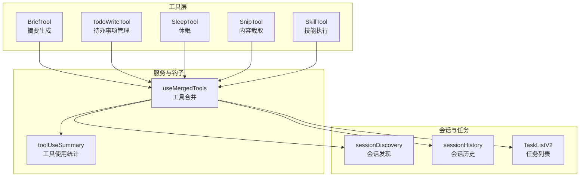
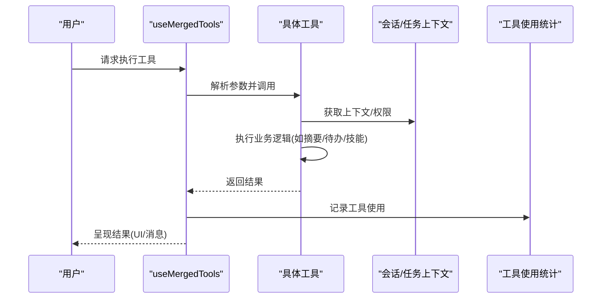
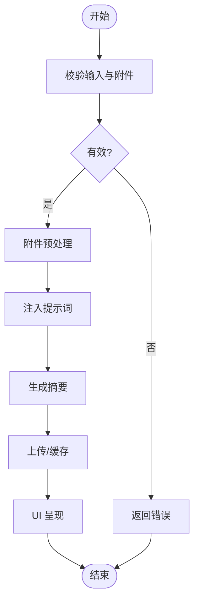
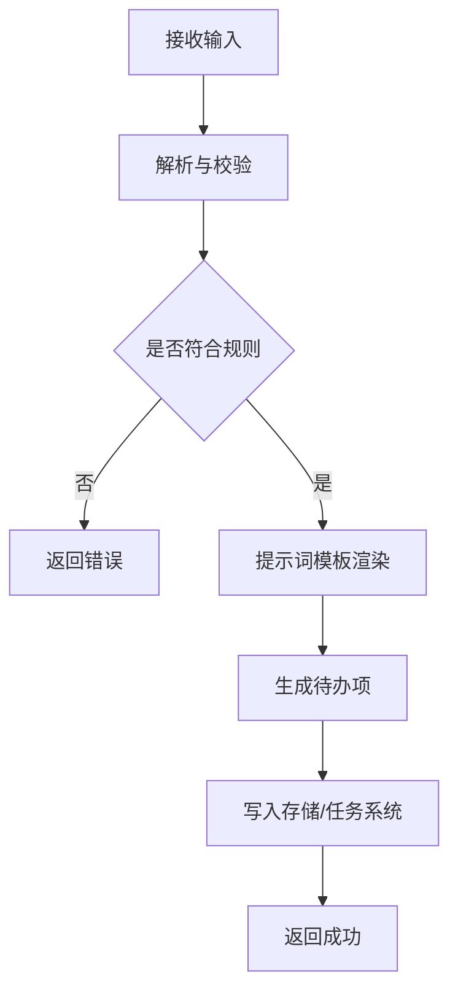
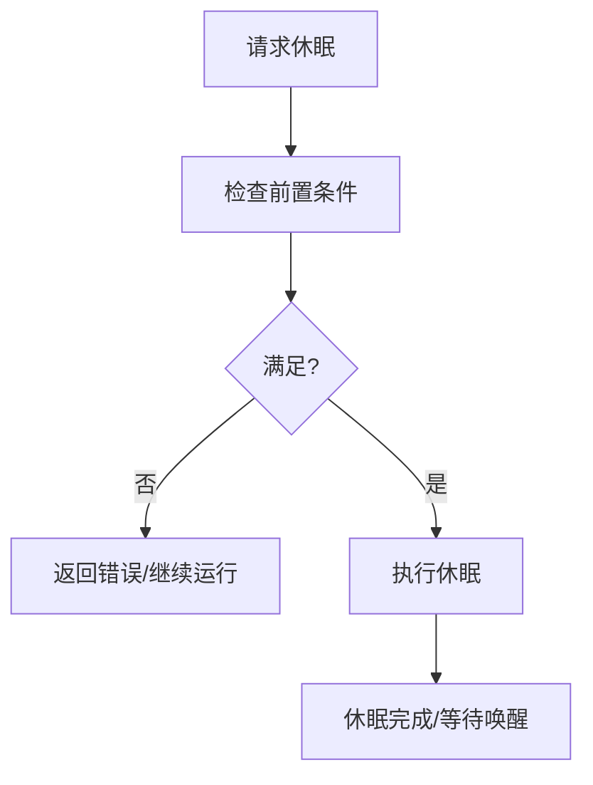
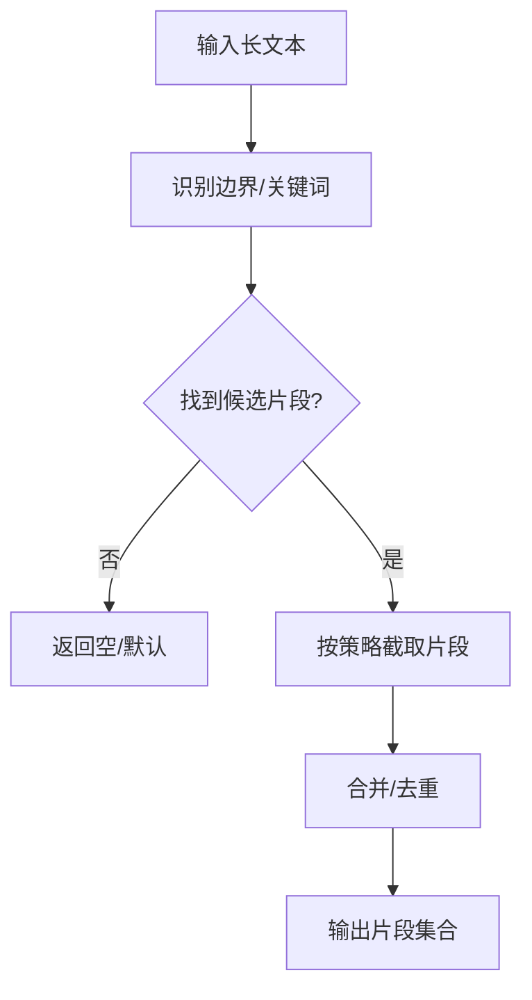
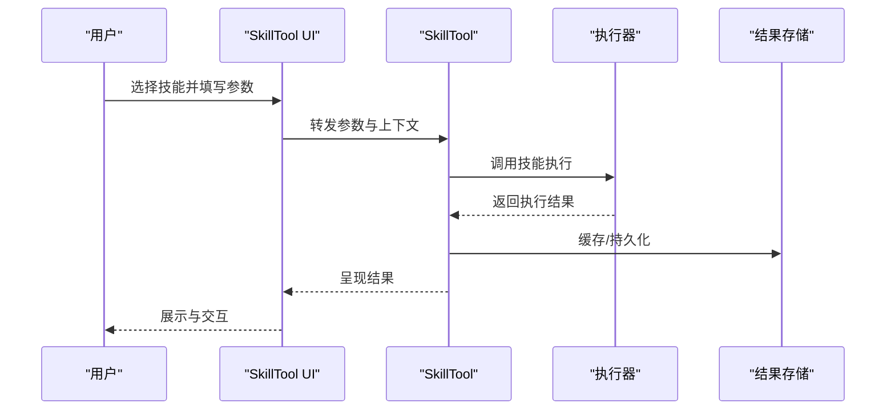
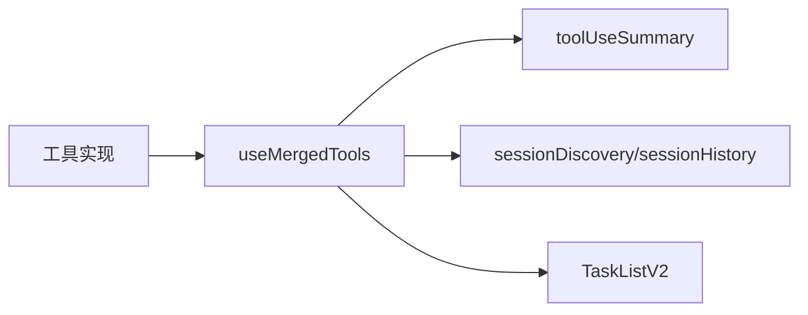

# 实用工具

<cite>
**本文引用的文件**
- [src/tools/BriefTool/BriefTool.ts](file://src/tools/BriefTool/BriefTool.ts)
- [src/tools/BriefTool/UI.tsx](file://src/tools/BriefTool/UI.tsx)
- [src/tools/BriefTool/attachments.ts](file://src/tools/BriefTool/attachments.ts)
- [src/tools/BriefTool/prompt.ts](file://src/tools/BriefTool/prompt.ts)
- [src/tools/BriefTool/upload.ts](file://src/tools/BriefTool/upload.ts)
- [src/tools/TodoWriteTool/TodoWriteTool.ts](file://src/tools/TodoWriteTool/TodoWriteTool.ts)
- [src/tools/TodoWriteTool/constants.ts](file://src/tools/TodoWriteTool/constants.ts)
- [src/tools/TodoWriteTool/prompt.ts](file://src/tools/TodoWriteTool/prompt.ts)
- [src/tools/SleepTool/prompt.ts](file://src/tools/SleepTool/prompt.ts)
- [src/tools/SnipTool/prompt.ts](file://src/tools/SnipTool/prompt.ts)
- [src/tools/SkillTool/SkillTool.ts](file://src/tools/SkillTool/SkillTool.ts)
- [src/tools/SkillTool/UI.tsx](file://src/tools/SkillTool/UI.tsx)
- [src/tools/SkillTool/constants.ts](file://src/tools/SkillTool/constants.ts)
- [src/tools/SkillTool/prompt.ts](file://src/tools/SkillTool/prompt.ts)
- [src/tools/utils.ts](file://src/tools/utils.ts)
- [src/constants/tools.ts](file://src/constants/tools.ts)
- [src/services/tools/toolUseSummary/index.ts](file://src/services/tools/toolUseSummary/index.ts)
- [src/hooks/useMergedTools.ts](file://src/hooks/useMergedTools.ts)
- [src/commands/skills/index.ts](file://src/commands/skills/index.ts)
- [src/components/tasks/TaskListV2.tsx](file://src/components/tasks/TaskListV2.tsx)
- [src/assistant/sessionDiscovery.ts](file://src/assistant/sessionDiscovery.ts)
- [src/assistant/sessionHistory.ts](file://src/assistant/sessionHistory.ts)
</cite>

## 目录
1. [简介](#简介)
2. [项目结构](#项目结构)
3. [核心组件](#核心组件)
4. [架构总览](#架构总览)
5. [详细组件分析](#详细组件分析)
6. [依赖分析](#依赖分析)
7. [性能考虑](#性能考虑)
8. [故障排除指南](#故障排除指南)
9. [结论](#结论)
10. [附录](#附录)

## 简介
本文件聚焦于五类实用工具：BriefTool（摘要生成）、TodoWriteTool（待办事项管理）、SleepTool（休眠）、SnipTool（内容截取）与 SkillTool（技能执行）。文档从设计理念、使用场景、实现机制、数据流与错误处理等方面进行系统化梳理，并给出最佳实践、配置建议以及与任务管理和会话状态的集成关系。

## 项目结构
这些工具位于 src/tools 下，每个工具通常包含一个主实现文件、可选的 UI 组件、提示词模块、附件处理与上传等辅助模块。工具通过统一的工具注册与合并机制接入系统，并在会话与任务上下文中被调用。

图示来源
- [src/tools/BriefTool/BriefTool.ts](file://src/tools/BriefTool/BriefTool.ts)
- [src/tools/TodoWriteTool/TodoWriteTool.ts](file://src/tools/TodoWriteTool/TodoWriteTool.ts)
- [src/tools/SleepTool/prompt.ts](file://src/tools/SleepTool/prompt.ts)
- [src/tools/SnipTool/prompt.ts](file://src/tools/SnipTool/prompt.ts)
- [src/tools/SkillTool/SkillTool.ts](file://src/tools/SkillTool/SkillTool.ts)
- [src/hooks/useMergedTools.ts](file://src/hooks/useMergedTools.ts)
- [src/services/tools/toolUseSummary/index.ts](file://src/services/tools/toolUseSummary/index.ts)
- [src/assistant/sessionDiscovery.ts](file://src/assistant/sessionDiscovery.ts)
- [src/assistant/sessionHistory.ts](file://src/assistant/sessionHistory.ts)
- [src/components/tasks/TaskListV2.tsx](file://src/components/tasks/TaskListV2.tsx)

章节来源
- [src/tools/BriefTool/BriefTool.ts](file://src/tools/BriefTool/BriefTool.ts)
- [src/tools/TodoWriteTool/TodoWriteTool.ts](file://src/tools/TodoWriteTool/TodoWriteTool.ts)
- [src/tools/SkillTool/SkillTool.ts](file://src/tools/SkillTool/SkillTool.ts)
- [src/hooks/useMergedTools.ts](file://src/hooks/useMergedTools.ts)

## 核心组件
- BriefTool：基于提示词与附件处理，生成内容摘要；支持上传与 UI 展示。
- TodoWriteTool：围绕待办事项写入与提示词模板，提供任务清单管理能力。
- SleepTool：提供休眠相关提示词，用于控制会话或流程暂停。
- SnipTool：提供内容截取相关提示词，用于从长文本中提取关键片段。
- SkillTool：封装技能执行逻辑，结合 UI 与常量配置，支持技能选择与运行。

章节来源
- [src/tools/BriefTool/BriefTool.ts](file://src/tools/BriefTool/BriefTool.ts)
- [src/tools/BriefTool/UI.tsx](file://src/tools/BriefTool/UI.tsx)
- [src/tools/BriefTool/attachments.ts](file://src/tools/BriefTool/attachments.ts)
- [src/tools/BriefTool/prompt.ts](file://src/tools/BriefTool/prompt.ts)
- [src/tools/BriefTool/upload.ts](file://src/tools/BriefTool/upload.ts)
- [src/tools/TodoWriteTool/TodoWriteTool.ts](file://src/tools/TodoWriteTool/TodoWriteTool.ts)
- [src/tools/TodoWriteTool/constants.ts](file://src/tools/TodoWriteTool/constants.ts)
- [src/tools/TodoWriteTool/prompt.ts](file://src/tools/TodoWriteTool/prompt.ts)
- [src/tools/SleepTool/prompt.ts](file://src/tools/SleepTool/prompt.ts)
- [src/tools/SnipTool/prompt.ts](file://src/tools/SnipTool/prompt.ts)
- [src/tools/SkillTool/SkillTool.ts](file://src/tools/SkillTool/SkillTool.ts)
- [src/tools/SkillTool/UI.tsx](file://src/tools/SkillTool/UI.tsx)
- [src/tools/SkillTool/constants.ts](file://src/tools/SkillTool/constants.ts)
- [src/tools/SkillTool/prompt.ts](file://src/tools/SkillTool/prompt.ts)

## 架构总览
工具通过统一的工具注册与合并机制接入系统，形成“工具定义 → 合并注册 → 会话调度 → 执行与反馈”的闭环。工具使用统计服务记录调用情况，会话与任务组件为工具提供上下文与生命周期管理。

图示来源
- [src/hooks/useMergedTools.ts](file://src/hooks/useMergedTools.ts)
- [src/services/tools/toolUseSummary/index.ts](file://src/services/tools/toolUseSummary/index.ts)
- [src/assistant/sessionDiscovery.ts](file://src/assistant/sessionDiscovery.ts)
- [src/assistant/sessionHistory.ts](file://src/assistant/sessionHistory.ts)
- [src/components/tasks/TaskListV2.tsx](file://src/components/tasks/TaskListV2.tsx)

## 详细组件分析

### BriefTool 摘要生成
- 设计理念：以“输入 → 提示词 → 处理 → 输出”为主线，强调可扩展的附件处理与上传能力，以及简洁的 UI 呈现。
- 关键模块
  - 主实现：负责解析输入、调用提示词与附件处理、触发上传与结果返回。
  - UI 组件：提供摘要展示与交互入口。
  - 附件处理：对输入附件进行预处理与格式适配。
  - 提示词：定义摘要生成的指令与约束。
  - 上传：将处理后的附件或中间产物上传至存储或输出通道。
- 数据流与处理逻辑
  - 输入校验 → 附件预处理 → 提示词注入 → 生成摘要 → 上传/缓存 → UI 呈现。
- 错误处理
  - 输入为空、附件类型不支持、上传失败、提示词执行异常时，返回明确错误信息并回退到安全状态。
- 性能特性
  - 附件处理采用异步流水线，避免阻塞主线程；上传支持分块与断点续传策略（若实现）。

图示来源
- [src/tools/BriefTool/BriefTool.ts](file://src/tools/BriefTool/BriefTool.ts)
- [src/tools/BriefTool/attachments.ts](file://src/tools/BriefTool/attachments.ts)
- [src/tools/BriefTool/upload.ts](file://src/tools/BriefTool/upload.ts)
- [src/tools/BriefTool/prompt.ts](file://src/tools/BriefTool/prompt.ts)
- [src/tools/BriefTool/UI.tsx](file://src/tools/BriefTool/UI.tsx)

章节来源
- [src/tools/BriefTool/BriefTool.ts](file://src/tools/BriefTool/BriefTool.ts)
- [src/tools/BriefTool/UI.tsx](file://src/tools/BriefTool/UI.tsx)
- [src/tools/BriefTool/attachments.ts](file://src/tools/BriefTool/attachments.ts)
- [src/tools/BriefTool/prompt.ts](file://src/tools/BriefTool/prompt.ts)
- [src/tools/BriefTool/upload.ts](file://src/tools/BriefTool/upload.ts)

### TodoWriteTool 待办事项管理
- 设计理念：以“模板化提示词 + 常量配置”驱动待办事项的生成与写入，强调一致性与可维护性。
- 关键模块
  - 主实现：解析输入，调用提示词模板，生成/更新待办事项。
  - 常量：集中管理待办项字段、默认值与规则。
  - 提示词：定义待办生成的结构化指令。
- 数据流与处理逻辑
  - 输入解析 → 规则匹配 → 提示词模板渲染 → 结果写入 → 反馈确认。
- 错误处理
  - 输入不合法、模板渲染失败、写入冲突时，返回错误并提示修正。
- 性能特性
  - 模板渲染与写入操作轻量，适合高频调用；可结合缓存减少重复计算。

图示来源
- [src/tools/TodoWriteTool/TodoWriteTool.ts](file://src/tools/TodoWriteTool/TodoWriteTool.ts)
- [src/tools/TodoWriteTool/constants.ts](file://src/tools/TodoWriteTool/constants.ts)
- [src/tools/TodoWriteTool/prompt.ts](file://src/tools/TodoWriteTool/prompt.ts)

章节来源
- [src/tools/TodoWriteTool/TodoWriteTool.ts](file://src/tools/TodoWriteTool/TodoWriteTool.ts)
- [src/tools/TodoWriteTool/constants.ts](file://src/tools/TodoWriteTool/constants.ts)
- [src/tools/TodoWriteTool/prompt.ts](file://src/tools/TodoWriteTool/prompt.ts)

### SleepTool 休眠功能
- 设计理念：通过提示词引导系统进入休眠状态，确保在合适时机暂停资源占用与计算。
- 关键模块
  - 提示词：定义休眠触发条件、行为与恢复策略。
- 使用场景
  - 长时间无操作、低优先级任务、节能模式等。
- 错误处理
  - 休眠前检查系统状态，失败时返回错误并保留当前状态。

图示来源
- [src/tools/SleepTool/prompt.ts](file://src/tools/SleepTool/prompt.ts)

章节来源
- [src/tools/SleepTool/prompt.ts](file://src/tools/SleepTool/prompt.ts)

### SnipTool 内容截取
- 设计理念：从长文本中提取关键片段，提升后续处理效率与可读性。
- 关键模块
  - 提示词：定义截取策略、边界识别与片段合并规则。
- 使用场景
  - 日志分析、报告摘要、代码片段定位等。
- 错误处理
  - 输入为空或无法识别边界时，返回空结果或最小片段集。

图示来源
- [src/tools/SnipTool/prompt.ts](file://src/tools/SnipTool/prompt.ts)

章节来源
- [src/tools/SnipTool/prompt.ts](file://src/tools/SnipTool/prompt.ts)

### SkillTool 技能执行
- 设计理念：将技能封装为可复用工具，结合 UI 与常量配置，支持技能选择、参数传递与结果呈现。
- 关键模块
  - 主实现：解析技能参数，调用底层执行器，返回结果。
  - UI 组件：提供技能选择与执行界面。
  - 常量：技能名称、参数默认值、权限要求等。
  - 提示词：定义技能执行的上下文与约束。
- 使用场景
  - 自动化脚本、批量处理、跨系统集成等。
- 错误处理
  - 参数缺失、权限不足、执行失败时，返回错误并提供修复建议。

图示来源
- [src/tools/SkillTool/SkillTool.ts](file://src/tools/SkillTool/SkillTool.ts)
- [src/tools/SkillTool/UI.tsx](file://src/tools/SkillTool/UI.tsx)
- [src/tools/SkillTool/constants.ts](file://src/tools/SkillTool/constants.ts)
- [src/tools/SkillTool/prompt.ts](file://src/tools/SkillTool/prompt.ts)

章节来源
- [src/tools/SkillTool/SkillTool.ts](file://src/tools/SkillTool/SkillTool.ts)
- [src/tools/SkillTool/UI.tsx](file://src/tools/SkillTool/UI.tsx)
- [src/tools/SkillTool/constants.ts](file://src/tools/SkillTool/constants.ts)
- [src/tools/SkillTool/prompt.ts](file://src/tools/SkillTool/prompt.ts)

## 依赖分析
- 工具注册与合并
  - 工具通过 useMergedTools 进行统一注册与调度，确保命名唯一与权限控制。
- 工具使用统计
  - toolUseSummary 记录工具调用次数、耗时与成功率，支撑可观测性与优化。
- 会话与任务集成
  - sessionDiscovery 与 sessionHistory 为工具提供会话上下文；TaskListV2 作为任务载体承载工具输出。

图示来源
- [src/hooks/useMergedTools.ts](file://src/hooks/useMergedTools.ts)
- [src/services/tools/toolUseSummary/index.ts](file://src/services/tools/toolUseSummary/index.ts)
- [src/assistant/sessionDiscovery.ts](file://src/assistant/sessionDiscovery.ts)
- [src/assistant/sessionHistory.ts](file://src/assistant/sessionHistory.ts)
- [src/components/tasks/TaskListV2.tsx](file://src/components/tasks/TaskListV2.tsx)

章节来源
- [src/hooks/useMergedTools.ts](file://src/hooks/useMergedTools.ts)
- [src/services/tools/toolUseSummary/index.ts](file://src/services/tools/toolUseSummary/index.ts)
- [src/assistant/sessionDiscovery.ts](file://src/assistant/sessionDiscovery.ts)
- [src/assistant/sessionHistory.ts](file://src/assistant/sessionHistory.ts)
- [src/components/tasks/TaskListV2.tsx](file://src/components/tasks/TaskListV2.tsx)

## 性能考虑
- 异步处理：附件与上传采用异步流水线，避免阻塞主线程。
- 缓存与复用：工具使用统计与会话上下文缓存可降低重复开销。
- 条件执行：SleepTool 在满足条件时才进入休眠，避免无效等待。
- 片段化处理：SnipTool 将长文本切分为小片段，便于并行与增量处理。
- 最佳实践
  - 对大文件先做预处理与尺寸限制，再进入摘要/截取阶段。
  - 合理设置超时与重试策略，保证用户体验。
  - 在 UI 中提供进度反馈与取消能力。

## 故障排除指南
- 输入校验失败
  - 检查输入类型与必填字段，参考工具常量中的默认值与规则。
- 附件处理异常
  - 确认附件格式受支持，检查预处理步骤与上传目标权限。
- 提示词执行失败
  - 查看提示词模板完整性与上下文注入是否正确。
- 工具未生效
  - 确认工具已在 useMergedTools 中注册且权限已授权。
- 会话/任务状态异常
  - 检查 sessionDiscovery 与 sessionHistory 的状态同步情况。

章节来源
- [src/tools/BriefTool/attachments.ts](file://src/tools/BriefTool/attachments.ts)
- [src/tools/BriefTool/upload.ts](file://src/tools/BriefTool/upload.ts)
- [src/tools/TodoWriteTool/constants.ts](file://src/tools/TodoWriteTool/constants.ts)
- [src/hooks/useMergedTools.ts](file://src/hooks/useMergedTools.ts)
- [src/assistant/sessionDiscovery.ts](file://src/assistant/sessionDiscovery.ts)
- [src/assistant/sessionHistory.ts](file://src/assistant/sessionHistory.ts)

## 结论
BriefTool、TodoWriteTool、SleepTool、SnipTool 与 SkillTool 共同构成了实用工具体系：前者负责内容摘要与附件处理，后者负责任务管理与技能执行；通过统一的注册与统计机制，这些工具在会话与任务上下文中高效协作，既满足自动化需求，又兼顾可观察性与可维护性。

## 附录
- 工具常量与配置
  - 工具通用常量与默认配置可参考工具常量文件，确保行为一致。
- 工具使用统计
  - 通过 toolUseSummary 查看调用趋势与失败率，指导优化与排障。
- 会话与任务集成
  - 与 sessionDiscovery、sessionHistory、TaskListV2 的集成确保工具在正确的上下文中执行。

章节来源
- [src/tools/utils.ts](file://src/tools/utils.ts)
- [src/constants/tools.ts](file://src/constants/tools.ts)
- [src/services/tools/toolUseSummary/index.ts](file://src/services/tools/toolUseSummary/index.ts)
- [src/commands/skills/index.ts](file://src/commands/skills/index.ts)