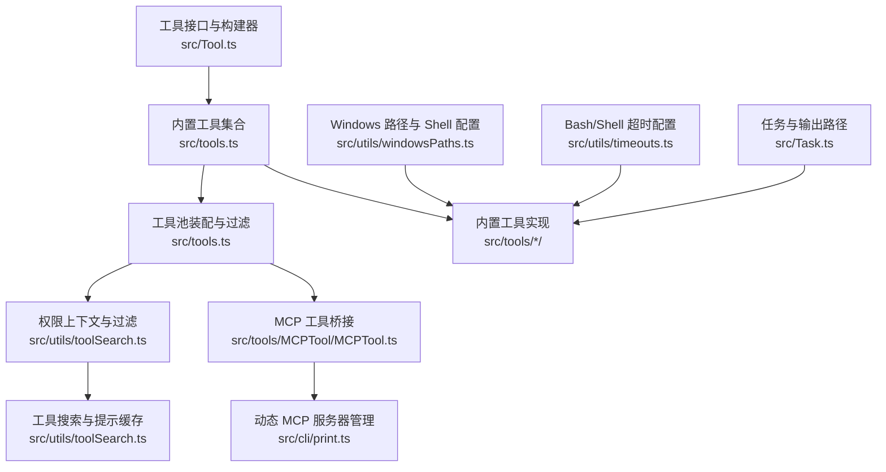
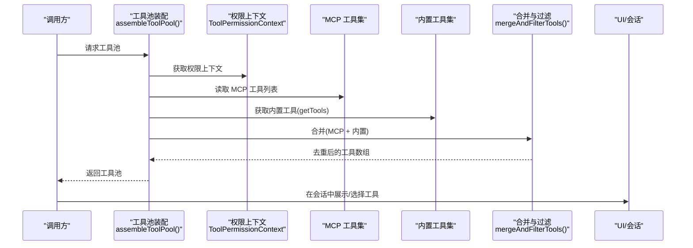
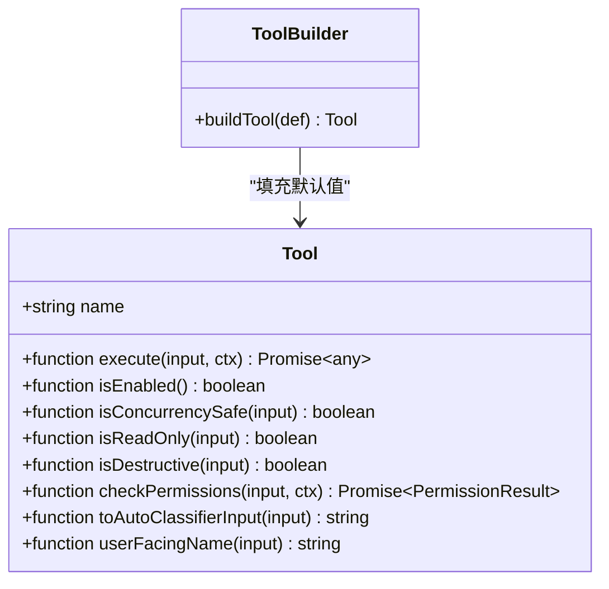
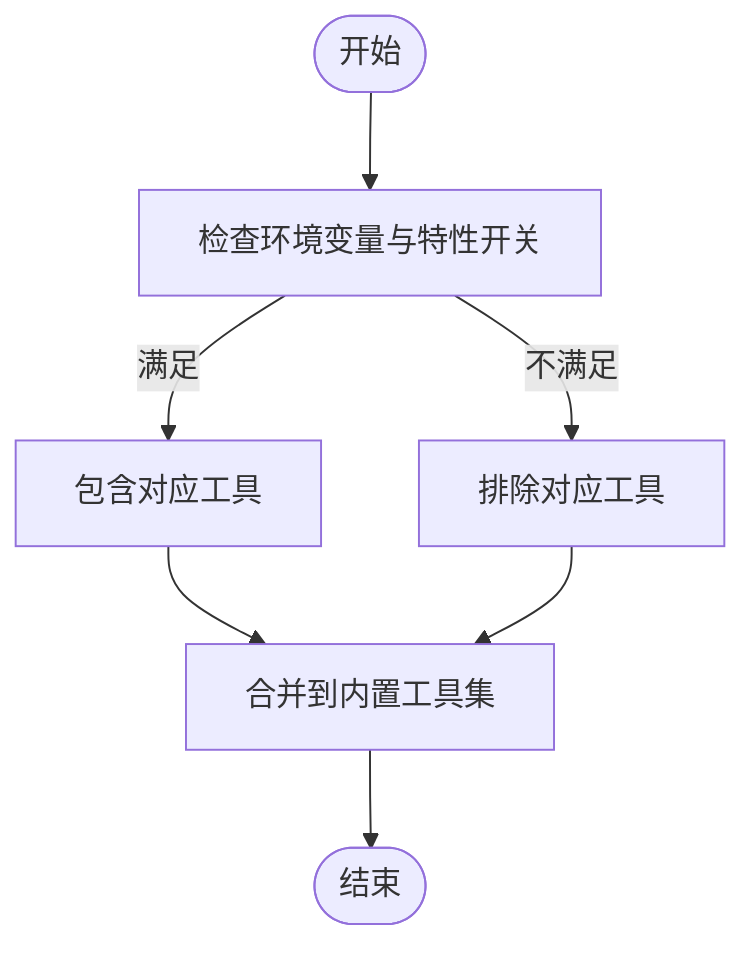
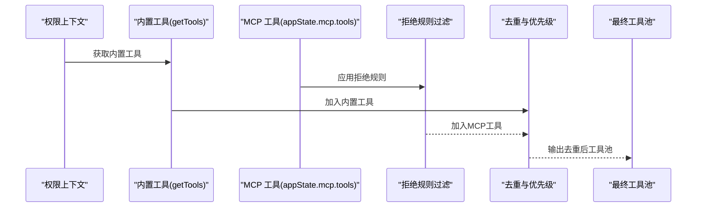
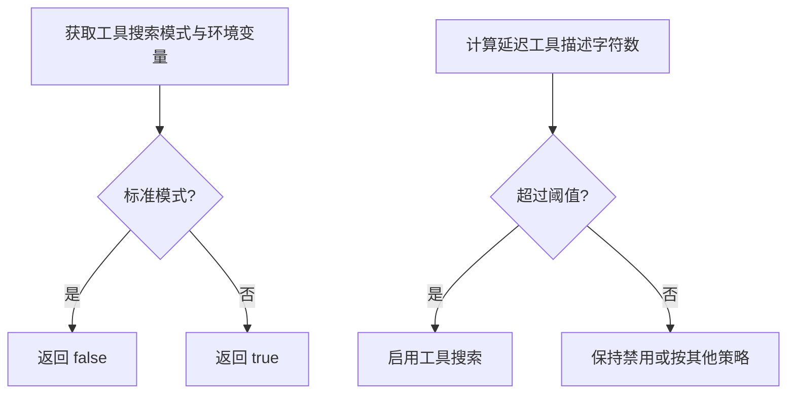
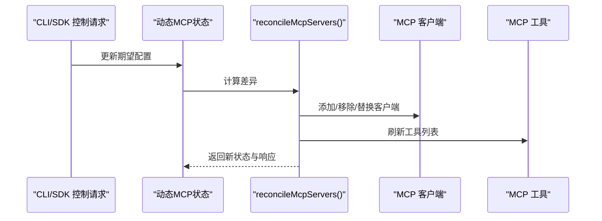
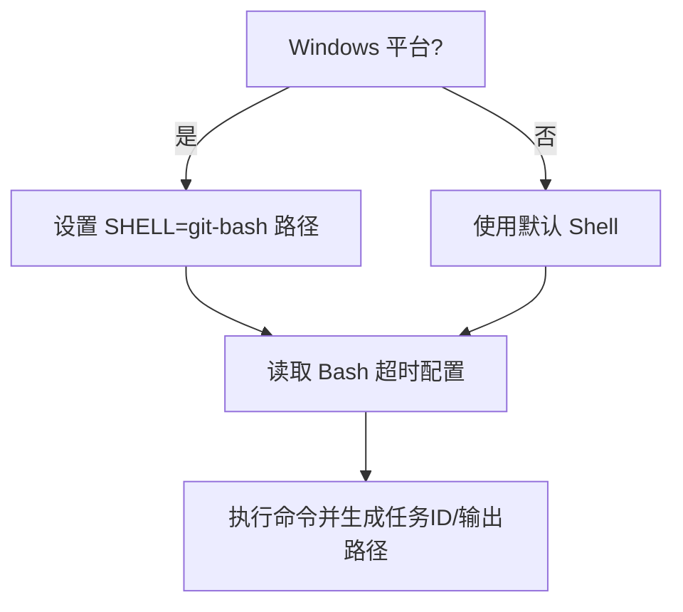
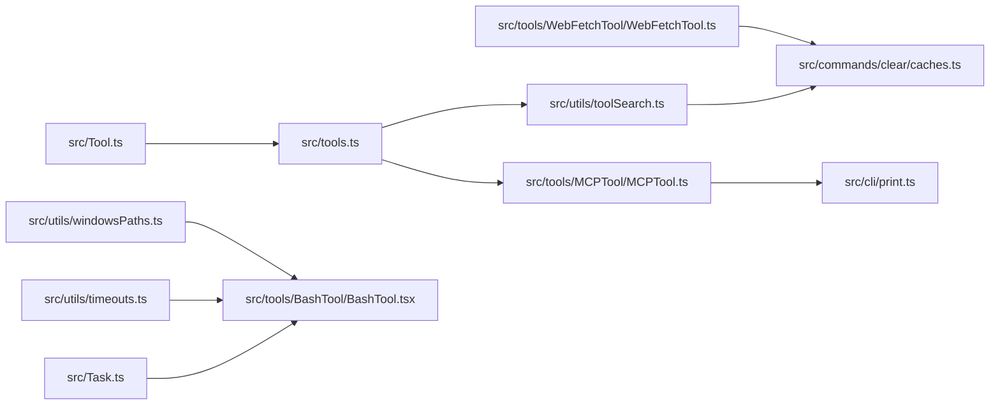

# 工具系统

<cite>
**本文引用的文件**
- [src/Tool.ts](file://src/Tool.ts)
- [src/tools.ts](file://src/tools.ts)
- [src/utils/toolSearch.ts](file://src/utils/toolSearch.ts)
- [src/cli/print.ts](file://src/cli/print.ts)
- [src/utils/transcriptSearch.ts](file://src/utils/transcriptSearch.ts)
- [src/utils/teamMemoryOps.ts](file://src/utils/teamMemoryOps.ts)
- [src/utils/timeouts.ts](file://src/utils/timeouts.ts)
- [src/utils/windowsPaths.ts](file://src/utils/windowsPaths.ts)
- [src/Task.ts](file://src/Task.ts)
- [src/commands/clear/caches.ts](file://src/commands/clear/caches.ts)
- [src/tools/BashTool/BashTool.tsx](file://src/tools/BashTool/BashTool.tsx)
- [src/tools/FileEditTool/FileEditTool.ts](file://src/tools/FileEditTool/FileEditTool.ts)
- [src/tools/WebSearchTool/WebSearchTool.ts](file://src/tools/WebSearchTool/WebSearchTool.ts)
- [src/tools/MCPTool/MCPTool.ts](file://src/tools/MCPTool/MCPTool.ts)
- [src/tools/ListMcpResourcesTool/ListMcpResourcesTool.ts](file://src/tools/ListMcpResourcesTool/ListMcpResourcesTool.ts)
- [src/tools/ReadMcpResourceTool/ReadMcpResourceTool.ts](file://src/tools/ReadMcpResourceTool/ReadMcpResourceTool.ts)
- [src/tools/ToolSearchTool/ToolSearchTool.ts](file://src/tools/ToolSearchTool/ToolSearchTool.ts)
- [src/tools/AgentTool/AgentTool.tsx](file://src/tools/AgentTool/AgentTool.tsx)
- [src/tools/SkillTool/SkillTool.ts](file://src/tools/SkillTool/SkillTool.ts)
- [src/tools/WebFetchTool/WebFetchTool.ts](file://src/tools/WebFetchTool/WebFetchTool.ts)
- [src/tools/TaskStopTool/TaskStopTool.ts](file://src/tools/TaskStopTool/TaskStopTool.ts)
- [src/tools/AskUserQuestionTool/AskUserQuestionTool.tsx](file://src/tools/AskUserQuestionTool/AskUserQuestionTool.tsx)
- [src/tools/PowerShellTool/PowerShellTool.tsx](file://src/tools/PowerShellTool/PowerShellTool.tsx)
- [src/tools/NotebookEditTool/NotebookEditTool.ts](file://src/tools/NotebookEditTool/NotebookEditTool.ts)
- [src/tools/ConfigTool/ConfigTool.ts](file://src/tools/ConfigTool/ConfigTool.ts)
- [src/tools/TungstenTool/TungstenTool.ts](file://src/tools/TungstenTool/TungstenTool.ts)
- [src/tools/GlobTool/GlobTool.ts](file://src/tools/GlobTool/GlobTool.ts)
- [src/tools/GrepTool/GrepTool.ts](file://src/tools/GrepTool/GrepTool.ts)
- [src/tools/REPLTool/REPLTool.ts](file://src/tools/REPLTool/REPLTool.ts)
- [src/tools/SuggestBackgroundPRTool/SuggestBackgroundPRTool.ts](file://src/tools/SuggestBackgroundPRTool/SuggestBackgroundPRTool.ts)
- [src/tools/WebBrowserTool/WebBrowserTool.ts](file://src/tools/WebBrowserTool/WebBrowserTool.ts)
- [src/tools/TaskCreateTool/TaskCreateTool.ts](file://src/tools/TaskCreateTool/TaskCreateTool.ts)
- [src/tools/TaskGetTool/TaskGetTool.ts](file://src/tools/TaskGetTool/TaskGetTool.ts)
- [src/tools/TaskListTool/TaskListTool.ts](file://src/tools/TaskListTool/TaskListTool.ts)
- [src/tools/TaskUpdateTool/TaskUpdateTool.ts](file://src/tools/TaskUpdateTool/TaskUpdateTool.ts)
- [src/tools/TaskOutputTool/TaskOutputTool.ts](file://src/tools/TaskOutputTool/TaskOutputTool.ts)
- [src/tools/ExitPlanModeTool/ExitPlanModeV2Tool.ts](file://src/tools/ExitPlanModeTool/ExitPlanModeV2Tool.ts)
- [src/tools/EnterPlanModeTool/EnterPlanModeTool.ts](file://src/tools/EnterPlanModeTool/EnterPlanModeTool.ts)
- [src/tools/ExitWorktreeTool/ExitWorktreeTool.ts](file://src/tools/ExitWorktreeTool/ExitWorktreeTool.ts)
- [src/tools/EnterWorktreeTool/EnterWorktreeTool.ts](file://src/tools/EnterWorktreeTool/EnterWorktreeTool.ts)
- [src/tools/SendUserFileTool/SendUserFileTool.ts](file://src/tools/SendUserFileTool/SendUserFileTool.ts)
- [src/tools/SendMessageTool/SendMessageTool.ts](file://src/tools/SendMessageTool/SendMessageTool.ts)
- [src/tools/TeamCreateTool/TeamCreateTool.ts](file://src/tools/TeamCreateTool/TeamCreateTool.ts)
- [src/tools/TeamDeleteTool/TeamDeleteTool.ts](file://src/tools/TeamDeleteTool/TeamDeleteTool.ts)
- [src/tools/TerminalCaptureTool/TerminalCaptureTool.ts](file://src/tools/TerminalCaptureTool/TerminalCaptureTool.ts)
- [src/tools/TodoWriteTool/TodoWriteTool.ts](file://src/tools/TodoWriteTool/TodoWriteTool.ts)
- [src/tools/WorkflowTool/WorkflowTool.ts](file://src/tools/WorkflowTool/WorkflowTool.ts)
- [src/tools/shared/shared.ts](file://src/tools/shared/shared.ts)
- [src/tools/testing/testing.ts](file://src/tools/testing/testing.ts)
- [src/tools/utils.ts](file://src/tools/utils.ts)
</cite>

## 目录
1. [简介](#简介)
2. [项目结构](#项目结构)
3. [核心组件](#核心组件)
4. [架构总览](#架构总览)
5. [详细组件分析](#详细组件分析)
6. [依赖关系分析](#依赖关系分析)
7. [性能考量](#性能考量)
8. [故障排查指南](#故障排查指南)
9. [结论](#结论)
10. [附录](#附录)

## 简介
本文件系统性阐述工具系统（Tools）的整体架构与实现细节，覆盖工具接口定义、工具注册机制、条件加载策略、权限过滤与安全控制、内置工具族（如 BashTool、FileEditTool、WebSearchTool 等）的实现原理与使用场景，并说明工具扩展机制、生命周期管理与工具池组装逻辑。同时给出工具系统与权限系统、MCP 协议以及会话管理的集成方式，辅以流程图与时序图帮助理解。

## 项目结构
工具系统由“工具接口与构建器”“内置工具集合”“工具池装配与过滤”“MCP 工具桥接”“权限与安全控制”“运行时任务与超时”等模块组成。核心入口与装配逻辑集中在工具聚合文件与工具池装配函数中；具体工具按功能分层组织在 tools 子目录下；权限与搜索策略在工具搜索与工具池装配工具中体现；Windows 路径与超时配置为 Bash/Shell 执行提供平台适配与稳定性保障。

图表来源
- [src/Tool.ts:716-792](file://src/Tool.ts#L716-L792)
- [src/tools.ts:185-220](file://src/tools.ts#L185-L220)
- [src/utils/toolSearch.ts:364-392](file://src/utils/toolSearch.ts#L364-L392)
- [src/cli/print.ts:1474-1500](file://src/cli/print.ts#L1474-L1500)
- [src/utils/windowsPaths.ts:87-117](file://src/utils/windowsPaths.ts#L87-L117)
- [src/utils/timeouts.ts:12-39](file://src/utils/timeouts.ts#L12-L39)
- [src/Task.ts:59-125](file://src/Task.ts#L59-L125)

章节来源
- [src/Tool.ts:716-792](file://src/Tool.ts#L716-L792)
- [src/tools.ts:185-220](file://src/tools.ts#L185-L220)
- [src/utils/toolSearch.ts:364-392](file://src/utils/toolSearch.ts#L364-L392)
- [src/cli/print.ts:1474-1500](file://src/cli/print.ts#L1474-L1500)
- [src/utils/windowsPaths.ts:87-117](file://src/utils/windowsPaths.ts#L87-L117)
- [src/utils/timeouts.ts:12-39](file://src/utils/timeouts.ts#L12-L39)
- [src/Task.ts:59-125](file://src/Task.ts#L59-L125)

## 核心组件
- 工具接口与构建器：统一的工具契约与默认值填充，确保所有工具具备一致的生命周期方法与安全属性。
- 内置工具集合：集中声明与条件加载，支持按环境变量与特性开关启用特定工具。
- 工具池装配与过滤：合并内置与 MCP 工具，执行权限过滤与去重，保证一致性与优先级。
- 权限与安全：工具权限检查、只读/破坏性标记、自动分类输入、MCP 拒绝规则。
- MCP 协议桥接：动态发现、连接、授权与工具同步，支持多传输类型。
- 运行时任务与超时：任务 ID 生成、输出路径管理、Bash 超时配置与 Windows Shell 适配。

章节来源
- [src/Tool.ts:716-792](file://src/Tool.ts#L716-L792)
- [src/tools.ts:185-220](file://src/tools.ts#L185-L220)
- [src/utils/toolSearch.ts:364-392](file://src/utils/toolSearch.ts#L364-L392)
- [src/cli/print.ts:1474-1500](file://src/cli/print.ts#L1474-L1500)

## 架构总览
工具系统采用“接口统一 + 组合装配 + 条件加载 + 权限过滤”的架构。工具通过统一接口定义能力，经由构建器填充默认行为；内置工具集合负责按环境条件导出；工具池装配函数将内置与 MCP 工具合并，依据权限上下文进行过滤与去重；MCP 工具通过动态服务器管理与协议桥接接入；运行期通过任务与超时配置保障稳定性与安全性。

图表来源
- [src/tools.ts:329-352](file://src/tools.ts#L329-L352)
- [src/cli/print.ts:1474-1500](file://src/cli/print.ts#L1474-L1500)

## 详细组件分析

### 工具接口与构建器（ToolDef/buildTool）
- 接口要点：工具需提供名称、输入/输出模式、执行方法、可选的生命周期钩子（是否并发安全、是否只读、是否破坏性、权限检查、自动分类输入、用户可见名等）。未提供的可默认项由构建器填充，确保调用端无需判空。
- 默认策略：默认允许、非并发安全、假设写入、默认放行权限检查、自动分类输入为空字符串、用户可见名为工具名。
- 类型安全：通过类型映射将传入定义与默认值进行“浅合并”，保证返回工具具备完整方法签名。

图表来源
- [src/Tool.ts:716-792](file://src/Tool.ts#L716-L792)

章节来源
- [src/Tool.ts:716-792](file://src/Tool.ts#L716-L792)

### 内置工具集合与条件加载
- 全量工具清单：集中导出所有可能的内置工具，包含 Bash、文件读写编辑、搜索、Web 抓取/搜索、任务管理、技能、计划模式切换、笔记本编辑、消息发送、远程触发、MCP 工具等。
- 条件加载：根据进程环境变量（如 USER_TYPE）与特性开关（如 TODO V2、嵌入式搜索工具可用性）决定是否包含某些工具，从而实现按构建类型与功能开关裁剪工具集。
- 示例路径：全量工具清单与条件分支逻辑位于工具聚合文件中。

图表来源
- [src/tools.ts:185-220](file://src/tools.ts#L185-L220)

章节来源
- [src/tools.ts:185-220](file://src/tools.ts#L185-L220)

### 工具池装配与过滤（assembleToolPool 与 mergeAndFilterTools）
- 装配流程：
  1) 从权限上下文中获取内置工具（受模式过滤影响）。
  2) 对 MCP 工具应用拒绝规则过滤。
  3) 合并内置与 MCP 工具，按名称去重，内置工具优先。
  4) 可选移除权限提示专用工具。
  5) 若存在初始化 JSON Schema，则注入合成输出工具。
- 关键点：内置工具优先级高于 MCP 工具；去重基于工具名；权限模式贯穿始终。

图表来源
- [src/tools.ts:329-352](file://src/tools.ts#L329-L352)
- [src/cli/print.ts:1474-1500](file://src/cli/print.ts#L1474-L1500)

章节来源
- [src/tools.ts:329-352](file://src/tools.ts#L329-L352)
- [src/cli/print.ts:1474-1500](file://src/cli/print.ts#L1474-L1500)

### 权限过滤与工具搜索策略
- 工具搜索启用判定：综合考虑 MCP 模式、模型对 tool_reference 的支持、ToolSearchTool 可用性与阈值检查，用于在实际 API 调用前确定是否启用工具搜索（MCP 工具描述延迟）。
- 乐观启用判定：在不考虑动态因素时，判断工具搜索是否“可能”启用，用于提前保留 ToolSearchTool、保留 tool_reference 字段与报告自身启用状态。
- ToolSearchTool 可用性检测：检查工具列表中是否存在 ToolSearchTool，若不可用则禁用工具搜索。
- 描述大小计算：统计延迟工具的描述长度（名称+描述文本+输入模式），用于阈值比较。

图表来源
- [src/utils/toolSearch.ts:270-320](file://src/utils/toolSearch.ts#L270-L320)
- [src/utils/toolSearch.ts:330-365](file://src/utils/toolSearch.ts#L330-L365)
- [src/utils/toolSearch.ts:364-392](file://src/utils/toolSearch.ts#L364-L392)

章节来源
- [src/utils/toolSearch.ts:270-320](file://src/utils/toolSearch.ts#L270-L320)
- [src/utils/toolSearch.ts:330-365](file://src/utils/toolSearch.ts#L330-L365)
- [src/utils/toolSearch.ts:364-392](file://src/utils/toolSearch.ts#L364-L392)

### MCP 协议与动态服务器管理
- 动态 MCP 状态：维护客户端、工具与配置的动态集合，支持增量更新与清理。
- 服务器协调：根据期望配置与当前状态对比，处理新增、删除、替换与错误记录。
- OAuth 流程：支持 MCP OAuth 回调 URL 与手动回调，维护活动流状态并在完成后清理。
- 工具桥接：MCPTool 将外部工具暴露为统一工具接口，配合权限与去重策略进入工具池。

图表来源
- [src/cli/print.ts:3430-5479](file://src/cli/print.ts#L3430-L5479)
- [src/tools/MCPTool/MCPTool.ts](file://src/tools/MCPTool/MCPTool.ts)

章节来源
- [src/cli/print.ts:3430-5479](file://src/cli/print.ts#L3430-L5479)
- [src/tools/MCPTool/MCPTool.ts](file://src/tools/MCPTool/MCPTool.ts)

### BashTool 实现要点
- 平台适配：Windows 下设置 SHELL 环境变量指向 git-bash 路径，确保命令行执行一致性。
- 超时配置：提供默认与最大 Bash 超时常量，支持通过环境变量覆盖。
- 任务与输出：任务 ID 生成、输出文件路径管理，便于结果持久化与回溯。
- 安全与权限：提供只读校验、破坏性命令警告、沙箱策略与路径验证等安全措施。

图表来源
- [src/utils/windowsPaths.ts:87-117](file://src/utils/windowsPaths.ts#L87-L117)
- [src/utils/timeouts.ts:12-39](file://src/utils/timeouts.ts#L12-L39)
- [src/Task.ts:59-125](file://src/Task.ts#L59-L125)

章节来源
- [src/utils/windowsPaths.ts:87-117](file://src/utils/windowsPaths.ts#L87-L117)
- [src/utils/timeouts.ts:12-39](file://src/utils/timeouts.ts#L12-L39)
- [src/Task.ts:59-125](file://src/Task.ts#L59-L125)

### FileEditTool 实现要点
- 文件编辑：提供文件内容变更能力，结合 UI 与提示工程，支持差量编辑与确认流程。
- 团队内存识别：通过工具输入中的路径字段识别团队内存文件，便于策略与审计。
- 与任务系统协作：编辑操作可作为任务被跟踪与持久化。

章节来源
- [src/tools/FileEditTool/FileEditTool.ts](file://src/tools/FileEditTool/FileEditTool.ts)
- [src/utils/teamMemoryOps.ts:26-36](file://src/utils/teamMemoryOps.ts#L26-L36)

### WebSearchTool 实现要点
- 网络搜索：封装 Web 搜索工具，支持查询参数与结果解析，结合权限与输入模式进行安全控制。
- 与工具搜索协同：在工具搜索启用时，可延迟加载 MCP 提供的搜索资源描述，减少上下文开销。

章节来源
- [src/tools/WebSearchTool/WebSearchTool.ts](file://src/tools/WebSearchTool/WebSearchTool.ts)
- [src/utils/toolSearch.ts:330-365](file://src/utils/toolSearch.ts#L330-L365)

### 其他内置工具族
- AgentTool/SkillTool：智能体与技能工具，支持交互式选择与提示缓存。
- WebFetchTool：网页抓取与缓存管理，支持清理缓存以控制存储占用。
- Task* 系列：任务的创建、查询、更新、停止、输出等全链路工具。
- PowerShellTool：Windows PowerShell 工具，提供安全与只读校验。
- NotebookEditTool：笔记本编辑工具。
- ConfigTool/TungstenTool：面向特定构建类型的配置与调试工具。
- Glob/Grep：文件系统搜索工具，嵌入式搜索可用时可省略。
- REPLTool/SuggestBackgroundPRTool/WebBrowserTool：按环境与特性启用的高级工具。

章节来源
- [src/tools/AgentTool/AgentTool.tsx](file://src/tools/AgentTool/AgentTool.tsx)
- [src/tools/SkillTool/SkillTool.ts](file://src/tools/SkillTool/SkillTool.ts)
- [src/tools/WebFetchTool/WebFetchTool.ts](file://src/tools/WebFetchTool/WebFetchTool.ts)
- [src/tools/TaskCreateTool/TaskCreateTool.ts](file://src/tools/TaskCreateTool/TaskCreateTool.ts)
- [src/tools/TaskGetTool/TaskGetTool.ts](file://src/tools/TaskGetTool/TaskGetTool.ts)
- [src/tools/TaskListTool/TaskListTool.ts](file://src/tools/TaskListTool/TaskListTool.ts)
- [src/tools/TaskUpdateTool/TaskUpdateTool.ts](file://src/tools/TaskUpdateTool/TaskUpdateTool.ts)
- [src/tools/TaskStopTool/TaskStopTool.ts](file://src/tools/TaskStopTool/TaskStopTool.ts)
- [src/tools/PowerShellTool/PowerShellTool.tsx](file://src/tools/PowerShellTool/PowerShellTool.tsx)
- [src/tools/NotebookEditTool/NotebookEditTool.ts](file://src/tools/NotebookEditTool/NotebookEditTool.ts)
- [src/tools/ConfigTool/ConfigTool.ts](file://src/tools/ConfigTool/ConfigTool.ts)
- [src/tools/TungstenTool/TungstenTool.ts](file://src/tools/TungstenTool/TungstenTool.ts)
- [src/tools/GlobTool/GlobTool.ts](file://src/tools/GlobTool/GlobTool.ts)
- [src/tools/GrepTool/GrepTool.ts](file://src/tools/GrepTool/GrepTool.ts)
- [src/tools/REPLTool/REPLTool.ts](file://src/tools/REPLTool/REPLTool.ts)
- [src/tools/SuggestBackgroundPRTool/SuggestBackgroundPRTool.ts](file://src/tools/SuggestBackgroundPRTool/SuggestBackgroundPRTool.ts)
- [src/tools/WebBrowserTool/WebBrowserTool.ts](file://src/tools/WebBrowserTool/WebBrowserTool.ts)

### 工具系统与权限系统、MCP 协议、会话管理的集成
- 权限系统：工具的 checkPermissions 默认放行，但可被覆盖；工具池装配时依据 ToolPermissionContext 过滤内置工具；MCP 工具同样受拒绝规则约束。
- MCP 协议：MCPTool 将外部工具桥接为统一工具；动态 MCP 服务器通过控制消息增删改配置，实时刷新工具集；OAuth 流程支持授权回调。
- 会话管理：工具池在 CLI 中通过共享闭包构建，确保 ask() 与控制请求共享最新动态 MCP 状态；工具去重与合成输出工具注入提升会话体验。

章节来源
- [src/Tool.ts:757-792](file://src/Tool.ts#L757-L792)
- [src/tools.ts:329-352](file://src/tools.ts#L329-L352)
- [src/cli/print.ts:1474-1500](file://src/cli/print.ts#L1474-L1500)

## 依赖关系分析
- 工具接口与构建器是所有工具的基础契约，被所有工具实现依赖。
- 工具池装配依赖权限上下文与 MCP 工具集，同时调用合并与过滤工具。
- Bash/Shell 相关能力依赖 Windows 路径与超时配置，任务系统提供输出路径与 ID 生成。
- WebFetch 缓存与 ToolSearch 描述缓存需要在清理命令中显式清空，避免资源泄漏。

图表来源
- [src/Tool.ts:716-792](file://src/Tool.ts#L716-L792)
- [src/tools.ts:185-220](file://src/tools.ts#L185-L220)
- [src/utils/toolSearch.ts:364-392](file://src/utils/toolSearch.ts#L364-L392)
- [src/cli/print.ts:1474-1500](file://src/cli/print.ts#L1474-L1500)
- [src/utils/windowsPaths.ts:87-117](file://src/utils/windowsPaths.ts#L87-L117)
- [src/utils/timeouts.ts:12-39](file://src/utils/timeouts.ts#L12-L39)
- [src/Task.ts:59-125](file://src/Task.ts#L59-L125)
- [src/tools/WebFetchTool/WebFetchTool.ts](file://src/tools/WebFetchTool/WebFetchTool.ts)
- [src/commands/clear/caches.ts:126-144](file://src/commands/clear/caches.ts#L126-L144)

章节来源
- [src/Tool.ts:716-792](file://src/Tool.ts#L716-L792)
- [src/tools.ts:185-220](file://src/tools.ts#L185-L220)
- [src/utils/toolSearch.ts:364-392](file://src/utils/toolSearch.ts#L364-L392)
- [src/cli/print.ts:1474-1500](file://src/cli/print.ts#L1474-L1500)
- [src/utils/windowsPaths.ts:87-117](file://src/utils/windowsPaths.ts#L87-L117)
- [src/utils/timeouts.ts:12-39](file://src/utils/timeouts.ts#L12-L39)
- [src/Task.ts:59-125](file://src/Task.ts#L59-L125)
- [src/tools/WebFetchTool/WebFetchTool.ts](file://src/tools/WebFetchTool/WebFetchTool.ts)
- [src/commands/clear/caches.ts:126-144](file://src/commands/clear/caches.ts#L126-L144)

## 性能考量
- 工具搜索延迟：通过 ToolSearchTool 与阈值控制，避免将大量 MCP 工具描述塞入上下文，降低 token 使用与 API 成本。
- 缓存清理：定期清理 WebFetch 缓存与 ToolSearch 描述缓存，防止磁盘膨胀与过期数据影响。
- 超时与稳定性：Bash/Shell 操作设置合理默认与最大超时，避免长时间阻塞；Windows 下统一 Shell 路径减少失败重试成本。
- 去重与优先级：工具池去重与内置优先策略减少重复调用与冲突。

章节来源
- [src/utils/toolSearch.ts:330-365](file://src/utils/toolSearch.ts#L330-L365)
- [src/commands/clear/caches.ts:126-144](file://src/commands/clear/caches.ts#L126-L144)
- [src/utils/timeouts.ts:12-39](file://src/utils/timeouts.ts#L12-L39)
- [src/utils/windowsPaths.ts:87-117](file://src/utils/windowsPaths.ts#L87-L117)

## 故障排查指南
- 工具未找到：确认工具名称拼写与权限上下文；检查工具池装配是否正确合并内置与 MCP 工具；核对去重与过滤逻辑。
- MCP 服务器异常：检查动态 MCP 状态更新日志；确认服务器健康状态与传输类型；查看 OAuth 回调 URL 是否正确。
- Bash/Shell 失败：检查 Windows Shell 设置是否正确；确认超时配置是否合理；查看任务输出路径与日志。
- 缓存问题：执行清理命令以清除 WebFetch 与 ToolSearch 缓存；重启会话以重新加载缓存。

章节来源
- [src/cli/print.ts:192-210](file://src/cli/print.ts#L192-L210)
- [src/commands/clear/caches.ts:126-144](file://src/commands/clear/caches.ts#L126-L144)

## 结论
工具系统通过统一接口、条件加载、权限过滤与 MCP 桥接，实现了高内聚、低耦合且可扩展的工具生态。内置工具与 MCP 工具在权限上下文与去重策略下统一进入工具池，配合工具搜索延迟与缓存清理机制，在保证安全性的同时优化了性能与用户体验。扩展自定义工具只需遵循工具接口与构建器约定，并通过工具池装配即可无缝接入。

## 附录
- 代码示例路径（仅路径，不含代码内容）：
  - 工具接口与构建器：[src/Tool.ts:716-792](file://src/Tool.ts#L716-L792)
  - 内置工具集合与条件加载：[src/tools.ts:185-220](file://src/tools.ts#L185-L220)
  - 工具池装配与过滤：[src/tools.ts:329-352](file://src/tools.ts#L329-L352)
  - 权限与工具搜索策略：[src/utils/toolSearch.ts:270-320](file://src/utils/toolSearch.ts#L270-L320)、[src/utils/toolSearch.ts:330-365](file://src/utils/toolSearch.ts#L330-L365)
  - MCP 动态服务器管理：[src/cli/print.ts:3430-5479](file://src/cli/print.ts#L3430-L5479)
  - Bash/Shell 平台适配与超时：[src/utils/windowsPaths.ts:87-117](file://src/utils/windowsPaths.ts#L87-L117)、[src/utils/timeouts.ts:12-39](file://src/utils/timeouts.ts#L12-L39)
  - 任务与输出路径：[src/Task.ts:59-125](file://src/Task.ts#L59-L125)
  - WebFetch 缓存清理：[src/commands/clear/caches.ts:126-144](file://src/commands/clear/caches.ts#L126-L144)
  - BashTool 实现要点：[src/tools/BashTool/BashTool.tsx](file://src/tools/BashTool/BashTool.tsx)
  - FileEditTool 实现要点：[src/tools/FileEditTool/FileEditTool.ts](file://src/tools/FileEditTool/FileEditTool.ts)
  - WebSearchTool 实现要点：[src/tools/WebSearchTool/WebSearchTool.ts](file://src/tools/WebSearchTool/WebSearchTool.ts)
  - MCP 工具桥接：[src/tools/MCPTool/MCPTool.ts](file://src/tools/MCPTool/MCPTool.ts)
  - 列表与读取 MCP 资源：[src/tools/ListMcpResourcesTool/ListMcpResourcesTool.ts](file://src/tools/ListMcpResourcesTool/ListMcpResourcesTool.ts)、[src/tools/ReadMcpResourceTool/ReadMcpResourceTool.ts](file://src/tools/ReadMcpResourceTool/ReadMcpResourceTool.ts)
  - ToolSearchTool：[src/tools/ToolSearchTool/ToolSearchTool.ts](file://src/tools/ToolSearchTool/ToolSearchTool.ts)
  - AgentTool/SkillTool/WebFetchTool/Task* 系列/PowerShellTool/NotebookEditTool/ConfigTool/TungstenTool/Glob/Grep/REPLTool/SuggestBackgroundPRTool/WebBrowserTool：详见对应文件路径