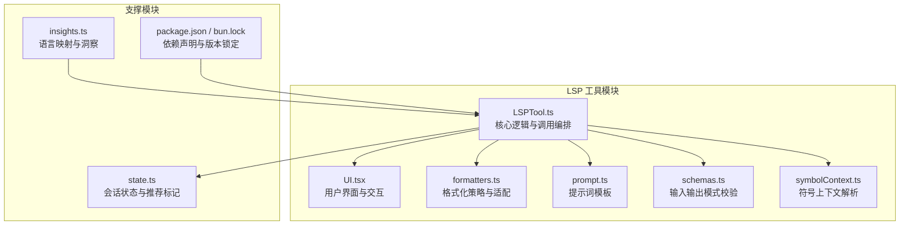
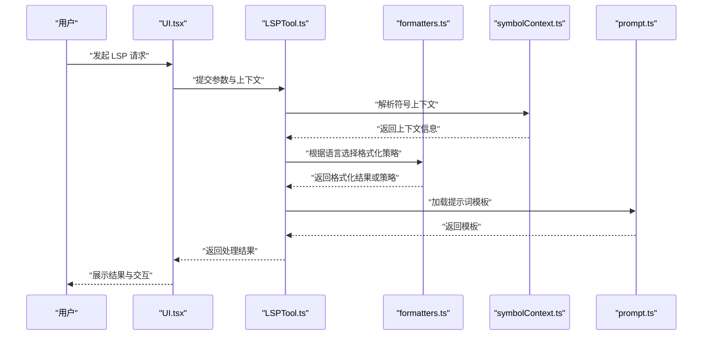
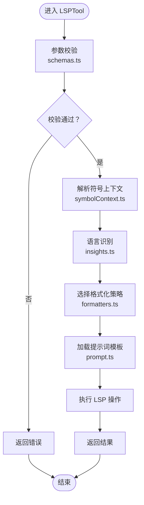
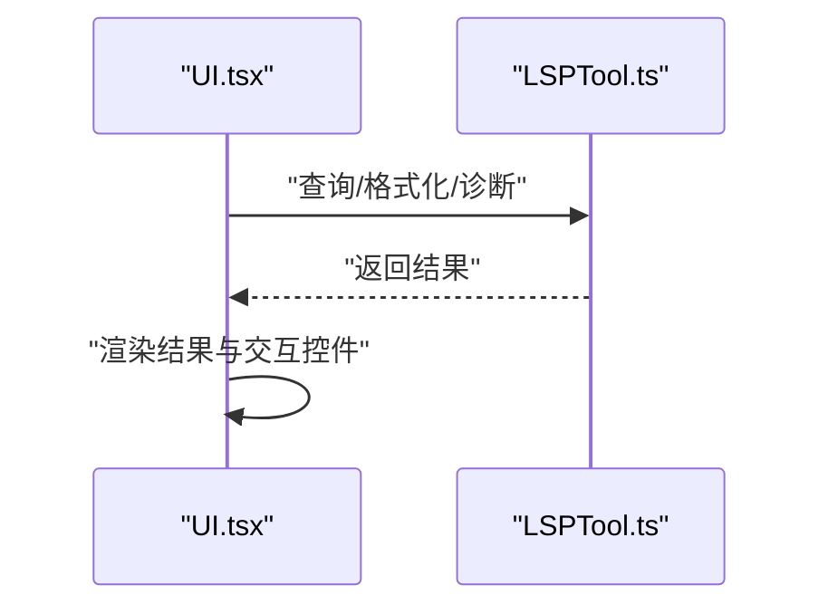
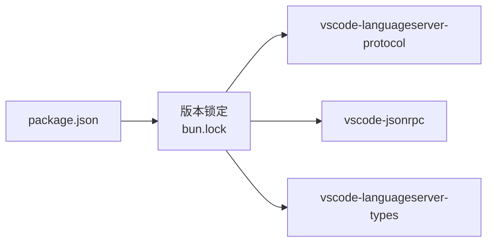

# LSP 工具

<cite>
**本文引用的文件**   
- [LSPTool.ts](file://src/tools/LSPTool/LSPTool.ts)
- [UI.tsx](file://src/tools/LSPTool/UI.tsx)
- [formatters.ts](file://src/tools/LSPTool/formatters.ts)
- [prompt.ts](file://src/tools/LSPTool/prompt.ts)
- [schemas.ts](file://src/tools/LSPTool/schemas.ts)
- [symbolContext.ts](file://src/tools/LSPTool/symbolContext.ts)
- [state.ts](file://src/bootstrap/state.ts)
- [insights.ts](file://src/commands/insights.ts)
- [package.json](file://package.json)
- [bun.lock](file://bun.lock)
</cite>

## 目录
1. [简介](#简介)
2. [项目结构](#项目结构)
3. [核心组件](#核心组件)
4. [架构总览](#架构总览)
5. [详细组件分析](#详细组件分析)
6. [依赖分析](#依赖分析)
7. [性能考虑](#性能考虑)
8. [故障排除指南](#故障排除指南)
9. [结论](#结论)
10. [附录](#附录)

## 简介
本文件系统性阐述 LSP 工具（LSPTool）的技术实现与使用方法，覆盖语言服务器协议（LSP）在本项目中的集成方式，以及与 IDE 的交互、语言服务器管理、代码格式化、符号上下文解析与错误诊断等能力。文档同时给出架构设计、关键流程图、配置要点与最佳实践，帮助开发者快速理解并扩展该工具。

## 项目结构
LSPTool 位于工具目录下，采用“按功能分层”的组织方式：核心逻辑、UI 展示、格式化器、提示词模板、模式校验与符号上下文解析模块相互解耦，便于维护与扩展。

**图表来源**
- [LSPTool.ts](file://src/tools/LSPTool/LSPTool.ts)
- [UI.tsx](file://src/tools/LSPTool/UI.tsx)
- [formatters.ts](file://src/tools/LSPTool/formatters.ts)
- [prompt.ts](file://src/tools/LSPTool/prompt.ts)
- [schemas.ts](file://src/tools/LSPTool/schemas.ts)
- [symbolContext.ts](file://src/tools/LSPTool/symbolContext.ts)
- [state.ts](file://src/bootstrap/state.ts)
- [insights.ts](file://src/commands/insights.ts)
- [package.json](file://package.json)
- [bun.lock](file://bun.lock)

**章节来源**
- [LSPTool.ts](file://src/tools/LSPTool/LSPTool.ts)
- [UI.tsx](file://src/tools/LSPTool/UI.tsx)
- [formatters.ts](file://src/tools/LSPTool/formatters.ts)
- [prompt.ts](file://src/tools/LSPTool/prompt.ts)
- [schemas.ts](file://src/tools/LSPTool/schemas.ts)
- [symbolContext.ts](file://src/tools/LSPTool/symbolContext.ts)
- [state.ts](file://src/bootstrap/state.ts)
- [insights.ts](file://src/commands/insights.ts)
- [package.json](file://package.json)
- [bun.lock](file://bun.lock)

## 核心组件
- LSPTool.ts：工具入口与编排，负责接收请求、选择语言服务器、调用格式化器、构建符号上下文、生成提示词并返回结果。
- UI.tsx：提供可视化界面与交互控件，用于展示 LSP 结果、切换语言、触发格式化等。
- formatters.ts：封装不同语言的格式化策略，统一对外接口，屏蔽底层差异。
- prompt.ts：集中管理提示词模板，确保与语言服务器交互的一致性与可维护性。
- schemas.ts：对输入参数与输出结构进行模式校验，保障数据一致性与健壮性。
- symbolContext.ts：解析当前光标位置的符号上下文，辅助智能提示与诊断。
- state.ts：维护会话状态，如是否已展示 LSP 插件推荐等。
- insights.ts：提供从文件路径到语言名称的映射，辅助自动识别语言类型。

**章节来源**
- [LSPTool.ts](file://src/tools/LSPTool/LSPTool.ts)
- [UI.tsx](file://src/tools/LSPTool/UI.tsx)
- [formatters.ts](file://src/tools/LSPTool/formatters.ts)
- [prompt.ts](file://src/tools/LSPTool/prompt.ts)
- [schemas.ts](file://src/tools/LSPTool/schemas.ts)
- [symbolContext.ts](file://src/tools/LSPTool/symbolContext.ts)
- [state.ts](file://src/bootstrap/state.ts)
- [insights.ts](file://src/commands/insights.ts)

## 架构总览
LSPTool 的整体架构围绕“请求-编排-执行-反馈”展开：前端 UI 触发请求；后端 LSPTool 负责解析上下文、选择语言服务器、调用格式化器与符号解析，并通过提示词模板生成最终响应。

**图表来源**
- [LSPTool.ts](file://src/tools/LSPTool/LSPTool.ts)
- [UI.tsx](file://src/tools/LSPTool/UI.tsx)
- [formatters.ts](file://src/tools/LSPTool/formatters.ts)
- [symbolContext.ts](file://src/tools/LSPTool/symbolContext.ts)
- [prompt.ts](file://src/tools/LSPTool/prompt.ts)

## 详细组件分析

### LSPTool.ts：核心编排与调用
- 输入参数校验：基于 schemas.ts 的模式进行参数校验，避免非法输入导致后续流程异常。
- 符号上下文解析：调用 symbolContext.ts 获取当前光标处的符号上下文，为智能提示与诊断提供依据。
- 语言识别与格式化：结合 insights.ts 的语言映射与 formatters.ts 的格式化策略，选择合适的语言服务器与格式化规则。
- 提示词生成：通过 prompt.ts 加载模板，拼接上下文与用户意图，形成标准化提示词。
- 结果返回：将格式化后的文本、诊断信息与符号上下文一并返回给 UI 展示。

**图表来源**
- [LSPTool.ts](file://src/tools/LSPTool/LSPTool.ts)
- [schemas.ts](file://src/tools/LSPTool/schemas.ts)
- [symbolContext.ts](file://src/tools/LSPTool/symbolContext.ts)
- [insights.ts](file://src/commands/insights.ts)
- [formatters.ts](file://src/tools/LSPTool/formatters.ts)
- [prompt.ts](file://src/tools/LSPTool/prompt.ts)

**章节来源**
- [LSPTool.ts](file://src/tools/LSPTool/LSPTool.ts)
- [schemas.ts](file://src/tools/LSPTool/schemas.ts)
- [symbolContext.ts](file://src/tools/LSPTool/symbolContext.ts)
- [insights.ts](file://src/commands/insights.ts)
- [formatters.ts](file://src/tools/LSPTool/formatters.ts)
- [prompt.ts](file://src/tools/LSPTool/prompt.ts)

### UI.tsx：界面与交互
- 功能概览：提供 LSP 结果展示、语言切换、格式化触发、诊断高亮等交互能力。
- 状态绑定：与 LSPTool.ts 的返回结果联动，动态更新界面状态。
- 用户引导：在首次使用时提示 LSP 插件推荐，参考 state.ts 中的状态标记。

**图表来源**
- [UI.tsx](file://src/tools/LSPTool/UI.tsx)
- [LSPTool.ts](file://src/tools/LSPTool/LSPTool.ts)

**章节来源**
- [UI.tsx](file://src/tools/LSPTool/UI.tsx)
- [LSPTool.ts](file://src/tools/LSPTool/LSPTool.ts)
- [state.ts](file://src/bootstrap/state.ts)

### formatters.ts：格式化策略与适配
- 多语言支持：针对不同语言提供统一的格式化接口，内部按语言选择具体策略。
- 可扩展性：新增语言只需在现有框架内补充对应策略，无需改动上层调用逻辑。
- 错误处理：对格式化失败的情况进行捕获与回退，保证流程稳定性。

**章节来源**
- [formatters.ts](file://src/tools/LSPTool/formatters.ts)

### symbolContext.ts：符号上下文解析
- 光标定位：根据当前编辑位置提取最近的符号边界与作用域信息。
- 上下文增强：将符号上下文注入提示词与诊断，提升智能提示与修复建议的准确性。

**章节来源**
- [symbolContext.ts](file://src/tools/LSPTool/symbolContext.ts)

### prompt.ts：提示词模板
- 模板化：将提示词拆分为多个片段，便于复用与定制。
- 一致性：确保不同语言与场景下的提示词风格一致，降低理解成本。

**章节来源**
- [prompt.ts](file://src/tools/LSPTool/prompt.ts)

### schemas.ts：输入输出模式校验
- 参数约束：对必填字段、类型与范围进行严格校验，减少运行期异常。
- 输出规范：对返回结构进行约束，便于 UI 与外部系统消费。

**章节来源**
- [schemas.ts](file://src/tools/LSPTool/schemas.ts)

### state.ts：会话状态与推荐标记
- 推荐跟踪：记录是否已在当前会话中展示过 LSP 插件推荐，避免重复打扰。
- 会话生命周期：配合自动模式切换等场景，维护状态一致性。

**章节来源**
- [state.ts](file://src/bootstrap/state.ts)

### insights.ts：语言映射与洞察
- 扩展名到语言名映射：提供常见文件扩展名与语言名称的映射表，辅助自动识别。
- 洞察集成：可与其他洞察模块协作，提供更丰富的上下文信息。

**章节来源**
- [insights.ts](file://src/commands/insights.ts)

## 依赖分析
- LSP 协议相关依赖：项目通过包管理器引入 LSP 协议与 JSON-RPC 实现，确保与标准 LSP 客户端/服务器兼容。
- 版本锁定：bun.lock 与 package.json 明确了依赖版本，保证构建与运行环境稳定。

**图表来源**
- [package.json](file://package.json)
- [bun.lock](file://bun.lock)

**章节来源**
- [package.json](file://package.json)
- [bun.lock](file://bun.lock)

## 性能考虑
- 缓存策略：对频繁使用的符号上下文与格式化结果进行缓存，减少重复计算。
- 异步处理：将耗时的 LSP 操作异步化，避免阻塞 UI 响应。
- 降级回退：当语言服务器不可用或格式化失败时，提供默认策略或提示，保证可用性。
- 并行优化：在不影响一致性的前提下，尽可能并行执行独立任务（如并发格式化多个文件段）。

## 故障排除指南
- 无法连接语言服务器
  - 检查 LSP 服务器是否正确安装与启动。
  - 确认网络与进程权限正常。
- 格式化失败
  - 查看 formatters.ts 的错误分支，确认是否触发了回退策略。
  - 检查目标语言是否在支持列表中。
- 符号上下文为空
  - 确认当前光标位置是否有效。
  - 检查 symbolContext.ts 的解析逻辑是否被正确调用。
- UI 不显示结果
  - 检查 LSPTool.ts 是否成功返回数据。
  - 确认 UI.tsx 的状态绑定逻辑是否正确。

**章节来源**
- [LSPTool.ts](file://src/tools/LSPTool/LSPTool.ts)
- [UI.tsx](file://src/tools/LSPTool/UI.tsx)
- [formatters.ts](file://src/tools/LSPTool/formatters.ts)
- [symbolContext.ts](file://src/tools/LSPTool/symbolContext.ts)

## 结论
LSPTool 将 LSP 协议、格式化策略、符号上下文与提示词模板有机结合，形成一套可扩展、可维护的语言智能工具链。通过清晰的模块划分与稳健的错误处理机制，它能够为多语言开发提供一致的智能体验。未来可在以下方向持续演进：增加更多语言的格式化策略、优化符号解析算法、完善诊断与修复建议的自动化程度。

## 附录

### 使用示例与配置指南
- 启动与集成
  - 在 IDE 中启用 LSP 插件，确保 LSPTool 可以访问语言服务器。
  - 通过 UI 触发 LSP 查询、格式化或诊断操作。
- 多语言支持
  - 利用 insights.ts 的语言映射自动识别文件语言。
  - 在 formatters.ts 中添加新语言的格式化策略。
- 自定义格式化规则
  - 在 formatters.ts 内部扩展对应语言的格式化逻辑。
  - 通过 prompt.ts 调整提示词模板，以适配新的业务需求。
- 配置项建议
  - 语言识别：确保扩展名映射完整，覆盖项目常用文件类型。
  - 格式化：为每种语言提供稳定的默认规则，并允许用户覆盖。
  - 诊断：结合符号上下文与提示词模板，提升诊断准确率与可读性。

**章节来源**
- [insights.ts](file://src/commands/insights.ts)
- [formatters.ts](file://src/tools/LSPTool/formatters.ts)
- [prompt.ts](file://src/tools/LSPTool/prompt.ts)
- [UI.tsx](file://src/tools/LSPTool/UI.tsx)