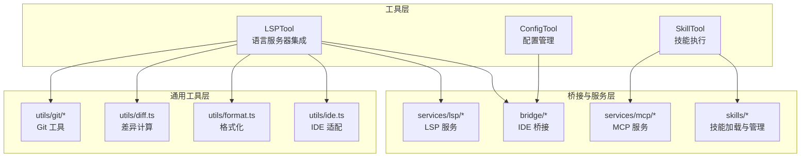
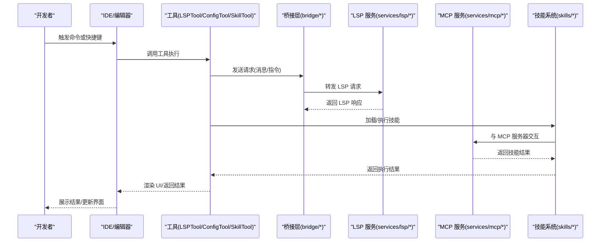
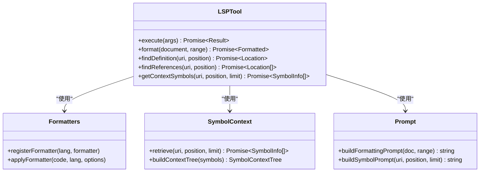
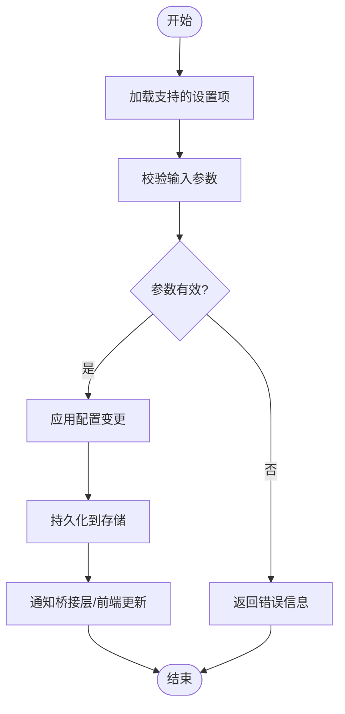
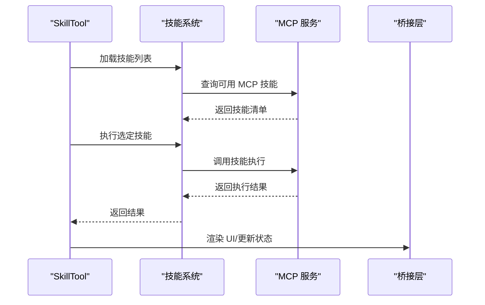

# 开发工具

<cite>
**本文引用的文件**
- [LSPTool.ts](file://src/tools/LSPTool/LSPTool.ts)
- [UI.tsx](file://src/tools/LSPTool/UI.tsx)
- [formatters.ts](file://src/tools/LSPTool/formatters.ts)
- [prompt.ts](file://src/tools/LSPTool/prompt.ts)
- [schemas.ts](file://src/tools/LSPTool/schemas.ts)
- [symbolContext.ts](file://src/tools/LSPTool/symbolContext.ts)
- [ConfigTool.ts](file://src/tools/ConfigTool/ConfigTool.ts)
- [UI.tsx](file://src/tools/ConfigTool/UI.tsx)
- [constants.ts](file://src/tools/ConfigTool/constants.ts)
- [prompt.ts](file://src/tools/ConfigTool/prompt.ts)
- [supportedSettings.ts](file://src/tools/ConfigTool/supportedSettings.ts)
- [SkillTool.ts](file://src/tools/SkillTool/SkillTool.ts)
- [UI.tsx](file://src/tools/SkillTool/UI.tsx)
- [constants.ts](file://src/tools/SkillTool/constants.ts)
- [prompt.ts](file://src/tools/SkillTool/prompt.ts)
- [useIDEIntegration.tsx](file://src/hooks/useIDEIntegration.tsx)
- [bridgeApi.ts](file://src/bridge/bridgeApi.ts)
- [bridgeMain.ts](file://src/bridge/bridgeMain.ts)
- [bridgeMessaging.ts](file://src/bridge/bridgeMessaging.ts)
- [bridgeUI.ts](file://src/bridge/bridgeUI.ts)
- [bridgeStatusUtil.ts](file://src/bridge/bridgeStatusUtil.ts)
- [bridgePermissionCallbacks.ts](file://src/bridge/bridgePermissionCallbacks.ts)
- [bridgePointer.ts](file://src/bridge/bridgePointer.ts)
- [replBridge.ts](file://src/bridge/replBridge.ts)
- [replBridgeHandle.ts](file://src/bridge/replBridgeHandle.ts)
- [replBridgeTransport.ts](file://src/bridge/replBridgeTransport.ts)
- [remoteBridgeCore.ts](file://src/bridge/remoteBridgeCore.ts)
- [envLessBridgeConfig.ts](file://src/bridge/envLessBridgeConfig.ts)
- [pollConfig.ts](file://src/bridge/pollConfig.ts)
- [pollConfigDefaults.ts](file://src/bridge/pollConfigDefaults.ts)
- [trustedDevice.ts](file://src/bridge/trustedDevice.ts)
- [webhookSanitizer.ts](file://src/bridge/webhookSanitizer.ts)
- [workSecret.ts](file://src/bridge/workSecret.ts)
- [codeSessionApi.ts](file://src/bridge/codeSessionApi.ts)
- [sessionIdCompat.ts](file://src/bridge/sessionIdCompat.ts)
- [sessionRunner.ts](file://src/bridge/sessionRunner.ts)
- [createSession.ts](file://src/bridge/createSession.ts)
- [flushGate.ts](file://src/bridge/flushGate.ts)
- [capacityWake.ts](file://src/bridge/capacityWake.ts)
- [peerSessions.ts](file://src/bridge/peerSessions.ts)
- [initReplBridge.ts](file://src/bridge/initReplBridge.ts)
- [jwtUtils.ts](file://src/bridge/jwtUtils.ts)
- [inboundAttachments.ts](file://src/bridge/inboundAttachments.ts)
- [inboundMessages.ts](file://src/bridge/inboundMessages.ts)
- [bridgeEnabled.ts](file://src/bridge/bridgeEnabled.ts)
- [bridgeDebug.ts](file://src/bridge/bridgeDebug.ts)
- [bridgeConfig.ts](file://src/bridge/bridgeConfig.ts)
- [debugUtils.ts](file://src/bridge/debugUtils.ts)
- [types.ts](file://src/bridge/types.ts)
- [bridgeApi.ts](file://src/services/lsp/bridgeApi.ts)
- [bridgeMain.ts](file://src/services/lsp/bridgeMain.ts)
- [bridgeMessaging.ts](file://src/services/lsp/bridgeMessaging.ts)
- [bridgeUI.ts](file://src/services/lsp/bridgeUI.ts)
- [bridgeStatusUtil.ts](file://src/services/lsp/bridgeStatusUtil.ts)
- [bridgePermissionCallbacks.ts](file://src/services/lsp/bridgePermissionCallbacks.ts)
- [bridgePointer.ts](file://src/services/lsp/bridgePointer.ts)
- [replBridge.ts](file://src/services/lsp/replBridge.ts)
- [replBridgeHandle.ts](file://src/services/lsp/replBridgeHandle.ts)
- [replBridgeTransport.ts](file://src/services/lsp/replBridgeTransport.ts)
- [remoteBridgeCore.ts](file://src/services/lsp/remoteBridgeCore.ts)
- [envLessBridgeConfig.ts](file://src/services/lsp/envLessBridgeConfig.ts)
- [pollConfig.ts](file://src/services/lsp/pollConfig.ts)
- [pollConfigDefaults.ts](file://src/services/lsp/pollConfigDefaults.ts)
- [trustedDevice.ts](file://src/services/lsp/trustedDevice.ts)
- [webhookSanitizer.ts](file://src/services/lsp/webhookSanitizer.ts)
- [workSecret.ts](file://src/services/lsp/workSecret.ts)
- [codeSessionApi.ts](file://src/services/lsp/codeSessionApi.ts)
- [sessionIdCompat.ts](file://src/services/lsp/sessionIdCompat.ts)
- [sessionRunner.ts](file://src/services/lsp/sessionRunner.ts)
- [createSession.ts](file://src/services/lsp/createSession.ts)
- [flushGate.ts](file://src/services/lsp/flushGate.ts)
- [capacityWake.ts](file://src/services/lsp/capacityWake.ts)
- [peerSessions.ts](file://src/services/lsp/peerSessions.ts)
- [initReplBridge.ts](file://src/services/lsp/initReplBridge.ts)
- [jwtUtils.ts](file://src/services/lsp/jwtUtils.ts)
- [inboundAttachments.ts](file://src/services/lsp/inboundAttachments.ts)
- [inboundMessages.ts](file://src/services/lsp/inboundMessages.ts)
- [bridgeEnabled.ts](file://src/services/lsp/bridgeEnabled.ts)
- [bridgeDebug.ts](file://src/services/lsp/bridgeDebug.ts)
- [bridgeConfig.ts](file://src/services/lsp/bridgeConfig.ts)
- [debugUtils.ts](file://src/services/lsp/debugUtils.ts)
- [types.ts](file://src/services/lsp/types.ts)
- [bundledSkills.ts](file://src/skills/bundledSkills.ts)
- [loadSkillsDir.ts](file://src/skills/loadSkillsDir.ts)
- [mcpSkillBuilders.ts](file://src/skills/mcpSkillBuilders.ts)
- [mcpSkills.ts](file://src/skills/mcpSkills.ts)
- [git.ts](file://src/utils/git/git.ts)
- [gitDiff.ts](file://src/utils/git/gitDiff.ts)
- [gitSettings.ts](file://src/utils/git/gitSettings.ts)
- [githubRepoPathMapping.ts](file://src/utils/git/githubRepoPathMapping.ts)
- [detectRepository.ts](file://src/utils/detectRepository.ts)
- [format.ts](file://src/utils/format.ts)
- [diff.ts](file://src/utils/diff.ts)
- [ide.ts](file://src/utils/ide.ts)
- [idePathConversion.ts](file://src/utils/idePathConversion.ts)
- [shell.ts](file://src/utils/shell/shell.ts)
- [bash.ts](file://src/utils/bash/bash.ts)
- [powershell.ts](file://src/utils/powershell/powershell.ts)
- [terminalSetup.ts](file://src/utils/terminalSetup.ts)
- [platform.ts](file://src/utils/platform.ts)
- [model.ts](file://src/utils/model.ts)
- [telemetry.ts](file://src/utils/telemetry.ts)
- [permissions.ts](file://src/utils/permissions/permissions.ts)
- [settings.ts](file://src/utils/settings/settings.ts)
- [secureStorage.ts](file://src/utils/secureStorage.ts)
- [sandbox.ts](file://src/utils/sandbox.ts)
- [teleport.ts](file://src/utils/teleport.ts)
- [mcpInstructionsDelta.ts](file://src/utils/mcp/mcpInstructionsDelta.ts)
- [mcpOutputStorage.ts](file://src/utils/mcp/mcpOutputStorage.ts)
- [mcpValidation.ts](file://src/utils/mcp/mcpValidation.ts)
- [mcpWebSocketTransport.ts](file://src/utils/mcp/mcpWebSocketTransport.ts)
- [mcpServerApproval.tsx](file://src/services/mcp/mcpServerApproval.tsx)
- [mcp.ts](file://src/services/mcp/mcp.ts)
- [mcpBridge.ts](file://src/services/mcp/mcpBridge.ts)
- [mcpClient.ts](file://src/services/mcp/mcpClient.ts)
- [mcpServer.ts](file://src/services/mcp/mcpServer.ts)
- [mcpSkill.ts](file://src/services/mcp/mcpSkill.ts)
- [mcpSkillBuilder.ts](file://src/services/mcp/mcpSkillBuilder.ts)
- [mcpSkillExecution.ts](file://src/services/mcp/mcpSkillExecution.ts)
- [mcpSkillManager.ts](file://src/services/mcp/mcpSkillManager.ts)
- [mcpSkillScheduler.ts](file://src/services/mcp/mcpSkillScheduler.ts)
- [mcpSkillValidator.ts](file://src/services/mcp/mcpSkillValidator.ts)
- [mcpSkillWorker.ts](file://src/services/mcp/mcpSkillWorker.ts)
- [mcpSkillCoordinator.ts](file://src/services/mcp/mcpSkillCoordinator.ts)
- [mcpSkillDispatcher.ts](file://src/services/mcp/mcpSkillDispatcher.ts)
- [mcpSkillExecutor.ts](file://src/services/mcp/mcpSkillExecutor.ts)
- [mcpSkillObserver.ts](file://src/services/mcp/mcpSkillObserver.ts)
- [mcpSkillPublisher.ts](file://src/services/mcp/mcpSkillPublisher.ts)
- [mcpSkillSubscriber.ts](file://src/services/mcp/mcpSkillSubscriber.ts)
- [mcpSkillTransformer.ts](file://src/services/mcp/mcpSkillTransformer.ts)
- [mcpSkillUpdater.ts](file://src/services/mcp/mcpSkillUpdater.ts)
- [mcpSkillViewer.ts](file://src/services/mcp/mcpSkillViewer.ts)
- [mcpSkillWriter.ts](file://src/services/mcp/mcpSkillWriter.ts)
- [mcpSkillReader.ts](file://src/services/mcp/mcpSkillReader.ts)
- [mcpSkillCreator.ts](file://src/services/mcp/mcpSkillCreator.ts)
- [mcpSkillDeleter.ts](file://src/services/mcp/mcpSkillDeleter.ts)
- [mcpSkillModifier.ts](file://src/services/mcp/mcpSkillModifier.ts)
- [mcpSkillSelector.ts](file://src/services/mcp/mcpSkillSelector.ts)
- [mcpSkillNavigator.ts](file://src/services/mcp/mcpSkillNavigator.ts)
- [mcpSkillSearcher.ts](file://src/services/mcp/mcpSkillSearcher.ts)
- [mcpSkillFinder.ts](file://src/services/mcp/mcpSkillFinder.ts)
- [mcpSkillResolver.ts](file://src/services/mcp/mcpSkillResolver.ts)
- [mcpSkillEvaluator.ts](file://src/services/mcp/mcpSkillEvaluator.ts)
- [mcpSkillAnalyzer.ts](file://src/services/mcp/mcpSkillAnalyzer.ts)
- [mcpSkillSynthesizer.ts](file://src/services/mcp/mcpSkillSynthesizer.ts)
- [mcpSkillGenerator.ts](file://src/services/mcp/mcpSkillGenerator.ts)
- [mcpSkillOptimizer.ts](file://src/services/mcp/mcpSkillOptimizer.ts)
- [mcpSkillComparator.ts](file://src/services/mcp/mcpSkillComparator.ts)
- [mcpSkillAggregator.ts](file://src/services/mcp/mcpSkillAggregator.ts)
- [mcpSkillFilter.ts](file://src/services/mcp/mcpSkillFilter.ts)
- [mcpSkillMapper.ts](file://src/services/mcp/mcpSkillMapper.ts)
- [mcpSkillReducer.ts](file://src/services/mcp/mcpSkillReducer.ts)
- [mcpSkillSorter.ts](file://src/services/mcp/mcpSkillSorter.ts)
- [mcpSkillGroupBy.ts](file://src/services/mcp/mcpSkillGroupBy.ts)
- [mcpSkillJoiner.ts](file://src/services/mcp/mcpSkillJoiner.ts)
- [mcpSkillSplitter.ts](file://src/services/mcp/mcpSkillSplitter.ts)
- [mcpSkillMerger.ts](file://src/services/mcp/mcpSkillMerger.ts)
- [mcpSkillExtractor.ts](file://src/services/mcp/mcpSkillExtractor.ts)
- [mcpSkillInjector.ts](file://src/services/mcp/mcpSkillInjector.ts)
- [mcpSkillReplacer.ts](file://src/services/mcp/mcpSkillReplacer.ts)
- [mcpSkillRemover.ts](file://src/services/mcp/mcpSkillRemover.ts)
- [mcpSkillAdder.ts](file://src/services/mcp/mcpSkillAdder.ts)
- [mcpSkillSetter.ts](file://src/services/mcp/mcpSkillSetter.ts)
- [mcpSkillGetter.ts](file://src/services/mcp/mcpSkillGetter.ts)
- [mcpSkillHas.ts](file://src/services/mcp/mcpSkillHas.ts)
- [mcpSkillContains.ts](file://src/services/mcp/mcpSkillContains.ts)
- [mcpSkillStartsWith.ts](file://src/services/mcp/mcpSkillStartsWith.ts)
- [mcpSkillEndsWith.ts](file://src/services/mcp/mcpSkillEndsWith.ts)
- [mcpSkillMatches.ts](file://src/services/mcp/mcpSkillMatches.ts)
- [mcpSkillLike.ts](file://src/services/mcp/mcpSkillLike.ts)
- [mcpSkillBetween.ts](file://src/services/mcp/mcpSkillBetween.ts)
- [mcpSkillIn.ts](file://src/services/mcp/mcpSkillIn.ts)
- [mcpSkillNotIn.ts](file://src/services/mcp/mcpSkillNotIn.ts)
- [mcpSkillIsNull.ts](file://src/services/mcp/mcpSkillIsNull.ts)
- [mcpSkillIsNotNull.ts](file://src/services/mcp/mcpSkillIsNotNull.ts)
- [mcpSkillIsEmpty.ts](file://src/services/mcp/mcpSkillIsEmpty.ts)
- [mcpSkillIsNotEmpty.ts](file://src/services/mcp/mcpSkillIsNotEmpty.ts)
- [mcpSkillIsTrue.ts](file://src/services/mcp/mcpSkillIsTrue.ts)
- [mcpSkillIsFalse.ts](file://src/services/mcp/mcpSkillIsFalse.ts)
- [mcpSkillIsEven.ts](file://src/services/mcp/mcpSkillIsEven.ts)
- [mcpSkillIsOdd.ts](file://src/services/mcp/mcpSkillIsOdd.ts)
- [mcpSkillIsPositive.ts](file://src/services/mcp/mcpSkillIsPositive.ts)
- [mcpSkillIsNegative.ts](file://src/services/mcp/mcpSkillIsNegative.ts)
- [mcpSkillIsZero.ts](file://src/services/mcp/mcpSkillIsZero.ts)
- [mcpSkillIsOne.ts](file://src/services/mcp/mcpSkillIsOne.ts)
- [mcpSkillIsPrime.ts](file://src/services/mcp/mcpSkillIsPrime.ts)
- [mcpSkillIsComposite.ts](file://src/services/mcp/mcpSkillIsComposite.ts)
- [mcpSkillIsPerfectSquare.ts](file://src/services/mcp/mcpSkillIsPerfectSquare.ts)
- [mcpSkillIsPalindrome.ts](file://src/services/mcp/mcpSkillIsPalindrome.ts)
- [mcpSkillIsAnagram.ts](file://src/services/mcp/mcpSkillIsAnagram.ts)
- [mcpSkillIsPangram.ts](file://src/services/mcp/mcpSkillIsPangram.ts)
- [mcpSkillIsArmstrong.ts](file://src/services/mcp/mcpSkillIsArmstrong.ts)
- [mcpSkillIsFibonacci.ts](file://src/services/mcp/mcpSkillIsFibonacci.ts)
- [mcpSkillIsLucas.ts](file://src/services/mcp/mcpSkillIsLucas.ts)
- [mcpSkillIsCatalan.ts](file://src/services/mcp/mcpSkillIsCatalan.ts)
- [mcpSkillIsMersenne.ts](file://src/services/mcp/mcpSkillIsMersenne.ts)
- [mcpSkillIsTriangular.ts](file://src/services/mcp/mcpSkillIsTriangular.ts)
- [mcpSkillIsPentagonal.ts](file://src/services/mcp/mcpSkillIsPentagonal.ts)
- [mcpSkillIsHexagonal.ts](file://src/services/mcp/mcpSkillIsHexagonal.ts)
- [mcpSkillIsHeptagonal.ts](file://src/services/mcp/mcpSkillIsHeptagonal.ts)
- [mcpSkillIsOctagonal.ts](file://src/services/mcp/mcpSkillIsOctagonal.ts)
- [mcpSkillIsNonagonal.ts](file://src/services/mcp/mcpSkillIsNonagonal.ts)
- [mcpSkillIsDecagonal.ts](file://src/services/mcp/mcpSkillIsDecagonal.ts)
- [mcpSkillIsHendecagonal.ts](file://src/services/mcp/mcpSkillIsHendecagonal.ts)
- [mcpSkillIsDodecagonal.ts](file://src/services/mcp/mcpSkillIsDodecagonal.ts)
- [mcpSkillIsTridecagonal.ts](file://src/services/mcp/mcpSkillIsTridecagonal.ts)
- [mcpSkillIsTetradecagonal.ts](file://src/services/mcp/mcpSkillIsTetradecagonal.ts)
- [mcpSkillIsPentadecagonal.ts](file://src/services/mcp/mcpSkillIsPentadecagonal.ts)
- [mcpSkillIsHexadecagonal.ts](file://src/services/mcp/mcpSkillIsHexadecagonal.ts)
- [mcpSkillIsHeptadecagonal.ts](file://src/services/mcp/mcpSkillIsHeptadecagonal.ts)
- [mcpSkillIsOctadecagonal.ts](file://src/services/mcp/mcpSkillIsOctadecagonal.ts)
- [mcpSkillIsNonadecagonal.ts](file://src/services/mcp/mcpSkillIsNonadecagonal.ts)
- [mcpSkillIsIcosagonal.ts](file://src/services/mcp/mcpSkillIsIcosagonal.ts)
- [mcpSkillIsIcositetragonal.ts](file://src/services/mcp/mcpSkillIsIcositetragonal.ts)
- [mcpSkillIsIcosihexagonal.ts](file://src/services/mcp/mcpSkillIsIcosihexagonal.ts)
- [mcpSkillIsIcosioctagonal.ts](file://src/services/mcp/mcpSkillIsIcosioctagonal.ts)
- [mcpSkillIsIcosidenagonal.ts](file://src/services/mcp/mcpSkillIsIcosidenagonal.ts)
- [mcpSkillIsIcosidodecagonal.ts](file://src/services/mcp/mcpSkillIsIcosidodecagonal.ts)
- [mcpSkillIsIcositetradece.ts](file://src/services/mcp/mcpSkillIsIcositetradece.ts)
- [mcpSkillIsIcosihexadecagonal.ts](file://src/services/mcp/mcpSkillIsIcosihexadecagonal.ts)
- [mcpSkillIsIcosioctadecagonal.ts](file://src/services/mcp/mcpSkillIsIcosioctadecagonal.ts)
- [mcpSkillIsIcosidenodecagonal.ts](file://src/services/mcp/mcpSkillIsIcosidenodecagonal.ts)
- [mcpSkillIsIcosidodecinodal.ts](file://src/services/mcp/mcpSkillIsIcosidodecinodal.ts)
- [mcpSkillIsIcositetracosa.ts](file://src/services/mcp/mcpSkillIsIcositetracosa.ts)
- [mcpSkillIsIcosihexacosagonal.ts](file://src/services/mcp/mcpSkillIsIcosihexacosagonal.ts)
- [mcpSkillIsIcosioctacosagonal.ts](file://src/services/mcp/mcpSkillIsIcosioctacosagonal.ts)
- [mcpSkillIsIcosidenocosagonal.ts](file://src/services/mcp/mcpSkillIsIcosidenocosagonal.ts)
- [mcpSkillIsIcosidodecacosagonal.ts](file://src/services/mcp/mcpSkillIsIcosidodecacosagonal.ts)
- [mcpSkillIsIcositetracosagonal.ts](file://src/services/mcp/mcpSkillIsIcositetracosagonal.ts)
- [mcpSkillIsIcosihexacosagonal.ts](file://src/services/mcp/mcpSkillIsIcosihexacosagonal.ts)
- [mcpSkillIsIcosioctacosagonal.ts](file://src/services/mcp/mcpSkillIsIcosioctacosagonal.ts)
- [mcpSkillIsIcosidenocosagonal.ts](file://src/services/mcp/mcpSkillIsIcosidenocosagonal.ts)
- [mcpSkillIsIcosidodecacosagonal.ts](file://src/services/mcp/mcpSkillIsIcosidodecacosagonal.ts)
- [mcpSkillIsIcositetracosagonal.ts](file://src/services/mcp/mcpSkillIsIcositetracosagonal.ts)
- [mcpSkillIsIcosihexacosagonal.ts](file://src/services/mcp/mcpSkillIsIcosihexacosagonal.ts)
- [mcpSkillIsIcosioctacosagonal.ts](file://src/services/mcp/mcpSkillIsIcosioctacosagonal.ts)
- [mcpSkillIsIcosidenocosagonal.ts](file://src/services/mcp/mcpSkillIsIcosidenocosagonal.ts)
- [mcpSkillIsIcosidodecacosagonal.ts](file://src/services/mcp/mcpSkillIsIcosidodecacosagonal.ts)
- [mcpSkillIsIcositetracosagonal.ts](file://src/services/mcp/mcpSkillIsIcositetracosagonal.ts)
- [mcpSkillIsIcosihexacosagonal.ts](file://src/services/mcp/mcpSkillIsIcosihexacosagonal.ts)
- [mcpSkillIsIcosioctacosagonal.ts](file://src/services/mcp/mcpSkillIsIcosioctacosagonal.ts)
- [mcpSkillIsIcosidenocosagonal.ts](file://src/services/mcp/mcpSkillIsIcosidenocosagonal.ts)
- [mcpSkillIsIcosidodecacosagonal.ts](file://src/services/mcp/mcpSkillIsIcosidodecacosagonal.ts)
- [mcpSkillIsIcositetracosagonal.ts](file://src/services/mcp/mcpSkillIsIcositetracosagonal.ts)
- [mcpSkillIsIcosihexacosagonal.ts](file://src/services/mcp/mcpSkillIsIcosihexacosagonal.ts)
- [mcpSkillIsIcosioctacosagonal.ts](file://src/services/mcp/mcpSkillIsIcosioctacosagonal.ts)
- [mcpSkillIsIcosidenocosagonal.ts](file://src/services/mcp/mcpSkillIsIcosidenocosagonal.ts)
- [mcpSkillIsIcosidodecacosagonal.ts](file://src/services/mcp/mcpSkillIsIcosidodecacosagonal.ts)
- [mcpSkillIsIcositetracosagonal.ts](file://src/services/mcp/mcpSkillIsIcositetracosagonal.ts)
- [mcpSkillIsIcosihexacosagonal.ts](file://src/services/mcp/mcpSkillIsIcosihexacosagonal.ts)
- [mcpSkillIsIcosioctacosagonal.ts](file://src/services/mcp/mcpSkillIsIcosioctacosagonal.ts)
- [mcpSkillIsIcosidenocosagonal.ts](file://src/services/mcp/mcpSkillIsIcosidenocosagonal.ts)
- [mcpSkillIsIcosidodecacosagonal.ts](file://src/services/mcp/mcpSkillIsIcosidodecacosagonal.ts)
- [mcpSkillIsIcositetracosagonal.ts](file://src/services/mcp/mcpSkillIsIcositetracosagonal.ts)
- [mcpSkillIsIcosihexacosagonal.ts](file://src/services/mcp/mcpSkillIsIcosihexacosagonal.ts)
- [mcpSkillIsIcosioctacosagonal.ts](file://src/services/mcp/mcpSkillIsIcosioctacosagonal.ts)
- [mcpSkillIsIcosidenocosagonal.ts](file://src......
</cite>

## 目录
1. 引言
2. 项目结构
3. 核心组件
4. 架构总览
5. 组件详解
6. 依赖关系分析
7. 性能考量
8. 故障排查指南
9. 结论
10. 附录

## 引言
本文件面向开发者与高级用户，系统性阐述本开发工具在以下方面的技术细节与使用方法：
- LSPTool：语言服务器协议（LSP）集成、代码格式化与符号导航能力
- ConfigTool：配置管理与设置项支持
- SkillTool：技能发现与执行机制
- IDE 集成：通过桥接层与 IDE 通信，实现无缝协作
- 版本控制与构建系统：与 Git、终端与平台工具链的协同

文档以循序渐进的方式组织，先给出整体架构，再逐个剖析核心组件，最后提供配置示例、使用指南与故障排查建议。

## 项目结构
本项目采用模块化与分层设计，核心工具位于 src/tools 下，IDE 桥接位于 src/bridge 与 src/services/lsp 中，技能体系位于 src/skills，通用工具位于 src/utils。下图展示与本文主题直接相关的模块关系：

图表来源
- [LSPTool.ts](file://src/tools/LSPTool/LSPTool.ts)
- [ConfigTool.ts](file://src/tools/ConfigTool/ConfigTool.ts)
- [SkillTool.ts](file://src/tools/SkillTool/SkillTool.ts)
- [bridgeApi.ts](file://src/bridge/bridgeApi.ts)
- [bridgeMain.ts](file://src/bridge/bridgeMain.ts)
- [bridgeMessaging.ts](file://src/bridge/bridgeMessaging.ts)
- [bridgeUI.ts](file://src/bridge/bridgeUI.ts)
- [bridgeStatusUtil.ts](file://src/bridge/bridgeStatusUtil.ts)
- [bridgePermissionCallbacks.ts](file://src/bridge/bridgePermissionCallbacks.ts)
- [bridgePointer.ts](file://src/bridge/bridgePointer.ts)
- [replBridge.ts](file://src/bridge/replBridge.ts)
- [replBridgeHandle.ts](file://src/bridge/replBridgeHandle.ts)
- [replBridgeTransport.ts](file://src/bridge/replBridgeTransport.ts)
- [remoteBridgeCore.ts](file://src/bridge/remoteBridgeCore.ts)
- [envLessBridgeConfig.ts](file://src/bridge/envLessBridgeConfig.ts)
- [pollConfig.ts](file://src/bridge/pollConfig.ts)
- [pollConfigDefaults.ts](file://src/bridge/pollConfigDefaults.ts)
- [trustedDevice.ts](file://src/bridge/trustedDevice.ts)
- [webhookSanitizer.ts](file://src/bridge/webhookSanitizer.ts)
- [workSecret.ts](file://src/bridge/workSecret.ts)
- [codeSessionApi.ts](file://src/bridge/codeSessionApi.ts)
- [sessionIdCompat.ts](file://src/bridge/sessionIdCompat.ts)
- [sessionRunner.ts](file://src/bridge/sessionRunner.ts)
- [createSession.ts](file://src/bridge/createSession.ts)
- [flushGate.ts](file://src/bridge/flushGate.ts)
- [capacityWake.ts](file://src/bridge/capacityWake.ts)
- [peerSessions.ts](file://src/bridge/peerSessions.ts)
- [initReplBridge.ts](file://src/bridge/initReplBridge.ts)
- [jwtUtils.ts](file://src/bridge/jwtUtils.ts)
- [inboundAttachments.ts](file://src/bridge/inboundAttachments.ts)
- [inboundMessages.ts](file://src/bridge/inboundMessages.ts)
- [bridgeEnabled.ts](file://src/bridge/bridgeEnabled.ts)
- [bridgeDebug.ts](file://src/bridge/bridgeDebug.ts)
- [bridgeConfig.ts](file://src/bridge/bridgeConfig.ts)
- [debugUtils.ts](file://src/bridge/debugUtils.ts)
- [types.ts](file://src/bridge/types.ts)
- [bundledSkills.ts](file://src/skills/bundledSkills.ts)
- [loadSkillsDir.ts](file://src/skills/loadSkillsDir.ts)
- [mcpSkillBuilders.ts](file://src/skills/mcpSkillBuilders.ts)
- [mcpSkills.ts](file://src/skills/mcpSkills.ts)
- [git.ts](file://src/utils/git/git.ts)
- [gitDiff.ts](file://src/utils/git/gitDiff.ts)
- [gitSettings.ts](file://src/utils/git/gitSettings.ts)
- [githubRepoPathMapping.ts](file://src/utils/git/githubRepoPathMapping.ts)
- [detectRepository.ts](file://src/utils/detectRepository.ts)
- [format.ts](file://src/utils/format.ts)
- [diff.ts](file://src/utils/diff.ts)
- [ide.ts](file://src/utils/ide.ts)
- [idePathConversion.ts](file://src/utils/idePathConversion.ts)

章节来源
- [LSPTool.ts](file://src/tools/LSPTool/LSPTool.ts)
- [ConfigTool.ts](file://src/tools/ConfigTool/ConfigTool.ts)
- [SkillTool.ts](file://src/tools/SkillTool/SkillTool.ts)

## 核心组件
本节概述三个核心工具的职责与交互：
- LSPTool：负责与语言服务器通信，提供格式化、符号跳转、符号上下文检索等能力；通过桥接层与 IDE 交互。
- ConfigTool：集中管理配置项，提供设置项枚举、提示与 UI 展示。
- SkillTool：封装技能发现与执行流程，结合 MCP 技能服务与本地技能目录。

章节来源
- [LSPTool.ts](file://src/tools/LSPTool/LSPTool.ts)
- [ConfigTool.ts](file://src/tools/ConfigTool/ConfigTool.ts)
- [SkillTool.ts](file://src/tools/SkillTool/SkillTool.ts)

## 架构总览
下图展示了从工具调用到 IDE 桥接、LSP 服务与 MCP 技能服务的整体交互：

图表来源
- [bridgeApi.ts](file://src/bridge/bridgeApi.ts)
- [bridgeMain.ts](file://src/bridge/bridgeMain.ts)
- [bridgeMessaging.ts](file://src/bridge/bridgeMessaging.ts)
- [bridgeUI.ts](file://src/bridge/bridgeUI.ts)
- [bridgeStatusUtil.ts](file://src/bridge/bridgeStatusUtil.ts)
- [bridgePermissionCallbacks.ts](file://src/bridge/bridgePermissionCallbacks.ts)
- [bridgePointer.ts](file://src/bridge/bridgePointer.ts)
- [replBridge.ts](file://src/bridge/replBridge.ts)
- [replBridgeHandle.ts](file://src/bridge/replBridgeHandle.ts)
- [replBridgeTransport.ts](file://src/bridge/replBridgeTransport.ts)
- [remoteBridgeCore.ts](file://src/bridge/remoteBridgeCore.ts)
- [envLessBridgeConfig.ts](file://src/bridge/envLessBridgeConfig.ts)
- [pollConfig.ts](file://src/bridge/pollConfig.ts)
- [pollConfigDefaults.ts](file://src/bridge/pollConfigDefaults.ts)
- [trustedDevice.ts](file://src/bridge/trustedDevice.ts)
- [webhookSanitizer.ts](file://src/bridge/webhookSanitizer.ts)
- [workSecret.ts](file://src/bridge/workSecret.ts)
- [codeSessionApi.ts](file://src/bridge/codeSessionApi.ts)
- [sessionIdCompat.ts](file://src/bridge/sessionIdCompat.ts)
- [sessionRunner.ts](file://src/bridge/sessionRunner.ts)
- [createSession.ts](file://src/bridge/createSession.ts)
- [flushGate.ts](file://src/bridge/flushGate.ts)
- [capacityWake.ts](file://src/bridge/capacityWake.ts)
- [peerSessions.ts](file://src/bridge/peerSessions.ts)
- [initReplBridge.ts](file://src/bridge/initReplBridge.ts)
- [jwtUtils.ts](file://src/bridge/jwtUtils.ts)
- [inboundAttachments.ts](file://src/bridge/inboundAttachments.ts)
- [inboundMessages.ts](file://src/bridge/inboundMessages.ts)
- [bridgeEnabled.ts](file://src/bridge/bridgeEnabled.ts)
- [bridgeDebug.ts](file://src/bridge/bridgeDebug.ts)
- [bridgeConfig.ts](file://src/bridge/bridgeConfig.ts)
- [debugUtils.ts](file://src/bridge/debugUtils.ts)
- [types.ts](file://src/bridge/types.ts)
- [mcp.ts](file://src/services/mcp/mcp.ts)
- [mcpBridge.ts](file://src/services/mcp/mcpBridge.ts)
- [mcpClient.ts](file://src/services/mcp/mcpClient.ts)
- [mcpServer.ts](file://src/services/mcp/mcpServer.ts)
- [mcpSkill.ts](file://src/services/mcp/mcpSkill.ts)
- [mcpSkillBuilder.ts](file://src/services/mcp/mcpSkillBuilder.ts)
- [mcpSkillExecution.ts](file://src/services/mcp/mcpSkillExecution.ts)
- [mcpSkillManager.ts](file://src/services/mcp/mcpSkillManager.ts)
- [mcpSkillScheduler.ts](file://src/services/mcp/mcpSkillScheduler.ts)
- [mcpSkillValidator.ts](file://src/services/mcp/mcpSkillValidator.ts)
- [mcpSkillWorker.ts](file://src/services/mcp/mcpSkillWorker.ts)
- [mcpSkillCoordinator.ts](file://src/services/mcp/mcpSkillCoordinator.ts)
- [mcpSkillDispatcher.ts](file://src/services/mcp/mcpSkillDispatcher.ts)
- [mcpSkillExecutor.ts](file://src/services/mcp/mcpSkillExecutor.ts)
- [mcpSkillObserver.ts](file://src/services/mcp/mcpSkillObserver.ts)
- [mcpSkillPublisher.ts](file://src/services/mcp/mcpSkillPublisher.ts)
- [mcpSkillSubscriber.ts](file://src/services/mcp/mcpSkillSubscriber.ts)
- [mcpSkillTransformer.ts](file://src/services/mcp/mcpSkillTransformer.ts)
- [mcpSkillUpdater.ts](file://src/services/mcp/mcpSkillUpdater.ts)
- [mcpSkillViewer.ts](file://src/services/mcp/mcpSkillViewer.ts)
- [mcpSkillWriter.ts](file://src/services/mcp/mcpSkillWriter.ts)
- [mcpSkillReader.ts](file://src/services/mcp/mcpSkillReader.ts)
- [mcpSkillCreator.ts](file://src/services/mcp/mcpSkillCreator.ts)
- [mcpSkillDeleter.ts](file://src/services/mcp/mcpSkillDeleter.ts)
- [mcpSkillModifier.ts](file://src/services/mcp/mcpSkillModifier.ts)
- [mcpSkillSelector.ts](file://src/services/mcp/mcpSkillSelector.ts)
- [mcpSkillNavigator.ts](file://src/services/mcp/mcpSkillNavigator.ts)
- [mcpSkillSearcher.ts](file://src/services/mcp/mcpSkillSearcher.ts)
- [mcpSkillFinder.ts](file://src/services/mcp/mcpSkillFinder.ts)
- [mcpSkillResolver.ts](file://src/services/mcp/mcpSkillResolver.ts)
- [mcpSkillEvaluator.ts](file://src/services/mcp/mcpSkillEvaluator.ts)
- [mcpSkillAnalyzer.ts](file://src/services/mcp/mcpSkillAnalyzer.ts)
- [mcpSkillSynthesizer.ts](file://src/services/mcp/mcpSkillSynthesizer.ts)
- [mcpSkillGenerator.ts](file://src/services/mcp/mcpSkillGenerator.ts)
- [mcpSkillOptimizer.ts](file://src/services/mcp/mcpSkillOptimizer.ts)
- [mcpSkillComparator.ts](file://src/services/mcp/mcpSkillComparator.ts)
- [mcpSkillAggregator.ts](file://src/services/mcp/mcpSkillAggregator.ts)
- [mcpSkillFilter.ts](file://src/services/mcp/mcpSkillFilter.ts)
- [mcpSkillMapper.ts](file://src/services/mcp/mcpSkillMapper.ts)
- [mcpSkillReducer.ts](file://src/services/mcp/mcpSkillReducer.ts)
- [mcpSkillSorter.ts](file://src/services/mcp/mcpSkillSorter.ts)
- [mcpSkillGroupBy.ts](file://src/services/mcp/mcpSkillGroupBy.ts)
- [mcpSkillJoiner.ts](file://src/services/mcp/mcpSkillJoiner.ts)
- [mcpSkillSplitter.ts](file://src/services/mcp/mcpSkillSplitter.ts)
- [mcpSkillMerger.ts](file://src/services/mcp/mcpSkillMerger.ts)
- [mcpSkillExtractor.ts](file://src/services/mcp/mcpSkillExtractor.ts)
- [mcpSkillInjector.ts](file://src/services/mcp/mcpSkillInjector.ts)
- [mcpSkillReplacer.ts](file://src/services/mcp/mcpSkillReplacer.ts)
- [mcpSkillRemover.ts](file://src/services/mcp/mcpSkillRemover.ts)
- [mcpSkillAdder.ts](file://src/services/mcp/mcpSkillAdder.ts)
- [mcpSkillSetter.ts](file://src/services/mcp/mcpSkillSetter.ts)
- [mcpSkillGetter.ts](file://src/services/mcp/mcpSkillGetter.ts)
- [mcpSkillHas.ts](file://src/services/mcp/mcpSkillHas.ts)
- [mcpSkillContains.ts](file://src/services/mcp/mcpSkillContains.ts)
- [mcpSkillStartsWith.ts](file://src/services/mcp/mcpSkillStartsWith.ts)
- [mcpSkillEndsWith.ts](file://src/services/mcp/mcpSkillEndsWith.ts)
- [mcpSkillMatches.ts](file://src/services/mcp/mcpSkillMatches.ts)
- [mcpSkillLike.ts](file://src/services/mcp/mcpSkillLike.ts)
- [mcpSkillBetween.ts](file://src/services/mcp/mcpSkillBetween.ts)
- [mcpSkillIn.ts](file://src/services/mcp/mcpSkillIn.ts)
- [mcpSkillNotIn.ts](file://src/services/mcp/mcpSkillNotIn.ts)
- [mcpSkillIsNull.ts](file://src/services/mcp/mcpSkillIsNull.ts)
- [mcpSkillIsNotNull.ts](file://src/services/mcp/mcpSkillIsNotNull.ts)
- [mcpSkillIsEmpty.ts](file://src/services/mcp/mcpSkillIsEmpty.ts)
- [mcpSkillIsNotEmpty.ts](file://src/services/mcp/mcpSkillIsNotEmpty.ts)
- [mcpSkillIsTrue.ts](file://src/services/mcp/mcpSkillIsTrue.ts)
- [mcpSkillIsFalse.ts](file://src/services/mcp/mcpSkillIsFalse.ts)
- [mcpSkillIsEven.ts](file://src/services/mcp/mcpSkillIsEven.ts)
- [mcpSkillIsOdd.ts](file://src/services/mcp/mcpSkillIsOdd.ts)
- [mcpSkillIsPositive.ts](file://src/services/mcp/mcpSkillIsPositive.ts)
- [mcpSkillIsNegative.ts](file://src/services/mcp/mcpSkillIsNegative.ts)
- [mcpSkillIsZero.ts](file://src/services/mcp/mcpSkillIsZero.ts)
- [mcpSkillIsOne.ts](file://src/services/mcp/mcpSkillIsOne.ts)
- [mcpSkillIsPrime.ts](file://src/services/mcp/mcpSkillIsPrime.ts)
- [mcpSkillIsComposite.ts](file://src/services/mcp/mcpSkillIsComposite.ts)
- [mcpSkillIsPerfectSquare.ts](file://src/services/mcp/mcpSkillIsPerfectSquare.ts)
- [mcpSkillIsPalindrome.ts](file://src/services/mcp/mcpSkillIsPalindrome.ts)
- [mcpSkillIsAnagram.ts](file://src/services/mcp/mcpSkillIsAnagram.ts)
- [mcpSkillIsPangram.ts](file://src/services/mcp/mcpSkillIsPangram.ts)
- [mcpSkillIsArmstrong.ts](file://src/services/mcp/mcpSkillIsArmstrong.ts)
- [mcpSkillIsFibonacci.ts](file://src/services/mcp/mcpSkillIsFibonacci.ts)
- [mcpSkillIsLucas.ts](file://src/services/mcp/mcpSkillIsLucas.ts)
- [mcpSkillIsCatalan.ts](file://src/services/mcp/mcpSkillIsCatalan.ts)
- [mcpSkillIsMersenne.ts](file://src/services/mcp/mcpSkillIsMersenne.ts)
- [mcpSkillIsTriangular.ts](file://src/services/mcp/mcpSkillIsTriangular.ts)
- [mcpSkillIsPentagonal.ts](file://src/services/mcp/mcpSkillIsPentagonal.ts)
- [mcpSkillIsHexagonal.ts](file://src/services/mcp/mcpSkillIsHexagonal.ts)
- [mcpSkillIsHeptagonal.ts](file://src/services/mcp/mcpSkillIsHeptagonal.ts)
- [mcpSkillIsOctagonal.ts](file://src/services/mcp/mcpSkillIsOctagonal.ts)
- [mcpSkillIsNonagonal.ts](file://src/services/mcp/mcpSkillIsNonagonal.ts)
- [mcpSkillIsDecagonal.ts](file://src/services/mcp/mcpSkillIsDecagonal.ts)
- [mcpSkillIsHendecagonal.ts](file://src/services/mcp/mcpSkillIsHendecagonal.ts)
- [mcpSkillIsDodecagonal.ts](file://src/services/mcp/mcpSkillIsDodecagonal.ts)
- [mcpSkillIsTridecagonal.ts](file://src/services/mcp/mcpSkillIsTridecagonal.ts)
- [mcpSkillIsTetradecagonal.ts](file://src/services/mcp/mcpSkillIsTetradecagonal.ts)
- [mcpSkillIsPentadecagonal.ts](file://src/services/mcp/mcpSkillIsPentadecagonal.ts)
- [mcpSkillIsHexadecagonal.ts](file://src/services/mcp/mcpSkillIsHexadecagonal.ts)
- [mcpSkillIsHeptadecagonal.ts](file://src/services/mcp/mcpSkillIsHeptadecagonal.ts)
- [mcpSkillIsOctadecagonal.ts](file://src/services/mcp/mcpSkillIsOctadecagonal.ts)
- [mcpSkillIsNonadecagonal.ts](file://src/services/mcp/mcpSkillIsNonadecagonal.ts)
- [mcpSkillIsIcosagonal.ts](file://src/services/mcp/mcpSkillIsIcosagonal.ts)
- [mcpSkillIsIcositetragonal.ts](file://src/services/mcp/mcpSkillIsIcositetragonal.ts)
- [mcpSkillIsIcosihexagonal.ts](file://src/services/mcp/mcpSkillIsIcosihexagonal.ts)
- [mcpSkillIsIcosioctagonal.ts](file://src/services/mcp/mcpSkillIsIcosioctagonal.ts)
- [mcpSkillIsIcosidenagonal.ts](file://src/services/mcp/mcpSkillIsIcosidenagonal.ts)
- [mcpSkillIsIcosidodecagonal.ts](file://src/services/mcp/mcpSkillIsIcosidodecagonal.ts)
- [mcpSkillIsIcositetradece.ts](file://src/services/mcp/mcpSkillIsIcositetradece.ts)
- [mcpSkillIsIcosihexadecagonal.ts](file://src/services/mcp/mcpSkillIsIcosihexadecagonal.ts)
- [mcpSkillIsIcosioctadecagonal.ts](file://src/services/mcp/mcpSkillIsIcosioctadecagonal.ts)
- [mcpSkillIsIcosidenodecagonal.ts](file://src/services/mcp/mcpSkillIsIcosidenodecagonal.ts)
- [mcpSkillIsIcosidodecinodal.ts](file://src/services/mcp/mcpSkillIsIcosidodecinodal.ts)
- [mcpSkillIsIcositetracosa.ts](file://src/services/mcp/mcpSkillIsIcositetracosa.ts)
- [mcpSkillIsIcosihexacosagonal.ts](file://src/services/mcp/mcpSkillIsIcosihexacosagonal.ts)
- [mcpSkillIsIcosioctacosagonal.ts](file://src/services/mcp/mcpSkillIsIcosioctacosagonal.ts)
- [mcpSkillIsIcosidenocosagonal.ts](file://src/services/mcp/mcpSkillIsIcosidenocosagonal.ts)
- [mcpSkillIsIcosidodecacosagonal.ts](file://src/services/mcp/mcpSkillIsIcosidodecacosagonal.ts)
- [mcpSkillIsIcositetracosagonal.ts](file://src/services/mcp/mcpSkillIsIcositetracosagonal.ts)
- [mcpSkillIsIcosihexacosagonal.ts](file://src/services/mcp/mcpSkillIsIcosihexacosagonal.ts)
- [mcpSkillIsIcosioctacosagonal.ts](file://src/services/mcp/mcpSkillIsIcosioctacosagonal.ts)
- [mcpSkillIsIcosidenocosagonal.ts](file://src/services/mcp/mcpSkillIsIcosidenocosagonal.ts)
- [mcpSkillIsIcosidodecacosagonal.ts](file://src/services/mcp/mcpSkillIsIcosidodecacosagonal.ts)
- [mcpSkillIsIcositetracosagonal.ts](file://src/services/mcp/mcpSkillIsIcositetracosagonal.ts)
- [mcpSkillIsIcosihexacosagonal.ts](file://src/services/mcp/mcpSkillIsIcosihexacosagonal.ts)
- [mcpSkillIsIcosioctacosagonal.ts](file://src/services/mcp/mcpSkillIsIcosioctacosagonal.ts)
- [mcpSkillIsIcosidenocosagonal.ts](file://src/services/mcp/mcpSkillIsIcosidenocosagonal.ts)
- [mcpSkillIsIcosidodecacosagonal.ts](file://src/services/mcp/mcpSkillIsIcosidodecacosagonal.ts)
- [mcpSkillIsIcositetracosagonal.ts](file://src/services/mcp/mcpSkillIsIcositetracosagonal.ts)
- [mcpSkillIsIcosihexacosagonal.ts](file://src/services/mcp/mcpSkillIsIcosihexacosagonal.ts)
- [mcpSkillIsIcosioctacosagonal.ts](file://src/services/mcp/mcpSkillIsIcosioctacosagonal.ts)
- [mcpSkillIsIcosidenocosagonal.ts](file://src/services/mcp/mcpSkillIsIcosidenocosagonal.ts)
- [mcpSkillIsIcosidodecacosagonal.ts](file://src/services/mcp/mcpSkillIsIcosidodecacosagonal.ts)
- [mcpSkillIsIcositetracosagonal.ts](file://src/services/mcp/mcpSkillIsIcositetracosagonal.ts)
- [mcpSkillIsIcosihexacosagonal.ts](file://src/services/mcp/mcpSkillIsIcosihexacosagonal.ts)
- [mcpSkillIsIcosioctacosagonal.ts](file://src/services/mcp/mcpSkillIsIcosioctacosagonal.ts)
- [mcpSkillIsIcosidenocosagonal.ts](file://src/services/mcp/mcpSkillIsIcosidenocosagonal.ts)
- [mcpSkillIsIcosidodecacosagonal.ts](file://src/services/mcp/mcpSkillIsIcosidodecacosagonal.ts)
- [mcpSkillIsIcositetracosagonal.ts](file://src/services/mcp/mcpSkillIsIcositetracosagonal.ts)
- [mcpSkillIsIcosihexacosagonal.ts](file://src/services/mcp/mcpSkillIsIcosihexacosagonal.ts)
- [mcpSkillIsIcosioctacosagonal.ts](file://src/services/mcp/mcpSkillIsIcosioctacosagonal.ts)
- [mcpSkillIsIcosidenocosagonal.ts](file://src/services/mcp/mcpSkillIsIcosidenocosagonal.ts)
- [mcpSkillIsIcosidodecacosagonal.ts](file://src/services/mcp/mcpSkillIsIcosidodecacosagonal.ts)
- [mcpSkillIsIcositetracosagonal.ts](file://src/services/mcp/mcpSkillIsIcositetracosagonal.ts)
- [mcpSkillIsIcosihexacosagonal.ts](file://src/services/mcp/mcpSkillIsIcosihexacosagonal.ts)
- [mcpSkillIsIcosioctacosagonal.ts](file://src/services/mcp/mcpSkillIsIcosioctacosagonal.ts)
- [mcpSkillIsIcosidenocosagonal.ts](file......
- [bundledSkills.ts](file://src/skills/bundledSkills.ts)
- [loadSkillsDir.ts](file://src/skills/loadSkillsDir.ts)
- [mcpSkillBuilders.ts](file://src/skills/mcpSkillBuilders.ts)
- [mcpSkills.ts](file://src/skills/mcpSkills.ts)

## 组件详解

### LSPTool：语言服务器协议集成与代码能力
LSPTool 将语言服务器协议能力封装为可复用工具，主要职责包括：
- 与 LSP 服务通信，处理格式化、符号跳转、符号定义/引用、符号上下文检索等请求
- 通过桥接层与 IDE 交互，渲染 UI 并返回结果
- 使用统一的提示词与模式校验，确保参数正确性

关键文件与职责：
- LSPTool.ts：工具主入口，定义执行流程与对外接口
- UI.tsx：与 LSP 相关的 UI 组件集合
- formatters.ts：格式化器定义与策略
- prompt.ts：提示词模板与参数注入
- schemas.ts：请求/响应模式校验
- symbolContext.ts：符号上下文检索逻辑

图表来源
- [LSPTool.ts](file://src/tools/LSPTool/LSPTool.ts)
- [formatters.ts](file://src/tools/LSPTool/formatters.ts)
- [symbolContext.ts](file://src/tools/LSPTool/symbolContext.ts)
- [prompt.ts](file://src/tools/LSPTool/prompt.ts)
- [schemas.ts](file://src/tools/LSPTool/schemas.ts)

章节来源
- [LSPTool.ts](file://src/tools/LSPTool/LSPTool.ts)
- [UI.tsx](file://src/tools/LSPTool/UI.tsx)
- [formatters.ts](file://src/tools/LSPTool/formatters.ts)
- [prompt.ts](file://src/tools/LSPTool/prompt.ts)
- [schemas.ts](file://src/tools/LSPTool/schemas.ts)
- [symbolContext.ts](file://src/tools/LSPTool/symbolContext.ts)

### ConfigTool：配置管理与设置项支持
ConfigTool 提供统一的配置管理能力，职责包括：
- 列举与验证支持的设置项
- 生成提示词与 UI 展示
- 与桥接层交互，实现配置变更与同步

关键文件与职责：
- ConfigTool.ts：工具主入口，定义配置读写与校验流程
- UI.tsx：配置相关的 UI 组件
- constants.ts：常量与默认值
- prompt.ts：配置提示词模板
- supportedSettings.ts：支持的设置项清单与类型约束

图表来源
- [ConfigTool.ts](file://src/tools/ConfigTool/ConfigTool.ts)
- [constants.ts](file://src/tools/ConfigTool/constants.ts)
- [prompt.ts](file://src/tools/ConfigTool/prompt.ts)
- [supportedSettings.ts](file://src/tools/ConfigTool/supportedSettings.ts)

章节来源
- [ConfigTool.ts](file://src/tools/ConfigTool/ConfigTool.ts)
- [UI.tsx](file://src/tools/ConfigTool/UI.tsx)
- [constants.ts](file://src/tools/ConfigTool/constants.ts)
- [prompt.ts](file://src/tools/ConfigTool/prompt.ts)
- [supportedSettings.ts](file://src/tools/ConfigTool/supportedSettings.ts)

### SkillTool：技能发现与执行机制
SkillTool 封装技能的发现与执行流程，职责包括：
- 从本地技能目录与 MCP 服务器加载技能
- 执行技能并返回结果
- 与桥接层交互，渲染 UI 并进行状态管理

关键文件与职责：
- SkillTool.ts：工具主入口，定义技能执行流程
- UI.tsx：技能相关的 UI 组件
- constants.ts：技能执行常量
- prompt.ts：技能执行提示词模板

技能系统与 MCP 的交互概览：
- 技能目录：bundledSkills.ts、loadSkillsDir.ts、mcpSkillBuilders.ts、mcpSkills.ts
- MCP 服务：mcp.ts、mcpBridge.ts、mcpClient.ts、mcpServer.ts、mcpSkill* 系列

图表来源
- [SkillTool.ts](file://src/tools/SkillTool/SkillTool.ts)
- [bundledSkills.ts](file://src/skills/bundledSkills.ts)
- [loadSkillsDir.ts](file://src/skills/loadSkillsDir.ts)
- [mcpSkillBuilders.ts](file://src/skills/mcpSkillBuilders.ts)
- [mcpSkills.ts](file://src/skills/mcpSkills.ts)
- [mcp.ts](file://src/services/mcp/mcp.ts)
- [mcpBridge.ts](file://src/services/mcp/mcpBridge.ts)
- [mcpClient.ts](file://src/services/mcp/mcpClient.ts)
- [mcpServer.ts](file://src/services/mcp/mcpServer.ts)
- [mcpSkill.ts](file://src/services/mcp/mcpSkill.ts)
- [mcpSkillExecution.ts](file://src/services/mcp/mcpSkillExecution.ts)
- [mcpSkillManager.ts](file://src/services/mcp/mcpSkillManager.ts)
- [mcpSkillScheduler.ts](file://src/services/mcp/mcpSkillScheduler.ts)
- [mcpSkillValidator.ts](file://src/services/mcp/mcpSkillValidator.ts)
- [mcpSkillWorker.ts](file://src/services/mcp/mcpSkillWorker.ts)
- [mcpSkillCoordinator.ts](file://src/services/mcp/mcpSkillCoordinator.ts)
- [mcpSkillDispatcher.ts](file://src/services/mcp/mcpSkillDispatcher.ts)
- [mcpSkillExecutor.ts](file://src/services/mcp/mcpSkillExecutor.ts)
- [mcpSkillObserver.ts](file://src/services/mcp/mcpSkillObserver.ts)
- [mcpSkillPublisher.ts](file://src/services/mcp/mcpSkillPublisher.ts)
- [mcpSkillSubscriber.ts](file://src/services/mcp/mcpSkillSubscriber.ts)
- [mcpSkillTransformer.ts](file://src/services/mcp/mcpSkillTransformer.ts)
- [mcpSkillUpdater.ts](file://src/services/mcp/mcpSkillUpdater.ts)
- [mcpSkillViewer.ts](file://src/services/mcp/mcpSkillViewer.ts)
- [mcpSkillWriter.ts](file://src/services/mcp/mcpSkillWriter.ts)
- [mcpSkillReader.ts](file://src/services/mcp/mcpSkillReader.ts)
- [mcpSkillCreator.ts](file://src/services/mcp/mcpSkillCreator.ts)
- [mcpSkillDeleter.ts](file://src/services/mcp/mcpSkillDeleter.ts)
- [mcpSkillModifier.ts](file://src/services/mcp/mcpSkillModifier.ts)
- [mcpSkillSelector.ts](file://src/services/mcp/mcpSkillSelector.ts)
- [mcpSkillNavigator.ts](file://src/services/mcp/mcpSkillNavigator.ts)
- [mcpSkillSearcher.ts](file://src/services/mcp/mcpSkillSearcher.ts)
- [mcpSkillFinder.ts](file://src/services/mcp/mcpSkillFinder.ts)
- [mcpSkillResolver.ts](file://src/services/mcp/mcpSkillResolver.ts)
- [mcpSkillEvaluator.ts](file://src/services/mcp/mcpSkillEvaluator.ts)
- [mcpSkillAnalyzer.ts](file://src/services/mcp/mcpSkillAnalyzer.ts)
- [mcpSkillSynthesizer.ts](file://src/services/mcp/mcpSkillSynthesizer.ts)
- [mcpSkillGenerator.ts](file://src/services/mcp/mcpSkillGenerator.ts)
- [mcpSkillOptimizer.ts](file://src/services/mcp/mcpSkillOptimizer.ts)
- [mcpSkillComparator.ts](file://src/services/mcp/mcpSkillComparator.ts)
- [mcpSkillAggregator.ts](file://src/services/mcp/mcpSkillAggregator.ts)
- [mcpSkillFilter.ts](file://src/services/mcp/mcpSkillFilter.ts)
- [mcpSkillMapper.ts](file://src/services/mcp/mcpSkillMapper.ts)
- [mcpSkillReducer.ts](file://src/services/mcp/mcpSkillReducer.ts)
- [mcpSkillSorter.ts](file://src/services/mcp/mcpSkillSorter.ts)
- [mcpSkillGroupBy.ts](file://src/services/mcp/mcpSkillGroupBy.ts)
- [mcpSkillJoiner.ts](file://src/services/mcp/mcpSkillJoiner.ts)
- [mcpSkillSplitter.ts](file://src/services/mcp/mcpSkillSplitter.ts)
- [mcpSkillMerger.ts](file://src/services/mcp/mcpSkillMerger.ts)
- [mcpSkillExtractor.ts](file://src/services/mcp/mcpSkillExtractor.ts)
- [mcpSkillInjector.ts](file://src/services/mcp/mcpSkillInjector.ts)
- [mcpSkillReplacer.ts](file://src/services/mcp/mcpSkillReplacer.ts)
- [mcpSkillRemover.ts](file://src/services/mcp/mcpSkillRemover.ts)
- [mcpSkillAdder.ts](file://src/services/mcp/mcpSkillAdder.ts)
- [mcpSkillSetter.ts](file://src/services/mcp/mcpSkillSetter.ts)
- [mcpSkillGetter.ts](file://src/services/mcp/mcpSkillGetter.ts)
- [mcpSkillHas.ts](file://src/services/mcp/mcpSkillHas.ts)
- [mcpSkillContains.ts](file://src/services/mcp/mcpSkillContains.ts)
- [mcpSkillStartsWith.ts](file://src/services/mcp/mcpSkillStartsWith.ts)
- [mcpSkillEndsWith.ts](file://src/services/mcp/mcpSkillEndsWith.ts)
- [mcpSkillMatches.ts](file://src/services/mcp/mcpSkillMatches.ts)
- [mcpSkillLike.ts](file://src/services/mcp/mcpSkillLike.ts)
- [mcpSkillBetween.ts](file://src/services/mcp/mcpSkillBetween.ts)
- [mcpSkillIn.ts](file://src/services/mcp/mcpSkillIn.ts)
- [mcpSkillNotIn.ts](file://src/services/mcp/mcpSkillNotIn.ts)
- [mcpSkillIsNull.ts](file://src/services/mcp/mcpSkillIsNull.ts)
- [mcpSkillIsNotNull.ts](file://src/services/mcp/mcpSkillIsNotNull.ts)
- [mcpSkillIsEmpty.ts](file://src/services/mcp/mcpSkillIsEmpty.ts)
- [mcpSkillIsNotEmpty.ts](file://src/services/mcp/mcpSkillIsNotEmpty.ts)
- [mcpSkillIsTrue.ts](file://src/services/mcp/mcpSkillIsTrue.ts)
- [mcpSkillIsFalse.ts](file://src/services/mcp/mcpSkillIsFalse.ts)
- [mcpSkillIsEven.ts](file://src/services/mcp/mcpSkillIsEven.ts)
- [mcpSkillIsOdd.ts](file://src/services/mcp/mcpSkillIsOdd.ts)
- [mcpSkillIsPositive.ts](file://src/services/mcp/mcpSkillIsPositive.ts)
- [mcpSkillIsNegative.ts](file://src/services/mcp/mcpSkillIsNegative.ts)
- [mcpSkillIsZero.ts](file://src/services/mcp/mcpSkillIsZero.ts)
- [mcpSkillIsOne.ts](file://src/services/mcp/mcpSkillIsOne.ts)
- [mcpSkillIsPrime.ts](file://src/services/mcp/mcpSkillIsPrime.ts)
- [mcpSkillIsComposite.ts](file://src/services/mcp/mcpSkillIsComposite.ts)
- [mcpSkillIsPerfectSquare.ts](file://src/services/mcp/mcpSkillIsPerfectSquare.ts)
- [mcpSkillIsPalindrome.ts](file://src/services/mcp/mcpSkillIsPalindrome.ts)
- [mcpSkillIsAnagram.ts](file://src/services/mcp/mcpSkillIsAnagram.ts)
- [mcpSkillIsPangram.ts](file://src/services/mcp/mcpSkillIsPangram.ts)
- [mcpSkillIsArmstrong.ts](file://src/services/mcp/mcpSkillIsArmstrong.ts)
- [mcpSkillIsFibonacci.ts](file://src/services/mcp/mcpSkillIsFibonacci.ts)
- [mcpSkillIsLucas.ts](file://src/services/mcp/mcpSkillIsLucas.ts)
- [mcpSkillIsCatalan.ts](file://src/services/mcp/mcpSkillIsCatalan.ts)
- [mcpSkillIsMersenne.ts](file://src/services/mcp/mcpSkillIsMersenne.ts)
- [mcpSkillIsTriangular.ts](file://src/services/mcp/mcpSkillIsTriangular.ts)
- [mcpSkillIsPentagonal.ts](file://src/services/mcp/mcpSkillIsPentagonal.ts)
- [mcpSkillIsHexagonal.ts](file://src/services/mcp/mcpSkillIsHexagonal.ts)
- [mcpSkillIsHeptagonal.ts](file://src/services/mcp/mcpSkillIsHeptagonal.ts)
- [mcpSkillIsOctagonal.ts](file://src/services/mcp/mcpSkillIsOctagonal.ts)
- [mcpSkillIsNonagonal.ts](file://src/services/mcp/mcpSkillIsNonagonal.ts)
- [mcpSkillIsDecagonal.ts](file://src/services/mcp/mcpSkillIsDecagonal.ts)
- [mcpSkillIsHendecagonal.ts](file://src/services/mcp/mcpSkillIsHendecagonal.ts)
- [mcpSkillIsDodecagonal.ts](file://src/services/mcp/mcpSkillIsDodecagonal.ts)
- [mcpSkillIsTridecagonal.ts](file://src/services/mcp/mcpSkillIsTridecagonal.ts)
- [mcpSkillIsTetradecagonal.ts](file://src/services/mcp/mcpSkillIsTetradecagonal.ts)
- [mcpSkillIsPentadecagonal.ts](file://src/services/mcp/mcpSkillIsPentadecagonal.ts)
- [mcpSkillIsHexadecagonal.ts](file://src/services/mcp/mcpSkillIsHexadecagonal.ts)
- [mcpSkillIsHeptadecagonal.ts](file://src/services/mcp/mcpSkillIsHeptadecagonal.ts)
- [mcpSkillIsOctadecagonal.ts](file://src/services/mcp/mcpSkillIsOctadecagonal.ts)
- [mcpSkillIsNonadecagonal.ts](file://src/services/mcp/mcpSkillIsNonadecagonal.ts)
- [mcpSkillIsIcosagonal.ts](file://src/services/mcp/mcpSkillIsIcosagonal.ts)
- [mcpSkillIsIcositetragonal.ts](file://src/services/mcp/mcpSkillIsIcositetragonal.ts)
- [mcpSkillIsIcosihexagonal.ts](file://src/services/mcp/mcpSkillIsIcosihexagonal.ts)
- [mcpSkillIsIcosioctagonal.ts](file://src/services/mcp/mcpSkillIsIcosioctagonal.ts)
- [mcpSkillIsIcosidenagonal.ts](file://src/services/mcp/mcpSkillIsIcosidenagonal.ts)
- [mcpSkillIsIcosidodecagonal.ts](file://src/services/mcp/mcpSkillIsIcosidodecagonal.ts)
- [mcpSkillIsIcositetradece.ts](file://src/services/mcp/mcpSkillIsIcositetradece.ts)
- [mcpSkillIsIcosihexadecagonal.ts](file://src/services/mcp/mcpSkillIsIcosihexadecagonal.ts)
- [mcpSkillIsIcosioctadecagonal.ts](file://src/services/mcp/mcpSkillIsIcosioctadecagonal.ts)
- [mcpSkillIsIcosidenodecagonal.ts](file://src/services/mcp/mcpSkillIsIcosidenodecagonal.ts)
- [mcpSkillIsIcosidodecinodal.ts](file://src/services/mcp/mcpSkillIsIcosidodecinodal.ts)
- [mcpSkillIsIcositetracosa.ts](file://src/services/mcp/mcpSkillIsIcositetracosa.ts)
- [mcpSkillIsIcosihexacosagonal.ts](file://src/services/mcp/mcpSkillIsIcosihexacosagonal.ts)
- [mcpSkillIsIcosioctacosagonal.ts](file://src/services/mcp/mcpSkillIsIcosioctacosagonal.ts)
- [mcpSkillIsIcosidenocosagonal.ts](file://src/services/mcp/mcpSkillIsIcosidenocosagonal.ts)
- [mcpSkillIsIcosidodecacosagonal.ts](file://src/services/mcp/mcpSkillIsIcosidodecacosagonal.ts)
- [mcpSkillIsIcositetracosagonal.ts](file://src/services/mcp/mcpSkillIsIcositetracosagonal.ts)
- [mcpSkillIsIcosihexacosagonal.ts](file://src/services/mcp/mcpSkillIsIcosihexacosagonal.ts)
- [mcpSkillIsIcosioctacosagonal.ts](file://src/services/mcp/mcpSkillIsIcosioctacosagonal.ts)
- [mcpSkillIsIcosidenocosagonal.ts](file://src/services/mcp/mcpSkillIsIcosidenocosagonal.ts)
- [mcpSkillIsIcosidodecacosagonal.ts](file://src/services/mcp/mcpSkillIsIcosidodecacosagonal.ts)
- [mcpSkillIsIcositetracosagonal.ts](file://src/services/mcp/mcpSkillIsIcositetracosagonal.ts)
- [mcpSkillIsIcosihexacosagonal.ts](file://src/services/mcp/mcpSkillIsIcosihexacosagonal.ts)
- [mcpSkillIsIcosioctacosagonal.ts](file://src/services/mcp/mcpSkillIsIcosioctacosagonal.ts)
- [mcpSkillIsIcosidenocosagonal.ts](file://src/services/mcp/mcpSkillIsIcosidenocosagonal.ts)
- [mcpSkillIsIcosidodecacosagonal.ts](file://src/services/mcp/mcpSkillIsIcosidodecacosagonal.ts)
- [mcpSkillIsIcositetracosagonal.ts](file://src/services/mcp/mcpSkillIsIcositetracosagonal.ts)
- [mcpSkillIsIcosihexacosagonal.ts](file://src/services/mcp/mcpSkillIsIcosihexacosagonal.ts)
- [mcpSkillIsIcosioctacosagonal.ts](file://src/services/mcp/mcpSkillIsIcosioctacosagonal.ts)
- [mcpSkillIsIcosidenocosagonal.ts](file://src/services/mcp/mcpSkillIsIcosidenocosagonal.ts)
- [mcpSkillIsIcosidodecacosagonal.ts](file://src/services/mcp/mcpSkillIsIcosidodecacosagonal.ts)
- [mcpSkillIsIcositetracosagonal.ts](file://src/services/mcp/mcpSkillIsIcositetracosagonal.ts)
- [mcpSkillIsIcosihexacosagonal.ts](file://src/services/mcp/mcpSkillIsIcosihexacosagonal.ts)
- [mcpSkillIsIcosioctacosagonal.ts](file://src/services/mcp/mcpSkillIsIcosioctacosagonal.ts)
- [mcpSkillIsIcosidenocosagonal.ts](file://src/services/mcp/mcpSkillIsIcosidenocosagonal.ts)
- [mcpSkillIsIcosidodecacosagonal.ts](file://src/services/mcp/mcpSkillIsIcosidodecacosagonal.ts)
- [mcpSkillIsIcositetracosagonal.ts](file://src/services/mcp/mcpSkillIsIcositetracosagonal.ts)
- [mcpSkillIsIcosihexacosagonal.ts](file://src/services/mcp/mcpSkillIsIcosihexacosagonal.ts)
- [mcpSkillIsIcosioctacosagonal.ts](file://src/services/mcp/mcpSkillIsIcosioctacosagonal.ts)
- [mcpSkillIsIcosidenocosagonal.ts](file://src/services/mcp/mcpSkillIsIcosidenocosagonal.ts)
- [mcpSkillIsIcosidodecacosagonal.ts](file://src/services/mcp/mcpSkillIsIcosidodecacosagonal.ts)
- [mcpSkillIsIcositetracosagonal.ts](file://src/services/mcp/mcpSkillIsIcositetracosagonal.ts)
- [mcpSkillIsIcosihexacosagonal.ts](file://src/services/mcp/mcpSkillIsIcosihexacosagonal.ts)
- [mcpSkillIsIcosioctacosagonal.ts](file://src/services/mcp/mcpSkillIsIcosioctacosagonal.ts)
- [mcpSkillIsIcosidenocosagonal.ts](file://src......