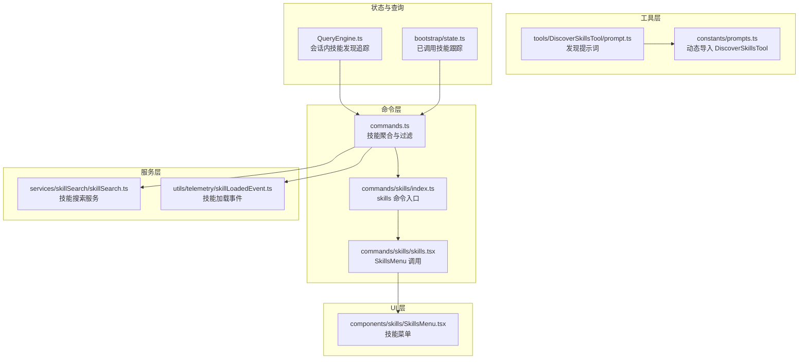
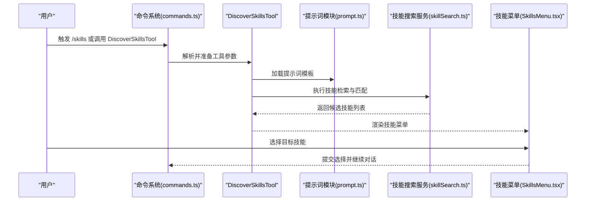
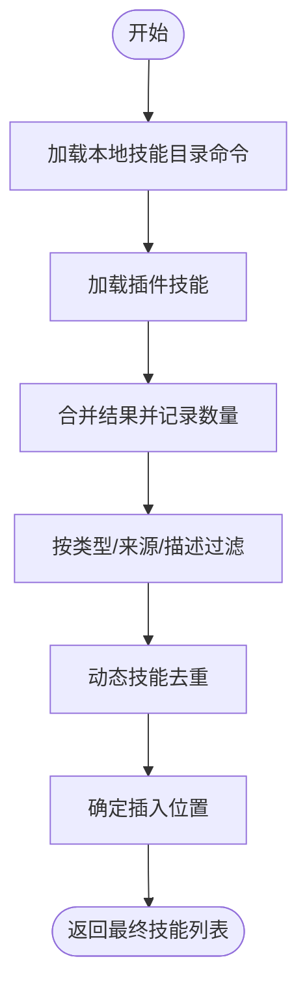
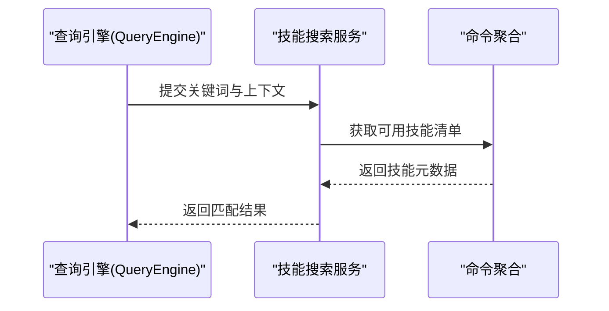
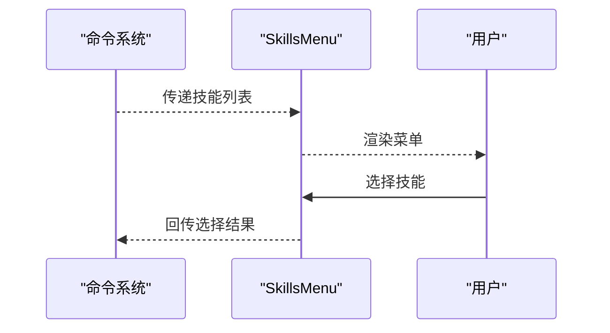
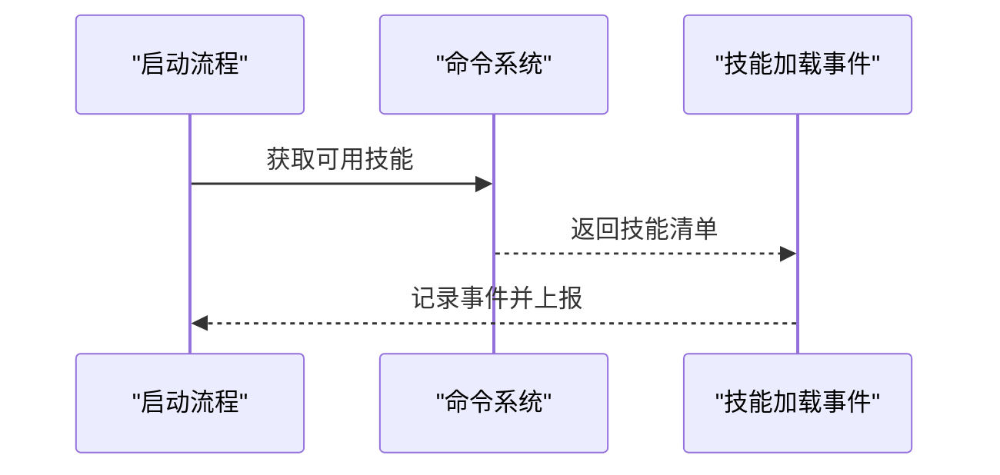
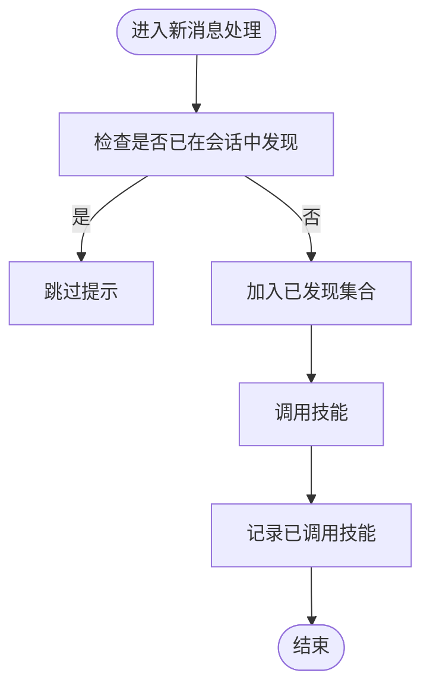
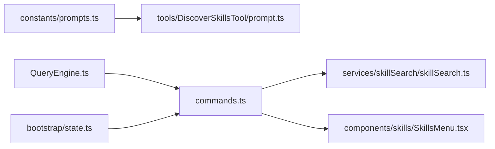

# 技能发现工具

<cite>
**本文引用的文件**
- [src/tools/DiscoverSkillsTool/prompt.ts](file://src/tools/DiscoverSkillsTool/prompt.ts)
- [src/constants/prompts.ts](file://src/constants/prompts.ts)
- [src/commands.ts](file://src/commands.ts)
- [src/commands/skills/index.ts](file://src/commands/skills/index.ts)
- [src/commands/skills/skills.tsx](file://src/commands/skills/skills.tsx)
- [src/services/skillSearch/skillSearch.ts](file://src/services/skillSearch/skillSearch.ts)
- [src/utils/telemetry/skillLoadedEvent.ts](file://src/utils/telemetry/skillLoadedEvent.ts)
- [src/components/skills/SkillsMenu.tsx](file://src/components/skills/SkillsMenu.tsx)
- [src/hooks/useSkillsChange.ts](file://src/hooks/useSkillsChange.ts)
- [src/bootstrap/state.ts](file://src/bootstrap/state.ts)
- [src/QueryEngine.ts](file://src/QueryEngine.ts)
</cite>

## 目录
1. [简介](#简介)
2. [项目结构](#项目结构)
3. [核心组件](#核心组件)
4. [架构总览](#架构总览)
5. [详细组件分析](#详细组件分析)
6. [依赖关系分析](#依赖关系分析)
7. [性能考量](#性能考量)
8. [故障排查指南](#故障排查指南)
9. [结论](#结论)
10. [附录](#附录)

## 简介
本文件面向“技能发现工具”的技术文档，聚焦于 DiscoverSkillsTool 的技能发现与推荐机制，涵盖本地技能扫描、远程技能加载、技能预取策略、技能评分与排序、技能目录管理、元数据解析与更新检测等关键能力。同时提供配置指南与使用示例，帮助开发者与使用者理解并扩展技能生态。

## 项目结构
技能发现工具涉及多个层次：命令注册层（commands）、工具层（tools）、服务层（services）、UI 层（components）以及状态与查询引擎层（bootstrap/state、QueryEngine）。DiscoverSkillsTool 通过统一的命令体系被发现与调用，并与技能搜索、菜单展示、会话状态联动。

**图表来源**
- [src/commands.ts:353-608](file://src/commands.ts#L353-L608)
- [src/commands/skills/index.ts:1-10](file://src/commands/skills/index.ts#L1-L10)
- [src/commands/skills/skills.tsx:1-7](file://src/commands/skills/skills.tsx#L1-L7)
- [src/services/skillSearch/skillSearch.ts](file://src/services/skillSearch/skillSearch.ts)
- [src/utils/telemetry/skillLoadedEvent.ts:1-39](file://src/utils/telemetry/skillLoadedEvent.ts#L1-L39)
- [src/components/skills/SkillsMenu.tsx](file://src/components/skills/SkillsMenu.tsx)
- [src/bootstrap/state.ts:1501-1541](file://src/bootstrap/state.ts#L1501-L1541)
- [src/QueryEngine.ts:184-207](file://src/QueryEngine.ts#L184-L207)

**章节来源**
- [src/commands.ts:353-608](file://src/commands.ts#L353-L608)
- [src/commands/skills/index.ts:1-10](file://src/commands/skills/index.ts#L1-L10)
- [src/commands/skills/skills.tsx:1-7](file://src/commands/skills/skills.tsx#L1-L7)
- [src/services/skillSearch/skillSearch.ts](file://src/services/skillSearch/skillSearch.ts)
- [src/utils/telemetry/skillLoadedEvent.ts:1-39](file://src/utils/telemetry/skillLoadedEvent.ts#L1-L39)
- [src/components/skills/SkillsMenu.tsx](file://src/components/skills/SkillsMenu.tsx)
- [src/bootstrap/state.ts:1501-1541](file://src/bootstrap/state.ts#L1501-L1541)
- [src/QueryEngine.ts:184-207](file://src/QueryEngine.ts#L184-L207)

## 核心组件
- 发现提示词模块：提供 DiscoverSkillsTool 的提示词模板，作为工具执行的输入基础。
- 命令聚合与过滤：从本地技能目录、插件、内置与 MCP 来源聚合命令，筛选可被模型调用的技能。
- 技能搜索服务：为技能发现提供检索与匹配能力，支持关键词与上下文匹配。
- 技能加载事件：在会话启动时记录可用技能，用于分析与统计。
- 技能菜单：以 UI 形式展示可选技能，支持交互式选择与导航。
- 会话状态与追踪：在查询引擎中维护“已发现技能”集合，避免重复提示；在全局状态中记录已调用技能信息。

**章节来源**
- [src/tools/DiscoverSkillsTool/prompt.ts](file://src/tools/DiscoverSkillsTool/prompt.ts)
- [src/commands.ts:353-608](file://src/commands.ts#L353-L608)
- [src/services/skillSearch/skillSearch.ts](file://src/services/skillSearch/skillSearch.ts)
- [src/utils/telemetry/skillLoadedEvent.ts:1-39](file://src/utils/telemetry/skillLoadedEvent.ts#L1-L39)
- [src/components/skills/SkillsMenu.tsx](file://src/components/skills/SkillsMenu.tsx)
- [src/QueryEngine.ts:184-207](file://src/QueryEngine.ts#L184-L207)
- [src/bootstrap/state.ts:1501-1541](file://src/bootstrap/state.ts#L1501-L1541)

## 架构总览
技能发现工具围绕“命令发现—提示词生成—搜索匹配—UI 展示—状态追踪”的闭环工作流展开。DiscoverSkillsTool 通过命令系统被注册与调用，其提示词由常量层动态导入；命令聚合层负责从多源加载技能并进行过滤；搜索服务提供检索能力；UI 层负责呈现；状态与查询引擎负责去重与持久化。

**图表来源**
- [src/commands.ts:353-608](file://src/commands.ts#L353-L608)
- [src/tools/DiscoverSkillsTool/prompt.ts](file://src/tools/DiscoverSkillsTool/prompt.ts)
- [src/services/skillSearch/skillSearch.ts](file://src/services/skillSearch/skillSearch.ts)
- [src/components/skills/SkillsMenu.tsx](file://src/components/skills/SkillsMenu.tsx)

## 详细组件分析

### 组件一：命令聚合与过滤（技能发现核心）
职责与流程：
- 并行加载本地技能目录命令、插件技能、内置与捆绑技能。
- 过滤出类型为 prompt、未禁用模型调用、且具备描述或使用时机的命令。
- 对动态技能进行去重与插入位置控制，确保顺序合理。

**图表来源**
- [src/commands.ts:353-608](file://src/commands.ts#L353-L608)

**章节来源**
- [src/commands.ts:353-608](file://src/commands.ts#L353-L608)

### 组件二：技能搜索服务（检索与匹配）
职责与流程：
- 接收关键词与上下文，对技能进行语义与关键词匹配。
- 支持模糊匹配与权重计算，输出候选技能集合作为发现建议。

**图表来源**
- [src/QueryEngine.ts:184-207](file://src/QueryEngine.ts#L184-L207)
- [src/services/skillSearch/skillSearch.ts](file://src/services/skillSearch/skillSearch.ts)

**章节来源**
- [src/QueryEngine.ts:184-207](file://src/QueryEngine.ts#L184-L207)
- [src/services/skillSearch/skillSearch.ts](file://src/services/skillSearch/skillSearch.ts)

### 组件三：技能菜单与 UI 展示
职责与流程：
- 将可调用技能渲染为交互式菜单，支持快速浏览与选择。
- 与命令系统联动，确保显示的技能与当前环境一致。

**图表来源**
- [src/commands/skills/skills.tsx:1-7](file://src/commands/skills/skills.tsx#L1-L7)
- [src/components/skills/SkillsMenu.tsx](file://src/components/skills/SkillsMenu.tsx)

**章节来源**
- [src/commands/skills/skills.tsx:1-7](file://src/commands/skills/skills.tsx#L1-L7)
- [src/components/skills/SkillsMenu.tsx](file://src/components/skills/SkillsMenu.tsx)

### 组件四：技能加载事件与统计
职责与流程：
- 在会话启动时遍历可用技能，记录加载事件，包含技能名称、来源、加载位置与预算等元数据。
- 用于后续分析与统计，评估技能生态覆盖度。

**图表来源**
- [src/utils/telemetry/skillLoadedEvent.ts:1-39](file://src/utils/telemetry/skillLoadedEvent.ts#L1-L39)

**章节来源**
- [src/utils/telemetry/skillLoadedEvent.ts:1-39](file://src/utils/telemetry/skillLoadedEvent.ts#L1-L39)

### 组件五：会话内技能发现追踪与全局状态
职责与流程：
- 查询引擎维护“已发现技能”集合，避免在同次会话中重复提示同一技能。
- 全局状态记录“已调用技能”，支持跨会话保留与清理。

**图表来源**
- [src/QueryEngine.ts:184-207](file://src/QueryEngine.ts#L184-L207)
- [src/bootstrap/state.ts:1501-1541](file://src/bootstrap/state.ts#L1501-L1541)

**章节来源**
- [src/QueryEngine.ts:184-207](file://src/QueryEngine.ts#L184-L207)
- [src/bootstrap/state.ts:1501-1541](file://src/bootstrap/state.ts#L1501-L1541)

## 依赖关系分析
- DiscoverSkillsTool 通过命令系统被注册与调用，其提示词由常量层动态导入。
- 命令系统依赖技能搜索服务进行检索与匹配。
- UI 层依赖命令系统提供的技能列表进行渲染。
- 查询引擎与全局状态为技能发现提供去重与持久化能力。

**图表来源**
- [src/constants/prompts.ts:89-89](file://src/constants/prompts.ts#L89-L89)
- [src/tools/DiscoverSkillsTool/prompt.ts](file://src/tools/DiscoverSkillsTool/prompt.ts)
- [src/commands.ts:353-608](file://src/commands.ts#L353-L608)
- [src/services/skillSearch/skillSearch.ts](file://src/services/skillSearch/skillSearch.ts)
- [src/components/skills/SkillsMenu.tsx](file://src/components/skills/SkillsMenu.tsx)
- [src/QueryEngine.ts:184-207](file://src/QueryEngine.ts#L184-L207)
- [src/bootstrap/state.ts:1501-1541](file://src/bootstrap/state.ts#L1501-L1541)

**章节来源**
- [src/constants/prompts.ts:89-89](file://src/constants/prompts.ts#L89-L89)
- [src/tools/DiscoverSkillsTool/prompt.ts](file://src/tools/DiscoverSkillsTool/prompt.ts)
- [src/commands.ts:353-608](file://src/commands.ts#L353-L608)
- [src/services/skillSearch/skillSearch.ts](file://src/services/skillSearch/skillSearch.ts)
- [src/components/skills/SkillsMenu.tsx](file://src/components/skills/SkillsMenu.tsx)
- [src/QueryEngine.ts:184-207](file://src/QueryEngine.ts#L184-L207)
- [src/bootstrap/state.ts:1501-1541](file://src/bootstrap/state.ts#L1501-L1541)

## 性能考量
- 并行加载：命令聚合阶段采用并行加载本地技能与插件技能，减少总体等待时间。
- 去重与缓存：查询引擎与全局状态分别承担会话级与跨会话级去重，降低重复提示成本。
- 懒加载与动态导入：提示词通过常量层动态导入，避免不必要的初始化开销。
- 搜索优化：技能搜索服务应结合关键词与上下文进行高效匹配，必要时引入索引或缓存策略。

## 故障排查指南
- 技能未显示：检查命令聚合是否成功加载本地技能与插件技能；确认过滤条件是否导致技能被排除。
- 重复提示：检查查询引擎中的“已发现技能”集合是否正确维护。
- UI 不响应：确认命令系统是否正确传递技能列表至 UI 层。
- 事件未记录：检查技能加载事件是否在会话启动时触发，以及日志与错误处理是否正常。

**章节来源**
- [src/commands.ts:353-608](file://src/commands.ts#L353-L608)
- [src/QueryEngine.ts:184-207](file://src/QueryEngine.ts#L184-L207)
- [src/utils/telemetry/skillLoadedEvent.ts:1-39](file://src/utils/telemetry/skillLoadedEvent.ts#L1-L39)

## 结论
DiscoverSkillsTool 通过命令系统、提示词模板、搜索服务与 UI 菜单形成完整的技能发现与推荐闭环。其设计强调多源聚合、并行加载、去重与持久化，既保证了性能，也提升了用户体验。未来可在搜索服务中引入更精细的评分与排序策略，进一步提升推荐质量。

## 附录

### 配置指南
- 动态导入提示词：通过常量层动态导入 DiscoverSkillsTool 的提示词模块，确保运行时可替换与热更新。
- 技能目录管理：本地技能目录需遵循约定（如包含特定元数据文件），以便被命令系统识别与加载。
- 插件技能接入：插件可通过配置暴露技能路径，命令系统将自动扫描并纳入技能索引。
- 内置与捆绑技能：系统启动时同步注册内置与捆绑技能，确保默认可用性。

**章节来源**
- [src/constants/prompts.ts:89-89](file://src/constants/prompts.ts#L89-L89)
- [src/commands.ts:353-608](file://src/commands.ts#L353-L608)

### 使用示例
- 列出可用技能：通过 skills 命令入口进入技能菜单，浏览并选择目标技能。
- 自定义发现规则：在命令系统中调整过滤条件与插入位置，以满足不同场景需求。
- 技能市场接入：通过插件配置或 MCP 通道注入远程技能，命令系统将统一纳入索引与展示。

**章节来源**
- [src/commands/skills/index.ts:1-10](file://src/commands/skills/index.ts#L1-L10)
- [src/commands/skills/skills.tsx:1-7](file://src/commands/skills/skills.tsx#L1-L7)
- [src/commands.ts:353-608](file://src/commands.ts#L353-L608)