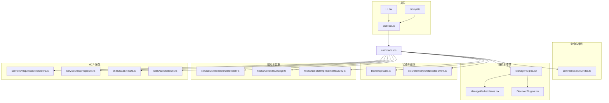
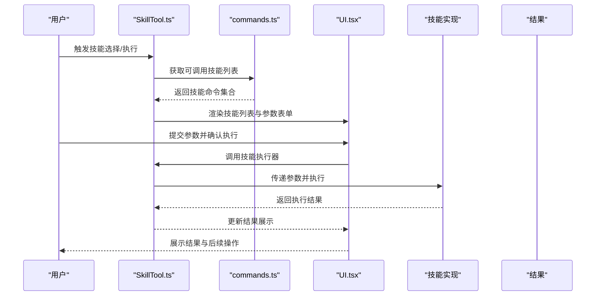
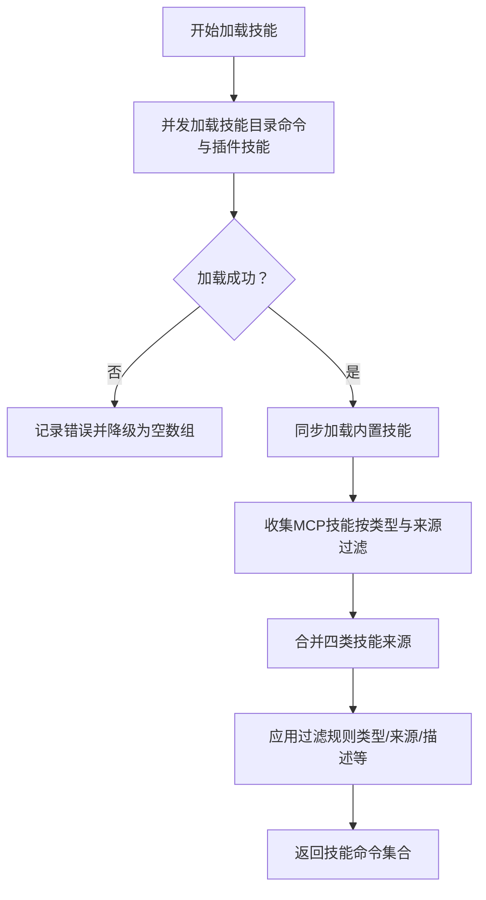
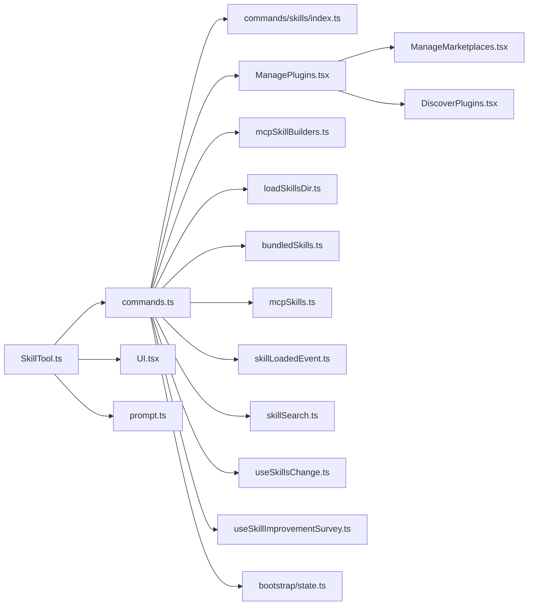

# 技能工具

<cite>
**本文引用的文件**
- [src/tools/SkillTool/SkillTool.ts](file://src/tools/SkillTool/SkillTool.ts)
- [src/tools/SkillTool/UI.tsx](file://src/tools/SkillTool/UI.tsx)
- [src/tools/SkillTool/prompt.ts](file://src/tools/SkillTool/prompt.ts)
- [src/commands.ts](file://src/commands.ts)
- [src/commands/skills/index.ts](file://src/commands/skills/index.ts)
- [src/commands/plugin/ManagePlugins.tsx](file://src/commands/plugin/ManagePlugins.tsx)
- [src/utils/telemetry/skillLoadedEvent.ts](file://src/utils/telemetry/skillLoadedEvent.ts)
- [src/bootstrap/state.ts](file://src/bootstrap/state.ts)
- [src/services/skillSearch/skillSearch.ts](file://src/services/skillSearch/skillSearch.ts)
- [src/hooks/useSkillsChange.ts](file://src/hooks/useSkillsChange.ts)
- [src/hooks/useSkillImprovementSurvey.ts](file://src/hooks/useSkillImprovementSurvey.ts)
- [src/components/skills/](file://src/components/skills/)
- [src/services/mcp/mcpSkillBuilders.ts](file://src/services/mcp/mcpSkillBuilders.ts)
- [src/services/mcp/mcpSkills.ts](file://src/services/mcp/mcpSkills.ts)
- [src/skills/loadSkillsDir.ts](file://src/skills/loadSkillsDir.ts)
- [src/skills/bundledSkills.ts](file://src/skills/bundledSkills.ts)
- [src/commands/plugin/ManageMarketplaces.tsx](file://src/commands/plugin/ManageMarketplaces.tsx)
- [src/commands/plugin/DiscoverPlugins.tsx](file://src/commands/plugin/DiscoverPlugins.tsx)
</cite>

## 目录
1. [引言](#引言)
2. [项目结构](#项目结构)
3. [核心组件](#核心组件)
4. [架构总览](#架构总览)
5. [详细组件分析](#详细组件分析)
6. [依赖关系分析](#依赖关系分析)
7. [性能考量](#性能考量)
8. [故障排查指南](#故障排查指南)
9. [结论](#结论)
10. [附录：使用与开发指南](#附录使用与开发指南)

## 引言
本文件系统性阐述“技能工具（SkillTool）”的技术架构与实现细节，覆盖技能的加载、搜索与执行全链路；解释技能分类体系与缓存机制；说明技能界面的实现方式、参数配置与执行结果展示；并提供使用指南与开发示例，包括自定义技能创建与技能市场集成。

## 项目结构
技能工具相关代码主要分布在以下区域：
- 工具层：技能工具的入口、UI 与提示词逻辑
- 命令与技能索引：技能来源聚合、过滤与暴露
- 插件与市场：插件内技能发现、管理与市场集成
- 状态与遥测：已调用技能追踪与技能可用性统计
- 搜索与变更钩子：技能检索与动态更新

图表来源
- [src/tools/SkillTool/SkillTool.ts:1-200](file://src/tools/SkillTool/SkillTool.ts#L1-L200)
- [src/tools/SkillTool/UI.tsx:1-200](file://src/tools/SkillTool/UI.tsx#L1-L200)
- [src/tools/SkillTool/prompt.ts:1-200](file://src/tools/SkillTool/prompt.ts#L1-L200)
- [src/commands.ts:353-608](file://src/commands.ts#L353-L608)
- [src/commands/skills/index.ts:1-10](file://src/commands/skills/index.ts#L1-L10)
- [src/commands/plugin/ManagePlugins.tsx:150-303](file://src/commands/plugin/ManagePlugins.tsx#L150-L303)
- [src/utils/telemetry/skillLoadedEvent.ts:1-39](file://src/utils/telemetry/skillLoadedEvent.ts#L1-L39)
- [src/bootstrap/state.ts:1487-1541](file://src/bootstrap/state.ts#L1487-L1541)
- [src/services/skillSearch/skillSearch.ts](file://src/services/skillSearch/skillSearch.ts)
- [src/hooks/useSkillsChange.ts](file://src/hooks/useSkillsChange.ts)
- [src/hooks/useSkillImprovementSurvey.ts](file://src/hooks/useSkillImprovementSurvey.ts)
- [src/services/mcp/mcpSkillBuilders.ts](file://src/services/mcp/mcpSkillBuilders.ts)
- [src/services/mcp/mcpSkills.ts](file://src/services/mcp/mcpSkills.ts)
- [src/skills/loadSkillsDir.ts](file://src/skills/loadSkillsDir.ts)
- [src/skills/bundledSkills.ts](file://src/skills/bundledSkills.ts)
- [src/commands/plugin/ManageMarketplaces.tsx:50-700](file://src/commands/plugin/ManageMarketplaces.tsx#L50-L700)
- [src/commands/plugin/DiscoverPlugins.tsx:703-746](file://src/commands/plugin/DiscoverPlugins.tsx#L703-L746)

章节来源
- [src/tools/SkillTool/SkillTool.ts:1-200](file://src/tools/SkillTool/SkillTool.ts#L1-L200)
- [src/commands.ts:353-608](file://src/commands.ts#L353-L608)

## 核心组件
- 技能工具入口：封装模型可调用技能的筛选、执行与结果呈现，负责与命令系统对接并触发 UI 展示。
- 技能命令索引：统一聚合来自多源的技能命令（本地技能目录、插件技能、内置技能、MCP 技能），并进行过滤与暴露。
- 技能 UI：提供技能列表、参数输入、执行进度与结果展示的交互界面。
- 遥测与状态：记录技能加载事件与已调用技能信息，支持会话内追踪与跨会话分析。
- 插件与市场：在插件中声明技能路径，扫描技能目录，支持市场添加/移除与自动发现。

章节来源
- [src/tools/SkillTool/SkillTool.ts:1-200](file://src/tools/SkillTool/SkillTool.ts#L1-L200)
- [src/tools/SkillTool/UI.tsx:1-200](file://src/tools/SkillTool/UI.tsx#L1-L200)
- [src/commands.ts:561-581](file://src/commands.ts#L561-L581)
- [src/utils/telemetry/skillLoadedEvent.ts:1-39](file://src/utils/telemetry/skillLoadedEvent.ts#L1-L39)
- [src/bootstrap/state.ts:1501-1541](file://src/bootstrap/state.ts#L1501-L1541)

## 架构总览
技能工具的执行链路由“命令索引 → 技能筛选 → UI 渲染 → 执行 → 结果回传”构成，同时贯穿“加载来源 → 缓存策略 → 搜索与变更通知 → 市场集成”的支撑能力。

图表来源
- [src/tools/SkillTool/SkillTool.ts:1-200](file://src/tools/SkillTool/SkillTool.ts#L1-L200)
- [src/tools/SkillTool/UI.tsx:1-200](file://src/tools/SkillTool/UI.tsx#L1-L200)
- [src/commands.ts:561-581](file://src/commands.ts#L561-L581)

## 详细组件分析

### 技能加载与来源体系
- 来源聚合
  - 技能目录命令：扫描指定目录下包含特定标识文件的子目录，识别为技能。
  - 插件技能：从插件声明的技能路径中解析技能目录名。
  - 内置技能：应用启动时同步注册。
  - MCP 技能：从 MCP 命令中筛选 prompt 类型且未禁用模型调用的条目。
- 过滤规则
  - 仅暴露 prompt 类型、非内置来源、未禁用模型调用，并满足描述或使用场景条件的技能。
- 并发加载
  - 技能目录与插件技能通过并发异步加载，失败时降级返回空集，保证系统稳定性。

图表来源
- [src/commands.ts:353-398](file://src/commands.ts#L353-L398)
- [src/commands.ts:541-581](file://src/commands.ts#L541-L581)
- [src/commands/plugin/ManagePlugins.tsx:150-303](file://src/commands/plugin/ManagePlugins.tsx#L150-L303)

章节来源
- [src/commands.ts:353-398](file://src/commands.ts#L353-L398)
- [src/commands.ts:541-581](file://src/commands.ts#L541-L581)
- [src/commands/plugin/ManagePlugins.tsx:150-303](file://src/commands/plugin/ManagePlugins.tsx#L150-L303)

### 技能筛选与暴露
- 全量技能命令获取：对所有命令进行二次筛选，确保 prompt 类型、未禁用模型调用、非内置来源，并满足描述或使用场景条件。
- 列表化输出：用于技能工具 UI 展示与模型调用索引。

章节来源
- [src/commands.ts:561-581](file://src/commands.ts#L561-L581)

### 技能 UI 实现与交互
- UI 组件职责
  - 列出可调用技能，支持按名称/描述搜索与排序。
  - 收集用户输入参数，校验后提交执行。
  - 展示执行进度与结果，支持重试、复制、导出等操作。
- 与工具层协作
  - 通过工具层提供的执行器发起调用，接收回调并刷新界面状态。

章节来源
- [src/tools/SkillTool/UI.tsx:1-200](file://src/tools/SkillTool/UI.tsx#L1-L200)
- [src/tools/SkillTool/SkillTool.ts:1-200](file://src/tools/SkillTool/SkillTool.ts#L1-L200)

### 技能执行流程
- 参数收集与校验：在 UI 中完成，必要时联动提示词生成器进行上下文注入。
- 执行器调用：由工具层封装，统一处理异常与超时。
- 结果回传：将结构化结果写入消息流或状态树，驱动 UI 更新。

章节来源
- [src/tools/SkillTool/prompt.ts:1-200](file://src/tools/SkillTool/prompt.ts#L1-L200)
- [src/tools/SkillTool/SkillTool.ts:1-200](file://src/tools/SkillTool/SkillTool.ts#L1-L200)

### 技能缓存机制
- 已调用技能追踪
  - 记录每次被调用的技能名称、路径、内容与时间戳，支持按代理 ID 过滤。
  - 用于跨压缩保存与复用，避免重复加载与冗余计算。
- 缓存键策略
  - 使用“代理ID:技能名”作为键，确保多代理隔离与去重。
- 会话内持久化
  - 在状态模块中以映射结构存储，便于快速查询与清理。

章节来源
- [src/bootstrap/state.ts:1501-1541](file://src/bootstrap/state.ts#L1501-L1541)

### 技能搜索与变更通知
- 搜索服务
  - 提供关键词匹配与权重排序，加速技能定位。
- 变更钩子
  - 当技能目录或插件发生变化时，触发重新索引与 UI 刷新。
- 改进建议提醒
  - 通过改进调查钩子引导用户反馈与优化体验。

章节来源
- [src/services/skillSearch/skillSearch.ts](file://src/services/skillSearch/skillSearch.ts)
- [src/hooks/useSkillsChange.ts](file://src/hooks/useSkillsChange.ts)
- [src/hooks/useSkillImprovementSurvey.ts](file://src/hooks/useSkillImprovementSurvey.ts)

### 技能市场集成
- 市场管理
  - 支持添加/更新/移除市场源，提供快捷键与确认流程。
- 发现与安装
  - 在发现页根据策略与权限显示可安装项，必要时提示依赖环境。
- 插件声明
  - 插件可通过声明技能路径参与技能聚合，实现“即插即用”。

章节来源
- [src/commands/plugin/ManageMarketplaces.tsx:50-700](file://src/commands/plugin/ManageMarketplaces.tsx#L50-L700)
- [src/commands/plugin/DiscoverPlugins.tsx:703-746](file://src/commands/plugin/DiscoverPlugins.tsx#L703-L746)
- [src/commands/plugin/ManagePlugins.tsx:150-303](file://src/commands/plugin/ManagePlugins.tsx#L150-L303)

## 依赖关系分析
技能工具与周边模块的耦合与协作如下：

图表来源
- [src/tools/SkillTool/SkillTool.ts:1-200](file://src/tools/SkillTool/SkillTool.ts#L1-L200)
- [src/tools/SkillTool/UI.tsx:1-200](file://src/tools/SkillTool/UI.tsx#L1-L200)
- [src/tools/SkillTool/prompt.ts:1-200](file://src/tools/SkillTool/prompt.ts#L1-L200)
- [src/commands.ts:353-608](file://src/commands.ts#L353-L608)
- [src/commands/skills/index.ts:1-10](file://src/commands/skills/index.ts#L1-L10)
- [src/commands/plugin/ManagePlugins.tsx:150-303](file://src/commands/plugin/ManagePlugins.tsx#L150-L303)
- [src/services/mcp/mcpSkillBuilders.ts](file://src/services/mcp/mcpSkillBuilders.ts)
- [src/skills/loadSkillsDir.ts](file://src/skills/loadSkillsDir.ts)
- [src/skills/bundledSkills.ts](file://src/skills/bundledSkills.ts)
- [src/services/mcp/mcpSkills.ts](file://src/services/mcp/mcpSkills.ts)
- [src/utils/telemetry/skillLoadedEvent.ts:1-39](file://src/utils/telemetry/skillLoadedEvent.ts#L1-L39)
- [src/services/skillSearch/skillSearch.ts](file://src/services/skillSearch/skillSearch.ts)
- [src/hooks/useSkillsChange.ts](file://src/hooks/useSkillsChange.ts)
- [src/hooks/useSkillImprovementSurvey.ts](file://src/hooks/useSkillImprovementSurvey.ts)
- [src/bootstrap/state.ts:1501-1541](file://src/bootstrap/state.ts#L1501-L1541)
- [src/commands/plugin/ManageMarketplaces.tsx:50-700](file://src/commands/plugin/ManageMarketplaces.tsx#L50-L700)
- [src/commands/plugin/DiscoverPlugins.tsx:703-746](file://src/commands/plugin/DiscoverPlugins.tsx#L703-L746)

章节来源
- [src/commands.ts:353-608](file://src/commands.ts#L353-L608)

## 性能考量
- 并发加载：技能目录与插件技能采用并发异步加载，缩短初始化时间。
- 缓存复用：已调用技能映射减少重复加载与解析成本。
- 搜索优化：基于关键词与权重的搜索服务降低 UI 渲染压力。
- 失败降级：加载失败不阻塞主流程，保障系统可用性。

## 故障排查指南
- 技能未显示
  - 检查技能目录是否包含必需标识文件，确认插件声明的技能路径有效。
  - 核对命令过滤规则：类型需为 prompt，来源非内置，且具备描述或使用场景。
- 执行失败
  - 查看 UI 中的错误提示与重试按钮；检查参数合法性与权限配置。
  - 关注已调用技能映射，确认是否存在重复或冲突键。
- 市场相关问题
  - 若无法安装，请确认 Git 是否可用以及组织策略限制。
  - 使用市场管理界面核对待更新/移除状态并确认操作。

章节来源
- [src/commands/plugin/ManagePlugins.tsx:150-303](file://src/commands/plugin/ManagePlugins.tsx#L150-L303)
- [src/commands.ts:561-581](file://src/commands.ts#L561-L581)
- [src/bootstrap/state.ts:1501-1541](file://src/bootstrap/state.ts#L1501-L1541)
- [src/commands/plugin/ManageMarketplaces.tsx:50-700](file://src/commands/plugin/ManageMarketplaces.tsx#L50-L700)
- [src/commands/plugin/DiscoverPlugins.tsx:703-746](file://src/commands/plugin/DiscoverPlugins.tsx#L703-L746)

## 结论
技能工具通过“多源聚合 + 过滤暴露 + UI 交互 + 缓存追踪 + 市场集成”的完整闭环，实现了灵活、稳定且可扩展的技能执行体系。其架构兼顾性能与可用性，既满足日常使用，也为自定义技能与生态扩展提供了清晰路径。

## 附录：使用与开发指南

### 使用指南
- 打开技能列表：通过命令入口或快捷方式进入技能工具 UI。
- 选择技能：在列表中搜索或浏览，点击进入参数配置。
- 执行与查看：提交参数后等待执行结果，支持复制、导出与重试。

章节来源
- [src/tools/SkillTool/UI.tsx:1-200](file://src/tools/SkillTool/UI.tsx#L1-L200)
- [src/tools/SkillTool/SkillTool.ts:1-200](file://src/tools/SkillTool/SkillTool.ts#L1-L200)

### 开发示例：自定义技能
- 创建技能目录
  - 在项目根目录下创建一个子目录，并在其中放置技能描述文件（如约定的标识文件）。
- 声明技能路径
  - 在插件中声明 skillsPath 或 skillsPaths，使插件扫描该目录并将其纳入技能索引。
- 验证与调试
  - 使用命令索引函数验证技能是否被正确识别与过滤。
  - 通过 UI 进行参数输入与执行测试。

章节来源
- [src/commands/plugin/ManagePlugins.tsx:285-303](file://src/commands/plugin/ManagePlugins.tsx#L285-L303)
- [src/commands.ts:353-398](file://src/commands.ts#L353-L398)

### 开发示例：技能市场集成
- 添加市场源
  - 在市场管理界面选择“添加市场”，输入地址并确认。
- 自动发现与安装
  - 在发现页查看可安装技能，按需安装并重启生效。
- 策略与权限
  - 若受限于组织策略，可在市场页查看允许的来源列表。

章节来源
- [src/commands/plugin/ManageMarketplaces.tsx:50-700](file://src/commands/plugin/ManageMarketplaces.tsx#L50-L700)
- [src/commands/plugin/DiscoverPlugins.tsx:703-746](file://src/commands/plugin/DiscoverPlugins.tsx#L703-L746)