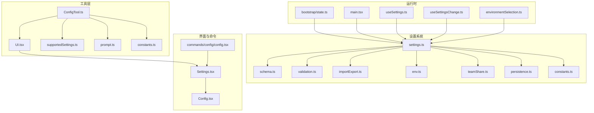
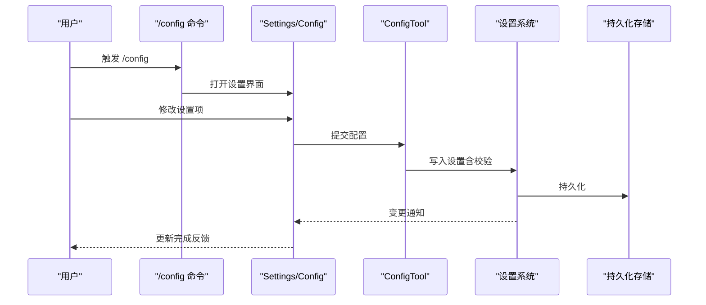
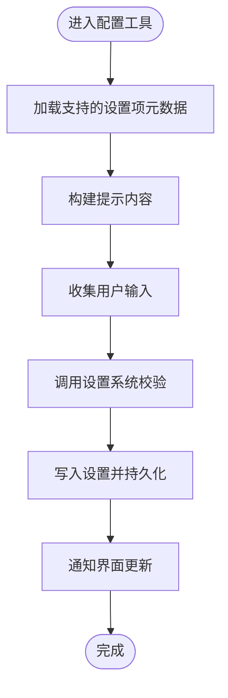
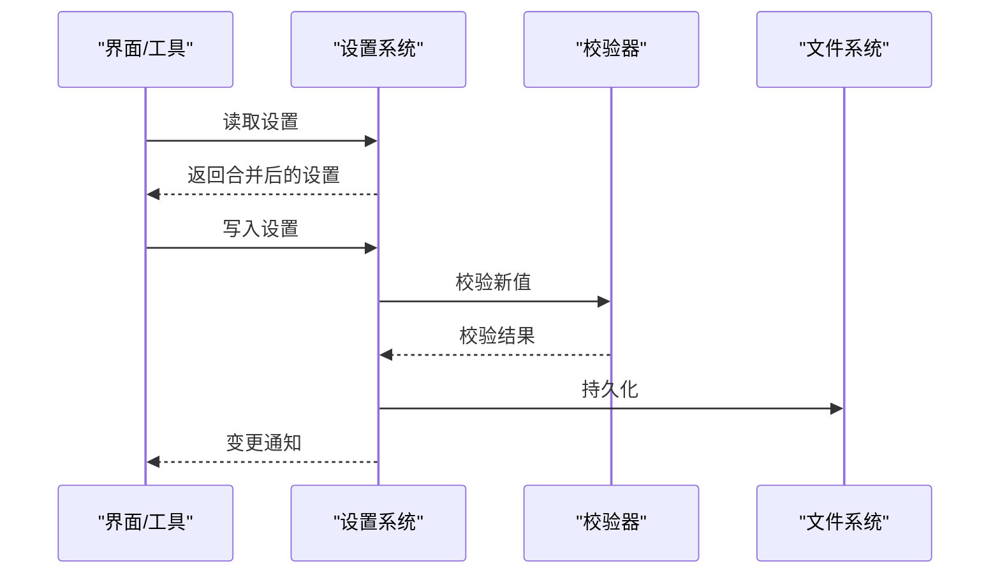
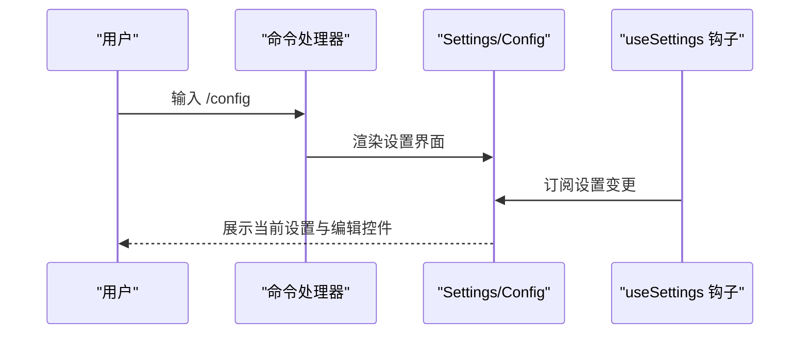
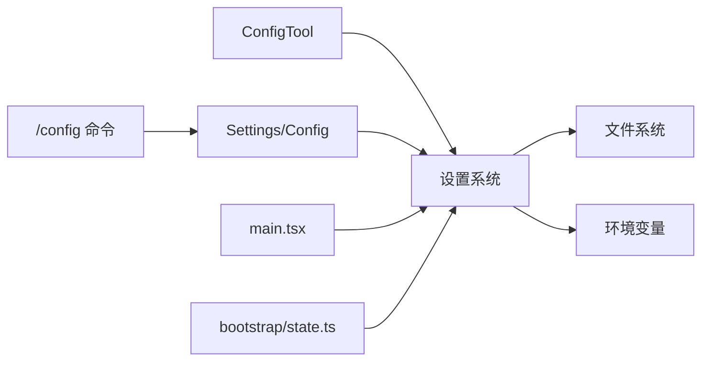

# 配置工具

<cite>
**本文引用的文件**
- [src/tools/ConfigTool/ConfigTool.ts](file://src/tools/ConfigTool/ConfigTool.ts)
- [src/tools/ConfigTool/UI.tsx](file://src/tools/ConfigTool/UI.tsx)
- [src/tools/ConfigTool/supportedSettings.ts](file://src/tools/ConfigTool/supportedSettings.ts)
- [src/tools/ConfigTool/prompt.ts](file://src/tools/ConfigTool/prompt.ts)
- [src/tools/ConfigTool/constants.ts](file://src/tools/ConfigTool/constants.ts)
- [src/components/Settings/Settings.tsx](file://src/components/Settings/Settings.tsx)
- [src/components/Settings/Config.tsx](file://src/components/Settings/Config.tsx)
- [src/commands/config/config.tsx](file://src/commands/config/config.tsx)
- [src/utils/settings/settings.ts](file://src/utils/settings/settings.ts)
- [src/utils/settings/constants.ts](file://src/utils/settings/constants.ts)
- [src/utils/settings/schema.ts](file://src/utils/settings/schema.ts)
- [src/utils/settings/validation.ts](file://src/utils/settings/validation.ts)
- [src/utils/settings/importExport.ts](file://src/utils/settings/importExport.ts)
- [src/utils/settings/env.ts](file://src/utils/settings/env.ts)
- [src/utils/settings/teamShare.ts](file://src/utils/settings/teamShare.ts)
- [src/utils/settings/persistence.ts](file://src/utils/settings/persistence.ts)
- [src/hooks/useSettings.ts](file://src/hooks/useSettings.ts)
- [src/hooks/useSettingsChange.ts](file://src/hooks/useSettingsChange.ts)
- [src/bootstrap/state.ts](file://src/bootstrap/state.ts)
- [src/main.tsx](file://src/main.tsx)
- [src/utils/teleport/environmentSelection.ts](file://src/utils/teleport/environmentSelection.ts)
</cite>

## 目录
1. [简介](#简介)
2. [项目结构](#项目结构)
3. [核心组件](#核心组件)
4. [架构总览](#架构总览)
5. [详细组件分析](#详细组件分析)
6. [依赖关系分析](#依赖关系分析)
7. [性能考虑](#性能考虑)
8. [故障排查指南](#故障排查指南)
9. [结论](#结论)
10. [附录](#附录)

## 简介
本文件为配置工具（ConfigTool）的技术文档，聚焦于配置管理功能：设置项的读取、修改与验证；架构设计与支持的设置类型；配置持久化策略；配置界面实现、设置项分类组织；以及配置导入导出与团队共享方法。同时提供使用指南与最佳实践，涵盖环境变量配置与团队共享设置。

## 项目结构
配置工具位于工具目录下，围绕“工具实现 + UI + 设置系统”三层展开，并通过命令入口与设置组件集成到应用中。

图表来源
- [src/tools/ConfigTool/ConfigTool.ts](file://src/tools/ConfigTool/ConfigTool.ts)
- [src/tools/ConfigTool/UI.tsx](file://src/tools/ConfigTool/UI.tsx)
- [src/tools/ConfigTool/supportedSettings.ts](file://src/tools/ConfigTool/supportedSettings.ts)
- [src/tools/ConfigTool/prompt.ts](file://src/tools/ConfigTool/prompt.ts)
- [src/tools/ConfigTool/constants.ts](file://src/tools/ConfigTool/constants.ts)
- [src/components/Settings/Settings.tsx](file://src/components/Settings/Settings.tsx)
- [src/components/Settings/Config.tsx](file://src/components/Settings/Config.tsx)
- [src/commands/config/config.tsx](file://src/commands/config/config.tsx)
- [src/utils/settings/settings.ts](file://src/utils/settings/settings.ts)
- [src/utils/settings/schema.ts](file://src/utils/settings/schema.ts)
- [src/utils/settings/validation.ts](file://src/utils/settings/validation.ts)
- [src/utils/settings/importExport.ts](file://src/utils/settings/importExport.ts)
- [src/utils/settings/env.ts](file://src/utils/settings/env.ts)
- [src/utils/settings/teamShare.ts](file://src/utils/settings/teamShare.ts)
- [src/utils/settings/persistence.ts](file://src/utils/settings/persistence.ts)
- [src/utils/settings/constants.ts](file://src/utils/settings/constants.ts)
- [src/bootstrap/state.ts](file://src/bootstrap/state.ts)
- [src/main.tsx](file://src/main.tsx)
- [src/hooks/useSettings.ts](file://src/hooks/useSettings.ts)
- [src/hooks/useSettingsChange.ts](file://src/hooks/useSettingsChange.ts)
- [src/utils/teleport/environmentSelection.ts](file://src/utils/teleport/environmentSelection.ts)

章节来源
- [src/tools/ConfigTool/ConfigTool.ts](file://src/tools/ConfigTool/ConfigTool.ts)
- [src/tools/ConfigTool/UI.tsx](file://src/tools/ConfigTool/UI.tsx)
- [src/tools/ConfigTool/supportedSettings.ts](file://src/tools/ConfigTool/supportedSettings.ts)
- [src/tools/ConfigTool/prompt.ts](file://src/tools/ConfigTool/prompt.ts)
- [src/tools/ConfigTool/constants.ts](file://src/tools/ConfigTool/constants.ts)
- [src/components/Settings/Settings.tsx](file://src/components/Settings/Settings.tsx)
- [src/components/Settings/Config.tsx](file://src/components/Settings/Config.tsx)
- [src/commands/config/config.tsx](file://src/commands/config/config.tsx)
- [src/utils/settings/settings.ts](file://src/utils/settings/settings.ts)
- [src/utils/settings/constants.ts](file://src/utils/settings/constants.ts)
- [src/utils/settings/schema.ts](file://src/utils/settings/schema.ts)
- [src/utils/settings/validation.ts](file://src/utils/settings/validation.ts)
- [src/utils/settings/importExport.ts](file://src/utils/settings/importExport.ts)
- [src/utils/settings/env.ts](file://src/utils/settings/env.ts)
- [src/utils/settings/teamShare.ts](file://src/utils/settings/teamShare.ts)
- [src/utils/settings/persistence.ts](file://src/utils/settings/persistence.ts)
- [src/hooks/useSettings.ts](file://src/hooks/useSettings.ts)
- [src/hooks/useSettingsChange.ts](file://src/hooks/useSettingsChange.ts)
- [src/bootstrap/state.ts](file://src/bootstrap/state.ts)
- [src/main.tsx](file://src/main.tsx)
- [src/utils/teleport/environmentSelection.ts](file://src/utils/teleport/environmentSelection.ts)

## 核心组件
- 工具实现与交互
  - ConfigTool.ts：封装配置工具的执行流程、提示词与设置项处理逻辑。
  - UI.tsx：配置工具的用户界面，负责渲染与交互。
  - supportedSettings.ts：声明受支持的设置项及其元数据。
  - prompt.ts：生成用于获取用户输入或确认的提示内容。
  - constants.ts：配置工具内部常量定义。
- 设置系统
  - settings.ts：设置读取、合并、变更通知与缓存重置等核心逻辑。
  - schema.ts：设置模式定义与类型约束。
  - validation.ts：设置值校验与错误处理。
  - importExport.ts：配置导入导出能力。
  - env.ts：环境变量注入与覆盖。
  - teamShare.ts：团队共享设置的存储与同步。
  - persistence.ts：设置持久化策略与存储后端。
  - constants.ts：设置系统常量。
- 界面与命令
  - Settings.tsx：设置主界面容器。
  - Config.tsx：配置页签的具体实现。
  - commands/config/config.tsx：/config 命令入口，打开设置界面。
- 运行时与钩子
  - bootstrap/state.ts：应用启动状态初始化。
  - main.tsx：命令行参数解析与设置源加载。
  - useSettings.ts / useSettingsChange.ts：React 钩子，订阅设置变化。
  - environmentSelection.ts：远程环境选择与默认环境解析。

章节来源
- [src/tools/ConfigTool/ConfigTool.ts](file://src/tools/ConfigTool/ConfigTool.ts)
- [src/tools/ConfigTool/UI.tsx](file://src/tools/ConfigTool/UI.tsx)
- [src/tools/ConfigTool/supportedSettings.ts](file://src/tools/ConfigTool/supportedSettings.ts)
- [src/tools/ConfigTool/prompt.ts](file://src/tools/ConfigTool/prompt.ts)
- [src/tools/ConfigTool/constants.ts](file://src/tools/ConfigTool/constants.ts)
- [src/utils/settings/settings.ts](file://src/utils/settings/settings.ts)
- [src/utils/settings/schema.ts](file://src/utils/settings/schema.ts)
- [src/utils/settings/validation.ts](file://src/utils/settings/validation.ts)
- [src/utils/settings/importExport.ts](file://src/utils/settings/importExport.ts)
- [src/utils/settings/env.ts](file://src/utils/settings/env.ts)
- [src/utils/settings/teamShare.ts](file://src/utils/settings/teamShare.ts)
- [src/utils/settings/persistence.ts](file://src/utils/settings/persistence.ts)
- [src/utils/settings/constants.ts](file://src/utils/settings/constants.ts)
- [src/components/Settings/Settings.tsx](file://src/components/Settings/Settings.tsx)
- [src/components/Settings/Config.tsx](file://src/components/Settings/Config.tsx)
- [src/commands/config/config.tsx](file://src/commands/config/config.tsx)
- [src/hooks/useSettings.ts](file://src/hooks/useSettings.ts)
- [src/hooks/useSettingsChange.ts](file://src/hooks/useSettingsChange.ts)
- [src/bootstrap/state.ts](file://src/bootstrap/state.ts)
- [src/main.tsx](file://src/main.tsx)
- [src/utils/teleport/environmentSelection.ts](file://src/utils/teleport/environmentSelection.ts)

## 架构总览
配置工具采用“工具层 + 设置系统 + 界面与命令 + 运行时”的分层架构：
- 工具层负责具体配置项的采集、提示与保存；
- 设置系统提供统一的读取、校验、持久化与变更通知；
- 界面与命令层提供可视化的配置入口；
- 运行时负责参数解析、缓存重置与订阅更新。

图表来源
- [src/commands/config/config.tsx](file://src/commands/config/config.tsx)
- [src/components/Settings/Settings.tsx](file://src/components/Settings/Settings.tsx)
- [src/components/Settings/Config.tsx](file://src/components/Settings/Config.tsx)
- [src/tools/ConfigTool/ConfigTool.ts](file://src/tools/ConfigTool/ConfigTool.ts)
- [src/utils/settings/settings.ts](file://src/utils/settings/settings.ts)
- [src/utils/settings/persistence.ts](file://src/utils/settings/persistence.ts)

## 详细组件分析

### 工具层：ConfigTool
- 职责
  - 定义可配置设置项清单与元信息；
  - 生成提示内容引导用户输入；
  - 将用户输入写入设置系统并触发持久化。
- 关键点
  - 支持设置项的分类与分组展示；
  - 对输入进行格式化与预处理；
  - 与设置系统交互时遵循统一的写入协议。

图表来源
- [src/tools/ConfigTool/ConfigTool.ts](file://src/tools/ConfigTool/ConfigTool.ts)
- [src/tools/ConfigTool/supportedSettings.ts](file://src/tools/ConfigTool/supportedSettings.ts)
- [src/tools/ConfigTool/prompt.ts](file://src/tools/ConfigTool/prompt.ts)
- [src/utils/settings/validation.ts](file://src/utils/settings/validation.ts)
- [src/utils/settings/persistence.ts](file://src/utils/settings/persistence.ts)

章节来源
- [src/tools/ConfigTool/ConfigTool.ts](file://src/tools/ConfigTool/ConfigTool.ts)
- [src/tools/ConfigTool/supportedSettings.ts](file://src/tools/ConfigTool/supportedSettings.ts)
- [src/tools/ConfigTool/prompt.ts](file://src/tools/ConfigTool/prompt.ts)

### 设置系统：读取、修改与验证
- 读取与合并
  - 从多来源读取设置（文件、标志位、环境变量等），按优先级合并；
  - 提供统一的访问接口与缓存控制。
- 修改与变更通知
  - 写入前进行校验，失败则返回错误；
  - 成功后触发变更广播，驱动界面与运行时更新。
- 持久化策略
  - 文件持久化为主，支持增量写入与原子替换；
  - 支持临时覆盖（如命令行标志位）与内存态缓存。

图表来源
- [src/utils/settings/settings.ts](file://src/utils/settings/settings.ts)
- [src/utils/settings/validation.ts](file://src/utils/settings/validation.ts)
- [src/utils/settings/persistence.ts](file://src/utils/settings/persistence.ts)

章节来源
- [src/utils/settings/settings.ts](file://src/utils/settings/settings.ts)
- [src/utils/settings/schema.ts](file://src/utils/settings/schema.ts)
- [src/utils/settings/validation.ts](file://src/utils/settings/validation.ts)
- [src/utils/settings/persistence.ts](file://src/utils/settings/persistence.ts)

### 配置界面与命令入口
- 命令入口
  - /config 命令直接打开设置界面，默认定位到“配置”页签。
- 设置界面
  - Settings.tsx 作为容器，Config.tsx 实现具体配置页签；
  - 支持设置项的分类组织与分组展示；
  - 与 React 钩子协作，实时响应设置变化。

图表来源
- [src/commands/config/config.tsx](file://src/commands/config/config.tsx)
- [src/components/Settings/Settings.tsx](file://src/components/Settings/Settings.tsx)
- [src/components/Settings/Config.tsx](file://src/components/Settings/Config.tsx)
- [src/hooks/useSettings.ts](file://src/hooks/useSettings.ts)

章节来源
- [src/commands/config/config.tsx](file://src/commands/config/config.tsx)
- [src/components/Settings/Settings.tsx](file://src/components/Settings/Settings.tsx)
- [src/components/Settings/Config.tsx](file://src/components/Settings/Config.tsx)
- [src/hooks/useSettings.ts](file://src/hooks/useSettings.ts)

### 设置项分类与支持类型
- 分类组织
  - 按功能域分组（如通用、远程、插件等）；
  - 每个分组内包含若干设置项，支持折叠/展开。
- 支持类型
  - 字符串、布尔、数值、枚举、对象等；
  - 不同类型对应不同的输入控件与校验规则。

章节来源
- [src/tools/ConfigTool/supportedSettings.ts](file://src/tools/ConfigTool/supportedSettings.ts)
- [src/utils/settings/schema.ts](file://src/utils/settings/schema.ts)

### 配置导入导出与团队共享
- 导入导出
  - 支持将当前设置导出为标准格式；
  - 导入时进行完整性与兼容性检查，失败回滚。
- 团队共享
  - 提供团队范围的共享设置存储；
  - 支持差异合并与冲突解决策略。

章节来源
- [src/utils/settings/importExport.ts](file://src/utils/settings/importExport.ts)
- [src/utils/settings/teamShare.ts](file://src/utils/settings/teamShare.ts)

### 环境变量配置与远程环境
- 环境变量
  - 设置系统支持从环境变量注入与覆盖；
  - 命令行参数可指定设置来源与路径。
- 远程环境
  - 根据设置与可用环境列表确定默认环境；
  - 选择逻辑基于设置优先级与可用性。

章节来源
- [src/utils/settings/env.ts](file://src/utils/settings/env.ts)
- [src/main.tsx](file://src/main.tsx)
- [src/utils/teleport/environmentSelection.ts](file://src/utils/teleport/environmentSelection.ts)

## 依赖关系分析
- 组件耦合
  - 工具层依赖设置系统进行读写；
  - 界面层依赖设置系统与钩子进行数据绑定；
  - 命令层作为入口，串联界面与工具。
- 外部依赖
  - 文件系统用于持久化；
  - 环境变量与命令行参数影响设置来源与覆盖。

图表来源
- [src/tools/ConfigTool/ConfigTool.ts](file://src/tools/ConfigTool/ConfigTool.ts)
- [src/utils/settings/settings.ts](file://src/utils/settings/settings.ts)
- [src/components/Settings/Settings.tsx](file://src/components/Settings/Settings.tsx)
- [src/commands/config/config.tsx](file://src/commands/config/config.tsx)
- [src/main.tsx](file://src/main.tsx)
- [src/bootstrap/state.ts](file://src/bootstrap/state.ts)

章节来源
- [src/tools/ConfigTool/ConfigTool.ts](file://src/tools/ConfigTool/ConfigTool.ts)
- [src/utils/settings/settings.ts](file://src/utils/settings/settings.ts)
- [src/components/Settings/Settings.tsx](file://src/components/Settings/Settings.tsx)
- [src/commands/config/config.tsx](file://src/commands/config/config.tsx)
- [src/main.tsx](file://src/main.tsx)
- [src/bootstrap/state.ts](file://src/bootstrap/state.ts)

## 性能考虑
- 缓存与增量更新
  - 设置系统对读取结果进行缓存，变更时集中刷新；
  - 写入采用增量持久化，减少磁盘写入频率。
- 合并与去重
  - 合并多来源设置时避免重复计算；
  - 使用高效的数据结构与浅拷贝策略。
- 输入校验优化
  - 在前端进行基础校验，减少无效写入；
  - 对复杂对象采用分步校验与快速失败。

## 故障排查指南
- 常见问题
  - 设置无法保存：检查校验错误与权限问题；
  - 设置不生效：确认设置来源优先级与覆盖关系；
  - 导入失败：核对格式与版本兼容性。
- 排查步骤
  - 查看设置系统日志与错误输出；
  - 使用命令行参数验证设置路径与来源；
  - 逐步回退最近一次变更以定位问题。

章节来源
- [src/utils/settings/validation.ts](file://src/utils/settings/validation.ts)
- [src/utils/settings/persistence.ts](file://src/utils/settings/persistence.ts)
- [src/utils/settings/importExport.ts](file://src/utils/settings/importExport.ts)
- [src/main.tsx](file://src/main.tsx)

## 结论
配置工具通过清晰的分层设计与完善的设置系统，实现了对各类设置项的读取、修改、验证与持久化。配合可视化界面与命令入口，用户可以便捷地管理本地与团队共享设置。建议在团队中统一配置模板与导入导出流程，结合环境变量实现灵活部署。

## 附录
- 使用指南
  - 打开设置界面：使用 /config 命令；
  - 修改设置：在对应页签中调整选项；
  - 导入导出：通过设置界面的导入导出功能完成批量迁移；
  - 环境变量：通过环境变量覆盖特定设置项；
  - 团队共享：在团队设置中同步共享配置。
- 最佳实践
  - 保持设置项命名规范与分组清晰；
  - 使用导入导出来标准化团队初始配置；
  - 对关键设置启用备份与版本控制；
  - 利用命令行参数与环境变量实现不同环境的差异化配置。