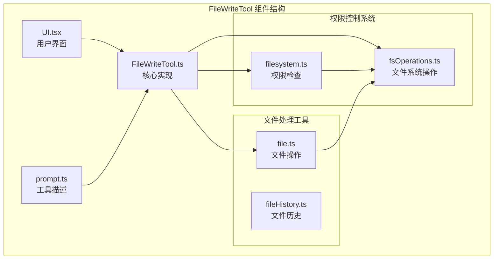
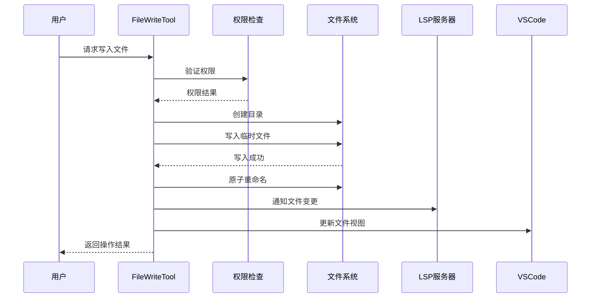
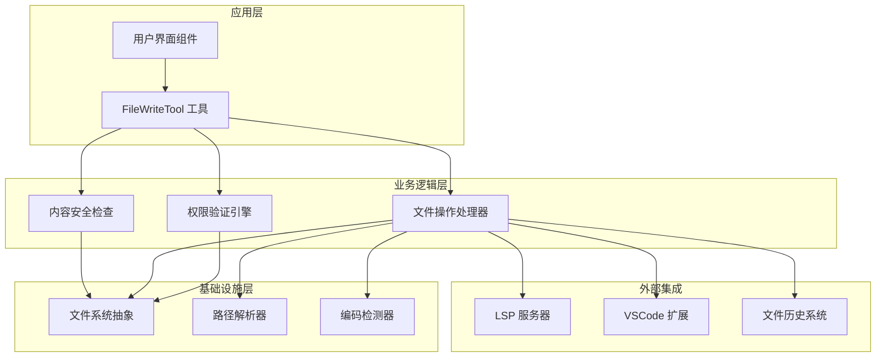
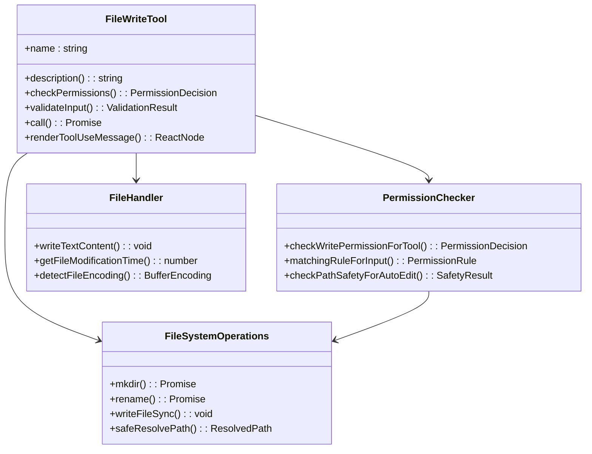
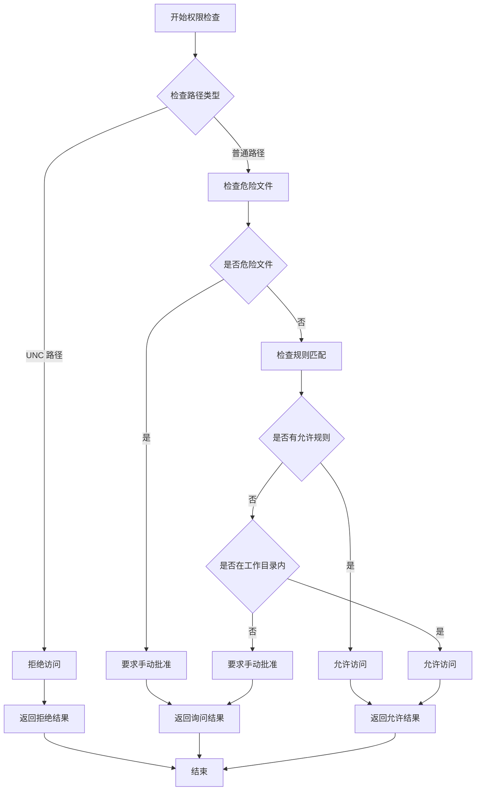
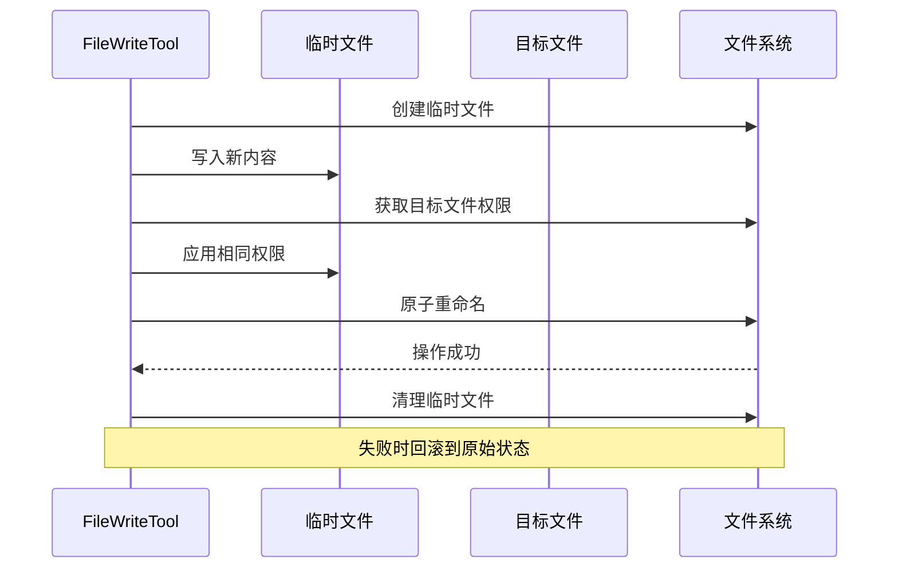
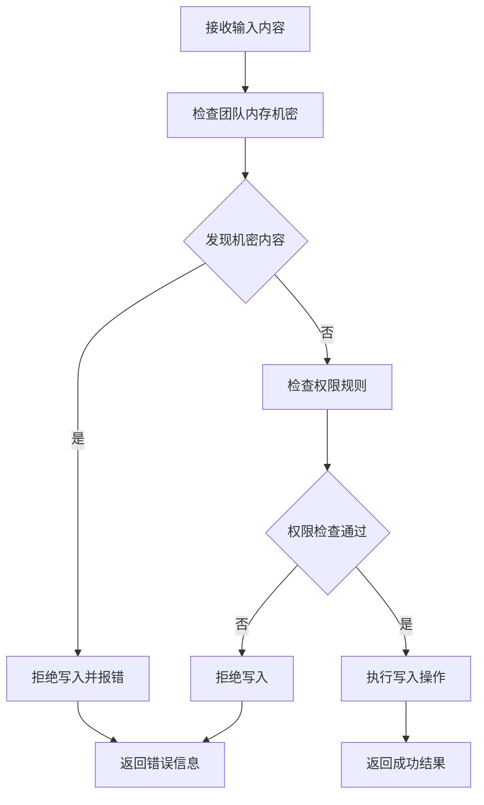
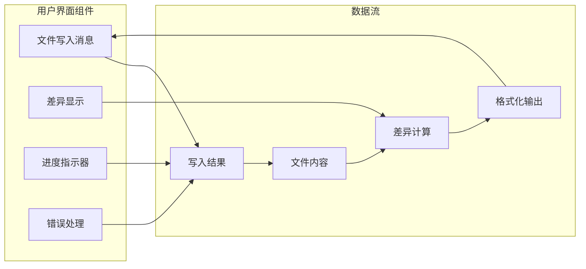
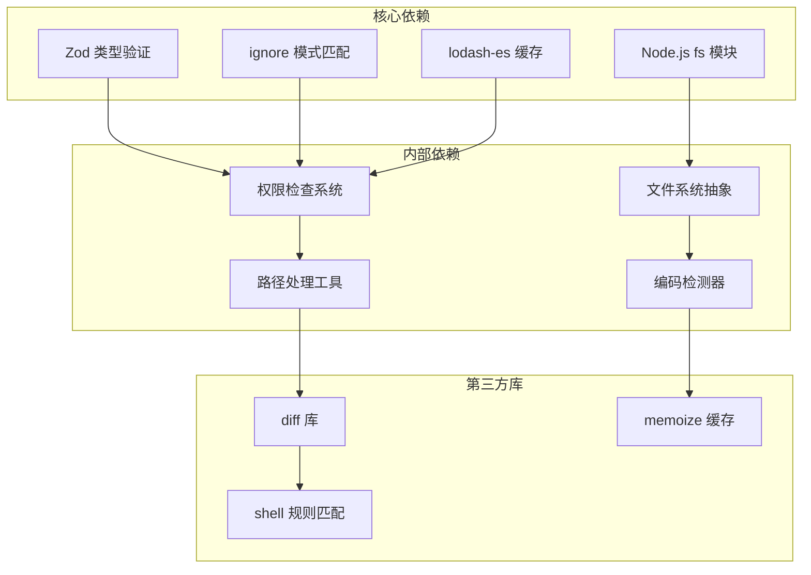
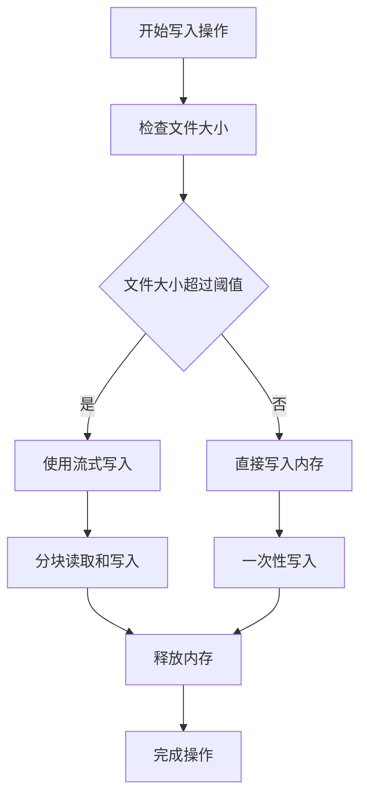

# 文件写入工具 (FileWriteTool)

<cite>
**本文档引用的文件**
- [FileWriteTool.ts](file://src/tools/FileWriteTool/FileWriteTool.ts)
- [UI.tsx](file://src/tools/FileWriteTool/UI.tsx)
- [prompt.ts](file://src/tools/FileWriteTool/prompt.ts)
- [filesystem.ts](file://src/utils/permissions/filesystem.ts)
- [fsOperations.ts](file://src/utils/fsOperations.ts)
- [file.ts](file://src/utils/file.ts)
</cite>

## 目录
1. [简介](#简介)
2. [项目结构](#项目结构)
3. [核心组件](#核心组件)
4. [架构概览](#架构概览)
5. [详细组件分析](#详细组件分析)
6. [依赖关系分析](#依赖关系分析)
7. [性能考虑](#性能考虑)
8. [故障排除指南](#故障排除指南)
9. [结论](#结论)

## 简介

文件写入工具 (FileWriteTool) 是 Claude Code 代码编辑器中的一个关键工具，负责在本地文件系统中创建和写入文件。该工具实现了严格的安全检查、权限验证和原子性写入机制，确保文件操作的安全性和可靠性。

FileWriteTool 支持三种主要的文件操作模式：
- **新文件创建**：当目标文件不存在时创建新文件
- **现有文件覆盖**：完全替换现有文件的内容
- **内容安全过滤**：对写入内容进行安全检查和过滤

该工具集成了完整的权限控制系统、文件系统监控和同步机制，为开发者提供了安全可靠的文件操作能力。

## 项目结构

FileWriteTool 位于工具系统的特定目录结构中，包含核心实现、用户界面和权限控制组件：

**图表来源**
- [FileWriteTool.ts:1-435](file://src/tools/FileWriteTool/FileWriteTool.ts#L1-L435)
- [UI.tsx:1-405](file://src/tools/FileWriteTool/UI.tsx#L1-L405)
- [filesystem.ts:1-1778](file://src/utils/permissions/filesystem.ts#L1-L1778)

**章节来源**
- [FileWriteTool.ts:1-50](file://src/tools/FileWriteTool/FileWriteTool.ts#L1-L50)
- [UI.tsx:1-30](file://src/tools/FileWriteTool/UI.tsx#L1-L30)
- [filesystem.ts:1-50](file://src/utils/permissions/filesystem.ts#L1-L50)

## 核心组件

### 主要功能特性

FileWriteTool 实现了以下核心功能：

1. **严格的权限验证**：通过多层次的安全检查防止恶意文件操作
2. **原子性写入**：使用临时文件和重命名确保写入操作的原子性
3. **内容安全过滤**：检查并阻止敏感文件的修改
4. **文件系统监控**：与 LSP 和 VSCode 集成进行文件变更通知
5. **智能路径处理**：支持绝对路径、相对路径和符号链接

### 数据流架构

**图表来源**
- [FileWriteTool.ts:223-417](file://src/tools/FileWriteTool/FileWriteTool.ts#L223-L417)
- [filesystem.ts:1205-1412](file://src/utils/permissions/filesystem.ts#L1205-L1412)

**章节来源**
- [FileWriteTool.ts:94-145](file://src/tools/FileWriteTool/FileWriteTool.ts#L94-L145)
- [UI.tsx:31-405](file://src/tools/FileWriteTool/UI.tsx#L31-L405)

## 架构概览

### 整体架构设计

FileWriteTool 采用分层架构设计，确保职责分离和代码可维护性：

**图表来源**
- [FileWriteTool.ts:1-435](file://src/tools/FileWriteTool/FileWriteTool.ts#L1-L435)
- [filesystem.ts:1-800](file://src/utils/permissions/filesystem.ts#L1-L800)

### 核心类关系图

**图表来源**
- [FileWriteTool.ts:94-434](file://src/tools/FileWriteTool/FileWriteTool.ts#L94-L434)
- [filesystem.ts:1205-1412](file://src/utils/permissions/filesystem.ts#L1205-L1412)
- [fsOperations.ts:23-123](file://src/utils/fsOperations.ts#L23-L123)

**章节来源**
- [FileWriteTool.ts:94-434](file://src/tools/FileWriteTool/FileWriteTool.ts#L94-L434)
- [filesystem.ts:1205-1412](file://src/utils/permissions/filesystem.ts#L1205-L1412)

## 详细组件分析

### 权限验证系统

FileWriteTool 的权限验证系统是其安全性的核心保障，实现了多层防护机制：

#### 权限检查流程

**图表来源**
- [filesystem.ts:1205-1412](file://src/utils/permissions/filesystem.ts#L1205-L1412)

#### 危险文件保护机制

系统内置了对敏感文件的保护列表，防止意外或恶意修改：

| 危险类别 | 受保护文件 | 保护原因 |
|---------|-----------|----------|
| 配置文件 | .gitconfig, .bashrc, .zshrc | 防止配置篡改和潜在执行 |
| 版本控制 | .git/ 目录 | 防止版本库损坏 |
| 开发环境 | .vscode/, .idea/ | 防止 IDE 设置被修改 |
| 安全文件 | .ssh/ 目录 | 防止密钥和认证信息泄露 |

**章节来源**
- [filesystem.ts:57-80](file://src/utils/permissions/filesystem.ts#L57-L80)
- [filesystem.ts:435-488](file://src/utils/permissions/filesystem.ts#L435-L488)

### 文件写入实现

#### 原子性写入机制

FileWriteTool 使用原子性写入确保文件操作的可靠性和一致性：

**图表来源**
- [file.ts:362-478](file://src/utils/file.ts#L362-L478)

#### 写入模式详解

| 模式 | 描述 | 使用场景 | 安全级别 |
|------|------|----------|----------|
| 新文件创建 | 目标文件不存在时创建 | 首次文件创建 | 高 |
| 覆盖写入 | 替换现有文件内容 | 文件更新 | 中高 |
| 追加写入 | 在文件末尾添加内容 | 日志记录 | 中等 |

**章节来源**
- [file.ts:362-478](file://src/utils/file.ts#L362-L478)
- [FileWriteTool.ts:223-417](file://src/tools/FileWriteTool/FileWriteTool.ts#L223-L417)

### 内容安全过滤

#### 输入验证流程

**图表来源**
- [FileWriteTool.ts:153-222](file://src/tools/FileWriteTool/FileWriteTool.ts#L153-L222)

#### 安全检查要点

1. **团队内存机密检查**：防止敏感信息泄露到文件系统
2. **路径遍历防护**：阻止通过特殊路径访问受限文件
3. **符号链接安全**：确保不会通过符号链接访问受保护位置
4. **文件类型验证**：限制可写入的文件类型

**章节来源**
- [FileWriteTool.ts:153-222](file://src/tools/FileWriteTool/FileWriteTool.ts#L153-L222)

### 用户界面集成

#### 文件写入反馈系统

FileWriteTool 提供了丰富的用户界面反馈，帮助用户理解文件操作的结果：

**图表来源**
- [UI.tsx:31-405](file://src/tools/FileWriteTool/UI.tsx#L31-L405)

**章节来源**
- [UI.tsx:31-405](file://src/tools/FileWriteTool/UI.tsx#L31-L405)

## 依赖关系分析

### 外部依赖关系

FileWriteTool 依赖于多个核心模块来实现其功能：

**图表来源**
- [FileWriteTool.ts:1-50](file://src/tools/FileWriteTool/FileWriteTool.ts#L1-L50)
- [filesystem.ts:1-50](file://src/utils/permissions/filesystem.ts#L1-L50)

### 模块间耦合度分析

| 模块 | 耦合度 | 说明 | 改进建议 |
|------|--------|------|----------|
| FileWriteTool | 高 | 依赖多个核心模块 | 考虑接口抽象 |
| 权限检查系统 | 中等 | 独立性强 | 保持模块化 |
| 文件系统抽象 | 中等 | 提供统一接口 | 继续抽象化 |
| 路径处理工具 | 低 | 功能单一 | 保持简单 |

**章节来源**
- [FileWriteTool.ts:1-435](file://src/tools/FileWriteTool/FileWriteTool.ts#L1-L435)
- [filesystem.ts:1-800](file://src/utils/permissions/filesystem.ts#L1-L800)

## 性能考虑

### 写入性能优化

FileWriteTool 在设计时充分考虑了性能因素：

1. **原子性写入**：减少磁盘 I/O 操作次数
2. **缓存机制**：利用文件系统缓存提高重复操作性能
3. **异步操作**：避免阻塞主线程
4. **批量处理**：支持多个文件的批量写入操作

### 内存管理

**图表来源**
- [fsOperations.ts:578-714](file://src/utils/fsOperations.ts#L578-L714)

### 并发处理

FileWriteTool 支持并发文件操作，但需要注意以下限制：

- **原子性保证**：每个文件写入操作都是原子性的
- **竞态条件**：避免同时修改同一文件
- **资源竞争**：合理分配系统资源

## 故障排除指南

### 常见问题及解决方案

#### 权限相关错误

| 错误类型 | 可能原因 | 解决方案 |
|----------|----------|----------|
| 权限拒绝 | 路径不在允许的工作目录内 | 添加工作目录权限 |
| UNC 路径错误 | Windows UNC 路径访问 | 使用本地路径替代 |
| 符号链接错误 | 符号链接指向受保护位置 | 修改符号链接或权限 |
| 文件锁定 | 文件被其他进程占用 | 等待进程释放或重启应用 |

#### 写入相关错误

| 错误类型 | 可能原因 | 解决方案 |
|----------|----------|----------|
| 磁盘空间不足 | 目标磁盘空间不足 | 清理磁盘空间或选择其他位置 |
| 权限不足 | 目标目录没有写入权限 | 修改目录权限或使用管理员权限 |
| 文件损坏 | 文件系统损坏 | 使用文件修复工具修复 |
| 超时错误 | 网络文件系统响应慢 | 检查网络连接或使用本地文件 |

#### 内容相关错误

| 错误类型 | 可能原因 | 解决方案 |
|----------|----------|----------|
| 编码错误 | 文件编码不兼容 | 检查并转换文件编码 |
| 大小限制 | 文件超过大小限制 | 分割文件或调整限制设置 |
| 格式错误 | 内容格式不符合要求 | 验证内容格式并修正 |

**章节来源**
- [FileWriteTool.ts:153-222](file://src/tools/FileWriteTool/FileWriteTool.ts#L153-L222)
- [filesystem.ts:1205-1412](file://src/utils/permissions/filesystem.ts#L1205-L1412)

### 调试技巧

1. **启用调试日志**：查看详细的文件操作日志
2. **检查权限设置**：验证当前用户的文件系统权限
3. **验证路径有效性**：确认目标路径存在且可访问
4. **监控系统资源**：检查磁盘空间和内存使用情况

## 结论

FileWriteTool 作为 Claude Code 的核心文件操作工具，展现了现代代码编辑器在安全性、可靠性和用户体验方面的最佳实践。通过实现多层次的安全检查、原子性写入机制和智能权限控制，该工具为开发者提供了安全可靠的文件操作能力。

### 主要优势

1. **安全性**：多层安全检查防止恶意文件操作
2. **可靠性**：原子性写入确保操作的一致性
3. **易用性**：直观的用户界面和详细的反馈信息
4. **性能**：优化的写入算法和内存管理
5. **扩展性**：模块化的架构设计便于功能扩展

### 技术亮点

- **权限验证系统**：基于规则的灵活权限控制
- **原子性写入**：确保文件操作的可靠性和一致性
- **内容安全过滤**：防止敏感信息泄露
- **智能路径处理**：支持复杂的文件系统操作
- **集成式界面**：与开发环境无缝集成

FileWriteTool 不仅是一个简单的文件写入工具，更是 Claude Code 生态系统中不可或缺的重要组成部分，为开发者提供了强大而安全的文件操作能力。