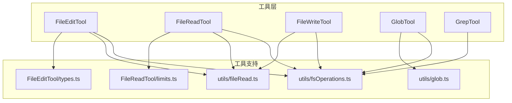
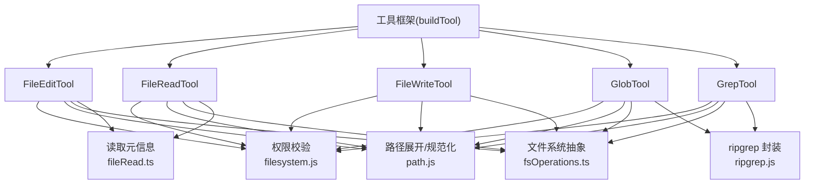
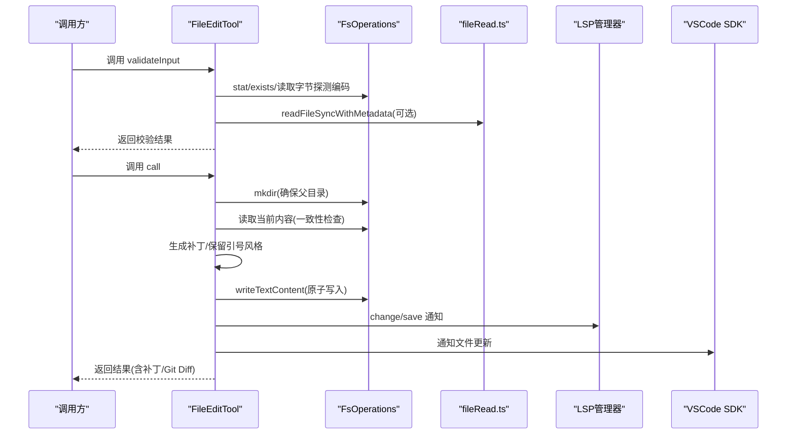
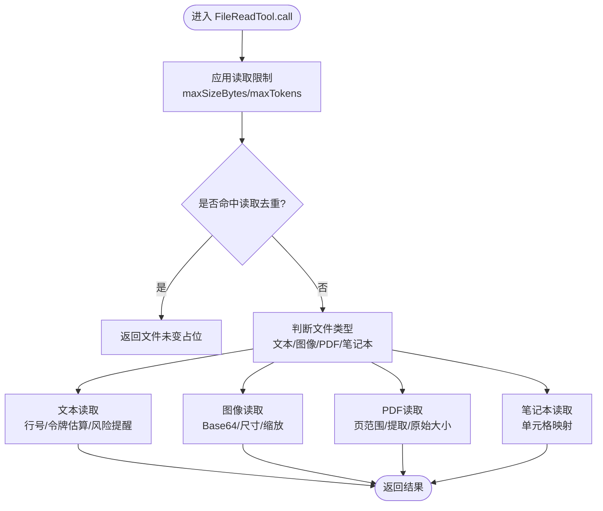
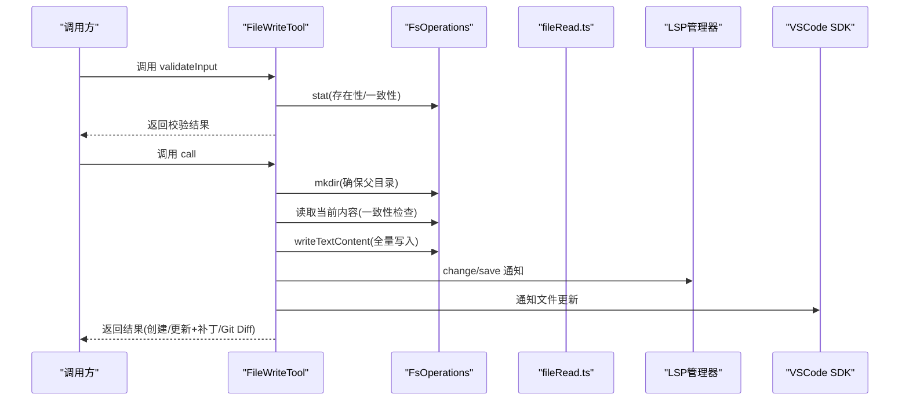
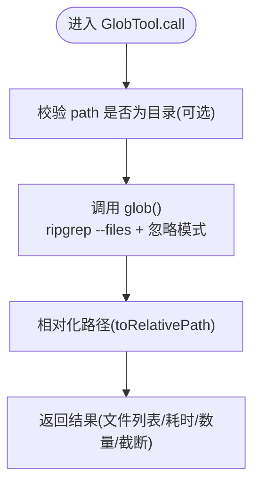
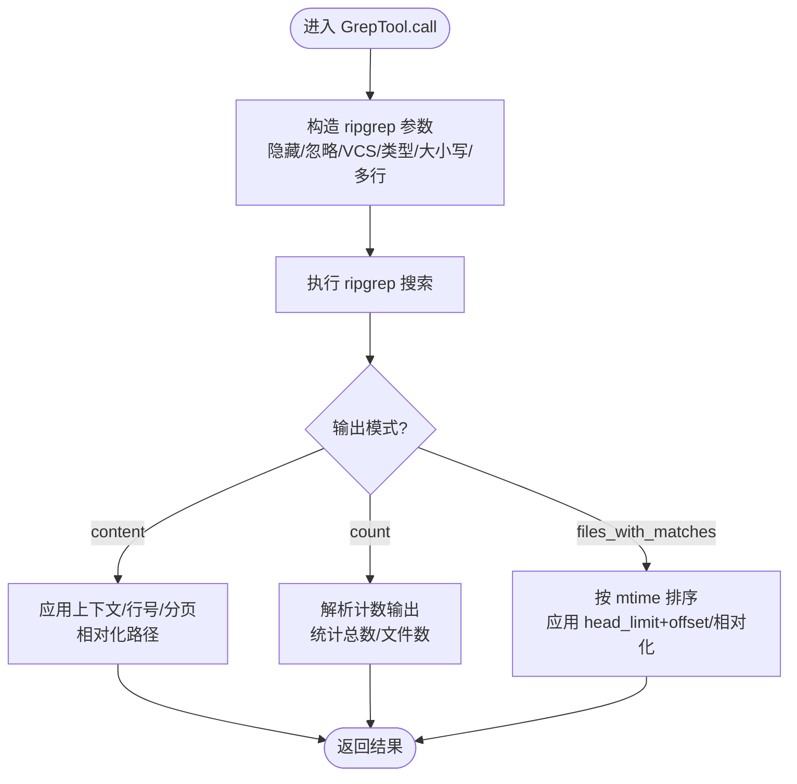
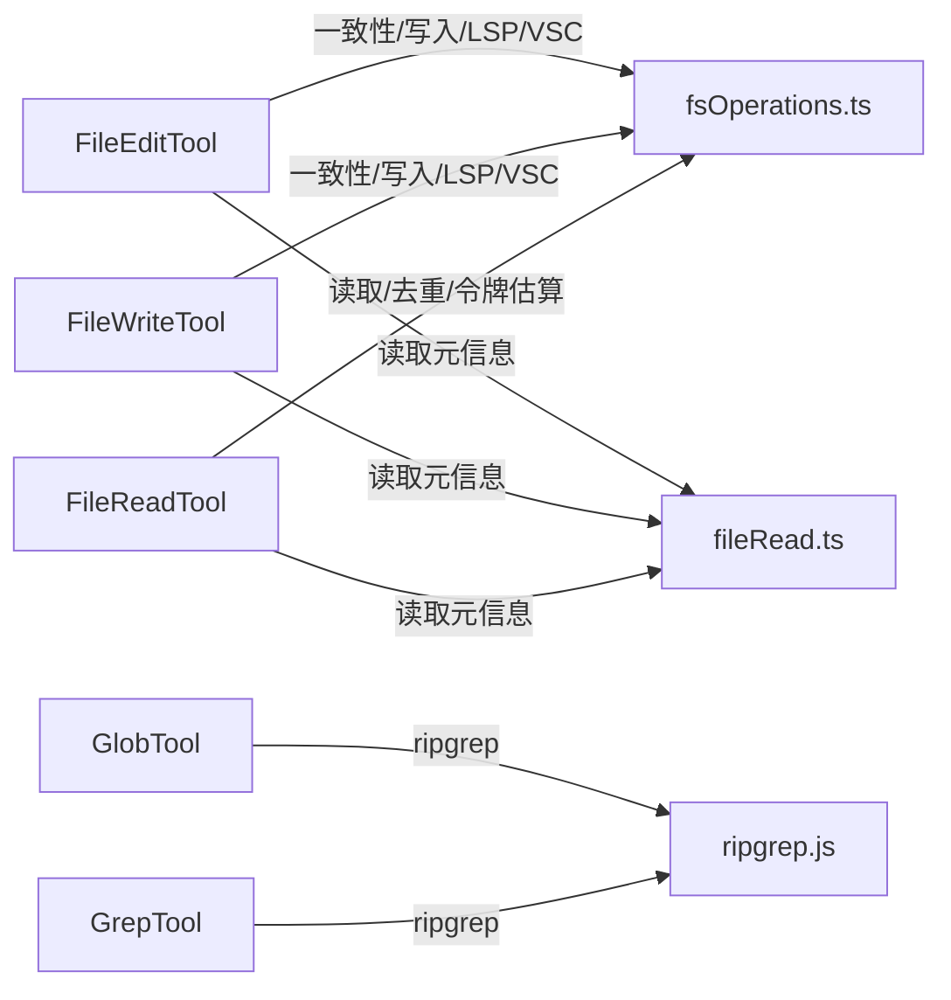

# 文件系统工具

<cite>
**本文引用的文件**
- [FileEditTool.ts](file://src/tools/FileEditTool/FileEditTool.ts)
- [FileReadTool.ts](file://src/tools/FileReadTool/FileReadTool.ts)
- [FileWriteTool.ts](file://src/tools/FileWriteTool/FileWriteTool.ts)
- [GlobTool.ts](file://src/tools/GlobTool/GlobTool.ts)
- [GrepTool.ts](file://src/tools/GrepTool/GrepTool.ts)
- [types.ts](file://src/tools/FileEditTool/types.ts)
- [limits.ts](file://src/tools/FileReadTool/limits.ts)
- [fileRead.ts](file://src/utils/fileRead.ts)
- [fsOperations.ts](file://src/utils/fsOperations.ts)
- [glob.ts](file://src/utils/glob.ts)
</cite>

## 目录
1. [简介](#简介)
2. [项目结构](#项目结构)
3. [核心组件](#核心组件)
4. [架构总览](#架构总览)
5. [详细组件分析](#详细组件分析)
6. [依赖关系分析](#依赖关系分析)
7. [性能考量](#性能考量)
8. [故障排查指南](#故障排查指南)
9. [结论](#结论)
10. [附录](#附录)

## 简介
本文件系统工具的技术文档聚焦以下能力：
- 文件编辑：FileEditTool（就地修改、变更检测、原子写入）
- 文件读取：FileReadTool（文本/图像/PDF/笔记本等多格式读取、令牌与大小限制、去重）
- 文件写入：FileWriteTool（覆盖/新建、变更检测、原子写入）
- 文件匹配：GlobTool（基于 ripgrep 的 glob 搜索）
- 文本搜索：GrepTool（正则检索、上下文、计数、分页）

文档将从架构、数据流、处理逻辑、安全限制、缓存与性能优化、最佳实践与错误处理等方面进行系统化阐述，并给出与 IDE 集成与文件系统监控的关系说明。

## 项目结构
围绕文件系统工具的关键模块如下：
- 工具层：FileEditTool、FileReadTool、FileWriteTool、GlobTool、GrepTool
- 工具类型与输出：FileEditTool/types.ts
- 读取限制：FileReadTool/limits.ts
- 文件读取元数据：utils/fileRead.ts
- 文件系统抽象：utils/fsOperations.ts
- glob 实现：utils/glob.ts

图表来源
- [FileEditTool.ts:1-626](file://src/tools/FileEditTool/FileEditTool.ts#L1-L626)
- [FileReadTool.ts:1-1184](file://src/tools/FileReadTool/FileReadTool.ts#L1-L1184)
- [FileWriteTool.ts:1-435](file://src/tools/FileWriteTool/FileWriteTool.ts#L1-L435)
- [GlobTool.ts:1-199](file://src/tools/GlobTool/GlobTool.ts#L1-L199)
- [GrepTool.ts:1-578](file://src/tools/GrepTool/GrepTool.ts#L1-L578)
- [types.ts:1-86](file://src/tools/FileEditTool/types.ts#L1-L86)
- [limits.ts:1-93](file://src/tools/FileReadTool/limits.ts#L1-L93)
- [fileRead.ts:1-103](file://src/utils/fileRead.ts#L1-L103)
- [fsOperations.ts:1-771](file://src/utils/fsOperations.ts#L1-L771)
- [glob.ts:1-131](file://src/utils/glob.ts#L1-L131)

章节来源
- [FileEditTool.ts:1-626](file://src/tools/FileEditTool/FileEditTool.ts#L1-L626)
- [FileReadTool.ts:1-1184](file://src/tools/FileReadTool/FileReadTool.ts#L1-L1184)
- [FileWriteTool.ts:1-435](file://src/tools/FileWriteTool/FileWriteTool.ts#L1-L435)
- [GlobTool.ts:1-199](file://src/tools/GlobTool/GlobTool.ts#L1-L199)
- [GrepTool.ts:1-578](file://src/tools/GrepTool/GrepTool.ts#L1-L578)
- [types.ts:1-86](file://src/tools/FileEditTool/types.ts#L1-L86)
- [limits.ts:1-93](file://src/tools/FileReadTool/limits.ts#L1-L93)
- [fileRead.ts:1-103](file://src/utils/fileRead.ts#L1-L103)
- [fsOperations.ts:1-771](file://src/utils/fsOperations.ts#L1-L771)
- [glob.ts:1-131](file://src/utils/glob.ts#L1-L131)

## 核心组件
- FileEditTool：对单文件执行“旧串→新串”的替换，支持全量替换；内置权限校验、UNC 路径防护、大小限制、只读缓存一致性检查、编码与换行检测、原子写入、LSP 通知、VSCode Diff 通知、历史备份与 Git Diff 计算。
- FileReadTool：统一读取文本/图像/PDF/笔记本；支持偏移范围读取、令牌上限、设备文件阻断、macOS 截图路径兼容、自动记忆文件新鲜度提示、读取去重、会话文件类型识别、PDF 分页提取。
- FileWriteTool：覆盖或新建文件；严格的一致性检查（读取时间戳对比）、原子写入、编码与换行策略、LSP/VSC 通知、历史备份、Git Diff 计算。
- GlobTool：基于 ripgrep 的文件名匹配，支持目录与模式校验、结果去重、相对路径输出、最大结果限制。
- GrepTool：基于 ripgrep 的内容搜索，支持正则、大小写不敏感、上下文、计数、类型过滤、忽略模式、插件缓存排除、排序与分页、WSL 性能注意。

章节来源
- [FileEditTool.ts:86-595](file://src/tools/FileEditTool/FileEditTool.ts#L86-L595)
- [FileReadTool.ts:337-718](file://src/tools/FileReadTool/FileReadTool.ts#L337-L718)
- [FileWriteTool.ts:94-434](file://src/tools/FileWriteTool/FileWriteTool.ts#L94-L434)
- [GlobTool.ts:57-198](file://src/tools/GlobTool/GlobTool.ts#L57-L198)
- [GrepTool.ts:160-577](file://src/tools/GrepTool/GrepTool.ts#L160-L577)

## 架构总览
文件系统工具通过统一的工具框架构建，共享权限校验、路径展开、只读/并发特性声明、UI 渲染与摘要生成。底层文件系统抽象由 fsOperations.ts 提供，读取元信息由 fileRead.ts 提供，glob 使用 utils/glob.ts 基于 ripgrep 实现。

图表来源
- [FileEditTool.ts:1-626](file://src/tools/FileEditTool/FileEditTool.ts#L1-L626)
- [FileReadTool.ts:1-1184](file://src/tools/FileReadTool/FileReadTool.ts#L1-L1184)
- [FileWriteTool.ts:1-435](file://src/tools/FileWriteTool/FileWriteTool.ts#L1-L435)
- [GlobTool.ts:1-199](file://src/tools/GlobTool/GlobTool.ts#L1-L199)
- [GrepTool.ts:1-578](file://src/tools/GrepTool/GrepTool.ts#L1-L578)
- [fsOperations.ts:1-771](file://src/utils/fsOperations.ts#L1-L771)
- [fileRead.ts:1-103](file://src/utils/fileRead.ts#L1-L103)
- [glob.ts:1-131](file://src/utils/glob.ts#L1-L131)

## 详细组件分析

### FileEditTool 组件分析
- 输入与输出
  - 输入：文件绝对路径、旧字符串、新字符串、可选 replace_all
  - 输出：包含原文件内容、变更补丁、是否全部替换、可选 Git Diff
- 权限与路径
  - expandPath 规范化路径；权限匹配器使用通配符规则；UNC 路径跳过文件系统操作以避免 NTLM 泄漏
- 安全与一致性
  - 最大文件尺寸限制（1GiB）；仅在必要时读取字节以探测编码；空文件与不存在文件的区分；读取时间戳与内容一致性校验（Windows 时间戳抖动回退到内容比较）
  - 团队内存含密检测；笔记本文档拒绝编辑
- 内容处理
  - 编码检测（UTF-16 LE、UTF-8 BOM、默认 UTF-8）；换行风格检测；引号风格保留；生成结构化补丁
- 原子写入与通知
  - 写前确保父目录存在；历史备份；写入后更新读取时间戳；LSP didChange/didSave；VSCode Diff 通知
- 可观测性
  - 操作日志、行变更统计、可选 Git Diff 计算

图表来源
- [FileEditTool.ts:387-574](file://src/tools/FileEditTool/FileEditTool.ts#L387-L574)
- [fileRead.ts:75-98](file://src/utils/fileRead.ts#L75-L98)
- [fsOperations.ts:1-771](file://src/utils/fsOperations.ts#L1-L771)

章节来源
- [FileEditTool.ts:137-362](file://src/tools/FileEditTool/FileEditTool.ts#L137-L362)
- [FileEditTool.ts:387-574](file://src/tools/FileEditTool/FileEditTool.ts#L387-L574)
- [types.ts:1-86](file://src/tools/FileEditTool/types.ts#L1-L86)
- [fileRead.ts:1-103](file://src/utils/fileRead.ts#L1-L103)

### FileReadTool 组件分析
- 多格式支持
  - 文本：行号格式化、令牌估算与上限控制、Cyber 风险提醒
  - 图像：Base64 编码、尺寸信息、缩放与降采样
  - PDF：页范围解析与提取、分页输出、原始大小
  - 笔记本：单元格映射为工具结果
- 限制与去重
  - 默认最大输出令牌与文件大小；同范围同文件且未变化时返回“文件未变”占位，避免重复传输
- 设备与路径安全
  - 特殊设备路径阻断；macOS 截图路径薄空格兼容；ENOENT 友好提示与相似文件建议
- 会话文件识别与新鲜度
  - 识别会话记忆与转录文件，附加新鲜度提示

图表来源
- [FileReadTool.ts:496-718](file://src/tools/FileReadTool/FileReadTool.ts#L496-L718)
- [limits.ts:1-93](file://src/tools/FileReadTool/limits.ts#L1-L93)

章节来源
- [FileReadTool.ts:418-495](file://src/tools/FileReadTool/FileReadTool.ts#L418-L495)
- [FileReadTool.ts:496-718](file://src/tools/FileReadTool/FileReadTool.ts#L496-L718)
- [limits.ts:1-93](file://src/tools/FileReadTool/limits.ts#L1-L93)

### FileWriteTool 组件分析
- 输入与一致性
  - 输入：绝对路径与完整内容；必须先读取再写入；写前 stat 比较 mtime 与读取时间戳
- 写入策略
  - 全量替换；显式换行策略；原子写入；写后 LSP/VSC 通知；更新读取时间戳
- 结果与可观测性
  - 区分创建与更新；计算结构化补丁；可选 Git Diff；行变更统计

图表来源
- [FileWriteTool.ts:223-417](file://src/tools/FileWriteTool/FileWriteTool.ts#L223-L417)
- [fileRead.ts:75-98](file://src/utils/fileRead.ts#L75-L98)
- [fsOperations.ts:1-771](file://src/utils/fsOperations.ts#L1-L771)

章节来源
- [FileWriteTool.ts:153-222](file://src/tools/FileWriteTool/FileWriteTool.ts#L153-L222)
- [FileWriteTool.ts:223-417](file://src/tools/FileWriteTool/FileWriteTool.ts#L223-L417)

### GlobTool 组件分析
- 功能要点
  - 校验可选搜索目录（存在性与目录类型）；基于 ripgrep 的文件名匹配；相对路径输出；最大结果限制；返回耗时、数量与截断标记
- 路径与权限
  - expandPath 规范化；UNC 跳过；权限匹配器使用通配符规则

图表来源
- [GlobTool.ts:154-176](file://src/tools/GlobTool/GlobTool.ts#L154-L176)
- [glob.ts:66-131](file://src/utils/glob.ts#L66-L131)

章节来源
- [GlobTool.ts:94-134](file://src/tools/GlobTool/GlobTool.ts#L94-L134)
- [GlobTool.ts:154-176](file://src/tools/GlobTool/GlobTool.ts#L154-L176)
- [glob.ts:66-131](file://src/utils/glob.ts#L66-L131)

### GrepTool 组件分析
- 模式与参数
  - 正则表达式、可选路径、glob 过滤、输出模式（内容/文件/计数）、上下文（-B/-A/-C 或 -C）、行号、大小写不敏感、类型过滤、head_limit/offset、多行模式
- 执行流程
  - 构造 ripgrep 参数（隐藏、最大列宽、忽略 VCS、忽略模式、插件缓存排除、可选类型/大小写/多行）；执行搜索；根据模式转换结果（相对路径、排序、分页、计数汇总）
- 性能与限制
  - 默认 head_limit=250；WSL 性能注意；超时由 ripgrep 自身处理

图表来源
- [GrepTool.ts:310-576](file://src/tools/GrepTool/GrepTool.ts#L310-L576)

章节来源
- [GrepTool.ts:201-232](file://src/tools/GrepTool/GrepTool.ts#L201-L232)
- [GrepTool.ts:310-576](file://src/tools/GrepTool/GrepTool.ts#L310-L576)

## 依赖关系分析
- 工具间耦合
  - FileEditTool 与 FileWriteTool 共享“一致性检查”“原子写入”“LSP/VSC 通知”“历史备份”等通用流程
  - FileReadTool 与 FileEditTool/FileWriteTool 共享“读取状态缓存”“路径规范化”“权限校验”
  - GlobTool 与 GrepTool 共享“ripgrep 封装”“忽略模式”“分页/排序”等能力
- 外部依赖
  - ripgrep：GlobTool 与 GrepTool 的核心实现
  - LSP/VSCode：文件变更通知与差异展示
  - 文件系统抽象：统一的 FsOperations 接口

图表来源
- [FileEditTool.ts:1-626](file://src/tools/FileEditTool/FileEditTool.ts#L1-L626)
- [FileWriteTool.ts:1-435](file://src/tools/FileWriteTool/FileWriteTool.ts#L1-L435)
- [FileReadTool.ts:1-1184](file://src/tools/FileReadTool/FileReadTool.ts#L1-L1184)
- [GlobTool.ts:1-199](file://src/tools/GlobTool/GlobTool.ts#L1-L199)
- [GrepTool.ts:1-578](file://src/tools/GrepTool/GrepTool.ts#L1-L578)
- [fsOperations.ts:1-771](file://src/utils/fsOperations.ts#L1-L771)
- [fileRead.ts:1-103](file://src/utils/fileRead.ts#L1-L103)

章节来源
- [fsOperations.ts:1-771](file://src/utils/fsOperations.ts#L1-L771)
- [glob.ts:1-131](file://src/utils/glob.ts#L1-L131)

## 性能考量
- 读取限制
  - FileReadTool 默认最大输出令牌与文件大小，避免超大文件导致上下文膨胀；支持环境变量覆盖与实验开关
- 去重与缓存
  - 同范围同文件且 mtime 不变时返回“文件未变”占位，减少重复传输
- 异步与分页
  - GrepTool 默认 head_limit=250，支持 offset/head_limit 分页；GlobTool 限制最大结果数
- I/O 优化
  - 读取元信息一次性探测编码与换行风格；ripgrep 基于文件系统扫描，避免逐文件 stat
- 平台注意
  - WSL 上文件读取性能显著下降，搜索超时由 ripgrep 自身处理

章节来源
- [limits.ts:1-93](file://src/tools/FileReadTool/limits.ts#L1-L93)
- [FileReadTool.ts:530-573](file://src/tools/FileReadTool/FileReadTool.ts#L530-L573)
- [GrepTool.ts:108-128](file://src/tools/GrepTool/GrepTool.ts#L108-L128)
- [GlobTool.ts:157-172](file://src/tools/GlobTool/GlobTool.ts#L157-L172)
- [fileRead.ts:75-98](file://src/utils/fileRead.ts#L75-L98)
- [GrepTool.ts:436-441](file://src/tools/GrepTool/GrepTool.ts#L436-L441)

## 故障排查指南
- 文件不存在
  - FileReadTool/GlobTool/GrepTool 在 ENOENT 时提供相似文件建议与工作目录提示
- 权限拒绝
  - 通过权限匹配器与 deny 规则拦截；UNC 路径在权限阶段跳过文件系统操作
- 修改冲突
  - FileEditTool/FileWriteTool 在读取时间戳与 mtime 不一致时抛出“意外修改”错误；Windows 下回退到内容一致性比较
- 设备文件阻断
  - FileReadTool 显式阻断无限输出或阻塞输入的设备文件
- 大文件与令牌超限
  - FileReadTool 对超过阈值的文件抛错；建议使用 offset/limit 或分段读取
- 搜索无结果
  - GrepTool/GlobTool 返回“未找到”或“无文件”，可调整模式/路径/忽略模式

章节来源
- [FileReadTool.ts:609-650](file://src/tools/FileReadTool/FileReadTool.ts#L609-L650)
- [GlobTool.ts:94-134](file://src/tools/GlobTool/GlobTool.ts#L94-L134)
- [GrepTool.ts:201-232](file://src/tools/GrepTool/GrepTool.ts#L201-L232)
- [FileEditTool.ts:464-468](file://src/tools/FileEditTool/FileEditTool.ts#L464-L468)
- [FileWriteTool.ts:282-295](file://src/tools/FileWriteTool/FileWriteTool.ts#L282-L295)

## 结论
上述文件系统工具在安全性、一致性与性能之间取得平衡：通过严格的权限与路径校验、读取状态缓存与一致性检查、原子写入与 LSP/VSCode 集成，保障了编辑行为的可控与可观测；通过 ripgrep 的高效扫描、读取限制与去重策略，提升了大规模文件与搜索场景下的可用性。结合 IDE 集成与文件系统监控，可进一步增强开发体验与协作效率。

## 附录
- 与 IDE 集成
  - LSP：didChange/didSave 通知，触发语言服务器诊断
  - VSCode：文件更新通知，用于差异视图
- 文件系统监控
  - 读取状态缓存与时间戳一致性检查，防止并发写入导致的数据不一致
- 最佳实践
  - 优先使用 FileReadTool 获取上下文，再用 FileEditTool/FileWriteTool 修改
  - 使用 GlobTool/GrepTool 精准定位文件与内容，配合 head_limit/offset 控制输出规模
  - 注意 UNC 路径与特殊设备文件的限制
  - 在 Windows 上留意时间戳抖动，必要时依赖内容一致性检查