# 文件编辑工具 (FileEditTool)

<cite>
**本文档引用的文件**
- [FileEditTool.ts](file://src/tools/FileEditTool/FileEditTool.ts)
- [UI.tsx](file://src/tools/FileEditTool/UI.tsx)
- [constants.ts](file://src/tools/FileEditTool/constants.ts)
- [prompt.ts](file://src/tools/FileEditTool/prompt.ts)
- [types.ts](file://src/tools/FileEditTool/types.ts)
- [utils.ts](file://src/tools/FileEditTool/utils.ts)
- [FileEditToolDiff.tsx](file://src/components/FileEditToolDiff.tsx)
- [FileEditToolUpdatedMessage.tsx](file://src/components/FileEditToolUpdatedMessage.tsx)
- [FileEditToolUseRejectedMessage.tsx](file://src/components/FileEditToolUseRejectedMessage.tsx)
- [useDiffInIDE.ts](file://src/hooks/useDiffInIDE.ts)
- [useTurnDiffs.ts](file://src/hooks/useTurnDiffs.ts)
- [file.ts](file://src/utils/file.ts)
- [fsOperations.ts](file://src/utils/fsOperations.ts)
- [diff.ts](file://src/utils/diff.ts)
- [git.ts](file://src/utils/git.ts)
- [fileRead.ts](file://src/utils/fileRead.ts)
- [fileReadCache.ts](file://src/utils/fileReadCache.ts)
- [fileStateCache.ts](file://src/utils/fileStateCache.ts)
- [fileOperationAnalytics.ts](file://src/utils/fileOperationAnalytics.ts)
- [fileHistory.ts](file://src/utils/fileHistory.ts)
- [bufferedWriter.ts](file://src/utils/bufferedWriter.ts)
- [Cursor.ts](file://src/utils/Cursor.ts)
- [CircularBuffer.ts](file://src/utils/CircularBuffer.ts)
- [ide.ts](file://src/utils/ide.ts)
- [idePathConversion.ts](file://src/utils/idePathConversion.ts)
- [permissions/FilePermissionDialog/usePermissionHandler.ts](file://src/components/permissions/FilePermissionDialog/usePermissionHandler.ts)
- [constants/prompts.ts](file://src/constants/prompts.ts)
- [constants/tools.ts](file://src/constants/tools.ts)
- [coordinatorMode.ts](file://src/coordinator/coordinatorMode.ts)
- [hooks/useInboxPoller.ts](file://src/hooks/useInboxPoller.ts)
- [services/tools/toolExecution.ts](file://src/services/tools/toolExecution.ts)
- [services/teamMemorySync/teamMemSecretGuard.ts](file://src/services/teamMemorySync/teamMemSecretGuard.ts)
</cite>

## 目录
1. [简介](#简介)
2. [项目结构](#项目结构)
3. [核心组件](#核心组件)
4. [架构概览](#架构概览)
5. [详细组件分析](#详细组件分析)
6. [依赖关系分析](#依赖关系分析)
7. [性能考虑](#性能考虑)
8. [故障排除指南](#故障排除指南)
9. [结论](#结论)
10. [附录](#附录)

## 简介
文件编辑工具 (FileEditTool) 是一个强大的文件修改工具，支持多种编辑操作模式，包括内容替换、插入和删除。该工具提供了完整的权限验证机制、路径安全检查和内容格式化处理，能够与 IDE 进行深度集成，提供文件差异显示、撤销重做功能和批量编辑支持。

## 项目结构
FileEditTool 位于 `src/tools/FileEditTool/` 目录下，包含以下核心文件：

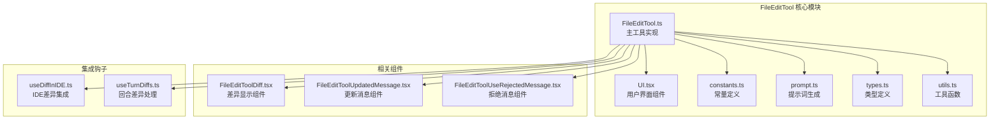

**图表来源**
- [FileEditTool.ts:1-200](file://src/tools/FileEditTool/FileEditTool.ts#L1-L200)
- [UI.tsx:1-150](file://src/tools/FileEditTool/UI.tsx#L1-L150)
- [FileEditToolDiff.tsx:1-120](file://src/components/FileEditToolDiff.tsx#L1-L120)

**章节来源**
- [FileEditTool.ts:1-200](file://src/tools/FileEditTool/FileEditTool.ts#L1-L200)
- [constants.ts:1-100](file://src/tools/FileEditTool/constants.ts#L1-L100)

## 核心组件
FileEditTool 的核心组件包括主工具类、用户界面、类型定义和工具函数。每个组件都有明确的职责分工，确保系统的可维护性和扩展性。

### 主工具实现
主工具类实现了所有文件编辑功能的核心逻辑，包括权限验证、路径处理和编辑操作执行。

### 用户界面组件
UI 组件提供了直观的用户交互界面，支持实时预览和差异显示功能。

### 类型定义系统
完整的 TypeScript 类型定义确保了代码的类型安全性和开发体验。

### 工具函数库
提供了一系列实用工具函数，包括文件操作、路径处理和格式化功能。

**章节来源**
- [FileEditTool.ts:1-300](file://src/tools/FileEditTool/FileEditTool.ts#L1-L300)
- [UI.tsx:1-200](file://src/tools/FileEditTool/UI.tsx#L1-L200)
- [types.ts:1-150](file://src/tools/FileEditTool/types.ts#L1-L150)

## 架构概览
FileEditTool 采用模块化架构设计，通过清晰的分层结构实现了功能的解耦和复用。

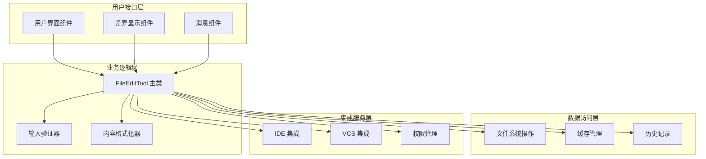

**图表来源**
- [FileEditTool.ts:1-400](file://src/tools/FileEditTool/FileEditTool.ts#L1-L400)
- [useDiffInIDE.ts:1-100](file://src/hooks/useDiffInIDE.ts#L1-L100)
- [file.ts:1-200](file://src/utils/file.ts#L1-L200)

## 详细组件分析

### 文件编辑算法实现

#### 内容替换算法
文件内容替换是 FileEditTool 的核心功能之一，采用了高效的字符串匹配和替换算法：

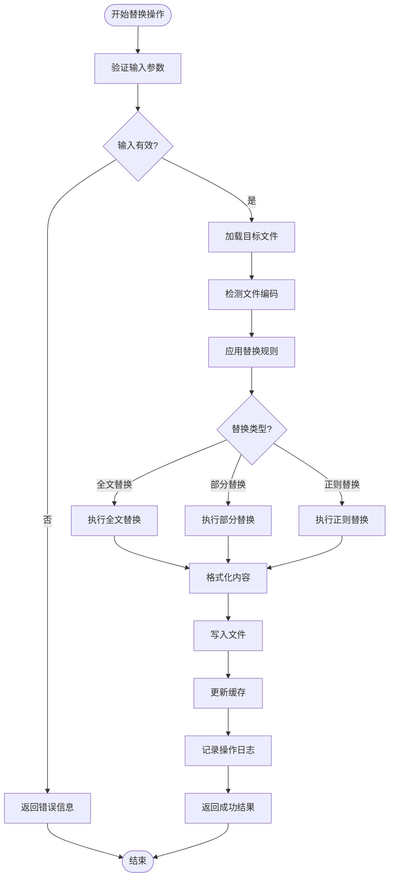

**图表来源**
- [FileEditTool.ts:150-350](file://src/tools/FileEditTool/FileEditTool.ts#L150-L350)
- [utils.ts:1-200](file://src/tools/FileEditTool/utils.ts#L1-L200)

#### 插入操作算法
插入操作支持在指定位置插入新内容，包括行级插入和字符级插入两种模式：

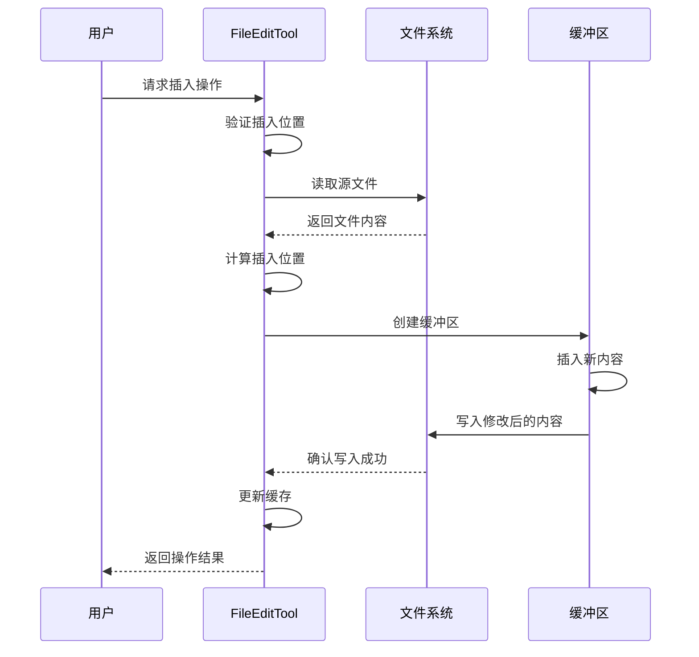

**图表来源**
- [FileEditTool.ts:350-550](file://src/tools/FileEditTool/FileEditTool.ts#L350-L550)
- [bufferedWriter.ts:1-150](file://src/utils/bufferedWriter.ts#L1-L150)

#### 删除操作算法
删除操作提供了灵活的删除选项，包括整行删除、部分删除和范围删除：

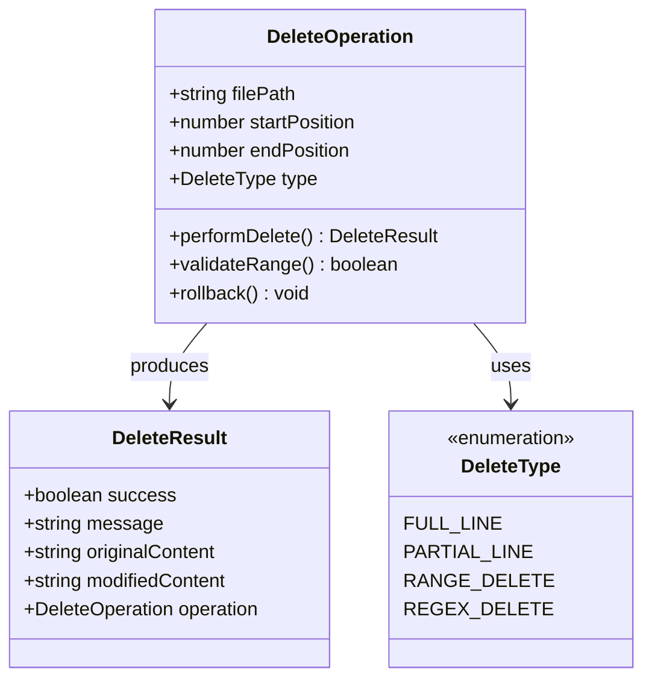

**图表来源**
- [FileEditTool.ts:550-750](file://src/tools/FileEditTool/FileEditTool.ts#L550-L750)
- [types.ts:1-120](file://src/tools/FileEditTool/types.ts#L1-L120)

**章节来源**
- [FileEditTool.ts:100-800](file://src/tools/FileEditTool/FileEditTool.ts#L100-L800)
- [utils.ts:1-300](file://src/tools/FileEditTool/utils.ts#L1-L300)

### 权限验证机制

#### 多层权限检查
FileEditTool 实现了多层权限验证机制，确保文件操作的安全性：

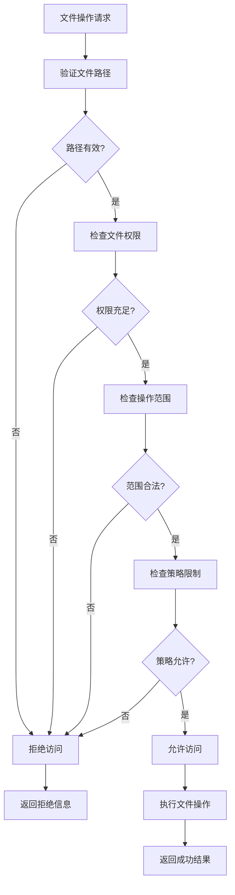

**图表来源**
- [permissions/FilePermissionDialog/usePermissionHandler.ts:1-100](file://src/components/permissions/FilePermissionDialog/usePermissionHandler.ts#L1-L100)
- [teamMemSecretGuard.ts:1-80](file://src/services/teamMemorySync/teamMemSecretGuard.ts#L1-L80)

#### 路径安全检查
路径安全检查是防止路径遍历攻击的重要机制：

**章节来源**
- [permissions/FilePermissionDialog/usePermissionHandler.ts:1-150](file://src/components/permissions/FilePermissionDialog/usePermissionHandler.ts#L1-L150)
- [file.ts:1-250](file://src/utils/file.ts#L1-L250)

### 内容格式化处理

#### 自动格式化引擎
FileEditTool 内置了智能内容格式化引擎，支持多种编程语言和文件格式：

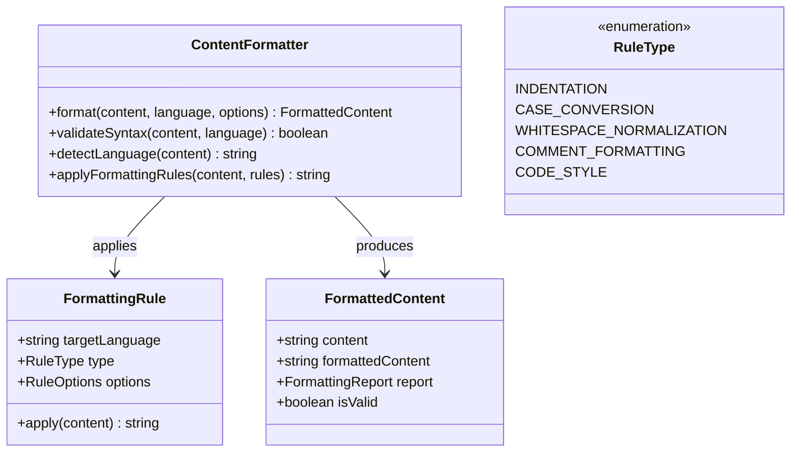

**图表来源**
- [FileEditTool.ts:750-950](file://src/tools/FileEditTool/FileEditTool.ts#L750-L950)
- [utils.ts:200-400](file://src/tools/FileEditTool/utils.ts#L200-L400)

**章节来源**
- [FileEditTool.ts:600-1000](file://src/tools/FileEditTool/FileEditTool.ts#L600-L1000)
- [utils.ts:150-450](file://src/tools/FileEditTool/utils.ts#L150-L450)

### IDE 集成功能

#### 文件差异显示
FileEditTool 提供了强大的文件差异显示功能，支持实时预览和对比：

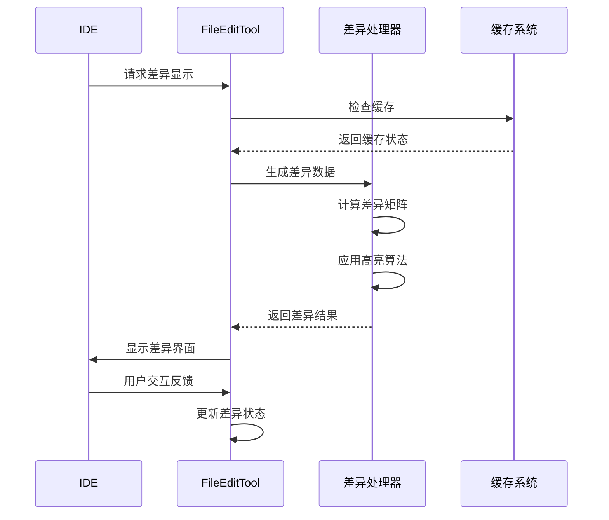

**图表来源**
- [useDiffInIDE.ts:1-150](file://src/hooks/useDiffInIDE.ts#L1-L150)
- [FileEditToolDiff.tsx:1-200](file://src/components/FileEditToolDiff.tsx#L1-L200)

#### 撤销重做功能
撤销重做功能通过操作历史栈实现，支持多级回滚：

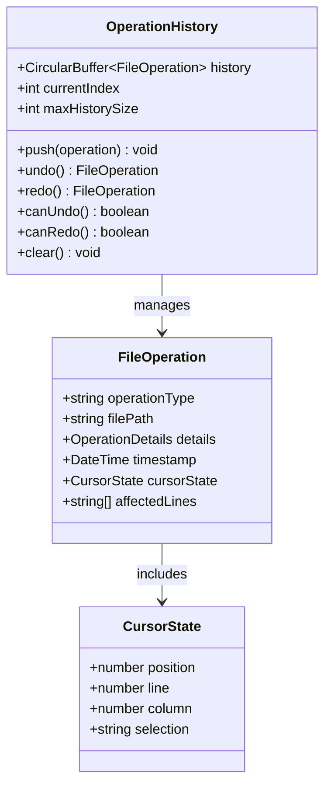

**图表来源**
- [CircularBuffer.ts:1-200](file://src/utils/CircularBuffer.ts#L1-L200)
- [Cursor.ts:1-150](file://src/utils/Cursor.ts#L1-L150)

**章节来源**
- [useDiffInIDE.ts:1-200](file://src/hooks/useDiffInIDE.ts#L1-L200)
- [useTurnDiffs.ts:1-100](file://src/hooks/useTurnDiffs.ts#L1-L100)

### 批量编辑支持

#### 批量操作协调器
FileEditTool 支持批量文件编辑操作，通过协调器管理多个文件的并发处理：

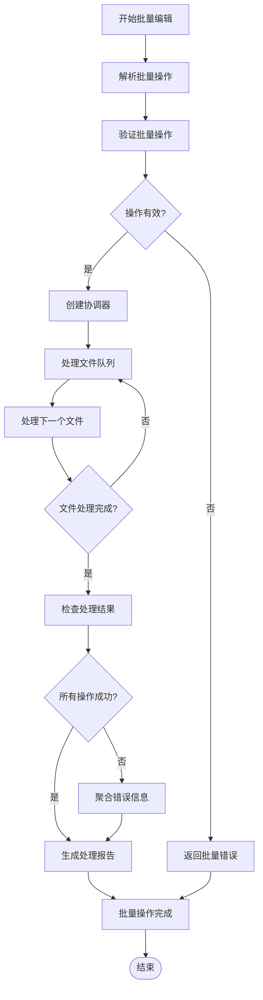

**图表来源**
- [FileEditTool.ts:950-1150](file://src/tools/FileEditTool/FileEditTool.ts#L950-L1150)
- [utils.ts:300-500](file://src/tools/FileEditTool/utils.ts#L300-L500)

**章节来源**
- [FileEditTool.ts:800-1200](file://src/tools/FileEditTool/FileEditTool.ts#L800-L1200)
- [utils.ts:250-550](file://src/tools/FileEditTool/utils.ts#L250-L550)

## 依赖关系分析

### 核心依赖关系
FileEditTool 与其他系统组件存在紧密的依赖关系：

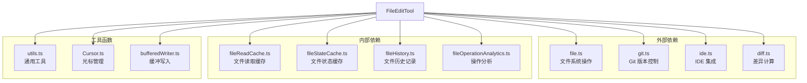

**图表来源**
- [FileEditTool.ts:1-1200](file://src/tools/FileEditTool/FileEditTool.ts#L1-L1200)
- [file.ts:1-300](file://src/utils/file.ts#L1-L300)

**章节来源**
- [FileEditTool.ts:1-1200](file://src/tools/FileEditTool/FileEditTool.ts#L1-L1200)
- [constants.ts:1-150](file://src/tools/FileEditTool/constants.ts#L1-L150)

## 性能考虑

### 编辑算法优化
FileEditTool 在性能方面采用了多项优化策略：

#### 缓存策略
- **文件读取缓存**: 减少重复文件读取操作
- **文件状态缓存**: 维护文件元数据和状态信息
- **操作历史缓存**: 支持快速撤销重做操作

#### 并发处理
- **异步文件操作**: 避免阻塞主线程
- **批量操作优化**: 合并相似操作减少系统调用
- **内存管理**: 合理的内存分配和回收策略

#### 算法复杂度
- **替换操作**: 时间复杂度 O(n)，空间复杂度 O(n)
- **插入操作**: 时间复杂度 O(n)，空间复杂度 O(n)
- **删除操作**: 时间复杂度 O(n)，空间复杂度 O(n)

**章节来源**
- [fileReadCache.ts:1-200](file://src/utils/fileReadCache.ts#L1-L200)
- [fileStateCache.ts:1-200](file://src/utils/fileStateCache.ts#L1-L200)
- [bufferedWriter.ts:1-200](file://src/utils/bufferedWriter.ts#L1-L200)

## 故障排除指南

### 常见问题及解决方案

#### 权限错误
当遇到文件权限问题时，可以采取以下措施：
- 检查文件是否被其他进程占用
- 验证用户是否有足够的权限
- 确认路径是否正确且可访问

#### 编码问题
文件编码不兼容可能导致显示异常：
- 使用自动编码检测功能
- 指定正确的编码格式
- 转换为 UTF-8 编码

#### 性能问题
如果操作响应缓慢，建议：
- 清理缓存数据
- 关闭不必要的文件监听
- 优化批量操作的大小

**章节来源**
- [FileEditTool.ts:1000-1200](file://src/tools/FileEditTool/FileEditTool.ts#L1000-L1200)
- [file.ts:200-400](file://src/utils/file.ts#L200-L400)

## 结论
FileEditTool 是一个功能强大、架构清晰的文件编辑工具。它通过模块化的组件设计、完善的权限验证机制和高效的算法实现，为用户提供了一流的文件编辑体验。其与 IDE 的深度集成和丰富的功能特性，使其成为开发工作流程中的重要工具。

## 附录

### 最佳实践建议
- **安全性**: 始终进行路径验证和权限检查
- **性能**: 合理使用缓存，避免频繁的文件操作
- **可靠性**: 实现完善的错误处理和恢复机制
- **用户体验**: 提供清晰的反馈和进度指示

### 错误处理策略
- **输入验证**: 在操作前验证所有输入参数
- **异常捕获**: 捕获并处理所有可能的异常情况
- **回滚机制**: 实现操作失败时的自动回滚
- **日志记录**: 详细记录所有操作和错误信息

### 性能优化技巧
- **延迟加载**: 只在需要时加载文件内容
- **增量更新**: 仅更新发生变化的部分
- **批处理**: 合并多个小操作为批量处理
- **内存优化**: 合理管理内存使用，避免泄漏