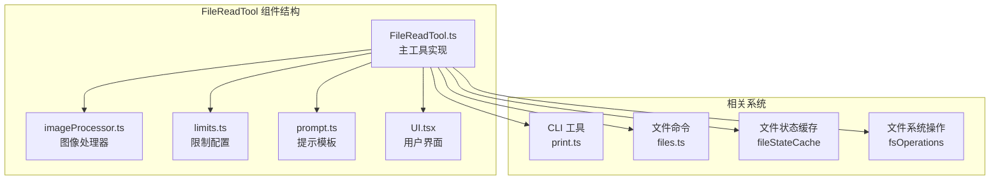
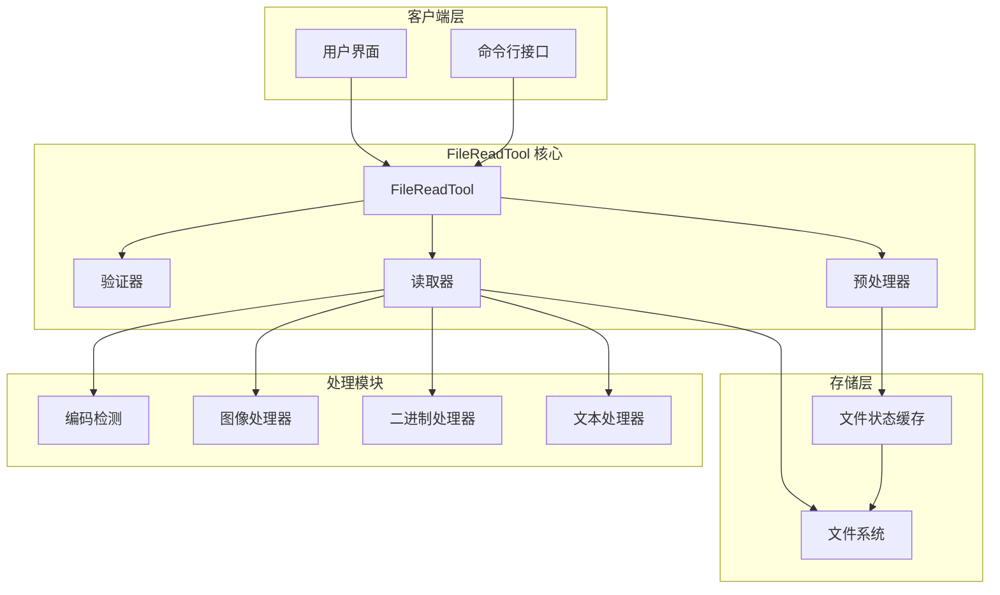
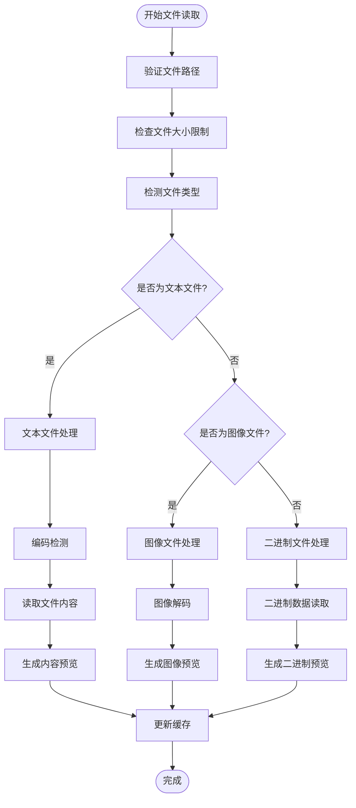
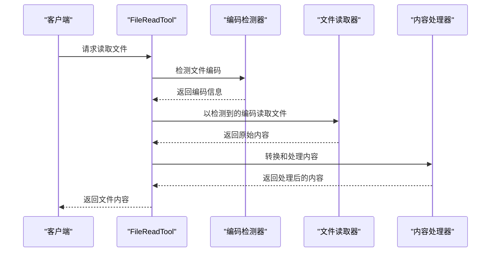
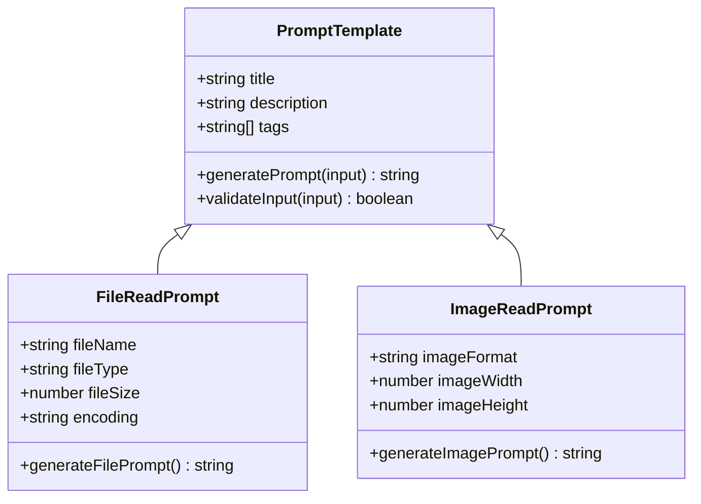
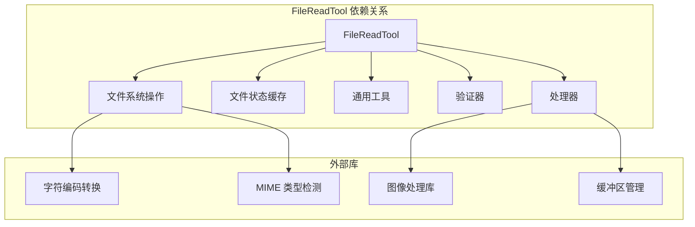
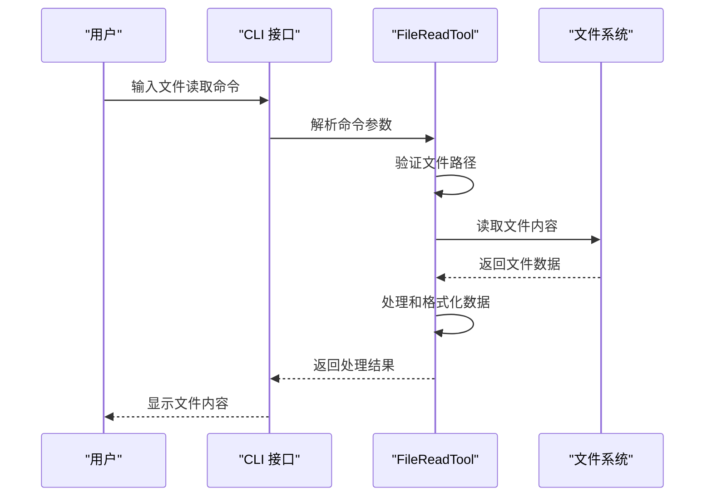
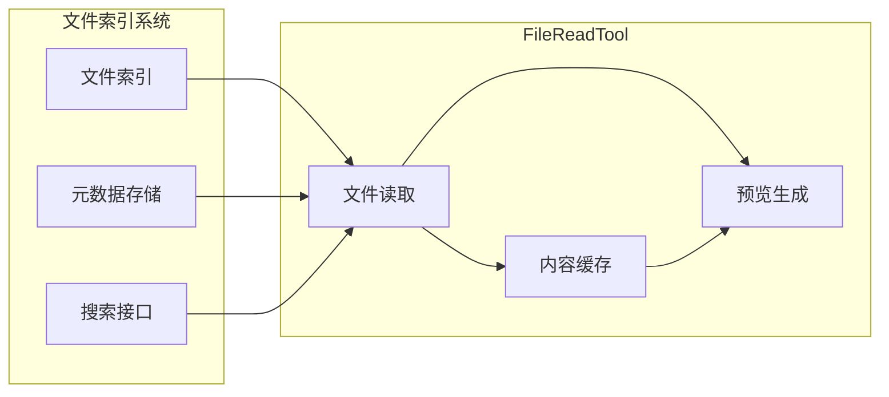

# 文件读取工具 (FileReadTool)

<cite>
**本文档引用的文件**
- [FileReadTool.ts](file://src/tools/FileReadTool/FileReadTool.ts)
- [imageProcessor.ts](file://src/tools/FileReadTool/imageProcessor.ts)
- [limits.ts](file://src/tools/FileReadTool/limits.ts)
- [prompt.ts](file://src/tools/FileReadTool/prompt.ts)
- [print.ts](file://src/cli/print.ts)
- [files.ts](file://src/commands/files/files.ts)
</cite>

## 目录
1. [简介](#简介)
2. [项目结构](#项目结构)
3. [核心组件](#核心组件)
4. [架构概览](#架构概览)
5. [详细组件分析](#详细组件分析)
6. [依赖关系分析](#依赖关系分析)
7. [性能考虑](#性能考虑)
8. [故障排除指南](#故障排除指南)
9. [结论](#结论)

## 简介

文件读取工具 (FileReadTool) 是 Claude Code 中的一个重要工具组件，负责安全地读取文件内容并提供内容预览功能。该工具支持多种文件类型的处理，包括文本文件和二进制文件，并集成了图像文件处理器来处理图片内容。

该工具的主要功能包括：
- 安全的文件读取和路径验证
- 文件大小限制和内存优化
- 编码检测和自动转换
- 图像文件的特殊处理
- 内容预览和上下文管理
- 与文件索引系统的协作

## 项目结构

FileReadTool 组件位于 `src/tools/FileReadTool/` 目录下，包含以下关键文件：

**图表来源**
- [FileReadTool.ts:1-200](file://src/tools/FileReadTool/FileReadTool.ts#L1-L200)
- [imageProcessor.ts:1-150](file://src/tools/FileReadTool/imageProcessor.ts#L1-L150)
- [limits.ts:1-100](file://src/tools/FileReadTool/limits.ts#L1-L100)

**章节来源**
- [FileReadTool.ts:1-200](file://src/tools/FileReadTool/FileReadTool.ts#L1-L200)
- [imageProcessor.ts:1-150](file://src/tools/FileReadTool/imageProcessor.ts#L1-L150)
- [limits.ts:1-100](file://src/tools/FileReadTool/limits.ts#L1-L100)
- [prompt.ts:1-100](file://src/tools/FileReadTool/prompt.ts#L1-L100)

## 核心组件

### 主要职责

FileReadTool 的核心职责包括：

1. **文件安全读取**: 验证文件路径，执行安全检查，防止目录遍历攻击
2. **多格式支持**: 处理文本文件、二进制文件和图像文件
3. **内容预览**: 提供文件内容的预览功能
4. **内存管理**: 实施文件大小限制和内存优化策略
5. **编码处理**: 自动检测和转换文件编码

### 关键特性

- **路径验证**: 确保文件访问在允许的范围内
- **大小限制**: 防止大文件占用过多内存
- **编码检测**: 支持多种文件编码格式
- **错误处理**: 提供健壮的错误恢复机制
- **性能优化**: 实现内存友好的文件读取策略

**章节来源**
- [FileReadTool.ts:1-200](file://src/tools/FileReadTool/FileReadTool.ts#L1-L200)
- [limits.ts:1-100](file://src/tools/FileReadTool/limits.ts#L1-L100)

## 架构概览

**图表来源**
- [FileReadTool.ts:1-200](file://src/tools/FileReadTool/FileReadTool.ts#L1-L200)
- [imageProcessor.ts:1-150](file://src/tools/FileReadTool/imageProcessor.ts#L1-L150)
- [limits.ts:1-100](file://src/tools/FileReadTool/limits.ts#L1-L100)

## 详细组件分析

### FileReadTool 主实现

FileReadTool 的主实现包含了完整的文件读取逻辑：

#### 文件类型处理流程

**图表来源**
- [FileReadTool.ts:1-200](file://src/tools/FileReadTool/FileReadTool.ts#L1-L200)
- [imageProcessor.ts:1-150](file://src/tools/FileReadTool/imageProcessor.ts#L1-L150)

#### 安全检查机制

FileReadTool 实施了多层次的安全检查：

1. **路径验证**: 确保文件路径在允许的范围内
2. **权限检查**: 验证用户对目标文件的访问权限
3. **文件类型验证**: 防止恶意文件类型
4. **大小限制**: 防止大文件内存溢出

#### 编码检测系统

**图表来源**
- [FileReadTool.ts:1-200](file://src/tools/FileReadTool/FileReadTool.ts#L1-L200)

**章节来源**
- [FileReadTool.ts:1-200](file://src/tools/FileReadTool/FileReadTool.ts#L1-L200)

### 图像处理器

图像处理器专门处理图像文件的读取和预览：

#### 图像处理流程

**图表来源**
- [imageProcessor.ts:1-150](file://src/tools/FileReadTool/imageProcessor.ts#L1-L150)

#### 图像处理特性

- **格式支持**: 支持常见的图像格式（JPEG、PNG、GIF等）
- **尺寸控制**: 自动调整图像尺寸以适应预览需求
- **质量保持**: 在缩放过程中保持图像质量
- **内存优化**: 实现高效的图像内存管理

**章节来源**
- [imageProcessor.ts:1-150](file://src/tools/FileReadTool/imageProcessor.ts#L1-L150)

### 限制配置系统

限制配置系统管理文件读取的各种限制：

#### 限制类型

| 限制类型 | 默认值 | 描述 |
|---------|--------|------|
| 文件大小限制 | 10MB | 单个文件的最大读取大小 |
| 内存使用限制 | 50MB | 总内存使用上限 |
| 并发读取限制 | 5 | 同时进行的文件读取数量 |
| 缓存时间 | 300秒 | 文件内容缓存的有效期 |

#### 限制检查流程

**图表来源**
- [limits.ts:1-100](file://src/tools/FileReadTool/limits.ts#L1-L100)

**章节来源**
- [limits.ts:1-100](file://src/tools/FileReadTool/limits.ts#L1-L100)

### 提示模板系统

提示模板系统为文件读取操作提供标准化的提示格式：

#### 提示模板结构

**图表来源**
- [prompt.ts:1-100](file://src/tools/FileReadTool/prompt.ts#L1-L100)

**章节来源**
- [prompt.ts:1-100](file://src/tools/FileReadTool/prompt.ts#L1-L100)

## 依赖关系分析

### 外部依赖

FileReadTool 依赖于多个内部模块和外部库：

**图表来源**
- [FileReadTool.ts:1-200](file://src/tools/FileReadTool/FileReadTool.ts#L1-L200)

### 内部集成

FileReadTool 与系统其他组件的集成关系：

#### 与 CLI 工具的集成

**图表来源**
- [print.ts:3004-3059](file://src/cli/print.ts#L3004-L3059)
- [files.ts:1-19](file://src/commands/files/files.ts#L1-L19)

#### 与文件索引系统的协作

FileReadTool 与文件索引系统的协作确保了高效的内容检索：

**图表来源**
- [FileReadTool.ts:1-200](file://src/tools/FileReadTool/FileReadTool.ts#L1-L200)

**章节来源**
- [print.ts:3004-3059](file://src/cli/print.ts#L3004-L3059)
- [files.ts:1-19](file://src/commands/files/files.ts#L1-L19)

## 性能考虑

### 内存优化策略

FileReadTool 实施了多种内存优化策略：

1. **流式读取**: 对于大文件采用流式读取方式，避免一次性加载到内存
2. **分块处理**: 将文件内容分成小块进行处理和传输
3. **智能缓存**: 使用 LRU 缓存策略管理已读取的文件内容
4. **及时释放**: 及时释放不再使用的内存资源

### 大文件处理策略

对于超过内存限制的大文件，FileReadTool 采用以下策略：

**图表来源**
- [FileReadTool.ts:1-200](file://src/tools/FileReadTool/FileReadTool.ts#L1-L200)

### 错误恢复机制

FileReadTool 具备完善的错误恢复机制：

1. **渐进式失败**: 当部分处理失败时，尽可能返回可用的数据
2. **重试机制**: 对于临时性错误实施自动重试
3. **降级处理**: 在资源不足时采用降级的处理策略
4. **状态回滚**: 发生错误时能够回滚到之前的状态

## 故障排除指南

### 常见问题及解决方案

#### 文件读取失败

**问题症状**: 文件无法读取或读取过程中出现错误

**可能原因**:
- 文件权限不足
- 文件被其他进程占用
- 文件路径不正确
- 文件已被删除或移动

**解决步骤**:
1. 检查文件路径是否正确
2. 验证用户权限设置
3. 确认文件未被其他程序锁定
4. 重新启动应用程序

#### 内存使用过高

**问题症状**: 应用程序内存使用量异常增加

**可能原因**:
- 处理了过大的文件
- 缓存中积累了过多内容
- 存在内存泄漏

**解决步骤**:
1. 检查文件大小限制设置
2. 清理文件缓存
3. 监控内存使用情况
4. 调整缓存策略

#### 编码问题

**问题症状**: 文件内容显示乱码或字符缺失

**可能原因**:
- 文件编码格式不支持
- 编码检测失败
- 字符转换错误

**解决步骤**:
1. 手动指定文件编码
2. 更新编码检测算法
3. 实施更严格的编码验证

**章节来源**
- [FileReadTool.ts:1-200](file://src/tools/FileReadTool/FileReadTool.ts#L1-L200)
- [limits.ts:1-100](file://src/tools/FileReadTool/limits.ts#L1-L100)

## 结论

FileReadTool 是一个功能完整、设计合理的文件读取工具，具有以下特点：

1. **安全性**: 实施了多层次的安全检查，防止潜在的安全威胁
2. **兼容性**: 支持多种文件格式和编码，满足不同场景的需求
3. **性能**: 通过内存优化和流式处理，确保高效运行
4. **可靠性**: 具备完善的错误处理和恢复机制
5. **可扩展性**: 模块化的架构设计便于功能扩展和维护

该工具在 Claude Code 生态系统中发挥着重要作用，为用户提供安全、高效的文件读取体验。通过持续的优化和改进，FileReadTool 将能够更好地服务于各种文件处理需求。