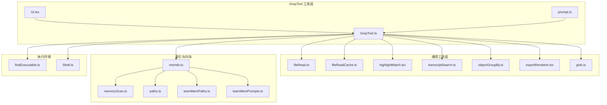
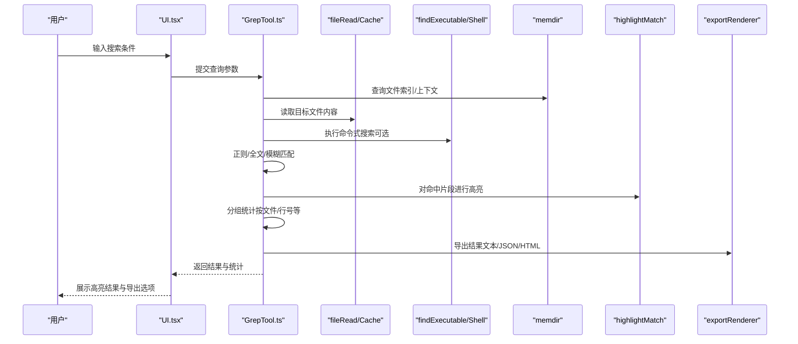
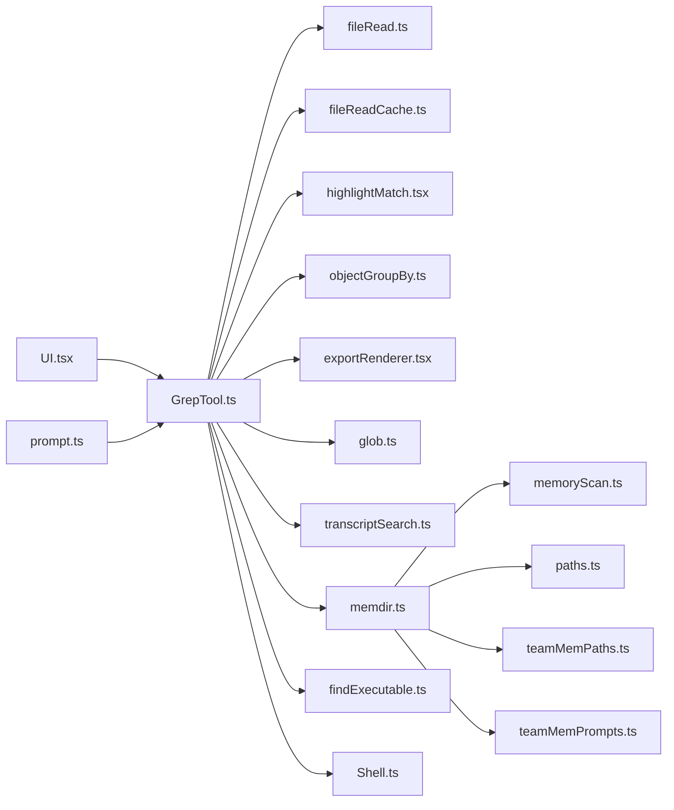

# 文本搜索工具 (GrepTool)

<cite>
**本文引用的文件**
- [GrepTool.ts](file://src/tools/GrepTool/GrepTool.ts)
- [UI.tsx](file://src/tools/GrepTool/UI.tsx)
- [prompt.ts](file://src/tools/GrepTool/prompt.ts)
- [transcriptSearch.ts](file://src/utils/transcriptSearch.ts)
- [highlightMatch.tsx](file://src/utils/highlightMatch.tsx)
- [fileRead.ts](file://src/utils/fileRead.ts)
- [fileReadCache.ts](file://src/utils/fileReadCache.ts)
- [glob.ts](file://src/utils/glob.ts)
- [objectGroupBy.ts](file://src/utils/objectGroupBy.ts)
- [exportRenderer.tsx](file://src/utils/exportRenderer.tsx)
- [memdir.ts](file://src/memdir/memdir.ts)
- [memoryScan.ts](file://src/memdir/memoryScan.ts)
- [paths.ts](file://src/memdir/paths.ts)
- [teamMemPaths.ts](file://src/memdir/teamMemPaths.ts)
- [teamMemPrompts.ts](file://src/memdir/teamMemPrompts.ts)
- [findExecutable.ts](file://src/utils/findExecutable.ts)
- [shell.ts](file://src/utils/Shell.ts)
</cite>

## 目录
1. [简介](#简介)
2. [项目结构](#项目结构)
3. [核心组件](#核心组件)
4. [架构总览](#架构总览)
5. [详细组件分析](#详细组件分析)
6. [依赖关系分析](#依赖关系分析)
7. [性能考虑](#性能考虑)
8. [故障排除指南](#故障排除指南)
9. [结论](#结论)
10. [附录](#附录)

## 简介
本文件为文本搜索工具（GrepTool）的技术文档，聚焦于其在仓库中的实现与集成关系。GrepTool 提供基于正则表达式的文本搜索能力，并与文件索引系统、内容分析工具以及 UI 组件协同工作，支持结果高亮、分组统计与导出等功能。本文将从系统架构、数据流、处理逻辑、错误处理与性能优化等维度进行深入解析。

## 项目结构
GrepTool 位于工具目录下，包含核心实现、用户界面与提示词模板；同时通过通用工具模块实现文件读取、缓存、高亮、导出、分组统计等能力；并与内存索引（memdir）模块协作以支持跨文件检索与上下文展示。

图示来源
- [GrepTool.ts](file://src/tools/GrepTool/GrepTool.ts)
- [UI.tsx](file://src/tools/GrepTool/UI.tsx)
- [prompt.ts](file://src/tools/GrepTool/prompt.ts)
- [fileRead.ts](file://src/utils/fileRead.ts)
- [fileReadCache.ts](file://src/utils/fileReadCache.ts)
- [highlightMatch.tsx](file://src/utils/highlightMatch.tsx)
- [transcriptSearch.ts](file://src/utils/transcriptSearch.ts)
- [objectGroupBy.ts](file://src/utils/objectGroupBy.ts)
- [exportRenderer.tsx](file://src/utils/exportRenderer.tsx)
- [glob.ts](file://src/utils/glob.ts)
- [memdir.ts](file://src/memdir/memdir.ts)
- [memoryScan.ts](file://src/memdir/memoryScan.ts)
- [paths.ts](file://src/memdir/paths.ts)
- [teamMemPaths.ts](file://src/memdir/teamMemPaths.ts)
- [teamMemPrompts.ts](file://src/memdir/teamMemPrompts.ts)
- [findExecutable.ts](file://src/utils/findExecutable.ts)
- [shell.ts](file://src/utils/Shell.ts)

章节来源
- [GrepTool.ts](file://src/tools/GrepTool/GrepTool.ts)
- [UI.tsx](file://src/tools/GrepTool/UI.tsx)
- [prompt.ts](file://src/tools/GrepTool/prompt.ts)

## 核心组件
- GrepTool：文本搜索主控，负责解析查询参数、选择搜索策略（正则/全文/模糊）、执行搜索、聚合结果、生成高亮与导出。
- UI：提供交互界面，收集查询输入、展示结果列表与统计信息、触发导出。
- prompt：定义与搜索任务相关的提示词模板，用于与模型或外部服务协作时的上下文组织。
- fileRead / fileReadCache：文件读取与缓存，支撑大文件与重复访问的性能优化。
- highlightMatch：对匹配片段进行高亮标记，提升可读性。
- transcriptSearch：将工具输出（如 Grep 结果）转换为可检索文本，便于跨会话检索与分析。
- objectGroupBy：按文件、行号等维度对结果进行分组统计。
- exportRenderer：将搜索结果渲染为多种格式（如文本、JSON、HTML）以便导出。
- glob：通配符匹配，辅助确定待搜索文件集合。
- memdir：内存索引与扫描，提供快速跨文件检索与上下文定位。
- findExecutable / Shell：在系统中查找可执行程序并执行命令式搜索（如 grep），作为后端执行器。

章节来源
- [GrepTool.ts](file://src/tools/GrepTool/GrepTool.ts)
- [UI.tsx](file://src/tools/GrepTool/UI.tsx)
- [prompt.ts](file://src/tools/GrepTool/prompt.ts)
- [fileRead.ts](file://src/utils/fileRead.ts)
- [fileReadCache.ts](file://src/utils/fileReadCache.ts)
- [highlightMatch.tsx](file://src/utils/highlightMatch.tsx)
- [transcriptSearch.ts](file://src/utils/transcriptSearch.ts)
- [objectGroupBy.ts](file://src/utils/objectGroupBy.ts)
- [exportRenderer.tsx](file://src/utils/exportRenderer.tsx)
- [glob.ts](file://src/utils/glob.ts)
- [memdir.ts](file://src/memdir/memdir.ts)
- [memoryScan.ts](file://src/memdir/memoryScan.ts)
- [paths.ts](file://src/memdir/paths.ts)
- [teamMemPaths.ts](file://src/memdir/teamMemPaths.ts)
- [teamMemPrompts.ts](file://src/memdir/teamMemPrompts.ts)
- [findExecutable.ts](file://src/utils/findExecutable.ts)
- [shell.ts](file://src/utils/Shell.ts)

## 架构总览
GrepTool 的运行流程围绕“查询解析—文件枚举—内容匹配—结果聚合—高亮渲染—导出统计”展开。它既可直接读取文件进行本地搜索，也可调用系统命令式搜索（如 grep）以获得更高效的全文检索能力。同时，借助 memdir 内存索引，可在大型项目中实现快速跨文件检索与上下文定位。

图示来源
- [GrepTool.ts](file://src/tools/GrepTool/GrepTool.ts)
- [UI.tsx](file://src/tools/GrepTool/UI.tsx)
- [fileRead.ts](file://src/utils/fileRead.ts)
- [fileReadCache.ts](file://src/utils/fileReadCache.ts)
- [findExecutable.ts](file://src/utils/findExecutable.ts)
- [shell.ts](file://src/utils/Shell.ts)
- [memdir.ts](file://src/memdir/memdir.ts)
- [highlightMatch.tsx](file://src/utils/highlightMatch.tsx)
- [exportRenderer.tsx](file://src/utils/exportRenderer.tsx)

## 详细组件分析

### GrepTool 实现概览
- 查询解析：接收正则表达式、全文关键词、模糊度阈值、文件过滤规则等参数，决定采用正则匹配、全文检索或模糊匹配策略。
- 文件枚举：结合 glob 通配符与 memdir 索引，确定候选文件集；对大文件启用缓存以降低 IO 压力。
- 匹配算法：优先使用高效正则引擎；对大规模文本采用分块扫描与增量匹配；必要时回退到命令式搜索（grep）。
- 结果聚合：按文件、行号、上下文窗口进行分组；统计命中次数与分布；支持多维排序与筛选。
- 高亮渲染：对每个匹配片段应用高亮样式，确保 UI 可读性。
- 导出功能：支持文本、JSON、HTML 等格式导出，便于离线分析与分享。

章节来源
- [GrepTool.ts](file://src/tools/GrepTool/GrepTool.ts)

### UI 与交互
- 输入收集：提供查询框、开关（区分大小写/全词匹配/正则/全文/模糊）、文件过滤器、上下文行数设置。
- 结果展示：列表视图与统计面板，支持点击跳转到具体文件位置。
- 导出入口：一键导出当前查询结果至指定格式。

章节来源
- [UI.tsx](file://src/tools/GrepTool/UI.tsx)

### 提示词与上下文
- prompt 模板：为与模型或外部服务协作准备上下文，包含查询意图、文件范围、结果格式要求等，确保输出稳定且可复现。

章节来源
- [prompt.ts](file://src/tools/GrepTool/prompt.ts)

### 文件读取与缓存
- fileRead：逐文件读取内容，支持编码检测与异常处理。
- fileReadCache：缓存最近访问的文件内容，减少重复 IO；结合淘汰策略控制内存占用。

章节来源
- [fileRead.ts](file://src/utils/fileRead.ts)
- [fileReadCache.ts](file://src/utils/fileReadCache.ts)

### 高亮与可视化
- highlightMatch：对匹配片段进行标记，支持多段高亮与边界处理，避免越界与重叠。

章节来源
- [highlightMatch.tsx](file://src/utils/highlightMatch.tsx)

### 跨会话检索与内容分析
- transcriptSearch：将工具输出（如 Grep 结果）转换为可检索文本，覆盖常见输出结构（stdout/stderr、content、filenames 等），便于后续跨会话检索与分析。

章节来源
- [transcriptSearch.ts](file://src/utils/transcriptSearch.ts)

### 分组统计与导出
- objectGroupBy：按文件、行号、时间等维度分组，计算命中频次与分布。
- exportRenderer：将结果序列化为多种格式，支持批量导出与自定义模板。

章节来源
- [objectGroupBy.ts](file://src/utils/objectGroupBy.ts)
- [exportRenderer.tsx](file://src/utils/exportRenderer.tsx)

### 文件索引与上下文匹配
- memdir：维护项目内文件索引与元数据，支持快速定位与上下文检索。
- memoryScan：扫描并构建索引，支持增量更新与失效策略。
- paths/teamMemPaths/teamMemPrompts：团队级路径与提示词管理，辅助跨成员检索与知识共享。

章节来源
- [memdir.ts](file://src/memdir/memdir.ts)
- [memoryScan.ts](file://src/memdir/memoryScan.ts)
- [paths.ts](file://src/memdir/paths.ts)
- [teamMemPaths.ts](file://src/memdir/teamMemPaths.ts)
- [teamMemPrompts.ts](file://src/memdir/teamMemPrompts.ts)

### 命令式搜索与执行环境
- findExecutable：在系统 PATH 中查找可执行程序（如 grep），确保跨平台兼容。
- Shell：封装命令执行、超时控制、错误捕获与输出解析，作为 GrepTool 的后备执行器。

章节来源
- [findExecutable.ts](file://src/utils/findExecutable.ts)
- [shell.ts](file://src/utils/Shell.ts)

## 依赖关系分析
GrepTool 的耦合主要体现在以下方面：
- 低耦合：与 UI、提示词、导出模块通过接口解耦，便于替换与扩展。
- 中等耦合：与文件读取、缓存、高亮、分组统计等工具模块紧密协作，形成稳定的处理链。
- 外部依赖：依赖系统命令（如 grep）与文件系统，需处理跨平台差异与权限问题。
- 索引依赖：与 memdir 索引系统强关联，提升大规模项目的检索效率。

图示来源
- [GrepTool.ts](file://src/tools/GrepTool/GrepTool.ts)
- [UI.tsx](file://src/tools/GrepTool/UI.tsx)
- [prompt.ts](file://src/tools/GrepTool/prompt.ts)
- [fileRead.ts](file://src/utils/fileRead.ts)
- [fileReadCache.ts](file://src/utils/fileReadCache.ts)
- [highlightMatch.tsx](file://src/utils/highlightMatch.tsx)
- [transcriptSearch.ts](file://src/utils/transcriptSearch.ts)
- [objectGroupBy.ts](file://src/utils/objectGroupBy.ts)
- [exportRenderer.tsx](file://src/utils/exportRenderer.tsx)
- [glob.ts](file://src/utils/glob.ts)
- [memdir.ts](file://src/memdir/memdir.ts)
- [memoryScan.ts](file://src/memdir/memoryScan.ts)
- [paths.ts](file://src/memdir/paths.ts)
- [teamMemPaths.ts](file://src/memdir/teamMemPaths.ts)
- [teamMemPrompts.ts](file://src/memdir/teamMemPrompts.ts)
- [findExecutable.ts](file://src/utils/findExecutable.ts)
- [shell.ts](file://src/utils/Shell.ts)

## 性能考虑
- 文件读取与缓存
  - 使用 fileReadCache 缓存热点文件，减少重复 IO；对大文件采用分块读取与流式处理。
  - 合理设置缓存容量与淘汰策略，避免内存峰值过高。
- 正则与全文匹配
  - 优先使用编译后的正则表达式；对简单模式采用字符串内置方法以降低开销。
  - 全文检索可回退到命令式搜索（如 grep），利用系统优化提升吞吐量。
- 分组与统计
  - 使用 objectGroupBy 进行原地聚合，避免多次遍历；对高频字段建立索引。
- 导出与渲染
  - 导出前进行数据压缩与分页；高亮渲染仅针对可见区域，滚动时动态计算。
- 索引与上下文
  - 利用 memdir 快速定位候选文件；对频繁访问的文件建立内存索引，减少磁盘扫描。
- 并发与异步
  - 文件读取与匹配过程采用并发策略，但需限制并发度以避免 CPU/IO 抢占。
- 内存管理
  - 控制单次查询结果规模；及时释放临时对象与缓存；对长生命周期数据进行弱引用或延迟回收。

## 故障排除指南
- 查询无结果
  - 检查查询语法（正则/全文/模糊）与大小写敏感设置；确认文件过滤规则未过度收紧。
  - 若使用命令式搜索，确认系统已安装对应工具（如 grep）且可执行权限正常。
- 性能过慢
  - 减少文件范围（缩小 glob 范围）；关闭不必要的高亮与导出；启用缓存。
  - 将复杂正则简化为字符串匹配或使用更精确的通配符。
- 内存占用过高
  - 限制并发度与结果集大小；清理缓存；避免一次性加载所有文件。
- 结果不完整
  - 检查文件编码与换行符；确认未被忽略的二进制或大文件；核对索引是否最新。
- 导出失败
  - 检查目标路径权限与磁盘空间；尝试较小的数据集验证导出流程。

章节来源
- [GrepTool.ts](file://src/tools/GrepTool/GrepTool.ts)
- [fileRead.ts](file://src/utils/fileRead.ts)
- [fileReadCache.ts](file://src/utils/fileReadCache.ts)
- [findExecutable.ts](file://src/utils/findExecutable.ts)
- [shell.ts](file://src/utils/Shell.ts)

## 结论
GrepTool 在本仓库中通过模块化设计实现了灵活而高效的文本搜索能力。它结合本地文件读取、命令式搜索、内存索引与高亮渲染，满足从日常开发到大规模项目检索的多样化需求。配合分组统计与导出功能，能够有效支撑问题排查、知识沉淀与团队协作。

## 附录

### 复杂搜索模式编写指南
- 正则表达式
  - 使用锚点与单词边界限定匹配范围；避免回溯陷阱（如嵌套量词）；优先使用非贪婪匹配。
  - 对多行匹配启用跨行标志，注意性能影响。
- 全文检索
  - 关键词短语建议加引号；使用布尔操作（AND/OR/NOT）组合多个条件。
  - 针对特定语言可启用大小写折叠与词干提取（若后端支持）。
- 模糊匹配
  - 设置合理的编辑距离阈值；对高频误报词添加排除规则。
- 文件过滤
  - 使用 glob 精确限定文件类型与路径；排除临时/缓存/二进制文件。

### 性能优化技巧
- 读取与匹配
  - 优先使用缓存；对大文件采用分块与增量匹配；减少正则回溯。
- 并发与资源
  - 控制并发度；限制结果集大小；及时释放中间结果。
- 索引与上下文
  - 定期重建索引；增量更新；按需加载上下文。

### 内存管理策略
- 缓存策略：LRU 淘汰、容量上限、失效时间。
- 数据结构：优先使用迭代器与流式处理；避免一次性构建超大数据结构。
- 生命周期：明确对象作用域，及时释放监听与定时器。