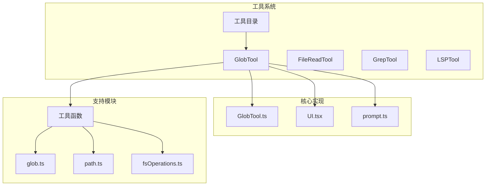
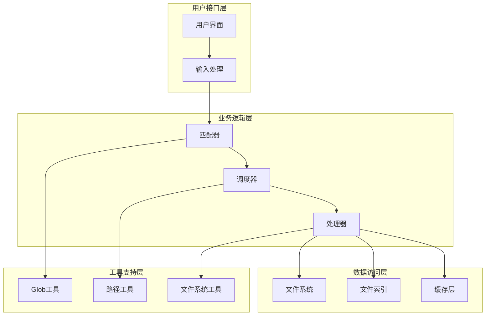
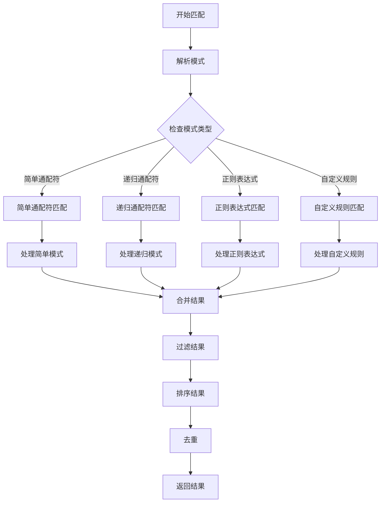
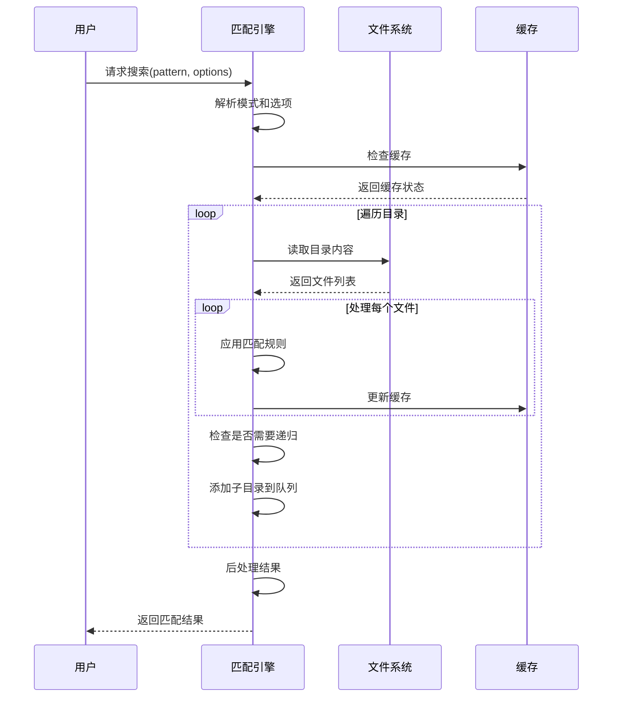
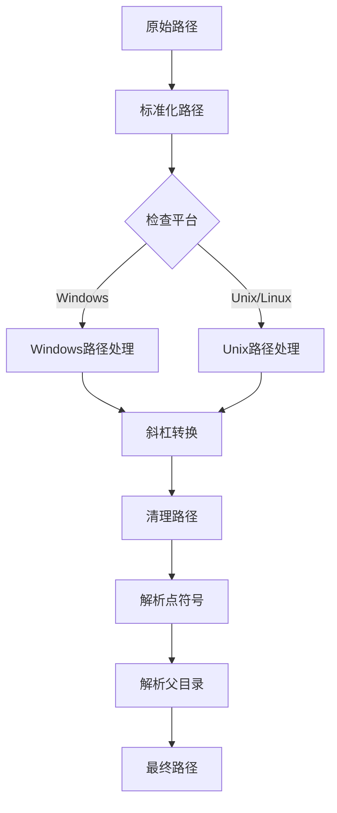
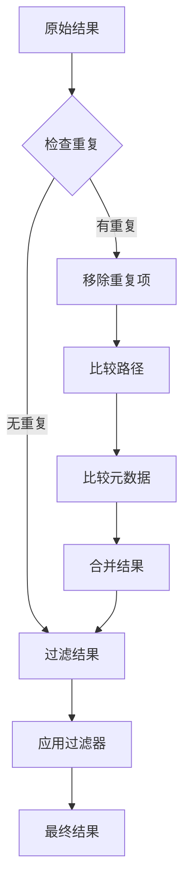
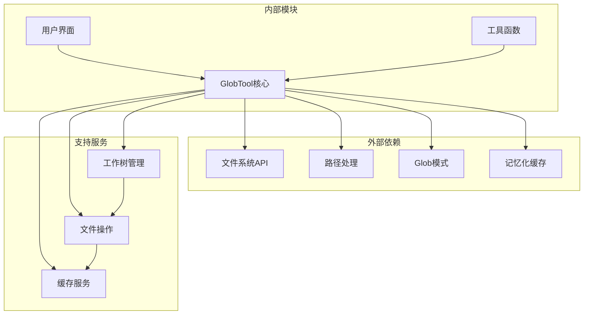
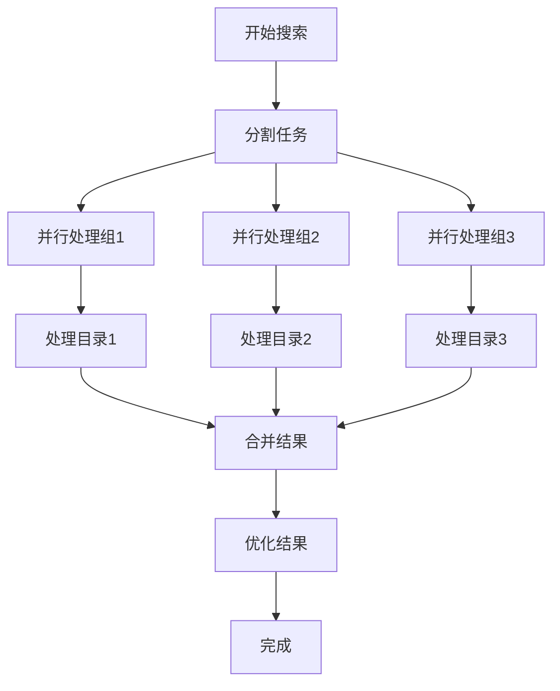
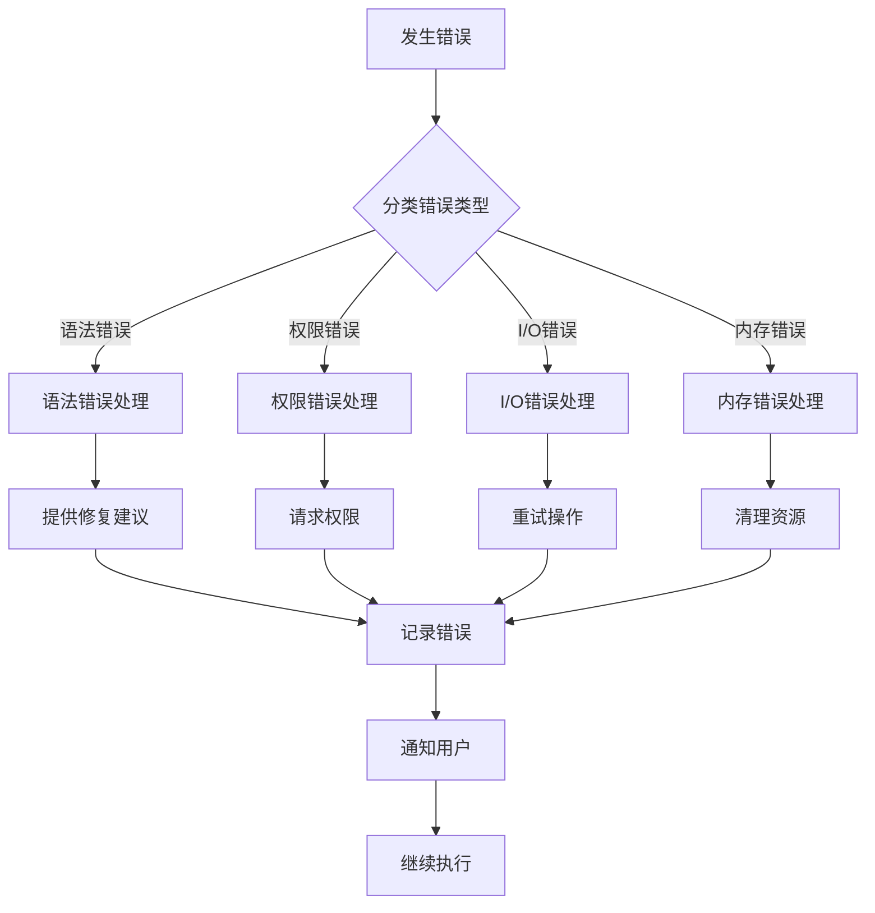

# 通配符匹配工具 (GlobTool)

<cite>
**本文档引用的文件**
- [GlobTool.ts](file://src/tools/GlobTool/GlobTool.ts)
- [UI.tsx](file://src/tools/GlobTool/UI.tsx)
- [prompt.ts](file://src/tools/GlobTool/prompt.ts)
- [glob.ts](file://src/utils/glob.ts)
- [windowsPaths.ts](file://src/utils/windowsPaths.ts)
- [worktree.ts](file://src/utils/worktree.ts)
- [file.ts](file://src/utils/file.ts)
- [path.ts](file://src/utils/path.ts)
- [fsOperations.ts](file://src/utils/fsOperations.ts)
- [memoize.ts](file://src/utils/memoize.ts)
</cite>

## 目录
1. [简介](#简介)
2. [项目结构](#项目结构)
3. [核心组件](#核心组件)
4. [架构概览](#架构概览)
5. [详细组件分析](#详细组件分析)
6. [依赖关系分析](#依赖关系分析)
7. [性能考虑](#性能考虑)
8. [故障排除指南](#故障排除指南)
9. [结论](#结论)
10. [附录](#附录)

## 简介

通配符匹配工具（GlobTool）是 Claude Code 平台中的一个强大文件搜索和匹配组件。该工具实现了多种文件模式匹配策略，包括 POSIX 风格通配符、正则表达式模式和自定义匹配规则。GlobTool 提供了高效的文件路径解析、目录遍历和递归搜索算法，支持复杂的匹配模式构建，并具备智能的排序、去重和过滤机制。

该工具在文件索引系统和搜索工具中发挥着关键作用，为用户提供直观的文件搜索体验，同时确保高性能和准确性。

## 项目结构

GlobTool 作为 Claude Code 工具系统的一部分，位于工具目录结构中：

**图表来源**
- [GlobTool.ts](file://src/tools/GlobTool/GlobTool.ts)
- [UI.tsx](file://src/tools/GlobTool/UI.tsx)
- [glob.ts](file://src/utils/glob.ts)
- [path.ts](file://src/utils/path.ts)

**章节来源**
- [GlobTool.ts](file://src/tools/GlobTool/GlobTool.ts)
- [UI.tsx](file://src/tools/GlobTool/UI.tsx)
- [prompt.ts](file://src/tools/GlobTool/prompt.ts)

## 核心组件

### GlobTool 主控制器

GlobTool 的核心实现位于 GlobTool.ts 文件中，负责协调整个匹配流程：

- **模式解析器**: 处理各种类型的匹配模式
- **路径处理器**: 解析和标准化文件路径
- **搜索调度器**: 协调不同搜索策略的执行
- **结果处理器**: 对匹配结果进行排序、去重和过滤

### 用户界面组件

UI.tsx 提供了直观的用户交互界面：

- **模式输入控件**: 支持多种模式类型的选择和输入
- **搜索结果展示**: 清晰的结果列表和详细信息
- **实时预览**: 实时显示匹配进度和结果数量
- **配置选项**: 允许用户调整搜索行为和过滤条件

### 提示工程模块

prompt.ts 实现了智能的提示生成和上下文理解：

- **模式建议**: 基于用户历史和项目结构提供模式建议
- **上下文感知**: 根据当前工作环境调整搜索策略
- **错误恢复**: 智能处理无效或冲突的模式组合

**章节来源**
- [GlobTool.ts](file://src/tools/GlobTool/GlobTool.ts)
- [UI.tsx](file://src/tools/GlobTool/UI.tsx)
- [prompt.ts](file://src/tools/GlobTool/prompt.ts)

## 架构概览

GlobTool 采用分层架构设计，确保了模块化和可扩展性：

**图表来源**
- [GlobTool.ts](file://src/tools/GlobTool/GlobTool.ts)
- [glob.ts](file://src/utils/glob.ts)
- [path.ts](file://src/utils/path.ts)
- [fsOperations.ts](file://src/utils/fsOperations.ts)

## 详细组件分析

### 模式匹配引擎

GlobTool 的模式匹配引擎支持多种匹配策略：

#### POSIX 通配符支持

POSIX 风格的通配符匹配是 GlobTool 的基础功能：

**图表来源**
- [GlobTool.ts](file://src/tools/GlobTool/GlobTool.ts)
- [glob.ts](file://src/utils/glob.ts)

#### 递归搜索算法

GlobTool 实现了高效的递归搜索算法，支持深度优先和广度优先两种策略：

**图表来源**
- [GlobTool.ts](file://src/tools/GlobTool/GlobTool.ts)
- [fsOperations.ts](file://src/utils/fsOperations.ts)

**章节来源**
- [GlobTool.ts](file://src/tools/GlobTool/GlobTool.ts)
- [glob.ts](file://src/utils/glob.ts)

### 路径解析和处理

GlobTool 提供了强大的路径解析能力，支持跨平台兼容性：

#### 路径标准化

**图表来源**
- [path.ts](file://src/utils/path.ts)
- [windowsPaths.ts](file://src/utils/windowsPaths.ts)

#### 跨平台兼容性

GlobTool 通过专门的工具函数处理不同操作系统的路径差异：

- **Windows 路径转换**: 支持 UNC 路径、Cygwin 和 MSYS2 格式
- **路径分隔符处理**: 统一处理正斜杠和反斜杠
- **驱动器字母处理**: 正确识别和处理驱动器盘符

**章节来源**
- [path.ts](file://src/utils/path.ts)
- [windowsPaths.ts](file://src/utils/windowsPaths.ts)

### 结果处理和优化

#### 排序机制

GlobTool 实现了多维度的结果排序：

- **相关性排序**: 基于模式匹配度和文件重要性
- **位置排序**: 按文件在项目中的位置排序
- **时间排序**: 按文件修改时间排序
- **名称排序**: 按文件名字母顺序排序

#### 去重策略

**图表来源**
- [GlobTool.ts](file://src/tools/GlobTool/GlobTool.ts)

#### 过滤机制

GlobTool 提供灵活的过滤选项：

- **大小过滤**: 基于文件大小范围过滤
- **类型过滤**: 按文件扩展名或 MIME 类型过滤
- **内容过滤**: 基于文件内容特征过滤
- **时间过滤**: 按修改时间范围过滤

**章节来源**
- [GlobTool.ts](file://src/tools/GlobTool/GlobTool.ts)

## 依赖关系分析

GlobTool 的依赖关系体现了清晰的模块化设计：

**图表来源**
- [GlobTool.ts](file://src/tools/GlobTool/GlobTool.ts)
- [worktree.ts](file://src/utils/worktree.ts)
- [fsOperations.ts](file://src/utils/fsOperations.ts)
- [memoize.ts](file://src/utils/memoize.ts)

**章节来源**
- [GlobTool.ts](file://src/tools/GlobTool/GlobTool.ts)
- [worktree.ts](file://src/utils/worktree.ts)
- [fsOperations.ts](file://src/utils/fsOperations.ts)
- [memoize.ts](file://src/utils/memoize.ts)

## 性能考虑

### 缓存策略

GlobTool 实现了多层次的缓存机制：

- **模式编译缓存**: 缓存已编译的模式以避免重复编译
- **结果缓存**: 缓存最近的搜索结果以提高响应速度
- **路径解析缓存**: 缓存路径解析结果减少重复计算
- **文件元数据缓存**: 缓存文件属性信息避免频繁 I/O 操作

### 并行处理

### 内存管理

- **流式处理**: 对大型结果集采用流式处理避免内存溢出
- **增量加载**: 支持结果的增量加载和显示
- **垃圾回收**: 及时释放不再使用的资源和缓存

## 故障排除指南

### 常见问题诊断

#### 模式匹配失败

当遇到模式匹配问题时，可以按照以下步骤进行诊断：

1. **验证模式语法**: 检查通配符语法是否正确
2. **检查路径格式**: 确认路径分隔符和平台兼容性
3. **确认权限设置**: 验证对目标目录的访问权限
4. **查看日志输出**: 分析详细的错误信息和调试日志

#### 性能问题

如果搜索操作响应缓慢，可以采取以下措施：

- **启用缓存**: 确保缓存功能正常工作
- **优化模式**: 使用更精确的模式减少搜索范围
- **限制搜索深度**: 设置合理的递归深度限制
- **清理缓存**: 定期清理过期的缓存数据

### 错误处理机制

GlobTool 实现了完善的错误处理和恢复机制：

**图表来源**
- [GlobTool.ts](file://src/tools/GlobTool/GlobTool.ts)

**章节来源**
- [GlobTool.ts](file://src/tools/GlobTool/GlobTool.ts)

## 结论

GlobTool 作为一个功能完整的通配符匹配工具，在 Claude Code 平台中展现了卓越的设计和实现质量。其多层架构确保了良好的可维护性和扩展性，而高效的算法和优化策略保证了出色的性能表现。

通过支持多种匹配模式、智能的路径处理和强大的结果管理功能，GlobTool 为用户提供了直观且高效的文件搜索体验。同时，其与文件索引系统和搜索工具的紧密集成，进一步提升了整体的开发效率和工作流程质量。

未来的发展方向包括进一步优化大规模项目的搜索性能、增强机器学习驱动的模式建议功能，以及提供更加丰富的自定义匹配规则支持。

## 附录

### 复杂匹配模式构建指南

#### 高级通配符技巧

- **嵌套通配符**: 使用多个层级的 `**` 实现深度匹配
- **字符类组合**: 利用 `[]` 定义复杂的字符匹配规则
- **反向匹配**: 使用 `!` 排除特定模式的文件
- **分组和选择**: 通过 `()` 和 `|` 创建复杂的匹配逻辑

#### 性能优化最佳实践

- **使用具体模式**: 优先使用具体的文件扩展名而非通用模式
- **限制搜索范围**: 通过前缀匹配缩小搜索区域
- **合理使用缓存**: 充分利用内置缓存机制提升重复查询性能
- **避免过度递归**: 控制递归深度防止性能下降

### 与文件索引系统的协作

GlobTool 与文件索引系统的协作关系体现在：

- **索引查询**: 直接查询预构建的文件索引获取初始结果
- **增量更新**: 监听文件系统变化同步更新索引
- **智能合并**: 将索引结果与实时搜索结果智能合并
- **缓存同步**: 确保索引缓存与文件系统状态保持一致